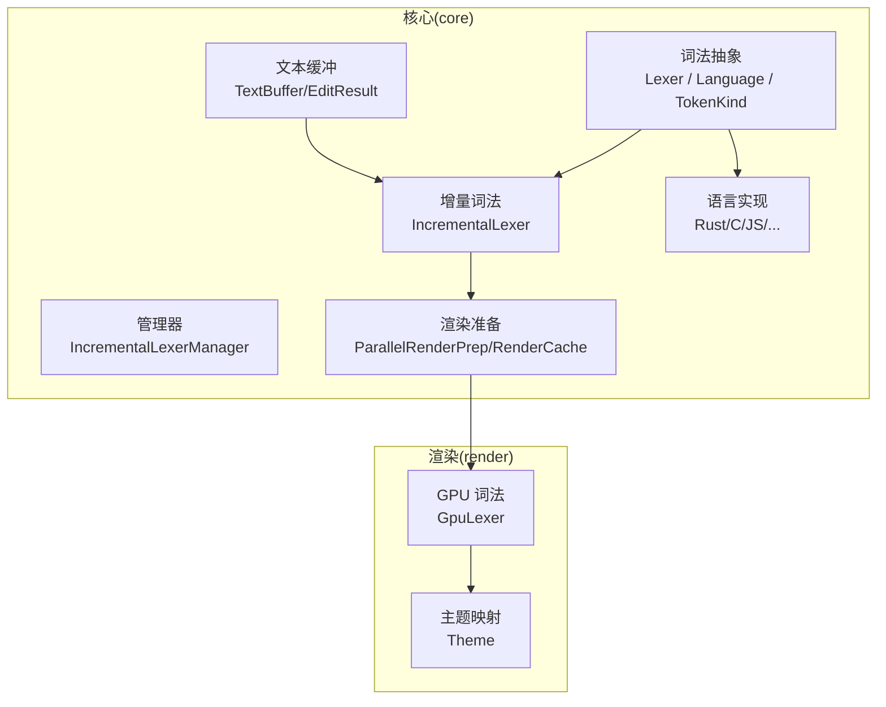
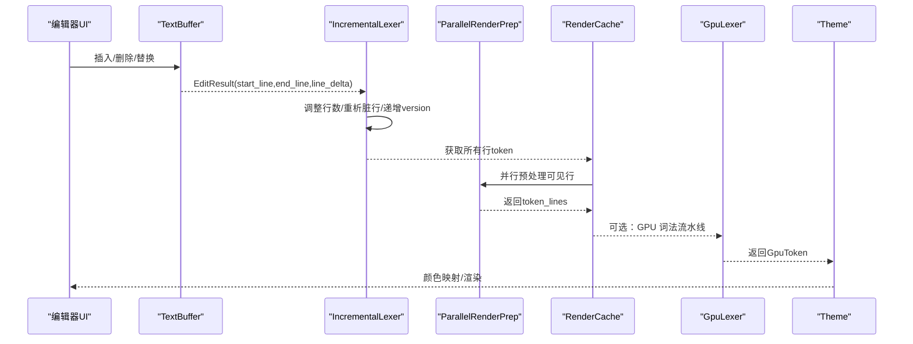
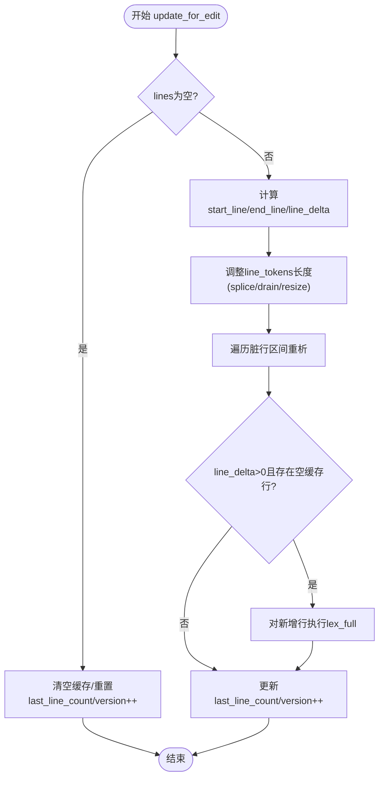
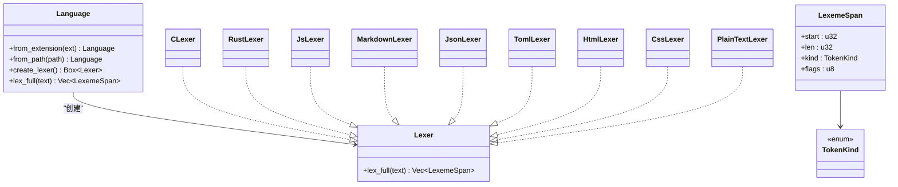
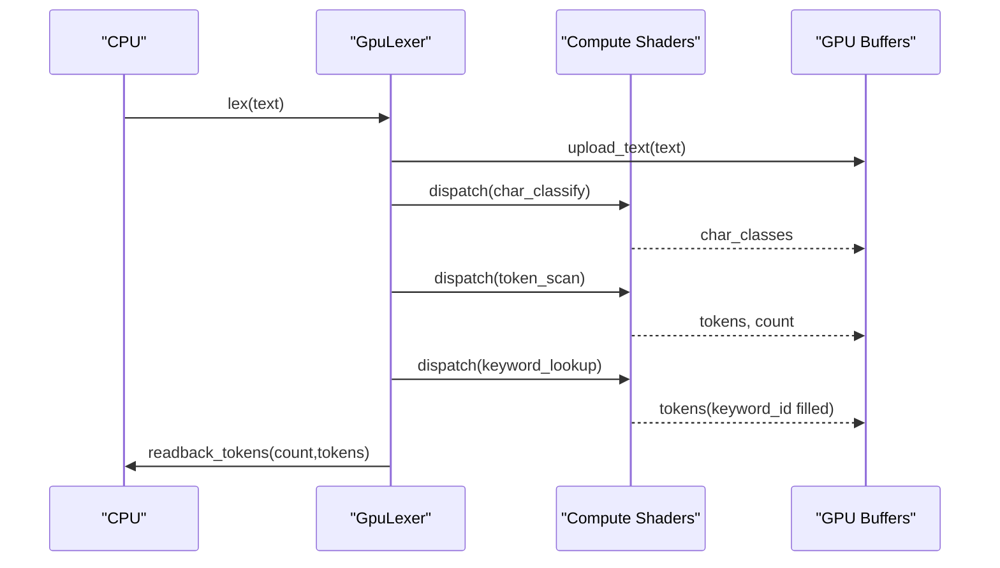
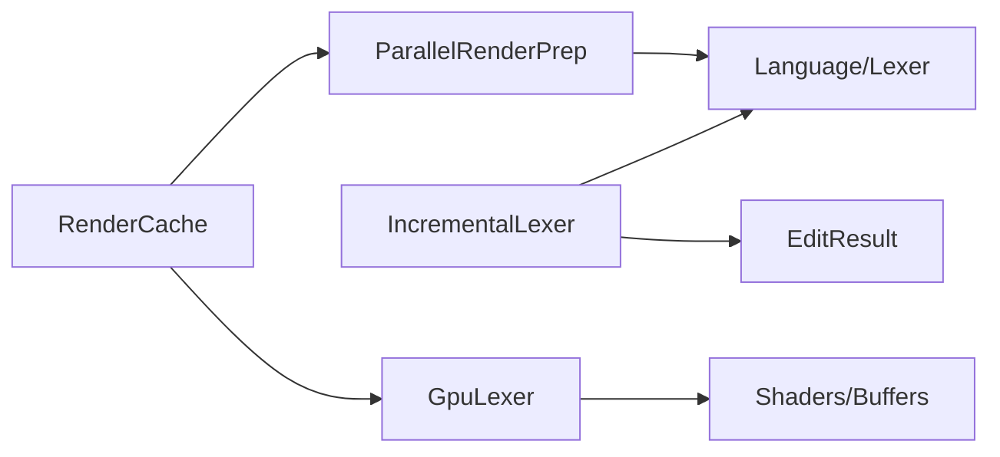

# 增量词法分析器

<cite>
**本文引用的文件**
- [incremental_lexer.rs](file://crates/aether-core/src/incremental_lexer.rs)
- [mod.rs（词法模块）](file://crates/aether-core/src/lexer/mod.rs)
- [common.rs（通用工具）](file://crates/aether-core/src/lexer/common.rs)
- [rust_lexer.rs](file://crates/aether-core/src/lexer/rust_lexer.rs)
- [c_lexer.rs](file://crates/aether-core/src/lexer/c_lexer.rs)
- [text_buffer.rs](file://crates/aether-core/src/buffer/text_buffer.rs)
- [render_prep.rs](file://crates/aether-core/src/render_prep.rs)
- [lexer.rs（GPU 词法）](file://crates/aether-render/src/gpu/lexer.rs)
</cite>

## 目录
1. [简介](#简介)
2. [项目结构](#项目结构)
3. [核心组件](#核心组件)
4. [架构总览](#架构总览)
5. [详细组件分析](#详细组件分析)
6. [依赖关系分析](#依赖关系分析)
7. [性能考量](#性能考量)
8. [故障排查指南](#故障排查指南)
9. [结论](#结论)
10. [附录：集成与扩展示例](#附录集成与扩展示例)

## 简介
本文件面向“增量词法分析器”的完整技术文档，聚焦以下目标：
- 工作原理：行级缓存、编辑影响范围计算、版本失效机制。
- 状态管理：每行 token 缓存、管理器多文件生命周期、容量上限保护。
- 性能优化：增量更新、并行预处理、GPU 加速路径、内存布局与数据结构选择。
- 多语言支持：统一 Token 类型、语言检测、可扩展的词法规则与扩展点。
- 渲染协作：与渲染管线的数据契约、可见行缓存、主题映射。
- 错误处理：边界安全、非法 UTF-8、未闭合注释等异常场景的处理策略。

## 项目结构
增量词法分析位于 aether-core 的 lexer 子模块，并通过 buffer 层提供编辑结果；渲染侧在 aether-render 中提供 GPU 加速路径与主题映射。关键组织方式如下：
- 词法抽象与实现：Lexer trait、TokenKind、Language、各语言 Lexer 实现。
- 增量管理器：IncrementalLexer 与 IncrementalLexerManager。
- 文本缓冲区：EditResult 描述编辑影响的行范围。
- 渲染准备：ParallelRenderPrep 与 RenderCache。
- GPU 词法：GpuLexer 三阶段流水线（字符分类、Token 扫描、关键字查找）。

图表来源
- [incremental_lexer.rs:1-129](file://crates/aether-core/src/incremental_lexer.rs#L1-L129)
- [mod.rs（词法模块）:1-196](file://crates/aether-core/src/lexer/mod.rs#L1-L196)
- [text_buffer.rs:142-171](file://crates/aether-core/src/buffer/text_buffer.rs#L142-L171)
- [render_prep.rs:1-131](file://crates/aether-core/src/render_prep.rs#L1-L131)
- [lexer.rs（GPU 词法）:48-221](file://crates/aether-render/src/gpu/lexer.rs#L48-L221)

章节来源
- [incremental_lexer.rs:1-129](file://crates/aether-core/src/incremental_lexer.rs#L1-L129)
- [mod.rs（词法模块）:1-196](file://crates/aether-core/src/lexer/mod.rs#L1-L196)
- [text_buffer.rs:142-171](file://crates/aether-core/src/buffer/text_buffer.rs#L142-L171)
- [render_prep.rs:1-131](file://crates/aether-core/src/render_prep.rs#L1-L131)
- [lexer.rs（GPU 词法）:48-221](file://crates/aether-render/src/gpu/lexer.rs#L48-L221)

## 核心组件
- 增量词法分析器（IncrementalLexer）
  - 维护每行的 token 缓存（Vec<Vec<LexemeSpan>>），按行号直接索引，O(1) 访问。
  - 通过 EditResult 精确计算受影响的行区间，仅对脏行重新分析。
  - 使用版本号 version 进行缓存失效判断。
- 增量管理器（IncrementalLexerManager）
  - 以文件路径为键缓存多个文件的增量词法器。
  - 限制最大缓存文件数，避免长时间运行后无界增长。
- 词法抽象（Lexer/Language/TokenKind）
  - 统一跨语言的 Token 类型与语言检测。
  - 提供 create_lexer 与 lex_full 两种调用路径（动态与静态分发）。
- 文本缓冲（TextBuffer/EditResult）
  - 提供编辑操作与受影响行范围的计算，供增量词法器消费。
- 渲染准备（ParallelRenderPrep/RenderCache）
  - 并行预处理可见行 token，减少主线程开销。
  - 缓存可见行文本与 token，配合版本控制避免重复计算。
- GPU 词法（GpuLexer）
  - 三阶段 Compute Shader 流水线：字符分类、Token 扫描、关键字查找。
  - 将 DFA 表与关键字哈希表上传至 GPU，批量处理文本并回读结果。

章节来源
- [incremental_lexer.rs:1-129](file://crates/aether-core/src/incremental_lexer.rs#L1-L129)
- [mod.rs（词法模块）:1-196](file://crates/aether-core/src/lexer/mod.rs#L1-L196)
- [text_buffer.rs:142-171](file://crates/aether-core/src/buffer/text_buffer.rs#L142-L171)
- [render_prep.rs:1-131](file://crates/aether-core/src/render_prep.rs#L1-L131)
- [lexer.rs（GPU 词法）:48-221](file://crates/aether-render/src/gpu/lexer.rs#L48-L221)

## 架构总览
增量词法分析的整体流程：
- 编辑事件触发：TextBuffer 产生 EditResult，包含 start_line、end_line、line_delta。
- 增量更新：IncrementalLexer.update_for_edit 根据 EditResult 调整缓存并仅重析脏行。
- 渲染准备：ParallelRenderPrep 对可见行并行生成 token，RenderCache 缓存结果。
- GPU 加速：GpuLexer 将文本上传至 GPU，执行三阶段流水线，回读 token 列表。
- 主题映射：Theme 根据 TokenKind 映射到具体颜色，完成高亮渲染。

图表来源
- [text_buffer.rs:142-171](file://crates/aether-core/src/buffer/text_buffer.rs#L142-L171)
- [incremental_lexer.rs:36-101](file://crates/aether-core/src/incremental_lexer.rs#L36-L101)
- [render_prep.rs:32-60](file://crates/aether-core/src/render_prep.rs#L32-L60)
- [lexer.rs（GPU 词法）:187-221](file://crates/aether-render/src/gpu/lexer.rs#L187-L221)

## 详细组件分析

### 增量词法分析器（IncrementalLexer）
- 设计要点
  - 行级缓存：Vec<Vec<LexemeSpan>>，行号即索引，连续内存布局，利于缓存命中与迭代。
  - 编辑影响范围：基于 EditResult.start_line/end_line/line_delta，精准定位脏行。
  - 版本控制：每次更新递增 version，用于上层缓存失效检测。
- 算法流程
  - 全量分析：首次打开文件时，逐行调用语言 Lexer.lex_full。
  - 增量更新：先调整 Vec 长度（splice/drain/resize），再对脏行重析，必要时分析新增行。
- 复杂度
  - 单行分析 O(n)，n 为行字节长度；增量更新仅对脏行执行，整体近似 O(k + m)，k 为脏行总数，m 为新增行总数。
- 边界与安全
  - 空文本快速返回；行号越界保护；line_delta 正负分支分别处理插入/删除。

图表来源
- [incremental_lexer.rs:36-101](file://crates/aether-core/src/incremental_lexer.rs#L36-L101)

章节来源
- [incremental_lexer.rs:1-129](file://crates/aether-core/src/incremental_lexer.rs#L1-L129)

### 增量管理器（IncrementalLexerManager）
- 职责
  - 管理多个文件的增量词法器实例，跟踪当前文件。
  - 限制缓存文件数量，超过阈值时清空，防止内存无界增长。
- 接口
  - open_file/close_file/switch_file/current_lexer/clear_all。
- 适用场景
  - 多标签页切换、大文件编辑、频繁打开关闭文件。

章节来源
- [incremental_lexer.rs:131-187](file://crates/aether-core/src/incremental_lexer.rs#L131-L187)

### 词法抽象与语言实现（Lexer/Language/TokenKind）
- 统一 Token 类型
  - TokenKind 覆盖关键字、标识符、字符串、数字、注释、运算符、分隔符、预处理、属性、类型名、函数名、宏、生命周期、泛型、正则、格式化字符串、Markdown 标题/链接/代码/强调、JSON 键、TOML 表头、空白、换行、未知、EOF。
- 语言检测与创建
  - Language::from_extension/from_path 根据扩展名或路径推断语言。
  - create_lexer 返回 Box<dyn Lexer>；lex_full 提供静态分发，避免动态分配与虚调用开销。
- 语言实现
  - Rust/C/Python/JS/TS/Go/Java/Json/Markdown/Toml/Html/Css/PlainText/Image。
  - 公共工具：common.rs 提供 skip_whitespace/skip_line_comment/skip_block_comment/skip_quoted/skip_identifier_* 等复用逻辑。

图表来源
- [mod.rs（词法模块）:1-196](file://crates/aether-core/src/lexer/mod.rs#L1-L196)
- [c_lexer.rs:1-119](file://crates/aether-core/src/lexer/c_lexer.rs#L1-L119)
- [rust_lexer.rs:1-167](file://crates/aether-core/src/lexer/rust_lexer.rs#L1-L167)

章节来源
- [mod.rs（词法模块）:1-196](file://crates/aether-core/src/lexer/mod.rs#L1-L196)
- [common.rs:1-151](file://crates/aether-core/src/lexer/common.rs#L1-L151)
- [c_lexer.rs:1-200](file://crates/aether-core/src/lexer/c_lexer.rs#L1-L200)
- [rust_lexer.rs:1-167](file://crates/aether-core/src/lexer/rust_lexer.rs#L1-L167)

### 文本缓冲与编辑结果（TextBuffer/EditResult）
- TextBuffer 抽象
  - 提供 insert/delete/slice/full_text/line_count/byte_len/line_text/line_byte_range/line_col_to_byte/byte_to_line_col/create_snapshot/save_state/restore_state。
- EditResult
  - 记录 start_line、end_line、line_delta，用于增量词法器的脏行计算。
  - merge 方法支持批量编辑合并。

章节来源
- [text_buffer.rs:1-171](file://crates/aether-core/src/buffer/text_buffer.rs#L1-L171)

### 渲染准备与缓存（ParallelRenderPrep/RenderCache）
- ParallelRenderPrep
  - 当行数较少或线程池不足时退化为单线程；否则使用 rayon 并行 map-reduce 处理可见行。
- RenderCache
  - 缓存可见行文本与 token_lines，以及 start_line/end_line/version，避免重复计算。

章节来源
- [render_prep.rs:1-131](file://crates/aether-core/src/render_prep.rs#L1-L131)

### GPU 词法分析（GpuLexer）
- 三阶段流水线
  - Phase 1 字符分类：将输入文本按字符类别写入工作缓冲区。
  - Phase 2 Token 扫描：基于字符类别识别 token 并写入结构化缓冲区。
  - Phase 3 关键字查找：利用关键字完美哈希表填充 keyword_id。
- 资源管理
  - DFA 表与关键字哈希表作为常量缓冲区持久化。
  - 工作缓冲区按需扩容，UAV/计数器用于并发写入与计数。
- 数据回读
  - 读取 token 数量与列表，转换为 CPU 侧 Vec<GpuToken>。

图表来源
- [lexer.rs（GPU 词法）:187-221](file://crates/aether-render/src/gpu/lexer.rs#L187-L221)
- [lexer.rs（GPU 词法）:230-401](file://crates/aether-render/src/gpu/lexer.rs#L230-L401)

章节来源
- [lexer.rs（GPU 词法）:48-221](file://crates/aether-render/src/gpu/lexer.rs#L48-L221)
- [lexer.rs（GPU 词法）:230-401](file://crates/aether-render/src/gpu/lexer.rs#L230-L401)

## 依赖关系分析
- 耦合与内聚
  - IncrementalLexer 依赖 Language/Lexer 与 TextBuffer/EditResult，内聚于行级缓存与增量更新逻辑。
  - Language 聚合各语言 Lexer 实现，提供统一入口。
  - RenderCache 与 ParallelRenderPrep 解耦于具体语言，仅消费 Token 序列。
  - GpuLexer 依赖底层 GPU 上下文与着色器，独立于 CPU 词法实现。
- 外部依赖
  - Windows Direct3D11 API（GPU 词法）。
  - rayon 并行库（渲染准备）。
- 潜在循环依赖
  - 当前结构清晰分层，未见循环导入；Language 与 Lexer 之间为单向依赖。

图表来源
- [incremental_lexer.rs:1-129](file://crates/aether-core/src/incremental_lexer.rs#L1-L129)
- [render_prep.rs:1-131](file://crates/aether-core/src/render_prep.rs#L1-L131)
- [lexer.rs（GPU 词法）:48-221](file://crates/aether-render/src/gpu/lexer.rs#L48-L221)

章节来源
- [incremental_lexer.rs:1-129](file://crates/aether-core/src/incremental_lexer.rs#L1-L129)
- [render_prep.rs:1-131](file://crates/aether-core/src/render_prep.rs#L1-L131)
- [lexer.rs（GPU 词法）:48-221](file://crates/aether-render/src/gpu/lexer.rs#L48-L221)

## 性能考量
- 增量更新
  - 仅对脏行重析，避免全量扫描；Vec 的 splice/drain/resize 比 HashMap 重建更高效。
- 并行预处理
  - 使用 rayon 并行 map-reduce，自动分块与线程池复用，降低线程创建销毁开销。
- 内存布局
  - LexemeSpan 压缩字段，单行偏移与长度使用 u32，减少内存占用。
  - line_tokens 使用 Vec<Vec<LexemeSpan>>，连续内存布局提升缓存局部性。
- GPU 加速
  - 三阶段 Compute Shader 流水线，批量处理文本；DFA 表与关键字哈希表常驻 GPU。
  - 工作缓冲区按需扩容，UAV 计数器避免溢出。
- 缓存策略
  - IncrementalLexer.version 与 RenderCache.version 双重失效检测，避免重复计算。
  - IncrementalLexerManager 限制最大缓存文件数，防止内存泄漏。

[本节为通用性能讨论，不直接分析具体文件]

## 故障排查指南
- 常见错误与处理
  - 空文本：IncrementalLexer.update_for_edit 快速返回，避免无效计算。
  - 行号越界：update_for_edit 中对 end_line 进行 saturating_sub/min 保护。
  - 非法 UTF-8：utf8_char_len 对非法首字节返回 1，保证至少前进一步，避免死循环。
  - 未闭合注释：RustLexer 的 skip_block_comment 在未闭合时将 i 推进到末尾，避免残留 token。
  - 数字解析歧义：C/Rust 的 skip_number 对进制前缀与后缀进行严格校验，避免误识别。
- 调试建议
  - 使用 cache_stats 检查缓存命中率与行数一致性。
  - 通过测试用例验证关键字、注释、字符串、数字、操作符等分类正确性。
  - 在 GPU 路径中，确认缓冲区大小与 UAV 配置，避免读写越界。

章节来源
- [incremental_lexer.rs:36-101](file://crates/aether-core/src/incremental_lexer.rs#L36-L101)
- [mod.rs（词法模块）:233-243](file://crates/aether-core/src/lexer/mod.rs#L233-L243)
- [rust_lexer.rs:275-295](file://crates/aether-core/src/lexer/rust_lexer.rs#L275-L295)
- [c_lexer.rs:185-200](file://crates/aether-core/src/lexer/c_lexer.rs#L185-L200)

## 结论
增量词法分析器通过行级缓存、精确脏行计算与版本失效机制，显著降低了编辑时的重分析成本；结合并行预处理与 GPU 加速，实现了高性能语法高亮。统一的 Token 类型与语言抽象使得多语言支持与扩展变得简单直观。完善的错误处理与边界保护确保了系统的稳定性。

[本节为总结性内容，不直接分析具体文件]

## 附录：集成与扩展示例

### 集成新语言支持
- 步骤
  - 在 Language 枚举中添加新语言变体。
  - 实现对应 Lexer（遵循 Lexer trait 的 lex_full 接口）。
  - 在 Language::create_lexer 与 Language::lex_full 中注册新语言。
  - 在 Language::from_extension 中添加扩展名映射。
- 参考路径
  - [mod.rs（词法模块）:94-196](file://crates/aether-core/src/lexer/mod.rs#L94-L196)
  - [c_lexer.rs:1-119](file://crates/aether-core/src/lexer/c_lexer.rs#L1-L119)
  - [rust_lexer.rs:1-167](file://crates/aether-core/src/lexer/rust_lexer.rs#L1-L167)

### 自定义词法规则
- 复用通用工具
  - 使用 common.rs 中的 skip_whitespace/skip_line_comment/skip_block_comment/skip_quoted 等工具函数，快速构建语言特定规则。
- 示例参考
  - RustLexer 对生命周期、属性、宏调用的特殊处理。
  - C Lexer 对预处理指令与注释的分类。
- 参考路径
  - [common.rs:1-151](file://crates/aether-core/src/lexer/common.rs#L1-L151)
  - [rust_lexer.rs:12-150](file://crates/aether-core/src/lexer/rust_lexer.rs#L12-L150)
  - [c_lexer.rs:25-96](file://crates/aether-core/src/lexer/c_lexer.rs#L25-L96)

### 与渲染系统协作
- 数据契约
  - 增量词法器输出 Vec<Vec<LexemeSpan>>，渲染准备层将其缓存并传递给 GPU 词法或主题映射。
- 主题映射
  - Theme::color_for_token 根据 TokenKind 映射到颜色，完成高亮显示。
- 参考路径
  - [render_prep.rs:1-131](file://crates/aether-core/src/render_prep.rs#L1-L131)
  - [lexer.rs（GPU 词法）:187-221](file://crates/aether-render/src/gpu/lexer.rs#L187-L221)

### 错误处理策略
- 边界保护
  - 行号钳位、空文本快速返回、UTF-8 非法首字节处理。
- 注释与字符串
  - 未闭合注释推进到末尾，避免残留 token；字符串字面量正确处理转义与闭合引号。
- 参考路径
  - [text_buffer.rs:142-171](file://crates/aether-core/src/buffer/text_buffer.rs#L142-L171)
  - [mod.rs（词法模块）:233-243](file://crates/aether-core/src/lexer/mod.rs#L233-L243)
  - [rust_lexer.rs:275-295](file://crates/aether-core/src/lexer/rust_lexer.rs#L275-L295)