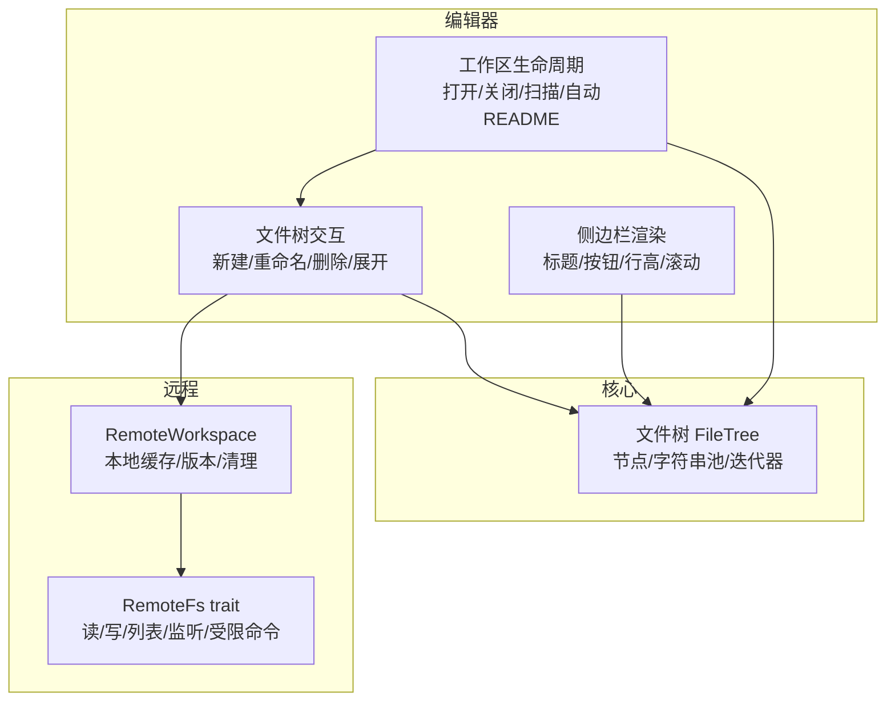
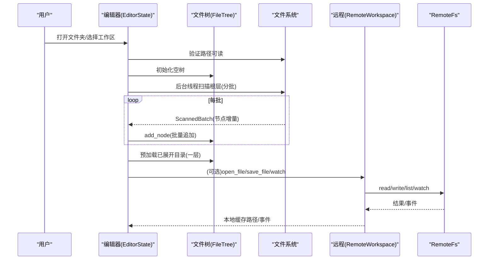
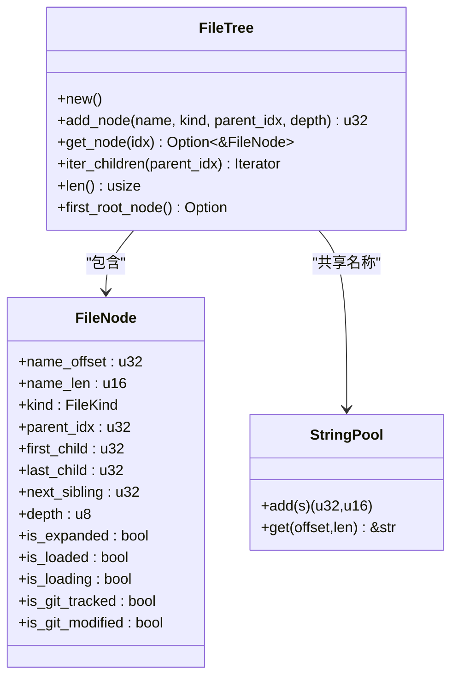
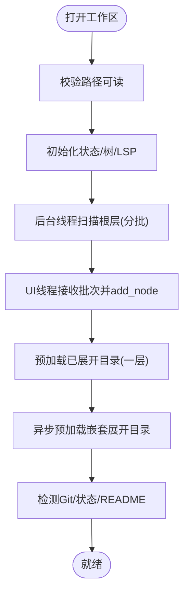
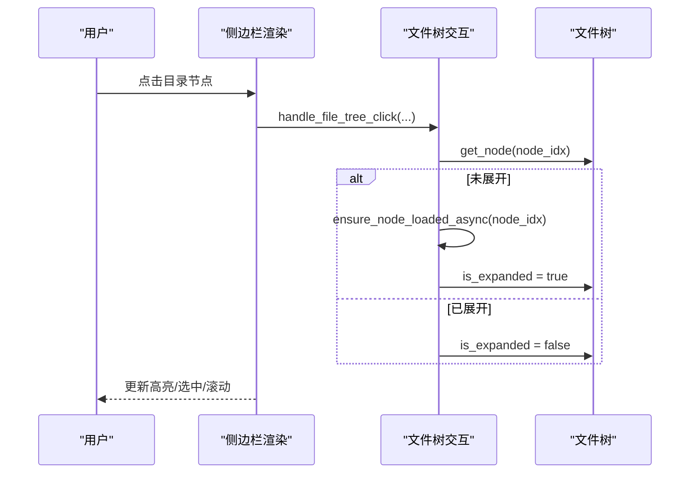
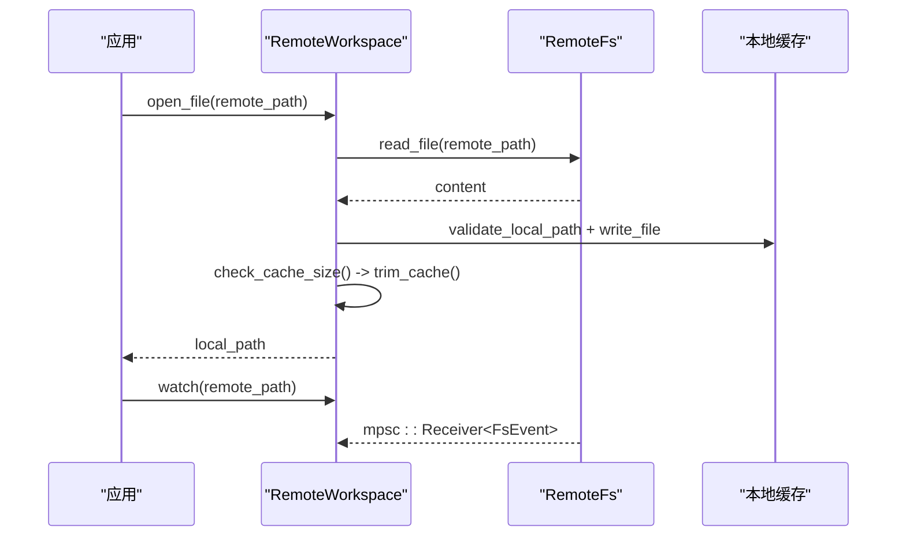
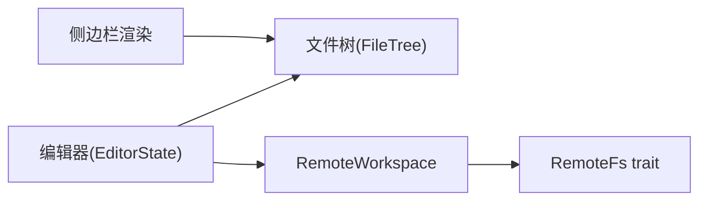

# 工作区管理

<cite>
**本文引用的文件**
- [crates/aether-core/src/workspace/file_tree.rs](file://crates/aether-core/src/workspace/file_tree.rs)
- [crates/aether-core/src/workspace/mod.rs](file://crates/aether-core/src/workspace/mod.rs)
- [crates/aether-win32/src/editor/file_tree.rs](file://crates/aether-win32/src/editor/file_tree.rs)
- [crates/aether-win32/src/render/sidebar_files.rs](file://crates/aether-win32/src/render/sidebar_files.rs)
- [crates/aether-win32/src/editor/files.rs](file://crates/aether-win32/src/editor/files.rs)
- [crates/aether-remote/src/workspace.rs](file://crates/aether-remote/src/workspace.rs)
- [crates/aether-remote/src/remote_fs.rs](file://crates/aether-remote/src/remote_fs.rs)
</cite>

## 目录
1. [简介](#简介)
2. [项目结构](#项目结构)
3. [核心组件](#核心组件)
4. [架构总览](#架构总览)
5. [详细组件分析](#详细组件分析)
6. [依赖关系分析](#依赖关系分析)
7. [性能考量](#性能考量)
8. [故障排查指南](#故障排查指南)
9. [结论](#结论)
10. [附录：使用示例与最佳实践](#附录使用示例与最佳实践)

## 简介
本章节面向“工作区管理”功能，系统性说明工作区的概念、文件树结构设计、文件系统监控机制、多文件与目录的组织方式、加载/缓存/同步策略，以及与 UI 的交互流程。文档同时提供具体使用示例和性能优化建议，帮助开发者快速理解并高效扩展工作区能力。

## 项目结构
工作区相关代码主要分布在以下模块：
- 核心数据结构与算法：aether-core 中的文件树实现（紧凑内存布局、字符串池、懒加载标记）
- 编辑器集成：aether-win32 中打开文件夹、扫描、渲染、交互、保存/删除等
- 远程工作区：aether-remote 中远程文件系统抽象、本地缓存、事件监听、安全校验

图表来源
- [crates/aether-core/src/workspace/file_tree.rs:1-212](file://crates/aether-core/src/workspace/file_tree.rs#L1-L212)
- [crates/aether-win32/src/editor/file_tree.rs:325-405](file://crates/aether-win32/src/editor/file_tree.rs#L325-L405)
- [crates/aether-win32/src/render/sidebar_files.rs:1-120](file://crates/aether-win32/src/render/sidebar_files.rs#L1-L120)
- [crates/aether-win32/src/editor/files.rs:327-432](file://crates/aether-win32/src/editor/files.rs#L327-L432)
- [crates/aether-remote/src/workspace.rs:1-150](file://crates/aether-remote/src/workspace.rs#L1-L150)
- [crates/aether-remote/src/remote_fs.rs:26-186](file://crates/aether-remote/src/remote_fs.rs#L26-L186)

章节来源
- [crates/aether-core/src/workspace/mod.rs:1-2](file://crates/aether-core/src/workspace/mod.rs#L1-L2)
- [crates/aether-core/src/workspace/file_tree.rs:1-212](file://crates/aether-core/src/workspace/file_tree.rs#L1-L212)
- [crates/aether-win32/src/editor/file_tree.rs:325-405](file://crates/aether-win32/src/editor/file_tree.rs#L325-L405)
- [crates/aether-win32/src/render/sidebar_files.rs:1-120](file://crates/aether-win32/src/render/sidebar_files.rs#L1-L120)
- [crates/aether-win32/src/editor/files.rs:327-432](file://crates/aether-win32/src/editor/files.rs#L327-L432)
- [crates/aether-remote/src/workspace.rs:1-150](file://crates/aether-remote/src/workspace.rs#L1-L150)
- [crates/aether-remote/src/remote_fs.rs:26-186](file://crates/aether-remote/src/remote_fs.rs#L26-L186)

## 核心组件
- 文件树（FileTree）：紧凑内存布局的扁平化树，使用字符串池共享路径名，支持 O(1) 尾插、懒加载子节点、Git 状态标记、展开/加载状态。
- 编辑器集成：负责打开/关闭工作区、异步扫描根层、预加载已展开目录、内联输入（新建/重命名）、删除到回收站、轻量刷新、自动打开 README。
- 远程工作区：统一 RemoteFs 抽象，提供本地缓存、TOCTOU 防护、路径遍历检测、缓存大小限制与清理、远程事件监听。

章节来源
- [crates/aether-core/src/workspace/file_tree.rs:1-212](file://crates/aether-core/src/workspace/file_tree.rs#L1-L212)
- [crates/aether-win32/src/editor/file_tree.rs:325-405](file://crates/aether-win32/src/editor/file_tree.rs#L325-L405)
- [crates/aether-remote/src/workspace.rs:1-150](file://crates/aether-remote/src/workspace.rs#L1-L150)

## 架构总览
工作区由“核心数据模型 + 编辑器控制流 + 远程适配层”构成。编辑器在打开工作区时启动后台扫描，按批次将节点加入 FileTree；UI 渲染侧边栏并处理用户交互；远程工作区通过 RemoteFs 抽象屏蔽 SSH/容器等差异，并提供本地缓存与事件通道。

图表来源
- [crates/aether-win32/src/editor/files.rs:327-432](file://crates/aether-win32/src/editor/files.rs#L327-L432)
- [crates/aether-core/src/workspace/file_tree.rs:78-212](file://crates/aether-core/src/workspace/file_tree.rs#L78-L212)
- [crates/aether-remote/src/workspace.rs:58-150](file://crates/aether-remote/src/workspace.rs#L58-L150)
- [crates/aether-remote/src/remote_fs.rs:26-186](file://crates/aether-remote/src/remote_fs.rs#L26-L186)

## 详细组件分析

### 文件树数据结构与算法
- 设计要点
  - 扁平存储：nodes 为 Vec<FileNode>，避免指针跳转，提升缓存友好性。
  - 字符串池：names 为 StringPool，所有名称共享连续内存，减少重复分配。
  - 链表式父子关系：first_child/last_child/next_sibling 维护同级链，O(1) 尾插。
  - 懒加载：is_loaded/is_loading 标记目录是否已扫描/正在扫描，展开时才加载子节点。
  - Git 状态：is_git_tracked/is_git_modified 用于侧边栏展示变更。
- 复杂度
  - 插入：O(1)（尾插），索引访问 O(1)。
  - 遍历：按 sibling 链线性遍历子节点。
  - 名称获取：基于偏移+长度切片，O(1)。

图表来源
- [crates/aether-core/src/workspace/file_tree.rs:1-212](file://crates/aether-core/src/workspace/file_tree.rs#L1-L212)

章节来源
- [crates/aether-core/src/workspace/file_tree.rs:1-212](file://crates/aether-core/src/workspace/file_tree.rs#L1-L212)

### 工作区生命周期与文件扫描
- 打开工作区
  - 校验路径可读、设置 loading 状态、重置树与交互状态、初始化 LSP、持久化 last_workspace。
  - 后台线程扫描根层，按固定批次（如 50）投递消息至 UI 线程，逐步构建 FileTree。
- 初始完成后
  - 预加载所有已展开的根层目录（同步一层，开销可控）。
  - 启动嵌套已展开目录的异步预加载。
  - 检测 Git 分支、状态，尝试自动打开 README。
- 关闭工作区
  - 保存 AI 会话快照、清空面板、释放诊断/补全缓存、回到欢迎页。

图表来源
- [crates/aether-win32/src/editor/files.rs:327-432](file://crates/aether-win32/src/editor/files.rs#L327-L432)
- [crates/aether-win32/src/editor/files.rs:434-492](file://crates/aether-win32/src/editor/files.rs#L434-L492)

章节来源
- [crates/aether-win32/src/editor/files.rs:327-432](file://crates/aether-win32/src/editor/files.rs#L327-L432)
- [crates/aether-win32/src/editor/files.rs:434-492](file://crates/aether-win32/src/editor/files.rs#L434-L492)

### 文件树交互与渲染
- 侧边栏渲染
  - 标题栏显示“工作区”，右侧提供新建文件/打开文件夹按钮。
  - 根目录行可切换整棵树展开/折叠；节点行支持悬停/选中/拖拽放置目标高亮。
  - 目录节点显示 chevron 或时钟图标（加载中），文件节点显示类型图标。
- 交互逻辑
  - 点击目录：若未展开则触发懒加载（异步 ensure_node_loaded_async），再切换展开状态。
  - 内联输入：新建/重命名在同一行进行，几何计算与渲染严格对齐，支持 IME 合成串与光标闪烁。
  - 删除：移动到系统回收站，记录撤销栈，关闭对应标签页，轻量刷新。
  - 复制路径：支持绝对/相对路径复制到剪贴板。

图表来源
- [crates/aether-win32/src/render/sidebar_files.rs:1-120](file://crates/aether-win32/src/render/sidebar_files.rs#L1-L120)
- [crates/aether-win32/src/render/sidebar_files.rs:594-800](file://crates/aether-win32/src/render/sidebar_files.rs#L594-L800)
- [crates/aether-win32/src/editor/file_tree.rs:698-800](file://crates/aether-win32/src/editor/file_tree.rs#L698-L800)

章节来源
- [crates/aether-win32/src/render/sidebar_files.rs:1-120](file://crates/aether-win32/src/render/sidebar_files.rs#L1-L120)
- [crates/aether-win32/src/render/sidebar_files.rs:594-800](file://crates/aether-win32/src/render/sidebar_files.rs#L594-L800)
- [crates/aether-win32/src/editor/file_tree.rs:698-800](file://crates/aether-win32/src/editor/file_tree.rs#L698-L800)

### 远程工作区与文件系统监控
- 远程工作区
  - open_file：读取远程内容到本地缓存，写入前检查缓存大小并清理旧文件，写入后二次 canonicalize 防 TOCTOU。
  - save_file：从本地缓存读取并写回远程，递增版本。
  - sync_tree：列出远程目录并创建本地目录结构。
  - watch：返回 FsEvent 通道，供上层订阅变更。
- 安全与健壮性
  - 路径遍历检测：拒绝包含 ".." 或反斜杠的远程路径；本地路径必须位于缓存目录内。
  - 受限命令白名单：exec_restricted 过滤 shell 元字符，仅允许最小命令集。
  - Git 信息：通过 exec_restricted 执行 git 命令，参数严格校验。

图表来源
- [crates/aether-remote/src/workspace.rs:58-150](file://crates/aether-remote/src/workspace.rs#L58-L150)
- [crates/aether-remote/src/remote_fs.rs:26-186](file://crates/aether-remote/src/remote_fs.rs#L26-L186)

章节来源
- [crates/aether-remote/src/workspace.rs:1-150](file://crates/aether-remote/src/workspace.rs#L1-L150)
- [crates/aether-remote/src/remote_fs.rs:26-186](file://crates/aether-remote/src/remote_fs.rs#L26-L186)

## 依赖关系分析
- 编辑器对文件树的依赖：通过 FileTree API 增删改查节点、迭代子节点、获取名称。
- 渲染对文件树的依赖：根据节点状态绘制 chevron/图标/文本，处理悬停/选中/拖拽。
- 远程工作区对 RemoteFs 的依赖：统一读写/列表/监听接口，屏蔽底层差异。
- 潜在循环依赖：无直接循环；通过消息传递与回调解耦 UI 与后台扫描。

图表来源
- [crates/aether-core/src/workspace/file_tree.rs:78-212](file://crates/aether-core/src/workspace/file_tree.rs#L78-L212)
- [crates/aether-win32/src/editor/file_tree.rs:325-405](file://crates/aether-win32/src/editor/file_tree.rs#L325-L405)
- [crates/aether-remote/src/remote_fs.rs:26-186](file://crates/aether-remote/src/remote_fs.rs#L26-L186)

章节来源
- [crates/aether-core/src/workspace/file_tree.rs:78-212](file://crates/aether-core/src/workspace/file_tree.rs#L78-L212)
- [crates/aether-win32/src/editor/file_tree.rs:325-405](file://crates/aether-win32/src/editor/file_tree.rs#L325-L405)
- [crates/aether-remote/src/remote_fs.rs:26-186](file://crates/aether-remote/src/remote_fs.rs#L26-L186)

## 性能考量
- 文件树内存布局
  - 扁平 Vec + 字符串池减少分配与碎片，名称访问 O(1)。
  - 首尾指针维护同级链，插入 O(1)，遍历高效。
- 懒加载与预加载
  - 目录默认未加载子节点，展开时按需加载；首次打开后同步预加载根层已展开目录，后续异步预加载嵌套展开目录，降低首屏延迟。
- 扫描批处理
  - 后台线程以固定批次（如 50）投递 UI 线程，避免一次性大分配与阻塞。
- 原子写入与流式保存
  - 使用临时文件 + fsync + rename 保证原子性；流式写入避免全量拷贝，适合大文件。
- 远程缓存清理
  - 超过阈值（如 500MB）按修改时间删除最旧文件至目标的 80%，防止无限增长。

[本节为通用性能指导，不直接分析具体文件]

## 故障排查指南
- 打开文件夹失败
  - 检查路径是否可读；查看状态消息提示；确认信任对话框是否被拒绝。
- 文件树不更新
  - 确认扫描批次是否正确投递；检查 ensure_node_loaded_async 是否被调用；查看 mark_file_tree_rows_dirty 是否触发。
- 远程文件无法保存
  - 检查 exec_restricted 白名单是否允许所需命令；确认本地缓存路径未被替换为符号链接（TOCTOU 检测）。
- 缓存过大
  - 观察 check_cache_size 是否触发 trim_cache；必要时调整 MAX_CACHE_SIZE/CACHE_CLEANUP_RATIO。

章节来源
- [crates/aether-win32/src/editor/files.rs:327-432](file://crates/aether-win32/src/editor/files.rs#L327-L432)
- [crates/aether-win32/src/editor/file_tree.rs:967-1044](file://crates/aether-win32/src/editor/file_tree.rs#L967-L1044)
- [crates/aether-remote/src/workspace.rs:28-150](file://crates/aether-remote/src/workspace.rs#L28-L150)
- [crates/aether-remote/src/remote_fs.rs:51-94](file://crates/aether-remote/src/remote_fs.rs#L51-L94)

## 结论
工作区管理通过紧凑的文件树结构、懒加载与预加载策略、批处理扫描、原子写入与远程缓存机制，实现了高性能、可扩展且安全的文件组织与操作体验。编辑器与渲染层紧密协作，远程适配层统一了不同后端差异，整体架构清晰、职责分明，便于后续扩展与维护。

[本节为总结性内容，不直接分析具体文件]

## 附录：使用示例与最佳实践
- 打开工作区
  - 调用 open_folder(path)，等待后台扫描完成；侧边栏将显示根层目录与文件。
  - 参考路径：[crates/aether-win32/src/editor/files.rs:327-432](file://crates/aether-win32/src/editor/files.rs#L327-L432)
- 新建文件/文件夹
  - 点击侧边栏标题栏右侧按钮，或在空白区域右键选择新建；输入名称后提交。
  - 参考路径：[crates/aether-win32/src/render/sidebar_files.rs:126-232](file://crates/aether-win32/src/render/sidebar_files.rs#L126-L232)、[crates/aether-win32/src/editor/file_tree.rs:35-117](file://crates/aether-win32/src/editor/file_tree.rs#L35-L117)
- 重命名/删除
  - 右键节点选择重命名或删除；删除会移入回收站并关闭对应标签页。
  - 参考路径：[crates/aether-win32/src/editor/file_tree.rs:548-609](file://crates/aether-win32/src/editor/file_tree.rs#L548-L609)
- 复制路径
  - 右键节点选择复制绝对/相对路径；或复制工作区根路径。
  - 参考路径：[crates/aether-win32/src/editor/file_tree.rs:476-520](file://crates/aether-win32/src/editor/file_tree.rs#L476-L520)
- 远程文件操作
  - 通过 RemoteWorkspace.open_file/save_file 拉取/推送文件；watch 监听变更。
  - 参考路径：[crates/aether-remote/src/workspace.rs:58-150](file://crates/aether-remote/src/workspace.rs#L58-L150)
- 性能优化建议
  - 合理设置扫描批次大小；利用懒加载减少首屏负载；定期清理远程缓存；使用流式保存避免大文件内存峰值。
  - 参考路径：[crates/aether-win32/src/editor/files.rs:257-325](file://crates/aether-win32/src/editor/files.rs#L257-L325)、[crates/aether-remote/src/workspace.rs:154-206](file://crates/aether-remote/src/workspace.rs#L154-L206)