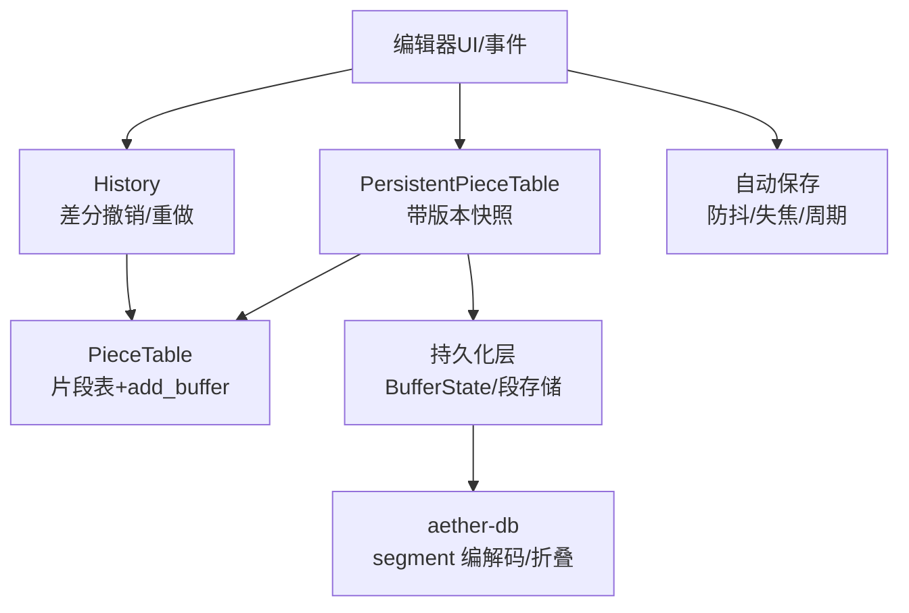
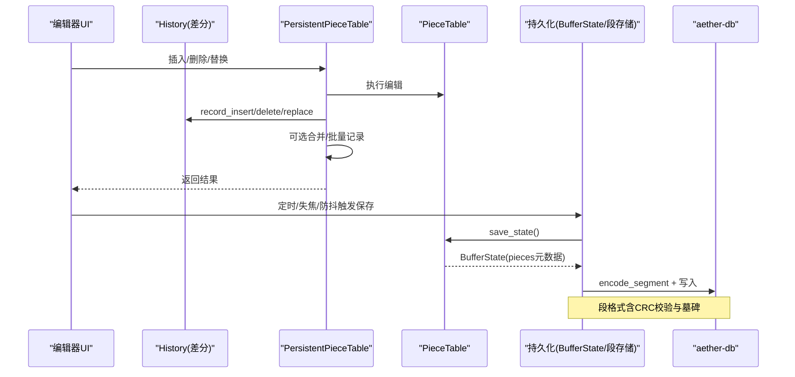
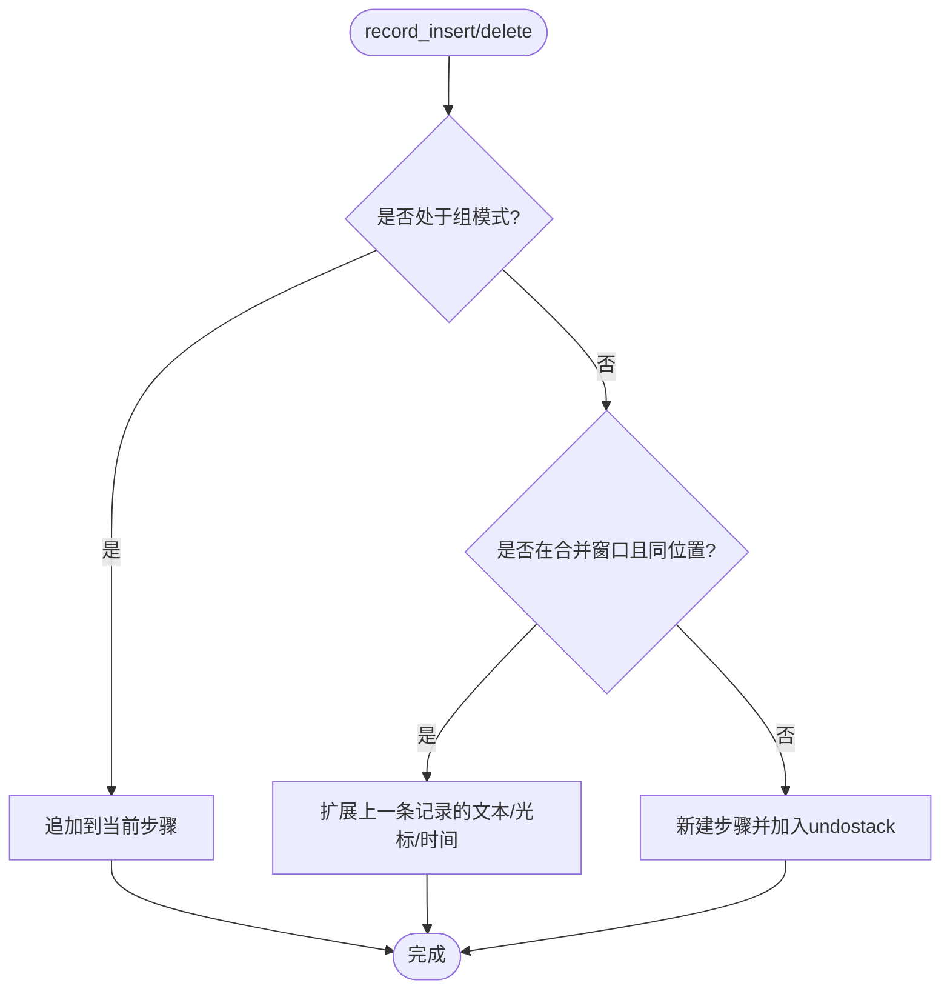
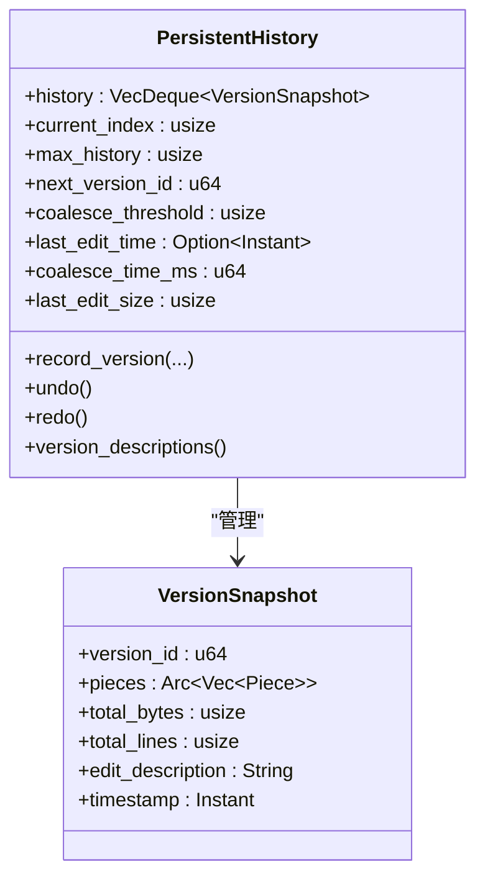
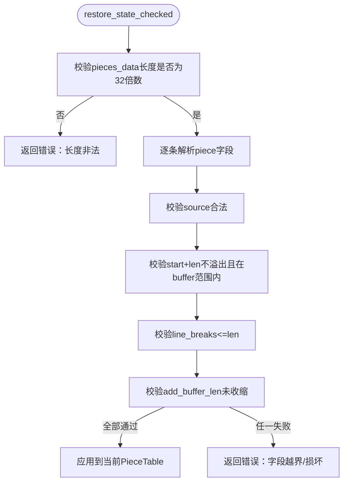
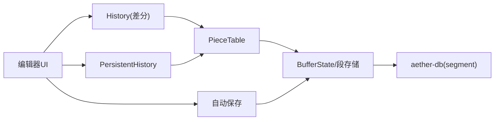

# 持久化历史

<cite>
**本文引用的文件**
- [persistent_history.rs](file://crates/aether-core/src/persistent_history.rs)
- [history.rs](file://crates/aether-core/src/buffer/history.rs)
- [piece_table.rs](file://crates/aether-core/src/buffer/piece_table.rs)
- [incremental_sync.rs](file://crates/aether-lsp/src/incremental_sync.rs)
- [storage.rs](file://crates/aether-db/src/storage.rs)
- [db.rs](file://crates/aether-db/src/db.rs)
- [auto_save.rs](file://crates/aether-win32/src/auto_save.rs)
- [migrate_editor_state.ps1](file://scripts/migrate_editor_state.ps1)
- [migrate_editor_state_v2.ps1](file://scripts/migrate_editor_state_v2.ps1)
- [migrate_editor_state_v3.ps1](file://scripts/migrate_editor_state_v3.ps1)
</cite>

## 目录
1. [简介](#简介)
2. [项目结构](#项目结构)
3. [核心组件](#核心组件)
4. [架构总览](#架构总览)
5. [详细组件分析](#详细组件分析)
6. [依赖关系分析](#依赖关系分析)
7. [性能考量](#性能考量)
8. [故障排查指南](#故障排查指南)
9. [结论](#结论)
10. [附录：使用示例与最佳实践](#附录使用示例与最佳实践)

## 简介
本文件面向“编辑历史”的持久化能力，覆盖以下目标：
- 编辑历史的存储机制、数据序列化与版本兼容性管理
- 高效保存与恢复大型文档的编辑历史（含压缩策略与存储优化）
- 应用重启后恢复用户编辑状态的具体流程
- 数据迁移与备份恢复策略

该能力由两层组成：
- 运行时撤销/重做历史（内存态）：基于差分的轻量级 History，提供高效的撤销/重做与合并策略。
- 版本快照历史（可持久化）：基于 PieceTable 的不可变片段共享，以 Arc<Vec<Piece>> 实现低成本版本快照，并支持合并小编辑、批量操作等优化。

## 项目结构
与持久化历史相关的核心代码分布在以下模块：
- aether-core: 文本缓冲区、PieceTable、运行时 History、持久化版本历史 PersistentHistory
- aether-lsp: 增量同步中的编辑历史记录与清理
- aether-db: 底层段式存储（Segment）编码/解码、折叠与垃圾回收
- aether-win32: 自动保存策略（防抖、失焦保存、周期兜底）
- scripts: 编辑器状态迁移脚本（用于版本兼容与字段路径迁移）

图表来源
- [persistent_history.rs:240-376](file://crates/aether-core/src/persistent_history.rs#L240-L376)
- [history.rs:14-346](file://crates/aether-core/src/buffer/history.rs#L14-L346)
- [piece_table.rs:1632-1799](file://crates/aether-core/src/buffer/piece_table.rs#L1632-L1799)
- [storage.rs:87-361](file://crates/aether-db/src/storage.rs#L87-L361)
- [auto_save.rs:1-30](file://crates/aether-win32/src/auto_save.rs#L1-L30)

章节来源
- [persistent_history.rs:1-545](file://crates/aether-core/src/persistent_history.rs#L1-L545)
- [history.rs:1-565](file://crates/aether-core/src/buffer/history.rs#L1-L565)
- [piece_table.rs:1600-1799](file://crates/aether-core/src/buffer/piece_table.rs#L1600-L1799)
- [storage.rs:87-361](file://crates/aether-db/src/storage.rs#L87-L361)
- [auto_save.rs:1-30](file://crates/aether-win32/src/auto_save.rs#L1-L30)

## 核心组件
- 运行时撤销/重做 History
  - 基于 EditDelta（Insert/Delete/Replace）的差分记录，避免保存完整 PieceTable 快照，显著降低内存占用。
  - 支持连续输入/删除的时间窗口合并（默认 500ms），减少步骤数量。
  - 支持撤销组（begin_group/end_group），将一组编辑作为一步撤销/重做。
- 版本快照历史 PersistentHistory
  - 以 VersionSnapshot 为单位记录版本，包含 pieces（Arc<Vec<Piece>>）、字节数、行数、描述、时间戳。
  - 支持小编辑合并（按大小阈值与时间窗口），批量操作只记录一次历史。
  - 通过 Arc 共享片段，撤销/重做时仅复制引用计数，避免大对象拷贝。
- PieceTable 状态序列化/恢复
  - save_state 将 pieces 元数据序列化为紧凑字节流（source/start/len/line_breaks）。
  - restore_state_checked 对反序列化数据进行严格边界校验，任何损坏均放弃恢复，保证健壮性。
- LSP 增量同步历史
  - OptimizedDocumentSync 维护 edit_history，限制最大历史长度，并提供清理旧历史的能力。
- 段式存储 storage
  - encode_segment/decode_segment 提供段格式编解码；fold_segments 实现后写覆盖与墓碑删除，计算垃圾空间。
- 自动保存 auto_save
  - 组合触发策略：空闲防抖、失焦立即、周期兜底；内容去重与冲突检测；大文件降级策略。

章节来源
- [history.rs:14-346](file://crates/aether-core/src/buffer/history.rs#L14-L346)
- [persistent_history.rs:7-232](file://crates/aether-core/src/persistent_history.rs#L7-L232)
- [piece_table.rs:1645-1799](file://crates/aether-core/src/buffer/piece_table.rs#L1645-L1799)
- [incremental_sync.rs:229-246](file://crates/aether-lsp/src/incremental_sync.rs#L229-L246)
- [storage.rs:87-361](file://crates/aether-db/src/storage.rs#L87-L361)
- [auto_save.rs:1-30](file://crates/aether-win32/src/auto_save.rs#L1-L30)

## 架构总览
下图展示从编辑到持久化的关键路径：

图表来源
- [history.rs:140-280](file://crates/aether-core/src/buffer/history.rs#L140-L280)
- [persistent_history.rs:273-376](file://crates/aether-core/src/persistent_history.rs#L273-L376)
- [piece_table.rs:1645-1671](file://crates/aether-core/src/buffer/piece_table.rs#L1645-L1671)
- [storage.rs:87-106](file://crates/aether-db/src/storage.rs#L87-L106)

## 详细组件分析

### 运行时撤销/重做 History（差分）
- 设计要点
  - 每条记录为 EditDelta（Insert/Delete/Replace），附带光标位置和时间戳。
  - 连续同位置输入/删除在 500ms 内合并为一条记录，减少步骤数量。
  - 支持撤销组：begin_group/end_group 将多条记录归为一个撤销步。
- 复杂度与性能
  - 记录与撤销/重做均为 O(1) 或 O(k)（k为组内记录数），内存占用极小。
  - 避免保存完整 PieceTable，解决长会话下 O(N²) 增长问题。
- 错误处理
  - 组模式与合并状态在撤销/重做后重置，避免状态污染。

图表来源
- [history.rs:140-280](file://crates/aether-core/src/buffer/history.rs#L140-L280)

章节来源
- [history.rs:14-346](file://crates/aether-core/src/buffer/history.rs#L14-L346)

### 版本快照历史 PersistentHistory（可持久化）
- 设计要点
  - VersionSnapshot 包含版本ID、pieces（Arc<Vec<Piece>>）、字节数、行数、描述、时间戳。
  - 支持小编辑合并：当编辑大小低于阈值且距离上次编辑时间在窗口内，则合并到当前版本。
  - 批量操作：with_batch 关闭自动记录，结束后统一记录一次。
- 溢出与保留策略
  - 容量满时优先删除中间旧版本，尽量保留当前所在版本，避免索引跳变。
- 撤销/重做
  - undo/redo 返回 VersionSnapshot 引用，通过 Arc 共享数据，避免拷贝。

图表来源
- [persistent_history.rs:7-232](file://crates/aether-core/src/persistent_history.rs#L7-L232)

章节来源
- [persistent_history.rs:7-232](file://crates/aether-core/src/persistent_history.rs#L7-L232)

### PieceTable 状态序列化与恢复
- 序列化
  - save_state 将每个 piece 的 source/start/len/line_breaks 序列化为固定长度的字节块（32字节/条），并记录 add_buffer_len、行号、字节长度。
- 恢复
  - restore_state_checked 进行严格校验：
    - pieces_data 长度必须为 32 的整数倍
    - source 合法值（Original/Add）
    - start+len 不溢出且落在对应 buffer 范围内
    - line_breaks 不超过 len
    - add_buffer_len 不应小于保存时的长度（只增不减）
  - 任何校验失败都会放弃恢复，保留当前状态，防止崩溃或数据损坏扩散。

图表来源
- [piece_table.rs:1674-1799](file://crates/aether-core/src/buffer/piece_table.rs#L1674-L1799)

章节来源
- [piece_table.rs:1632-1799](file://crates/aether-core/src/buffer/piece_table.rs#L1632-L1799)

### LSP 增量同步历史
- 记录编辑
  - record_edit 增加版本号，记录起始/结束字节与文本，限制最大历史长度。
- 生成变更
  - generate_changes_since 基于最近一次同步后的编辑历史生成增量变更，适用于 LSP 同步。
- 清理与延迟
  - cleanup_old_history 清理过期历史；LargeFileSyncStrategy 为大文件提供延迟策略。

章节来源
- [incremental_sync.rs:229-246](file://crates/aether-lsp/src/incremental_sync.rs#L229-L246)

### 段式存储 storage（持久化后端）
- 段格式
  - encode_segment 构造段头（魔数、类型、标志位、tag/key长度、payload长度、向量长度）、tag、key、payload、向量、CRC校验。
- 解码与折叠
  - decode_segment 安全解码单个段；fold_segments 将段序列折叠为最新存活记录，墓碑视为删除，统计垃圾空间。

章节来源
- [storage.rs:87-361](file://crates/aether-db/src/storage.rs#L87-L361)

### 自动保存 auto_save（触发策略）
- 触发策略
  - 空闲防抖：停止输入后延迟保存，持续输入则重置计时器。
  - 失焦立即：失去焦点时立即保存。
  - 周期兜底：每 N 毫秒强制保存一次，避免极端场景。
- 写入安全
  - 复用原子写入路径（临时文件 + fsync + rename），崩溃时要么旧文件完整，要么新文件完整。
- 内容去重与冲突检测
  - 比较 buffer_version 与 last_saved_buffer_version，相同则跳过写盘。
  - 保存前比对磁盘 mtime 与 last_known_mtime，外部修改则暂停自动保存并提示。
- 大文件降级
  - 超过阈值时延长防抖、关闭周期保存，仅保留失焦保存，避免 IO 卡顿。

章节来源
- [auto_save.rs:1-30](file://crates/aether-win32/src/auto_save.rs#L1-L30)

## 依赖关系分析
- 运行时 History 依赖 PieceTable 的 insert/delete/replace 接口，并通过差分记录实现撤销/重做。
- PersistentHistory 依赖 PieceTable 的 get_pieces/len_bytes/len_lines，并以 Arc<Vec<Piece>> 共享片段。
- 持久化层依赖 PieceTable 的 save_state/restore_state，以及 aether-db 的 segment 编解码。
- 自动保存模块协调 UI 事件与持久化触发时机，确保数据一致性与性能。

图表来源
- [history.rs:14-346](file://crates/aether-core/src/buffer/history.rs#L14-L346)
- [persistent_history.rs:240-376](file://crates/aether-core/src/persistent_history.rs#L240-L376)
- [piece_table.rs:1645-1671](file://crates/aether-core/src/buffer/piece_table.rs#L1645-L1671)
- [storage.rs:87-361](file://crates/aether-db/src/storage.rs#L87-L361)
- [auto_save.rs:1-30](file://crates/aether-win32/src/auto_save.rs#L1-L30)

章节来源
- [history.rs:14-346](file://crates/aether-core/src/buffer/history.rs#L14-L346)
- [persistent_history.rs:240-376](file://crates/aether-core/src/persistent_history.rs#L240-L376)
- [piece_table.rs:1645-1671](file://crates/aether-core/src/buffer/piece_table.rs#L1645-L1671)
- [storage.rs:87-361](file://crates/aether-db/src/storage.rs#L87-L361)
- [auto_save.rs:1-30](file://crates/aether-win32/src/auto_save.rs#L1-L30)

## 性能考量
- 内存效率
  - History 使用差分记录，单条记录仅几十字节，避免保存完整 PieceTable。
  - PersistentHistory 使用 Arc<Vec<Piece>> 共享片段，撤销/重做仅递增引用计数。
- 合并策略
  - 运行时 History：500ms 窗口内同位置输入/删除合并为一条记录。
  - 版本快照：小编辑按大小阈值与时间窗口合并，减少历史条目数量。
- 批量操作
  - with_batch 关闭自动记录，批量结束后统一记录一次，降低历史膨胀。
- 大文件优化
  - PieceTable 快照采用零拷贝思路（Arc<Mmap> 克隆），避免全量拷贝。
  - 自动保存在大文件时降级策略，减少 IO 压力。
- 存储优化
  - 段式存储使用紧凑格式与 CRC 校验，fold_segments 计算垃圾空间，便于后续清理。

[本节为通用性能讨论，无需具体文件分析]

## 故障排查指南
- 恢复失败
  - 现象：restore_state_checked 返回错误，放弃恢复。
  - 原因：pieces_data 长度非法、source 非法、start+len 溢出、越界、line_breaks 异常、add_buffer_len 收缩。
  - 处理：检查持久化数据完整性，必要时回滚到上一版本。
- 历史丢失
  - 现象：撤销/重做栈为空或步骤过少。
  - 原因：合并窗口导致记录被合并；容量限制导致旧版本被丢弃。
  - 处理：调整合并阈值与历史容量；检查批量操作是否正确包裹。
- 自动保存未触发
  - 现象：崩溃后丢失编辑。
  - 原因：大文件降级关闭周期保存；内容去重跳过写盘；外部修改冲突检测阻止保存。
  - 处理：检查文件大小与配置；确认冲突提示；验证原子写入路径。

章节来源
- [piece_table.rs:1674-1799](file://crates/aether-core/src/buffer/piece_table.rs#L1674-L1799)
- [history.rs:140-280](file://crates/aether-core/src/buffer/history.rs#L140-L280)
- [auto_save.rs:1-30](file://crates/aether-win32/src/auto_save.rs#L1-L30)

## 结论
本项目通过“差分撤销/重做 + 版本快照 + 段式存储”的分层设计，实现了高效、可靠且可扩展的编辑历史持久化能力。运行时 History 保证低内存占用与快速撤销/重做；PersistentHistory 利用 PieceTable 的不可变特性实现低成本版本快照；持久化层通过严格的序列化与校验保障数据安全；自动保存策略确保数据不丢失。结合迁移脚本与备份恢复机制，系统具备良好的版本兼容性与可维护性。

[本节为总结，无需具体文件分析]

## 附录：使用示例与最佳实践

### 应用重启后恢复用户编辑状态
- 启动流程
  - 加载 PieceTable 原始内容与 add_buffer。
  - 调用 restore_state 恢复历史状态（若存在）。
  - 初始化 History 与 PersistentHistory，重建撤销/重做栈。
  - 根据自动保存策略继续监听编辑事件。
- 关键点
  - 恢复前进行严格校验，失败则保留当前状态。
  - 对于大文件，优先使用零拷贝快照与延迟同步。

章节来源
- [piece_table.rs:1645-1671](file://crates/aether-core/src/buffer/piece_table.rs#L1645-L1671)
- [auto_save.rs:1-30](file://crates/aether-win32/src/auto_save.rs#L1-L30)

### 数据迁移与版本兼容
- 字段路径迁移
  - 使用 migrate_editor_state*.ps1 脚本批量更新 EditorState 字段路径，确保新旧版本兼容。
- 段格式兼容
  - 段格式包含魔数与类型，解码失败时视为截断/损坏，避免读取无效数据。
- 建议
  - 每次数据结构变更时新增迁移脚本，并在应用启动时按序执行。
  - 对持久化数据添加版本标记，便于向前/向后兼容。

章节来源
- [migrate_editor_state.ps1:1-158](file://scripts/migrate_editor_state.ps1#L1-L158)
- [migrate_editor_state_v2.ps1:1-78](file://scripts/migrate_editor_state_v2.ps1#L1-L78)
- [migrate_editor_state_v3.ps1:1-85](file://scripts/migrate_editor_state_v3.ps1#L1-L85)
- [storage.rs:109-118](file://crates/aether-db/src/storage.rs#L109-L118)

### 备份与恢复策略
- 备份
  - 定期导出段式存储文件，或使用数据库工具导出关键键值。
- 恢复
  - 加载段文件，解码并折叠得到最新状态；若损坏则跳过损坏段，尽可能恢复可用数据。
- 一致性
  - 使用原子写入与 fsync 确保备份文件完整性。
  - 恢复后进行校验，失败则回滚到上一备份。

章节来源
- [storage.rs:320-341](file://crates/aether-db/src/storage.rs#L320-L341)
- [db.rs:350-378](file://crates/aether-db/src/db.rs#L350-L378)