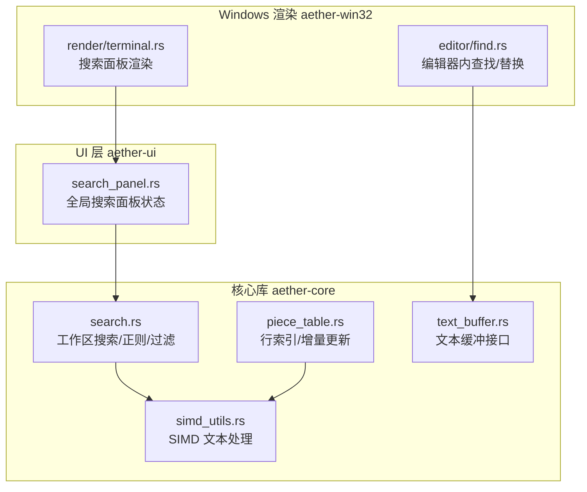
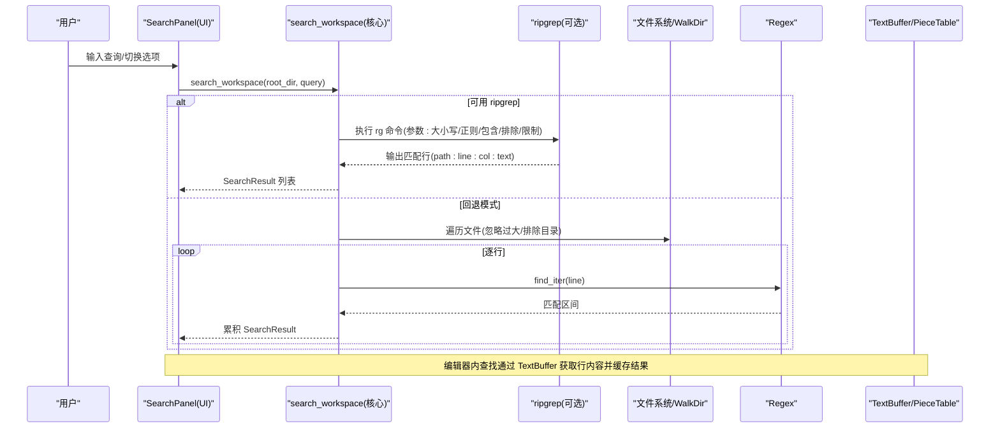
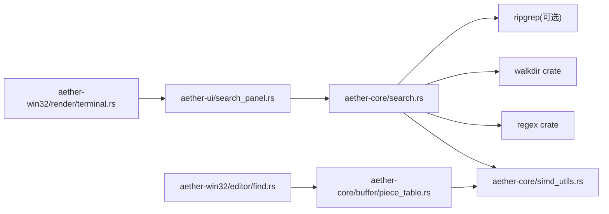

# 搜索系统

<cite>
**本文引用的文件**
- [search.rs](file://crates/aether-core/src/search.rs)
- [simd_utils.rs](file://crates/aether-core/src/simd_utils.rs)
- [piece_table.rs](file://crates/aether-core/src/buffer/piece_table.rs)
- [text_buffer.rs](file://crates/aether-core/src/buffer/text_buffer.rs)
- [find.rs](file://crates/aether-win32/src/editor/find.rs)
- [search_panel.rs](file://crates/aether-ui/src/search_panel.rs)
- [terminal.rs](file://crates/aether-win32/src/render/terminal.rs)
- [benchmarks.rs](file://crates/aether-core/src/benchmarks.rs)
</cite>

## 目录
1. [简介](#简介)
2. [项目结构](#项目结构)
3. [核心组件](#核心组件)
4. [架构总览](#架构总览)
5. [详细组件分析](#详细组件分析)
6. [依赖关系分析](#依赖关系分析)
7. [性能考量](#性能考量)
8. [故障排查指南](#故障排查指南)
9. [结论](#结论)
10. [附录：API 使用示例与集成要点](#附录api-使用示例与集成要点)

## 简介
本文件系统性地梳理并文档化编辑器中的“搜索系统”，覆盖全文搜索算法、SIMD 优化技术、大规模文本搜索的性能策略，以及搜索索引的构建与维护机制。同时提供正则表达式支持、大小写敏感匹配、多行搜索能力，并在 UI 层给出在编辑器中集成搜索功能的具体方式，最后总结搜索结果的高效展示与性能调优方法。

## 项目结构
搜索系统横跨核心库（aether-core）、UI 面板（aether-ui）与 Windows 渲染层（aether-win32），关键文件如下：
- 核心搜索实现：工作区搜索、正则构建、包含/排除过滤
- SIMD 加速：换行计数、字节查找、空白跳过等底层工具
- 缓冲区与行索引：基于 PieceTable 的行索引重建与增量更新
- 编辑器内查找：当前标签页内的查找/替换、结果缓存与导航
- UI 面板：全局搜索面板的状态管理与结果展示
- 渲染层：搜索面板输入、选项按钮与结果列表绘制

图表来源
- [search.rs:1-60](file://crates/aether-core/src/search.rs#L1-L60)
- [simd_utils.rs:1-20](file://crates/aether-core/src/simd_utils.rs#L1-L20)
- [piece_table.rs:946-975](file://crates/aether-core/src/buffer/piece_table.rs#L946-L975)
- [text_buffer.rs:1-39](file://crates/aether-core/src/buffer/text_buffer.rs#L1-L39)
- [search_panel.rs:1-30](file://crates/aether-ui/src/search_panel.rs#L1-L30)
- [find.rs:22-59](file://crates/aether-win32/src/editor/find.rs#L22-L59)
- [terminal.rs:199-325](file://crates/aether-win32/src/render/terminal.rs#L199-L325)

章节来源
- [search.rs:1-60](file://crates/aether-core/src/search.rs#L1-L60)
- [simd_utils.rs:1-20](file://crates/aether-core/src/simd_utils.rs#L1-L20)
- [piece_table.rs:946-975](file://crates/aether-core/src/buffer/piece_table.rs#L946-L975)
- [text_buffer.rs:1-39](file://crates/aether-core/src/buffer/text_buffer.rs#L1-L39)
- [search_panel.rs:1-30](file://crates/aether-ui/src/search_panel.rs#L1-L30)
- [find.rs:22-59](file://crates/aether-win32/src/editor/find.rs#L22-L59)
- [terminal.rs:199-325](file://crates/aether-win32/src/render/terminal.rs#L199-L325)

## 核心组件
- 工作区搜索（aether-core/search.rs）
  - 入口函数优先调用外部 ripgrep；不可用时回退到 walkdir + regex 遍历。
  - 支持正则模式、大小写敏感、包含/排除路径过滤、最大文件大小限制与结果数量上限。
- SIMD 文本处理（aether-core/simd_utils.rs）
  - 换行计数委托 bytecount（AVX2/SSE2 运行时分派）。
  - 字节查找委托 memchr（高性能向量查找）。
  - 空白跳过采用 SWAR 批量检测，配合 chunks_exact 消除边界检查，利于编译器向量化。
  - 提供前缀匹配、行长度计算、字符分类等辅助工具。
- 缓冲区与行索引（aether-core/buffer/piece_table.rs, text_buffer.rs）
  - 行索引重建使用 SIMD 快速定位换行符，显著降低大文件扫描成本。
  - 提供增量插入/删除时的行索引局部更新，避免全量重建。
  - TextBuffer trait 统一了编辑操作与行号/列号转换接口。
- 编辑器内查找（aether-win32/editor/find.rs）
  - 当前标签页内查找所有匹配位置，具备查询与文本版本缓存，避免重复扫描。
  - 支持下一个/上一个跳转、当前匹配替换、全部替换（撤销组包裹）。
- 全局搜索面板（aether-ui/search_panel.rs, aether-win32/render/terminal.rs）
  - 管理搜索状态（可见性、查询、正则开关、大小写敏感、结果集、选中项、状态信息）。
  - 渲染层负责输入框、选项按钮、状态行与结果列表绘制。

章节来源
- [search.rs:45-182](file://crates/aether-core/src/search.rs#L45-L182)
- [simd_utils.rs:8-79](file://crates/aether-core/src/simd_utils.rs#L8-L79)
- [piece_table.rs:946-1023](file://crates/aether-core/src/buffer/piece_table.rs#L946-L1023)
- [text_buffer.rs:1-39](file://crates/aether-core/src/buffer/text_buffer.rs#L1-L39)
- [find.rs:22-131](file://crates/aether-win32/src/editor/find.rs#L22-L131)
- [search_panel.rs:1-108](file://crates/aether-ui/src/search_panel.rs#L1-L108)
- [terminal.rs:199-325](file://crates/aether-win32/src/render/terminal.rs#L199-L325)

## 架构总览
搜索系统由“用户交互 → 搜索面板 → 核心搜索 → 文本缓冲/SIMD”构成，UI 渲染层负责呈现搜索面板与结果列表。

图表来源
- [search.rs:45-182](file://crates/aether-core/src/search.rs#L45-L182)
- [find.rs:22-59](file://crates/aether-win32/src/editor/find.rs#L22-L59)
- [piece_table.rs:946-975](file://crates/aether-core/src/buffer/piece_table.rs#L946-L975)

## 详细组件分析

### 工作区搜索（search.rs）
- 设计要点
  - 优先调用外部 ripgrep，以获得极佳的搜索性能与丰富的命令行选项；失败时回退到 Rust 实现的 walkdir + regex。
  - 支持正则模式与非正则（固定字符串）两种匹配模式，自动转义非正则模式的特殊字符。
  - 支持大小写敏感开关、包含/排除路径过滤、最大文件大小限制（默认 1MB）与结果数量上限（默认 500）。
  - 解析 ripgrep 输出格式为统一的 SearchResult 结构（路径、行号、列号、匹配行文本）。
- 复杂度与性能
  - 使用 ripgrep 时，时间复杂度近似 O(N) 文件扫描，I/O 与 CPU 由 rg 高效实现。
  - 回退模式下，按文件逐行读取并使用 regex 迭代匹配，存在 I/O 与正则开销；通过 include/exclude 与文件大小限制减少不必要扫描。
- 错误处理
  - 正则构建失败直接返回空结果，避免崩溃。
  - ripgrep 执行失败或输出格式异常时，安全跳过无效行。

章节来源
- [search.rs:45-182](file://crates/aether-core/src/search.rs#L45-L182)
- [search.rs:173-201](file://crates/aether-core/src/search.rs#L173-L201)

### SIMD 文本处理（simd_utils.rs）
- 设计要点
  - count_newlines_simd：委托 bytecount，利用 AVX2/SSE2 运行时分派，比手写 SWAR 更快。
  - find_byte_simd：委托 memchr，用于快速定位换行符等单字节目标。
  - skip_whitespace_simd：SWAR 批量检测空格/制表符/回车，使用 chunks_exact 提升向量化效率。
  - 其他工具：starts_with_simd、line_length_simd、classify_chars_simd 等，服务于词法分析与高亮。
- 复杂度与性能
  - 换行计数与字节查找均为 O(N)，但常数因子极低，适合大文件场景。
  - 空白跳过在长空白区域可整块推进，减少分支与边界检查。
- 测试覆盖
  - 针对边界情况（空串、短数据、16 字节对齐、非 ASCII 字符）进行断言，确保正确性与稳定性。

章节来源
- [simd_utils.rs:8-79](file://crates/aether-core/src/simd_utils.rs#L8-L79)
- [simd_utils.rs:103-267](file://crates/aether-core/src/simd_utils.rs#L103-L267)

### 缓冲区与行索引（piece_table.rs, text_buffer.rs）
- 设计要点
  - rebuild_line_index：预计算每行的起始字节位置，使用 SIMD 快速查找换行符，显著加速大文件的行索引构建。
  - update_line_index_for_insert/delete：对插入/删除进行增量更新，避免全量重建，提高频繁编辑下的性能。
  - TextBuffer trait：抽象文本编辑操作与行列转换，使上层代码与具体数据结构解耦。
- 复杂度与性能
  - 行索引构建 O(N)，但借助 SIMD 大幅降低常数；增量更新接近 O(k)（k 为受影响行数）。
  - 行号到字节偏移的查找通过 LineIndex 达到近似 O(1)。
- 错误处理
  - 增量删除逻辑修正了边界条件，避免残留“幽灵行起点”。

章节来源
- [piece_table.rs:946-1023](file://crates/aether-core/src/buffer/piece_table.rs#L946-L1023)
- [piece_table.rs:1062-1076](file://crates/aether-core/src/buffer/piece_table.rs#L1062-L1076)
- [text_buffer.rs:1-39](file://crates/aether-core/src/buffer/text_buffer.rs#L1-L39)

### 编辑器内查找（find.rs）
- 设计要点
  - find_all：遍历当前标签页的所有行，收集匹配位置；具备查询与文本版本缓存，避免重复扫描。
  - find_next/find_prev：循环导航匹配项，选区末尾对齐到字符边界，符合编辑器约定。
  - replace_current/replace_all：替换当前或全部匹配，使用撤销组包裹，记录历史，保证可撤销。
- 复杂度与性能
  - 单次查找 O(L)（L 为总行数），缓存命中时 O(1)。
  - 替换操作将行号转换为全局字节偏移，降序替换以避免位置偏移影响。
- 错误处理
  - 空查询清空结果；替换前校验查询有效性；字符边界对齐防止渲染异常。

章节来源
- [find.rs:22-131](file://crates/aether-win32/src/editor/find.rs#L22-L131)
- [find.rs:210-283](file://crates/aether-win32/src/editor/find.rs#L210-L283)

### 全局搜索面板（search_panel.rs, terminal.rs）
- 设计要点
  - SearchPanel 维护搜索状态（查询、正则、大小写敏感、结果集、选中项、是否搜索中、状态消息）。
  - 渲染层绘制输入框、选项按钮（如“正则”）、状态行与结果列表，支持选中行高亮。
- 交互流程
  - 用户输入触发 search()，构造 SearchQuery 并调用 search_workspace，完成后更新结果与状态。
  - 结果列表分页显示，避免一次性绘制过多行导致卡顿。

章节来源
- [search_panel.rs:1-108](file://crates/aether-ui/src/search_panel.rs#L1-L108)
- [terminal.rs:199-325](file://crates/aether-win32/src/render/terminal.rs#L199-L325)

## 依赖关系分析
- 模块耦合
  - UI 层依赖核心搜索 API；核心搜索依赖 SIMD 工具与正则库；缓冲区依赖 SIMD 工具进行行索引构建。
- 外部依赖
  - ripgrep（可选）：显著提升工作区搜索性能。
  - regex：构建正则表达式，支持大小写敏感与模式匹配。
  - walkdir：递归遍历文件系统。
  - bytecount/memchr：SIMD 加速的文本处理库。
- 潜在循环依赖
  - 未发现循环依赖；各层职责清晰，单向依赖。

图表来源
- [search.rs:45-182](file://crates/aether-core/src/search.rs#L45-L182)
- [simd_utils.rs:8-79](file://crates/aether-core/src/simd_utils.rs#L8-L79)
- [piece_table.rs:946-975](file://crates/aether-core/src/buffer/piece_table.rs#L946-L975)
- [find.rs:22-59](file://crates/aether-win32/src/editor/find.rs#L22-L59)
- [terminal.rs:199-325](file://crates/aether-win32/src/render/terminal.rs#L199-L325)

章节来源
- [search.rs:45-182](file://crates/aether-core/src/search.rs#L45-L182)
- [simd_utils.rs:8-79](file://crates/aether-core/src/simd_utils.rs#L8-L79)
- [piece_table.rs:946-975](file://crates/aether-core/src/buffer/piece_table.rs#L946-L975)
- [find.rs:22-59](file://crates/aether-win32/src/editor/find.rs#L22-L59)
- [terminal.rs:199-325](file://crates/aether-win32/src/render/terminal.rs#L199-L325)

## 性能考量
- 工作区搜索
  - 优先使用 ripgrep，充分利用其多线程与高度优化的搜索引擎。
  - 回退模式通过 include/exclude 与文件大小限制减少 I/O 与正则开销。
- 行索引构建
  - 使用 SIMD 快速定位换行符，构建行索引的时间复杂度 O(N)，常数因子低。
  - 增量更新避免全量重建，适用于频繁编辑场景。
- 编辑器内查找
  - 查询与文本版本缓存，避免重复扫描；字符边界对齐防止渲染异常。
- 基准测试
  - benchmarks.rs 提供了 SIMD 加速测试（换行计数、字节查找、空白跳过）与 PieceTable 编辑吞吐量测试，便于评估性能改进。

章节来源
- [benchmarks.rs:231-263](file://crates/aether-core/src/benchmarks.rs#L231-L263)
- [benchmarks.rs:415-442](file://crates/aether-core/src/benchmarks.rs#L415-L442)

## 故障排查指南
- 正则表达式错误
  - 现象：构建正则失败，返回空结果。
  - 排查：检查正则语法是否正确；在非正则模式下，特殊字符会被自动转义。
- ripgrep 不可用
  - 现象：工作区搜索回退到 walkdir 模式，速度较慢。
  - 排查：确认系统已安装 ripgrep；若未安装，回退模式仍可用但性能下降。
- 结果过多或为空
  - 现象：结果数量达到上限或被过滤掉。
  - 排查：调整 include/exclude 模式；检查文件大小限制；确认查询是否为空。
- 编辑器内查找无响应
  - 现象：点击“下一个/上一个”无变化。
  - 排查：确认查询非空；检查缓存是否命中；验证文本版本是否变更。

章节来源
- [search.rs:173-201](file://crates/aether-core/src/search.rs#L173-L201)
- [search.rs:45-182](file://crates/aether-core/src/search.rs#L45-L182)
- [find.rs:22-59](file://crates/aether-win32/src/editor/find.rs#L22-L59)

## 结论
本搜索系统通过分层设计与 SIMD 优化，实现了高效的工作区搜索与编辑器内查找。核心搜索优先使用 ripgrep，回退模式保证可用性；行索引构建与增量更新确保大文件与频繁编辑场景下的性能；UI 层提供直观的全局搜索面板与结果展示。整体架构清晰、扩展性强，具备良好的可维护性与性能表现。

## 附录：API 使用示例与集成要点
- 工作区搜索
  - 构造 SearchQuery：设置 pattern、regex、case_sensitive、include、exclude。
  - 调用 search_workspace(root_dir, &query) 获取 SearchResult 列表。
  - 示例路径参考：[search.rs:45-182](file://crates/aether-core/src/search.rs#L45-L182)
- 编辑器内查找
  - 调用 find_all(find_state, content) 获取匹配位置；使用 find_next/find_prev 导航；replace_current/replace_all 执行替换。
  - 示例路径参考：[find.rs:22-131](file://crates/aether-win32/src/editor/find.rs#L22-L131)、[find.rs:210-283](file://crates/aether-win32/src/editor/find.rs#L210-L283)
- 全局搜索面板
  - 使用 SearchPanel 管理状态；调用 search(root_dir) 执行搜索；渲染层绘制输入框、选项按钮与结果列表。
  - 示例路径参考：[search_panel.rs:57-79](file://crates/aether-ui/src/search_panel.rs#L57-L79)、[terminal.rs:199-325](file://crates/aether-win32/src/render/terminal.rs#L199-L325)
- 性能调优建议
  - 启用 ripgrep 以提升工作区搜索性能。
  - 合理配置 include/exclude 与文件大小限制，减少不必要的 I/O。
  - 利用行索引增量更新与查询缓存，避免重复扫描。
  - 使用基准测试评估优化效果。

章节来源
- [search.rs:45-182](file://crates/aether-core/src/search.rs#L45-L182)
- [find.rs:22-131](file://crates/aether-win32/src/editor/find.rs#L22-L131)
- [find.rs:210-283](file://crates/aether-win32/src/editor/find.rs#L210-L283)
- [search_panel.rs:57-79](file://crates/aether-ui/src/search_panel.rs#L57-L79)
- [terminal.rs:199-325](file://crates/aether-win32/src/render/terminal.rs#L199-L325)
- [benchmarks.rs:231-263](file://crates/aether-core/src/benchmarks.rs#L231-L263)