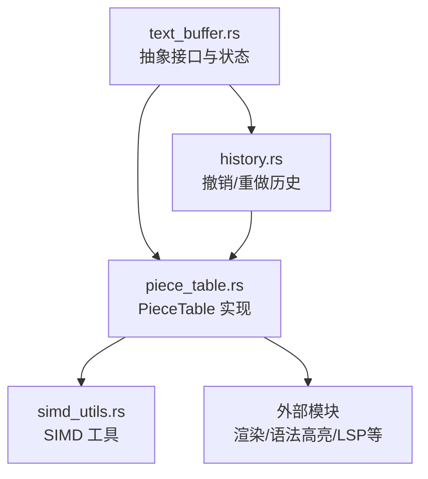
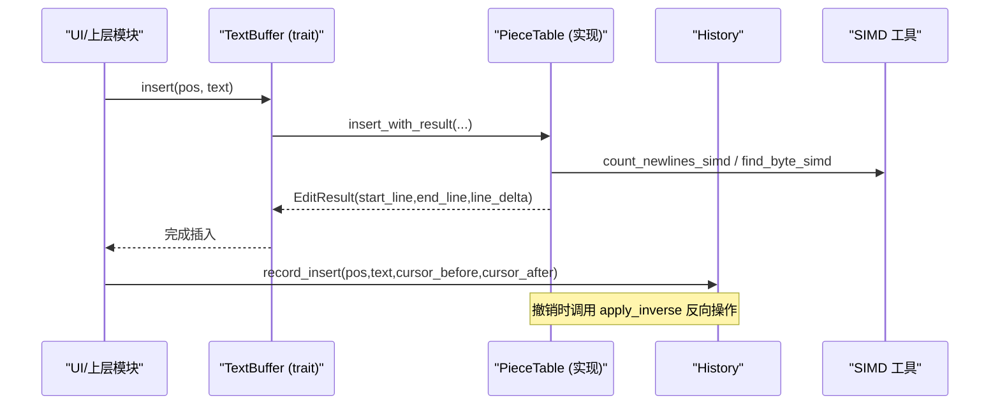
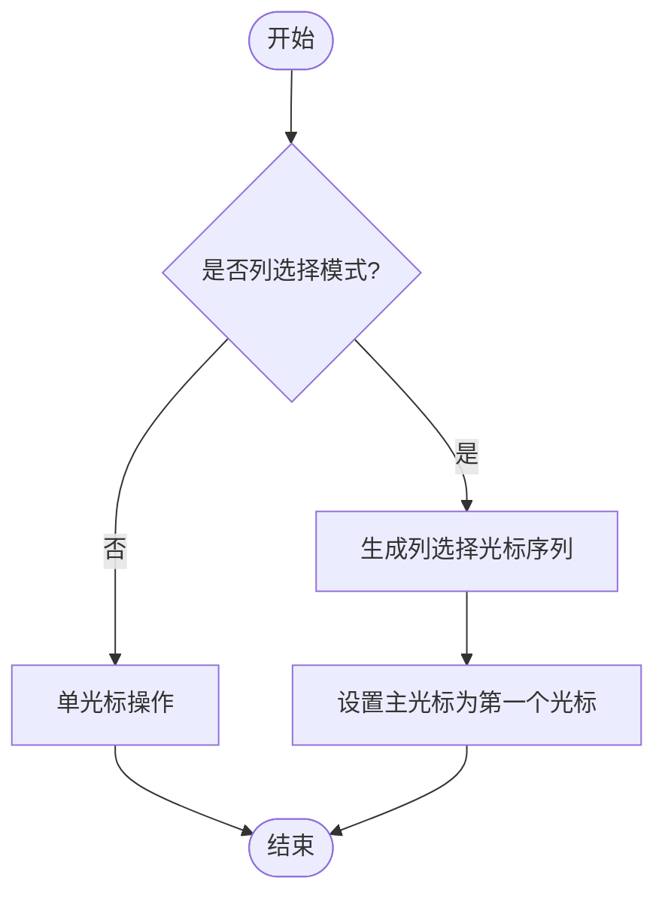
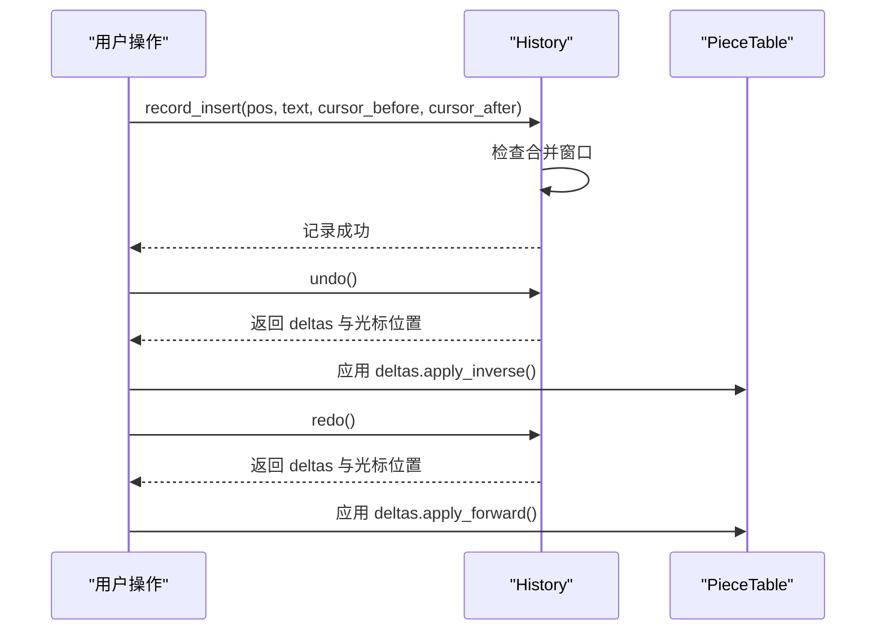
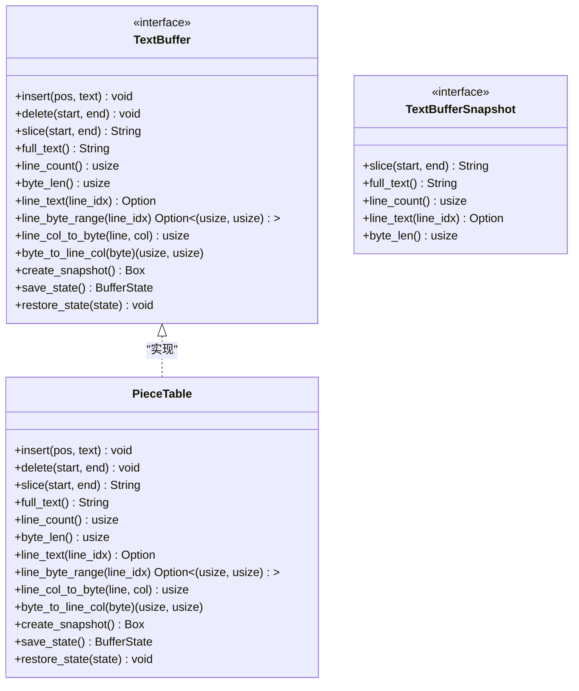
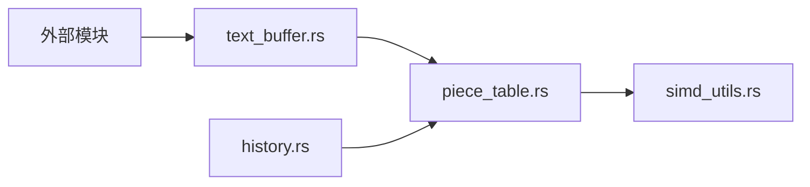

# 文本缓冲系统

<cite>
**本文引用的文件**
- [crates/aether-core/src/buffer/mod.rs](file://crates/aether-core/src/buffer/mod.rs)
- [crates/aether-core/src/buffer/piece_table.rs](file://crates/aether-core/src/buffer/piece_table.rs)
- [crates/aether-core/src/buffer/text_buffer.rs](file://crates/aether-core/src/buffer/text_buffer.rs)
- [crates/aether-core/src/buffer/history.rs](file://crates/aether-core/src/buffer/history.rs)
- [crates/aether-core/src/simd_utils.rs](file://crates/aether-core/src/simd_utils.rs)
</cite>

## 目录
1. [简介](#简介)
2. [项目结构](#项目结构)
3. [核心组件](#核心组件)
4. [架构总览](#架构总览)
5. [详细组件分析](#详细组件分析)
6. [依赖关系分析](#依赖关系分析)
7. [性能考量](#性能考量)
8. [故障排查指南](#故障排查指南)
9. [结论](#结论)
10. [附录：API 使用示例与最佳实践](#附录api-使用示例与最佳实践)

## 简介
本仓库的文本缓冲系统基于 Piece Table 算法实现，提供高性能、可扩展的文本编辑能力。其设计目标包括：
- O(1) 插入/删除（以片段为单位），支持大文件零拷贝打开与读取
- 多光标与选择区域管理
- 撤销/重做历史栈，采用差分记录与合并窗口，避免全量快照带来的内存膨胀
- 抽象层 TextBuffer trait，屏蔽底层数据结构细节，便于替换或扩展
- 行索引两级分块与增量更新，保证行级操作的高效性
- SIMD 加速的换行查找与计数，提升大文件处理性能

## 项目结构
文本缓冲相关代码集中在 aether-core 包的 buffer 模块中，包含以下关键文件：
- mod.rs：模块导出与对外类型重命名
- piece_table.rs：PieceTable 核心实现（插入/删除/读取/行索引/缓存）
- text_buffer.rs：TextBuffer trait、快照、光标、选择、多光标状态等抽象定义
- history.rs：撤销/重做历史栈（差分记录、分组、合并窗口）
- simd_utils.rs：SIMD 加速工具（换行计数、字节查找、空白跳过等）

图表来源
- [crates/aether-core/src/buffer/text_buffer.rs:1-49](file://crates/aether-core/src/buffer/text_buffer.rs#L1-L49)
- [crates/aether-core/src/buffer/piece_table.rs:11-35](file://crates/aether-core/src/buffer/piece_table.rs#L11-L35)
- [crates/aether-core/src/buffer/history.rs:6-28](file://crates/aether-core/src/buffer/history.rs#L6-L28)
- [crates/aether-core/src/simd_utils.rs:1-18](file://crates/aether-core/src/simd_utils.rs#L1-L18)

章节来源
- [crates/aether-core/src/buffer/mod.rs:1-9](file://crates/aether-core/src/buffer/mod.rs#L1-L9)

## 核心组件
- TextBuffer 抽象：统一插入、删除、切片、行查询、字节/行列转换、快照创建、状态保存/恢复
- PieceTable：具体实现，维护原始文件映射、追加缓冲区、有序片段表、行索引、偏移前缀和缓存、字符/行数统计、编辑计数与自动合并阈值
- History：撤销/重做历史，记录 EditDelta（插入/删除/替换），支持连续输入合并与撤销组
- 多光标与选择：Cursor、Selection、MultiCursorState，支持列选择模式与主光标钳位保护
- SIMD 工具：换行计数、字节查找、空白跳过、行长度计算等

章节来源
- [crates/aether-core/src/buffer/text_buffer.rs:1-171](file://crates/aether-core/src/buffer/text_buffer.rs#L1-L171)
- [crates/aether-core/src/buffer/piece_table.rs:11-35](file://crates/aether-core/src/buffer/piece_table.rs#L11-L35)
- [crates/aether-core/src/buffer/history.rs:6-28](file://crates/aether-core/src/buffer/history.rs#L6-L28)
- [crates/aether-core/src/simd_utils.rs:1-18](file://crates/aether-core/src/simd_utils.rs#L1-L18)

## 架构总览
文本缓冲系统采用“抽象层 + 具体实现 + 历史管理”的分层架构：
- 抽象层（TextBuffer trait）定义统一的编辑与查询接口，屏蔽底层数据结构差异
- 具体实现（PieceTable）负责高效的数据结构与算法优化（片段表、行索引、缓存、SIMD）
- 历史管理（History）通过差分记录与合并窗口，提供高效的撤销/重做能力
- 外部模块通过 TextBuffer 接口与 PieceTable 交互，获得一致的 API 体验

图表来源
- [crates/aether-core/src/buffer/text_buffer.rs:8-49](file://crates/aether-core/src/buffer/text_buffer.rs#L8-L49)
- [crates/aether-core/src/buffer/piece_table.rs:450-562](file://crates/aether-core/src/buffer/piece_table.rs#L450-L562)
- [crates/aether-core/src/buffer/history.rs:140-196](file://crates/aether-core/src/buffer/history.rs#L140-L196)
- [crates/aether-core/src/simd_utils.rs:8-18](file://crates/aether-core/src/simd_utils.rs#L8-L18)

## 详细组件分析

### PieceTable 数据结构与算法
- 数据结构
  - original：可选的内存映射原始文件内容（Arc<Mmap>），用于零拷贝读取
  - add_buffer：只追加的缓冲区，存储新增文本
  - pieces：有序片段表，每个片段指向 original 或 add_buffer 的某段连续字节
  - line_index：两级分块的行索引，支持快速行号到字节偏移的转换与增量更新
  - piece_offset_cache：片段起始字节偏移的前缀和缓存，O(1) 获取总字节数与定位片段
  - len_chars/len_lines/edit_count/coalesce_threshold：统计与合并控制字段
- 插入逻辑
  - 在指定字节位置插入文本，必要时拆分片段并插入新片段
  - 增量更新行索引：收集新行起始位置，平移后续行起始偏移，插入新行
  - 维护 edit_count，达到阈值后合并片段以减少碎片
- 删除逻辑
  - 删除指定字节范围，可能涉及片段拆分、合并或删除
  - 增量更新行索引：删除受影响的行起始，平移后续行起始偏移
- 读取逻辑
  - get_text_bytes：优先零拷贝路径（单片段命中），否则回退拼接
  - get_line/get_all_text：封装读取逻辑，处理 CRLF 换行符
  - write_to：直接写出片段数据，避免中间 String 分配
- 行索引
  - LineIndex：分块存储行起始偏移，支持 split/shift/drain/splice 等操作
  - 增量更新：insert/delete 时仅影响局部，避免全量重建
- 性能优化
  - 前缀和缓存：O(1) 获取总字节数与片段定位
  - SIMD 加速：换行计数与查找使用 bytecount/memchr
  - 自动合并：控制片段数量，平衡内存与性能

```mermaid
classDiagram
class PieceTable {
+original : Option<Arc<Mmap>>
+add_buffer : Vec<u8>
+pieces : Vec<Piece>
+line_index : LineIndex
+piece_offset_cache : Vec<usize>
+len_chars : usize
+len_lines : usize
+edit_count : usize
+coalesce_threshold : usize
+insert_with_result(pos, text) EditResult
+delete_with_result(start, end) EditResult
+get_text_bytes(start, end) Option<&[u8]>
+get_line(line_idx) Option<String>
+get_all_text() String
+write_to(writer) Result
+is_pristine() bool
+restore(pieces, add_len) void
}
class Piece {
+source : Source
+start : usize
+len : usize
+line_breaks : u32
}
class Source {
<<enum>>
Original
Add
}
class LineIndex {
+block_start_lines : Vec<usize>
+blocks : Vec<LineBlock>
+total_lines : usize
+line_start(line_idx) Option<usize>
+line_end(line_idx, total_bytes) Option<usize>
+splice_insert(insert_at, new_starts) void
+shift_from(from_line, delta) void
+shift_from_sub(from_line, delta) void
+drain_range(start_line, end_line) void
}
PieceTable --> Piece : "contains"
PieceTable --> LineIndex : "uses"
Piece --> Source : "references"
```

图表来源
- [crates/aether-core/src/buffer/piece_table.rs:11-35](file://crates/aether-core/src/buffer/piece_table.rs#L11-L35)
- [crates/aether-core/src/buffer/piece_table.rs:53-66](file://crates/aether-core/src/buffer/piece_table.rs#L53-L66)
- [crates/aether-core/src/buffer/piece_table.rs:73-114](file://crates/aether-core/src/buffer/piece_table.rs#L73-L114)

章节来源
- [crates/aether-core/src/buffer/piece_table.rs:11-35](file://crates/aether-core/src/buffer/piece_table.rs#L11-L35)
- [crates/aether-core/src/buffer/piece_table.rs:450-562](file://crates/aether-core/src/buffer/piece_table.rs#L450-L562)
- [crates/aether-core/src/buffer/piece_table.rs:569-688](file://crates/aether-core/src/buffer/piece_table.rs#L569-L688)
- [crates/aether-core/src/buffer/piece_table.rs:710-794](file://crates/aether-core/src/buffer/piece_table.rs#L710-L794)
- [crates/aether-core/src/buffer/piece_table.rs:934-1060](file://crates/aether-core/src/buffer/piece_table.rs#L934-L1060)

### 多光标支持机制
- Cursor：表示光标位置（行号+列号）
- Selection：表示选择区域（start/end）
- MultiCursorState：管理多个光标与选择区域，支持列选择模式与主光标钳位保护
- 主要方法
  - add_cursor/clear_secondary_cursors：添加/清理辅助光标
  - add_column_cursors：生成列选择模式的光标序列
  - primary_cursor/primary_cursor_mut：安全访问主光标（带钳位）

图表来源
- [crates/aether-core/src/buffer/text_buffer.rs:83-122](file://crates/aether-core/src/buffer/text_buffer.rs#L83-L122)
- [crates/aether-core/src/buffer/text_buffer.rs:173-258](file://crates/aether-core/src/buffer/text_buffer.rs#L173-L258)

章节来源
- [crates/aether-core/src/buffer/text_buffer.rs:83-258](file://crates/aether-core/src/buffer/text_buffer.rs#L83-L258)

### 撤销/重做历史栈管理
- EditDelta：记录一次编辑的可逆信息（插入/删除/替换）
- EditRecord：轻量记录，包含差分、光标前后位置、时间戳
- History：管理撤销/重做栈，支持连续输入合并与撤销组
- 合并窗口：500ms 内同位置连续输入/删除会合并为一条记录
- 撤销组：begin_group/end_group 将多条记录归为一个撤销步骤

图表来源
- [crates/aether-core/src/buffer/history.rs:30-77](file://crates/aether-core/src/buffer/history.rs#L30-L77)
- [crates/aether-core/src/buffer/history.rs:140-196](file://crates/aether-core/src/buffer/history.rs#L140-L196)
- [crates/aether-core/src/buffer/history.rs:303-323](file://crates/aether-core/src/buffer/history.rs#L303-L323)

章节来源
- [crates/aether-core/src/buffer/history.rs:6-28](file://crates/aether-core/src/buffer/history.rs#L6-L28)
- [crates/aether-core/src/buffer/history.rs:140-196](file://crates/aether-core/src/buffer/history.rs#L140-L196)
- [crates/aether-core/src/buffer/history.rs:303-323](file://crates/aether-core/src/buffer/history.rs#L303-L323)

### 文本缓冲抽象层设计
- TextBuffer trait：定义统一的编辑与查询接口
- TextBufferSnapshot：不可变快照，用于后台线程安全访问
- BufferState：轻量状态快照，用于 Undo/Redo
- PieceTable 实现：提供具体实现，满足所有 trait 方法

图表来源
- [crates/aether-core/src/buffer/text_buffer.rs:1-49](file://crates/aether-core/src/buffer/text_buffer.rs#L1-L49)
- [crates/aether-core/src/buffer/text_buffer.rs:51-59](file://crates/aether-core/src/buffer/text_buffer.rs#L51-L59)
- [crates/aether-core/src/buffer/piece_table.rs:1550-1600](file://crates/aether-core/src/buffer/piece_table.rs#L1550-L1600)

章节来源
- [crates/aether-core/src/buffer/text_buffer.rs:1-59](file://crates/aether-core/src/buffer/text_buffer.rs#L1-L59)
- [crates/aether-core/src/buffer/piece_table.rs:1550-1600](file://crates/aether-core/src/buffer/piece_table.rs#L1550-L1600)

## 依赖关系分析
- PieceTable 依赖 simd_utils 进行高性能换行查找与计数
- History 依赖 PieceTable 进行撤销/重做操作
- TextBuffer trait 被 PieceTable 实现，供上层模块使用
- 外部模块通过 TextBuffer 接口与缓冲系统交互，解耦具体实现

图表来源
- [crates/aether-core/src/buffer/text_buffer.rs:1-49](file://crates/aether-core/src/buffer/text_buffer.rs#L1-L49)
- [crates/aether-core/src/buffer/piece_table.rs:11-35](file://crates/aether-core/src/buffer/piece_table.rs#L11-L35)
- [crates/aether-core/src/buffer/history.rs:6-28](file://crates/aether-core/src/buffer/history.rs#L6-L28)
- [crates/aether-core/src/simd_utils.rs:1-18](file://crates/aether-core/src/simd_utils.rs#L1-L18)

章节来源
- [crates/aether-core/src/buffer/mod.rs:1-9](file://crates/aether-core/src/buffer/mod.rs#L1-L9)

## 性能考量
- 插入/删除：O(1) 片段操作，避免大规模内存移动
- 行索引：两级分块结构，增量更新避免全量重建
- 读取：优先零拷贝路径，减少内存分配
- 缓存：前缀和缓存 O(1) 获取总字节数与片段定位
- SIMD：换行查找与计数使用硬件加速
- 合并：自动合并碎片，控制片段数量
- 历史：差分记录与合并窗口，避免全量快照

## 故障排查指南
- 空缓冲区边界：确保空缓冲区插入/删除不会越界
- 跨片段读取：当 get_text_bytes 返回 None 时，回退到拼接路径
- 行索引一致性：删除后需正确更新行索引，避免幽灵行起点
- 历史合并：连续输入应在合并窗口内正确合并
- 主光标钳位：确保 primary_cursor 不越界

章节来源
- [crates/aether-core/src/buffer/piece_table.rs:472-493](file://crates/aether-core/src/buffer/piece_table.rs#L472-L493)
- [crates/aether-core/src/buffer/piece_table.rs:724-741](file://crates/aether-core/src/buffer/piece_table.rs#L724-L741)
- [crates/aether-core/src/buffer/piece_table.rs:1025-1059](file://crates/aether-core/src/buffer/piece_table.rs#L1025-L1059)
- [crates/aether-core/src/buffer/text_buffer.rs:191-196](file://crates/aether-core/src/buffer/text_buffer.rs#L191-L196)

## 结论
文本缓冲系统通过 Piece Table 算法实现了高性能的文本编辑能力，结合行索引优化、SIMD 加速、撤销/重做历史管理等特性，为大文件编辑提供了稳定可靠的底层支持。抽象层设计使得系统易于扩展与维护，多光标支持提升了用户体验。

## 附录：API 使用示例与最佳实践

### 基本操作
- 插入文本：使用 insert 或 insert_with_result，注意字节偏移与行号转换
- 删除文本：使用 delete 或 delete_with_result，确保范围有效
- 读取文本：优先使用 get_line_bytes 零拷贝路径，否则回退到 get_text
- 行操作：使用 line_text 获取行内容，line_byte_range 获取字节范围

### 多光标操作
- 添加光标：使用 add_cursor 添加辅助光标
- 列选择：使用 add_column_cursors 生成列选择模式的光标
- 主光标：通过 primary_cursor 安全访问主光标

### 撤销/重做
- 记录操作：使用 record_insert/record_delete/record_replace 记录编辑
- 撤销/重做：调用 undo/redo 获取差分列表并应用到缓冲区
- 撤销组：使用 begin_group/end_group 将多个操作归为一个撤销步骤

### 性能最佳实践
- 批量操作：合并多次插入/删除，减少行索引更新次数
- 零拷贝读取：优先使用 get_line_bytes 避免内存分配
- 合理使用历史：利用合并窗口减少历史记录数量
- 大文件处理：利用内存映射与 SIMD 加速提升性能

章节来源
- [crates/aether-core/src/buffer/piece_table.rs:450-562](file://crates/aether-core/src/buffer/piece_table.rs#L450-L562)
- [crates/aether-core/src/buffer/piece_table.rs:569-688](file://crates/aether-core/src/buffer/piece_table.rs#L569-L688)
- [crates/aether-core/src/buffer/piece_table.rs:710-794](file://crates/aether-core/src/buffer/piece_table.rs#L710-L794)
- [crates/aether-core/src/buffer/text_buffer.rs:173-258](file://crates/aether-core/src/buffer/text_buffer.rs#L173-L258)
- [crates/aether-core/src/buffer/history.rs:140-196](file://crates/aether-core/src/buffer/history.rs#L140-L196)
- [crates/aether-core/src/buffer/history.rs:303-323](file://crates/aether-core/src/buffer/history.rs#L303-L323)