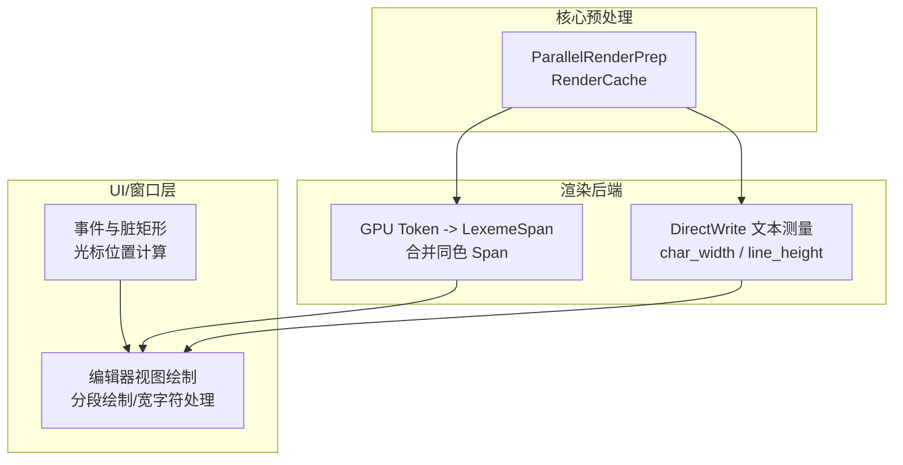
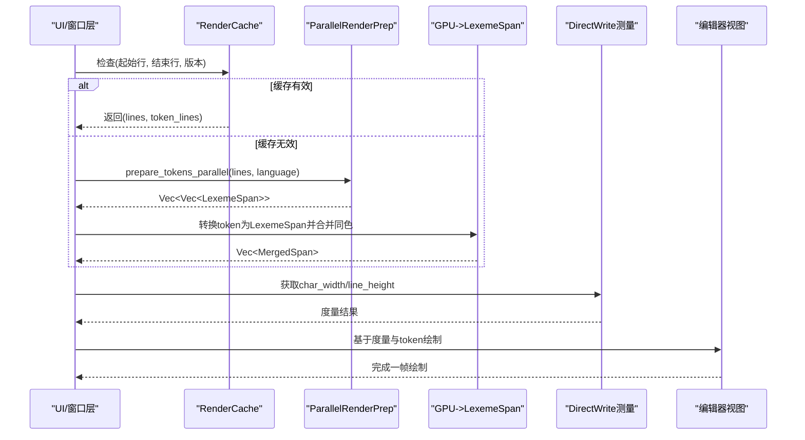
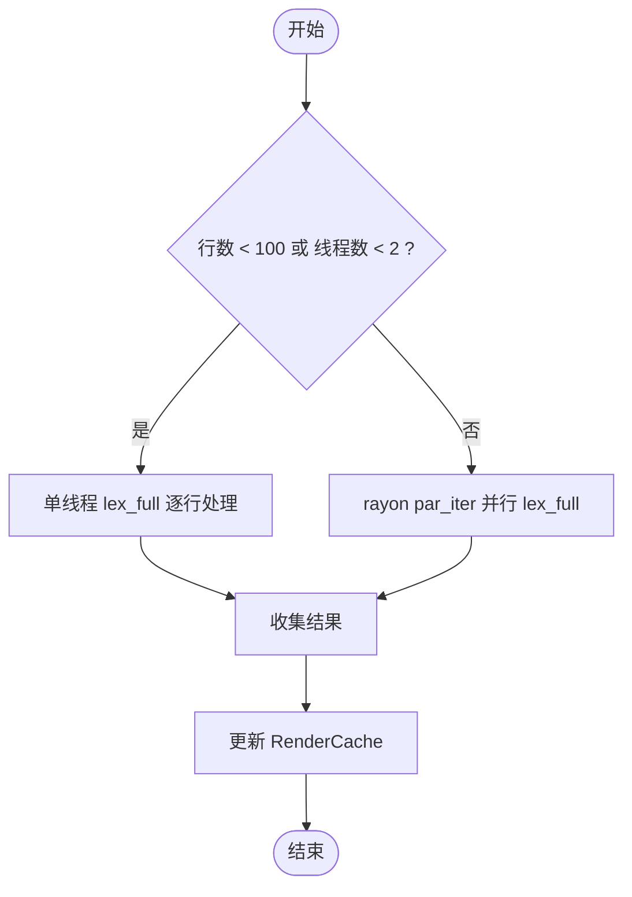
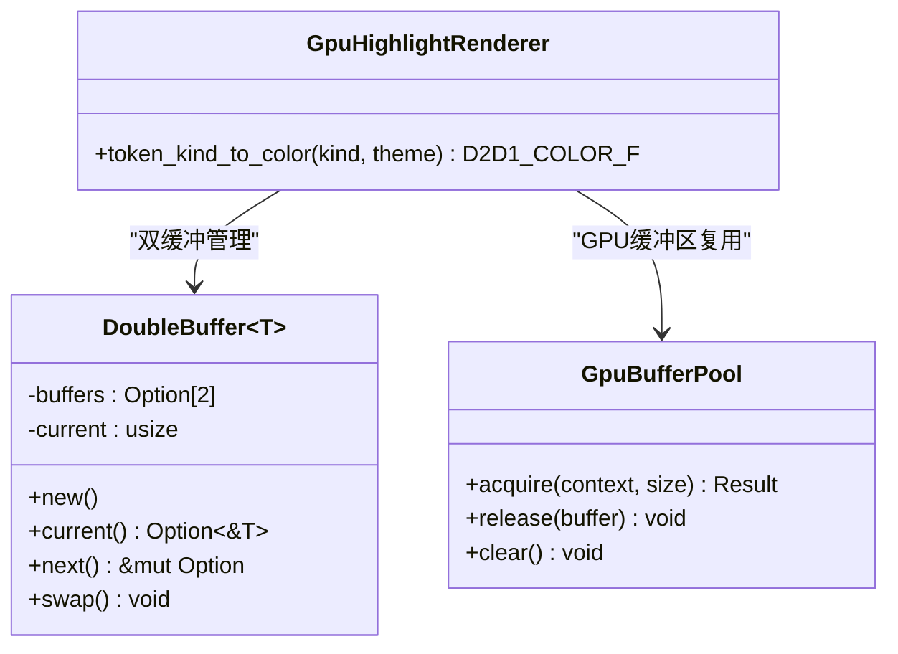
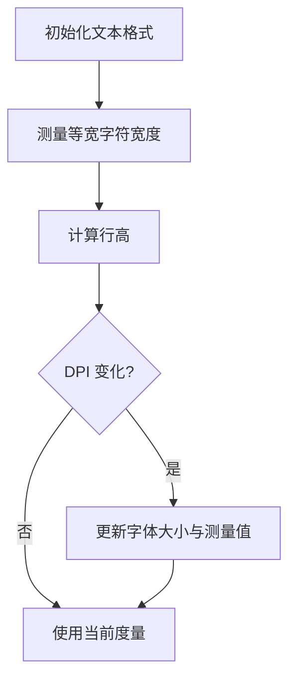
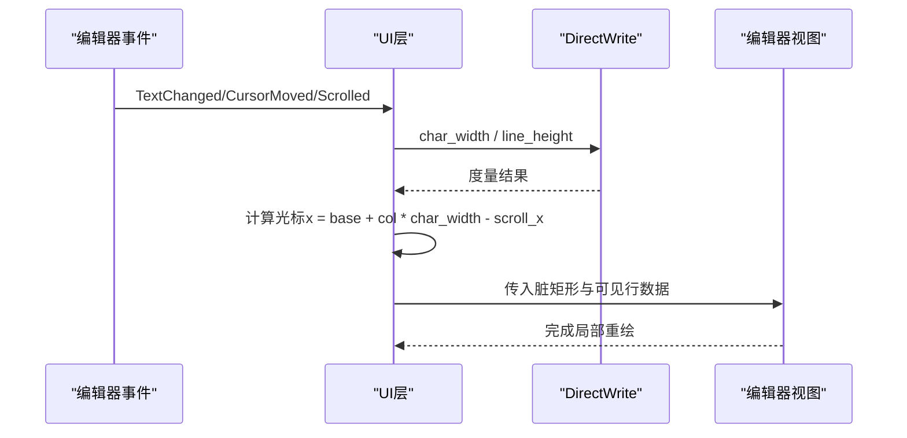
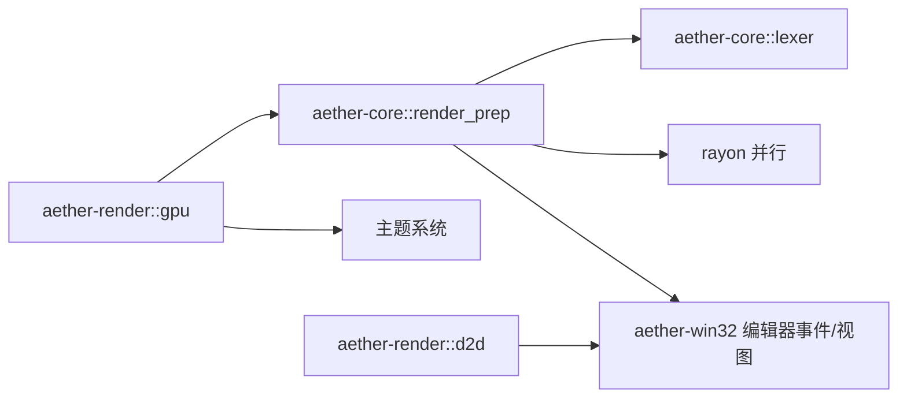

# 渲染预处理

<cite>
**本文引用的文件**
- [render_prep.rs](file://crates/aether-core/src/render_prep.rs)
- [lib.rs（aether-core）](file://crates/aether-core/src/lib.rs)
- [render.rs（GPU）](file://crates/aether-render/src/gpu/render.rs)
- [text.rs（D2D）](file://crates/aether-render/src/d2d/text.rs)
- [brush_cache.rs（D2D）](file://crates/aether-render/src/d2d/brush_cache.rs)
- [events.rs（Win32编辑器事件）](file://crates/aether-win32/src/editor/events.rs)
- [editor_view.rs（Win32编辑器视图）](file://crates/aether-win32/src/render/editor_view.rs)
</cite>

## 目录
1. [简介](#简介)
2. [项目结构](#项目结构)
3. [核心组件](#核心组件)
4. [架构总览](#架构总览)
5. [详细组件分析](#详细组件分析)
6. [依赖关系分析](#依赖关系分析)
7. [性能考虑](#性能考虑)
8. [故障排查指南](#故障排查指南)
9. [结论](#结论)
10. [附录：使用示例与最佳实践](#附录使用示例与最佳实践)

## 简介
本文件围绕“渲染预处理”展开，聚焦文本在最终绘制前的准备工作，包括：
- 字符宽度计算与等宽字体度量
- 布局预计算（可见行范围、滚动偏移、脏矩形）
- 渲染数据准备（逐行文本与词法标记 token 的并行生成、合并与缓存）
并说明如何优化渲染性能（减少重复计算、降低 DrawText 调用次数），以及预处理结果如何传递给渲染引擎。同时解释与字符宽度计算的协作关系和内存管理策略。

## 项目结构
本项目将渲染预处理能力集中在 aether-core 的 render_prep 模块中，并通过 aether-render 的 GPU/D2D 管线进行高亮与绘制；UI 层负责布局与脏区域更新。

图示来源
- [render_prep.rs:1-194](file://crates/aether-core/src/render_prep.rs#L1-L194)
- [render.rs（GPU）:1-220](file://crates/aether-render/src/gpu/render.rs#L1-L220)
- [text.rs（D2D）:15-142](file://crates/aether-render/src/d2d/text.rs#L15-L142)
- [events.rs（Win32编辑器事件）:122-200](file://crates/aether-win32/src/editor/events.rs#L122-L200)
- [editor_view.rs（Win32编辑器视图）:848-866](file://crates/aether-win32/src/render/editor_view.rs#L848-L866)

章节来源
- [lib.rs（aether-core）:1-12](file://crates/aether-core/src/lib.rs#L1-L12)

## 核心组件
- ParallelRenderPrep：并行预处理可见行的 token，按行数阈值选择单线程或并行路径，复用 rayon 线程池避免频繁创建销毁开销。
- RenderCache：缓存可见行的文本与 token 列表、起止行号与版本号，用于快速失效判断与增量更新。
- GPU 渲染桥接：将 GPU 生成的 token 转换为 LexemeSpan，并按主题颜色映射；合并相邻同色 token 以减少绘制调用。
- DirectWrite 文本测量：提供等宽字符宽度与行高测量，供 UI 层计算光标位置、滚动与脏矩形。
- 编辑器事件与视图：根据字符列与字符宽度计算光标 x 坐标，驱动脏矩形更新；视图层对宽/窄字符分段绘制以命中缓存。

章节来源
- [render_prep.rs:1-194](file://crates/aether-core/src/render_prep.rs#L1-L194)
- [render.rs（GPU）:1-220](file://crates/aether-render/src/gpu/render.rs#L1-L220)
- [text.rs（D2D）:15-142](file://crates/aether-render/src/d2d/text.rs#L15-L142)
- [events.rs（Win32编辑器事件）:122-200](file://crates/aether-win32/src/editor/events.rs#L122-L200)
- [editor_view.rs（Win32编辑器视图）:848-866](file://crates/aether-win32/src/render/editor_view.rs#L848-L866)

## 架构总览
渲染预处理的关键流程如下：
1) 获取可见行范围与版本，检查 RenderCache 是否有效。
2) 若无效，则使用 ParallelRenderPrep 并行生成每行的 token 列表；否则直接读取缓存。
3) 将 GPU 输出的 token 转换为 LexemeSpan，并按主题映射颜色；合并相邻同色 token。
4) 使用 DirectWrite 测量的等宽字符宽度与行高，计算光标位置与脏矩形。
5) 视图层按段绘制文本，宽字符单独绘制以命中缓存，减少重绘。

图示来源
- [render_prep.rs:32-60](file://crates/aether-core/src/render_prep.rs#L32-L60)
- [render.rs（GPU）:74-114](file://crates/aether-render/src/gpu/render.rs#L74-L114)
- [text.rs（D2D）:36-67](file://crates/aether-render/src/d2d/text.rs#L36-L67)
- [events.rs（Win32编辑器事件）:122-200](file://crates/aether-win32/src/editor/events.rs#L122-L200)

## 详细组件分析

### 并行预处理与缓存（ParallelRenderPrep 与 RenderCache）
- 并行策略：当行数较少或线程数不足时回退到单线程；否则使用 rayon 并行 map-reduce，每个线程独立创建 lexer 并处理分块，避免共享状态竞争。
- 缓存策略：记录 lines、token_lines、start_line、end_line、version；通过 is_valid 快速判断是否需要重新计算；update/clear 支持生命周期管理。
- 复杂度：并行路径近似 O(N) 行处理，N 为可见行数；缓存命中时为 O(1)。

图示来源
- [render_prep.rs:32-60](file://crates/aether-core/src/render_prep.rs#L32-L60)
- [render_prep.rs:69-131](file://crates/aether-core/src/render_prep.rs#L69-L131)

章节来源
- [render_prep.rs:1-194](file://crates/aether-core/src/render_prep.rs#L1-L194)

### GPU 高亮与合并（GPU->LexemeSpan 与合并同色）
- 转换：将 GPU 生成的 GpuToken 转为 LexemeSpan，并根据语法分类或 token 类型确定 TokenKind。
- 合并：相邻且相同类型的 token 合并为 MergedSpan，显著减少后续 DrawText 调用次数。
- 颜色映射：TokenKind 映射为主题颜色，便于后续绘制着色。

图示来源
- [render.rs（GPU）:116-220](file://crates/aether-render/src/gpu/render.rs#L116-L220)

章节来源
- [render.rs（GPU）:1-220](file://crates/aether-render/src/gpu/render.rs#L1-L220)

### 字符宽度与行高测量（DirectWrite）
- 等宽字符宽度：通过 IDWriteTextLayout 测量单个字符推进宽度，作为统一度量基准。
- 行高：基于字体大小计算，用于行间距与滚动步长。
- DPI 缩放：支持设置 DPI 缩放因子，动态更新字体大小与测量值，保证跨屏一致性。

图示来源
- [text.rs（D2D）:36-67](file://crates/aether-render/src/d2d/text.rs#L36-L67)
- [text.rs（D2D）:69-142](file://crates/aether-render/src/d2d/text.rs#L69-L142)

章节来源
- [text.rs（D2D）:15-142](file://crates/aether-render/src/d2d/text.rs#L15-L142)

### 编辑器事件与脏矩形（光标位置与区域更新）
- 光标位置：基于字符列与等宽字符宽度计算光标 x 坐标，避免非 ASCII 文本导致的残影/撕裂。
- 脏矩形：根据事件类型（文本变更、光标移动、滚动等）生成对应脏区域，最小化重绘范围。
- 视图绘制：对宽字符单独绘制，窄字符连续区间批量绘制，提升缓存命中率与绘制效率。

图示来源
- [events.rs（Win32编辑器事件）:122-200](file://crates/aether-win32/src/editor/events.rs#L122-L200)
- [editor_view.rs（Win32编辑器视图）:848-866](file://crates/aether-win32/src/render/editor_view.rs#L848-L866)

章节来源
- [events.rs（Win32编辑器事件）:122-200](file://crates/aether-win32/src/editor/events.rs#L122-L200)
- [editor_view.rs（Win32编辑器视图）:848-866](file://crates/aether-win32/src/render/editor_view.rs#L848-L866)

## 依赖关系分析
- aether-core::render_prep 依赖 aether-core::lexer（语言词法分析）与 rayon（并行）。
- aether-render::gpu 依赖 aether-core::lexer（LexemeSpan、TokenKind）与主题系统。
- aether-render::d2d 提供文本度量接口，被 UI 层用于布局与光标定位。
- aether-win32 编辑器事件与视图依赖 d2d 度量结果与预处理数据，驱动脏矩形与绘制。

图示来源
- [render_prep.rs:1-60](file://crates/aether-core/src/render_prep.rs#L1-L60)
- [render.rs（GPU）:1-73](file://crates/aether-render/src/gpu/render.rs#L1-L73)
- [text.rs（D2D）:36-142](file://crates/aether-render/src/d2d/text.rs#L36-L142)
- [events.rs（Win32编辑器事件）:122-200](file://crates/aether-win32/src/editor/events.rs#L122-L200)

章节来源
- [render_prep.rs:1-60](file://crates/aether-core/src/render_prep.rs#L1-L60)
- [render.rs（GPU）:1-73](file://crates/aether-render/src/gpu/render.rs#L1-L73)
- [text.rs（D2D）:36-142](file://crates/aether-render/src/d2d/text.rs#L36-L142)
- [events.rs（Win32编辑器事件）:122-200](file://crates/aether-win32/src/editor/events.rs#L122-L200)

## 性能考虑
- 并行阈值：行数少于阈值或线程数不足时回退单线程，避免并行开销大于收益。
- 缓存命中：通过 version/start_line/end_line 精确控制缓存有效性，减少重复计算。
- 合并同色 token：相邻同类型 token 合并，显著减少 DrawText 调用次数。
- 宽字符单独绘制：视图层对宽字符单独绘制，窄字符批量绘制，提高缓存命中率。
- 双缓冲与 GPU 池：DoubleBuffer 与 GpuBufferPool 实现 CPU/GPU 并行与资源复用，降低分配/释放成本。
- 字符宽度测量：使用 DirectWrite 实测等宽字符宽度，避免硬编码误差导致的光标错位与重绘浪费。

[本节为通用性能建议，不直接分析具体文件]

## 故障排查指南
- 光标残影/撕裂：确保使用字符列与等宽字符宽度计算光标 x 坐标，避免字节偏移与非 ASCII 文本导致的偏差。
- 字体缩放异常：DPI 变化时需同步更新文本格式缓存与度量值，防止旧格式导致布局错误。
- 渲染抖动：检查 RenderCache 的版本号与起止行号是否正确更新；确认脏矩形范围合理，避免全量重绘。
- 高亮不正确：确认 GPU->LexemeSpan 转换与语法分类置信度阈值，必要时回退到 token 类型判定。

章节来源
- [events.rs（Win32编辑器事件）:122-200](file://crates/aether-win32/src/editor/events.rs#L122-L200)
- [text.rs（D2D）:69-142](file://crates/aether-render/src/d2d/text.rs#L69-L142)
- [render.rs（GPU）:7-73](file://crates/aether-render/src/gpu/render.rs#L7-L73)

## 结论
渲染预处理通过并行 token 生成、缓存机制、DirectWrite 度量与 GPU 高亮合并，形成高效稳定的文本渲染链路。结合 UI 层的脏矩形与分段绘制策略，可在大文档与高频编辑场景下保持流畅体验。遵循本文的性能与内存管理建议，可进一步降低重复计算与绘制开销。

[本节为总结性内容，不直接分析具体文件]

## 附录：使用示例与最佳实践
- 预处理流程示例
  - 获取可见行范围与版本，调用 RenderCache::is_valid 判断是否命中。
  - 未命中时调用 ParallelRenderPrep::prepare_tokens_parallel 生成 token 列表。
  - 将 GPU 输出转换为 LexemeSpan，并调用 merge_same_color_tokens 合并同色 token。
  - 使用 DirectWrite 的 char_width/line_height 计算光标位置与脏矩形。
  - 将预处理结果（lines、token_lines、合并后的 span）传递给渲染引擎进行绘制。
- 与字符宽度计算的协作
  - 所有光标与滚动相关的位置计算均基于等宽字符宽度；字体大小或 DPI 变化时需刷新度量。
  - 视图层对宽字符单独绘制，窄字符批量绘制，最大化缓存命中。
- 内存管理策略
  - RenderCache 使用 version 控制失效，避免不必要的数据重建。
  - DoubleBuffer 与 GpuBufferPool 实现对象复用，减少分配/释放。
  - 合并同色 token 减少中间数据结构数量，降低内存压力。

章节来源
- [render_prep.rs:32-131](file://crates/aether-core/src/render_prep.rs#L32-L131)
- [render.rs（GPU）:74-114](file://crates/aether-render/src/gpu/render.rs#L74-L114)
- [text.rs（D2D）:36-142](file://crates/aether-render/src/d2d/text.rs#L36-L142)
- [events.rs（Win32编辑器事件）:122-200](file://crates/aether-win32/src/editor/events.rs#L122-L200)
- [editor_view.rs（Win32编辑器视图）:848-866](file://crates/aether-win32/src/render/editor_view.rs#L848-L866)