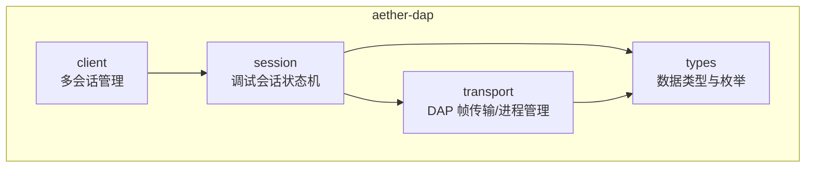
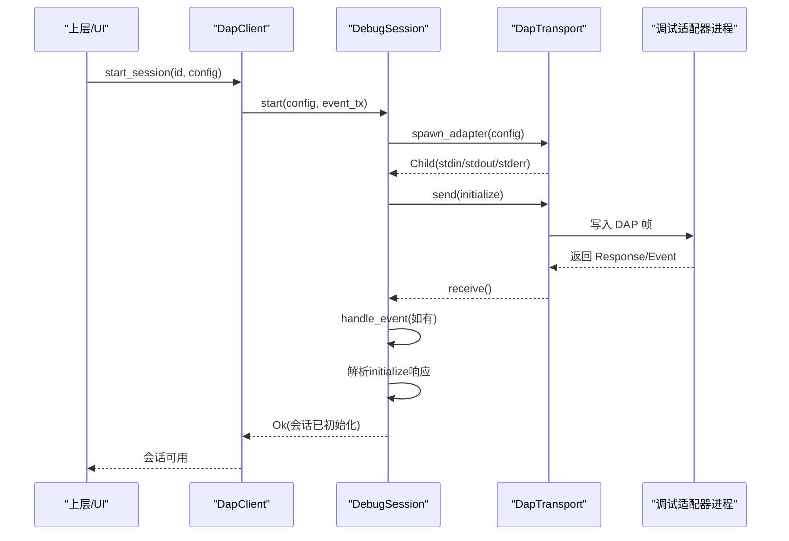
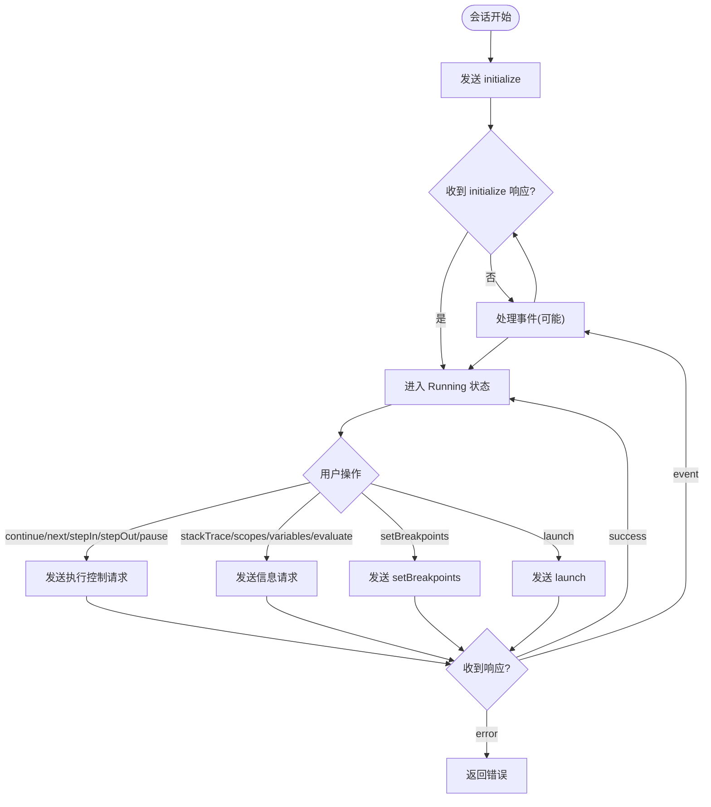
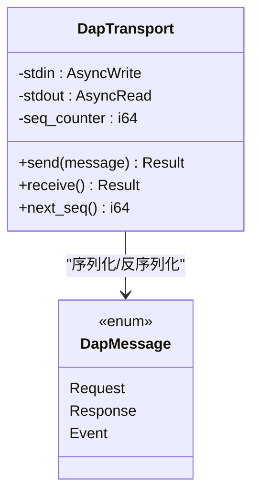
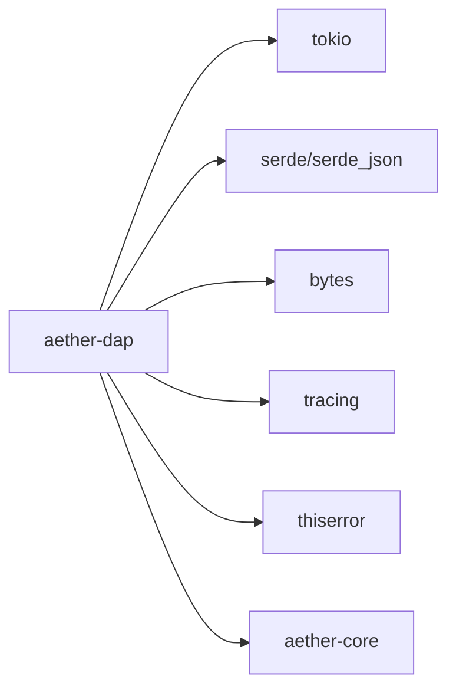

# aether-dap 调试适配器

<cite>
**本文引用的文件**
- [lib.rs](file://crates/aether-dap/src/lib.rs)
- [client.rs](file://crates/aether-dap/src/client.rs)
- [session.rs](file://crates/aether-dap/src/session.rs)
- [transport.rs](file://crates/aether-dap/src/transport.rs)
- [types.rs](file://crates/aether-dap/src/types.rs)
- [Cargo.toml](file://crates/aether-dap/Cargo.toml)
</cite>

## 目录
1. [简介](#简介)
2. [项目结构](#项目结构)
3. [核心组件](#核心组件)
4. [架构总览](#架构总览)
5. [详细组件分析](#详细组件分析)
6. [依赖关系分析](#依赖关系分析)
7. [性能与可靠性](#性能与可靠性)
8. [故障排查指南](#故障排查指南)
9. [结论](#结论)
10. [附录：配置与集成示例](#附录配置与集成示例)

## 简介
aether-dap 是 Aether 编辑器中的调试适配器客户端模块，基于 Debug Adapter Protocol（DAP）实现与外部调试适配器的通信。它负责：
- 启动并管理调试适配器进程的生命周期
- 维护调试会话状态机（初始化、运行、暂停、终止等）
- 发送 DAP 请求（如 initialize、launch、setBreakpoints、continue、next、stepIn、stepOut、pause、stackTrace、scopes、variables、evaluate）
- 接收并处理 DAP 事件（stopped、continued、output、breakpoint、terminated、exited 等）
- 通过无界通道将 UI 相关事件上抛给上层 UI/编辑器层
- 提供默认语言到调试适配器的映射配置，简化集成

该模块以异步 I/O 为核心，使用 tokio 运行时进行进程管理与网络流读写，并通过 JSON-RPC 风格的 DAP 帧进行序列化传输。

## 项目结构
aether-dap 采用分层设计：
- types：定义 DAP 消息、数据结构、会话状态、UI 事件等类型
- transport：实现 DAP 帧的编解码、Content-Length 协议、子进程 stderr 后台读取、最大消息限制等
- session：封装单个调试会话的状态机、请求/响应流程、事件分发、超时控制、资源清理
- client：多会话管理器，暴露高层 API（启动会话、获取会话、停止所有会话），并提供默认适配器配置发现

图表来源
- [lib.rs:1-8](file://crates/aether-dap/src/lib.rs#L1-L8)
- [types.rs:1-177](file://crates/aether-dap/src/types.rs#L1-L177)
- [transport.rs:1-162](file://crates/aether-dap/src/transport.rs#L1-L162)
- [session.rs:1-129](file://crates/aether-dap/src/session.rs#L1-L129)
- [client.rs:1-43](file://crates/aether-dap/src/client.rs#L1-L43)

章节来源
- [lib.rs:1-8](file://crates/aether-dap/src/lib.rs#L1-L8)
- [Cargo.toml:1-19](file://crates/aether-dap/Cargo.toml#L1-L19)

## 核心组件
- DapClient：多会话管理器，持有多个 DebugSession，维护事件通道，提供 start_session/get_session/stop_all 等接口，以及默认适配器配置发现函数。
- DebugSession：单会话控制器，封装 initialize/launch/断点/执行控制/变量查询/表达式求值/断开分离等能力，内部维护状态机与请求序列号生成器，负责事件转发与超时控制。
- DapTransport：底层传输层，负责 DAP 帧的发送与接收（Content-Length + JSON）、子进程 stdin/stdout/stderr 管理、最大消息长度限制、stderr 后台 drain。
- types：定义 DapMessage（Request/Response/Event）、AdapterConfig、Breakpoint/Source/StackFrame/Scope/Variable、DebugSessionState、DapEventUi、RequestIdGenerator 等。

章节来源
- [client.rs:1-178](file://crates/aether-dap/src/client.rs#L1-L178)
- [session.rs:1-678](file://crates/aether-dap/src/session.rs#L1-L678)
- [transport.rs:1-162](file://crates/aether-dap/src/transport.rs#L1-L162)
- [types.rs:1-177](file://crates/aether-dap/src/types.rs#L1-L177)

## 架构总览
aether-dap 的整体交互流程如下：
- 上层调用 DapClient.start_session 传入 AdapterConfig，内部创建 DebugSession
- DebugSession 通过 spawn_adapter 启动外部调试适配器进程，建立 DapTransport
- 发送 initialize 请求并等待响应，期间可处理事件；成功后进入 Running 状态
- 后续 launch、断点设置、执行控制等操作均通过 send_simple_request 或专用方法发送请求，并在循环中接收响应或事件
- 事件经 handle_event 转换为 DapEventUi 并通过 event_tx 推送给 UI 层
- 会话结束时，disconnect/detach 会发送对应请求并回收子进程与 stderr 任务

图表来源
- [client.rs:24-29](file://crates/aether-dap/src/client.rs#L24-L29)
- [session.rs:36-129](file://crates/aether-dap/src/session.rs#L36-L129)
- [transport.rs:118-142](file://crates/aether-dap/src/transport.rs#L118-L142)

## 详细组件分析

### DapClient：多会话管理
- 职责
  - 维护 sessions 哈希表，按 id 索引 DebugSession
  - 维护事件通道 UnboundedSender<DapEventUi>，供会话向 UI 推送事件
  - 提供 start_session/get_session/stop_all 等生命周期 API
  - 提供 default_adapter_config(language_id) 快速选择常用语言的默认适配器命令
- 关键点
  - 启动会话时调用 DebugSession::start，失败则不插入 sessions
  - stop_all 遍历并 disconnect 每个会话，然后清空 map
  - 默认配置覆盖 rust/c/cpp/python/javascript/typescript 等常见语言

章节来源
- [client.rs:7-71](file://crates/aether-dap/src/client.rs#L7-L71)
- [client.rs:73-178](file://crates/aether-dap/src/client.rs#L73-L178)

### DebugSession：会话状态机与请求处理
- 状态机
  - Initializing -> Running（initialize 成功）
  - Running <-> Paused（收到 stopped/continued）
  - Running/Paused -> Terminated（disconnect/detach 或 terminated 事件）
  - H-11：已终止会话忽略除 terminated/exited 外的延迟事件，防止“复活”
- 关键流程
  - initialize：构造 initialize 参数并发送，循环接收直到收到 initialize 响应或处理事件；超时保护
  - launch：校验状态，构造 launch 参数，发送并等待响应；支持 cwd
  - set_breakpoints：批量设置断点，解析 breakpoints 列表
  - continue/next/step_in/step_out/pause：统一通过 send_simple_request 发送简单请求
  - stack_trace/scopes/variables/evaluate：构造请求体，解析响应体为具体类型
  - disconnect/detach：发送 disconnect 并 finalize_child，确保子进程退出或强制 kill
- 事件处理
  - stopped/continued：更新状态并推送到 UI
  - output：分类输出推送到 UI
  - breakpoint：断点验证结果推送到 UI
  - terminated/exited：终止会话并通知 UI
- 错误与超时
  - 各请求均有超时保护，超时返回 TimedOut 错误
  - 响应 success=false 时返回包含适配器消息的错误

图表来源
- [session.rs:36-129](file://crates/aether-dap/src/session.rs#L36-L129)
- [session.rs:131-194](file://crates/aether-dap/src/session.rs#L131-L194)
- [session.rs:196-253](file://crates/aether-dap/src/session.rs#L196-L253)
- [session.rs:255-593](file://crates/aether-dap/src/session.rs#L255-L593)
- [session.rs:595-678](file://crates/aether-dap/src/session.rs#L595-L678)

章节来源
- [session.rs:1-678](file://crates/aether-dap/src/session.rs#L1-L678)

### DapTransport：DAP 帧传输与进程管理
- 帧格式
  - 发送：先写 Content-Length 头，再写 JSON 消息体，最后 flush
  - 接收：逐字节读取直到 \r\n\r\n，解析 Content-Length，校验最大头部长度与最大内容长度，读取完整消息体并反序列化为 DapMessage
- 安全与健壮性
  - 最大头部长度限制（8KB）
  - 最大消息体长度限制（64MB），防止 OOM
  - 缺失 Content-Length 或非法 JSON 返回 InvalidData
- 进程管理
  - spawn_adapter：根据 AdapterConfig 启动子进程，设置 stdin/stdout/stderr 管道与环境变量、工作目录
  - spawn_stderr_drain：后台持续读取 stderr，避免管道阻塞导致适配器卡死

图表来源
- [transport.rs:11-100](file://crates/aether-dap/src/transport.rs#L11-L100)
- [types.rs:4-53](file://crates/aether-dap/src/types.rs#L4-L53)

章节来源
- [transport.rs:1-162](file://crates/aether-dap/src/transport.rs#L1-L162)

### types：数据模型与事件
- DapMessage：使用 tag = "type" 的 serde 标签分派，避免 Response 被误判为 Request
- 数据结构：Breakpoint、Source、StackFrame、Scope、Variable
- 会话状态：DebugSessionState（Initializing/Running/Paused/Stopped/Terminated）
- UI 事件：DapEventUi（Stopped/Continued/Exited/Terminated/Output/BreakpointValidated/ThreadStarted/ThreadExited）
- 请求 ID 生成器：RequestIdGenerator，单调递增

章节来源
- [types.rs:1-177](file://crates/aether-dap/src/types.rs#L1-L177)

## 依赖关系分析
- 运行时与工具库
  - tokio：进程、异步 IO、任务、时间、同步原语
  - tokio-util：codec（用于测试）
  - serde/serde_json：JSON 序列化/反序列化
  - bytes：字节缓冲
  - tracing：日志埋点（可选）
  - thiserror：错误类型（可选）
- 内部依赖
  - aether-core：作为依赖引入（当前未直接使用，保留扩展空间）

图表来源
- [Cargo.toml:6-15](file://crates/aether-dap/Cargo.toml#L6-L15)

章节来源
- [Cargo.toml:1-19](file://crates/aether-dap/Cargo.toml#L1-L19)

## 性能与可靠性
- 传输层
  - 固定大小的消息体分配，避免动态扩容开销
  - 头部与消息体长度限制，防止恶意输入导致内存耗尽
- 会话层
  - 请求级超时保护，避免长时间阻塞
  - 状态机严格约束，防止在终止状态下继续处理业务事件
- 进程管理
  - stderr 后台 drain，避免管道缓冲区满导致适配器阻塞
  - disconnect/detach 后强制回收子进程，防止僵尸进程

[本节为通用指导，不直接分析具体文件]

## 故障排查指南
- 常见问题
  - 无法启动适配器：检查 AdapterConfig.command 是否设置；spawn_adapter 会返回 InvalidInput 错误
  - initialize 超时：检查适配器是否能正确响应 initialize；当前实现有 60s 超时
  - launch 超时：编译或启动耗时较长可能导致 120s 超时；确认程序路径与参数正确
  - 断点设置失败：查看 setBreakpoints 响应 message；确认源文件路径与行号有效
  - 执行控制无响应：检查线程 ID 是否正确；确认会话处于 Running 或 Paused 状态
  - 事件堆积或 UI 卡顿：确认上层消费 DapEventUi 通道及时
  - 适配器进程残留：确认 disconnect/detach 后 finalize_child 正常执行
- 定位建议
  - 启用 tracing 日志，观察 DAP 帧收发
  - 检查 stderr drain 是否正常读取
  - 对 transport.receive 添加更详细的错误上下文

章节来源
- [transport.rs:118-162](file://crates/aether-dap/src/transport.rs#L118-L162)
- [session.rs:131-194](file://crates/aether-dap/src/session.rs#L131-L194)
- [session.rs:196-253](file://crates/aether-dap/src/session.rs#L196-L253)
- [session.rs:595-678](file://crates/aether-dap/src/session.rs#L595-L678)

## 结论
aether-dap 提供了稳定、可扩展的 DAP 客户端实现，具备完善的会话状态机、安全的传输层、健壮的进程管理与清晰的事件通道。通过默认适配器配置与统一的请求封装，显著降低了与不同语言调试适配器的集成成本。结合上层 UI 的事件消费，可实现完整的调试体验。

[本节为总结，不直接分析具体文件]

## 附录：配置与集成示例

### 默认适配器配置
- Rust/C/C++：使用 lldb-dap
- Python：使用 debugpy.adapter
- JavaScript/TypeScript：使用 node 启动 node-debug2-adapter

章节来源
- [client.rs:45-71](file://crates/aether-dap/src/client.rs#L45-L71)

### 启动调试会话（高层 API）
- 步骤
  - 构建 AdapterConfig（command、args、env、cwd）
  - 调用 DapClient::new 获取事件接收端
  - 调用 start_session 启动会话
  - 通过 get_session 获取 DebugSession 实例
  - 调用 launch/set_breakpoints/continue 等完成调试流程
  - 使用 stop_all 或 session.disconnect/detach 结束会话

章节来源
- [client.rs:14-43](file://crates/aether-dap/src/client.rs#L14-L43)
- [session.rs:36-129](file://crates/aether-dap/src/session.rs#L36-L129)
- [session.rs:131-194](file://crates/aether-dap/src/session.rs#L131-L194)

### 与编辑器调试功能的协作方式
- 事件驱动
  - 调试器通过 DapEventUi 推送 stopped/continued/output/breakpoint 等事件
  - 编辑器 UI 订阅事件通道，更新断点标记、控制台输出、调用栈视图等
- 状态同步
  - 会话状态变化（Paused/Running/Terminated）由事件驱动，UI 据此禁用/启用调试控件
- 配置下发
  - 编辑器可将 launch 参数（program、args、cwd）与断点信息下发至 DapClient/DebugSession

章节来源
- [types.rs:126-153](file://crates/aether-dap/src/types.rs#L126-L153)
- [session.rs:595-678](file://crates/aether-dap/src/session.rs#L595-L678)