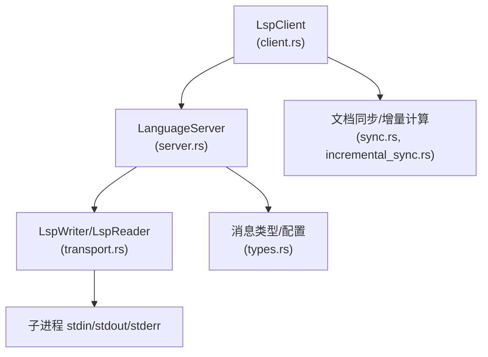
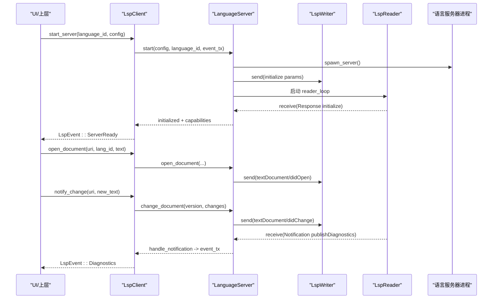
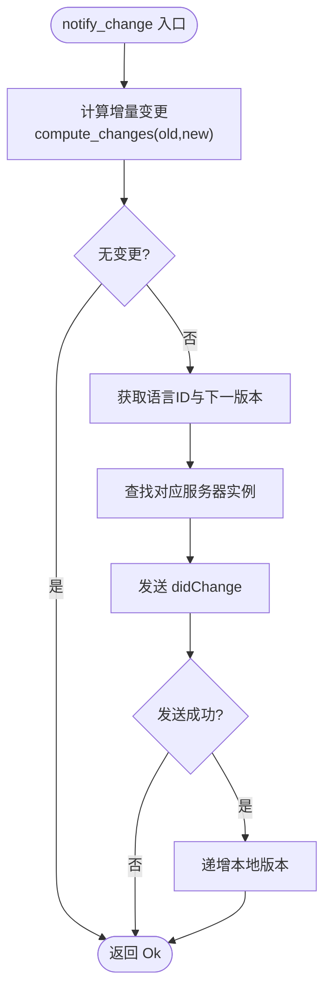
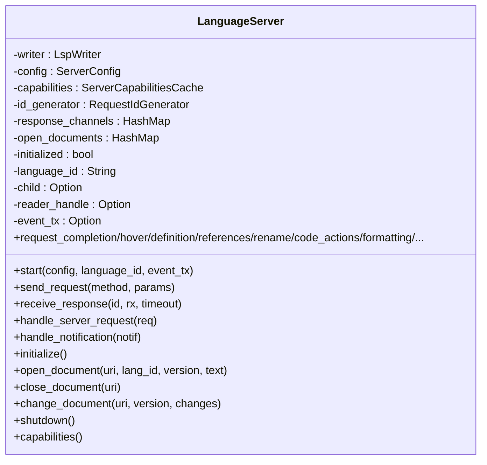
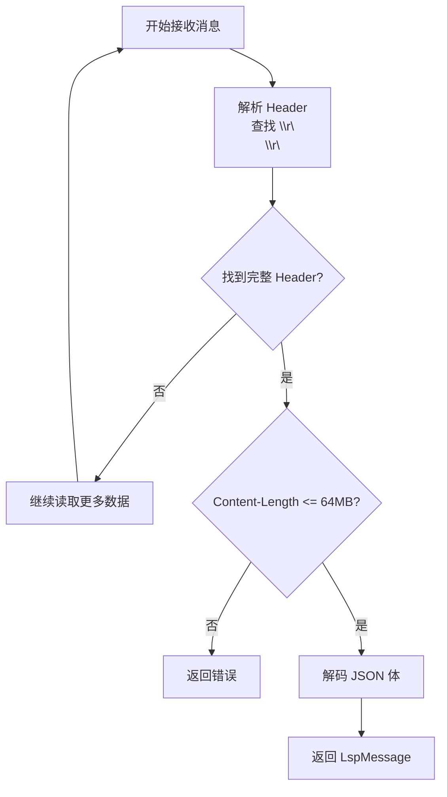
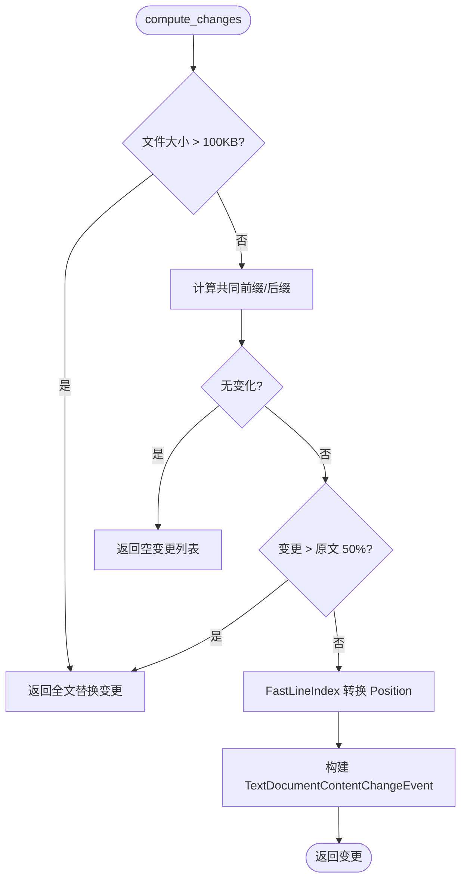
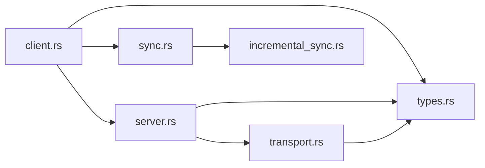

# LSP 客户端实现

<cite>
**本文引用的文件**
- [lib.rs](file://crates/aether-lsp/src/lib.rs)
- [client.rs](file://crates/aether-lsp/src/client.rs)
- [server.rs](file://crates/aether-lsp/src/server.rs)
- [transport.rs](file://crates/aether-lsp/src/transport.rs)
- [types.rs](file://crates/aether-lsp/src/types.rs)
- [sync.rs](file://crates/aether-lsp/src/sync.rs)
- [incremental_sync.rs](file://crates/aether-lsp/src/incremental_sync.rs)
- [Cargo.toml](file://crates/aether-lsp/Cargo.toml)
</cite>

## 目录
1. [简介](#简介)
2. [项目结构](#项目结构)
3. [核心组件](#核心组件)
4. [架构总览](#架构总览)
5. [详细组件分析](#详细组件分析)
6. [依赖关系分析](#依赖关系分析)
7. [性能考量](#性能考量)
8. [故障排查指南](#故障排查指南)
9. [结论](#结论)
10. [附录：配置与使用示例](#附录配置与使用示例)

## 简介
本文件为 LSP（Language Server Protocol）客户端实现的系统化文档，聚焦于 aether-lsp crate 中的 LspClient 设计、连接管理、消息收发机制、错误处理策略，以及与语言服务器的通信协议、请求-响应模式、异步处理机制。同时涵盖连接建立、会话管理、超时处理、重连逻辑的实现细节，并提供客户端配置示例与常见使用模式的代码演示路径。

## 项目结构
aether-lsp crate 以模块化方式组织，职责清晰：
- lib.rs：模块导出与对外 API 入口
- client.rs：LspClient 管理器，负责多语言服务器实例路由、文档同步、诊断缓存、事件派发
- server.rs：单个 LanguageServer 生命周期管理，包含初始化、能力协商、请求发送与响应等待、通知转发、优雅关闭
- transport.rs：JSON-RPC over stdio 的编码/解码、子进程启动、stderr 管道清理
- types.rs：消息类型、配置、能力缓存、ID 生成器等基础类型
- sync.rs：文档打开/关闭、版本管理、增量变更计算
- incremental_sync.rs：高性能行索引、编辑合并、批量同步等优化

图表来源
- [client.rs:11-25](file://crates/aether-lsp/src/client.rs#L11-L25)
- [server.rs:23-61](file://crates/aether-lsp/src/server.rs#L23-L61)
- [transport.rs:8-39](file://crates/aether-lsp/src/transport.rs#L8-L39)
- [types.rs:49-100](file://crates/aether-lsp/src/types.rs#L49-L100)
- [sync.rs:6-10](file://crates/aether-lsp/src/sync.rs#L6-L10)
- [incremental_sync.rs:96-130](file://crates/aether-lsp/src/incremental_sync.rs#L96-L130)

章节来源
- [lib.rs:1-16](file://crates/aether-lsp/src/lib.rs#L1-L16)
- [Cargo.toml:1-20](file://crates/aether-lsp/Cargo.toml#L1-L20)

## 核心组件
- LspClient：按语言 ID 管理多个 LanguageServer 实例；维护文档状态与诊断集合；向 UI 层推送事件；提供 open/close/notify_change 及各类 request_* 方法。
- LanguageServer：封装单个语言服务器的完整生命周期；负责 initialize、capabilities 缓存、请求-响应通道配对、通知转发、优雅关闭。
- Transport：实现 JSON-RPC over stdio 的消息编码/解码；支持子进程启动、stderr 后台读取避免阻塞；限制 Header/Content-Length 防止 OOM。
- Types：定义 LspMessage（Request/Response/Notification）、ServerConfig、DocumentState、DiagnosticCollection、ServerCapabilitiesCache、RequestIdGenerator。
- Sync：跟踪已打开文档、版本递增、文本更新；计算增量变更（大文件回退全文替换）。
- IncrementalSync：FastLineIndex 将字节偏移转换为 UTF-16 码元位置；编辑合并与批量发送；大文件同步策略。

章节来源
- [client.rs:11-25](file://crates/aether-lsp/src/client.rs#L11-L25)
- [server.rs:23-61](file://crates/aether-lsp/src/server.rs#L23-L61)
- [transport.rs:8-39](file://crates/aether-lsp/src/transport.rs#L8-L39)
- [types.rs:49-100](file://crates/aether-lsp/src/types.rs#L49-L100)
- [sync.rs:6-10](file://crates/aether-lsp/src/sync.rs#L6-L10)
- [incremental_sync.rs:96-130](file://crates/aether-lsp/src/incremental_sync.rs#L96-L130)

## 架构总览
LspClient 作为高层门面，根据 URI 的语言 ID 路由到对应 LanguageServer；每个 LanguageServer 通过 LspWriter/LspReader 与子进程进行 JSON-RPC over stdio 通信；reader_loop 在后台持续解析 stdout，匹配 Response 投递给调用方，并将 Notification 转发到 UI 层；所有出站消息经 LspWriter 写入 stdin；stderr 由独立任务持续读取以避免阻塞。

图表来源
- [server.rs:63-124](file://crates/aether-lsp/src/server.rs#L63-L124)
- [server.rs:140-216](file://crates/aether-lsp/src/server.rs#L140-L216)
- [server.rs:304-484](file://crates/aether-lsp/src/server.rs#L304-L484)
- [transport.rs:211-253](file://crates/aether-lsp/src/transport.rs#L211-L253)
- [client.rs:89-114](file://crates/aether-lsp/src/client.rs#L89-L114)
- [client.rs:116-172](file://crates/aether-lsp/src/client.rs#L116-L172)
- [client.rs:215-286](file://crates/aether-lsp/src/client.rs#L215-L286)

## 详细组件分析

### LspClient：多服务器管理与事件派发
- 设计要点
  - 使用 Arc<RwLock<HashMap<String, Arc<Mutex<LanguageServer>>>> 存储多语言服务器实例，避免全局写锁跨 await。
  - DocumentSync 维护文档状态与版本；DiagnosticCollection 用 std::Mutex 以便 UI 主线程安全读取/更新。
  - 通过 mpsc::UnboundedSender<LspEvent> 向 UI 推送诊断、补全、悬停、引用、重命名、代码操作、格式化、语义令牌、内联提示、就绪/退出/日志等事件。
- 关键流程
  - start_server：启动 LanguageServer，发送 ServerReady 事件，注册到 servers 表。
  - open/close_document：记录/移除文档状态，并路由到对应服务器。
  - notify_change：基于旧文本计算增量变更，更新本地版本后发送到服务器；失败时不递增版本，避免失步。
  - request_*：统一先查语言 ID，再获取服务器实例并调用对应 request_*。
  - shutdown_all：收集所有服务器句柄，依次 shutdown，清空诊断缓存。
  - remove_server：收到 ServerExited 后移除死服务器，清空诊断缓存。

图表来源
- [client.rs:215-286](file://crates/aether-lsp/src/client.rs#L215-L286)
- [sync.rs:82-148](file://crates/aether-lsp/src/sync.rs#L82-L148)

章节来源
- [client.rs:11-25](file://crates/aether-lsp/src/client.rs#L11-L25)
- [client.rs:73-114](file://crates/aether-lsp/src/client.rs#L73-L114)
- [client.rs:116-172](file://crates/aether-lsp/src/client.rs#L116-L172)
- [client.rs:215-286](file://crates/aether-lsp/src/client.rs#L215-L286)
- [client.rs:569-618](file://crates/aether-lsp/src/client.rs#L569-L618)

### LanguageServer：单服务器生命周期与请求-响应
- 设计要点
  - 使用 oneshot channel 将请求 id 与接收端配对；reader_loop 收到 Response 时投递到对应 sender。
  - 默认请求超时 30s，initialize 允许更长超时 60s。
  - 能力协商：initialize 成功后缓存 ServerCapabilities，供上层判断功能可用性。
  - 反向请求处理：workspace/configuration、registerCapability/unregisterCapability、applyEdit、workspaceFolders 等最小可用响应，避免服务器卡死。
  - 优雅关闭：shutdown 响应后发送 exit，等待子进程退出，超时则 kill。
- 关键流程
  - send_request：构造 Request，写入 stdin，保存 oneshot sender。
  - receive_response：await oneshot，反序列化结果或抛出 LSP 错误；超时清理 pending sender。
  - initialize：构建 InitializeParams 与 ClientCapabilities，发送 initialize，缓存能力，发送 initialized 通知。
  - open/close/change：发送 didOpen/didClose/didChange，维护 open_documents。
  - request_*：统一封装参数与超时等待。

图表来源
- [server.rs:23-61](file://crates/aether-lsp/src/server.rs#L23-L61)
- [server.rs:140-216](file://crates/aether-lsp/src/server.rs#L140-L216)
- [server.rs:304-484](file://crates/aether-lsp/src/server.rs#L304-L484)
- [server.rs:506-590](file://crates/aether-lsp/src/server.rs#L506-L590)
- [server.rs:592-800](file://crates/aether-lsp/src/server.rs#L592-L800)
- [server.rs:661-695](file://crates/aether-lsp/src/server.rs#L661-L695)

章节来源
- [server.rs:16-21](file://crates/aether-lsp/src/server.rs#L16-L21)
- [server.rs:63-124](file://crates/aether-lsp/src/server.rs#L63-L124)
- [server.rs:140-216](file://crates/aether-lsp/src/server.rs#L140-L216)
- [server.rs:304-484](file://crates/aether-lsp/src/server.rs#L304-L484)
- [server.rs:506-590](file://crates/aether-lsp/src/server.rs#L506-L590)
- [server.rs:592-800](file://crates/aether-lsp/src/server.rs#L592-L800)
- [server.rs:661-695](file://crates/aether-lsp/src/server.rs#L661-L695)

### Transport：JSON-RPC over stdio 编解码与进程管理
- 设计要点
  - LspWriter：仅持有 stdin，发送消息并 flush。
  - LspReader：独占 stdout，循环解析 Header（Content-Length），校验最大长度，解码 JSON。
  - encode_message：序列化为 JSON，拼接标准 LSP 头部。
  - parse_header_buffer：在原始字节中搜索 \r\n\r\n，避免 body 中部分 UTF-8 导致失败；限制 Content-Length 上限。
  - spawn_server/build_command：构造命令，设置 stdin/stdout/stderr，Windows 下禁止控制台窗口。
  - spawn_stderr_drain：后台持续读取 stderr，避免缓冲区满导致子进程阻塞。
- 错误处理
  - EOF：UnexpectedEof 表示服务器关闭 stdout。
  - 超大消息：显式错误，避免协议失同步。
  - JSON 解析失败：InvalidData。

图表来源
- [transport.rs:110-209](file://crates/aether-lsp/src/transport.rs#L110-L209)
- [transport.rs:211-253](file://crates/aether-lsp/src/transport.rs#L211-L253)
- [transport.rs:255-339](file://crates/aether-lsp/src/transport.rs#L255-L339)
- [transport.rs:341-359](file://crates/aether-lsp/src/transport.rs#L341-L359)

章节来源
- [transport.rs:8-39](file://crates/aether-lsp/src/transport.rs#L8-L39)
- [transport.rs:110-209](file://crates/aether-lsp/src/transport.rs#L110-L209)
- [transport.rs:211-253](file://crates/aether-lsp/src/transport.rs#L211-L253)
- [transport.rs:255-339](file://crates/aether-lsp/src/transport.rs#L255-L339)
- [transport.rs:341-359](file://crates/aether-lsp/src/transport.rs#L341-L359)

### Types：消息、配置与能力缓存
- LspMessage：Request/Response/Notification 三种消息类型，支持 serde 序列化/反序列化。
- ServerConfig：command、args、env、root_uri、initialization_options。
- DocumentState/DiagnosticCollection：文档状态与诊断集合。
- ServerCapabilitiesCache：缓存服务器能力，便于上层快速判断是否启用某项功能。
- RequestIdGenerator：单调递增的请求 ID。

章节来源
- [types.rs:5-47](file://crates/aether-lsp/src/types.rs#L5-L47)
- [types.rs:49-100](file://crates/aether-lsp/src/types.rs#L49-L100)
- [types.rs:102-124](file://crates/aether-lsp/src/types.rs#L102-L124)

### Sync：文档同步与增量变更
- DocumentSync：open/close/get/update/increment_version 等方法，维护文档状态与版本。
- compute_changes：基于共同前缀/后缀计算精确变更范围；大文件或变更超过 50% 时回退为全文替换；使用 FastLineIndex 将字节偏移转换为 UTF-16 码元位置。

图表来源
- [sync.rs:82-148](file://crates/aether-lsp/src/sync.rs#L82-L148)
- [incremental_sync.rs:96-130](file://crates/aether-lsp/src/incremental_sync.rs#L96-L130)

章节来源
- [sync.rs:6-71](file://crates/aether-lsp/src/sync.rs#L6-L71)
- [sync.rs:82-148](file://crates/aether-lsp/src/sync.rs#L82-L148)

### IncrementalSync：高性能行索引与编辑合并
- FastLineIndex：预计算行起始位置，支持 O(log n) 行查找；character 按 UTF-16 码元计数。
- IncrementalChangeCalculator：从编辑操作直接生成增量变更；合并真正相邻的编辑，避免丢失中间文本。
- OptimizedDocumentSync：记录编辑历史、批量发送、清理过期历史。
- LargeFileSyncStrategy：大文件阈值、是否发送全文、同步延迟策略。

章节来源
- [incremental_sync.rs:9-80](file://crates/aether-lsp/src/incremental_sync.rs#L9-L80)
- [incremental_sync.rs:96-190](file://crates/aether-lsp/src/incremental_sync.rs#L96-L190)
- [incremental_sync.rs:192-357](file://crates/aether-lsp/src/incremental_sync.rs#L192-L357)

## 依赖关系分析
- 外部依赖
  - lsp-types：LSP 类型定义与能力描述。
  - tokio：异步运行时、进程、IO、同步原语、定时器。
  - serde/serde_json：序列化/反序列化。
  - bytes：缓冲与切片操作。
  - tracing：可选追踪。
  - thiserror：错误类型。
- 内部依赖
  - client 依赖 server、sync、types。
  - server 依赖 transport、types、client 事件。
  - transport 依赖 types。
  - sync 依赖 incremental_sync。

图表来源
- [client.rs:1-9](file://crates/aether-lsp/src/client.rs#L1-L9)
- [server.rs:1-14](file://crates/aether-lsp/src/server.rs#L1-L14)
- [transport.rs:1-6](file://crates/aether-lsp/src/transport.rs#L1-L6)
- [sync.rs:1-5](file://crates/aether-lsp/src/sync.rs#L1-L5)

章节来源
- [Cargo.toml:6-16](file://crates/aether-lsp/Cargo.toml#L6-L16)
- [client.rs:1-9](file://crates/aether-lsp/src/client.rs#L1-L9)
- [server.rs:1-14](file://crates/aether-lsp/src/server.rs#L1-L14)
- [transport.rs:1-6](file://crates/aether-lsp/src/transport.rs#L1-L6)
- [sync.rs:1-5](file://crates/aether-lsp/src/sync.rs#L1-L5)

## 性能考量
- 并发与锁粒度
  - 使用 per-server 的 tokio::sync::Mutex 包装 LanguageServer，避免全局 RwLock 写锁跨 await，减少竞争。
  - 诊断集合使用 std::Mutex，适合 UI 主线程短临界区读写。
- 网络与 I/O
  - 分离 writer/reader，避免 send/receive 互锁；reader_loop 独占 stdout，提升吞吐。
  - 限制 Header 大小（8KB）与 Content-Length（64MB），防止恶意或异常消息导致 OOM。
  - 后台 stderr 读取，避免子进程因管道满而阻塞。
- 文档同步
  - 增量变更计算优先；大文件或大范围变更回退为全文替换，降低 diff 成本。
  - FastLineIndex 将字节偏移高效转换为 UTF-16 码元位置，符合 LSP 标准。
  - 编辑合并仅针对真正相邻的编辑，避免丢失中间文本。
- 超时与重试
  - 默认请求超时 30s，initialize 允许 60s；超时清理 pending sender，避免泄漏。
  - 优雅关闭：shutdown 后等待子进程退出，超时强制 kill。

[本节为通用性能讨论，无需具体文件分析]

## 故障排查指南
- 常见问题与定位
  - 服务器未就绪：检查 start_server 是否成功，确认 default_server_config 是否返回有效配置；查看 LspEvent::ServerReady 是否发出。
  - 文档同步失败：确认 open_document 已调用；检查 notify_change 计算的增量是否为空；查看版本是否正确递增。
  - 诊断未显示：确认 reader_loop 正常运行；handle_notification 是否转发到 event_tx；UI 层是否订阅并处理 LspEvent::Diagnostics。
  - 请求超时：检查 receive_response 超时时间；确认服务器是否响应；查看 stderr 是否有错误输出。
  - 子进程阻塞：确认 spawn_stderr_drain 是否运行；stderr 是否被持续读取。
- 错误类型与含义
  - UnexpectedEof：服务器关闭 stdout，可能异常退出。
  - InvalidData：JSON 解析失败或 Header 非法。
  - TimedOut：请求超时，需检查服务器性能或网络。
  - 超大消息：Content-Length 超限，需调整限制或检查服务器行为。

章节来源
- [server.rs:164-216](file://crates/aether-lsp/src/server.rs#L164-L216)
- [transport.rs:162-209](file://crates/aether-lsp/src/transport.rs#L162-L209)
- [transport.rs:341-359](file://crates/aether-lsp/src/transport.rs#L341-L359)
- [client.rs:569-618](file://crates/aether-lsp/src/client.rs#L569-L618)

## 结论
该 LSP 客户端实现以清晰的模块化设计与高效的异步模型为基础，提供了多语言服务器管理、文档同步、诊断与能力协商、优雅关闭等核心功能。通过严格的协议实现、资源保护与错误处理，确保了稳定性与可扩展性。结合增量同步与高性能行索引，能够在大规模文件中保持良好性能。建议在实际使用中结合 UI 层的事件订阅与重试策略，以获得更健壮的体验。

[本节为总结，无需具体文件分析]

## 附录：配置与使用示例
- 配置示例
  - Rust：使用 rust-analyzer，默认命令与参数。
  - Python：使用 pylsp。
  - TypeScript/JavaScript：使用 typescript-language-server，带 --stdio 参数。
  - C/C++：使用 clangd。
- 使用模式
  - 启动服务器：调用 start_server 传入语言 ID 与 ServerConfig。
  - 打开文档：open_document 记录状态并发送 didOpen。
  - 变更文档：notify_change 计算增量并发送 didChange。
  - 请求功能：request_completion/hover/definition/references/rename/code_actions/formatting/semantic_tokens/inlay_hints。
  - 关闭服务器：shutdown_all 优雅关闭并清理诊断。
  - 处理事件：订阅 LspEvent 流，处理 Diagnostics/Completion/Hover/References/Rename/CodeActions/Formatting/SemanticTokens/InlayHints/ServerReady/ServerExited/Log。

章节来源
- [client.rs:620-653](file://crates/aether-lsp/src/client.rs#L620-L653)
- [client.rs:73-114](file://crates/aether-lsp/src/client.rs#L73-L114)
- [client.rs:116-172](file://crates/aether-lsp/src/client.rs#L116-L172)
- [client.rs:215-286](file://crates/aether-lsp/src/client.rs#L215-L286)
- [client.rs:288-567](file://crates/aether-lsp/src/client.rs#L288-L567)
- [client.rs:569-618](file://crates/aether-lsp/src/client.rs#L569-L618)