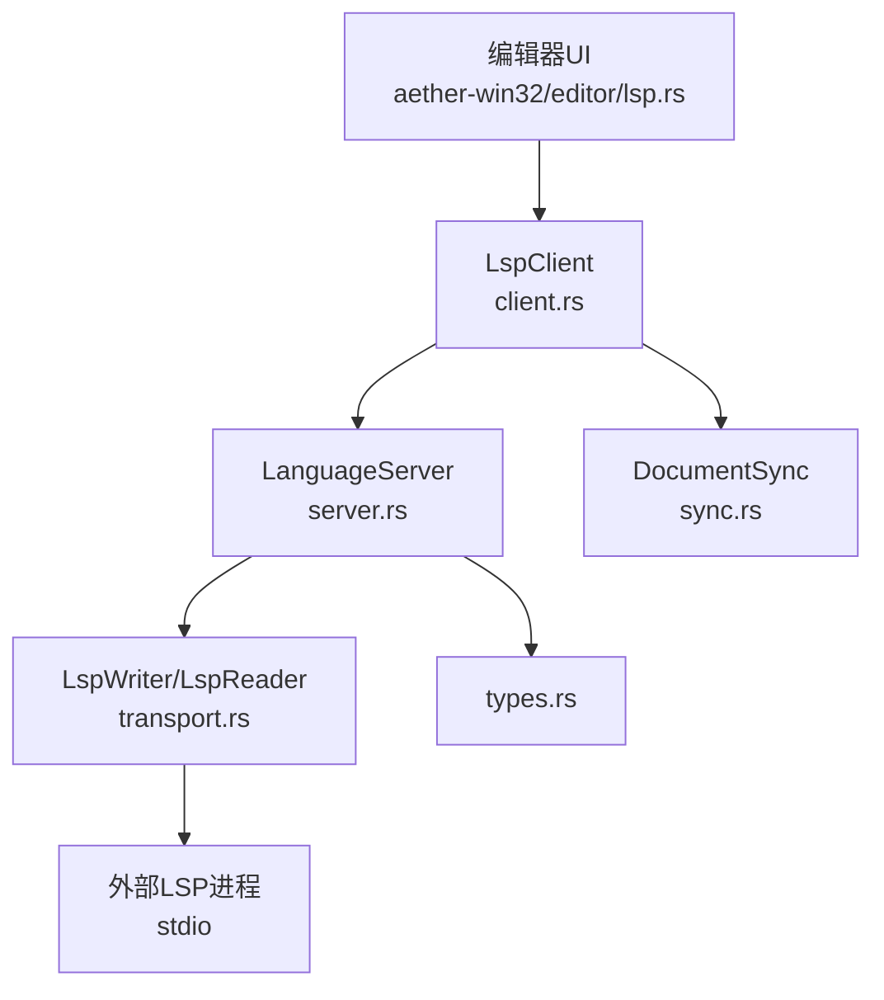
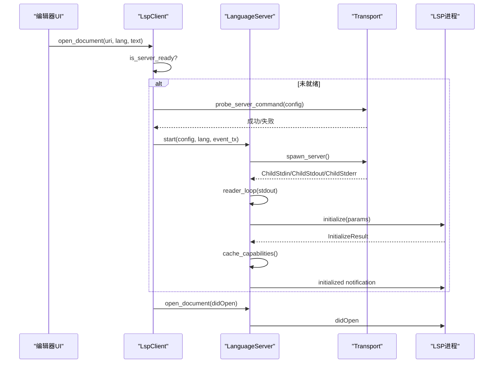
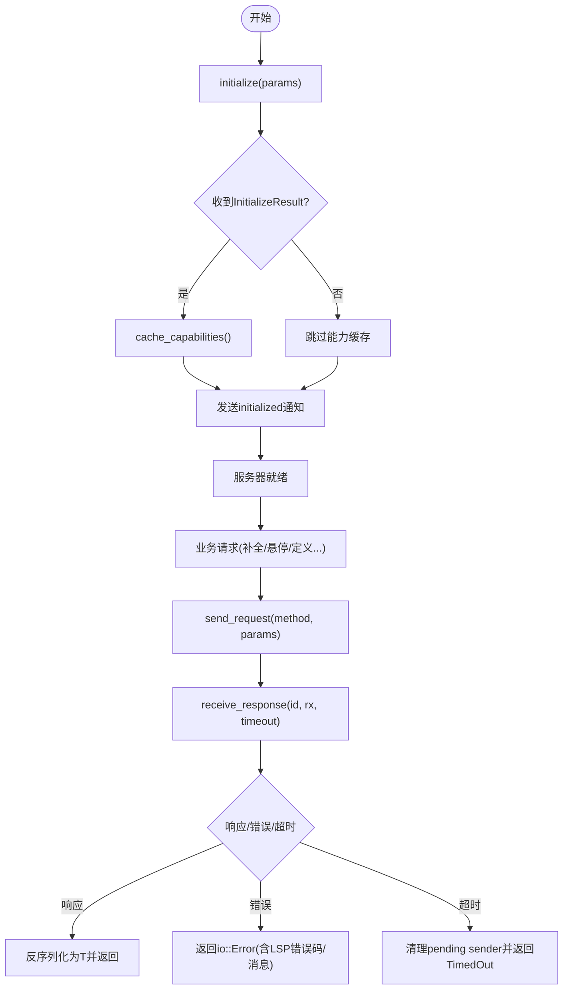
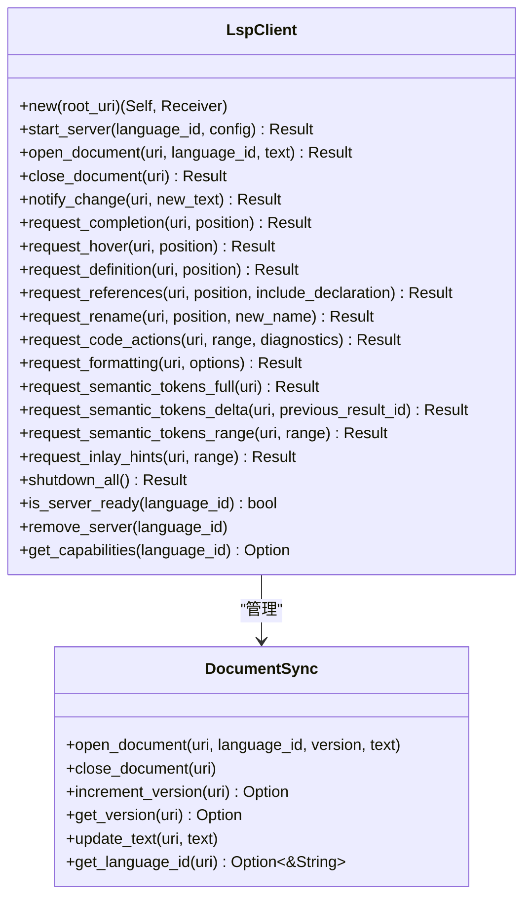
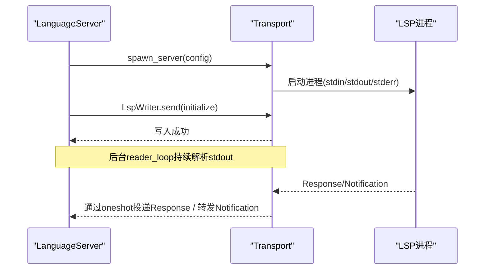
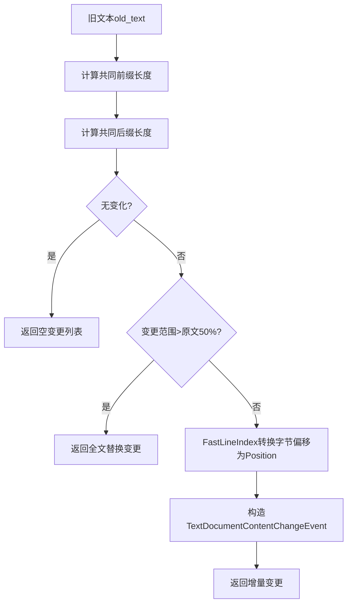
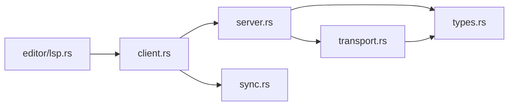

# LSP 服务器管理

<cite>
**本文引用的文件**
- [crates/aether-lsp/src/lib.rs](file://crates/aether-lsp/src/lib.rs)
- [crates/aether-lsp/src/server.rs](file://crates/aether-lsp/src/server.rs)
- [crates/aether-lsp/src/client.rs](file://crates/aether-lsp/src/client.rs)
- [crates/aether-lsp/src/transport.rs](file://crates/aether-lsp/src/transport.rs)
- [crates/aether-lsp/src/types.rs](file://crates/aether-lsp/src/types.rs)
- [crates/aether-lsp/src/sync.rs](file://crates/aether-lsp/src/sync.rs)
- [crates/aether-win32/src/editor/lsp.rs](file://crates/aether-win32/src/editor/lsp.rs)
</cite>

## 目录
1. [简介](#简介)
2. [项目结构](#项目结构)
3. [核心组件](#核心组件)
4. [架构总览](#架构总览)
5. [详细组件分析](#详细组件分析)
6. [依赖关系分析](#依赖关系分析)
7. [性能考量](#性能考量)
8. [故障排除指南](#故障排除指南)
9. [结论](#结论)
10. [附录：配置模板与最佳实践](#附录：配置模板与最佳实践)

## 简介
本模块为编辑器提供语言服务器（LSP）管理能力，覆盖服务器进程启动、参数与环境变量传递、标准输入输出流处理、生命周期管理（初始化、运行、优雅关闭）、多实例并发控制、事件分发与资源清理。通过按语言ID路由的客户端管理器，实现多语言服务器实例的隔离与复用；通过增量文档同步与能力缓存，降低网络与序列化开销；通过探活、超时、stderr 管道清理等机制提升鲁棒性。

## 项目结构
- aether-lsp：LSP 协议层与服务器管理核心
  - server.rs：单语言服务器实例的生命周期、请求/通知收发、能力缓存、文档状态
  - client.rs：多服务器实例管理、按语言ID路由、诊断集合、事件通道
  - transport.rs：JSON-RPC over stdio 编码/解码、子进程启动、stderr 清理、探活
  - types.rs：消息类型、配置、能力缓存、文档状态、请求ID生成器
  - sync.rs：打开/关闭文档、版本管理、增量变更计算
  - lib.rs：对外模块导出
- aether-win32/editor/lsp.rs：编辑器 UI 与 LSP 客户端的集成入口（按需启动、事件轮询、冰冻/解冻）

**图表来源**
- [crates/aether-win32/src/editor/lsp.rs:10-55](file://crates/aether-win32/src/editor/lsp.rs#L10-L55)
- [crates/aether-lsp/src/client.rs:73-114](file://crates/aether-lsp/src/client.rs#L73-L114)
- [crates/aether-lsp/src/server.rs:34-124](file://crates/aether-lsp/src/server.rs#L34-L124)
- [crates/aether-lsp/src/transport.rs:256-339](file://crates/aether-lsp/src/transport.rs#L256-L339)
- [crates/aether-lsp/src/types.rs:49-100](file://crates/aether-lsp/src/types.rs#L49-L100)
- [crates/aether-lsp/src/sync.rs:6-71](file://crates/aether-lsp/src/sync.rs#L6-L71)

**章节来源**
- [crates/aether-lsp/src/lib.rs:1-16](file://crates/aether-lsp/src/lib.rs#L1-L16)
- [crates/aether-win32/src/editor/lsp.rs:10-55](file://crates/aether-win32/src/editor/lsp.rs#L10-L55)

## 核心组件
- LanguageServer：封装单个语言服务器的完整生命周期，负责 initialize、文档同步、功能请求（补全/悬停/定义/引用/重命名/格式化/语义令牌/内联提示）、优雅关闭与资源释放。
- LspClient：多服务器实例管理器，按 language_id 路由请求，维护文档同步状态、诊断缓存、事件通道，支持 shutdown_all、remove_server、is_server_ready。
- Transport：LSP JSON-RPC over stdio 的编解码、子进程启动、stderr 后台读取避免阻塞、探活验证二进制可用性。
- DocumentSync：跟踪已打开文档的语言ID、版本、全文文本，计算增量变更以最小化传输。
- Types：统一的消息结构、ServerConfig、能力缓存、文档状态、请求ID生成器等。

**章节来源**
- [crates/aether-lsp/src/server.rs:34-124](file://crates/aether-lsp/src/server.rs#L34-L124)
- [crates/aether-lsp/src/client.rs:11-25](file://crates/aether-lsp/src/client.rs#L11-L25)
- [crates/aether-lsp/src/transport.rs:8-117](file://crates/aether-lsp/src/transport.rs#L8-L117)
- [crates/aether-lsp/src/sync.rs:6-71](file://crates/aether-lsp/src/sync.rs#L6-L71)
- [crates/aether-lsp/src/types.rs:49-100](file://crates/aether-lsp/src/types.rs#L49-L100)

## 架构总览
- 启动流程：UI 调用 notify_open → 若未就绪则 default_server_config → probe_server_command → start_server → LanguageServer::start → spawn_server → 启动 reader_loop → initialize → initialized 通知。
- 通信模型：主线程持有 LspWriter 发送请求/通知；后台 reader task 独占 stdout 解析消息并通过 oneshot 将响应投递给等待方；notification 直接转发到 event_tx。
- 并发控制：每个服务器实例用 tokio::sync::Mutex 包装，避免全局写锁跨 await；servers 表使用 Arc<RwLock<HashMap>> 保护。
- 资源清理：shutdown 发送 exit 并等待子进程退出，超时强制 kill；Drop 时 abort reader_handle；stderr 由后台任务持续读取避免阻塞。

**图表来源**
- [crates/aether-win32/src/editor/lsp.rs:10-55](file://crates/aether-win32/src/editor/lsp.rs#L10-L55)
- [crates/aether-lsp/src/client.rs:89-114](file://crates/aether-lsp/src/client.rs#L89-L114)
- [crates/aether-lsp/src/server.rs:63-124](file://crates/aether-lsp/src/server.rs#L63-L124)
- [crates/aether-lsp/src/transport.rs:256-339](file://crates/aether-lsp/src/transport.rs#L256-L339)

**章节来源**
- [crates/aether-lsp/src/server.rs:304-484](file://crates/aether-lsp/src/server.rs#L304-L484)
- [crates/aether-lsp/src/transport.rs:256-339](file://crates/aether-lsp/src/transport.rs#L256-L339)
- [crates/aether-win32/src/editor/lsp.rs:10-55](file://crates/aether-win32/src/editor/lsp.rs#L10-L55)

## 详细组件分析

### LanguageServer：单服务器生命周期与请求-响应
- 启动与初始化：start 捕获 stdin/stdout/stderr，构造 LspWriter/LspReader，启动 stderr 清理任务与 reader_loop，发送 initialize 并缓存能力，随后发送 initialized 通知。
- 请求-响应：send_request 生成唯一 id 并注册 oneshot receiver；receive_response 带超时，错误/EOF/超时均返回 io::Error；reader_loop 收到 Response 时通过 sender 投递。
- 反向请求处理：handle_server_request 对 workspace/configuration、registerCapability/unregisterCapability、workspace/applyEdit、workspace/workspaceFolders 等给出最小可用响应，避免服务器卡死。
- 文档同步：open/close/didChange 维护 open_documents 与版本；change_document 更新本地版本。
- 功能请求：completion/hover/definition/references/rename/codeAction/formatting/semantic tokens/inlay hints 等，均基于 send_request + receive_response。
- 优雅关闭：shutdown 发送 shutdown 请求，再发送 exit 通知，等待子进程退出，超时则 kill。

**图表来源**
- [crates/aether-lsp/src/server.rs:140-216](file://crates/aether-lsp/src/server.rs#L140-L216)
- [crates/aether-lsp/src/server.rs:304-484](file://crates/aether-lsp/src/server.rs#L304-L484)

**章节来源**
- [crates/aether-lsp/src/server.rs:34-124](file://crates/aether-lsp/src/server.rs#L34-L124)
- [crates/aether-lsp/src/server.rs:140-216](file://crates/aether-lsp/src/server.rs#L140-L216)
- [crates/aether-lsp/src/server.rs:218-302](file://crates/aether-lsp/src/server.rs#L218-L302)
- [crates/aether-lsp/src/server.rs:506-800](file://crates/aether-lsp/src/server.rs#L506-L800)
- [crates/aether-lsp/src/server.rs:661-695](file://crates/aether-lsp/src/server.rs#L661-L695)

### LspClient：多实例管理与事件分发
- 实例管理：servers 为 Arc<RwLock<HashMap<String, Arc<Mutex<LanguageServer>>>>>，start_server 启动后插入并按 language_id 路由。
- 文档同步：DocumentSync 记录 uri→language_id/version/text，notify_change 计算增量变更并发送到对应服务器。
- 诊断缓存：按 uri 存储 Vec<Diagnostic>，支持 update/remove/clear/all_diagnostics。
- 事件通道：event_tx 接收服务器推送的 Diagnostics/Completion/Hover/References/Rename/CodeActions/Formatting/SemanticTokens/InlayHints/ServerReady/ServerExited/Log。
- 生命周期：shutdown_all 收集所有服务器句柄并依次优雅关闭，清空诊断缓存；remove_server 移除死亡实例以便按需重启。

**图表来源**
- [crates/aether-lsp/src/client.rs:11-25](file://crates/aether-lsp/src/client.rs#L11-L25)
- [crates/aether-lsp/src/client.rs:73-114](file://crates/aether-lsp/src/client.rs#L73-L114)
- [crates/aether-lsp/src/client.rs:116-286](file://crates/aether-lsp/src/client.rs#L116-L286)
- [crates/aether-lsp/src/client.rs:288-617](file://crates/aether-lsp/src/client.rs#L288-L617)
- [crates/aether-lsp/src/sync.rs:6-71](file://crates/aether-lsp/src/sync.rs#L6-L71)

**章节来源**
- [crates/aether-lsp/src/client.rs:73-114](file://crates/aether-lsp/src/client.rs#L73-L114)
- [crates/aether-lsp/src/client.rs:116-286](file://crates/aether-lsp/src/client.rs#L116-L286)
- [crates/aether-lsp/src/client.rs:288-617](file://crates/aether-lsp/src/client.rs#L288-L617)
- [crates/aether-lsp/src/sync.rs:6-71](file://crates/aether-lsp/src/sync.rs#L6-L71)

### Transport：进程与I/O
- 编码/解码：encode_message 生成 Content-Length 头与 JSON body；parse_header_buffer 安全解析头部并限制最大长度。
- 读写分离：LspWriter 仅持有 stdin，LspReader 仅持有 stdout，避免互锁；LspTransport 用于测试兼容。
- 进程管理：spawn_server 根据 ServerConfig 构建 Command（包含 args/env），在 Windows 上禁止创建控制台窗口；probe_server_command 执行 --version 快速验证二进制可用性。
- 资源清理：spawn_stderr_drain 后台读取 stderr 防止缓冲区满导致子进程阻塞。

**图表来源**
- [crates/aether-lsp/src/transport.rs:256-339](file://crates/aether-lsp/src/transport.rs#L256-L339)
- [crates/aether-lsp/src/transport.rs:212-253](file://crates/aether-lsp/src/transport.rs#L212-L253)
- [crates/aether-lsp/src/transport.rs:341-359](file://crates/aether-lsp/src/transport.rs#L341-L359)

**章节来源**
- [crates/aether-lsp/src/transport.rs:8-117](file://crates/aether-lsp/src/transport.rs#L8-L117)
- [crates/aether-lsp/src/transport.rs:212-253](file://crates/aether-lsp/src/transport.rs#L212-L253)
- [crates/aether-lsp/src/transport.rs:256-339](file://crates/aether-lsp/src/transport.rs#L256-L339)
- [crates/aether-lsp/src/transport.rs:341-359](file://crates/aether-lsp/src/transport.rs#L341-L359)

### 文档同步与增量变更
- DocumentSync：维护 uri→DocumentState（language_id/version/text），支持 open/close/increment_version/update_text/get_language_id。
- compute_changes：基于共同前缀/后缀计算字节级变更范围，使用 FastLineIndex 转换为 LSP Position（UTF-16 码元）；大文件或变更超过阈值时回退为全文替换以提升效率。

**图表来源**
- [crates/aether-lsp/src/sync.rs:82-148](file://crates/aether-lsp/src/sync.rs#L82-L148)

**章节来源**
- [crates/aether-lsp/src/sync.rs:6-71](file://crates/aether-lsp/src/sync.rs#L6-L71)
- [crates/aether-lsp/src/sync.rs:82-148](file://crates/aether-lsp/src/sync.rs#L82-L148)

### UI 集成与事件处理
- 按需启动：notify_open 映射语言到 language_id，转换路径为 file:// URI，克隆 buffer 到后台线程读取全文，若未就绪则默认配置+探活+启动。
- 事件轮询：poll_events 每帧 try_recv 处理 Diagnostics/ServerReady/ServerExited/Log，更新状态栏与诊断表。
- 冰冻/解冻：freeze_lsp 关停全部服务器并清空状态；thaw_lsp_on_demand 延迟重启并在首次编辑时重新宣告文档。

**章节来源**
- [crates/aether-win32/src/editor/lsp.rs:10-55](file://crates/aether-win32/src/editor/lsp.rs#L10-L55)
- [crates/aether-win32/src/editor/lsp.rs:166-265](file://crates/aether-win32/src/editor/lsp.rs#L166-L265)
- [crates/aether-win32/src/editor/lsp.rs:303-354](file://crates/aether-win32/src/editor/lsp.rs#L303-L354)
- [crates/aether-win32/src/editor/lsp.rs:377-454](file://crates/aether-win32/src/editor/lsp.rs#L377-L454)
- [crates/aether-win32/src/editor/lsp.rs:545-600](file://crates/aether-win32/src/editor/lsp.rs#L545-L600)

## 依赖关系分析
- 模块耦合：
  - server.rs 依赖 transport.rs（进程与I/O）、types.rs（消息/配置）、client.rs（事件类型）。
  - client.rs 依赖 server.rs（实例）、sync.rs（文档同步）、types.rs（事件/配置）。
  - transport.rs 依赖 types.rs（消息）、tokio/process/io。
  - UI 层依赖 client.rs 与 transport.rs（探活）。
- 外部依赖：lsp_types（LSP 类型）、serde_json（序列化）、tokio（异步运行时）。

**图表来源**
- [crates/aether-win32/src/editor/lsp.rs:10-55](file://crates/aether-win32/src/editor/lsp.rs#L10-L55)
- [crates/aether-lsp/src/client.rs:73-114](file://crates/aether-lsp/src/client.rs#L73-L114)
- [crates/aether-lsp/src/server.rs:34-124](file://crates/aether-lsp/src/server.rs#L34-L124)
- [crates/aether-lsp/src/transport.rs:256-339](file://crates/aether-lsp/src/transport.rs#L256-L339)
- [crates/aether-lsp/src/types.rs:49-100](file://crates/aether-lsp/src/types.rs#L49-L100)
- [crates/aether-lsp/src/sync.rs:6-71](file://crates/aether-lsp/src/sync.rs#L6-L71)

**章节来源**
- [crates/aether-lsp/src/lib.rs:1-16](file://crates/aether-lsp/src/lib.rs#L1-L16)
- [crates/aether-win32/src/editor/lsp.rs:10-55](file://crates/aether-win32/src/editor/lsp.rs#L10-L55)

## 性能考量
- 增量同步：compute_changes 仅在必要时计算精确变更，大文件或大范围变更回退为全文替换以减少 diff 成本。
- 并发控制：每个服务器独立 Mutex，避免全局写锁跨 await；servers 表使用 RwLock 读多写少。
- I/O 优化：LspWriter/LspReader 分离，reader_loop 独占 stdout；stderr 后台读取避免阻塞。
- 超时与限流：请求默认超时 30s，initialize 60s；Header 最大 8KB，Content-Length 最大 64MB。
- 能力缓存：缓存服务器能力，减少重复协商开销。

[本节为通用性能讨论，不直接分析具体文件]

## 故障排除指南
- 服务器启动失败
  - 现象：start_server 报错或进程静默退出。
  - 排查：检查 default_server_config 是否返回有效命令；使用 probe_server_command 验证二进制可用性；确认 PATH 与 rustup shim 组件安装。
  - 参考：[crates/aether-lsp/src/client.rs:620-653](file://crates/aether-lsp/src/client.rs#L620-L653)、[crates/aether-lsp/src/transport.rs:261-306](file://crates/aether-lsp/src/transport.rs#L261-L306)
- 请求超时
  - 现象：receive_response 返回 TimedOut。
  - 排查：检查服务器是否卡住；增大超时或优化服务器；确认 reader_loop 正常运行。
  - 参考：[crates/aether-lsp/src/server.rs:164-216](file://crates/aether-lsp/src/server.rs#L164-L216)
- 诊断未显示
  - 现象：UI 未收到 Diagnostics。
  - 排查：确认 handle_notification 已转发；检查 event_tx 是否连接；确认 poll_events 每帧调用。
  - 参考：[crates/aether-lsp/src/server.rs:295-302](file://crates/aether-lsp/src/server.rs#L295-L302)、[crates/aether-win32/src/editor/lsp.rs:377-454](file://crates/aether-win32/src/editor/lsp.rs#L377-L454)
- 子进程阻塞
  - 现象：编辑器请求卡死。
  - 排查：确认 spawn_stderr_drain 已启动；检查 stderr 输出是否过大。
  - 参考：[crates/aether-lsp/src/transport.rs:341-359](file://crates/aether-lsp/src/transport.rs#L341-L359)
- 优雅关闭失败
  - 现象：exit 后进程未退出。
  - 排查：确认 shutdown 流程发送了 shutdown 与 exit；检查超时后是否强制 kill。
  - 参考：[crates/aether-lsp/src/server.rs:661-695](file://crates/aether-lsp/src/server.rs#L661-L695)

**章节来源**
- [crates/aether-lsp/src/client.rs:620-653](file://crates/aether-lsp/src/client.rs#L620-L653)
- [crates/aether-lsp/src/transport.rs:261-306](file://crates/aether-lsp/src/transport.rs#L261-L306)
- [crates/aether-lsp/src/server.rs:164-216](file://crates/aether-lsp/src/server.rs#L164-L216)
- [crates/aether-lsp/src/server.rs:295-302](file://crates/aether-lsp/src/server.rs#L295-L302)
- [crates/aether-win32/src/editor/lsp.rs:377-454](file://crates/aether-win32/src/editor/lsp.rs#L377-L454)
- [crates/aether-lsp/src/transport.rs:341-359](file://crates/aether-lsp/src/transport.rs#L341-L359)
- [crates/aether-lsp/src/server.rs:661-695](file://crates/aether-lsp/src/server.rs#L661-L695)

## 结论
该 LSP 服务器管理模块通过清晰的职责划分与异步模型，实现了多语言服务器的稳定管理：进程启动与探活、标准流处理、请求-响应配对、通知分发、增量同步、能力缓存、优雅关闭与资源清理。结合 UI 层的按需启动与事件轮询，提供了良好的用户体验与可维护性。建议在生产环境中结合日志与监控指标（如请求耗时、错误率、内存占用）进一步优化。

[本节为总结，不直接分析具体文件]

## 附录：配置模板与最佳实践
- 服务器配置模板（ServerConfig）
  - command：可选，指定可执行文件路径（如 rust-analyzer、pylsp、clangd、typescript-language-server）。
  - args：传递给服务器的参数（如 typescript-language-server 需要 --stdio）。
  - env：环境变量覆盖（如 RUST_LOG、PYTHONDONTWRITEBYTECODE）。
  - root_uri：工作区根目录（file:// URL）。
  - initialization_options：初始化选项（JSON Value）。
  - 参考：[crates/aether-lsp/src/types.rs:49-62](file://crates/aether-lsp/src/types.rs#L49-L62)
- 默认配置发现
  - 支持 rust、python、typescript/javascript、c/cpp 的默认命令与参数。
  - 参考：[crates/aether-lsp/src/client.rs:620-653](file://crates/aether-lsp/src/client.rs#L620-L653)
- 最佳实践
  - 启动前探活：使用 probe_server_command 避免“可执行但不可用”的二进制。
  - 增量同步：优先使用 notify_change 让内部计算增量，减少传输。
  - 能力检测：通过 capabilities() 判断是否启用某功能（如 completion/hover）。
  - 优雅关闭：应用退出时调用 shutdown_all，确保子进程释放。
  - 事件处理：每帧轮询事件，及时更新 UI 状态。

**章节来源**
- [crates/aether-lsp/src/types.rs:49-62](file://crates/aether-lsp/src/types.rs#L49-L62)
- [crates/aether-lsp/src/client.rs:620-653](file://crates/aether-lsp/src/client.rs#L620-L653)
- [crates/aether-lsp/src/server.rs:697-715](file://crates/aether-lsp/src/server.rs#L697-L715)
- [crates/aether-lsp/src/client.rs:569-603](file://crates/aether-lsp/src/client.rs#L569-L603)
- [crates/aether-win32/src/editor/lsp.rs:377-454](file://crates/aether-win32/src/editor/lsp.rs#L377-L454)