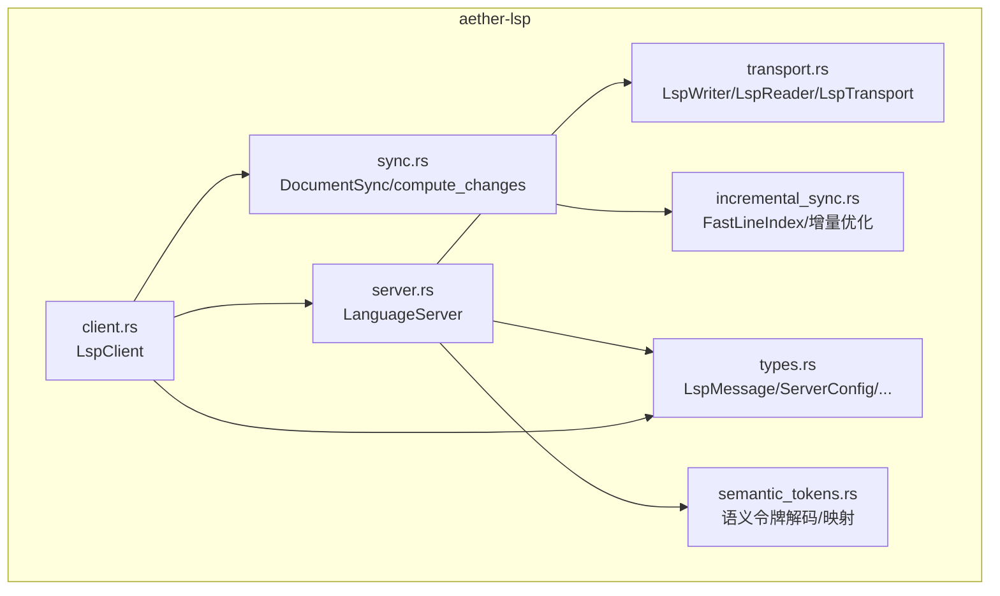
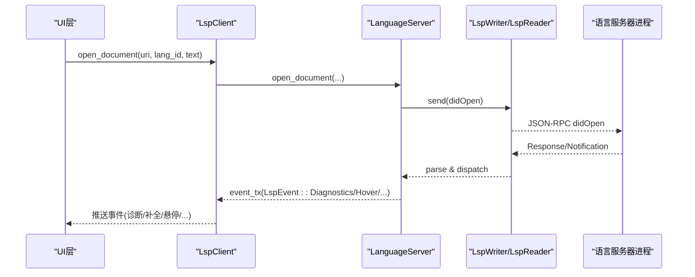
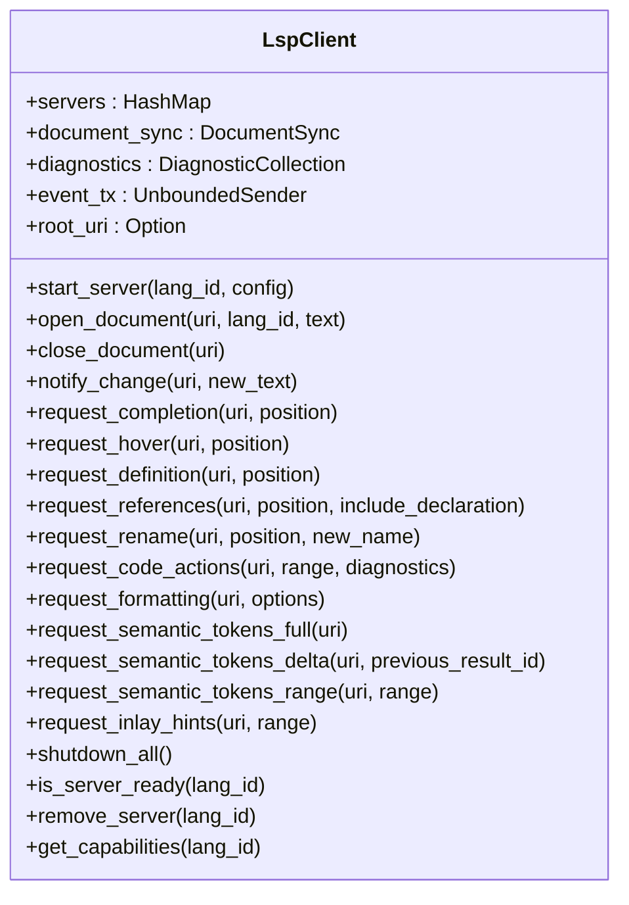
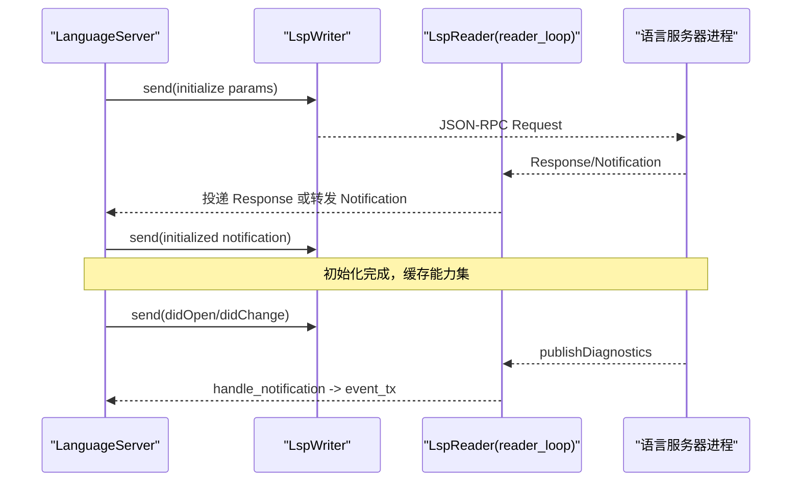
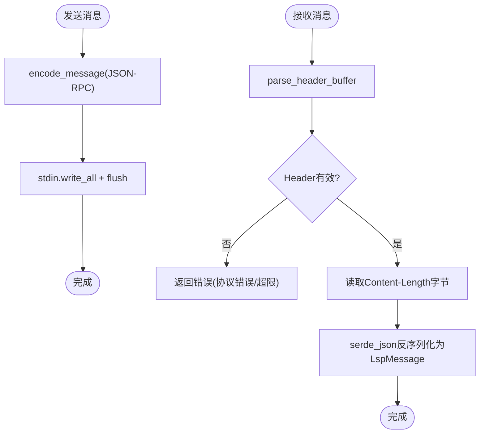
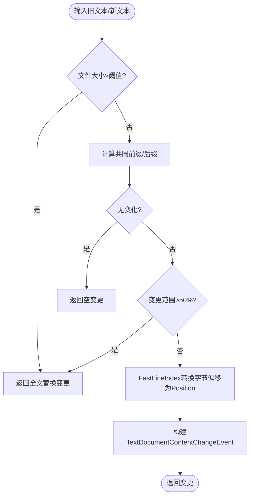
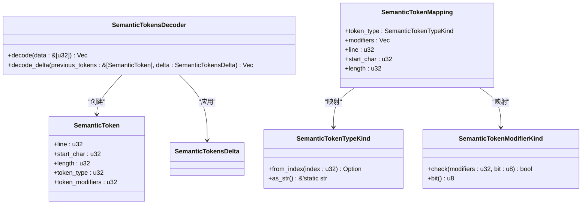
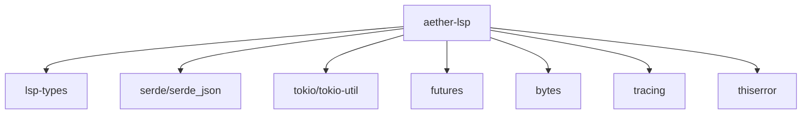

# aether-lsp 语言服务

<cite>
**本文引用的文件**
- [lib.rs](file://crates/aether-lsp/src/lib.rs)
- [Cargo.toml](file://crates/aether-lsp/Cargo.toml)
- [client.rs](file://crates/aether-lsp/src/client.rs)
- [server.rs](file://crates/aether-lsp/src/server.rs)
- [transport.rs](file://crates/aether-lsp/src/transport.rs)
- [types.rs](file://crates/aether-lsp/src/types.rs)
- [sync.rs](file://crates/aether-lsp/src/sync.rs)
- [semantic_tokens.rs](file://crates/aether-lsp/src/semantic_tokens.rs)
- [incremental_sync.rs](file://crates/aether-lsp/src/incremental_sync.rs)
</cite>

## 目录
1. [简介](#简介)
2. [项目结构](#项目结构)
3. [核心组件](#核心组件)
4. [架构总览](#架构总览)
5. [详细组件分析](#详细组件分析)
6. [依赖关系分析](#依赖关系分析)
7. [性能考量](#性能考量)
8. [故障排查指南](#故障排查指南)
9. [结论](#结论)
10. [附录：配置与集成示例](#附录配置与集成示例)

## 简介
aether-lsp 是 Aether 编辑器中的 LSP（Language Server Protocol）客户端实现，负责与外部语言服务器进程通信，提供文档同步、诊断、补全、悬停、跳转定义、查找引用、重命名、代码操作、格式化、语义令牌和内联提示等能力。模块采用异步 I/O 与多任务模型，通过 JSON-RPC over stdio 协议与语言服务器交互，并内置增量同步、语义令牌解码、错误处理与性能优化策略。

## 项目结构
aether-lsp crate 以功能域划分模块：
- 客户端管理：LspClient 统一入口，按语言ID路由到具体 LanguageServer 实例
- 服务器生命周期：LanguageServer 负责启动、初始化、请求/响应、通知转发、关闭
- 传输层：LspWriter/LspReader/LspTransport 实现 JSON-RPC over stdio 的编码解码与消息收发
- 类型定义：LspMessage、ServerConfig、DocumentState、ServerCapabilitiesCache 等
- 文档同步：DocumentSync 跟踪打开文档状态；compute_changes 计算增量变更
- 增量同步优化：FastLineIndex、IncrementalChangeCalculator、OptimizedDocumentSync、LargeFileSyncStrategy
- 语义令牌：SemanticTokensDecoder、类型/修饰符映射、delta 合并

**图表来源**
- [lib.rs:1-16](file://crates/aether-lsp/src/lib.rs#L1-L16)
- [client.rs:13-25](file://crates/aether-lsp/src/client.rs#L13-L25)
- [server.rs:34-61](file://crates/aether-lsp/src/server.rs#L34-L61)
- [transport.rs:12-17](file://crates/aether-lsp/src/transport.rs#L12-L17)
- [types.rs:6-12](file://crates/aether-lsp/src/types.rs#L6-L12)
- [sync.rs:8-10](file://crates/aether-lsp/src/sync.rs#L8-L10)
- [incremental_sync.rs:97-104](file://crates/aether-lsp/src/incremental_sync.rs#L97-L104)
- [semantic_tokens.rs:3-11](file://crates/aether-lsp/src/semantic_tokens.rs#L3-L11)

**章节来源**
- [lib.rs:1-16](file://crates/aether-lsp/src/lib.rs#L1-L16)
- [Cargo.toml:1-20](file://crates/aether-lsp/Cargo.toml#L1-L20)

## 核心组件
- LspClient：对外 API，管理多个语言服务器实例、文档同步、诊断缓存、事件推送，并提供补全、悬停、定义、引用、重命名、代码操作、格式化、语义令牌、内联提示等方法。
- LanguageServer：单个语言服务器的完整生命周期管理，包含启动、initialize、请求发送与超时处理、通知转发、文档同步、关闭流程。
- 传输层：LspWriter 仅写 stdin；LspReader 仅读 stdout；LspTransport 用于测试兼容；encode_message/parse_header_buffer 实现 JSON-RPC over stdio 编解码。
- 类型系统：LspMessage（Request/Response/Notification）、ServerConfig（命令、参数、环境变量、根URI、初始化选项）、DocumentState、ServerCapabilitiesCache、RequestIdGenerator。
- 文档同步：DocumentSync 维护打开文档集合与版本；compute_changes 基于共同前缀/后缀计算精确增量变更，大文件或大范围回退为全文替换。
- 增量同步优化：FastLineIndex 将字节偏移转换为 LSP Position（UTF-16 码元），支持 O(log n) 行查找；IncrementalChangeCalculator 从编辑操作直接生成变更；OptimizedDocumentSync 记录编辑历史并批量发送；LargeFileSyncStrategy 针对大文件的同步策略。
- 语义令牌：SemanticTokensDecoder 解码紧凑 uinteger 数组为结构化 token 列表，支持 delta 更新；类型/修饰符映射用于渲染着色。

**章节来源**
- [client.rs:13-25](file://crates/aether-lsp/src/client.rs#L13-L25)
- [server.rs:34-61](file://crates/aether-lsp/src/server.rs#L34-L61)
- [transport.rs:12-17](file://crates/aether-lsp/src/transport.rs#L12-L17)
- [types.rs:6-12](file://crates/aether-lsp/src/types.rs#L6-L12)
- [sync.rs:8-10](file://crates/aether-lsp/src/sync.rs#L8-L10)
- [incremental_sync.rs:97-104](file://crates/aether-lsp/src/incremental_sync.rs#L97-L104)
- [semantic_tokens.rs:3-11](file://crates/aether-lsp/src/semantic_tokens.rs#L3-L11)

## 架构总览
aether-lsp 采用“客户端-服务器”分离架构：
- 主线程持有 LspWriter，所有出站请求/通知通过它发送
- 后台 reader_loop task 独占 LspReader，持续解析 stdout 消息并分发
- 请求-响应通过 oneshot channel 配对：调用方 await receiver，reader task 收到 Response 时投递
- Notification（如 publishDiagnostics）由 reader task 直接转发到 UI 层事件通道

**图表来源**
- [server.rs:26-33](file://crates/aether-lsp/src/server.rs#L26-L33)
- [transport.rs:21-27](file://crates/aether-lsp/src/transport.rs#L21-L27)
- [client.rs:27-71](file://crates/aether-lsp/src/client.rs#L27-L71)

## 详细组件分析

### LspClient：客户端管理器
- 职责：按语言ID路由请求到对应 LanguageServer；管理 DocumentSync；维护诊断缓存；向 UI 推送事件；提供各类 LSP 请求方法。
- 关键设计：
  - 使用 Arc<RwLock<HashMap<String, Arc<tokio::sync::Mutex<LanguageServer>>>> 存储服务器实例，避免全局写锁跨 await
  - 文档打开/关闭/变更时先更新本地 DocumentSync，再路由到服务器
  - 诊断缓存使用 std Mutex 以便 UI 主线程同步读取/更新
  - 事件通道 mpsc::UnboundedSender<LspEvent> 推送诊断、补全、悬停、引用、重命名、代码操作、格式化、语义令牌、内联提示、服务器就绪/退出、日志等

**图表来源**
- [client.rs:13-25](file://crates/aether-lsp/src/client.rs#L13-L25)
- [client.rs:89-114](file://crates/aether-lsp/src/client.rs#L89-L114)
- [client.rs:116-172](file://crates/aether-lsp/src/client.rs#L116-L172)
- [client.rs:215-286](file://crates/aether-lsp/src/client.rs#L215-L286)
- [client.rs:288-567](file://crates/aether-lsp/src/client.rs#L288-L567)
- [client.rs:569-617](file://crates/aether-lsp/src/client.rs#L569-L617)

**章节来源**
- [client.rs:13-25](file://crates/aether-lsp/src/client.rs#L13-L25)
- [client.rs:89-114](file://crates/aether-lsp/src/client.rs#L89-L114)
- [client.rs:116-172](file://crates/aether-lsp/src/client.rs#L116-L172)
- [client.rs:215-286](file://crates/aether-lsp/src/client.rs#L215-L286)
- [client.rs:288-567](file://crates/aether-lsp/src/client.rs#L288-L567)
- [client.rs:569-617](file://crates/aether-lsp/src/client.rs#L569-L617)

### LanguageServer：服务器生命周期与消息处理
- 职责：启动子进程、initialize、发送请求并等待响应、处理服务器反向请求、转发通知、文档同步、优雅关闭。
- 关键设计：
  - 默认请求超时 30 秒，initialize 超时 60 秒
  - send_request 生成唯一 ID，注册 oneshot sender 到 response_channels
  - receive_response 等待响应，处理错误/反序列化/超时
  - handle_server_request 最小可用响应 workspace/configuration、capability 注册/注销、workspace/applyEdit、workspace/workspaceFolders
  - initialize 构建 ClientCapabilities，声明文本同步、补全、悬停、定义、符号、代码操作、格式化、重命名、语义令牌、内联提示等能力
  - cache_capabilities 缓存服务器返回的能力集
  - open/close/change 文档通过 didOpen/didClose/didChange 通知
  - shutdown 发送 shutdown 请求与 exit 通知，超时 kill 子进程

**图表来源**
- [server.rs:68-124](file://crates/aether-lsp/src/server.rs#L68-L124)
- [server.rs:140-216](file://crates/aether-lsp/src/server.rs#L140-L216)
- [server.rs:218-302](file://crates/aether-lsp/src/server.rs#L218-L302)
- [server.rs:304-484](file://crates/aether-lsp/src/server.rs#L304-L484)
- [server.rs:506-590](file://crates/aether-lsp/src/server.rs#L506-L590)
- [server.rs:661-695](file://crates/aether-lsp/src/server.rs#L661-L695)

**章节来源**
- [server.rs:16-22](file://crates/aether-lsp/src/server.rs#L16-L22)
- [server.rs:68-124](file://crates/aether-lsp/src/server.rs#L68-L124)
- [server.rs:140-216](file://crates/aether-lsp/src/server.rs#L140-L216)
- [server.rs:218-302](file://crates/aether-lsp/src/server.rs#L218-L302)
- [server.rs:304-484](file://crates/aether-lsp/src/server.rs#L304-L484)
- [server.rs:506-590](file://crates/aether-lsp/src/server.rs#L506-L590)
- [server.rs:661-695](file://crates/aether-lsp/src/server.rs#L661-L695)

### 传输层：JSON-RPC over stdio
- LspWriter：仅持有 stdin，发送消息时编码为 JSON-RPC over stdio 格式（Header + Content-Length + Content-Type + \r\n + JSON body）
- LspReader：仅持有 stdout，循环读取并解析 Header，校验 Content-Length，限制最大头部大小与消息大小，防止 OOM
- LspTransport：测试兼容的双向传输封装
- spawn_server/build_command/probe_server_command：启动语言服务器进程，支持 Windows 无控制台窗口标志，预探测二进制可用性
- spawn_stderr_drain：后台持续读取 stderr，避免管道缓冲区满导致子进程阻塞

**图表来源**
- [transport.rs:21-27](file://crates/aether-lsp/src/transport.rs#L21-L27)
- [transport.rs:127-160](file://crates/aether-lsp/src/transport.rs#L127-L160)
- [transport.rs:162-209](file://crates/aether-lsp/src/transport.rs#L162-L209)
- [transport.rs:211-229](file://crates/aether-lsp/src/transport.rs#L211-L229)
- [transport.rs:231-253](file://crates/aether-lsp/src/transport.rs#L231-L253)
- [transport.rs:255-306](file://crates/aether-lsp/src/transport.rs#L255-L306)
- [transport.rs:341-359](file://crates/aether-lsp/src/transport.rs#L341-L359)

**章节来源**
- [transport.rs:12-17](file://crates/aether-lsp/src/transport.rs#L12-L17)
- [transport.rs:127-160](file://crates/aether-lsp/src/transport.rs#L127-L160)
- [transport.rs:162-209](file://crates/aether-lsp/src/transport.rs#L162-L209)
- [transport.rs:211-229](file://crates/aether-lsp/src/transport.rs#L211-L229)
- [transport.rs:231-253](file://crates/aether-lsp/src/transport.rs#L231-L253)
- [transport.rs:255-306](file://crates/aether-lsp/src/transport.rs#L255-L306)
- [transport.rs:341-359](file://crates/aether-lsp/src/transport.rs#L341-L359)

### 文档同步与增量变更
- DocumentSync：维护打开文档集合，跟踪 URI、语言ID、版本、文本；提供 open/close/get/update/increment_version 等方法
- compute_changes：基于共同前缀/后缀计算字符级 diff，使用 FastLineIndex 将字节偏移转换为 LSP Position（UTF-16 码元）；大文件或变更范围超过 50% 时回退为全文替换
- 增量同步优化：
  - FastLineIndex：预计算行起始位置，O(log n) 行查找，正确处理 UTF-16 码元计数
  - IncrementalChangeCalculator：从编辑操作直接生成变更，支持相邻编辑合并
  - OptimizedDocumentSync：记录编辑历史，批量发送，清理过期历史
  - LargeFileSyncStrategy：大文件阈值判断、是否发送完整内容、同步延迟

**图表来源**
- [sync.rs:82-148](file://crates/aether-lsp/src/sync.rs#L82-L148)
- [incremental_sync.rs:97-190](file://crates/aether-lsp/src/incremental_sync.rs#L97-L190)
- [incremental_sync.rs:33-80](file://crates/aether-lsp/src/incremental_sync.rs#L33-L80)

**章节来源**
- [sync.rs:8-71](file://crates/aether-lsp/src/sync.rs#L8-L71)
- [sync.rs:82-148](file://crates/aether-lsp/src/sync.rs#L82-L148)
- [incremental_sync.rs:97-190](file://crates/aether-lsp/src/incremental_sync.rs#L97-L190)
- [incremental_sync.rs:33-80](file://crates/aether-lsp/src/incremental_sync.rs#L33-L80)

### 语义令牌处理
- SemanticTokensDecoder：解码紧凑 uinteger 数组为结构化 token 列表，支持 delta 更新（删除/插入）
- 类型/修饰符映射：SemanticTokenTypeKind 与 SemanticTokenModifierKind 提供标准 22 种类型与 10 位修饰符映射
- map_tokens：将解码后的 token 映射为渲染可用的信息（类型、修饰符、位置、长度）

**图表来源**
- [semantic_tokens.rs:3-11](file://crates/aether-lsp/src/semantic_tokens.rs#L3-L11)
- [semantic_tokens.rs:17-86](file://crates/aether-lsp/src/semantic_tokens.rs#L17-L86)
- [semantic_tokens.rs:88-172](file://crates/aether-lsp/src/semantic_tokens.rs#L88-L172)
- [semantic_tokens.rs:174-264](file://crates/aether-lsp/src/semantic_tokens.rs#L174-L264)

**章节来源**
- [semantic_tokens.rs:3-11](file://crates/aether-lsp/src/semantic_tokens.rs#L3-L11)
- [semantic_tokens.rs:17-86](file://crates/aether-lsp/src/semantic_tokens.rs#L17-L86)
- [semantic_tokens.rs:88-172](file://crates/aether-lsp/src/semantic_tokens.rs#L88-L172)
- [semantic_tokens.rs:174-264](file://crates/aether-lsp/src/semantic_tokens.rs#L174-L264)

## 依赖关系分析
aether-lsp 依赖以下核心库：
- lsp-types：LSP 类型定义
- serde/serde_json：序列化/反序列化
- tokio/tokio-util：异步运行时、进程、IO、时间、编解码
- futures：异步流处理
- bytes：字节缓冲
- tracing：日志追踪
- thiserror：错误处理

**图表来源**
- [Cargo.toml:6-16](file://crates/aether-lsp/Cargo.toml#L6-L16)

**章节来源**
- [Cargo.toml:6-16](file://crates/aether-lsp/Cargo.toml#L6-L16)

## 性能考量
- 传输层防护：限制 Header 大小为 8KB，Content-Length 最大 64MB，防止恶意或异常消息导致 OOM
- 增量同步：compute_changes 基于共同前缀/后缀计算精确变更，大文件或大范围回退为全文替换；FastLineIndex 提供高效字节偏移到 LSP Position 转换
- 批量合并：IncrementalChangeCalculator.merge_edits 仅合并真正相邻的编辑，减少消息数量
- 大文件策略：LargeFileSyncStrategy 根据文件大小和变更比例决定同步策略，支持延迟同步
- 请求超时：默认 30 秒，initialize 60 秒，避免长时间阻塞
- 资源清理：shutdown 后清理 pending sender，避免内存泄漏；stderr 后台读取避免管道阻塞

[本节为通用性能指导，不直接分析具体文件]

## 故障排查指南
- 服务器启动失败：probe_server_command 预探测二进制可用性，若失败返回详细错误信息
- 管道阻塞：spawn_stderr_drain 后台读取 stderr，避免子进程因 stderr 缓冲区满而阻塞
- 请求超时：receive_response 超时后清理 response_channels 中对应 sender，避免泄漏
- 协议错误：parse_header_buffer 对无效 Header、缺失 Content-Length、超大消息返回错误，防止协议失同步
- 服务器意外退出：reader_loop 退出时 drop 所有 sender，receiver 收到 RecvError，上层可检测并清理服务器实例

**章节来源**
- [transport.rs:255-306](file://crates/aether-lsp/src/transport.rs#L255-L306)
- [transport.rs:341-359](file://crates/aether-lsp/src/transport.rs#L341-L359)
- [server.rs:170-216](file://crates/aether-lsp/src/server.rs#L170-L216)
- [transport.rs:162-209](file://crates/aether-lsp/src/transport.rs#L162-L209)

## 结论
aether-lsp 提供了完整的 LSP 客户端实现，涵盖连接管理、消息传递、文档同步、语义令牌处理、错误处理和性能优化。通过模块化设计，清晰分离了客户端管理、服务器生命周期、传输层、类型定义、同步逻辑和语义令牌处理，便于扩展和维护。结合增量同步、批量合并、大文件策略和传输层防护，实现了高效稳定的语言服务集成。

[本节为总结性内容，不直接分析具体文件]

## 附录：配置与集成示例

### LSP 客户端配置
- 使用 default_server_config 获取常见语言的默认服务器配置（rust-analyzer、pylsp、typescript-language-server、clangd）
- 自定义 ServerConfig：设置 command、args、env、root_uri、initialization_options
- 启动服务器：LspClient::start_server 传入 language_id 和 ServerConfig
- 打开文档：LspClient::open_document 传入 uri、language_id、text
- 文档变更：LspClient::notify_change 自动计算增量变更并发送到服务器
- 请求方法：completion、hover、definition、references、rename、code_actions、formatting、semantic_tokens、inlay_hints

**章节来源**
- [client.rs:620-653](file://crates/aether-lsp/src/client.rs#L620-L653)
- [client.rs:89-114](file://crates/aether-lsp/src/client.rs#L89-L114)
- [client.rs:116-172](file://crates/aether-lsp/src/client.rs#L116-L172)
- [client.rs:215-286](file://crates/aether-lsp/src/client.rs#L215-L286)
- [client.rs:288-567](file://crates/aether-lsp/src/client.rs#L288-L567)

### 与编辑器的协作方式
- 事件驱动：LspClient 通过 event_tx 推送 LspEvent 到 UI 层，包括诊断、补全、悬停、引用、重命名、代码操作、格式化、语义令牌、内联提示、服务器就绪/退出、日志
- 诊断缓存：update_diagnostics/remove_diagnostics/diagnostics_for/all_diagnostics/clear_diagnostics 管理诊断数据
- 服务器能力：get_capabilities 获取服务器能力，supports_* 方法检查特定功能支持

**章节来源**
- [client.rs:27-71](file://crates/aether-lsp/src/client.rs#L27-L71)
- [client.rs:174-213](file://crates/aether-lsp/src/client.rs#L174-L213)
- [client.rs:605-617](file://crates/aether-lsp/src/client.rs#L605-L617)

### 自定义语言服务器接入
- 配置 ServerConfig：设置 command 为自定义服务器路径，args 为启动参数，env 为环境变量，root_uri 为工作区根，initialization_options 为初始化选项
- 启动并初始化：LspClient::start_server 启动服务器，LanguageServer::initialize 发送 initialize 请求并缓存能力
- 文档同步：open_document/close_document/notify_change 与服务器同步文档状态
- 请求方法：根据服务器能力调用相应方法（补全、悬停、定义、引用、重命名、代码操作、格式化、语义令牌、内联提示）

**章节来源**
- [types.rs:49-62](file://crates/aether-lsp/src/types.rs#L49-L62)
- [server.rs:304-484](file://crates/aether-lsp/src/server.rs#L304-L484)
- [server.rs:506-590](file://crates/aether-lsp/src/server.rs#L506-L590)
- [server.rs:592-800](file://crates/aether-lsp/src/server.rs#L592-L800)