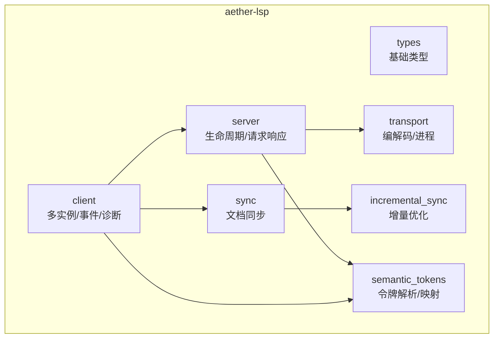
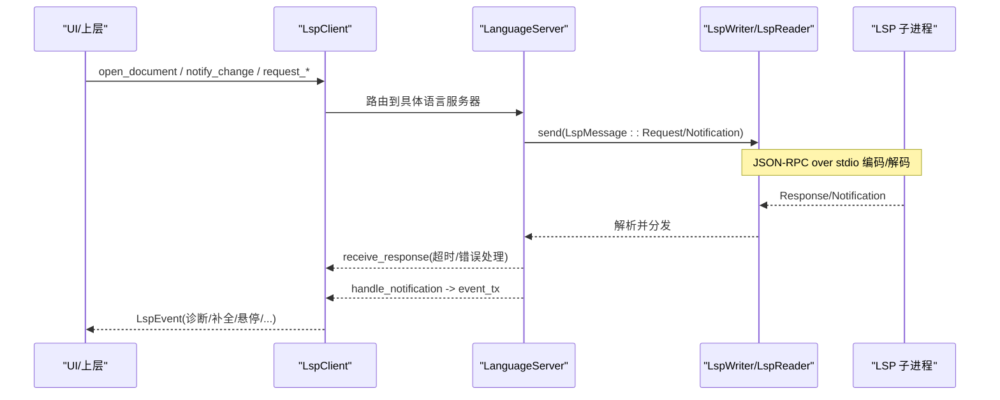
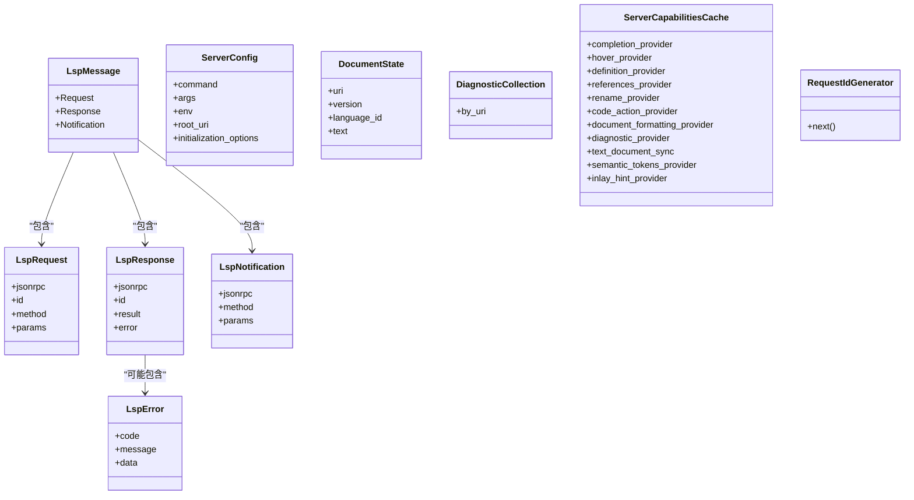
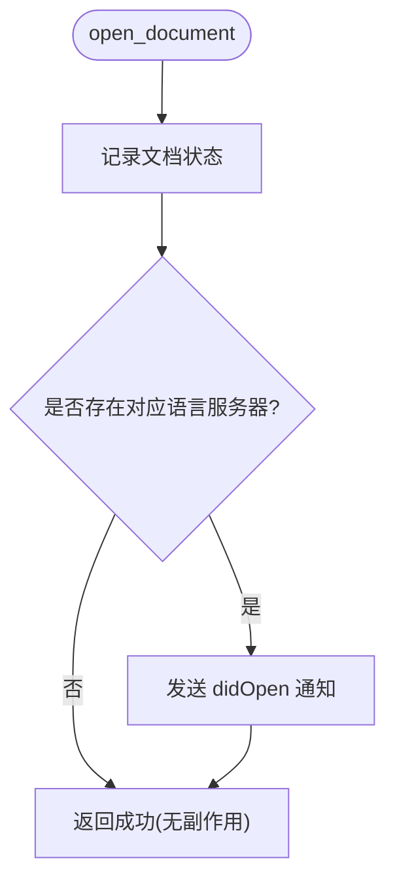
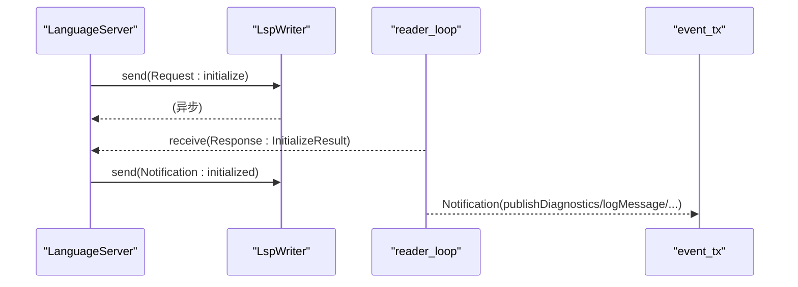
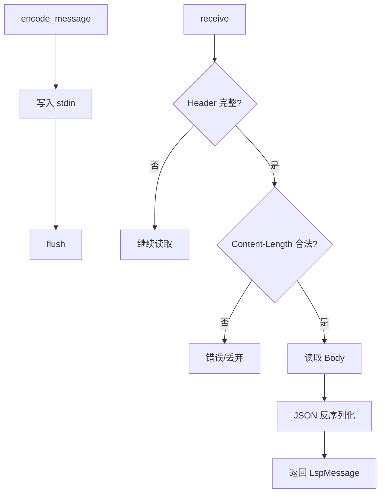
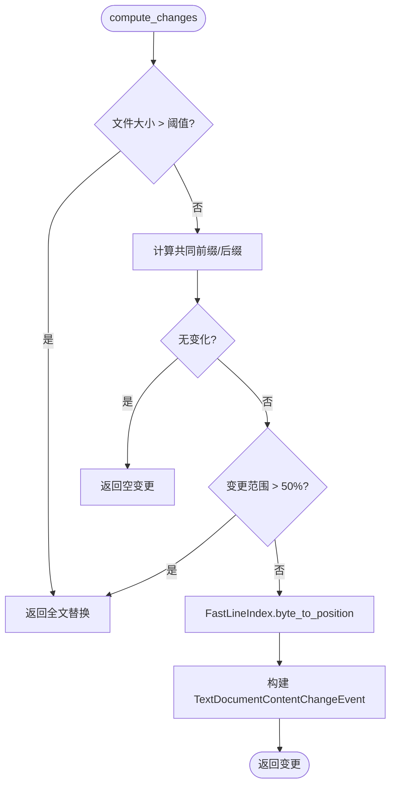
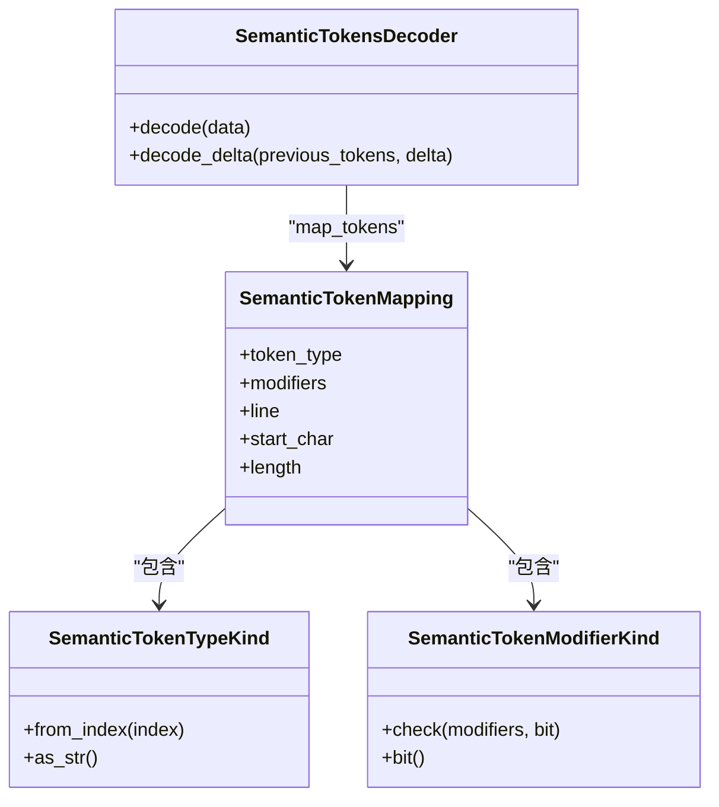
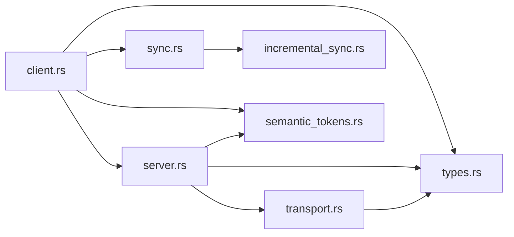

# 数据类型定义

<cite>
**本文引用的文件**
- [types.rs](file://crates/aether-lsp/src/types.rs)
- [lib.rs](file://crates/aether-lsp/src/lib.rs)
- [client.rs](file://crates/aether-lsp/src/client.rs)
- [server.rs](file://crates/aether-lsp/src/server.rs)
- [transport.rs](file://crates/aether-lsp/src/transport.rs)
- [sync.rs](file://crates/aether-lsp/src/sync.rs)
- [incremental_sync.rs](file://crates/aether-lsp/src/incremental_sync.rs)
- [semantic_tokens.rs](file://crates/aether-lsp/src/semantic_tokens.rs)
</cite>

## 目录
1. [简介](#简介)
2. [项目结构](#项目结构)
3. [核心组件](#核心组件)
4. [架构总览](#架构总览)
5. [详细组件分析](#详细组件分析)
6. [依赖关系分析](#依赖关系分析)
7. [性能考量](#性能考量)
8. [故障排查指南](#故障排查指南)
9. [结论](#结论)
10. [附录：类型使用示例与扩展开发指南](#附录类型使用示例与扩展开发指南)

## 简介
本文件聚焦于 LSP（Language Server Protocol）数据类型的定义与实现，覆盖核心数据结构、枚举类型、特征定义、协议类型映射、自定义扩展类型、序列化配置、类型验证、错误处理与兼容性考虑。文档同时提供类型使用示例与扩展开发指南，帮助读者在 Aether 编辑器中正确集成和扩展 LSP 能力。

## 项目结构
aether-lsp 模块围绕“客户端-服务器-传输-同步”四层组织：
- types：LSP 消息、错误、配置、状态等基础类型
- transport：JSON-RPC over stdio 的编码/解码与进程管理
- server：语言服务器生命周期、请求/通知处理、能力缓存
- client：多语言服务器实例管理、事件分发、诊断缓存
- sync/incremental_sync：文档打开/关闭、增量变更计算与优化
- semantic_tokens：语义令牌解码、类型映射与渲染映射

图表来源
- [lib.rs:1-16](file://crates/aether-lsp/src/lib.rs#L1-L16)
- [types.rs:1-120](file://crates/aether-lsp/src/types.rs#L1-L120)
- [transport.rs:1-120](file://crates/aether-lsp/src/transport.rs#L1-L120)
- [server.rs:1-125](file://crates/aether-lsp/src/server.rs#L1-L125)
- [client.rs:1-120](file://crates/aether-lsp/src/client.rs#L1-L120)
- [sync.rs:1-80](file://crates/aether-lsp/src/sync.rs#L1-L80)
- [incremental_sync.rs:1-130](file://crates/aether-lsp/src/incremental_sync.rs#L1-L130)
- [semantic_tokens.rs:1-90](file://crates/aether-lsp/src/semantic_tokens.rs#L1-L90)

章节来源
- [lib.rs:1-16](file://crates/aether-lsp/src/lib.rs#L1-L16)

## 核心组件
- LSP 消息与错误
  - LspMessage：JSON-RPC 2.0 的消息联合体（Request/Response/Notification）
  - LspRequest/LspResponse/LspNotification：分别对应请求、响应、通知
  - LspError：标准错误码与消息
- 服务器配置与状态
  - ServerConfig：可执行路径、参数、环境变量、工作区根 URI、初始化选项
  - DocumentState：URI、版本、语言ID、文本
  - DiagnosticCollection：按 URI 聚合的诊断集合
  - ServerCapabilitiesCache：缓存服务器能力，便于快速判断支持特性
  - RequestIdGenerator：单调递增的请求 ID 生成器
- 客户端与事件
  - LspClient：多语言服务器实例管理、文档同步、诊断缓存、事件通道
  - LspEvent：诊断、补全、悬停、引用、重命名、代码操作、格式化、语义令牌、内联提示、服务器就绪/退出、日志
- 传输层
  - LspWriter/LspReader/LspTransport：JSON-RPC over stdio 的发送/接收、Header 解析、Content-Length 校验、进程启动与 stderr 清理
- 同步与增量
  - DocumentSync：打开/关闭、版本管理、文本更新
  - IncrementalChangeCalculator/FastLineIndex/OptimizedDocumentSync/LargeFileSyncStrategy：高效增量变更计算、UTF-16 位置转换、批量合并与延迟策略
- 语义令牌
  - SemanticTokensDecoder：完整与 delta 解码
  - SemanticTokenTypeKind/SemanticTokenModifierKind：类型与修饰符枚举及位检查
  - map_tokens：将解码结果映射为渲染可用信息

章节来源
- [types.rs:1-120](file://crates/aether-lsp/src/types.rs#L1-L120)
- [client.rs:1-120](file://crates/aether-lsp/src/client.rs#L1-L120)
- [transport.rs:1-120](file://crates/aether-lsp/src/transport.rs#L1-L120)
- [sync.rs:1-80](file://crates/aether-lsp/src/sync.rs#L1-L80)
- [incremental_sync.rs:1-130](file://crates/aether-lsp/src/incremental_sync.rs#L1-L130)
- [semantic_tokens.rs:1-90](file://crates/aether-lsp/src/semantic_tokens.rs#L1-L90)

## 架构总览
下图展示了从 UI 到 LSP 服务器的典型调用链：客户端发起请求，通过传输层发送到子进程；后台 reader 持续读取响应并投递到等待方；通知直接转发至事件通道。

图表来源
- [client.rs:116-144](file://crates/aether-lsp/src/client.rs#L116-L144)
- [server.rs:140-216](file://crates/aether-lsp/src/server.rs#L140-L216)
- [transport.rs:21-28](file://crates/aether-lsp/src/transport.rs#L21-L28)
- [transport.rs:127-160](file://crates/aether-lsp/src/transport.rs#L127-L160)

## 详细组件分析

### 基础类型与序列化（types.rs）
- LspMessage/LspRequest/LspResponse/LspNotification/LspError
  - 使用 serde 的 untagged 枚举进行反序列化，兼容多种消息形态
  - 可选字段使用 skip_serializing_if，避免冗余 JSON
- ServerConfig/DocumentState/DiagnosticCollection/ServerCapabilitiesCache/RequestIdGenerator
  - 提供默认值与便捷方法，简化初始化与使用
  - 能力缓存用于快速判断是否启用某项功能

图表来源
- [types.rs:5-120](file://crates/aether-lsp/src/types.rs#L5-L120)

章节来源
- [types.rs:5-120](file://crates/aether-lsp/src/types.rs#L5-L120)

### 客户端与事件（client.rs）
- LspClient
  - 维护多语言服务器实例（按 language_id 路由）
  - 文档同步管理器（DocumentSync）
  - 诊断集合（DiagnosticCollection），线程安全访问
  - 事件通道（mpsc）向 UI 推送各类结果
- 关键方法
  - start_server/open_document/close_document/notify_change
  - request_completion/request_hover/request_definition/request_references/request_rename/request_code_actions/request_formatting
  - request_semantic_tokens_full/range/delta
  - request_inlay_hints/shutdown_all/is_server_ready/remove_server/get_capabilities

图表来源
- [client.rs:116-144](file://crates/aether-lsp/src/client.rs#L116-L144)

章节来源
- [client.rs:116-144](file://crates/aether-lsp/src/client.rs#L116-L144)

### 服务器生命周期与请求处理（server.rs）
- LanguageServer
  - 启动子进程、stdin/stdout/stderr 分离
  - 后台 reader_loop 负责解析响应与通知
  - initialize 流程：构造 InitializeParams/Capabilities，发送 initialize，缓存能力，发送 initialized 通知
  - 请求-响应：send_request/receive_response，带超时与错误处理
  - 反向请求处理：workspace/configuration、registerCapability/unregisterCapability、applyEdit、workspaceFolders 等
  - 文档操作：open/close/change
  - 能力查询：supports_* 辅助方法

图表来源
- [server.rs:63-125](file://crates/aether-lsp/src/server.rs#L63-L125)
- [server.rs:140-216](file://crates/aether-lsp/src/server.rs#L140-L216)
- [server.rs:304-484](file://crates/aether-lsp/src/server.rs#L304-L484)

章节来源
- [server.rs:63-125](file://crates/aether-lsp/src/server.rs#L63-L125)
- [server.rs:140-216](file://crates/aether-lsp/src/server.rs#L140-L216)
- [server.rs:304-484](file://crates/aether-lsp/src/server.rs#L304-L484)

### 传输层与协议（transport.rs）
- LspWriter/LspReader/LspTransport
  - encode_message：序列化为 JSON，附加 Header（Content-Length/Content-Type）
  - parse_header_buffer：解析 Header，限制最大长度，防止 OOM
  - receive：循环读取直到完整消息到达，处理 EOF 与 JSON 解析错误
- spawn_server/build_command/probe_server_command/spawn_stderr_drain
  - 构建命令、设置环境变量、Windows 隐藏控制台窗口
  - 探针验证二进制可用性，避免静默失败
  - 后台读取 stderr，防止管道阻塞

图表来源
- [transport.rs:21-28](file://crates/aether-lsp/src/transport.rs#L21-L28)
- [transport.rs:127-160](file://crates/aether-lsp/src/transport.rs#L127-L160)
- [transport.rs:211-253](file://crates/aether-lsp/src/transport.rs#L211-L253)

章节来源
- [transport.rs:21-28](file://crates/aether-lsp/src/transport.rs#L21-L28)
- [transport.rs:127-160](file://crates/aether-lsp/src/transport.rs#L127-L160)
- [transport.rs:211-253](file://crates/aether-lsp/src/transport.rs#L211-L253)

### 文档同步与增量（sync.rs, incremental_sync.rs）
- DocumentSync：跟踪已打开文档的状态与版本
- compute_changes：基于共同前缀/后缀的字符级 diff，大文件或大范围变更回退为全文替换；使用 FastLineIndex 将字节偏移转换为 UTF-16 Position
- IncrementalChangeCalculator：从编辑操作直接生成变更，支持相邻编辑合并
- FastLineIndex：预计算行起始位置，O(log n) 查找行，character 按 UTF-16 码元计数
- OptimizedDocumentSync：记录编辑历史、批量发送、清理旧历史
- LargeFileSyncStrategy：大文件阈值、延迟同步策略

图表来源
- [sync.rs:82-148](file://crates/aether-lsp/src/sync.rs#L82-L148)
- [incremental_sync.rs:96-190](file://crates/aether-lsp/src/incremental_sync.rs#L96-L190)

章节来源
- [sync.rs:82-148](file://crates/aether-lsp/src/sync.rs#L82-L148)
- [incremental_sync.rs:96-190](file://crates/aether-lsp/src/incremental_sync.rs#L96-L190)

### 语义令牌（semantic_tokens.rs）
- SemanticTokensDecoder：解码完整与 delta 数据，应用编辑顺序（逆序）
- SemanticTokenTypeKind/SemanticTokenModifierKind：类型与修饰符枚举，位掩码检查
- map_tokens：将 token 映射为渲染可用信息（类型+修饰符列表）

图表来源
- [semantic_tokens.rs:13-90](file://crates/aether-lsp/src/semantic_tokens.rs#L13-L90)
- [semantic_tokens.rs:88-172](file://crates/aether-lsp/src/semantic_tokens.rs#L88-L172)
- [semantic_tokens.rs:174-264](file://crates/aether-lsp/src/semantic_tokens.rs#L174-L264)

章节来源
- [semantic_tokens.rs:13-90](file://crates/aether-lsp/src/semantic_tokens.rs#L13-L90)
- [semantic_tokens.rs:88-172](file://crates/aether-lsp/src/semantic_tokens.rs#L88-L172)
- [semantic_tokens.rs:174-264](file://crates/aether-lsp/src/semantic_tokens.rs#L174-L264)

## 依赖关系分析
- 模块间耦合
  - client 依赖 server、sync、types、transport
  - server 依赖 transport、types、client 事件通道
  - transport 依赖 types（LspMessage）
  - sync/incremental_sync 依赖 lsp_types（Position/Range/TextDocumentContentChangeEvent 等）
  - semantic_tokens 依赖 lsp_types（SemanticTokens/SemanticTokensDelta 等）
- 外部依赖
  - lsp_types：LSP 协议类型
  - serde/serde_json：序列化/反序列化
  - tokio：异步 IO、进程管理、任务调度
  - bytes：缓冲区管理

图表来源
- [lib.rs:1-16](file://crates/aether-lsp/src/lib.rs#L1-L16)
- [client.rs:1-120](file://crates/aether-lsp/src/client.rs#L1-L120)
- [server.rs:1-125](file://crates/aether-lsp/src/server.rs#L1-L125)
- [transport.rs:1-120](file://crates/aether-lsp/src/transport.rs#L1-L120)
- [sync.rs:1-80](file://crates/aether-lsp/src/sync.rs#L1-L80)
- [incremental_sync.rs:1-130](file://crates/aether-lsp/src/incremental_sync.rs#L1-L130)
- [semantic_tokens.rs:1-90](file://crates/aether-lsp/src/semantic_tokens.rs#L1-L90)

章节来源
- [lib.rs:1-16](file://crates/aether-lsp/src/lib.rs#L1-L16)

## 性能考量
- 传输层
  - Header 大小限制（8KB）与 Content-Length 上限（64MB），防止恶意或异常消息导致 OOM
  - 后台 stderr 读取避免管道阻塞
- 同步与增量
  - 大文件阈值（100KB）与变更比例（>50%）回退为全文替换，减少无效增量
  - 相邻编辑合并，降低消息数量
  - FastLineIndex 使用二分查找行，character 按 UTF-16 码元计数，保证 LSP 位置准确
- 请求超时
  - 默认请求超时 30s，initialize 允许更长超时（60s），避免首次启动慢导致的误判

[本节为通用性能讨论，不直接分析具体文件]

## 故障排查指南
- 常见错误与定位
  - JSON 解析错误：检查 LspMessage 结构与字段名，确认序列化配置
  - Content-Length 非法或过大：检查传输层解析逻辑与上限配置
  - 服务器 stdout 关闭：receive_response 返回 UnexpectedEof，需检查子进程是否异常退出
  - 请求超时：检查服务器初始化与处理能力，必要时调整超时
  - 诊断未显示：确认 reader_loop 正常转发通知至 event_tx，且 UI 订阅了相应事件
- 建议步骤
  - 使用 probe_server_command 验证二进制可用性
  - 查看 stderr 输出，定位子进程错误
  - 检查能力缓存，确认服务器声明了对应功能
  - 对大文件或频繁编辑场景，评估增量策略与合并效果

章节来源
- [transport.rs:162-208](file://crates/aether-lsp/src/transport.rs#L162-L208)
- [server.rs:170-216](file://crates/aether-lsp/src/server.rs#L170-L216)
- [transport.rs:255-306](file://crates/aether-lsp/src/transport.rs#L255-L306)

## 结论
Aether 的 LSP 类型体系以 types.rs 为核心，结合 transport、server、client、sync/incremental_sync、semantic_tokens 形成完整的协议适配层。通过严格的序列化配置、健壮的错误处理与性能优化（增量同步、大文件策略、超时控制），实现了稳定高效的 LSP 集成。扩展时建议遵循现有类型与模式，确保向后兼容与可维护性。

[本节为总结，不直接分析具体文件]

## 附录：类型使用示例与扩展开发指南

### 类型使用示例
- 发送请求与接收响应
  - 使用 server.send_request 构造 LspRequest，并通过 receive_response 获取结果
  - 参考路径：[server.rs:140-216](file://crates/aether-lsp/src/server.rs#L140-L216)
- 文档同步
  - 使用 client.open_document/notify_change/close_document 管理文档生命周期
  - 参考路径：[client.rs:116-144](file://crates/aether-lsp/src/client.rs#L116-L144)、[client.rs:215-251](file://crates/aether-lsp/src/client.rs#L215-L251)
- 增量变更计算
  - 使用 compute_changes 生成精确的 TextDocumentContentChangeEvent
  - 参考路径：[sync.rs:82-148](file://crates/aether-lsp/src/sync.rs#L82-L148)
- 语义令牌解码
  - 使用 SemanticTokensDecoder.decode/decode_delta 解析令牌数据
  - 参考路径：[semantic_tokens.rs:17-86](file://crates/aether-lsp/src/semantic_tokens.rs#L17-L86)

### 扩展开发指南
- 新增自定义类型
  - 在 types.rs 中定义新结构体/枚举，添加必要的 serde 属性（如 skip_serializing_if、untagged）
  - 确保与 LSP 协议字段一致，必要时提供默认值
  - 参考路径：[types.rs:5-120](file://crates/aether-lsp/src/types.rs#L5-L120)
- 扩展能力缓存
  - 在 ServerCapabilitiesCache 中添加新能力的缓存字段，并在 cache_capabilities 中填充
  - 参考路径：[types.rs:86-100](file://crates/aether-lsp/src/types.rs#L86-L100)、[server.rs:486-504](file://crates/aether-lsp/src/server.rs#L486-L504)
- 新增请求/通知处理
  - 在 server.handle_server_request 中添加新的反向请求处理分支
  - 在 client 中封装对应的 request_* 方法，统一错误与超时处理
  - 参考路径：[server.rs:218-293](file://crates/aether-lsp/src/server.rs#L218-L293)、[client.rs:288-567](file://crates/aether-lsp/src/client.rs#L288-L567)
- 传输层扩展
  - 如需自定义 Header 或编码格式，修改 encode_message/parse_header_buffer
  - 注意保持 Content-Length 与 JSON body 的一致性
  - 参考路径：[transport.rs:211-253](file://crates/aether-lsp/src/transport.rs#L211-L253)
- 兼容性考虑
  - 使用 OneOf<bool, Options> 兼容布尔与对象形式的能力声明
  - 对可选字段使用 Option，并提供合理的默认行为
  - 参考路径：[types.rs:86-100](file://crates/aether-lsp/src/types.rs#L86-L100)

[本节为概念性指导，不直接分析具体文件]