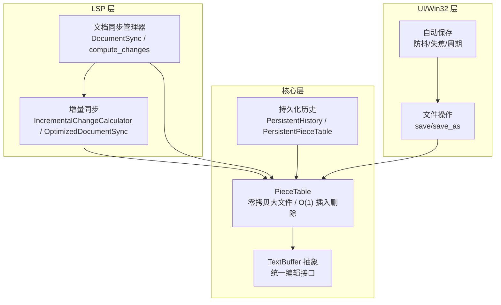
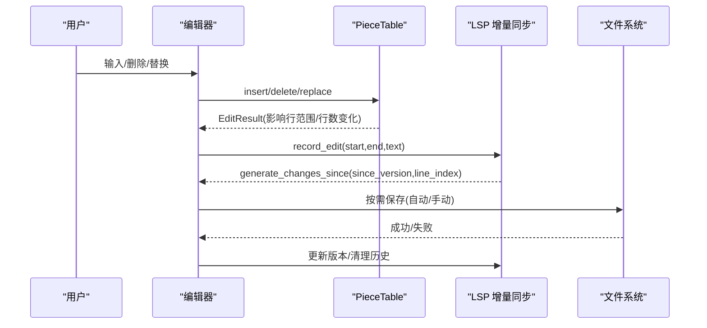
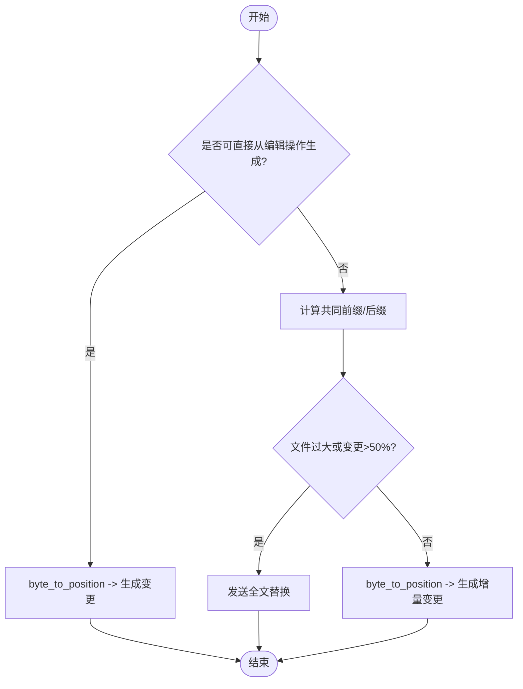
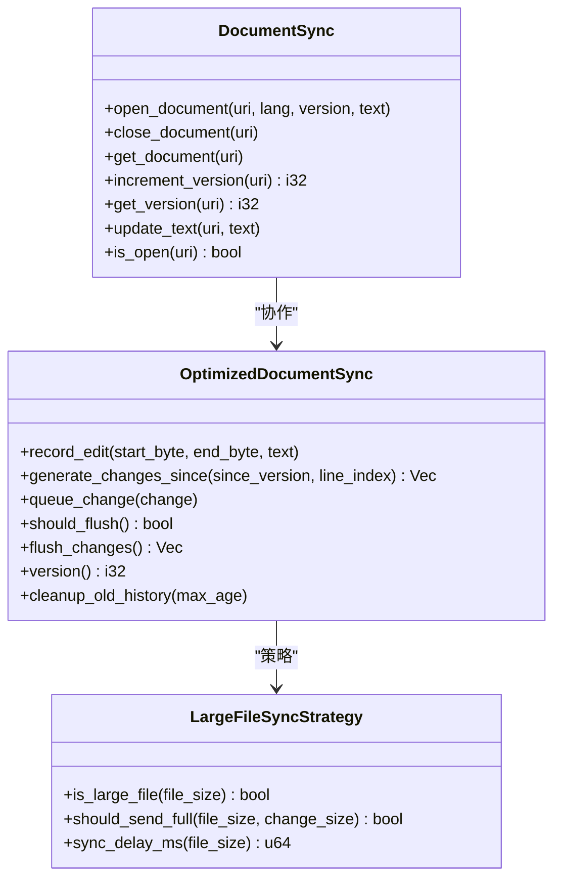
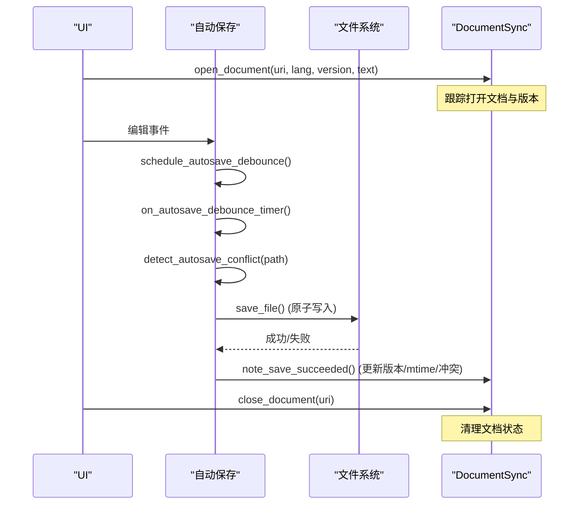
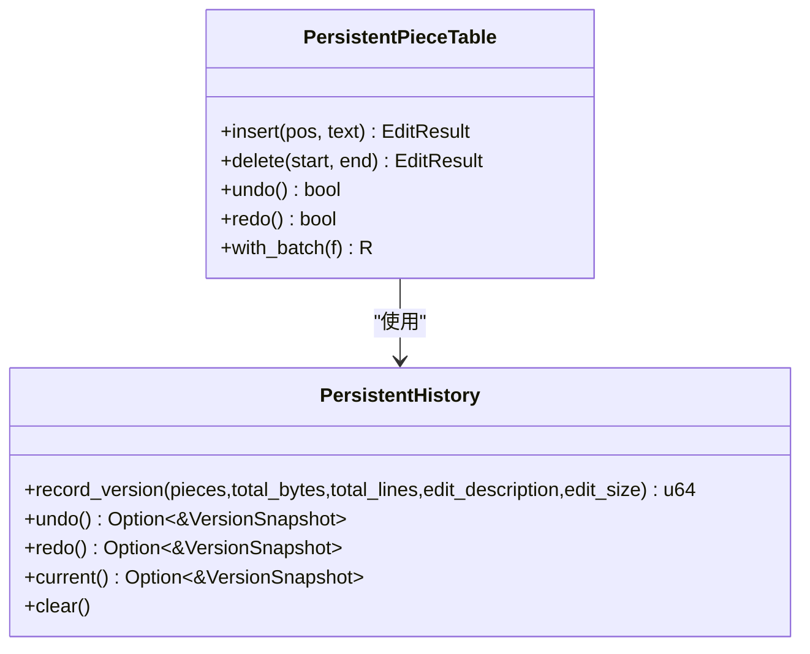
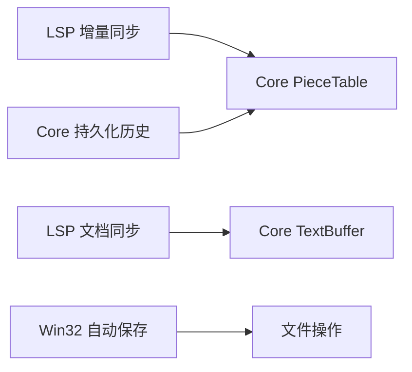

# 文档同步机制

<cite>
**本文引用的文件**
- [incremental_sync.rs](file://crates/aether-lsp/src/incremental_sync.rs)
- [sync.rs](file://crates/aether-lsp/src/sync.rs)
- [piece_table.rs](file://crates/aether-core/src/buffer/piece_table.rs)
- [text_buffer.rs](file://crates/aether-core/src/buffer/text_buffer.rs)
- [auto_save.rs](file://crates/aether-win32/src/auto_save.rs)
- [files.rs](file://crates/aether-win32/src/editor/files.rs)
- [persistent_history.rs](file://crates/aether-core/src/persistent_history.rs)
</cite>

## 目录
1. [简介](#简介)
2. [项目结构](#项目结构)
3. [核心组件](#核心组件)
4. [架构总览](#架构总览)
5. [详细组件分析](#详细组件分析)
6. [依赖关系分析](#依赖关系分析)
7. [性能考量](#性能考量)
8. [故障排查指南](#故障排查指南)
9. [结论](#结论)
10. [附录：配置与调试](#附录：配置与调试)

## 简介
本文件系统化阐述编辑器中的“文档同步机制”，覆盖增量同步算法、文本变更检测、版本管理、冲突解决策略，以及文档打开/关闭/保存时的同步流程。同时给出大文件处理优化、同步状态跟踪、回滚机制和性能优化技巧，并提供配置选项与调试方法。

## 项目结构
与文档同步相关的关键模块分布在以下 crate 中：
- LSP 增量同步与变更计算：aether-lsp
- 高性能文本缓冲区（PieceTable）与抽象接口：aether-core
- 自动保存与冲突检测：aether-win32
- 持久化历史与撤销重做：aether-core

图表来源
- [incremental_sync.rs:1-357](file://crates/aether-lsp/src/incremental_sync.rs#L1-L357)
- [sync.rs:1-148](file://crates/aether-lsp/src/sync.rs#L1-L148)
- [piece_table.rs:1-200](file://crates/aether-core/src/buffer/piece_table.rs#L1-L200)
- [text_buffer.rs:1-49](file://crates/aether-core/src/buffer/text_buffer.rs#L1-L49)
- [auto_save.rs:1-222](file://crates/aether-win32/src/auto_save.rs#L1-L222)
- [files.rs:294-329](file://crates/aether-win32/src/editor/files.rs#L294-L329)

章节来源
- [incremental_sync.rs:1-357](file://crates/aether-lsp/src/incremental_sync.rs#L1-L357)
- [sync.rs:1-148](file://crates/aether-lsp/src/sync.rs#L1-L148)
- [piece_table.rs:1-200](file://crates/aether-core/src/buffer/piece_table.rs#L1-L200)
- [text_buffer.rs:1-49](file://crates/aether-core/src/buffer/text_buffer.rs#L1-L49)
- [auto_save.rs:1-222](file://crates/aether-win32/src/auto_save.rs#L1-L222)
- [files.rs:294-329](file://crates/aether-win32/src/editor/files.rs#L294-L329)

## 核心组件
- 增量同步器（LSP）
  - IncrementalChangeCalculator：从编辑操作直接生成 LSP 增量变更，支持相邻编辑合并，减少消息数量。
  - OptimizedDocumentSync：维护编辑历史、版本号、待发送变更队列，支持批量刷新与大文件延迟策略。
  - FastLineIndex：高效行索引，提供字节偏移与 LSP Position 的互转（UTF-16 码元）。
- 文档同步管理器（LSP）
  - DocumentSync：跟踪已打开文档的状态、语言、版本与全文；compute_changes 基于共同前缀/后缀进行字符级 diff，并在大文件或大范围变更时回退为全文替换。
- 文本缓冲区（Core）
  - PieceTable：高性能文本缓冲区，内存映射原始文件实现零拷贝打开，O(1) 插入/删除，行索引分块优化，支持快照。
  - TextBuffer：统一编辑接口，屏蔽底层数据结构差异。
- 自动保存（Win32）
  - 组合触发：空闲防抖、失焦立即保存、周期兜底；内容去重、冲突检测、大文件降级。
- 持久化历史（Core）
  - PersistentHistory/PersistentPieceTable：基于 Arc 共享片段的高效撤销/重做，支持时间/大小合并与批量操作。

章节来源
- [incremental_sync.rs:1-357](file://crates/aether-lsp/src/incremental_sync.rs#L1-L357)
- [sync.rs:1-148](file://crates/aether-lsp/src/sync.rs#L1-L148)
- [piece_table.rs:1-200](file://crates/aether-core/src/buffer/piece_table.rs#L1-L200)
- [text_buffer.rs:1-49](file://crates/aether-core/src/buffer/text_buffer.rs#L1-L49)
- [auto_save.rs:1-222](file://crates/aether-win32/src/auto_save.rs#L1-L222)
- [persistent_history.rs:1-238](file://crates/aether-core/src/persistent_history.rs#L1-L238)

## 架构总览
下图展示从用户编辑到 LSP 增量同步与落盘的完整链路。

图表来源
- [incremental_sync.rs:229-305](file://crates/aether-lsp/src/incremental_sync.rs#L229-L305)
- [piece_table.rs:382-416](file://crates/aether-core/src/buffer/piece_table.rs#L382-L416)
- [auto_save.rs:139-178](file://crates/aether-win32/src/auto_save.rs#L139-L178)

## 详细组件分析

### 增量同步算法与文本变更检测
- 从编辑操作直接生成变更
  - 使用 FastLineIndex 将字节偏移转换为 LSP Position（UTF-16 码元），避免全文对比。
  - 支持相邻编辑合并，减少 LSP 消息数量。
- 基于共同前缀/后缀的字符级 diff
  - 当无法直接使用编辑操作时，compute_changes 通过前后缀匹配定位变更区间；若变更过大或文件过大则回退为全文替换。
- 行索引与位置转换
  - FastLineIndex 提供 O(log n) 行查找与 UTF-16 码元计数，确保 LSP 位置准确。

图表来源
- [incremental_sync.rs:9-80](file://crates/aether-lsp/src/incremental_sync.rs#L9-L80)
- [sync.rs:82-148](file://crates/aether-lsp/src/sync.rs#L82-L148)
- [incremental_sync.rs:132-190](file://crates/aether-lsp/src/incremental_sync.rs#L132-L190)

章节来源
- [incremental_sync.rs:9-80](file://crates/aether-lsp/src/incremental_sync.rs#L9-L80)
- [sync.rs:82-148](file://crates/aether-lsp/src/sync.rs#L82-L148)
- [incremental_sync.rs:132-190](file://crates/aether-lsp/src/incremental_sync.rs#L132-L190)

### 版本管理与同步状态跟踪
- 文档版本
  - DocumentSync 维护每个打开文档的版本号，open/close/increment_version/update_text 等接口保证版本一致性。
- 编辑历史与批量发送
  - OptimizedDocumentSync 记录编辑历史（带时间戳）、维护 pending_changes 队列，达到阈值后批量 flush。
  - 支持清理过期历史记录，控制内存占用。
- 大文件策略
  - LargeFileSyncStrategy 根据文件大小决定同步延迟与是否发送全文。

图表来源
- [sync.rs:6-71](file://crates/aether-lsp/src/sync.rs#L6-L71)
- [incremental_sync.rs:192-357](file://crates/aether-lsp/src/incremental_sync.rs#L192-L357)

章节来源
- [sync.rs:6-71](file://crates/aether-lsp/src/sync.rs#L6-L71)
- [incremental_sync.rs:192-357](file://crates/aether-lsp/src/incremental_sync.rs#L192-L357)

### 文档打开、关闭、保存时的同步流程
- 打开文档
  - DocumentSync.open_document 注册文档并初始化版本与文本；后续编辑通过 LSP 增量同步上报。
- 关闭文档
  - DocumentSync.close_document 移除文档状态，停止同步。
- 保存文档
  - 自动保存：防抖/失焦/周期三种触发；内容去重（buffer_version vs last_saved_buffer_version）、冲突检测（mtime）、大文件降级。
  - 手动保存：复用原子写入路径，成功后同步自动保存状态（重置冲突、刷新 mtime、停止防抖）。

图表来源
- [sync.rs:25-39](file://crates/aether-lsp/src/sync.rs#L25-L39)
- [auto_save.rs:64-178](file://crates/aether-win32/src/auto_save.rs#L64-L178)
- [files.rs:294-329](file://crates/aether-win32/src/editor/files.rs#L294-L329)

章节来源
- [sync.rs:25-39](file://crates/aether-lsp/src/sync.rs#L25-L39)
- [auto_save.rs:64-178](file://crates/aether-win32/src/auto_save.rs#L64-L178)
- [files.rs:294-329](file://crates/aether-win32/src/editor/files.rs#L294-L329)

### 大文件处理的优化方案
- 打开大文件
  - PieceTable.from_file 使用内存映射（Mmap）实现零拷贝打开，单次扫描构建行索引，避免双重遍历。
- 同步大文件
  - LargeFileSyncStrategy 对超过阈值的文件启用同步延迟，必要时发送全文替换。
  - compute_changes 在文件过大或变更范围过大时回退为全文替换，降低 diff 成本。
- 自动保存大文件
  - 大文件禁用周期保存，仅保留失焦与防抖；延长防抖延迟，避免 IO 卡顿。

章节来源
- [piece_table.rs:408-416](file://crates/aether-core/src/buffer/piece_table.rs#L408-L416)
- [incremental_sync.rs:307-357](file://crates/aether-lsp/src/incremental_sync.rs#L307-L357)
- [sync.rs:88-97](file://crates/aether-lsp/src/sync.rs#L88-L97)
- [auto_save.rs:47-62](file://crates/aether-win32/src/auto_save.rs#L47-L62)

### 回滚机制与版本快照
- 撤销/重做
  - PersistentHistory 使用 Arc<Vec<Piece>> 共享片段，内存开销低；支持时间/大小合并与批量操作。
  - PersistentPieceTable 封装 PieceTable，提供 insert/delete/undo/redo 与 with_batch 批量操作。
- 缓冲区状态
  - BufferState 轻量元数据快照，用于 Undo/Redo 的状态恢复。

图表来源
- [persistent_history.rs:29-238](file://crates/aether-core/src/persistent_history.rs#L29-L238)
- [persistent_history.rs:240-376](file://crates/aether-core/src/persistent_history.rs#L240-L376)

章节来源
- [persistent_history.rs:29-238](file://crates/aether-core/src/persistent_history.rs#L29-L238)
- [persistent_history.rs:240-376](file://crates/aether-core/src/persistent_history.rs#L240-L376)

## 依赖关系分析
- LSP 层依赖 Core 层的 PieceTable 与 TextBuffer 抽象，以获取高效的编辑与行索引能力。
- Win32 自动保存依赖 EditorState 的文件操作与设置，结合 LSP 同步状态进行冲突检测与去重。
- 持久化历史依赖 PieceTable 的片段列表与 add_buffer 追加特性，实现低成本版本快照。

图表来源
- [incremental_sync.rs:1-357](file://crates/aether-lsp/src/incremental_sync.rs#L1-L357)
- [sync.rs:1-148](file://crates/aether-lsp/src/sync.rs#L1-L148)
- [auto_save.rs:1-222](file://crates/aether-win32/src/auto_save.rs#L1-L222)
- [persistent_history.rs:1-238](file://crates/aether-core/src/persistent_history.rs#L1-L238)

章节来源
- [incremental_sync.rs:1-357](file://crates/aether-lsp/src/incremental_sync.rs#L1-L357)
- [sync.rs:1-148](file://crates/aether-lsp/src/sync.rs#L1-L148)
- [auto_save.rs:1-222](file://crates/aether-win32/src/auto_save.rs#L1-L222)
- [persistent_history.rs:1-238](file://crates/aether-core/src/persistent_history.rs#L1-L238)

## 性能考量
- 增量同步
  - 优先从编辑操作生成变更，避免全文对比；相邻编辑合并减少消息量。
  - 大文件或大范围变更时回退为全文替换，降低 diff 成本。
- 文本缓冲区
  - PieceTable 零拷贝打开大文件，O(1) 插入/删除；行索引分块优化，编辑时平移成本低。
- 自动保存
  - 内容去重避免无意义 IO；大文件降级减少周期保存；防抖与失焦保存平衡响应与安全性。
- 历史管理
  - Arc 共享片段，撤销/重做内存开销低；时间/大小合并减少历史条目。

[本节为通用性能讨论，不直接分析具体文件]

## 故障排查指南
- 同步异常
  - 检查 DocumentSync 版本是否正确递增；确认 open/close 成对调用。
  - 验证 FastLineIndex 的行索引与 UTF-16 码元转换是否正确。
- 自动保存失败
  - 查看状态栏提示（如外部修改冲突）；确认 mtime 检测逻辑与冲突标志。
  - 检查自动保存配置（开关、防抖延迟、周期间隔、大文件阈值）。
- 大文件卡顿
  - 确认是否启用了大文件降级（关闭周期保存、延长防抖）。
  - 评估是否应切换为全文替换策略。

章节来源
- [sync.rs:49-66](file://crates/aether-lsp/src/sync.rs#L49-L66)
- [incremental_sync.rs:132-190](file://crates/aether-lsp/src/incremental_sync.rs#L132-L190)
- [auto_save.rs:139-222](file://crates/aether-win32/src/auto_save.rs#L139-L222)

## 结论
该同步机制通过“编辑操作直出变更 + 共同前缀/后缀 diff”的双轨策略，在保证正确性的前提下最大化效率；配合 PieceTable 的高性能文本模型与自动保存的组合触发策略，实现了低延迟、高可靠、可配置的文档同步体验。大文件场景下的降级与回退策略进一步保障了稳定性。

[本节为总结性内容，不直接分析具体文件]

## 附录：配置与调试
- 自动保存配置
  - enabled：总开关
  - debounce_ms：空闲防抖延迟
  - focus_loss_save：失焦立即保存
  - periodic_save_ms：周期兜底间隔
  - large_file_threshold：大文件阈值
  - large_file_debounce_ms：大文件防抖延迟
- 调试建议
  - 观察状态栏消息（如“已自动保存”、“文件已被外部修改…”）。
  - 通过测试用例验证关键行为（如合并编辑、UTF-16 位置转换、历史合并与溢出）。
  - 针对大文件场景，调整阈值与延迟，监控 IO 与 UI 响应。

章节来源
- [auto_save.rs:224-269](file://crates/aether-win32/src/auto_save.rs#L224-L269)
- [incremental_sync.rs:359-743](file://crates/aether-lsp/src/incremental_sync.rs#L359-L743)
- [sync.rs:150-303](file://crates/aether-lsp/src/sync.rs#L150-L303)