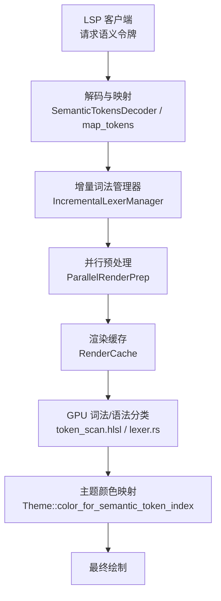
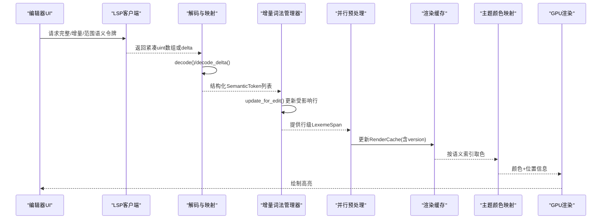
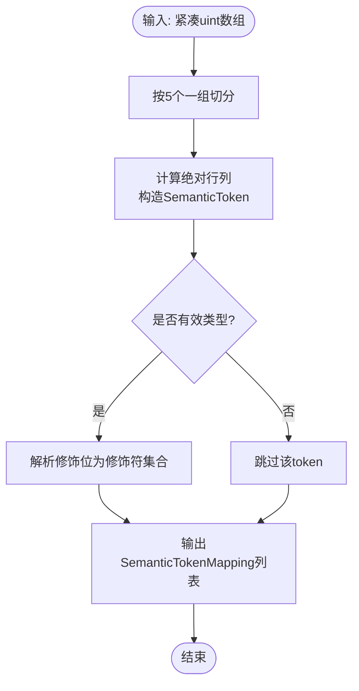
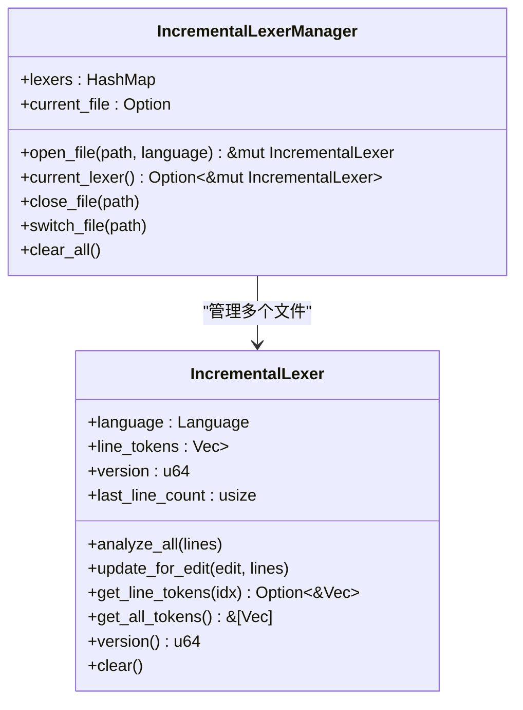
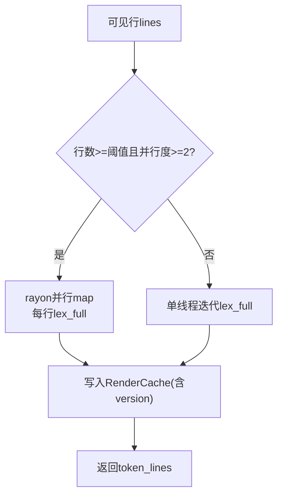
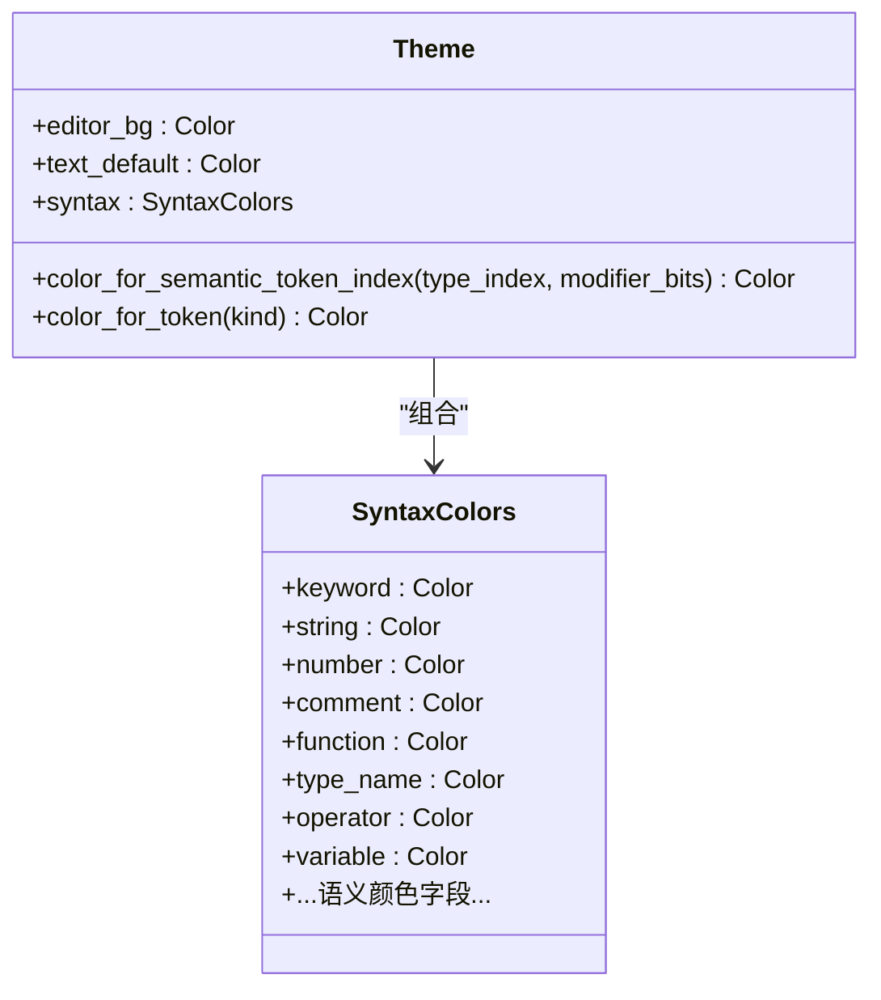
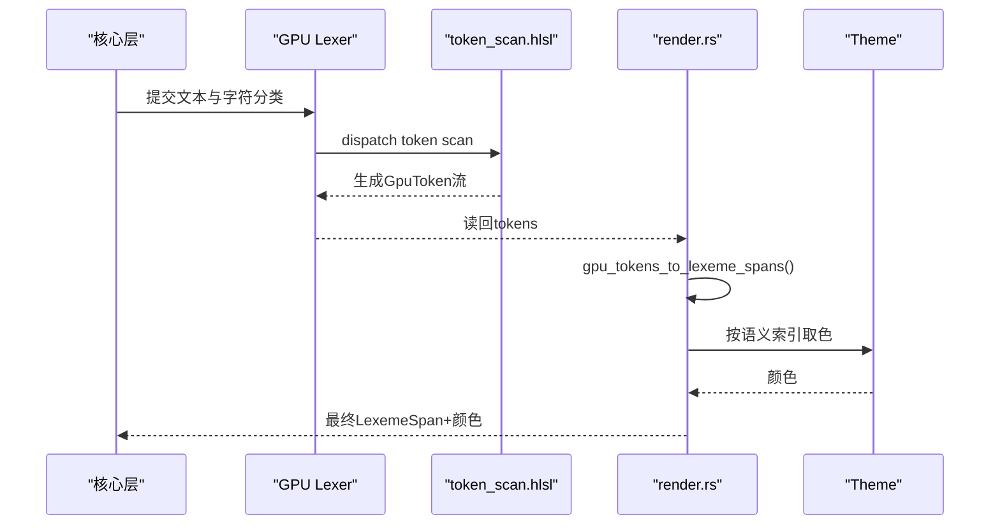
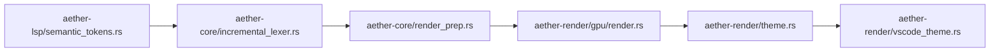

# 语义令牌处理

<cite>
**本文引用的文件**
- [semantic_tokens.rs](file://crates/aether-lsp/src/semantic_tokens.rs)
- [client.rs](file://crates/aether-lsp/src/client.rs)
- [incremental_lexer.rs](file://crates/aether-core/src/incremental_lexer.rs)
- [render_prep.rs](file://crates/aether-core/src/render_prep.rs)
- [theme.rs](file://crates/aether-render/src/theme.rs)
- [vscode_theme.rs](file://crates/aether-render/src/vscode_theme.rs)
- [render.rs](file://crates/aether-render/src/gpu/render.rs)
- [lexer.rs](file://crates/aether-render/src/gpu/lexer.rs)
- [token_scan.hlsl](file://crates/aether-render/src/gpu/shaders/token_scan.hlsl)
</cite>

## 目录
1. [简介](#简介)
2. [项目结构](#项目结构)
3. [核心组件](#核心组件)
4. [架构总览](#架构总览)
5. [详细组件分析](#详细组件分析)
6. [依赖关系分析](#依赖关系分析)
7. [性能考量](#性能考量)
8. [故障排查指南](#故障排查指南)
9. [结论](#结论)
10. [附录](#附录)

## 简介
本模块负责从 LSP 获取语义令牌、解析与映射、增量更新与缓存，并最终将语义信息应用到渲染管线中。文档覆盖以下关键点：
- 令牌的获取、解码与增量合并
- 令牌类型与修饰符的映射策略
- 渲染阶段的样式应用（主题与颜色）
- 批量处理与增量更新逻辑
- 自定义令牌类型的配置方法与调试建议

## 项目结构
语义令牌处理贯穿 LSP 客户端、核心词法与增量管理、以及渲染主题系统：
- LSP 层：负责请求完整/增量/范围语义令牌，解码紧凑数组为结构化 token，并映射到内部类型
- 核心层：提供增量词法分析器与并行预处理，维护行级 token 缓存与版本失效
- 渲染层：将语义令牌索引映射为主题颜色，结合 GPU 词法结果完成着色

图表来源
- [client.rs:469-537](file://crates/aether-lsp/src/client.rs#L469-L537)
- [semantic_tokens.rs:17-85](file://crates/aether-lsp/src/semantic_tokens.rs#L17-L85)
- [incremental_lexer.rs:18-129](file://crates/aether-core/src/incremental_lexer.rs#L18-L129)
- [render_prep.rs:13-67](file://crates/aether-core/src/render_prep.rs#L13-L67)
- [render.rs:7-32](file://crates/aether-render/src/gpu/render.rs#L7-L32)
- [theme.rs:213-244](file://crates/aether-render/src/theme.rs#L213-L244)

章节来源
- [client.rs:469-537](file://crates/aether-lsp/src/client.rs#L469-L537)
- [semantic_tokens.rs:17-85](file://crates/aether-lsp/src/semantic_tokens.rs#L17-L85)
- [incremental_lexer.rs:18-129](file://crates/aether-core/src/incremental_lexer.rs#L18-L129)
- [render_prep.rs:13-67](file://crates/aether-core/src/render_prep.rs#L13-L67)
- [render.rs:7-32](file://crates/aether-render/src/gpu/render.rs#L7-L32)
- [theme.rs:213-244](file://crates/aether-render/src/theme.rs#L213-L244)

## 核心组件
- 语义令牌解码与映射：将 LSP 返回的紧凑 uint 数组解码为结构化 token，并映射为内部类型与修饰符集合
- 增量词法管理器：按文件维护每行的 token 缓存，编辑时仅重算受影响行，支持多文件切换与缓存上限保护
- 并行预处理：对可见行进行并行 token 预处理，小数据量回退单线程，避免线程创建开销
- 渲染缓存：记录可见行文本与 token 列表及版本号，用于帧间复用
- 主题与颜色映射：根据语义令牌索引与修饰位选择对应颜色，支持 VS Code 主题加载

章节来源
- [semantic_tokens.rs:5-264](file://crates/aether-lsp/src/semantic_tokens.rs#L5-L264)
- [incremental_lexer.rs:8-129](file://crates/aether-core/src/incremental_lexer.rs#L8-L129)
- [render_prep.rs:5-67](file://crates/aether-core/src/render_prep.rs#L5-L67)
- [theme.rs:8-86](file://crates/aether-render/src/theme.rs#L8-L86)
- [vscode_theme.rs:10-176](file://crates/aether-render/src/vscode_theme.rs#L10-L176)

## 架构总览
语义令牌从 LSP 服务端到达后，经过解码、映射、增量更新与缓存，再在渲染阶段通过主题系统转换为具体颜色，最终由 GPU 管线完成绘制。

图表来源
- [client.rs:469-537](file://crates/aether-lsp/src/client.rs#L469-L537)
- [semantic_tokens.rs:17-85](file://crates/aether-lsp/src/semantic_tokens.rs#L17-L85)
- [incremental_lexer.rs:36-101](file://crates/aether-core/src/incremental_lexer.rs#L36-L101)
- [render_prep.rs:32-60](file://crates/aether-core/src/render_prep.rs#L32-L60)
- [theme.rs:213-244](file://crates/aether-render/src/theme.rs#L213-L244)

## 详细组件分析

### 语义令牌解码与映射
- 数据结构
  - SemanticToken：包含行列偏移、长度、类型索引与修饰位
  - SemanticTokenTypeKind：LSP标准22种类型枚举
  - SemanticTokenModifierKind：10位修饰符位集
  - SemanticTokenMapping：映射后的渲染可用结构
- 关键流程
  - decode：按5元组解码紧凑数组，维护当前行列指针
  - decode_delta：反向应用 edits，删除与插入新 token
  - map_tokens：将类型索引转为枚举，解析修饰位为修饰符集合

图表来源
- [semantic_tokens.rs:17-85](file://crates/aether-lsp/src/semantic_tokens.rs#L17-L85)
- [semantic_tokens.rs:88-264](file://crates/aether-lsp/src/semantic_tokens.rs#L88-L264)

章节来源
- [semantic_tokens.rs:5-264](file://crates/aether-lsp/src/semantic_tokens.rs#L5-L264)

### 增量词法管理与缓存
- 设计要点
  - 行级 token 缓存：Vec<Vec<LexemeSpan>>，O(1) 访问
  - 版本控制：每次编辑 version++，供上层失效判断
  - 编辑影响范围：起始行、结束行、范围内行、新增/删除导致的后续行偏移
  - 多文件管理：HashMap 缓存多个文件的 IncrementalLexer，限制最大数量防止无界增长
- 关键方法
  - analyze_all：首次全量分析
  - update_for_edit：增量更新受影响行
  - get_line_tokens/get_all_tokens：读取缓存
  - open_file/close_file/switch_file/clear_all：生命周期管理

图表来源
- [incremental_lexer.rs:8-129](file://crates/aether-core/src/incremental_lexer.rs#L8-L129)
- [incremental_lexer.rs:131-187](file://crates/aether-core/src/incremental_lexer.rs#L131-L187)

章节来源
- [incremental_lexer.rs:18-129](file://crates/aether-core/src/incremental_lexer.rs#L18-L129)
- [incremental_lexer.rs:131-187](file://crates/aether-core/src/incremental_lexer.rs#L131-L187)

### 并行预处理与渲染缓存
- ParallelRenderPrep
  - 自动检测并行度，行数较少时回退单线程
  - 使用 rayon 并行 map，每个线程独立创建 lexer 并处理分块
- RenderCache
  - 缓存可见行文本与 token 列表
  - 通过 start_line/end_line/version 判断有效性，避免重复计算

图表来源
- [render_prep.rs:13-67](file://crates/aether-core/src/render_prep.rs#L13-L67)
- [render_prep.rs:69-125](file://crates/aether-core/src/render_prep.rs#L69-L125)

章节来源
- [render_prep.rs:13-67](file://crates/aether-core/src/render_prep.rs#L13-L67)
- [render_prep.rs:69-125](file://crates/aether-core/src/render_prep.rs#L69-L125)

### 主题与样式应用
- Theme/SyntaxColors
  - 内置暗色与毛玻璃主题，提供丰富的语义令牌颜色字段
  - color_for_semantic_token_index：按 LSP 类型索引映射到颜色
  - color_for_token：通用 TokenKind 到颜色映射
- VS Code 主题加载
  - 从 JSON 解析 colors 与 tokenColors，映射到 SyntaxColors
  - 支持十六进制颜色解析（#RGB/#RRGGBB/#RRGGBBAA）

图表来源
- [theme.rs:8-86](file://crates/aether-render/src/theme.rs#L8-L86)
- [theme.rs:213-278](file://crates/aether-render/src/theme.rs#L213-L278)
- [vscode_theme.rs:10-176](file://crates/aether-render/src/vscode_theme.rs#L10-L176)

章节来源
- [theme.rs:8-86](file://crates/aether-render/src/theme.rs#L8-L86)
- [theme.rs:213-278](file://crates/aether-render/src/theme.rs#L213-L278)
- [vscode_theme.rs:10-176](file://crates/aether-render/src/vscode_theme.rs#L10-L176)

### GPU 词法与语法分类集成
- GPU 词法扫描：通过 compute shader 识别 token 边界与类型
- 转换与融合：将 GPU 生成的 token 转换为 LexemeSpan，并结合语法分类（confidence）决定最终 TokenKind
- 关键词查找：dispatch keyword lookup shader 以增强关键字识别

图表来源
- [lexer.rs:349-389](file://crates/aether-render/src/gpu/lexer.rs#L349-L389)
- [token_scan.hlsl:122-312](file://crates/aether-render/src/gpu/shaders/token_scan.hlsl#L122-L312)
- [render.rs:7-32](file://crates/aether-render/src/gpu/render.rs#L7-L32)
- [theme.rs:213-244](file://crates/aether-render/src/theme.rs#L213-L244)

章节来源
- [lexer.rs:349-389](file://crates/aether-render/src/gpu/lexer.rs#L349-L389)
- [token_scan.hlsl:122-312](file://crates/aether-render/src/gpu/shaders/token_scan.hlsl#L122-L312)
- [render.rs:7-32](file://crates/aether-render/src/gpu/render.rs#L7-L32)
- [theme.rs:213-244](file://crates/aether-render/src/theme.rs#L213-L244)

## 依赖关系分析
- LSP 客户端依赖 semantic_tokens 解码与映射
- 核心层依赖语言特定的 lexer 实现，提供行级 token 缓存与增量更新
- 渲染层依赖主题系统与 GPU 词法结果，完成最终着色
- 主题系统可被 VS Code 主题 JSON 驱动，扩展自定义颜色

图表来源
- [semantic_tokens.rs:17-85](file://crates/aether-lsp/src/semantic_tokens.rs#L17-L85)
- [incremental_lexer.rs:18-129](file://crates/aether-core/src/incremental_lexer.rs#L18-L129)
- [render_prep.rs:13-67](file://crates/aether-core/src/render_prep.rs#L13-L67)
- [render.rs:7-32](file://crates/aether-render/src/gpu/render.rs#L7-L32)
- [theme.rs:213-278](file://crates/aether-render/src/theme.rs#L213-L278)
- [vscode_theme.rs:10-176](file://crates/aether-render/src/vscode_theme.rs#L10-L176)

章节来源
- [semantic_tokens.rs:17-85](file://crates/aether-lsp/src/semantic_tokens.rs#L17-L85)
- [incremental_lexer.rs:18-129](file://crates/aether-core/src/incremental_lexer.rs#L18-L129)
- [render_prep.rs:13-67](file://crates/aether-core/src/render_prep.rs#L13-L67)
- [render.rs:7-32](file://crates/aether-render/src/gpu/render.rs#L7-L32)
- [theme.rs:213-278](file://crates/aether-render/src/theme.rs#L213-L278)
- [vscode_theme.rs:10-176](file://crates/aether-render/src/vscode_theme.rs#L10-L176)

## 性能考量
- 增量更新：仅重算受影响的行，避免全量重析；使用 Vec 连续内存布局提升缓存命中率
- 并行预处理：rayon 线程池复用，小数据量回退单线程，减少调度开销
- 渲染缓存：基于版本号的失效机制，避免每帧重复计算
- GPU 加速：compute shader 并行扫描 token 边界，降低 CPU 负担
- 主题解析：VS Code 主题 JSON 解析采用容错策略，非法颜色保持默认值

[本节为通用性能讨论，不直接分析具体文件]

## 故障排查指南
- 解码异常
  - 检查输入是否为完整的5元组，不完整片段会被忽略
  - 校验类型索引是否在 0..=21 范围内，超出将被丢弃
- 增量更新不一致
  - 确认 edit 的 start/delete_count 未越界，代码已做边界保护
  - 检查版本递增逻辑，确保上层缓存正确失效
- 主题颜色不生效
  - 验证语义索引与主题字段映射是否正确
  - 检查 VS Code 主题 JSON 的 scope 映射是否匹配预期
- GPU 词法结果异常
  - 检查 token_scan 的字符分类与边界判断逻辑
  - 确认 readback 的 token 数量与实际一致

章节来源
- [semantic_tokens.rs:270-415](file://crates/aether-lsp/src/semantic_tokens.rs#L270-L415)
- [incremental_lexer.rs:36-101](file://crates/aether-core/src/incremental_lexer.rs#L36-L101)
- [theme.rs:213-278](file://crates/aether-render/src/theme.rs#L213-L278)
- [lexer.rs:349-389](file://crates/aether-render/src/gpu/lexer.rs#L349-L389)

## 结论
本模块通过 LSP 语义令牌解码与映射、增量词法管理、并行预处理与渲染缓存、以及主题驱动的样式应用，实现了高效、可扩展的语义高亮流水线。其设计兼顾了性能与可维护性，支持 VS Code 主题扩展与 GPU 加速，适合大规模代码库的实时编辑场景。

[本节为总结性内容，不直接分析具体文件]

## 附录

### 令牌数据格式
- LSP 紧凑数组：每5个 uint 描述一个 token，顺序为 deltaLine、deltaStartChar、length、tokenType、tokenModifiers
- 解码后结构：SemanticToken(line, start_char, length, token_type, token_modifiers)
- 映射结果：SemanticTokenMapping(token_type, modifiers, line, start_char, length)

章节来源
- [semantic_tokens.rs:17-85](file://crates/aether-lsp/src/semantic_tokens.rs#L17-L85)
- [semantic_tokens.rs:211-264](file://crates/aether-lsp/src/semantic_tokens.rs#L211-L264)

### 批量处理与增量更新逻辑
- 批量处理：ParallelRenderPrep 对可见行并行 lex_full，返回 token_lines
- 增量更新：IncrementalLexer.update_for_edit 根据 EditResult 调整行数并只重算受影响行
- 版本控制：每次编辑 version++，RenderCache 通过 is_valid 判断是否复用

章节来源
- [render_prep.rs:32-60](file://crates/aether-core/src/render_prep.rs#L32-L60)
- [incremental_lexer.rs:36-101](file://crates/aether-core/src/incremental_lexer.rs#L36-L101)
- [render_prep.rs:96-125](file://crates/aether-core/src/render_prep.rs#L96-L125)

### 自定义令牌类型的配置方法
- 扩展主题颜色：在 SyntaxColors 中添加新字段，并在 Theme::color_for_semantic_token_index 中增加分支映射
- 加载 VS Code 主题：通过 Theme::from_vscode_json 或 from_vscode_json_str 解析 JSON，tokenColors 映射到 SyntaxColors
- 注意：新增类型需保证索引与 LSP 类型表一致，否则会被 fallback 到默认颜色

章节来源
- [theme.rs:213-244](file://crates/aether-render/src/theme.rs#L213-L244)
- [vscode_theme.rs:104-176](file://crates/aether-render/src/vscode_theme.rs#L104-L176)

### 调试工具使用指南
- 单元测试覆盖：semantic_tokens.rs、incremental_lexer.rs、render_prep.rs、theme.rs 均包含丰富测试用例，可用于验证解码、增量更新、并行处理与颜色映射
- 性能基准：gpu/benchmark.rs 提供词法分析性能对比报告，便于评估不同方案的性能差异
- 日志与断点：在 decode、update_for_edit、color_for_semantic_token_index 等关键路径设置断点，观察中间状态

章节来源
- [semantic_tokens.rs:266-557](file://crates/aether-lsp/src/semantic_tokens.rs#L266-L557)
- [incremental_lexer.rs:195-300](file://crates/aether-core/src/incremental_lexer.rs#L195-L300)
- [render_prep.rs:133-193](file://crates/aether-core/src/render_prep.rs#L133-L193)
- [theme.rs:287-486](file://crates/aether-render/src/theme.rs#L287-L486)
- [benchmark.rs:87-124](file://crates/aether-render/src/gpu/benchmark.rs#L87-L124)