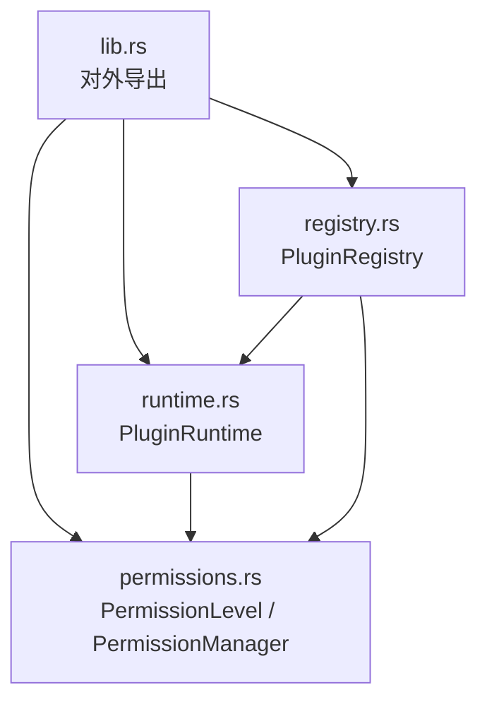
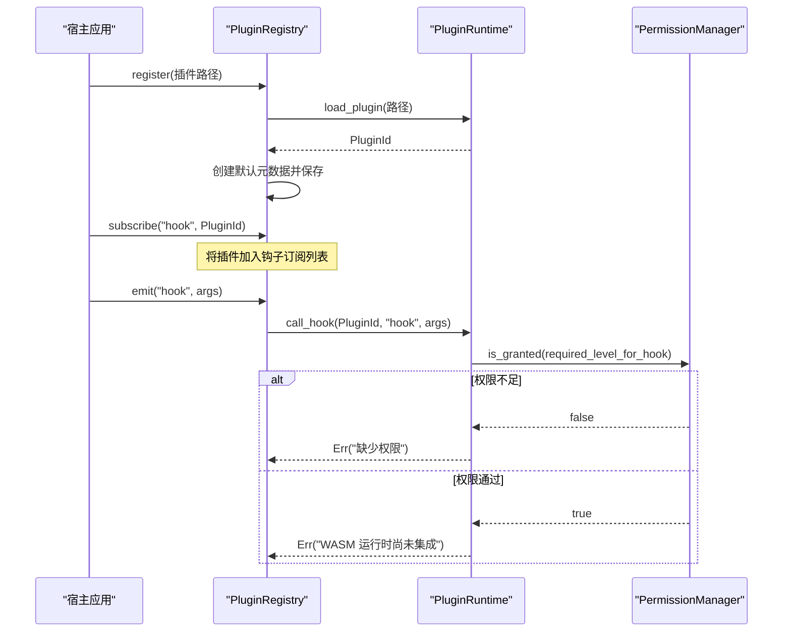
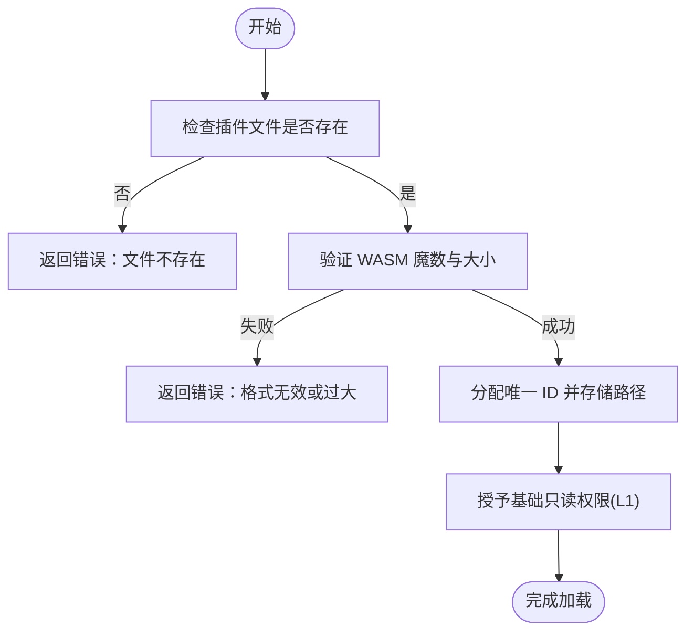
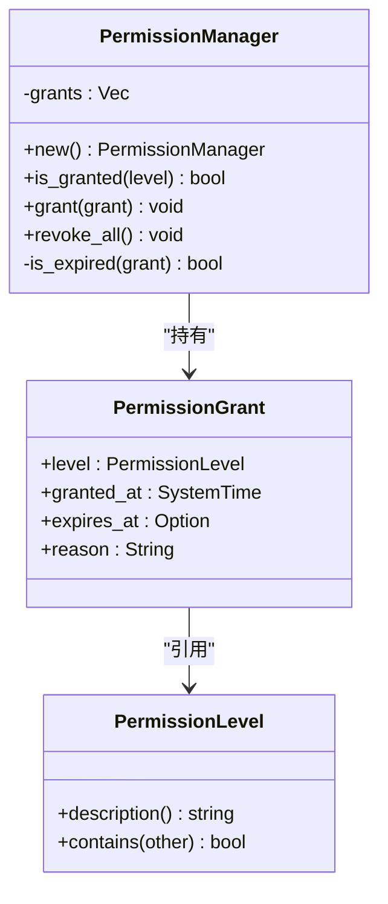
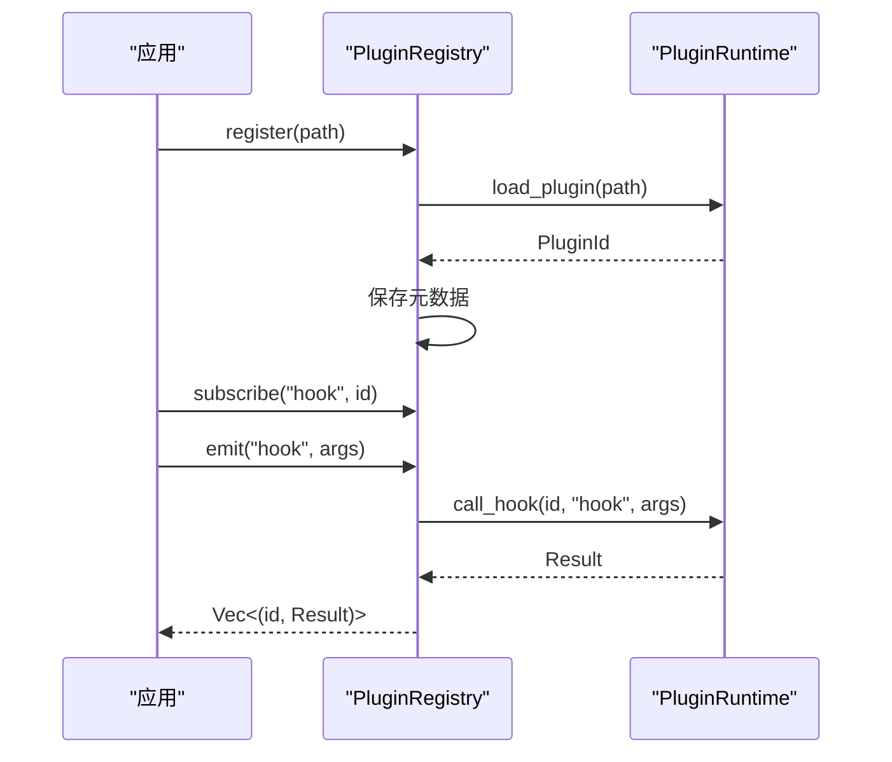
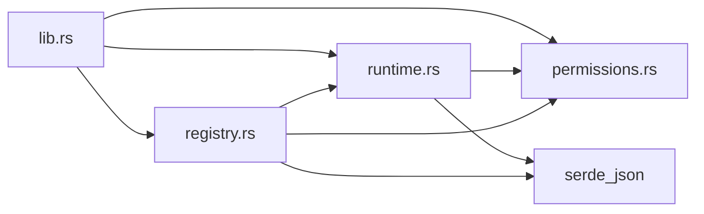

# aether-plugin 插件系统

<cite>
**本文引用的文件**
- [crates/aether-plugin/src/lib.rs](file://crates/aether-plugin/src/lib.rs)
- [crates/aether-plugin/src/runtime.rs](file://crates/aether-plugin/src/runtime.rs)
- [crates/aether-plugin/src/permissions.rs](file://crates/aether-plugin/src/permissions.rs)
- [crates/aether-plugin/src/registry.rs](file://crates/aether-plugin/src/registry.rs)
- [crates/aether-plugin/Cargo.toml](file://crates/aether-plugin/Cargo.toml)
- [crates/aether-win32/src/sandbox_eval.rs](file://crates/aether-win32/src/sandbox_eval.rs)
</cite>

## 目录
1. [简介](#简介)
2. [项目结构](#项目结构)
3. [核心组件](#核心组件)
4. [架构总览](#架构总览)
5. [详细组件分析](#详细组件分析)
6. [依赖关系分析](#依赖关系分析)
7. [性能与安全考量](#性能与安全考量)
8. [故障排查指南](#故障排查指南)
9. [结论](#结论)
10. [附录：插件开发指南](#附录：插件开发指南)

## 简介
本仓库中的 aether-plugin 子系统为“牧羊人编辑器”提供可扩展的插件能力。当前实现聚焦于：
- WASM 插件运行时（占位架构，预留 wasmtime 集成点）
- 基于 L1-L4 的权限控制系统与细粒度授权
- 插件注册表与生命周期管理（加载、卸载、事件订阅与分发）
- 沙箱化执行策略（通过权限与钩子映射限制插件能力）
- 面向未来的 API 暴露与事件订阅机制设计

该子系统以最小依赖实现安全边界和扩展点，便于后续接入真实 WASM 引擎并开放稳定的插件 API。

## 项目结构
aether-plugin 位于 crates/aether-plugin，采用模块化的 Rust crate 组织：
- lib.rs：对外导出公共类型与模块入口
- runtime.rs：插件运行时（PluginRuntime），负责插件加载、权限校验、钩子调用
- permissions.rs：权限级别与权限管理器（PermissionLevel、PermissionManager）
- registry.rs：插件注册表（PluginRegistry），统一管理插件元数据、订阅与事件分发

图表来源
- [crates/aether-plugin/src/lib.rs:1-8](file://crates/aether-plugin/src/lib.rs#L1-L8)
- [crates/aether-plugin/src/runtime.rs:1-21](file://crates/aether-plugin/src/runtime.rs#L1-L21)
- [crates/aether-plugin/src/permissions.rs:1-60](file://crates/aether-plugin/src/permissions.rs#L1-L60)
- [crates/aether-plugin/src/registry.rs:1-23](file://crates/aether-plugin/src/registry.rs#L1-L23)

章节来源
- [crates/aether-plugin/src/lib.rs:1-8](file://crates/aether-plugin/src/lib.rs#L1-L8)
- [crates/aether-plugin/Cargo.toml:1-9](file://crates/aether-plugin/Cargo.toml#L1-L9)

## 核心组件
- PluginId：唯一标识每个已加载插件
- PluginRuntime：WASM 插件运行时（当前为架构占位），负责：
  - 验证 WASM 魔数与大小限制
  - 分配 ID、维护插件路径映射
  - 授予/撤销权限
  - 根据钩子名称判定所需权限级别并检查
  - 调用插件生命周期钩子（当前返回未集成错误，等待 wasmtime 集成）
- PermissionLevel：四级权限模型（只读 UI、文件 IO、网络访问、系统命令）
- PermissionManager：记录授权条目，支持过期时间、包含关系判断
- PluginRegistry：插件注册表，封装生命周期与事件分发：
  - register/unregister：注册与卸载插件
  - subscribe/emit：订阅与触发钩子
  - list_plugins/plugin_count：查询插件信息

章节来源
- [crates/aether-plugin/src/runtime.rs:9-181](file://crates/aether-plugin/src/runtime.rs#L9-L181)
- [crates/aether-plugin/src/permissions.rs:1-94](file://crates/aether-plugin/src/permissions.rs#L1-L94)
- [crates/aether-plugin/src/registry.rs:6-102](file://crates/aether-plugin/src/registry.rs#L6-L102)

## 架构总览
下图展示了插件从注册到事件触发的整体流程，以及权限控制如何贯穿其中。

图表来源
- [crates/aether-plugin/src/registry.rs:34-91](file://crates/aether-plugin/src/registry.rs#L34-L91)
- [crates/aether-plugin/src/runtime.rs:59-157](file://crates/aether-plugin/src/runtime.rs#L59-L157)
- [crates/aether-plugin/src/permissions.rs:67-94](file://crates/aether-plugin/src/permissions.rs#L67-L94)

## 详细组件分析

### 运行时（PluginRuntime）
- 插件加载流程：
  - 检查文件存在性
  - 验证 WASM 魔数与文件大小上限（50MB）
  - 分配递增 ID，避免溢出
  - 为新插件授予基础只读权限（L1_ReadOnly）
- 权限控制：
  - grant_permission：支持设置过期时间，拒绝过去时间
  - revoke_all_permissions：清空所有授权
- 钩子调用：
  - required_permission_for_hook：按钩子名映射到 L1-L4 权限级别
  - call_hook：先进行权限检查，再通过时返回“未集成”错误（待 wasmtime 接入）

图表来源
- [crates/aether-plugin/src/runtime.rs:33-87](file://crates/aether-plugin/src/runtime.rs#L33-L87)

章节来源
- [crates/aether-plugin/src/runtime.rs:23-181](file://crates/aether-plugin/src/runtime.rs#L23-L181)

### 权限系统（PermissionLevel / PermissionManager）
- 权限级别：
  - L1_ReadOnly：只读 UI 访问
  - L2_FileIO：文件读写
  - L3_Network：网络访问
  - L4_System：系统命令执行
- 包含关系：
  - L4 包含所有权限；L3 包含 L3/L2/L1；L2 包含 L2/L1；L1 仅包含自身
- 授权记录：
  - 记录授予时间、可选过期时间、原因
  - 过期检查：若 expires_at 为 Some，则比较当前时间与 granted_at/expires_at
- 管理器方法：
  - is_granted：任一有效授权满足需求即通过
  - grant/revoke_all：添加或清空授权

图表来源
- [crates/aether-plugin/src/permissions.rs:1-94](file://crates/aether-plugin/src/permissions.rs#L1-L94)

章节来源
- [crates/aether-plugin/src/permissions.rs:1-94](file://crates/aether-plugin/src/permissions.rs#L1-L94)

### 注册表（PluginRegistry）
- 插件元数据：
  - id、name、version、description、author、permissions
- 生命周期：
  - register：加载插件并创建默认元数据
  - unregister：卸载插件并从所有钩子中移除
- 事件系统：
  - subscribe：将插件订阅到指定钩子
  - emit：遍历订阅者，调用运行时钩子并收集结果

图表来源
- [crates/aether-plugin/src/registry.rs:34-91](file://crates/aether-plugin/src/registry.rs#L34-L91)
- [crates/aether-plugin/src/runtime.rs:127-157](file://crates/aether-plugin/src/runtime.rs#L127-L157)

章节来源
- [crates/aether-plugin/src/registry.rs:6-102](file://crates/aether-plugin/src/registry.rs#L6-L102)

### 沙箱机制与安全隔离
- 资源限制：
  - 插件文件最大 50MB，防止恶意大文件
  - WASM 魔数校验，确保二进制格式正确
- 权限隔离：
  - 新插件默认仅拥有 L1_ReadOnly 权限
  - 不同钩子需要不同权限级别，未知钩子默认要求 L1（最安全）
  - 支持临时授权与过期控制，避免永久高权限
- 执行隔离：
  - 当前 call_hook 在权限通过后返回“未集成”错误，避免误判执行成功
  - 未来接入 wasmtime 后，将在独立沙箱中执行插件代码，进一步隔离文件系统、网络、进程等

章节来源
- [crates/aether-plugin/src/runtime.rs:6-87](file://crates/aether-plugin/src/runtime.rs#L6-L87)
- [crates/aether-plugin/src/runtime.rs:159-175](file://crates/aether-plugin/src/runtime.rs#L159-L175)
- [crates/aether-plugin/src/runtime.rs:127-157](file://crates/aether-plugin/src/runtime.rs#L127-L157)

## 依赖关系分析
- 内部依赖：
  - runtime 依赖 permissions
  - registry 依赖 runtime 与 permissions
  - lib 统一导出公共接口
- 外部依赖：
  - serde、serde_json：用于序列化参数与返回值

图表来源
- [crates/aether-plugin/src/lib.rs:1-8](file://crates/aether-plugin/src/lib.rs#L1-L8)
- [crates/aether-plugin/Cargo.toml:6-9](file://crates/aether-plugin/Cargo.toml#L6-L9)

章节来源
- [crates/aether-plugin/Cargo.toml:1-9](file://crates/aether-plugin/Cargo.toml#L1-L9)

## 性能与安全考量
- 性能：
  - 插件数量跟踪使用 HashMap，O(1) 查找与插入
  - 权限检查遍历授权列表，建议对高频钩子进行缓存优化
  - 插件文件读取仅在加载时进行，避免重复 I/O
- 安全：
  - 严格的大小与格式校验，防止恶意载荷
  - 权限最小化原则：默认低权限，按需提升
  - 过期时间校验，避免“已过期但永久有效”的漏洞
  - 未知钩子默认要求最低权限，降低风险面

[本节为通用指导，不直接分析具体文件]

## 故障排查指南
- 常见错误及处理：
  - 插件文件不存在：检查路径是否正确
  - WASM 格式无效：确认编译产物是否为合法 WASM
  - 插件文件过大：压缩或拆分功能，控制在 50MB 以内
  - 权限不足：为插件授予相应权限级别（如 L2_FileIO）
  - 钩子未集成：当前阶段需等待 wasmtime 集成，属预期行为
- 调试建议：
  - 使用 emit 返回的结果数组定位具体插件的错误
  - 打印权限授予日志，确认授权是否生效
  - 逐步缩小钩子范围，定位问题钩子

章节来源
- [crates/aether-plugin/src/runtime.rs:59-157](file://crates/aether-plugin/src/runtime.rs#L59-L157)
- [crates/aether-plugin/src/registry.rs:75-91](file://crates/aether-plugin/src/registry.rs#L75-L91)

## 结论
aether-plugin 子系统在当前阶段提供了完整的权限模型、插件生命周期管理与事件分发框架，并通过严格的输入校验与权限控制保障安全性。未来接入 wasmtime 后，将实现真正的 WASM 沙箱执行，形成完整的安全隔离体系。该设计为插件生态奠定了坚实基础，便于后续扩展更多 API 与能力。

[本节为总结性内容，不直接分析具体文件]

## 附录：插件开发指南

### 开发环境搭建
- 工具链：Rust 工具链（参考 rust-toolchain.toml）
- 构建：cargo build（当前 crate 无 wasmtime 依赖，可直接构建）
- 插件产物：WASM 二进制文件（需符合 WASM 魔数规范）

### API 参考
- 插件运行时：
  - load_plugin：加载插件并返回 PluginId
  - grant_permission：授予权限（可设置过期时间）
  - revoke_all_permissions：撤销所有权限
  - call_hook：调用插件钩子（当前返回未集成错误）
- 注册表：
  - register：注册插件并创建元数据
  - unregister：卸载插件
  - subscribe：订阅钩子
  - emit：触发钩子并收集结果
- 权限：
  - PermissionLevel：L1_ReadOnly、L2_FileIO、L3_Network、L4_System
  - PermissionManager：is_granted、grant、revoke_all

### 示例插件实现
由于当前为架构占位，示例插件需遵循以下约定：
- 插件文件为合法 WASM 二进制
- 插件需提供标准钩子函数（如 on_activate、on_save、fetch 等）
- 宿主通过 registry.emit 触发钩子，插件在沙箱中执行

注意：实际钩子调用需在集成 wasmtime 后实现。

章节来源
- [crates/aether-plugin/src/runtime.rs:59-181](file://crates/aether-plugin/src/runtime.rs#L59-L181)
- [crates/aether-plugin/src/registry.rs:34-102](file://crates/aether-plugin/src/registry.rs#L34-L102)
- [crates/aether-plugin/src/permissions.rs:1-94](file://crates/aether-plugin/src/permissions.rs#L1-L94)