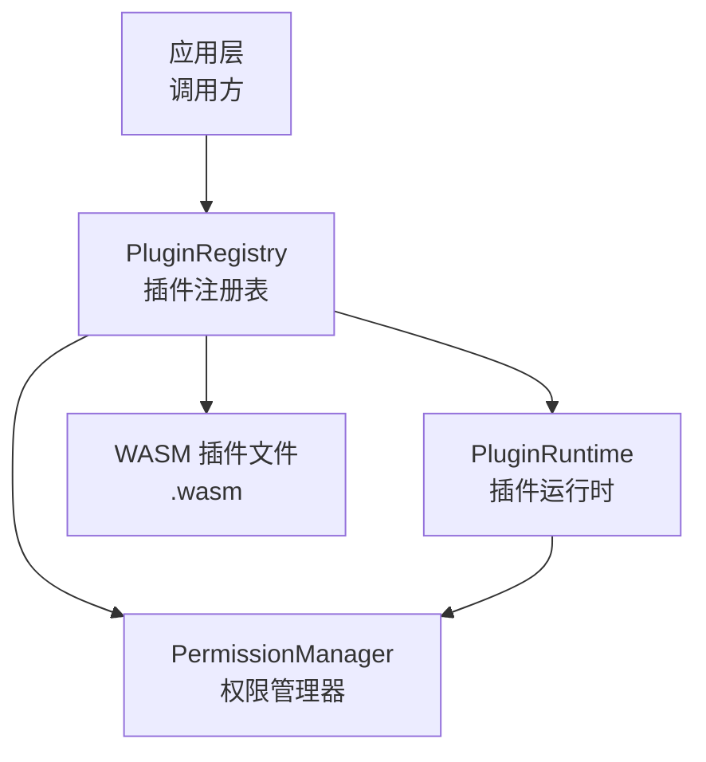
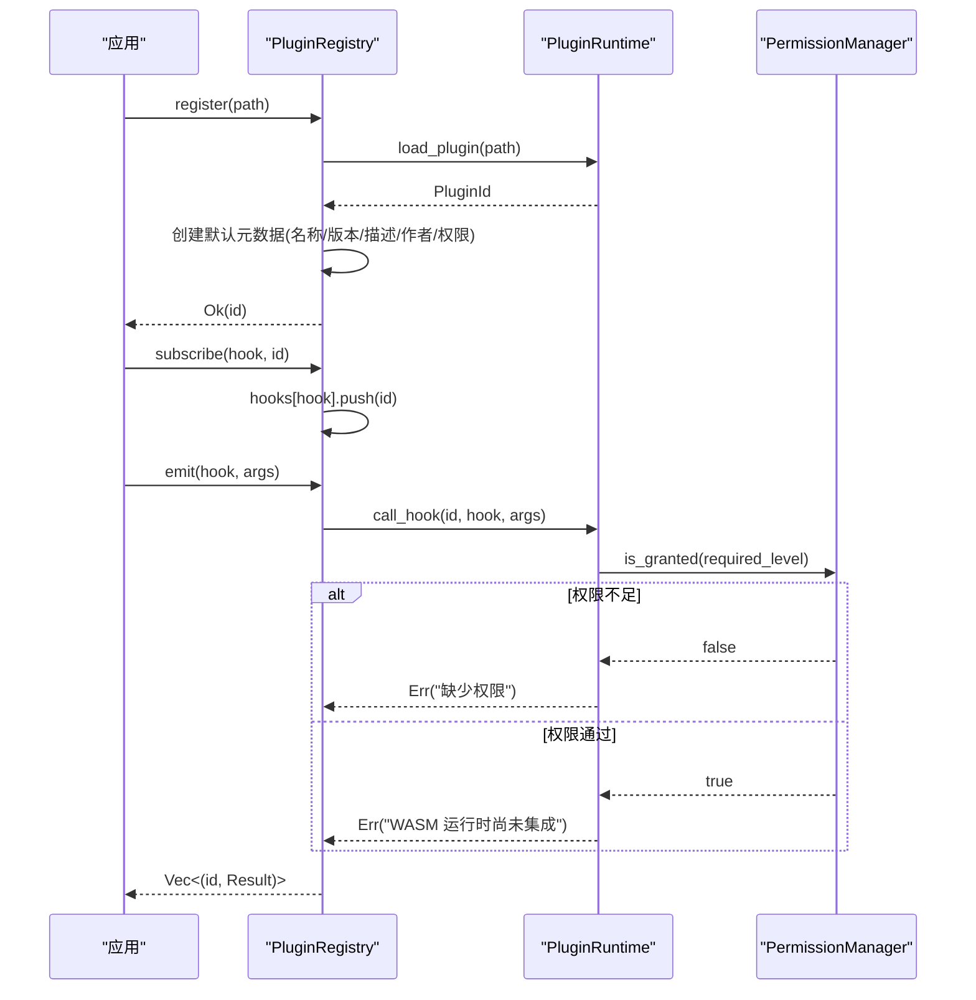
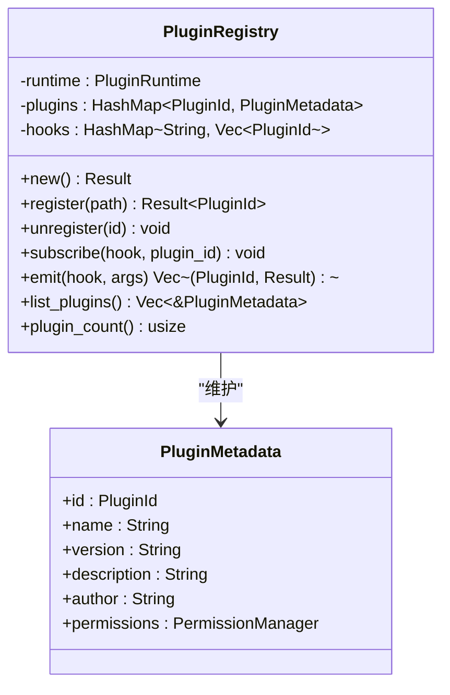
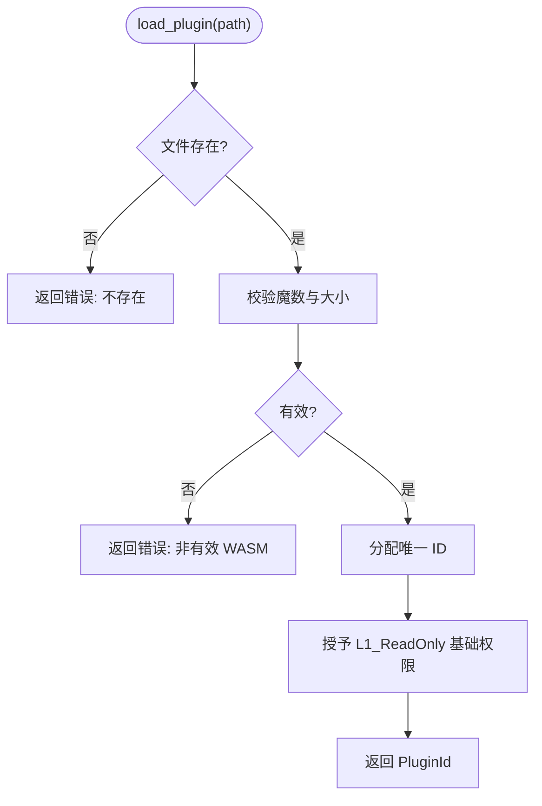
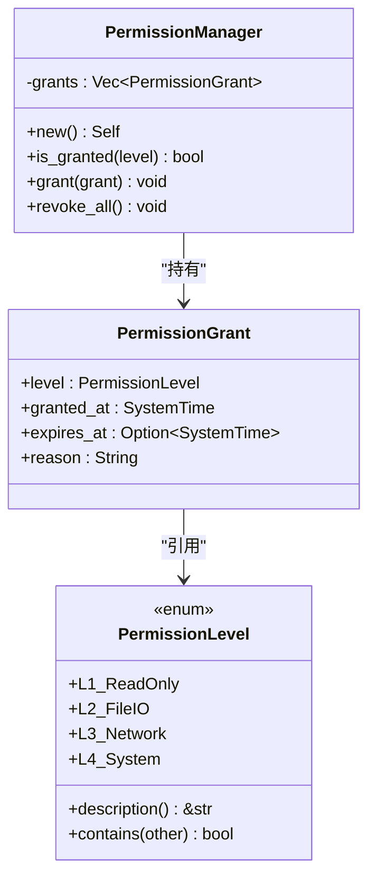
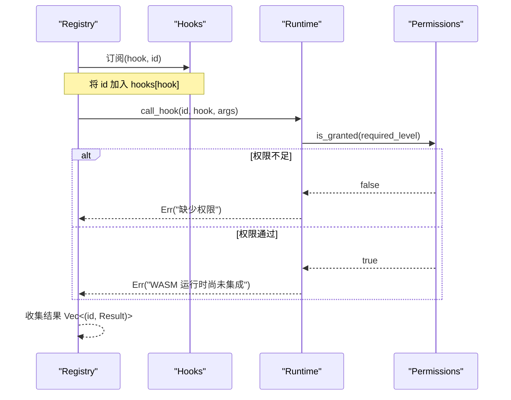
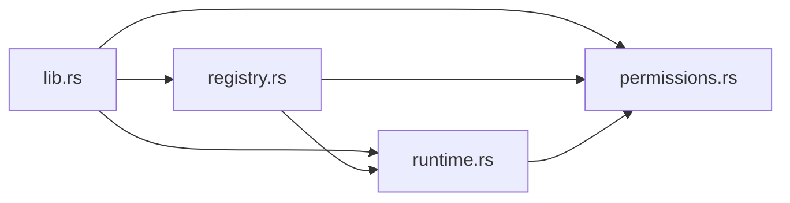

# 插件注册表

<cite>
**本文引用的文件**
- [crates/aether-plugin/src/lib.rs](file://crates/aether-plugin/src/lib.rs)
- [crates/aether-plugin/src/registry.rs](file://crates/aether-plugin/src/registry.rs)
- [crates/aether-plugin/src/runtime.rs](file://crates/aether-plugin/src/runtime.rs)
- [crates/aether-plugin/src/permissions.rs](file://crates/aether-plugin/src/permissions.rs)
- [crates/aether-plugin/Cargo.toml](file://crates/aether-plugin/Cargo.toml)
- [README.md](file://README.md)
</cite>

## 目录
1. [简介](#简介)
2. [项目结构](#项目结构)
3. [核心组件](#核心组件)
4. [架构总览](#架构总览)
5. [详细组件分析](#详细组件分析)
6. [依赖关系分析](#依赖关系分析)
7. [性能考量](#性能考量)
8. [故障排查指南](#故障排查指南)
9. [结论](#结论)
10. [附录：插件开发与扩展指南](#附录：插件开发与扩展指南)

## 简介
本文件围绕 aether-plugin 模块，系统化阐述插件注册表的设计与实现，覆盖插件发现、注册、版本管理、权限控制、钩子事件分发、生命周期管理与状态管理等关键主题。当前实现为“运行时占位”，即已完成权限模型、注册表与事件分发骨架，以及 WASM 插件加载前的校验流程；实际的 WASM 函数调用尚未集成（需要 wasmtime）。文档同时提供面向插件开发者的实践建议与注册表扩展方法。

## 项目结构
aether-plugin 是一个独立的 Rust crate，对外暴露三个主要能力：
- 插件注册表：负责插件的注册、卸载、列表查询与事件分发
- 插件运行时：负责插件加载、权限授予与钩子调用入口
- 权限系统：定义权限级别、授权记录与检查逻辑

图表来源
- [crates/aether-plugin/src/registry.rs:19-31](file://crates/aether-plugin/src/registry.rs#L19-L31)
- [crates/aether-plugin/src/runtime.rs:16-21](file://crates/aether-plugin/src/runtime.rs#L16-L21)
- [crates/aether-plugin/src/permissions.rs:57-60](file://crates/aether-plugin/src/permissions.rs#L57-L60)

章节来源
- [crates/aether-plugin/src/lib.rs:1-8](file://crates/aether-plugin/src/lib.rs#L1-L8)
- [crates/aether-plugin/Cargo.toml:1-9](file://crates/aether-plugin/Cargo.toml#L1-L9)
- [README.md:162-179](file://README.md#L162-L179)

## 核心组件
- PluginMetadata：已加载插件的元数据，包含 id、name、version、description、author、permissions
- PluginRegistry：插件注册表，维护 runtime、plugins、hooks，并提供 register/unregister/subscribe/emit/list_plugins/plugin_count 等接口
- PluginRuntime：插件运行时，负责 WASM 文件校验、ID 分配、权限授予、钩子调用入口（当前为占位）
- PermissionLevel / PermissionGrant / PermissionManager：权限级别、授权记录与权限管理器，支持层级包含、过期时间、撤销全部权限

章节来源
- [crates/aether-plugin/src/registry.rs:6-23](file://crates/aether-plugin/src/registry.rs#L6-L23)
- [crates/aether-plugin/src/runtime.rs:9-21](file://crates/aether-plugin/src/runtime.rs#L9-L21)
- [crates/aether-plugin/src/permissions.rs:1-13](file://crates/aether-plugin/src/permissions.rs#L1-L13)
- [crates/aether-plugin/src/permissions.rs:47-60](file://crates/aether-plugin/src/permissions.rs#L47-L60)

## 架构总览
插件注册表采用“注册表 + 运行时 + 权限”三层解耦设计：
- 注册表负责业务编排：加载插件、维护元数据、订阅钩子、触发事件
- 运行时负责安全边界：校验 WASM 格式与大小、分配唯一 ID、按钩子类型判定所需权限并检查
- 权限系统负责策略执行：基于 L1-L4 的层级权限模型，支持有效期与撤销

图表来源
- [crates/aether-plugin/src/registry.rs:34-91](file://crates/aether-plugin/src/registry.rs#L34-L91)
- [crates/aether-plugin/src/runtime.rs:60-157](file://crates/aether-plugin/src/runtime.rs#L60-L157)
- [crates/aether-plugin/src/permissions.rs:67-72](file://crates/aether-plugin/src/permissions.rs#L67-L72)

## 详细组件分析

### 插件注册表（PluginRegistry）
职责
- 初始化运行时与数据结构
- 注册插件：调用运行时加载，构建默认元数据，加入插件集合
- 卸载插件：从运行时卸载，清理插件集合与钩子订阅
- 订阅钩子：将插件 ID 加入指定钩子的订阅列表
- 触发钩子：遍历订阅者，调用运行时钩子，收集结果
- 查询：列出插件元数据、统计数量

关键点
- 默认元数据中 version 固定为字符串常量，便于后续扩展为从插件清单读取
- 钩子订阅使用 HashMap<String, Vec<PluginId>>，允许多个插件订阅同一钩子
- 触发钩子时返回每个插件的执行结果，便于上层统一处理错误与日志

图表来源
- [crates/aether-plugin/src/registry.rs:6-23](file://crates/aether-plugin/src/registry.rs#L6-L23)
- [crates/aether-plugin/src/registry.rs:25-102](file://crates/aether-plugin/src/registry.rs#L25-L102)

章节来源
- [crates/aether-plugin/src/registry.rs:25-102](file://crates/aether-plugin/src/registry.rs#L25-L102)

### 插件运行时（PluginRuntime）
职责
- 验证 WASM 文件魔数与大小限制
- 分配唯一 PluginId，记录插件路径
- 为新插件授予基础只读权限（L1_ReadOnly）
- 根据钩子名称映射到所需权限级别并检查
- 调用钩子入口（当前为占位，返回“未集成”错误）

关键点
- 最大插件文件大小限制，防止资源耗尽
- 权限映射规则：只读 UI、文件 IO、网络访问、系统命令分别对应 L1-L4
- 未知钩子默认要求 L1，遵循最小权限原则

图表来源
- [crates/aether-plugin/src/runtime.rs:33-87](file://crates/aether-plugin/src/runtime.rs#L33-L87)

章节来源
- [crates/aether-plugin/src/runtime.rs:33-181](file://crates/aether-plugin/src/runtime.rs#L33-L181)

### 权限系统（PermissionLevel / PermissionManager）
职责
- 定义 L1-L4 四级权限及其包含关系
- 维护授权记录（含授予时间、过期时间、原因）
- 检查是否已授予某权限（考虑过期）
- 支持撤销全部权限

关键点
- contains 使用显式匹配避免枚举变体重排导致静默破坏
- 过期判断同时检查 granted_at 与 expires_at，防止未来授予或过去过期
- 高权限包含低权限（如 L4 包含所有），符合最小权限与渐进授权原则

图表来源
- [crates/aether-plugin/src/permissions.rs:1-13](file://crates/aether-plugin/src/permissions.rs#L1-L13)
- [crates/aether-plugin/src/permissions.rs:47-60](file://crates/aether-plugin/src/permissions.rs#L47-L60)
- [crates/aether-plugin/src/permissions.rs:62-94](file://crates/aether-plugin/src/permissions.rs#L62-L94)

章节来源
- [crates/aether-plugin/src/permissions.rs:1-94](file://crates/aether-plugin/src/permissions.rs#L1-L94)

### 钩子与事件分发
- 订阅：通过 registry.subscribe(hook, plugin_id) 将插件加入钩子订阅列表
- 触发：registry.emit(hook, args) 遍历订阅者，调用 runtime.call_hook，收集结果
- 权限：call_hook 内部依据钩子名确定所需权限级别并进行检查
- 当前行为：权限通过后返回“WASM 运行时尚未集成”的错误，避免误判成功

图表来源
- [crates/aether-plugin/src/registry.rs:67-91](file://crates/aether-plugin/src/registry.rs#L67-L91)
- [crates/aether-plugin/src/runtime.rs:127-175](file://crates/aether-plugin/src/runtime.rs#L127-L175)
- [crates/aether-plugin/src/permissions.rs:67-72](file://crates/aether-plugin/src/permissions.rs#L67-L72)

章节来源
- [crates/aether-plugin/src/registry.rs:67-91](file://crates/aether-plugin/src/registry.rs#L67-L91)
- [crates/aether-plugin/src/runtime.rs:127-175](file://crates/aether-plugin/src/runtime.rs#L127-L175)

## 依赖关系分析
- 模块内依赖
  - registry 依赖 runtime 与 permissions
  - runtime 依赖 permissions
  - lib 仅做 re-export，不引入额外依赖
- 外部依赖
  - serde、serde_json：用于序列化/反序列化钩子参数与返回值
- 耦合与内聚
  - 注册表与运行时职责清晰，耦合度低；权限系统独立且可复用
  - 钩子与权限强相关，但通过运行时抽象屏蔽了具体实现细节

图表来源
- [crates/aether-plugin/src/lib.rs:1-8](file://crates/aether-plugin/src/lib.rs#L1-L8)
- [crates/aether-plugin/src/registry.rs:1-5](file://crates/aether-plugin/src/registry.rs#L1-L5)
- [crates/aether-plugin/src/runtime.rs:1-5](file://crates/aether-plugin/src/runtime.rs#L1-L5)
- [crates/aether-plugin/src/permissions.rs:1-13](file://crates/aether-plugin/src/permissions.rs#L1-L13)

章节来源
- [crates/aether-plugin/Cargo.toml:6-9](file://crates/aether-plugin/Cargo.toml#L6-L9)

## 性能考量
- 插件文件大小限制：防止恶意或异常大文件导致内存压力
- 权限检查复杂度：O(n) 遍历授权记录，n 为授权条数；通常较小，影响有限
- 钩子分发：按订阅者数量线性遍历，适合中等规模插件生态
- 可扩展优化点
  - 缓存权限检查结果（带失效策略）
  - 对高频钩子进行批量分发或异步派发
  - 增加插件元数据索引以加速查找

[本节为通用性能讨论，不直接分析具体文件]

## 故障排查指南
常见问题与定位要点
- 插件文件不存在：load_plugin 会返回“不存在”错误
- 非有效 WASM 格式：validate_wasm 会拒绝非魔数文件
- 插件过大：超过 MAX_PLUGIN_SIZE 将被拒绝
- 权限不足：call_hook 在 required_permission_for_hook 映射后检查权限，不足则返回“缺少权限”
- 钩子无法执行：当前为占位实现，即使权限通过也会返回“WASM 运行时尚未集成”

建议排查步骤
- 确认 .wasm 文件存在且魔数正确
- 检查插件是否已加载（plugin_count > 0）
- 核对钩子名与权限映射，必要时授予相应权限
- 查看 emit 返回的结果列表，定位具体插件的错误信息

章节来源
- [crates/aether-plugin/src/runtime.rs:33-87](file://crates/aether-plugin/src/runtime.rs#L33-L87)
- [crates/aether-plugin/src/runtime.rs:127-175](file://crates/aether-plugin/src/runtime.rs#L127-L175)
- [crates/aether-plugin/src/registry.rs:154-182](file://crates/aether-plugin/src/registry.rs#L154-L182)

## 结论
当前 aether-plugin 实现了插件注册表的完整骨架：插件加载前校验、权限模型、钩子订阅与分发、生命周期管理的接口均已就绪。实际 WASM 函数调用尚未集成，属于预期中的阶段性实现。该设计具备良好的扩展性，便于后续接入 wasmtime 完成真正的沙箱执行环境。

[本节为总结性内容，不直接分析具体文件]

## 附录：插件开发与扩展指南

### 插件开发指南
- 插件文件格式：WASM，需满足魔数校验与大小限制
- 权限模型：
  - L1_ReadOnly：只读 UI 访问（默认授予）
  - L2_FileIO：文件读写
  - L3_Network：网络访问
  - L4_System：系统命令执行
- 钩子约定：
  - 只读类：on_activate、on_deactivate、get_theme、get_language
  - 文件类：on_save、on_open、read_file、write_file
  - 网络类：fetch、http_request、websocket
  - 系统类：exec、spawn、shell、run_command
- 生命周期：
  - 注册阶段：由注册表加载并赋予基础权限
  - 激活/停用：通过 on_activate/on_deactivate 钩子通知
  - 事件订阅：通过 subscribe 注册感兴趣的事件
  - 卸载：通过 unregister 清理资源与权限

### 注册表扩展方法
- 版本管理
  - 当前元数据 version 为固定字符串，可扩展为从插件清单读取并解析语义化版本
  - 可增加兼容性矩阵与升级策略
- 依赖解析
  - 可在注册表中增加依赖声明与解析器，确保加载顺序与冲突解决
- 元数据处理
  - 增强元数据校验（名称、作者、描述合法性）
  - 支持多语言描述与图标资源
- 接口契约验证
  - 在加载阶段校验插件导出的钩子签名与参数结构
  - 引入 ABI 版本控制，避免不兼容变更
- 兼容性检查
  - 基于编辑器版本与插件声明的最小/最大版本范围进行校验
- 状态管理
  - 为插件增加持久化状态存储（如 JSON/DB），并在卸载时清理
- 事件订阅机制
  - 支持优先级与取消订阅
  - 支持异步回调与超时控制
- 安全与审计
  - 记录权限授予与撤销操作日志
  - 支持动态吊销权限与热更新

[本节为概念性指导，不直接分析具体文件]