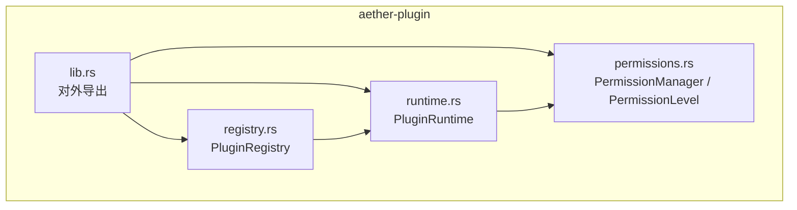
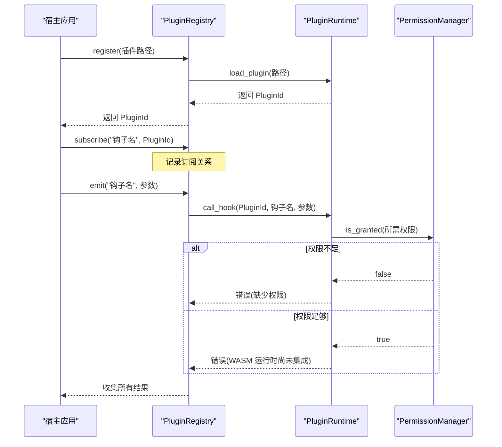
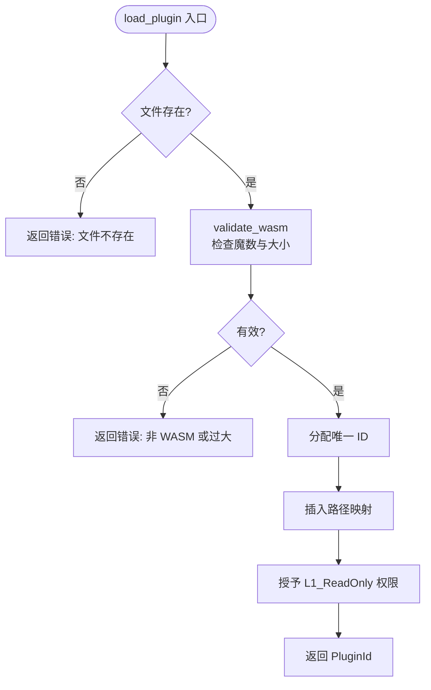
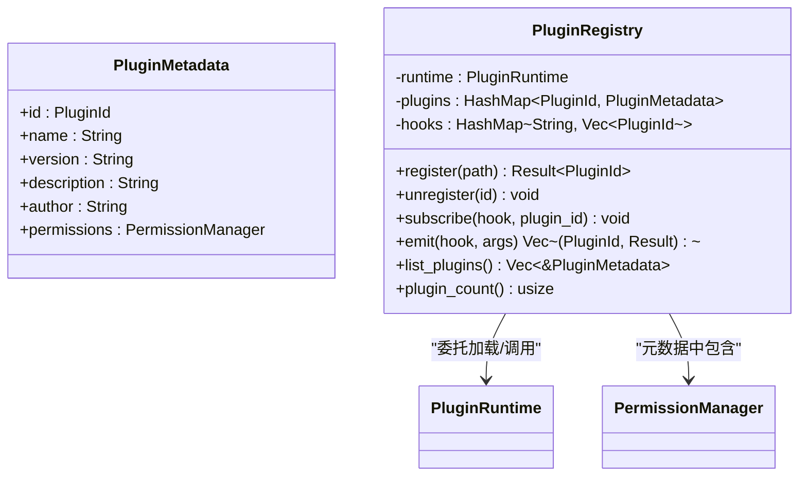
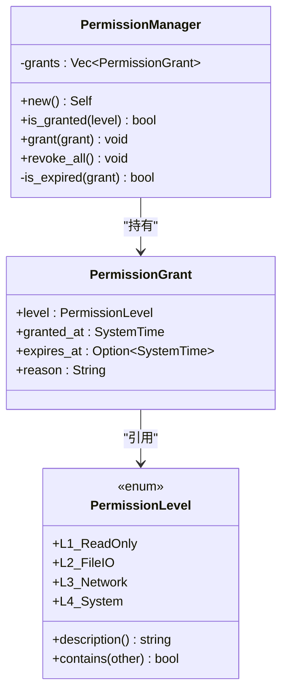
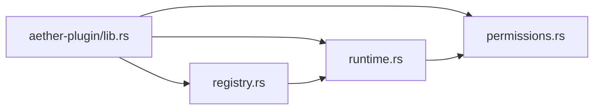

# 插件运行时

<cite>
**本文引用的文件**
- [crates/aether-plugin/src/lib.rs](file://crates/aether-plugin/src/lib.rs)
- [crates/aether-plugin/src/runtime.rs](file://crates/aether-plugin/src/runtime.rs)
- [crates/aether-plugin/src/registry.rs](file://crates/aether-plugin/src/registry.rs)
- [crates/aether-plugin/src/permissions.rs](file://crates/aether-plugin/src/permissions.rs)
- [crates/aether-plugin/Cargo.toml](file://crates/aether-plugin/Cargo.toml)
- [Cargo.toml](file://Cargo.toml)
</cite>

## 目录
1. [简介](#简介)
2. [项目结构](#项目结构)
3. [核心组件](#核心组件)
4. [架构总览](#架构总览)
5. [详细组件分析](#详细组件分析)
6. [依赖关系分析](#依赖关系分析)
7. [性能考量](#性能考量)
8. [故障排查指南](#故障排查指南)
9. [结论](#结论)
10. [附录](#附录)

## 简介
本模块为“插件运行时”，负责 WASM 插件的加载、权限控制、生命周期管理与事件分发。当前实现为架构占位：已完成插件元数据管理、WASM 文件校验、基于级别的权限模型与钩子调用框架，但尚未集成真正的 WASM 执行引擎（如 wasmtime）。因此，call_hook 在通过权限检查后会返回“未集成”的错误提示，避免误判为成功执行。该设计为后续接入真实 WASM 运行时预留了清晰的扩展点。

## 项目结构
aether-plugin 提供三个核心子模块：
- runtime：插件运行时核心，负责插件实例化、资源管理、权限绑定与钩子调用入口
- registry：插件注册表，维护已加载插件的元数据、订阅关系与事件广播
- permissions：权限级别与授权管理器，实现最小权限原则与过期控制

图表来源
- [crates/aether-plugin/src/lib.rs:1-7](file://crates/aether-plugin/src/lib.rs#L1-L7)
- [crates/aether-plugin/src/runtime.rs:16-21](file://crates/aether-plugin/src/runtime.rs#L16-L21)
- [crates/aether-plugin/src/registry.rs:19-23](file://crates/aether-plugin/src/registry.rs#L19-L23)
- [crates/aether-plugin/src/permissions.rs:7-13](file://crates/aether-plugin/src/permissions.rs#L7-L13)

章节来源
- [crates/aether-plugin/src/lib.rs:1-7](file://crates/aether-plugin/src/lib.rs#L1-L7)
- [crates/aether-plugin/Cargo.toml:1-9](file://crates/aether-plugin/Cargo.toml#L1-L9)
- [Cargo.toml:1-37](file://Cargo.toml#L1-L37)

## 核心组件
- PluginId：唯一标识每个已加载插件
- PluginRuntime：插件运行时，负责加载/卸载插件、权限授予与撤销、钩子调用入口
- PluginRegistry：插件注册表，维护插件元数据、订阅关系与事件分发
- PermissionLevel / PermissionManager：四级权限模型与授权管理，支持过期时间与层级包含关系

章节来源
- [crates/aether-plugin/src/runtime.rs:9-21](file://crates/aether-plugin/src/runtime.rs#L9-L21)
- [crates/aether-plugin/src/registry.rs:6-23](file://crates/aether-plugin/src/registry.rs#L6-L23)
- [crates/aether-plugin/src/permissions.rs:7-13](file://crates/aether-plugin/src/permissions.rs#L7-L13)
- [crates/aether-plugin/src/permissions.rs:47-94](file://crates/aether-plugin/src/permissions.rs#L47-L94)

## 架构总览
插件运行时的整体流程如下：
- 注册阶段：通过注册表加载插件，创建默认元数据并分配唯一 ID
- 权限阶段：为新加载插件授予基础只读权限；宿主应用可按需提升权限
- 事件阶段：插件订阅特定钩子；宿主触发钩子时，按订阅列表逐一调用
- 执行阶段：当前为占位实现，权限通过后返回“未集成”错误；未来将接入 WASM 引擎执行实际逻辑

图表来源
- [crates/aether-plugin/src/registry.rs:34-91](file://crates/aether-plugin/src/registry.rs#L34-L91)
- [crates/aether-plugin/src/runtime.rs:60-157](file://crates/aether-plugin/src/runtime.rs#L60-L157)
- [crates/aether-plugin/src/permissions.rs:67-72](file://crates/aether-plugin/src/permissions.rs#L67-L72)

## 详细组件分析

### 插件运行时（PluginRuntime）
职责
- 插件实例化：验证 WASM 魔数与大小限制，分配唯一 ID，建立路径映射
- 权限绑定：为每个插件维护独立的权限管理器，默认授予 L1_ReadOnly
- 钩子调用：根据钩子名称映射到所需权限级别，进行权限校验后进入执行流程（当前为占位）

关键行为
- 加载插件：检查文件存在性、格式合法性、大小上限、ID 溢出保护
- 卸载插件：清理插件路径与权限记录
- 权限授予/撤销：支持设置过期时间，拒绝过去时间的过期配置
- 钩子权限映射：不同钩子对应不同权限级别，未知钩子默认要求最低权限

复杂度与性能
- 加载/卸载：哈希表操作 O(1)
- 权限检查：遍历授权记录，O(n)，n 为授权条目数量
- 钩子调用：单次权限检查 + 占位返回，开销极低

错误处理
- 文件不存在、非 WASM、过大、ID 耗尽等明确错误信息
- 权限不足时返回具体缺失的权限级别
- 未集成 WASM 引擎时返回明确提示，避免误判成功

图表来源
- [crates/aether-plugin/src/runtime.rs:33-87](file://crates/aether-plugin/src/runtime.rs#L33-L87)

章节来源
- [crates/aether-plugin/src/runtime.rs:9-181](file://crates/aether-plugin/src/runtime.rs#L9-L181)

### 插件注册表（PluginRegistry）
职责
- 插件生命周期：注册与卸载，维护插件元数据
- 事件分发：订阅与触发钩子，批量调用并收集结果
- 资源清理：卸载时从所有钩子订阅中移除对应插件

关键行为
- 注册：调用运行时加载插件，创建默认元数据（名称、版本、描述、作者、权限管理器）
- 订阅：将插件 ID 加入指定钩子的订阅列表
- 触发：查找订阅者，逐个调用运行时钩子，收集结果返回

复杂度与性能
- 订阅/触发：哈希表查找与向量遍历，O(k)，k 为订阅者数量
- 卸载：清理主表与所有钩子订阅，O(h)，h 为钩子总数

图表来源
- [crates/aether-plugin/src/registry.rs:6-23](file://crates/aether-plugin/src/registry.rs#L6-L23)
- [crates/aether-plugin/src/registry.rs:25-108](file://crates/aether-plugin/src/registry.rs#L25-L108)
- [crates/aether-plugin/src/permissions.rs:56-94](file://crates/aether-plugin/src/permissions.rs#L56-L94)

章节来源
- [crates/aether-plugin/src/registry.rs:6-108](file://crates/aether-plugin/src/registry.rs#L6-L108)

### 权限系统（PermissionLevel / PermissionManager）
职责
- 定义四级权限模型：只读 UI、文件 IO、网络访问、系统命令执行
- 管理授权记录：支持授予、撤销、过期检查
- 权限包含关系：高权限包含低权限能力

关键行为
- 包含判断：显式匹配避免枚举变体重排导致的静默破坏
- 过期检查：同时校验 granted_at 与 expires_at，防止无效时间配置
- 层级包含：L4 包含全部，L3 包含 L3/L2/L1，L2 包含 L2/L1，L1 仅自身

复杂度与性能
- 授权检查：遍历 grants 向量，O(n)
- 包含判断：常数时间匹配

图表来源
- [crates/aether-plugin/src/permissions.rs:7-13](file://crates/aether-plugin/src/permissions.rs#L7-L13)
- [crates/aether-plugin/src/permissions.rs:47-94](file://crates/aether-plugin/src/permissions.rs#L47-L94)

章节来源
- [crates/aether-plugin/src/permissions.rs:7-94](file://crates/aether-plugin/src/permissions.rs#L7-L94)

## 依赖关系分析
- 外部依赖：serde、serde_json（用于序列化钩子参数与返回值）
- 工作区：作为 aether 工作区的一个 crate，遵循统一版本与构建配置
- 内部耦合：
  - registry 依赖 runtime 与 permissions
  - runtime 依赖 permissions
  - lib 暴露公共类型供其他模块使用

图表来源
- [crates/aether-plugin/src/lib.rs:1-7](file://crates/aether-plugin/src/lib.rs#L1-L7)
- [crates/aether-plugin/Cargo.toml:6-9](file://crates/aether-plugin/Cargo.toml#L6-L9)
- [Cargo.toml:1-37](file://Cargo.toml#L1-L37)

章节来源
- [crates/aether-plugin/Cargo.toml:1-9](file://crates/aether-plugin/Cargo.toml#L1-L9)
- [Cargo.toml:1-37](file://Cargo.toml#L1-L37)

## 性能考量
- 内存隔离：当前未集成 WASM 引擎，无运行时内存隔离；未来接入 Wasmtime 后可实现沙箱隔离
- 资源管理：插件路径与权限记录以哈希表存储，加载/卸载为 O(1)；卸载时清理订阅列表为 O(h)
- 权限检查：每次钩子调用前进行权限检查，复杂度 O(n)；可通过缓存或索引优化高频场景
- 事件分发：批量调用订阅者，顺序执行；可考虑并行化以提升吞吐，但需注意线程安全与资源竞争
- 错误快速失败：文件校验、权限不足、ID 耗尽等早期失败，减少无效计算

[本节为通用指导，不直接分析具体文件]

## 故障排查指南
常见问题与定位
- 插件文件不存在：检查路径是否正确，确保 WASM 文件位于预期位置
- 非 WASM 格式：确认文件头魔数正确，编译产物为 .wasm
- 插件文件过大：当前限制为 50MB，建议拆分或优化插件体积
- 权限不足：确认已授予对应权限级别；未知钩子默认需要 L1_ReadOnly
- WASM 未集成：当前 call_hook 会返回“未集成”错误，属于预期行为；待集成引擎后生效

调试建议
- 启用日志：在宿主层记录注册、订阅、触发与错误信息
- 单元测试：利用现有测试用例验证加载、权限、卸载与事件分发流程
- 逐步授权：先授予 L1_ReadOnly，再按需提升权限，便于定位问题范围

章节来源
- [crates/aether-plugin/src/runtime.rs:33-157](file://crates/aether-plugin/src/runtime.rs#L33-L157)
- [crates/aether-plugin/src/registry.rs:34-91](file://crates/aether-plugin/src/registry.rs#L34-L91)
- [crates/aether-plugin/src/permissions.rs:67-94](file://crates/aether-plugin/src/permissions.rs#L67-L94)

## 结论
本插件运行时提供了完整的插件生命周期框架与权限模型，为后续接入 WASM 执行引擎奠定了坚实基础。当前占位实现确保了安全性与可扩展性：通过严格的文件校验、最小权限原则与清晰的错误反馈，使宿主应用能够安全地管理与调度插件。未来只需在 call_hook 中集成真实 WASM 引擎，即可实现插件的实际执行与资源隔离。

[本节为总结，不直接分析具体文件]

## 附录

### 运行时配置选项
- 最大插件大小：常量 MAX_PLUGIN_SIZE，当前为 50MB
- 默认权限：新加载插件自动授予 L1_ReadOnly
- 权限过期：支持设置 expires_at，拒绝过去时间配置
- 钩子权限映射：不同钩子对应不同权限级别，未知钩子默认 L1_ReadOnly

章节来源
- [crates/aether-plugin/src/runtime.rs:6-7](file://crates/aether-plugin/src/runtime.rs#L6-L7)
- [crates/aether-plugin/src/runtime.rs:76-84](file://crates/aether-plugin/src/runtime.rs#L76-L84)
- [crates/aether-plugin/src/runtime.rs:96-118](file://crates/aether-plugin/src/runtime.rs#L96-L118)
- [crates/aether-plugin/src/runtime.rs:159-175](file://crates/aether-plugin/src/runtime.rs#L159-L175)

### 调试工具使用方法
- 使用现有测试：通过单元测试验证加载、权限、卸载与事件分发
- 临时 WASM 文件：测试中使用临时目录生成合法魔数的 .wasm 文件
- 错误信息：关注“文件不存在”“非 WASM 格式”“过大”“权限不足”“未集成”等错误提示

章节来源
- [crates/aether-plugin/src/runtime.rs:197-205](file://crates/aether-plugin/src/runtime.rs#L197-L205)
- [crates/aether-plugin/src/runtime.rs:242-560](file://crates/aether-plugin/src/runtime.rs#L242-L560)
- [crates/aether-plugin/src/registry.rs:116-126](file://crates/aether-plugin/src/registry.rs#L116-L126)
- [crates/aether-plugin/src/registry.rs:140-318](file://crates/aether-plugin/src/registry.rs#L140-L318)