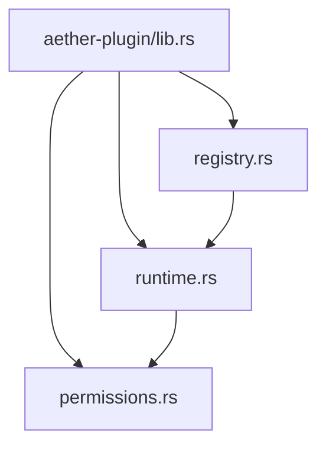
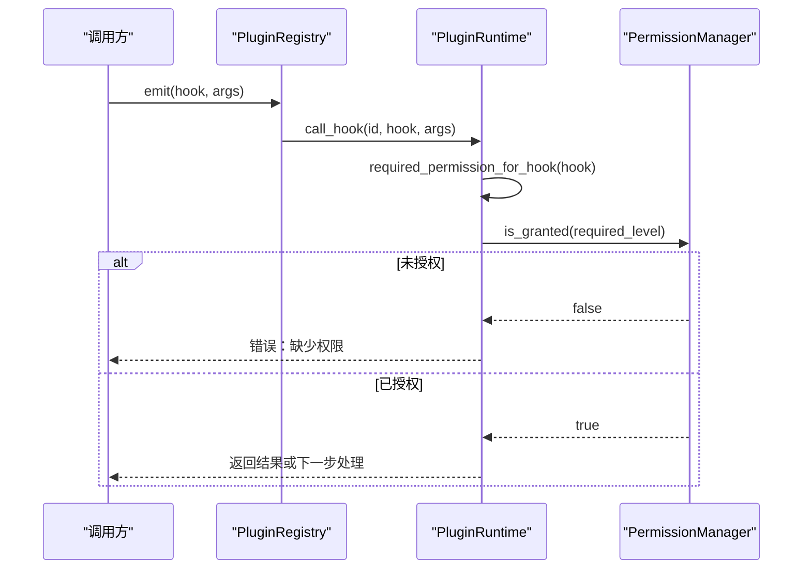
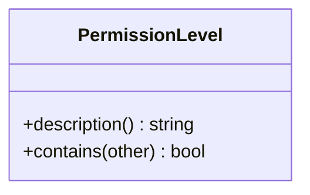
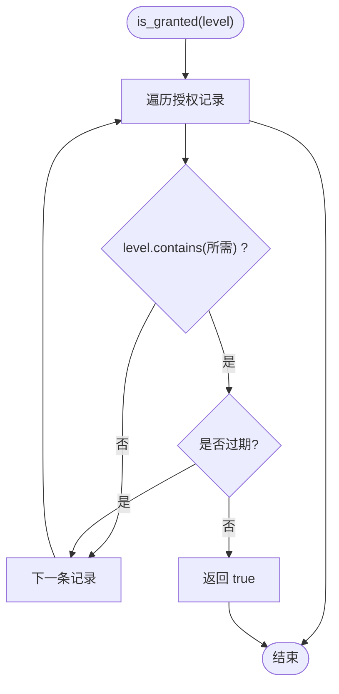
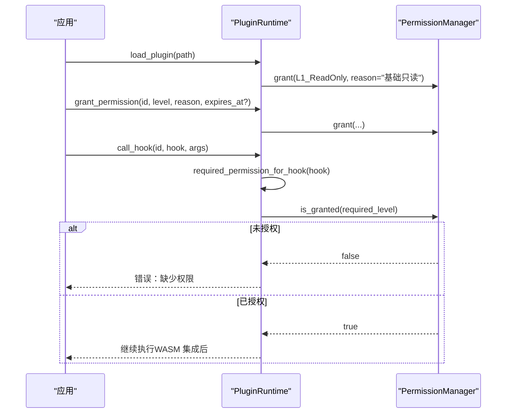
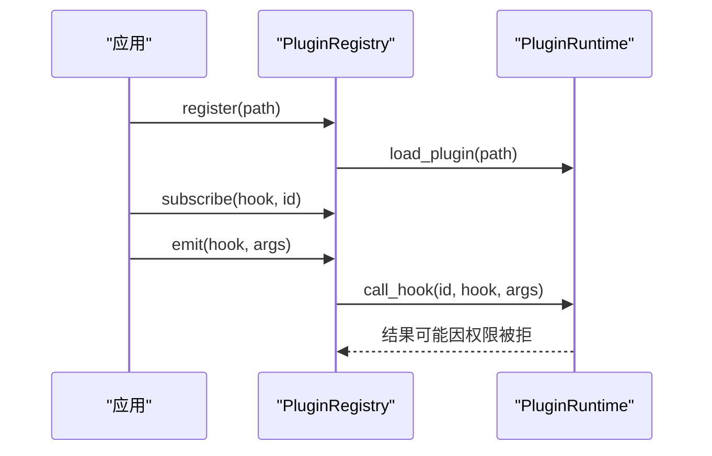
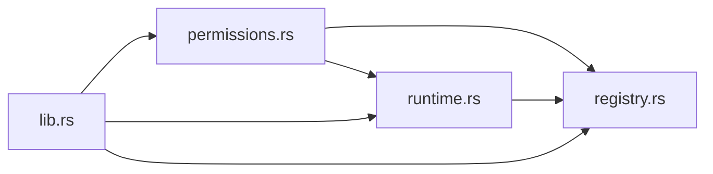

# 权限控制系统

<cite>
**本文引用的文件**
- [permissions.rs](file://crates/aether-plugin/src/permissions.rs)
- [runtime.rs](file://crates/aether-plugin/src/runtime.rs)
- [registry.rs](file://crates/aether-plugin/src/registry.rs)
- [lib.rs](file://crates/aether-plugin/src/lib.rs)
</cite>

## 目录
1. [简介](#简介)
2. [项目结构](#项目结构)
3. [核心组件](#核心组件)
4. [架构总览](#架构总览)
5. [详细组件分析](#详细组件分析)
6. [依赖关系分析](#依赖关系分析)
7. [性能与安全考量](#性能与安全考量)
8. [故障排查指南](#故障排查指南)
9. [结论](#结论)
10. [附录：最佳实践与常见问题](#附录：最佳实践与常见问题)

## 简介
本文件系统围绕插件沙箱的细粒度权限模型，提供基于级别（L1-L4）的权限控制、动态授予与撤销、以及按钩子类型映射所需权限的安全策略。其目标是确保插件在最小必要权限下运行，并对文件系统访问、网络请求、系统调用等敏感能力进行严格管控。

## 项目结构
权限相关代码集中在 aether-plugin 模块中，包含以下关键文件：
- 权限定义与管理：permissions.rs
- 插件运行时与权限检查：runtime.rs
- 插件注册与事件分发：registry.rs
- 对外导出入口：lib.rs

图表来源
- [lib.rs:1-8](file://crates/aether-plugin/src/lib.rs#L1-L8)
- [permissions.rs:1-100](file://crates/aether-plugin/src/permissions.rs#L1-L100)
- [runtime.rs:1-21](file://crates/aether-plugin/src/runtime.rs#L1-L21)
- [registry.rs:1-23](file://crates/aether-plugin/src/registry.rs#L1-L23)

章节来源
- [lib.rs:1-8](file://crates/aether-plugin/src/lib.rs#L1-L8)

## 核心组件
- PermissionLevel：定义四级权限等级，体现“最小权限”和“层级包含”原则。
- PermissionGrant：记录一次权限授予的元数据（级别、授予时间、可选过期时间、原因）。
- PermissionManager：维护一组授权记录，支持查询是否已授予、授予、撤销全部。
- PluginRuntime：管理插件生命周期，并在调用钩子前进行权限校验；将钩子名称映射为所需权限级别。
- PluginRegistry：统一注册/卸载插件，订阅/触发钩子，并委托运行时执行权限检查。

章节来源
- [permissions.rs:1-100](file://crates/aether-plugin/src/permissions.rs#L1-L100)
- [runtime.rs:1-181](file://crates/aether-plugin/src/runtime.rs#L1-L181)
- [registry.rs:1-108](file://crates/aether-plugin/src/registry.rs#L1-L108)

## 架构总览
权限控制贯穿插件加载、动态授权、钩子调用全流程。运行时在每次钩子调用前根据钩子类型判定所需权限级别，并通过权限管理器校验是否满足。

图表来源
- [registry.rs:75-91](file://crates/aether-plugin/src/registry.rs#L75-L91)
- [runtime.rs:127-175](file://crates/aether-plugin/src/runtime.rs#L127-L175)
- [permissions.rs:62-94](file://crates/aether-plugin/src/permissions.rs#L62-L94)

## 详细组件分析

### PermissionLevel 设计原理
- 四级分层：L1_ReadOnly（只读 UI）、L2_FileIO（文件读写）、L3_Network（网络访问）、L4_System（系统命令执行）。
- 层级包含：高权限隐含低权限（如 L4 包含所有，L3 包含 L3/L2/L1），避免重复授权。
- 显式匹配实现 contains 逻辑，防止枚举变体重排导致静默破坏。

图表来源
- [permissions.rs:1-45](file://crates/aether-plugin/src/permissions.rs#L1-L45)

章节来源
- [permissions.rs:1-45](file://crates/aether-plugin/src/permissions.rs#L1-L45)

### PermissionGrant 与 PermissionManager
- PermissionGrant：包含 level、granted_at、expires_at（可选）、reason。
- PermissionManager：
  - grant：追加一条授权记录。
  - is_granted：遍历记录，若存在某条记录的 level 包含所需级别且未过期，则视为已授权。
  - revoke_all：清空所有授权。
  - 过期判断：当 expires_at 存在时，比较当前时间与 granted_at/expires_at，拒绝过去时间或未来授予时间。

图表来源
- [permissions.rs:62-94](file://crates/aether-plugin/src/permissions.rs#L62-L94)

章节来源
- [permissions.rs:47-100](file://crates/aether-plugin/src/permissions.rs#L47-L100)

### 插件运行时与权限验证流程
- 加载插件：默认仅授予 L1_ReadOnly 基础权限。
- 动态授权：grant_permission 支持设置过期时间，拒绝过去时间。
- 钩子调用：call_hook 先通过 required_permission_for_hook 确定所需权限，再进行 is_granted 校验；未通过则直接拒绝。
- 钩子到权限映射：
  - L1：on_activate、on_deactivate、get_theme、get_language
  - L2：on_save、on_open、read_file、write_file
  - L3：fetch、http_request、websocket
  - L4：exec、spawn、shell、run_command
  - 未知钩子默认 L1（最安全）

图表来源
- [runtime.rs:59-118](file://crates/aether-plugin/src/runtime.rs#L59-L118)
- [runtime.rs:127-175](file://crates/aether-plugin/src/runtime.rs#L127-L175)
- [permissions.rs:62-94](file://crates/aether-plugin/src/permissions.rs#L62-L94)

章节来源
- [runtime.rs:59-181](file://crates/aether-plugin/src/runtime.rs#L59-L181)

### 插件注册与事件分发
- register：加载插件并创建元数据，包含独立的 PermissionManager。
- subscribe/emit：订阅钩子并批量触发；每个插件调用均经过运行时权限检查。
- unregister：移除插件及其钩子订阅。

图表来源
- [registry.rs:34-91](file://crates/aether-plugin/src/registry.rs#L34-L91)
- [runtime.rs:127-175](file://crates/aether-plugin/src/runtime.rs#L127-L175)

章节来源
- [registry.rs:34-108](file://crates/aether-plugin/src/registry.rs#L34-L108)

## 依赖关系分析
- permissions.rs 提供基础类型与管理器，无外部依赖。
- runtime.rs 依赖 permissions.rs，实现运行时与权限校验。
- registry.rs 依赖 runtime.rs 与 permissions.rs，负责插件生命周期与事件分发。
- lib.rs 统一导出公共类型与组件。

图表来源
- [lib.rs:1-8](file://crates/aether-plugin/src/lib.rs#L1-L8)
- [runtime.rs:1-5](file://crates/aether-plugin/src/runtime.rs#L1-L5)
- [registry.rs:1-5](file://crates/aether-plugin/src/registry.rs#L1-L5)

章节来源
- [lib.rs:1-8](file://crates/aether-plugin/src/lib.rs#L1-L8)

## 性能与安全考量
- 性能
  - 授权检查为线性扫描授权列表，复杂度 O(n)。对于典型插件数量与授权记录数，开销可接受。
  - 如需高频检查，可考虑缓存最近检查结果或使用位图表示已授权级别集合。
- 安全
  - 最小权限：新插件仅获得 L1_ReadOnly，需显式申请更高权限。
  - 层级包含：避免重复授权，简化策略配置。
  - 过期控制：支持临时授权，自动失效，降低长期风险。
  - 钩子映射：未知钩子默认 L1，遵循“默认拒绝”原则。
  - 输入校验：加载插件时校验 WASM 魔数与大小，防止恶意载荷。

[本节为通用指导，不直接分析具体文件]

## 故障排查指南
- 常见错误与定位
  - “插件未加载”：调用权限操作前需先加载插件。
  - “缺少执行所需的权限”：钩子需要更高级别权限，需通过 grant_permission 授予。
  - “过期时间不能是过去时间”：动态授权时 expires_at 必须大于当前时间。
  - “WASM 运行时尚未集成”：当前为占位实现，权限通过后仍会返回此提示。
- 排查步骤
  - 确认插件已加载并拥有对应权限。
  - 检查钩子名称是否在映射表中，必要时扩展映射。
  - 审查授权记录的时间字段，确保 granted_at 与 expires_at 合理。
  - 使用 revoke_all 清理异常状态后重试。

章节来源
- [runtime.rs:95-125](file://crates/aether-plugin/src/runtime.rs#L95-L125)
- [runtime.rs:127-175](file://crates/aether-plugin/src/runtime.rs#L127-L175)
- [permissions.rs:62-94](file://crates/aether-plugin/src/permissions.rs#L62-L94)

## 结论
该权限控制系统以清晰的四级权限模型为基础，结合运行时钩子映射与动态授权机制，实现了插件的最小权限运行与细粒度访问控制。通过严格的过期校验与默认拒绝策略，有效降低了安全风险。后续可在保持现有接口稳定的前提下，扩展更多资源类型与策略配置选项。

[本节为总结性内容，不直接分析具体文件]

## 附录：最佳实践与常见问题

### 最佳实践
- 始终从 L1_ReadOnly 开始，按需申请更高权限。
- 对临时任务使用带过期时间的授权，减少长期暴露面。
- 明确区分只读与写入操作，仅在必要时授予 L2_FileIO。
- 对网络与系统调用（L3/L4）进行严格审批与审计。
- 定期审计插件权限，及时撤销不再需要的授权。

### 常见问题与解决方案
- 问题：频繁出现“缺少权限”错误
  - 解决：确认钩子映射是否正确，补充相应权限。
- 问题：授权后立即失效
  - 解决：检查 expires_at 是否设置过短或误设为过去时间。
- 问题：无法执行系统命令
  - 解决：授予 L4_System，并确保调用路径正确。
- 问题：未知钩子无法执行
  - 解决：在运行时中添加钩子到权限映射，或调整策略使其默认更安全。

[本节为通用指导，不直接分析具体文件]