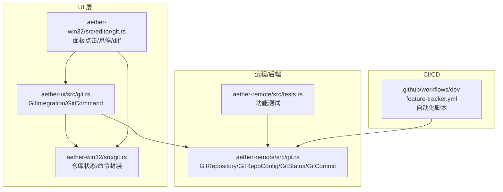
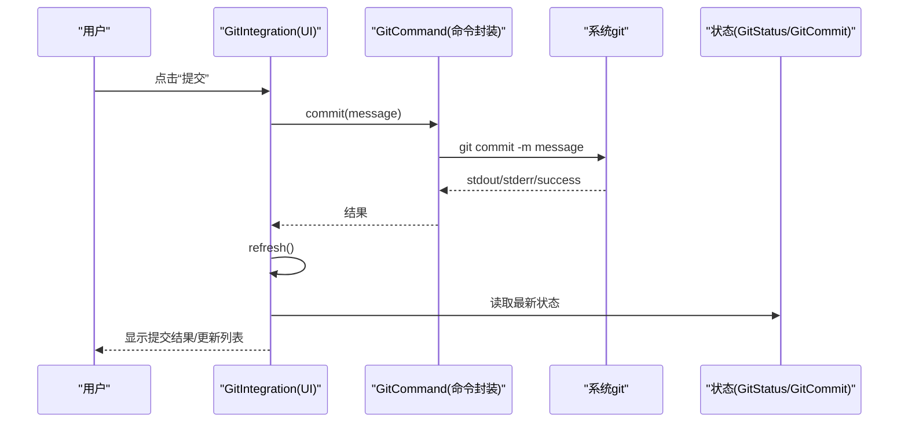
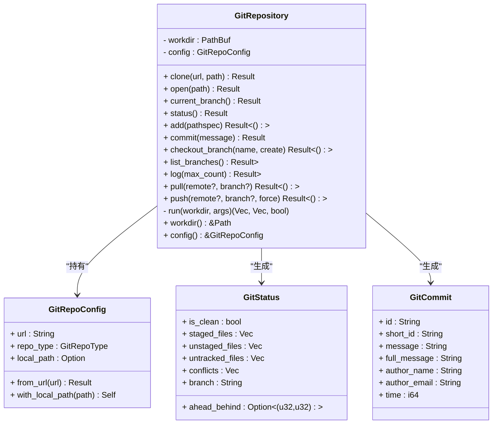
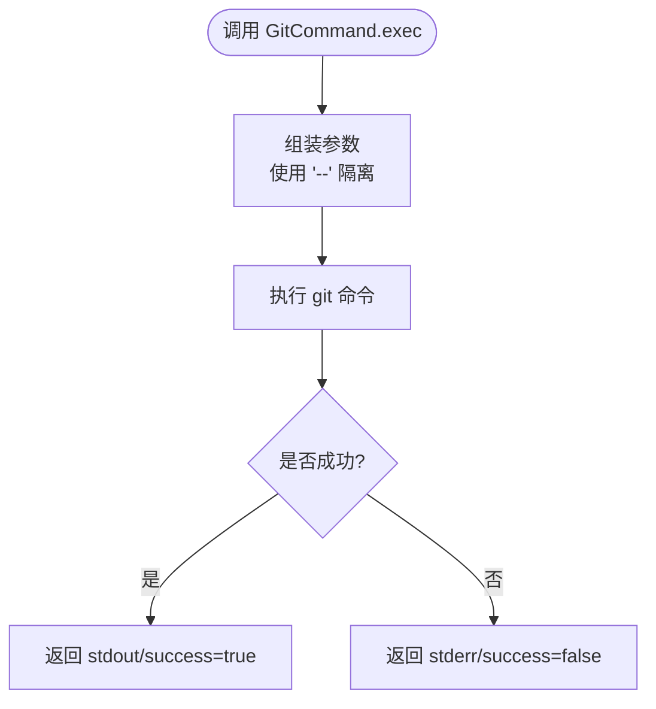
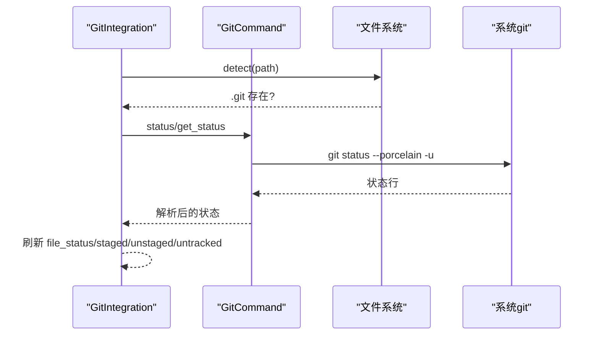
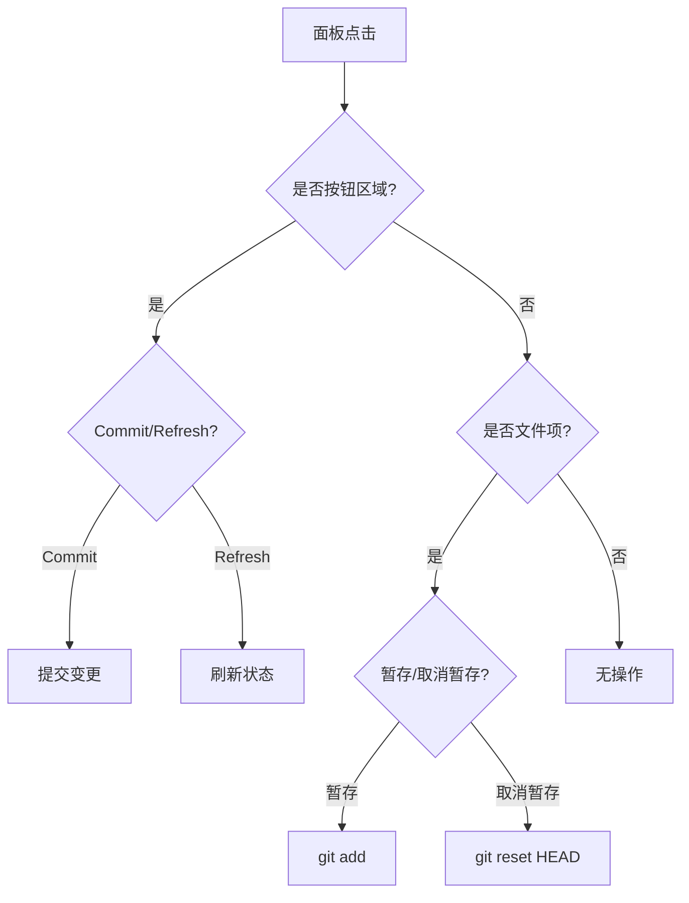
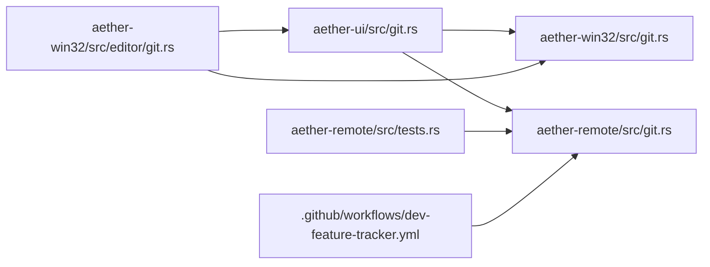
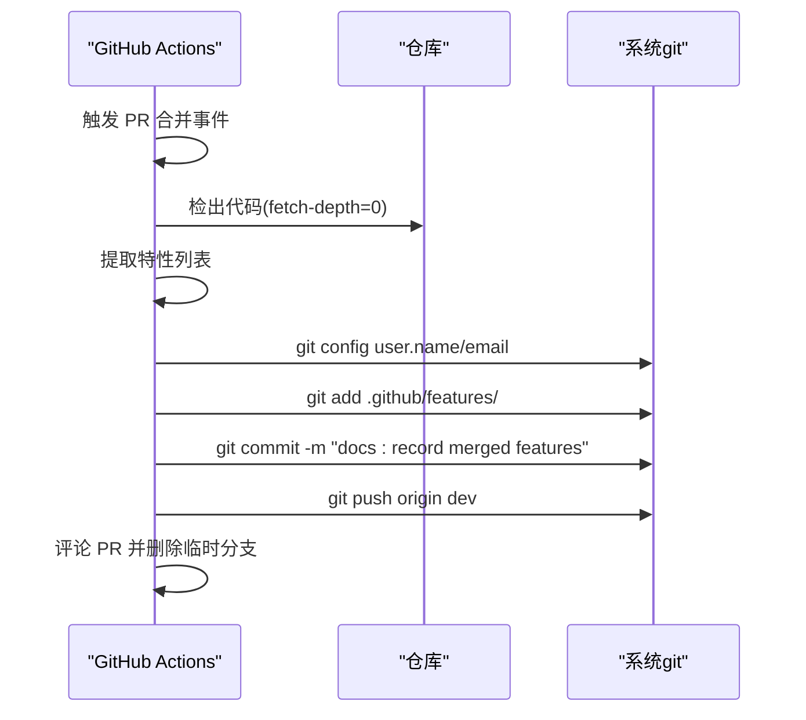

# Git 集成

<cite>
**本文引用的文件**
- [crates/aether-remote/src/git.rs](file://crates/aether-remote/src/git.rs)
- [crates/aether-ui/src/git.rs](file://crates/aether-ui/src/git.rs)
- [crates/aether-win32/src/editor/git.rs](file://crates/aether-win32/src/editor/git.rs)
- [crates/aether-win32/src/git.rs](file://crates/aether-win32/src/git.rs)
- [crates/aether-remote/src/tests.rs](file://crates/aether-remote/src/tests.rs)
- [.github/workflows/dev-feature-tracker.yml](file://.github/workflows/dev-feature-tracker.yml)
</cite>

## 目录
1. [简介](#简介)
2. [项目结构](#项目结构)
3. [核心组件](#核心组件)
4. [架构总览](#架构总览)
5. [详细组件分析](#详细组件分析)
6. [依赖关系分析](#依赖关系分析)
7. [性能考量](#性能考量)
8. [故障排查指南](#故障排查指南)
9. [结论](#结论)
10. [附录：工作流与自动化示例](#附录工作流与自动化示例)

## 简介
本仓库实现了面向编辑器的 Git 集成功能，覆盖仓库管理、版本控制操作（提交、分支、合并/拉取）、状态监控与 UI 交互。核心实现通过调用系统 git 二进制完成命令封装，提供跨平台一致的 API；UI 层提供仓库检测、状态展示、暂存/取消暂存、提交、分支切换、差异查看等能力；远程开发侧提供仓库配置解析、克隆、拉取/推送、日志查询等能力，并包含完善的安全校验与错误处理。

## 项目结构
Git 相关代码分布在多个 crate 中，职责清晰分层：
- aether-remote：远程/后端能力，提供 GitRepository/GitRepoConfig/GitStatus/GitCommit 等核心类型与命令封装
- aether-ui：编辑器 UI 层的 Git 集成管理器与命令执行器，负责状态刷新、用户交互流程
- aether-win32：Windows 端编辑器状态与面板交互，包括 Git 面板点击、悬停、diff 打开等
- GitHub Actions：CI/CD 中的 Git 自动化脚本，用于特性记录、清理与推送

图表来源
- [crates/aether-ui/src/git.rs:186-340](file://crates/aether-ui/src/git.rs#L186-L340)
- [crates/aether-win32/src/editor/git.rs:1-164](file://crates/aether-win32/src/editor/git.rs#L1-L164)
- [crates/aether-win32/src/git.rs:186-340](file://crates/aether-win32/src/git.rs#L186-L340)
- [crates/aether-remote/src/git.rs:115-505](file://crates/aether-remote/src/git.rs#L115-L505)
- [crates/aether-remote/src/tests.rs:51-90](file://crates/aether-remote/src/tests.rs#L51-L90)
- [.github/workflows/dev-feature-tracker.yml:1-110](file://.github/workflows/dev-feature-tracker.yml#L1-L110)

章节来源
- [crates/aether-remote/src/git.rs:1-531](file://crates/aether-remote/src/git.rs#L1-L531)
- [crates/aether-ui/src/git.rs:1-562](file://crates/aether-ui/src/git.rs#L1-L562)
- [crates/aether-win32/src/editor/git.rs:1-164](file://crates/aether-win32/src/editor/git.rs#L1-L164)
- [crates/aether-win32/src/git.rs:1-562](file://crates/aether-win32/src/git.rs#L1-L562)
- [crates/aether-remote/src/tests.rs:1-300](file://crates/aether-remote/src/tests.rs#L1-L300)
- [.github/workflows/dev-feature-tracker.yml:1-110](file://.github/workflows/dev-feature-tracker.yml#L1-L110)

## 核心组件
- GitRepository（远程）：封装仓库生命周期与版本控制操作，包括 clone/open/current_branch/status/add/commit/checkout_branch/list_branches/log/pull/push
- GitRepoConfig：从 URL 解析仓库类型（本地/SSH/HTTPS），支持附加本地路径
- GitStatus：描述工作区状态（干净/暂存/未暂存/未跟踪/冲突/分支信息）
- GitCommit：提交记录（完整哈希、短哈希、作者、时间戳、主题、全文消息）
- GitCommand（UI/Win32）：统一执行 git 命令的封装，提供 add/commit/push/pull/fetch/branch/log/clone 等方法
- GitIntegration（UI/Win32）：编辑器内 Git 集成管理器，协调状态刷新、用户操作与结果缓存
- 面板交互（Win32）：Git 面板点击、悬停、diff 打开等 UI 逻辑

章节来源
- [crates/aether-remote/src/git.rs:35-121](file://crates/aether-remote/src/git.rs#L35-L121)
- [crates/aether-remote/src/git.rs:115-505](file://crates/aether-remote/src/git.rs#L115-L505)
- [crates/aether-remote/src/git.rs:507-531](file://crates/aether-remote/src/git.rs#L507-L531)
- [crates/aether-ui/src/git.rs:186-340](file://crates/aether-ui/src/git.rs#L186-L340)
- [crates/aether-ui/src/git.rs:342-555](file://crates/aether-ui/src/git.rs#L342-L555)
- [crates/aether-win32/src/editor/git.rs:1-164](file://crates/aether-win32/src/editor/git.rs#L1-L164)

## 架构总览
整体采用“命令封装 + 状态管理 + UI 交互”的分层设计：
- 命令封装层：通过系统 git 二进制执行命令，统一返回 stdout/stderr/成功标志
- 状态管理层：解析 git status/log 输出，构建结构化数据（GitStatus/GitCommit）
- UI 交互层：监听用户操作，调用命令封装，刷新状态并反馈结果

图表来源
- [crates/aether-ui/src/git.rs:482-492](file://crates/aether-ui/src/git.rs#L482-L492)
- [crates/aether-ui/src/git.rs:233-241](file://crates/aether-ui/src/git.rs#L233-L241)
- [crates/aether-ui/src/git.rs:142-145](file://crates/aether-ui/src/git.rs#L142-L145)

## 详细组件分析

### GitRepository（远程）——仓库管理与版本控制
- 仓库生命周期
  - clone：校验 URL，执行 git clone，成功后 open 构造实例
  - open：验证 .git 存在，读取 origin URL 推断仓库类型，构造 GitRepoConfig
- 版本控制操作
  - current_branch：使用 symbolic-ref --short HEAD，空仓库或 detached HEAD 时返回安全值
  - status：porcelain v1 -z 格式解析，区分 staged/unstaged/untracked/conflicts，标记 is_clean
  - add/commit：add 指定 pathspec，commit 后通过 rev-parse HEAD 获取新提交哈希
  - checkout_branch：创建或切换分支，参数以 "--" 隔离防止注入
  - list_branches：格式化列出本地分支
  - log：自定义 format 输出多字段，按 RS/NUL 分隔解析为 GitCommit 列表
  - pull/push：仅 fast-forward 拉取，push 支持 force 标志，参数校验防注入
- 错误处理
  - 定义 GitError 枚举，涵盖各类失败场景，Display 输出中文提示
  - run 统一捕获命令执行异常，返回 (stdout, stderr, success)

图表来源
- [crates/aether-remote/src/git.rs:115-505](file://crates/aether-remote/src/git.rs#L115-L505)
- [crates/aether-remote/src/git.rs:35-68](file://crates/aether-remote/src/git.rs#L35-L68)
- [crates/aether-remote/src/git.rs:507-531](file://crates/aether-remote/src/git.rs#L507-L531)

章节来源
- [crates/aether-remote/src/git.rs:123-505](file://crates/aether-remote/src/git.rs#L123-L505)
- [crates/aether-remote/src/git.rs:35-68](file://crates/aether-remote/src/git.rs#L35-L68)
- [crates/aether-remote/src/git.rs:507-531](file://crates/aether-remote/src/git.rs#L507-L531)

### GitCommand（UI/Win32）——命令执行封装
- 统一 exec：调用系统 git，返回 stdout/stderr/success
- 常用命令：add/add_all/unstage/commit/push/pull/fetch/create_branch/switch_branch/list_branches/log/clone
- 安全策略：clone 白名单协议校验；所有命令使用 "--" 隔离参数，避免 flag 注入
- 错误处理：失败时返回 stderr 文本，便于 UI 展示

图表来源
- [crates/aether-ui/src/git.rs:186-201](file://crates/aether-ui/src/git.rs#L186-L201)
- [crates/aether-ui/src/git.rs:316-339](file://crates/aether-ui/src/git.rs#L316-L339)
- [crates/aether-win32/src/git.rs:186-201](file://crates/aether-win32/src/git.rs#L186-L201)
- [crates/aether-win32/src/git.rs:316-339](file://crates/aether-win32/src/git.rs#L316-L339)

章节来源
- [crates/aether-ui/src/git.rs:186-340](file://crates/aether-ui/src/git.rs#L186-L340)
- [crates/aether-win32/src/git.rs:186-340](file://crates/aether-win32/src/git.rs#L186-L340)

### GitIntegration（UI/Win32）——编辑器内集成管理
- 状态检测：detect/refresh 基于 .git 存在性与 git status 输出构建状态
- 用户操作：stage_file/unstage_file/commit/push/pull/branches/switch_branch/create_branch/clone_repo
- 结果缓存：last_result 保存最近一次操作结果，便于 UI 提示
- 差异查看：selected_file + show_diff 打开 diff 视图

图表来源
- [crates/aether-ui/src/git.rs:38-58](file://crates/aether-ui/src/git.rs#L38-L58)
- [crates/aether-ui/src/git.rs:74-140](file://crates/aether-ui/src/git.rs#L74-L140)
- [crates/aether-win32/src/git.rs:38-58](file://crates/aether-win32/src/git.rs#L38-L58)
- [crates/aether-win32/src/git.rs:74-140](file://crates/aether-win32/src/git.rs#L74-L140)

章节来源
- [crates/aether-ui/src/git.rs:342-555](file://crates/aether-ui/src/git.rs#L342-L555)
- [crates/aether-win32/src/git.rs:342-555](file://crates/aether-win32/src/git.rs#L342-L555)

### 面板交互（Win32）——Git 面板点击与 Diff
- handle_git_panel_click：根据鼠标坐标定位按钮与文件项，触发暂存/取消暂存/提交/刷新等操作
- update_git_panel_hover：同步按钮悬停状态
- show_git_diff：调用 git diff/--cached 打开差异视图到新标签页

图表来源
- [crates/aether-win32/src/editor/git.rs:4-97](file://crates/aether-win32/src/editor/git.rs#L4-L97)
- [crates/aether-win32/src/editor/git.rs:121-148](file://crates/aether-win32/src/editor/git.rs#L121-L148)

章节来源
- [crates/aether-win32/src/editor/git.rs:1-164](file://crates/aether-win32/src/editor/git.rs#L1-L164)

## 依赖关系分析
- 命令执行依赖系统 git 二进制，需确保 PATH 可访问
- UI 层依赖 Win32 层的状态与命令封装
- 远程层提供独立于平台的仓库管理能力，供上层集成
- CI/CD 通过 GitHub Actions 调用 git CLI 进行自动化提交与推送

图表来源
- [crates/aether-ui/src/git.rs:186-340](file://crates/aether-ui/src/git.rs#L186-L340)
- [crates/aether-win32/src/git.rs:186-340](file://crates/aether-win32/src/git.rs#L186-L340)
- [crates/aether-win32/src/editor/git.rs:1-164](file://crates/aether-win32/src/editor/git.rs#L1-L164)
- [crates/aether-remote/src/git.rs:115-505](file://crates/aether-remote/src/git.rs#L115-L505)
- [crates/aether-remote/src/tests.rs:51-90](file://crates/aether-remote/src/tests.rs#L51-L90)
- [.github/workflows/dev-feature-tracker.yml:1-110](file://.github/workflows/dev-feature-tracker.yml#L1-L110)

章节来源
- [crates/aether-ui/src/git.rs:186-340](file://crates/aether-ui/src/git.rs#L186-L340)
- [crates/aether-win32/src/git.rs:186-340](file://crates/aether-win32/src/git.rs#L186-L340)
- [crates/aether-win32/src/editor/git.rs:1-164](file://crates/aether-win32/src/editor/git.rs#L1-L164)
- [crates/aether-remote/src/git.rs:115-505](file://crates/aether-remote/src/git.rs#L115-L505)
- [crates/aether-remote/src/tests.rs:51-90](file://crates/aether-remote/src/tests.rs#L51-L90)
- [.github/workflows/dev-feature-tracker.yml:1-110](file://.github/workflows/dev-feature-tracker.yml#L1-L110)

## 性能考量
- 命令执行开销：每次操作均 spawn 子进程执行 git，频繁调用可能带来性能损耗。建议批量操作或缓存状态以减少重复调用
- 状态解析效率：status 使用 porcelain v1 -z 格式，逐行解析 O(n)，适合常规仓库规模；超大仓库可考虑增量扫描或限制范围
- 日志查询：log 使用自定义 format 一次性输出多字段，减少多次命令调用；可按需限制 max_count
- 安全与健壮性：参数以 "--" 隔离，避免恶意输入被解析为 flag；clone 协议白名单限制危险协议

[本节为通用指导，不直接分析具体文件]

## 故障排查指南
- 系统未安装 git
  - 现象：命令执行失败，提示未安装或不在 PATH
  - 处理：引导用户安装 git，参考下载链接
- 无效仓库
  - 现象：open 失败，提示未找到 .git
  - 处理：确认路径正确，或先初始化仓库
- 认证失败
  - 现象：pull/push/clone 报认证错误
  - 处理：检查 SSH 密钥、凭据管理器或 HTTPS 凭据
- 非快进拉取
  - 现象：pull 失败，提示需要手动合并
  - 处理：改为手动合并或调整分支策略
- 分支名非法
  - 现象：checkout_branch/pull/push 拒绝以 '-' 开头的名称
  - 处理：修正分支名，避免与 flag 冲突

章节来源
- [crates/aether-remote/src/git.rs:70-113](file://crates/aether-remote/src/git.rs#L70-L113)
- [crates/aether-remote/src/git.rs:148-184](file://crates/aether-remote/src/git.rs#L148-L184)
- [crates/aether-remote/src/git.rs:401-483](file://crates/aether-remote/src/git.rs#L401-L483)
- [crates/aether-ui/src/git.rs:316-339](file://crates/aether-ui/src/git.rs#L316-L339)

## 结论
该 Git 集成方案通过命令封装与状态管理，提供了稳定、安全的版本控制能力，覆盖仓库管理、提交、分支、拉取/推送、状态监控与 UI 交互。远程层提供跨平台一致 API，UI 层提供友好交互，Win32 层负责面板与差异展示。结合 CI/CD 自动化脚本，可实现完整的开发与发布流水线。建议在大规模仓库场景中优化状态刷新频率与日志查询策略，以提升用户体验。

[本节为总结，不直接分析具体文件]

## 附录：工作流与自动化示例
- 特性追踪工作流：在 PR 合并后自动提取特性列表，写入 .github/features 并提交到 dev 分支，同时删除临时分支
- 发布清理：在发布后清理特性记录并提交推送

图表来源
- [.github/workflows/dev-feature-tracker.yml:1-110](file://.github/workflows/dev-feature-tracker.yml#L1-L110)

章节来源
- [.github/workflows/dev-feature-tracker.yml:1-110](file://.github/workflows/dev-feature-tracker.yml#L1-L110)