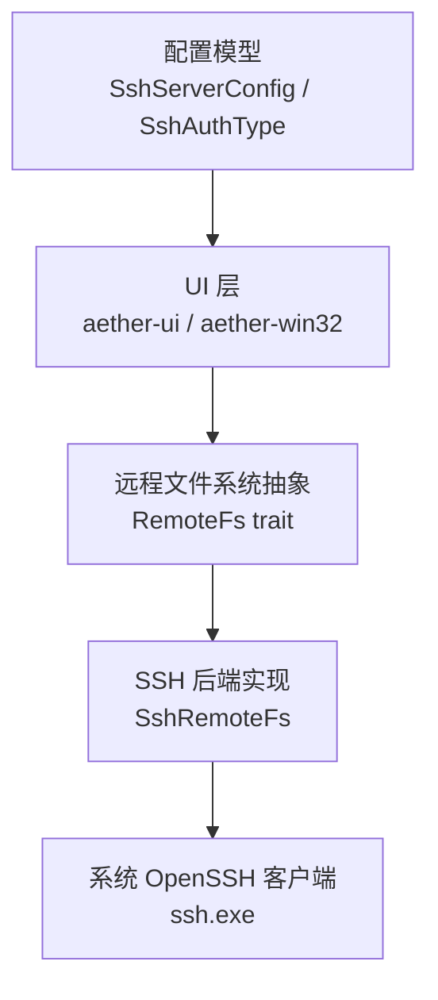
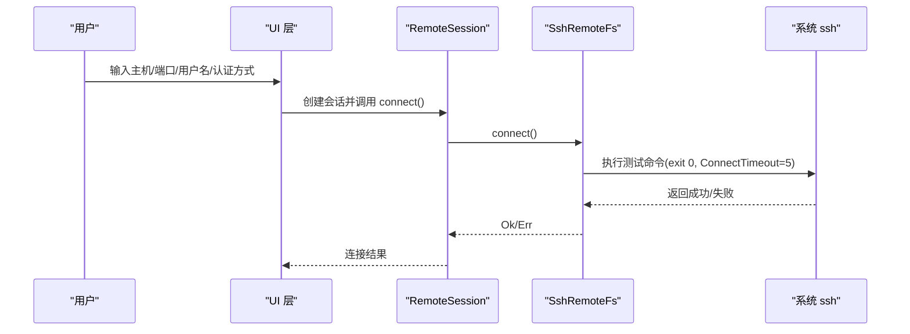
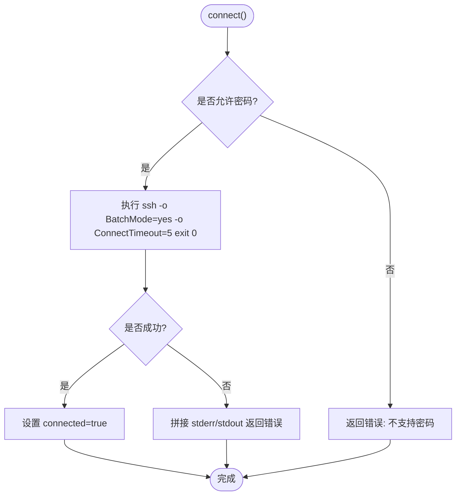
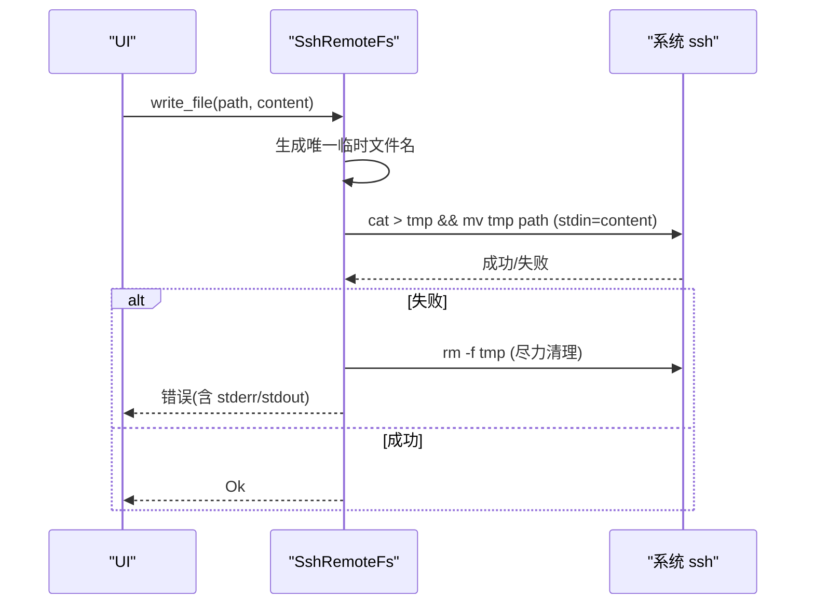
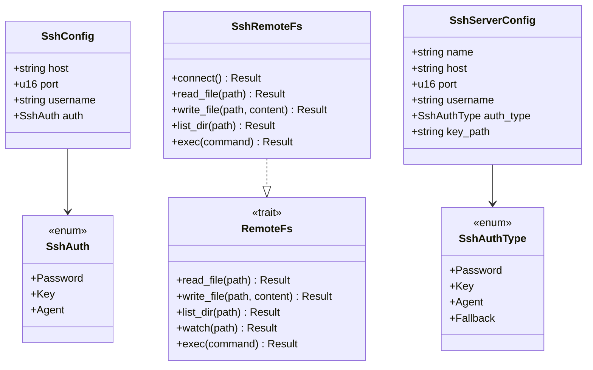

# SSH 连接管理

<cite>
**本文引用的文件**
- [ssh.rs](file://crates/aether-remote/src/ssh.rs)
- [remote_fs.rs](file://crates/aether-remote/src/remote_fs.rs)
- [settings.rs](file://crates/aether-shared/src/settings.rs)
- [ssh.rs（UI）](file://crates/aether-ui/src/ssh.rs)
- [ssh.rs（Win32 UI）](file://crates/aether-win32/src/ssh.rs)
</cite>

## 目录
1. [简介](#简介)
2. [项目结构](#项目结构)
3. [核心组件](#核心组件)
4. [架构总览](#架构总览)
5. [详细组件分析](#详细组件分析)
6. [依赖关系分析](#依赖关系分析)
7. [性能考量](#性能考量)
8. [故障排查指南](#故障排查指南)
9. [结论](#结论)
10. [附录](#附录)

## 简介
本模块提供通过系统 OpenSSH 客户端进行远程文件系统访问的能力，实现 SSH 连接的建立、认证（密钥与 ssh-agent）、连接状态管理与基础错误处理。当前实现采用“shell out”模式调用系统 ssh 二进制，零编译期依赖，运行期依赖系统 ssh；因此不支持密码交互式输入，推荐使用密钥或 ssh-agent 认证。

## 项目结构
SSH 相关代码分布在以下 crate：
- aether-remote: 核心 SSH 远程文件系统实现，封装对系统 ssh 的调用，提供 read/write/list/exec 等能力。
- aether-shared: 持久化配置模型 SshServerConfig 与认证类型枚举 SshAuthType。
- aether-ui / aether-win32: 用户界面层，负责收集用户输入、校验并转换为底层 SshConfig，驱动连接与文件浏览。

图表来源
- [ssh.rs:101-263](file://crates/aether-remote/src/ssh.rs#L101-L263)
- [remote_fs.rs:26-44](file://crates/aether-remote/src/remote_fs.rs#L26-L44)
- [settings.rs:269-310](file://crates/aether-shared/src/settings.rs#L269-L310)
- [ssh.rs（UI）:80-106](file://crates/aether-ui/src/ssh.rs#L80-L106)

章节来源
- [ssh.rs:1-403](file://crates/aether-remote/src/ssh.rs#L1-L403)
- [remote_fs.rs:1-268](file://crates/aether-remote/src/remote_fs.rs#L1-L268)
- [settings.rs:269-310](file://crates/aether-shared/src/settings.rs#L269-L310)
- [ssh.rs（UI）:1-616](file://crates/aether-ui/src/ssh.rs#L1-L616)
- [ssh.rs（Win32 UI）:1-606](file://crates/aether-win32/src/ssh.rs#L1-L606)

## 核心组件
- SshConfig：包含 host、port、username、auth 的连接配置。
- SshAuth：认证方式枚举，支持 Password、Key、Agent。当前 shell out 模式禁用 Password。
- SshRemoteFs：基于系统 ssh 的远程文件系统实现，提供 connect/read_file/write_file/list_dir/exec/watch。
- RemoteFs trait：统一远程文件系统接口，定义 read/write/list/exec/watch 等方法。
- SshServerConfig / SshAuthType：持久化的服务器配置与认证类型。
- UI 会话与对话框：SshConnectionDialog、RemoteSession、RemoteFileTree 等，用于交互与展示。

章节来源
- [ssh.rs:42-106](file://crates/aether-remote/src/ssh.rs#L42-L106)
- [remote_fs.rs:26-44](file://crates/aether-remote/src/remote_fs.rs#L26-L44)
- [settings.rs:269-310](file://crates/aether-shared/src/settings.rs#L269-L310)
- [ssh.rs（UI）:22-182](file://crates/aether-ui/src/ssh.rs#L22-L182)

## 架构总览
SSH 模块采用“抽象 + 具体实现”的分层设计：
- UI 层负责表单输入、校验、转换配置并发起连接。
- 核心层通过 RemoteFs trait 屏蔽不同后端差异，当前由 SshRemoteFs 实现。
- 底层通过系统 ssh 命令执行远程操作，所有路径参数均做安全转义与注入防护。

图表来源
- [ssh.rs（UI）:128-154](file://crates/aether-ui/src/ssh.rs#L128-L154)
- [ssh.rs:130-154](file://crates/aether-remote/src/ssh.rs#L130-L154)

## 详细组件分析

### 连接建立与状态管理
- 连接测试：使用 BatchMode=yes 与 ConnectTimeout=5 快速验证连通性，避免阻塞与交互提示。
- 软状态：connected 标志位表示已通过 connect() 验证；由于每次操作独立调用 ssh，无持久连接。
- 断开：仅重置 connected 标志。

图表来源
- [ssh.rs:130-154](file://crates/aether-remote/src/ssh.rs#L130-L154)

章节来源
- [ssh.rs:130-164](file://crates/aether-remote/src/ssh.rs#L130-L164)

### 认证机制
- 支持的认证方式：
  - Agent：默认推荐，利用 ssh-agent 管理密钥。
  - Key：指定私钥路径，可选 passphrase（当前 UI 未传递 passphrase）。
  - Password：在 shell out 模式下不可用（无 tty），已被多处拦截并回退为 Agent。
- 配置转换：
  - UI 层将表单转换为 SshConfig，Password 选项被强制回退为 Agent。
  - 持久化配置 SshServerConfig 中的未知值会按 Fallback 语义等同 Agent。

章节来源
- [ssh.rs:42-77](file://crates/aether-remote/src/ssh.rs#L42-L77)
- [ssh.rs（UI）:80-106](file://crates/aether-ui/src/ssh.rs#L80-L106)
- [settings.rs:269-310](file://crates/aether-shared/src/settings.rs#L269-L310)

### 连接池与并发
- 当前实现无连接池：每次读写/列表/执行都独立启动 ssh 进程。
- 软状态用于后台线程复用已验证的配置，避免重复探测。

章节来源
- [ssh.rs:117-128](file://crates/aether-remote/src/ssh.rs#L117-L128)

### 超时与重连策略
- 连接超时：ConnectTimeout=5 秒，确保快速失败。
- 重连策略：当前未内置自动重试；调用方可在 UI 层根据错误信息提示并重试。

章节来源
- [ssh.rs:143-154](file://crates/aether-remote/src/ssh.rs#L143-L154)

### 与远程文件系统的集成
- 读取文件：通过 cat 输出二进制内容。
- 写入文件：通过 stdin 管道写入临时文件，再原子 mv 到目标路径，失败时尽力清理临时文件。
- 列出目录：使用 find + stat 获取条目名称、大小、修改时间、类型。
- 执行命令：exec 直接转发 stdout/stderr；受限命令 exec_restricted 提供白名单与元字符过滤。

图表来源
- [ssh.rs:285-321](file://crates/aether-remote/src/ssh.rs#L285-L321)

章节来源
- [ssh.rs:265-401](file://crates/aether-remote/src/ssh.rs#L265-L401)
- [remote_fs.rs:26-94](file://crates/aether-remote/src/remote_fs.rs#L26-L94)

### 安全性考虑
- 命令注入防护：
  - base_args 中拒绝以 '-' 开头的 username/host，防止被解释为 ssh 选项。
  - 路径使用单引号包裹并转义内部单引号，避免 shell 注入。
  - exec_restricted 提供严格命令白名单与 shell 元字符过滤。
- 已知主机检查：StrictHostKeyChecking=accept-new，首次连接自动接受新主机。
- 敏感信息脱敏：Debug 实现中对密码/passphrase 进行遮蔽。

章节来源
- [ssh.rs:166-202](file://crates/aether-remote/src/ssh.rs#L166-L202)
- [ssh.rs:26-28](file://crates/aether-remote/src/ssh.rs#L26-L28)
- [remote_fs.rs:51-94](file://crates/aether-remote/src/remote_fs.rs#L51-L94)
- [ssh.rs:53-68](file://crates/aether-remote/src/ssh.rs#L53-L68)

## 依赖关系分析
- UI 层依赖 aether_remote::ssh 提供的 SshConfig/SshAuth/SshRemoteFs。
- 核心层依赖系统 ssh 二进制，不引入第三方 SSH 库。
- 配置层提供持久化模型，UI 层负责转换与校验。

图表来源
- [ssh.rs:42-106](file://crates/aether-remote/src/ssh.rs#L42-L106)
- [remote_fs.rs:26-44](file://crates/aether-remote/src/remote_fs.rs#L26-L44)
- [settings.rs:269-310](file://crates/aether-shared/src/settings.rs#L269-L310)

章节来源
- [ssh.rs:1-403](file://crates/aether-remote/src/ssh.rs#L1-L403)
- [remote_fs.rs:1-268](file://crates/aether-remote/src/remote_fs.rs#L1-L268)
- [settings.rs:269-310](file://crates/aether-shared/src/settings.rs#L269-L310)

## 性能考量
- 进程开销：每次操作启动一次 ssh 子进程，适合低频操作；高频场景建议在上层缓存目录结果或合并请求。
- 连接超时：ConnectTimeout=5 秒，快速失败减少等待。
- 原子写入：临时文件 + mv 保证一致性，避免部分写入损坏。
- 批量列举：使用 find + stat 一次性获取属性，减少多次往返。
- 未来优化方向：
  - 可考虑在应用层维护轻量级连接池（例如复用长期运行的 ssh 通道），但需权衡复杂性与安全性。
  - 增加重试与退避策略，提升网络抖动下的稳定性。

[本节为通用指导，不直接分析具体文件]

## 故障排查指南
- 无法连接：
  - 确认系统已安装 OpenSSH 且 ssh 在 PATH 中可用。
  - 检查主机名/端口/用户名是否正确，以及密钥路径是否存在。
  - 查看 connect() 返回的错误信息（包含 stderr/stdout）。
- 认证失败：
  - 优先使用 Agent 或 Key；Password 在当前实现中不可用。
  - 若使用 Key，请确认私钥权限正确且未被加密保护（passphrase 未传入）。
- 写入失败：
  - 检查远程路径权限与磁盘空间。
  - 失败时会尝试删除临时文件，但仍可能残留 .tmp.* 文件，可手动清理。
- 命令执行限制：
  - 使用 exec_restricted 时，命令必须在白名单内且不包含 shell 元字符。

章节来源
- [ssh.rs:130-154](file://crates/aether-remote/src/ssh.rs#L130-L154)
- [ssh.rs:285-321](file://crates/aether-remote/src/ssh.rs#L285-L321)
- [remote_fs.rs:51-94](file://crates/aether-remote/src/remote_fs.rs#L51-L94)

## 结论
该 SSH 连接管理模块以最小依赖实现了安全的远程文件访问能力，适用于 Windows 开发环境。通过严格的输入校验、命令白名单与原子写入，保障了基本的安全性与数据一致性。当前实现无连接池与自动重试，适合中小规模使用；如需更高吞吐与稳定性，可在上层引入重试与缓存策略。

[本节为总结，不直接分析具体文件]

## 附录

### SshConfig 配置项说明
- host：远程主机地址（IP 或域名）。
- port：SSH 端口，默认 22。
- username：登录用户名。
- auth：认证方式，推荐 Agent 或 Key；Password 在当前实现中不可用。

章节来源
- [ssh.rs:70-99](file://crates/aether-remote/src/ssh.rs#L70-L99)

### SshAuth 认证方式说明
- Agent：使用 ssh-agent 管理的密钥。
- Key：指定私钥路径，可选 passphrase（当前未传入）。
- Password：shell out 模式不支持，会被拦截并回退为 Agent。

章节来源
- [ssh.rs:42-68](file://crates/aether-remote/src/ssh.rs#L42-L68)
- [ssh.rs（UI）:80-106](file://crates/aether-ui/src/ssh.rs#L80-L106)

### 连接超时与重连策略
- 连接超时：ConnectTimeout=5 秒。
- 重连：未内置自动重试，建议在 UI 层根据错误提示用户重试。

章节来源
- [ssh.rs:143-154](file://crates/aether-remote/src/ssh.rs#L143-L154)

### SSH 服务器配置示例（概念性）
- 启用公钥认证：在服务器端为用户添加 ~/.ssh/authorized_keys 对应公钥。
- 限制协议与算法：建议使用 SSHv2，禁用弱算法。
- 限制登录用户：使用 AllowUsers/AllowGroups 控制访问。
- 日志与审计：开启详细日志以便排查问题。

[本节为通用指导，不直接分析具体文件]

### 错误处理机制
- 连接失败：返回包含 stderr/stdout 的详细错误信息。
- 写入失败：尽力清理临时文件，返回错误信息。
- 命令执行：exec_restricted 提供白名单与元字符过滤，违规将被拒绝。

章节来源
- [ssh.rs:143-154](file://crates/aether-remote/src/ssh.rs#L143-L154)
- [ssh.rs:285-321](file://crates/aether-remote/src/ssh.rs#L285-L321)
- [remote_fs.rs:51-94](file://crates/aether-remote/src/remote_fs.rs#L51-L94)