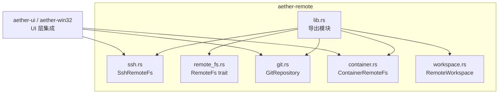
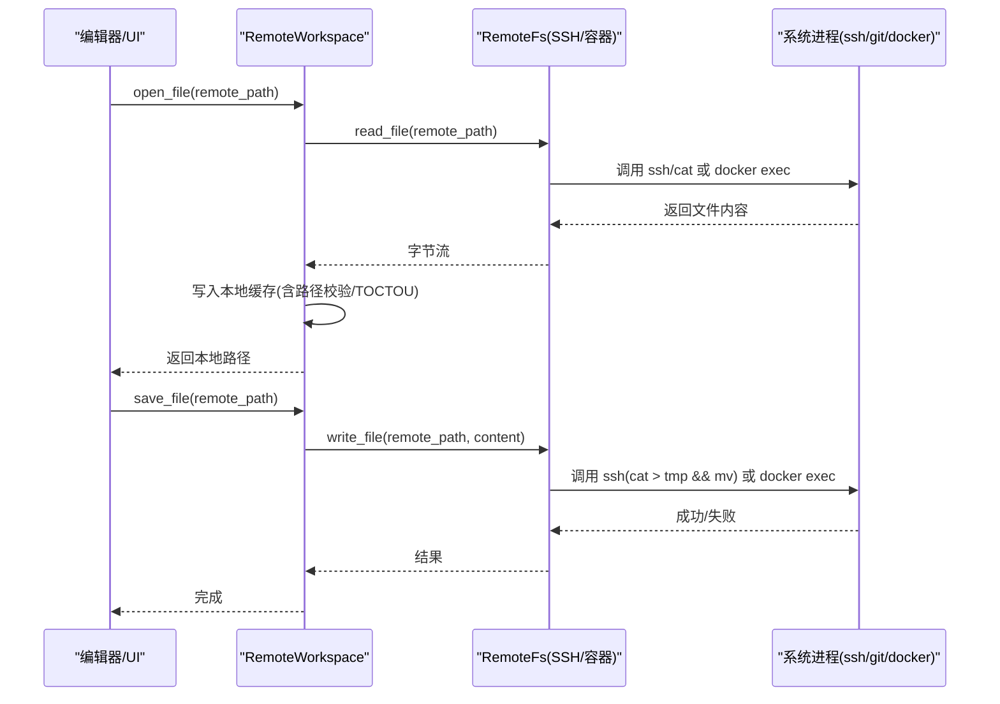
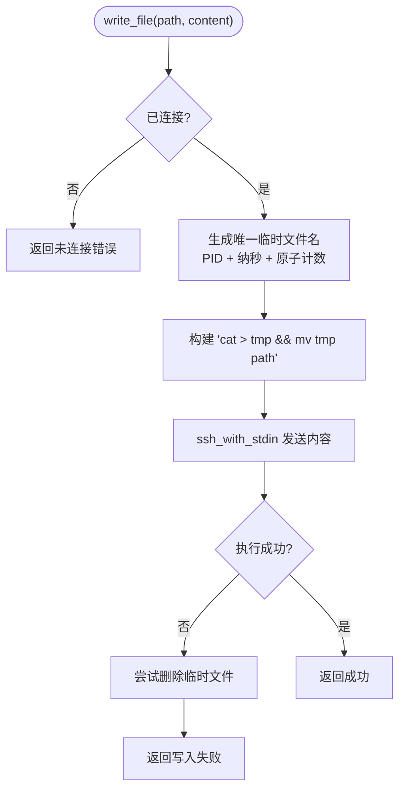
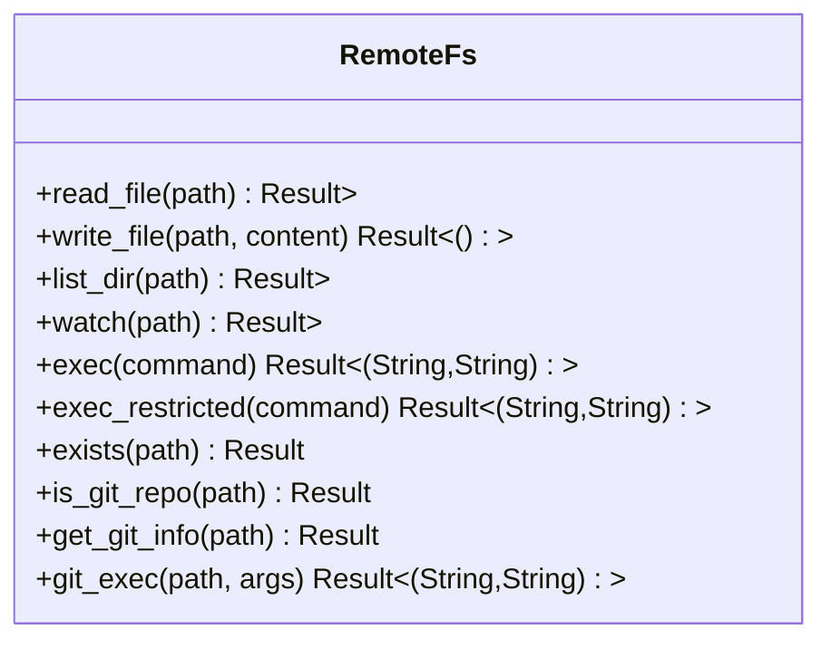
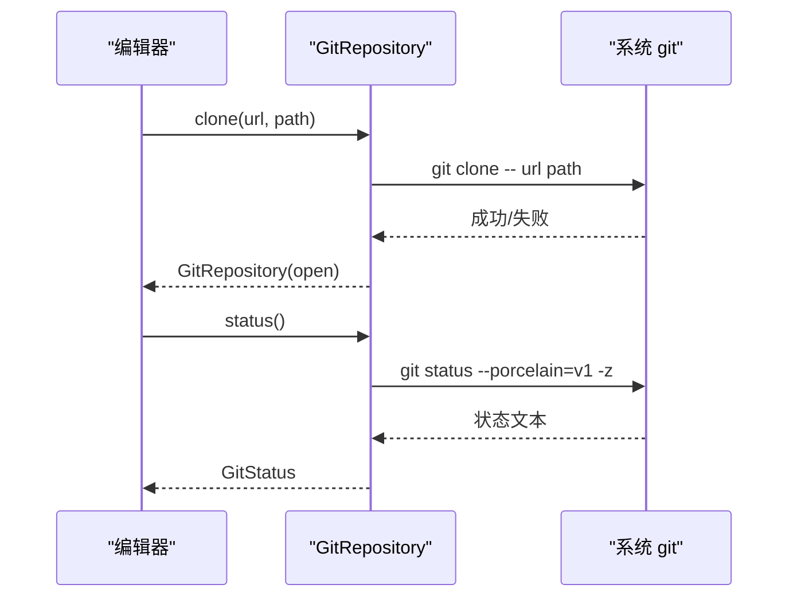
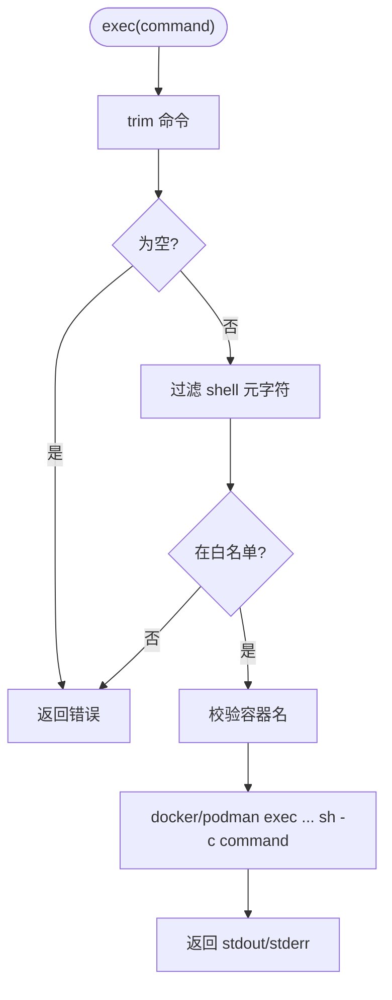
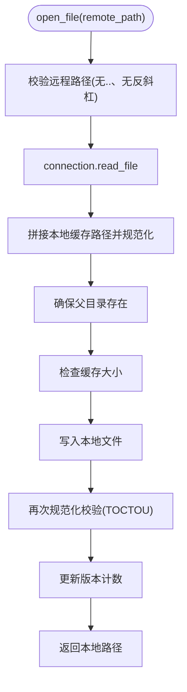
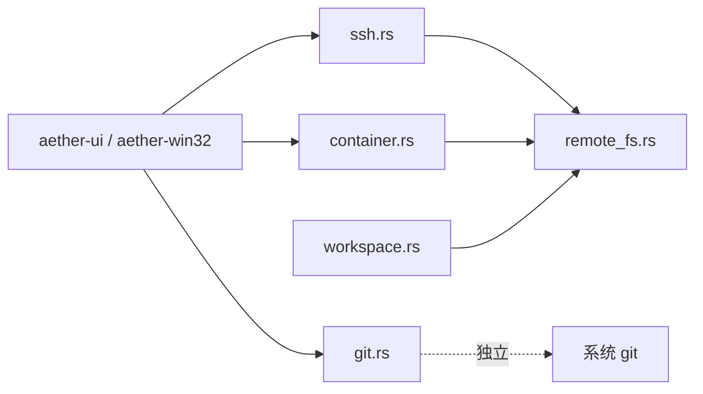

# aether-remote 远程开发

<cite>
**本文引用的文件**
- [lib.rs](file://crates/aether-remote/src/lib.rs)
- [ssh.rs](file://crates/aether-remote/src/ssh.rs)
- [remote_fs.rs](file://crates/aether-remote/src/remote_fs.rs)
- [git.rs](file://crates/aether-remote/src/git.rs)
- [container.rs](file://crates/aether-remote/src/container.rs)
- [workspace.rs](file://crates/aether-remote/src/workspace.rs)
- [tests.rs](file://crates/aether-remote/src/tests.rs)
- [Cargo.toml](file://crates/aether-remote/Cargo.toml)
- [remote.rs](file://crates/aether-win32/src/editor/remote.rs)
- [ssh.rs](file://crates/aether-ui/src/ssh.rs)
</cite>

## 目录
1. [简介](#简介)
2. [项目结构](#项目结构)
3. [核心组件](#核心组件)
4. [架构总览](#架构总览)
5. [详细组件分析](#详细组件分析)
6. [依赖关系分析](#依赖关系分析)
7. [性能与缓存策略](#性能与缓存策略)
8. [故障排查指南](#故障排查指南)
9. [结论](#结论)
10. [附录：配置与使用示例](#附录配置与使用示例)

## 简介
aether-remote 是“牧羊人编辑器”的远程开发模块，提供统一的远程文件系统抽象，支持通过 SSH 访问远程主机、在容器中执行命令、以及本地 Git 仓库管理。该模块以“零运行时库依赖”的设计为目标：SSH 与 Git 均通过调用系统二进制（ssh、git）实现，容器后端通过 docker/podman 命令行交互。模块同时提供安全加固（命令白名单、元字符过滤、路径校验）、原子写入、连接探测、错误处理与审计日志等能力，便于上层 UI 和编辑器集成。

## 项目结构
aether-remote 采用按功能划分的 crate 组织方式，核心文件职责如下：
- lib.rs：模块与公共类型导出
- ssh.rs：基于系统 ssh 的远程文件系统实现
- remote_fs.rs：统一 RemoteFs trait、受限命令执行、Git 信息获取与辅助类型
- git.rs：本地 Git 仓库管理（clone/pull/push/commit/log/branch 等）
- container.rs：容器后端（Docker/Podman）命令执行与占位文件系统接口
- workspace.rs：远程工作区，负责本地缓存、同步、路径校验与大小清理
- tests.rs：覆盖关键行为与安全边界用例
- Cargo.toml：crate 元数据与依赖

图表来源
- [lib.rs:1-17](file://crates/aether-remote/src/lib.rs#L1-L17)
- [ssh.rs:1-403](file://crates/aether-remote/src/ssh.rs#L1-L403)
- [remote_fs.rs:1-268](file://crates/aether-remote/src/remote_fs.rs#L1-L268)
- [git.rs:1-531](file://crates/aether-remote/src/git.rs#L1-L531)
- [container.rs:1-130](file://crates/aether-remote/src/container.rs#L1-L130)
- [workspace.rs:1-251](file://crates/aether-remote/src/workspace.rs#L1-L251)

章节来源
- [lib.rs:1-17](file://crates/aether-remote/src/lib.rs#L1-L17)
- [Cargo.toml:1-13](file://crates/aether-remote/Cargo.toml#L1-L13)

## 核心组件
- RemoteFs trait：定义 read_file/write_file/list_dir/watch/exec/exec_restricted 等统一接口，并提供 exists/is_git_repo/get_git_info/git_exec 等通用实现。
- SshRemoteFs：基于系统 ssh 的二进制调用实现远程文件系统；支持密钥/agent 认证；原子写入；目录枚举；远程命令执行。
- ContainerRemoteFs：基于 docker/podman 的 exec 命令执行；内置命令白名单与元字符过滤；容器名校验。
- GitRepository：封装 git CLI，提供 clone/open/status/add/commit/checkout_branch/list_branches/log/pull/push 等操作。
- RemoteWorkspace：对 RemoteFs 进行本地缓存与同步，包含路径校验、TOCTOU 防护、缓存大小限制与自动清理。

章节来源
- [remote_fs.rs:26-186](file://crates/aether-remote/src/remote_fs.rs#L26-L186)
- [ssh.rs:101-403](file://crates/aether-remote/src/ssh.rs#L101-L403)
- [container.rs:21-130](file://crates/aether-remote/src/container.rs#L21-L130)
- [git.rs:115-531](file://crates/aether-remote/src/git.rs#L115-L531)
- [workspace.rs:6-251](file://crates/aether-remote/src/workspace.rs#L6-L251)

## 架构总览
aether-remote 将“远程访问”抽象为 RemoteFs trait，屏蔽 SSH/容器差异；上层 UI 通过 RemoteWorkspace 管理本地缓存与同步；Git 操作通过 GitRepository 直接调用系统 git。

图表来源
- [workspace.rs:58-123](file://crates/aether-remote/src/workspace.rs#L58-L123)
- [ssh.rs:265-321](file://crates/aether-remote/src/ssh.rs#L265-L321)
- [container.rs:58-123](file://crates/aether-remote/src/container.rs#L58-L123)

## 详细组件分析

### SSH 连接管理与远程文件系统
- 连接与认证
  - 支持 Agent、Key（私钥路径+可选口令），密码模式在 shell out 下不可用（connect 会拒绝）。
  - connect() 通过 BatchMode=yes + ConnectTimeout=5 快速探测连通性。
  - base_args() 组装 -o StrictHostKeyChecking=accept-new、端口、-i 私钥、目标 user@host，并对用户名/主机名做前缀“-”校验防止选项注入。
- 文件读写
  - read_file：通过 ssh cat 读取，二进制安全。
  - write_file：通过 stdin 管道写入临时文件并原子 mv 到目标，避免断连导致损坏；同纳秒并发写通过原子计数器去重临时文件名。
- 目录列举
  - list_dir：使用 find + stat 一次性获取条目属性，解析名称/大小/修改时间/是否目录。
- 命令执行
  - exec：直接转发到远程 shell；记录审计日志。
  - watch：不支持，返回错误。
- 可用性检测
  - ssh_available()：检查系统 PATH 中是否存在 ssh。

图表来源
- [ssh.rs:285-321](file://crates/aether-remote/src/ssh.rs#L285-L321)

章节来源
- [ssh.rs:30-40](file://crates/aether-remote/src/ssh.rs#L30-L40)
- [ssh.rs:101-203](file://crates/aether-remote/src/ssh.rs#L101-L203)
- [ssh.rs:265-403](file://crates/aether-remote/src/ssh.rs#L265-L403)
- [tests.rs:300-399](file://crates/aether-remote/src/tests.rs#L300-L399)

### 远程文件系统抽象与受限命令执行
- RemoteFs trait：统一 read/write/list/watch/exec；默认 exec 返回未实现。
- exec_restricted：严格命令白名单 + shell 元字符过滤，仅允许只读与必要文件操作命令；记录审计日志。
- Git 相关工具方法：
  - is_git_repo：通过 list_dir 检查 .git 是否存在。
  - get_git_info：通过 exec_restricted 获取 remote URL、当前分支、是否有未提交变更。
  - git_exec：对 git 参数进行严格校验（禁止以“-”开头、路径遍历、绝对路径、相对前缀等），再调用 exec_restricted。
- 存在性检查：exists 优先 list_dir 判断目录，否则回退到父目录枚举匹配文件名。

图表来源
- [remote_fs.rs:26-186](file://crates/aether-remote/src/remote_fs.rs#L26-L186)

章节来源
- [remote_fs.rs:26-186](file://crates/aether-remote/src/remote_fs.rs#L26-L186)
- [remote_fs.rs:188-268](file://crates/aether-remote/src/remote_fs.rs#L188-L268)
- [tests.rs:438-528](file://crates/aether-remote/src/tests.rs#L438-L528)

### Git 集成
- 设计取舍：通过系统 git 二进制，编译期零 C 依赖；git_available() 检测可用性。
- 仓库管理：
  - clone/open：校验 .git 目录，推断仓库类型（Local/Ssh/Https）。
  - status：porcelain v1 -z 格式解析，区分 staged/unstaged/untracked/conflicts。
  - add/commit：提交后通过 rev-parse HEAD 获取完整哈希。
  - branch：创建/切换分支，列出本地分支。
  - log：自定义格式输出，解析作者、时间、主题、正文。
  - pull/push：强制 fast-forward 拉取；推送支持 force。
- 安全：对 remote/branch 参数进行“-”前缀校验，防止被解析为标志。

图表来源
- [git.rs:123-184](file://crates/aether-remote/src/git.rs#L123-L184)
- [git.rs:199-257](file://crates/aether-remote/src/git.rs#L199-L257)
- [git.rs:484-494](file://crates/aether-remote/src/git.rs#L484-L494)

章节来源
- [git.rs:15-25](file://crates/aether-remote/src/git.rs#L15-L25)
- [git.rs:115-531](file://crates/aether-remote/src/git.rs#L115-L531)
- [tests.rs:50-298](file://crates/aether-remote/src/tests.rs#L50-L298)

### 容器支持
- 后端：Docker 或 Podman，通过 backend_cmd() 选择命令。
- 命令执行：exec 使用参数列表调用 docker/podman exec container sh -c command；内置：
  - 空命令拒绝
  - shell 元字符过滤
  - 只读/写入命令白名单分离，写入额外审计
  - 容器名合法性校验（仅字母数字、连字符、下划线、点）
- 文件系统：read_file/write_file/list_dir 尚未实现（占位返回错误）。
- watch：明确返回不支持。

图表来源
- [container.rs:58-123](file://crates/aether-remote/src/container.rs#L58-L123)

章节来源
- [container.rs:5-130](file://crates/aether-remote/src/container.rs#L5-L130)
- [tests.rs:562-623](file://crates/aether-remote/src/tests.rs#L562-L623)

### 远程工作区与本地缓存
- 打开文件：从远程读取，写入本地缓存目录；写入前后均进行规范路径校验，防范符号链接 TOCTOU。
- 保存文件：从本地缓存读取，上传至远程；维护版本计数。
- 同步目录：根据远程目录项创建本地目录结构，跳过非法名称（含 ..、/、\）。
- 缓存清理：超过最大阈值（500MB）时，按最旧文件清理至目标的 80%。
- URI 解析：支持 ssh:// 与 container:// 两种协议前缀。

图表来源
- [workspace.rs:58-123](file://crates/aether-remote/src/workspace.rs#L58-L123)
- [workspace.rs:154-206](file://crates/aether-remote/src/workspace.rs#L154-L206)

章节来源
- [workspace.rs:6-251](file://crates/aether-remote/src/workspace.rs#L6-L251)
- [tests.rs:625-776](file://crates/aether-remote/src/tests.rs#L625-L776)

## 依赖关系分析
- 模块内依赖
  - ssh.rs、container.rs 实现 RemoteFs trait，复用 remote_fs.rs 的安全与 Git 工具方法。
  - workspace.rs 依赖 RemoteFs trait 与本地文件系统。
  - git.rs 独立于 RemoteFs，直接调用系统 git。
- 外部依赖
  - 运行期依赖系统二进制：ssh、git、docker/podman。
  - 编译期依赖：serde、serde_json、shell-escape（用于转义）。
- 上层集成
  - aether-ui/aether-win32 通过 aether_remote::ssh 与 aether_remote::git 暴露的类型进行连接、克隆、状态查询等操作。

图表来源
- [lib.rs:1-17](file://crates/aether-remote/src/lib.rs#L1-L17)
- [Cargo.toml:6-9](file://crates/aether-remote/Cargo.toml#L6-L9)
- [remote.rs:1-20](file://crates/aether-win32/src/editor/remote.rs#L1-L20)

章节来源
- [Cargo.toml:6-9](file://crates/aether-remote/Cargo.toml#L6-L9)
- [remote.rs:1-20](file://crates/aether-win32/src/editor/remote.rs#L1-L20)

## 性能与缓存策略
- 批量目录枚举：SSH 端使用 find + stat 一次性获取所有条目，减少往返开销。
- 原子写入：先写临时文件再 mv，避免中断导致文件损坏；同纳秒并发写通过原子计数器避免临时文件名冲突。
- 缓存上限与清理：RemoteWorkspace 维护本地缓存上限（500MB），超限时按最旧文件清理至目标的 80%，避免无限增长。
- 连接探测：connect() 使用短超时与批处理模式，快速失败。
- 建议优化
  - 大文件传输：可考虑分块传输与增量同步（当前为全量读写）。
  - 目录监听：SSH 后端不支持 watch，可在 UI 层定时轮询或使用 fswatch 等机制。
  - 并行化：对非依赖的目录扫描/文件下载可并行化，但需控制并发度以避免 SSH 进程爆炸。

[本节为通用性能讨论，不直接分析具体文件]

## 故障排查指南
- SSH 无法连接
  - 确认系统已安装 ssh 且可用（ssh_available）。
  - 检查密钥路径与权限；Agent 模式下确认代理已加载密钥。
  - connect() 失败时查看 stderr/stdout 中的诊断信息。
- 写入失败
  - 检查远程磁盘空间与权限；临时文件清理逻辑会在失败时尝试删除。
- 命令执行被拒绝
  - exec_restricted 仅允许白名单命令；若包含 shell 元字符会被拒绝。
  - 容器 exec 还会校验容器名合法性。
- Git 操作失败
  - 确认系统已安装 git（git_available）。
  - 分支/远程名不能以“-”开头；pull 仅支持 fast-forward。
- 缓存异常
  - 检查本地缓存目录权限与空间；若触发 TOCTOU 检测，会删除越界文件并报错。

章节来源
- [ssh.rs:30-40](file://crates/aether-remote/src/ssh.rs#L30-L40)
- [ssh.rs:130-154](file://crates/aether-remote/src/ssh.rs#L130-L154)
- [remote_fs.rs:46-94](file://crates/aether-remote/src/remote_fs.rs#L46-L94)
- [container.rs:58-123](file://crates/aether-remote/src/container.rs#L58-L123)
- [git.rs:15-25](file://crates/aether-remote/src/git.rs#L15-L25)
- [workspace.rs:28-99](file://crates/aether-remote/src/workspace.rs#L28-L99)

## 结论
aether-remote 以最小依赖实现了跨平台远程开发的核心能力：SSH 远程文件系统、容器命令执行、Git 仓库管理，并通过 RemoteFs 抽象与 RemoteWorkspace 缓存层，为上层编辑器提供了稳定、安全、易用的远程工作体验。其安全设计（白名单、元字符过滤、路径校验、TOCTOU 防护）与健壮性（原子写入、连接探测、错误诊断）使其适合在生产环境中集成。后续可扩展方向包括：容器文件系统实现、远程文件监视、增量同步与更细粒度的并发控制。

[本节为总结性内容，不直接分析具体文件]

## 附录：配置与使用示例
- SSH 连接配置
  - 使用 SshConfig 指定 host/port/username/auth；推荐 Key 或 Agent 认证。
  - 在 UI 层构造配置并调用 connect() 测试连通性。
- 打开与保存远程文件
  - 通过 RemoteWorkspace.open_file 获取本地缓存路径进行编辑；完成后调用 save_file 同步到远程。
- Git 操作
  - 使用 GitRepository.clone/open 管理仓库；status/add/commit/log 等 API 进行日常协作。
- 容器命令执行
  - 使用 ContainerRemoteFs.exec 执行受控命令；注意白名单与元字符限制。

章节来源
- [ssh.rs:70-100](file://crates/aether-remote/src/ssh.rs#L70-L100)
- [workspace.rs:58-123](file://crates/aether-remote/src/workspace.rs#L58-L123)
- [git.rs:123-184](file://crates/aether-remote/src/git.rs#L123-L184)
- [container.rs:21-130](file://crates/aether-remote/src/container.rs#L21-L130)
- [remote.rs:1-20](file://crates/aether-win32/src/editor/remote.rs#L1-L20)
- [ssh.rs:589-598](file://crates/aether-ui/src/ssh.rs#L589-L598)