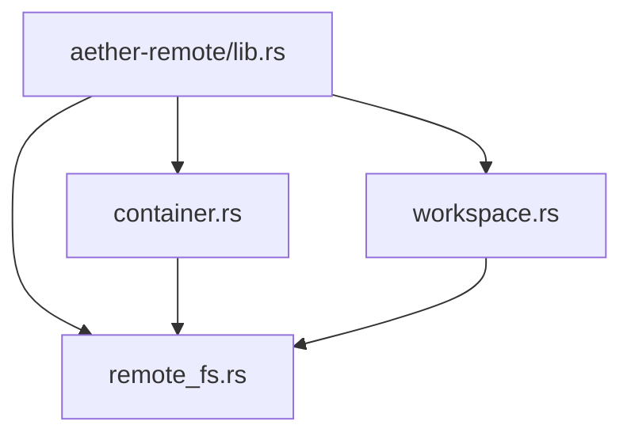
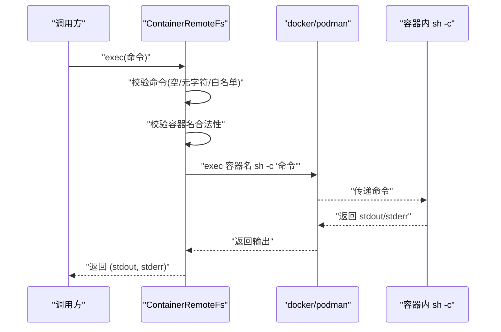
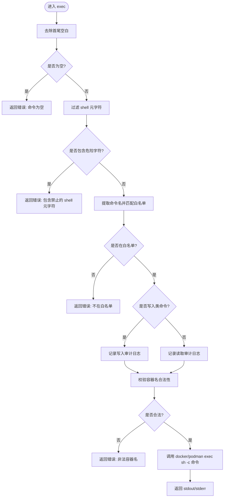
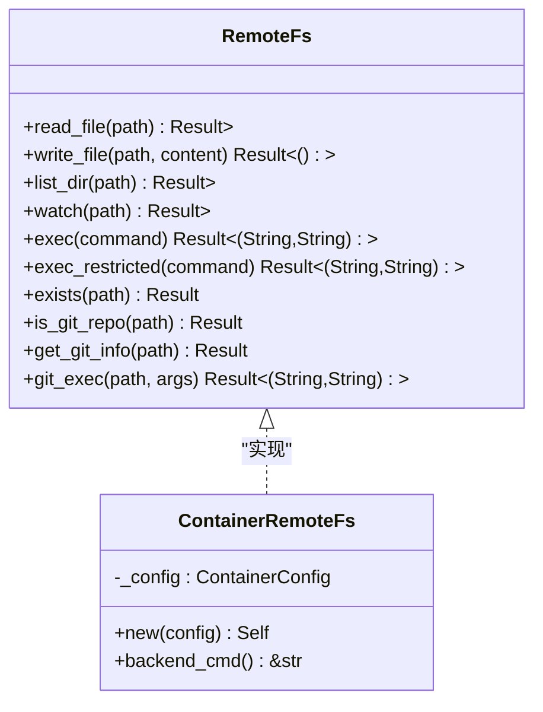
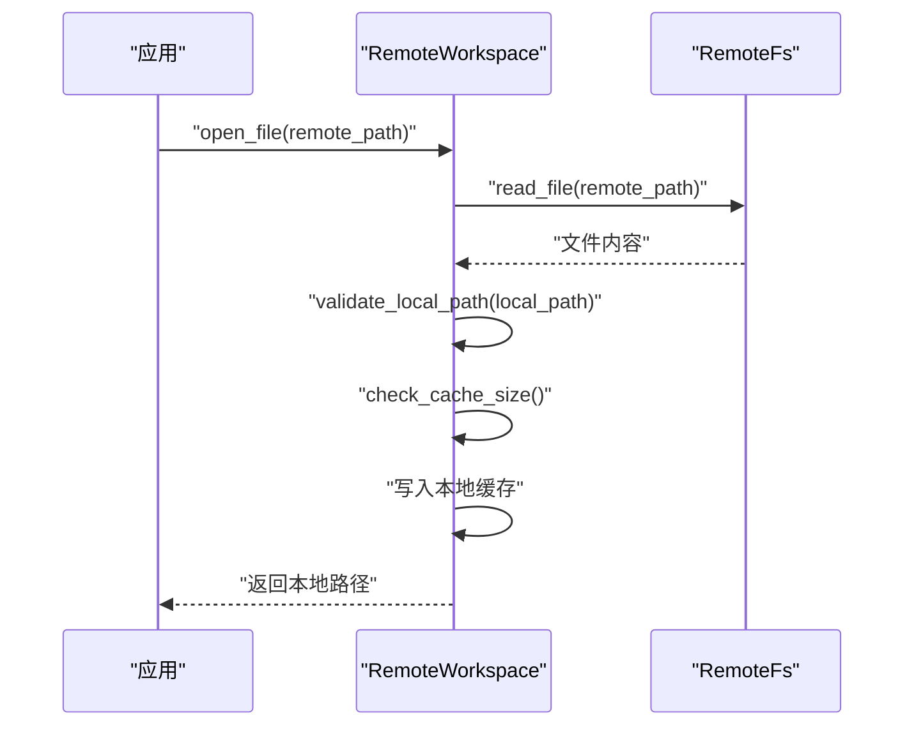
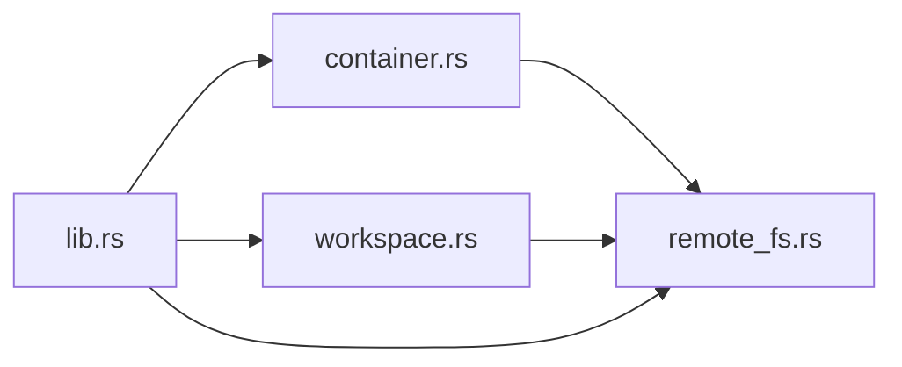

# 容器支持

<cite>
**本文引用的文件**
- [container.rs](file://crates/aether-remote/src/container.rs)
- [remote_fs.rs](file://crates/aether-remote/src/remote_fs.rs)
- [workspace.rs](file://crates/aether-remote/src/workspace.rs)
- [lib.rs](file://crates/aether-remote/src/lib.rs)
- [tests.rs](file://crates/aether-remote/src/tests.rs)
</cite>

## 目录
1. [简介](#简介)
2. [项目结构](#项目结构)
3. [核心组件](#核心组件)
4. [架构总览](#架构总览)
5. [详细组件分析](#详细组件分析)
6. [依赖关系分析](#依赖关系分析)
7. [性能考量](#性能考量)
8. [故障排查指南](#故障排查指南)
9. [结论](#结论)
10. [附录](#附录)

## 简介
本章节面向“容器支持”能力，系统性说明后端抽象、配置管理、远程文件系统实现与远程工作区集成。重点覆盖：
- ContainerBackend 后端抽象（Docker/Podman）
- ContainerConfig 配置项与解析入口
- ContainerRemoteFs 远程文件系统实现（命令执行、安全白名单、审计日志）
- RemoteWorkspace 本地缓存与同步机制
- 与远程开发（SSH/容器）的集成方式与调试支持

当前代码库提供了容器后端的骨架与安全基线，部分功能（如文件读写、目录列举、文件监听、devcontainer.json 解析）尚未实现，但已具备可扩展的安全执行通道。

## 项目结构
与容器支持直接相关的模块位于 aether-remote crate 中，关键文件如下：
- container.rs：定义容器后端枚举、连接配置、容器远程文件系统实现
- remote_fs.rs：定义统一的远程文件系统抽象 trait、Git 相关辅助方法、结果类型与事件类型
- workspace.rs：远程工作区，负责本地缓存、路径校验、大小限制与清理、以及 watch 透传
- lib.rs：对外暴露公共类型与模块
- tests.rs：针对容器执行、URI 解析等的测试用例

图表来源
- [lib.rs:1-18](file://crates/aether-remote/src/lib.rs#L1-L18)
- [container.rs:1-130](file://crates/aether-remote/src/container.rs#L1-L130)
- [remote_fs.rs:1-268](file://crates/aether-remote/src/remote_fs.rs#L1-L268)
- [workspace.rs:1-251](file://crates/aether-remote/src/workspace.rs#L1-L251)

章节来源
- [lib.rs:1-18](file://crates/aether-remote/src/lib.rs#L1-L18)

## 核心组件
- ContainerBackend：容器运行时后端抽象，当前支持 Docker 与 Podman
- ContainerConfig：容器连接配置，包含后端类型、容器名、镜像与工作区挂载路径
- ContainerRemoteFs：基于 RemoteFs trait 的容器实现，提供受限的命令执行通道
- RemoteFs：统一远程文件系统接口，定义读/写/列举/监听/执行/Git 操作等
- RemoteWorkspace：远程工作区，封装本地缓存、路径校验、容量控制与变更监听透传

章节来源
- [container.rs:5-38](file://crates/aether-remote/src/container.rs#L5-L38)
- [remote_fs.rs:5-44](file://crates/aether-remote/src/remote_fs.rs#L5-L44)
- [workspace.rs:6-26](file://crates/aether-remote/src/workspace.rs#L6-L26)

## 架构总览
容器支持通过 RemoteFs trait 将不同后端（SSH、容器）统一为一致的文件系统访问语义；ContainerRemoteFs 在 exec 路径上实现了严格的安全策略（元字符过滤、命令白名单、容器名校验），并通过 RemoteWorkspace 提供本地缓存与同步能力。

图表来源
- [container.rs:58-123](file://crates/aether-remote/src/container.rs#L58-L123)

章节来源
- [container.rs:58-123](file://crates/aether-remote/src/container.rs#L58-L123)

## 详细组件分析

### ContainerBackend 与 ContainerConfig
- ContainerBackend：枚举区分 Docker 与 Podman，用于选择外部命令
- ContainerConfig：保存后端类型、容器名、镜像与工作区挂载路径
- backend_cmd：根据后端返回可执行文件名（docker 或 podman）

设计要点
- 简单明确的后端选择，便于后续扩展更多容器运行时
- 配置项聚焦于运行期所需的最小集合

章节来源
- [container.rs:5-38](file://crates/aether-remote/src/container.rs#L5-L38)

### ContainerRemoteFs 远程文件系统实现
- 实现 RemoteFs trait，当前仅实现 exec 路径，其余方法返回未实现错误
- exec 流程包含：
  - 审计日志记录
  - 空命令检查
  - Shell 元字符过滤（防止命令注入）
  - 命令白名单校验（只读/写入两类命令）
  - 容器名校验（仅允许字母数字、连字符、下划线、点）
  - 使用参数列表调用 docker/podman exec，避免拼接注入
  - 返回标准输出与标准错误

安全策略
- 元字符过滤：拒绝 ; | & ` $ > < \n \r ( ) \ ' " * ? [ ] { } ~ # !
- 白名单：
  - 只读：ls, cat, pwd, echo, find, grep, head, tail, wc, stat, file, which, diff, sort, uniq, tr, less, more, uname, whoami, id, ps, df, du
  - 写入：mkdir, touch, cp, mv, rm, chmod, chown
- 容器名校验：防止注入 Docker 标志
- 审计日志：对 exec 与写入类命令进行审计输出

图表来源
- [container.rs:58-123](file://crates/aether-remote/src/container.rs#L58-L123)

章节来源
- [container.rs:58-123](file://crates/aether-remote/src/container.rs#L58-L123)

### RemoteFs 抽象与 Git 辅助
- RemoteFs trait 定义了 read_file、write_file、list_dir、watch、exec、exists、is_git_repo、get_git_info、git_exec 等方法
- exec_restricted 提供默认的安全执行通道：
  - 空命令检查
  - 元字符过滤
  - 最小化命令白名单（包含基础文件操作、系统信息、Git 读取、压缩归档等）
  - 审计日志
  - 委托给具体后端的 exec
- Git 相关：
  - get_git_info：通过 git -C 获取远程地址、当前分支、是否有未提交更改
  - git_exec：对 git 参数进行严格校验（不以 - 开头、无路径遍历、非绝对路径、无前缀 ./~/）
  - validate_git_path：提前校验路径安全性

图表来源
- [remote_fs.rs:26-186](file://crates/aether-remote/src/remote_fs.rs#L26-L186)
- [container.rs:21-38](file://crates/aether-remote/src/container.rs#L21-L38)

章节来源
- [remote_fs.rs:26-186](file://crates/aether-remote/src/remote_fs.rs#L26-L186)

### RemoteWorkspace 远程工作区
- 职责：
  - 打开远程文件并下载到本地缓存（按需）
  - 保存本地修改到远程
  - 同步远程目录结构到本地缓存
  - 监听远程文件变更（透传给底层 RemoteFs）
- 安全与健壮性：
  - 路径校验：防止路径遍历（远程路径与本地路径均校验）
  - TOCTOU 防护：写入后重新 canonicalize 验证仍在缓存目录内
  - 缓存大小限制：超过阈值自动清理最旧文件至目标比例
- URI 解析：支持 ssh://host/path 与 container://name/path 格式

图表来源
- [workspace.rs:58-100](file://crates/aether-remote/src/workspace.rs#L58-L100)

章节来源
- [workspace.rs:58-100](file://crates/aether-remote/src/workspace.rs#L58-L100)
- [workspace.rs:154-206](file://crates/aether-remote/src/workspace.rs#L154-L206)
- [workspace.rs:234-250](file://crates/aether-remote/src/workspace.rs#L234-L250)

## 依赖关系分析
- container.rs 依赖 remote_fs.rs 中的 RemoteFs trait、RemoteDirEntry、FsEvent、Result
- workspace.rs 依赖 remote_fs.rs 中的 RemoteFs trait、FsEvent、Result
- lib.rs 导出 container、remote_fs、workspace 的公共类型

图表来源
- [container.rs:1-4](file://crates/aether-remote/src/container.rs#L1-L4)
- [workspace.rs:1-5](file://crates/aether-remote/src/workspace.rs#L1-L5)
- [lib.rs:1-18](file://crates/aether-remote/src/lib.rs#L1-L18)

章节来源
- [container.rs:1-4](file://crates/aether-remote/src/container.rs#L1-L4)
- [workspace.rs:1-5](file://crates/aether-remote/src/workspace.rs#L1-L5)
- [lib.rs:1-18](file://crates/aether-remote/src/lib.rs#L1-L18)

## 性能考量
- 命令执行开销：每次 exec 都会启动外部进程（docker/podman），频繁调用会带来显著开销。建议：
  - 批量操作合并为单次命令
  - 复用长驻会话（未来可扩展）
- 缓存策略：RemoteWorkspace 提供本地缓存与自动清理，避免无限增长；合理设置缓存目录与清理阈值可提升 I/O 性能
- 白名单与校验：exec_restricted 与 exec 的白名单与元字符过滤带来额外 CPU 开销，但在安全前提下可接受

[本节为通用指导，不直接分析具体文件]

## 故障排查指南
常见错误与定位要点：
- 命令为空：exec 前会检查空字符串，若为空则直接返回错误
- 包含禁止的 shell 元字符：任何包含 ; | & ` $ > < 等字符的命令会被拒绝
- 命令不在白名单：仅允许预定义的只读/写入命令，其他命令将被拒绝
- 非法容器名：容器名必须仅含字母数字、连字符、下划线、点，否则报错
- 未实现的方法：read_file、write_file、list_dir、watch 在当前容器实现中返回“未实现”错误
- devcontainer.json 解析：当前返回“未实现”错误

参考测试用例可帮助复现与验证：
- 容器执行错误路径与白名单行为
- 容器名非法情况
- devcontainer.json 解析失败
- 远程 URI 解析（ssh/container）

章节来源
- [container.rs:58-123](file://crates/aether-remote/src/container.rs#L58-L123)
- [tests.rs:582-623](file://crates/aether-remote/src/tests.rs#L582-L623)

## 结论
当前容器支持提供了稳健的安全执行通道与远程工作区缓存机制，为后续扩展文件操作、监听、生命周期管理打下坚实基础。建议优先完善以下能力：
- 文件读写与目录列举（通过 docker exec 或 docker cp）
- 文件监听（结合 inotify 或容器事件）
- .devcontainer.json 解析与配置映射
- 容器生命周期管理（创建、启动、停止、删除）
- 端口映射、卷挂载、网络配置与资源限制
- 安全策略增强（更细粒度的命令白名单、用户/权限隔离）

[本节为总结性内容，不直接分析具体文件]

## 附录

### 容器环境隔离、资源限制与安全策略（概念性说明）
- 隔离：利用容器运行时提供的命名空间与 cgroups 实现进程、网络、文件系统隔离
- 资源限制：通过 cgroups 限制 CPU、内存、I/O 等资源使用，避免影响宿主机
- 安全策略：
  - 最小权限原则：以非 root 用户运行容器
  - 只读根文件系统：减少攻击面
  - 网络隔离：仅开放必要端口
  - 命令白名单与输入校验：已在 exec 路径实现

[本节为概念性说明，不直接分析具体文件]

### 容器化开发环境配置示例（概念性说明）
- 使用 .devcontainer.json 描述镜像、工具链、端口映射、卷挂载、环境变量等
- 通过 Workspace 的 container:// 协议接入容器工作区
- 结合 RemoteWorkspace 的本地缓存机制，实现高效的编辑体验

[本节为概念性说明，不直接分析具体文件]

### 与远程开发的集成方式与调试支持（概念性说明）
- SSH 与容器双通道：RemoteWorkspace 同时支持 ssh:// 与 container:// 协议
- 调试支持：
  - 通过 exec 执行调试器或查看日志
  - 结合 LSP/DAP 在容器内运行语言服务与调试代理
  - 利用 RemoteWorkspace 的本地缓存加速文件访问

[本节为概念性说明，不直接分析具体文件]