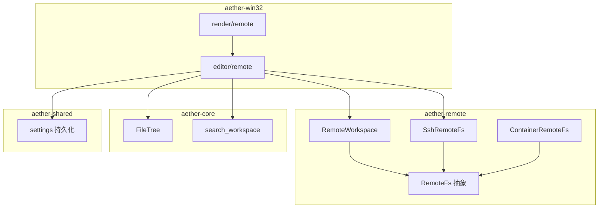
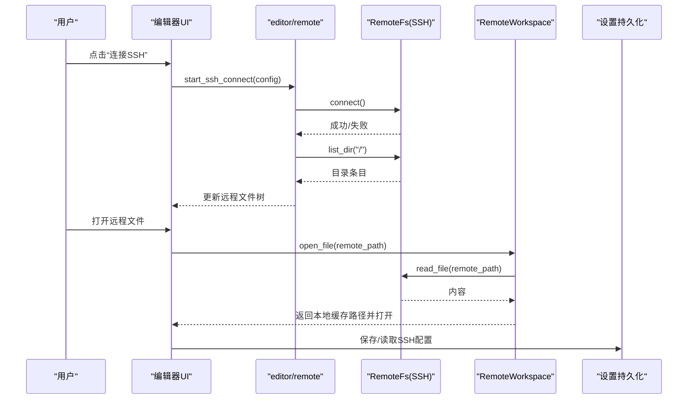
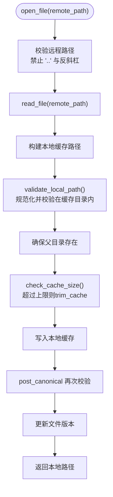
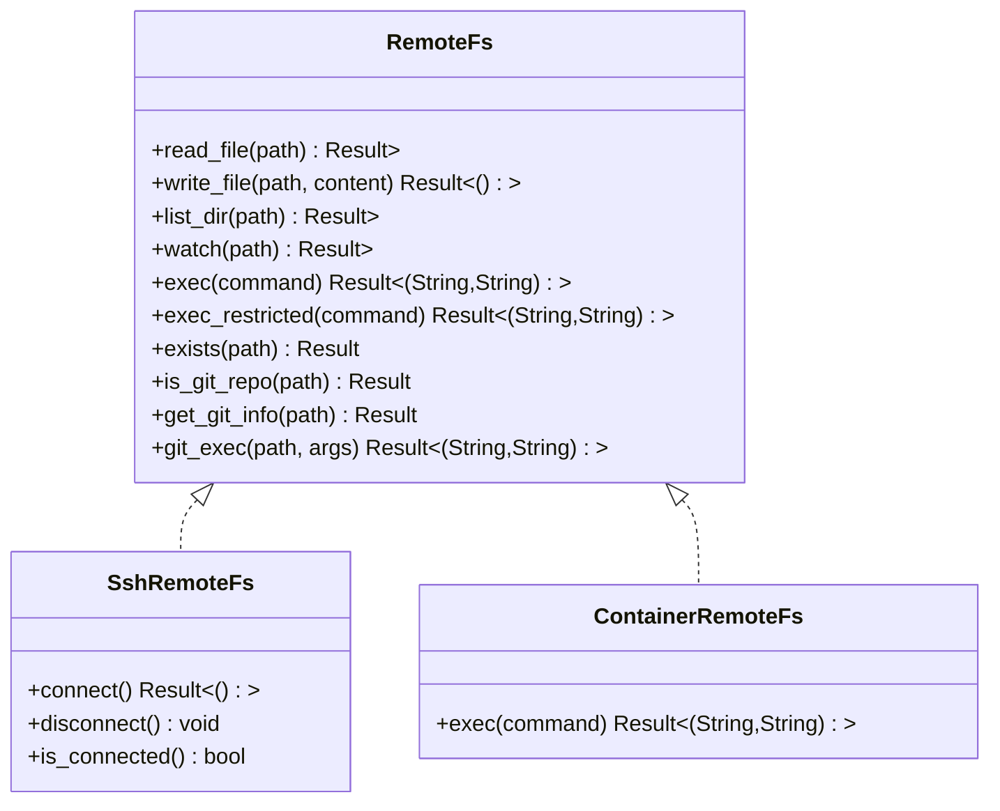
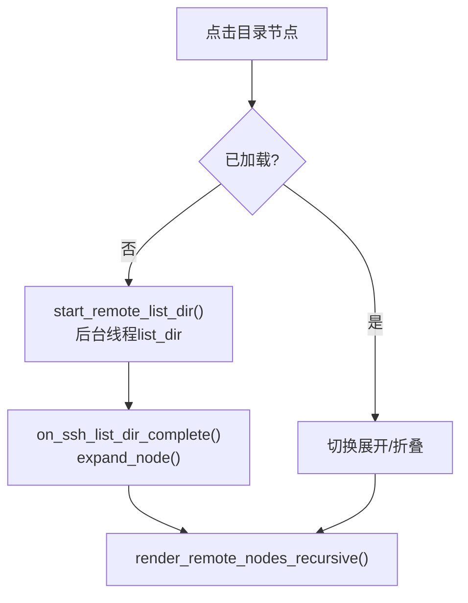
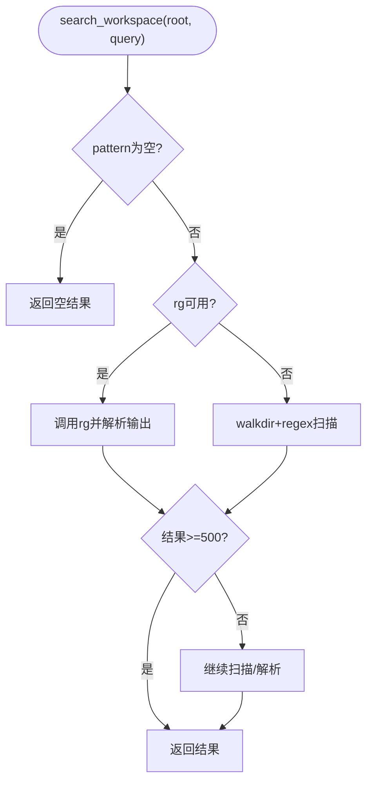
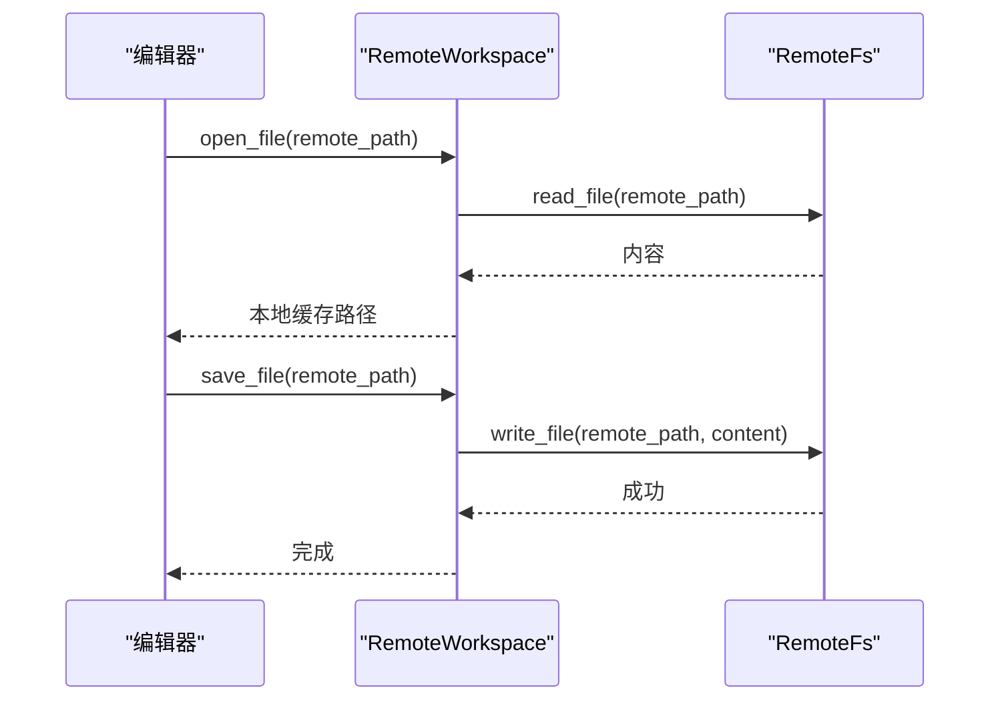
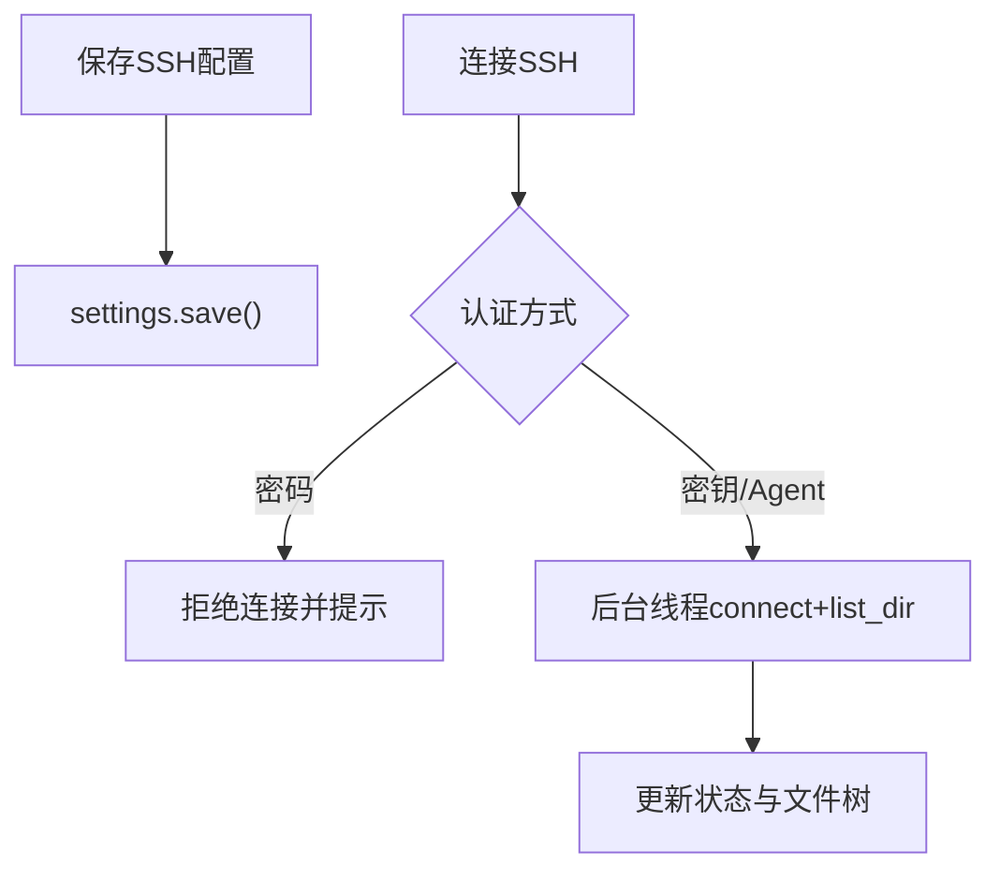
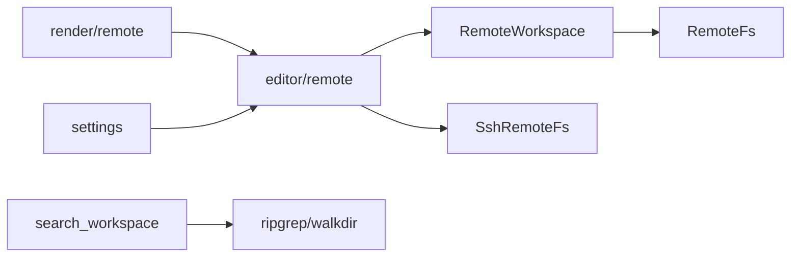

# 工作区管理

<cite>
**本文引用的文件**
- [crates/aether-remote/src/lib.rs](file://crates/aether-remote/src/lib.rs)
- [crates/aether-remote/src/workspace.rs](file://crates/aether-remote/src/workspace.rs)
- [crates/aether-remote/src/remote_fs.rs](file://crates/aether-remote/src/remote_fs.rs)
- [crates/aether-remote/src/ssh.rs](file://crates/aether-remote/src/ssh.rs)
- [crates/aether-remote/src/container.rs](file://crates/aether-remote/src/container.rs)
- [crates/aether-core/src/workspace/file_tree.rs](file://crates/aether-core/src/workspace/file_tree.rs)
- [crates/aether-core/src/search.rs](file://crates/aether-core/src/search.rs)
- [crates/aether-win32/src/editor/remote.rs](file://crates/aether-win32/src/editor/remote.rs)
- [crates/aether-win32/src/render/remote.rs](file://crates/aether-win32/src/render/remote.rs)
- [crates/aether-shared/src/settings.rs](file://crates/aether-shared/src/settings.rs)
</cite>

## 目录
1. [简介](#简介)
2. [项目结构](#项目结构)
3. [核心组件](#核心组件)
4. [架构总览](#架构总览)
5. [详细组件分析](#详细组件分析)
6. [依赖关系分析](#依赖关系分析)
7. [性能考量](#性能考量)
8. [故障排查指南](#故障排查指南)
9. [结论](#结论)
10. [附录：配置与使用示例](#附录配置与使用示例)

## 简介
本文件围绕“远程工作区管理”能力，系统化阐述 RemoteWorkspace 抽象、项目结构与文件组织策略、工作区发现与索引构建、搜索索引与性能优化、与本地编辑器的工作区同步机制、配置共享与状态管理，并提供远程工作区配置示例及多项目管理、团队协作场景下的使用模式。

## 项目结构
远程工作区由以下关键模块组成：
- aether-remote：提供远程文件系统抽象与具体实现（SSH、容器），以及 RemoteWorkspace 工作区缓存与同步逻辑。
- aether-core：提供文件树数据结构与全局搜索能力。
- aether-win32：Windows 端编辑器集成，负责 UI 交互、异步连接、远程文件树渲染与编辑流程。
- aether-shared：应用设置持久化，包含工作区相关配置。

图表来源
- [crates/aether-remote/src/remote_fs.rs:26-186](file://crates/aether-remote/src/remote_fs.rs#L26-L186)
- [crates/aether-remote/src/ssh.rs:101-403](file://crates/aether-remote/src/ssh.rs#L101-L403)
- [crates/aether-remote/src/container.rs:21-130](file://crates/aether-remote/src/container.rs#L21-L130)
- [crates/aether-remote/src/workspace.rs:6-232](file://crates/aether-remote/src/workspace.rs#L6-L232)
- [crates/aether-core/src/workspace/file_tree.rs:1-212](file://crates/aether-core/src/workspace/file_tree.rs#L1-L212)
- [crates/aether-core/src/search.rs:45-171](file://crates/aether-core/src/search.rs#L45-L171)
- [crates/aether-win32/src/editor/remote.rs:1-754](file://crates/aether-win32/src/editor/remote.rs#L1-L754)
- [crates/aether-win32/src/render/remote.rs:1-800](file://crates/aether-win32/src/render/remote.rs#L1-L800)
- [crates/aether-shared/src/settings.rs:455-484](file://crates/aether-shared/src/settings.rs#L455-L484)

章节来源
- [crates/aether-remote/src/lib.rs:1-18](file://crates/aether-remote/src/lib.rs#L1-L18)

## 核心组件
- RemoteWorkspace：封装远程文件系统访问与本地缓存，提供打开/保存文件、目录同步、缓存清理、事件监听等能力。
- RemoteFs：统一远程文件系统接口，支持 SSH、容器等多种后端；内置受限命令执行白名单与安全校验。
- SshRemoteFs：基于系统 ssh 的远程文件系统实现，支持读/写/列目录/命令执行。
- ContainerRemoteFs：容器后端占位实现，提供受限 exec 白名单与审计日志。
- FileTree：紧凑内存布局的文件树，用于高效遍历与懒加载。
- search_workspace：优先使用 ripgrep 的全局搜索，回退到 walkdir + regex。
- Windows 编辑器集成：异步连接、远程文件树渲染、打开/编辑远程文件、配置管理。

章节来源
- [crates/aether-remote/src/workspace.rs:6-232](file://crates/aether-remote/src/workspace.rs#L6-L232)
- [crates/aether-remote/src/remote_fs.rs:26-186](file://crates/aether-remote/src/remote_fs.rs#L26-L186)
- [crates/aether-remote/src/ssh.rs:101-403](file://crates/aether-remote/src/ssh.rs#L101-L403)
- [crates/aether-remote/src/container.rs:21-130](file://crates/aether-remote/src/container.rs#L21-L130)
- [crates/aether-core/src/workspace/file_tree.rs:1-212](file://crates/aether-core/src/workspace/file_tree.rs#L1-L212)
- [crates/aether-core/src/search.rs:45-171](file://crates/aether-core/src/search.rs#L45-L171)
- [crates/aether-win32/src/editor/remote.rs:1-754](file://crates/aether-win32/src/editor/remote.rs#L1-L754)
- [crates/aether-win32/src/render/remote.rs:1-800](file://crates/aether-win32/src/render/remote.rs#L1-L800)

## 架构总览
远程工作区的整体数据流如下：
- 用户通过 UI 发起连接或打开远程文件。
- editor/remote 在后台线程执行连接与目录枚举，完成后回调 UI 线程更新状态。
- RemoteWorkspace 将远程文件按需下载到本地缓存，并进行路径安全校验与缓存大小控制。
- 文件树采用懒加载，展开目录时异步拉取子节点。
- 搜索功能优先调用 ripgrep，失败则回退到本地递归扫描。
- 设置通过 aether-shared 持久化，包括 SSH 服务器列表与工作区最近路径。

图表来源
- [crates/aether-win32/src/editor/remote.rs:4-90](file://crates/aether-win32/src/editor/remote.rs#L4-L90)
- [crates/aether-remote/src/ssh.rs:130-164](file://crates/aether-remote/src/ssh.rs#L130-L164)
- [crates/aether-remote/src/workspace.rs:58-100](file://crates/aether-remote/src/workspace.rs#L58-L100)
- [crates/aether-shared/src/settings.rs:455-484](file://crates/aether-shared/src/settings.rs#L455-L484)

## 详细组件分析

### RemoteWorkspace：远程工作区抽象与缓存同步
- 职责
  - 维护远程连接与本地缓存目录。
  - 打开远程文件时按需下载至本地缓存，写入前进行路径合法性校验与 TOCTOU 防护。
  - 保存修改时将本地缓存内容写回远程。
  - 同步远程目录结构到本地缓存（创建目录）。
  - 自动检查并清理缓存大小，防止无限增长。
  - 暴露 watch 接口以接收远程文件变更事件（取决于后端支持）。
- 安全与健壮性
  - 远程路径校验：拒绝包含 “..” 和反斜杠的路径。
  - 本地路径校验：规范化路径并验证位于缓存目录内，避免路径穿越。
  - 写入后二次校验：检测符号链接替换导致的越界写入，必要时删除越界文件。
  - 版本跟踪：记录文件版本以便后续增量同步扩展。
- 缓存策略
  - 最大缓存限制与目标清理比例。
  - 按修改时间从旧到新删除文件直至降至目标值。

图表来源
- [crates/aether-remote/src/workspace.rs:58-100](file://crates/aether-remote/src/workspace.rs#L58-L100)
- [crates/aether-remote/src/workspace.rs:154-206](file://crates/aether-remote/src/workspace.rs#L154-L206)

章节来源
- [crates/aether-remote/src/workspace.rs:6-232](file://crates/aether-remote/src/workspace.rs#L6-L232)

### RemoteFs 抽象与 SSH/容器后端
- RemoteFs trait
  - 定义统一的读/写/列目录/监听/执行接口。
  - 提供受限命令执行 exec_restricted，内置 shell 元字符过滤与最小化白名单。
  - Git 辅助方法：is_git_repo、get_git_info、git_exec，均通过安全路径校验与参数校验。
- SshRemoteFs
  - 通过系统 ssh 二进制执行远程命令，无持久连接。
  - 认证方式：密钥或 Agent（密码认证在 shell out 模式下不支持）。
  - 原子写入：先写临时文件再 mv 到目标路径，避免中断损坏。
  - 列目录：使用 find + stat 一次性获取属性，空目录处理为无输出。
  - 监听：当前不支持。
- ContainerRemoteFs
  - 通过 docker/podman exec 执行命令，带审计日志与白名单。
  - 读写操作尚未完全实现，监听不支持。

图表来源
- [crates/aether-remote/src/remote_fs.rs:26-186](file://crates/aether-remote/src/remote_fs.rs#L26-L186)
- [crates/aether-remote/src/ssh.rs:101-403](file://crates/aether-remote/src/ssh.rs#L101-L403)
- [crates/aether-remote/src/container.rs:21-130](file://crates/aether-remote/src/container.rs#L21-L130)

章节来源
- [crates/aether-remote/src/remote_fs.rs:26-186](file://crates/aether-remote/src/remote_fs.rs#L26-L186)
- [crates/aether-remote/src/ssh.rs:101-403](file://crates/aether-remote/src/ssh.rs#L101-L403)
- [crates/aether-remote/src/container.rs:21-130](file://crates/aether-remote/src/container.rs#L21-L130)

### 文件树与懒加载
- FileTree
  - 扁平存储节点与字符串池，减少内存碎片与拷贝。
  - 首层目录默认展开，其他目录默认未加载，展开时触发懒加载。
  - O(1) 尾插子节点，维护 first_child/last_child/sibling 链表。
- 编辑器侧远程文件树
  - 首次展开目录时异步拉取子节点，显示加载指示器。
  - 渲染时仅绘制可见区域，支持悬停与选中高亮。

图表来源
- [crates/aether-core/src/workspace/file_tree.rs:78-212](file://crates/aether-core/src/workspace/file_tree.rs#L78-L212)
- [crates/aether-win32/src/editor/remote.rs:153-229](file://crates/aether-win32/src/editor/remote.rs#L153-L229)
- [crates/aether-win32/src/render/remote.rs:128-246](file://crates/aether-win32/src/render/remote.rs#L128-L246)

章节来源
- [crates/aether-core/src/workspace/file_tree.rs:1-212](file://crates/aether-core/src/workspace/file_tree.rs#L1-L212)
- [crates/aether-win32/src/editor/remote.rs:153-229](file://crates/aether-win32/src/editor/remote.rs#L153-L229)
- [crates/aether-win32/src/render/remote.rs:128-246](file://crates/aether-win32/src/render/remote.rs#L128-L246)

### 搜索索引与性能优化
- 搜索策略
  - 优先调用 ripgrep（rg）以获得高性能全文检索。
  - 若 rg 不可用，回退到 walkdir + regex 扫描，限制文件大小与结果数量。
  - 支持正则/字面量匹配、大小写敏感、包含/排除 glob 模式。
- 性能要点
  - 大文件跳过与结果上限，避免 UI 卡顿。
  - 默认排除常见生成目录（target、.git、node_modules）。
  - 解析 rg 输出时限制结果数量，降低内存占用。

图表来源
- [crates/aether-core/src/search.rs:45-171](file://crates/aether-core/src/search.rs#L45-L171)

章节来源
- [crates/aether-core/src/search.rs:45-171](file://crates/aether-core/src/search.rs#L45-L171)

### 与本地编辑器的工作区同步机制
- 打开远程文件
  - 通过 RemoteWorkspace.open_file 拉取远程文件到本地缓存，返回本地路径供编辑器打开。
  - 编辑器将远程路径映射为虚拟 URI，便于区分本地与远程文件。
- 保存修改
  - 编辑器保存时，RemoteWorkspace.save_file 将本地缓存内容写回远程。
  - 版本递增，便于未来增量同步。
- 目录同步
  - sync_tree 将远程目录结构同步到本地缓存，便于快速浏览与懒加载。
- 事件监听
  - watch 接口可接收远程文件变更事件（取决于后端支持）。

图表来源
- [crates/aether-remote/src/workspace.rs:58-123](file://crates/aether-remote/src/workspace.rs#L58-L123)
- [crates/aether-win32/src/editor/remote.rs:397-419](file://crates/aether-win32/src/editor/remote.rs#L397-L419)

章节来源
- [crates/aether-remote/src/workspace.rs:58-123](file://crates/aether-remote/src/workspace.rs#L58-L123)
- [crates/aether-win32/src/editor/remote.rs:397-419](file://crates/aether-win32/src/editor/remote.rs#L397-L419)

### 配置共享与状态管理
- SSH 服务器配置
  - 通过 settings 持久化，支持添加/编辑/删除/连接/断开。
  - 密码认证在 shell out 模式下被禁用，建议使用密钥或 Agent。
- 工作区状态
  - last_workspace 字段单独持久化，避免普通保存覆盖最后打开的工作区。
  - 连接成功后，UI 切换到远程文件树视图，并显示连接信息。

图表来源
- [crates/aether-win32/src/editor/remote.rs:263-336](file://crates/aether-win32/src/editor/remote.rs#L263-L336)
- [crates/aether-shared/src/settings.rs:455-484](file://crates/aether-shared/src/settings.rs#L455-L484)

章节来源
- [crates/aether-win32/src/editor/remote.rs:263-336](file://crates/aether-win32/src/editor/remote.rs#L263-L336)
- [crates/aether-shared/src/settings.rs:455-484](file://crates/aether-shared/src/settings.rs#L455-L484)

## 依赖关系分析
- 耦合度
  - RemoteWorkspace 依赖 RemoteFs 抽象，屏蔽 SSH/容器差异。
  - 编辑器仅依赖 RemoteWorkspace 与 RemoteFs 提供的稳定接口。
- 直接依赖
  - editor/remote → aether_remote::ssh::SshRemoteFs、aether_remote::workspace::RemoteWorkspace。
  - render/remote → editor/remote 的状态与数据。
  - search → 外部工具 ripgrep 或标准库 walkdir。
- 间接依赖
  - settings 持久化影响 UI 行为与连接管理。
- 潜在循环
  - 模块间通过明确接口解耦，未见循环依赖迹象。

图表来源
- [crates/aether-win32/src/editor/remote.rs:1-754](file://crates/aether-win32/src/editor/remote.rs#L1-L754)
- [crates/aether-remote/src/workspace.rs:6-232](file://crates/aether-remote/src/workspace.rs#L6-L232)
- [crates/aether-remote/src/remote_fs.rs:26-186](file://crates/aether-remote/src/remote_fs.rs#L26-L186)
- [crates/aether-core/src/search.rs:45-171](file://crates/aether-core/src/search.rs#L45-L171)
- [crates/aether-shared/src/settings.rs:455-484](file://crates/aether-shared/src/settings.rs#L455-L484)

章节来源
- [crates/aether-win32/src/editor/remote.rs:1-754](file://crates/aether-win32/src/editor/remote.rs#L1-L754)
- [crates/aether-remote/src/workspace.rs:6-232](file://crates/aether-remote/src/workspace.rs#L6-L232)
- [crates/aether-remote/src/remote_fs.rs:26-186](file://crates/aether-remote/src/remote_fs.rs#L26-L186)
- [crates/aether-core/src/search.rs:45-171](file://crates/aether-core/src/search.rs#L45-L171)
- [crates/aether-shared/src/settings.rs:455-484](file://crates/aether-shared/src/settings.rs#L455-L484)

## 性能考量
- 远程 I/O
  - SSH 每次操作独立进程调用，避免持久连接开销但增加延迟；通过 new_connected 复用已验证配置减少重复探测。
  - 原子写入避免网络中断导致的数据损坏。
- 缓存管理
  - 最大缓存限制与按修改时间清理，防止磁盘膨胀。
  - 路径规范化与 TOCTOU 防护提升安全性与稳定性。
- 文件树
  - 懒加载与扁平存储减少初始加载时间与内存占用。
  - 仅绘制可见区域，提升渲染性能。
- 搜索
  - 优先使用 ripgrep，失败回退到 walkdir；限制文件大小与结果数量。
  - 默认排除大型/生成目录，减少扫描范围。

[本节为通用性能讨论，不直接分析具体文件]

## 故障排查指南
- SSH 连接失败
  - 检查是否安装 OpenSSH 且可在 PATH 中调用。
  - 确认认证方式为密钥或 Agent（密码认证不支持）。
  - 查看错误消息中的 stderr/stdout 输出定位问题。
- 远程文件读取失败
  - 确认连接状态与路径合法性。
  - 检查远程权限与路径是否存在。
- 目录加载失败
  - 检查网络连通性与远程目录权限。
  - 查看 UI 状态消息中的错误信息。
- 搜索无结果
  - 确认 ripgrep 是否可用；如不可用，回退扫描可能较慢。
  - 调整 include/exclude 模式，避免误排除。

章节来源
- [crates/aether-win32/src/editor/remote.rs:4-90](file://crates/aether-win32/src/editor/remote.rs#L4-L90)
- [crates/aether-remote/src/ssh.rs:130-164](file://crates/aether-remote/src/ssh.rs#L130-L164)
- [crates/aether-core/src/search.rs:45-171](file://crates/aether-core/src/search.rs#L45-L171)

## 结论
本项目实现了完整的远程工作区管理能力：通过 RemoteWorkspace 抽象与 RemoteFs 接口，屏蔽了 SSH/容器等后端差异；结合本地缓存、懒加载与搜索优化，提供了高效的远程开发体验。Windows 编辑器集成确保了流畅的 UI 交互与状态管理。建议在生产环境中启用严格的命令白名单与路径校验，并结合团队规范配置 SSH 认证与工作区策略。

[本节为总结性内容，不直接分析具体文件]

## 附录：配置与使用示例

### 远程工作区配置示例
- SSH 服务器配置
  - 名称：任意标识符
  - 主机：远程主机地址
  - 端口：默认 22
  - 用户名：登录用户
  - 认证方式：密钥或 Agent（密码认证已禁用）
  - 密钥路径：私钥文件路径（密钥认证时使用）
- 工作区设置
  - last_workspace：最近打开的工作区路径（自动持久化）
  - 主题、字体、窗口位置等 UI 设置

章节来源
- [crates/aether-win32/src/editor/remote.rs:263-336](file://crates/aether-win32/src/editor/remote.rs#L263-L336)
- [crates/aether-shared/src/settings.rs:455-484](file://crates/aether-shared/src/settings.rs#L455-L484)

### 多项目管理与团队协作使用模式
- 多项目
  - 通过 settings 保存多个 SSH 服务器配置，按需切换连接。
  - 每个项目可使用独立的远程仓库与工作目录。
- 团队协作
  - 统一认证方式（推荐密钥或 Agent），避免密码认证带来的兼容性问题。
  - 利用 Git 集成与受限命令白名单，保障远程操作安全。
  - 通过搜索与文件树懒加载，提升大项目协作效率。

[本节为概念性指导，不直接分析具体文件]