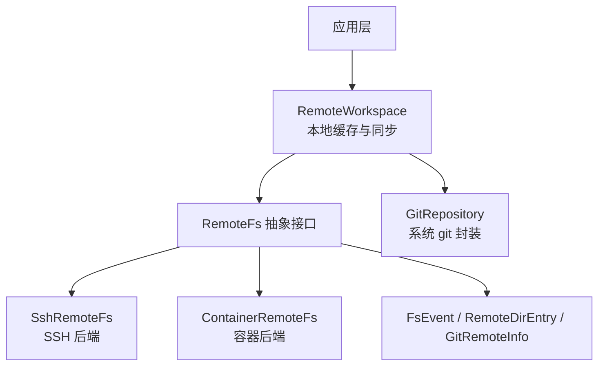
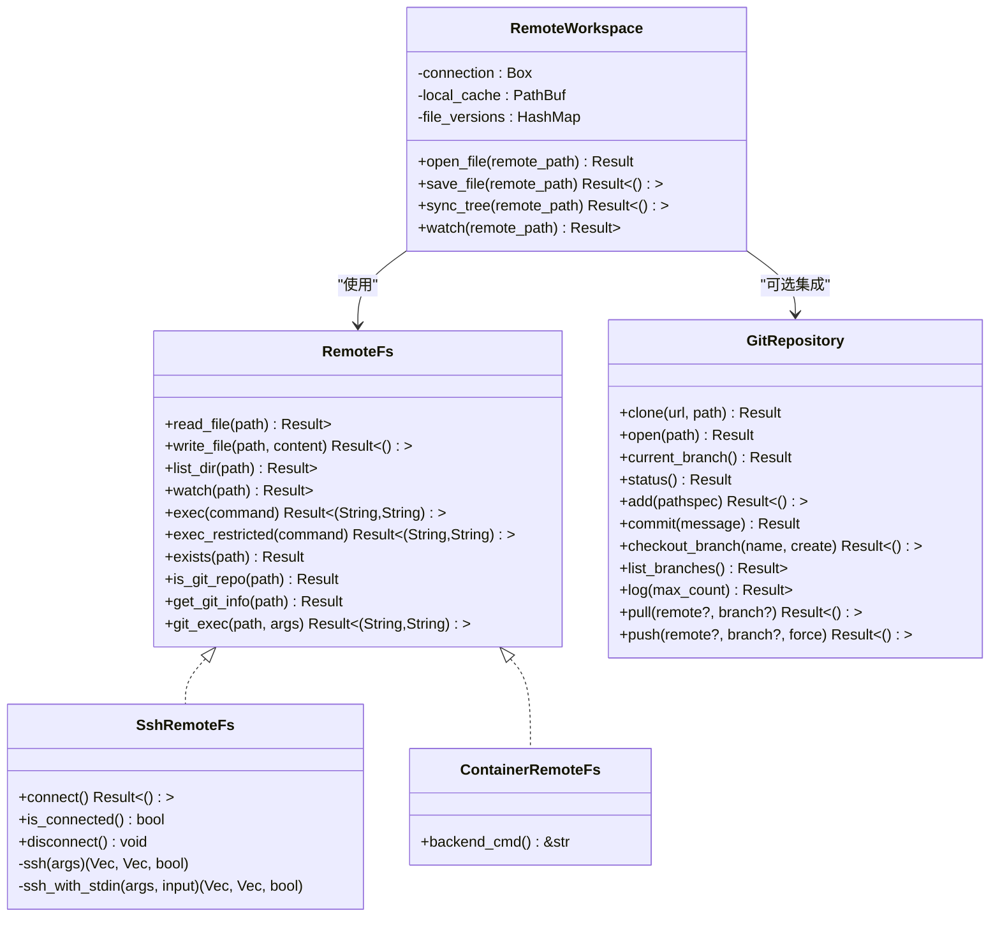
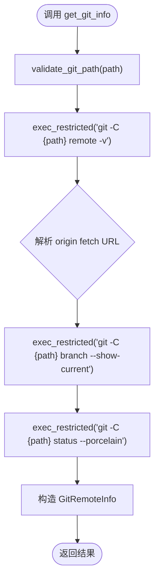
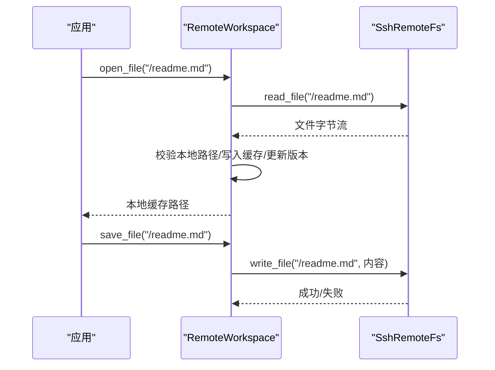
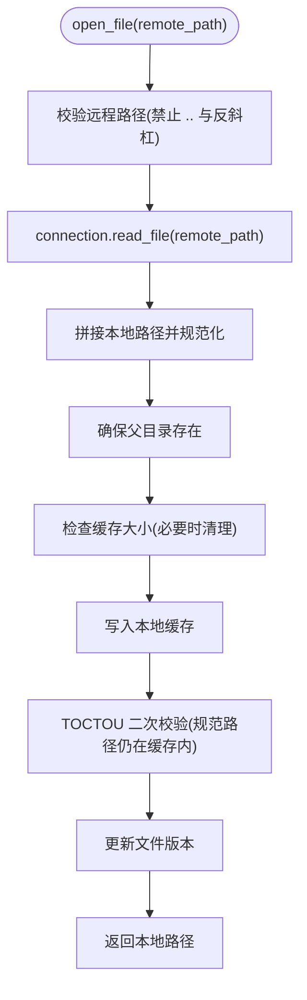
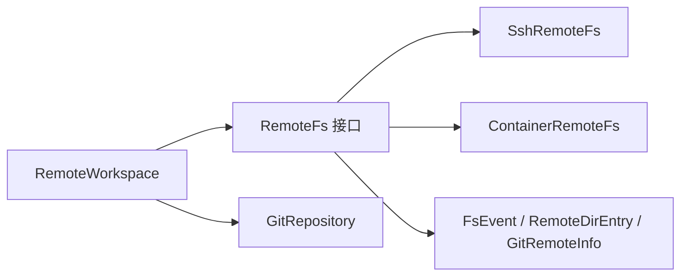

# 远程文件系统

<cite>
**本文引用的文件**
- [lib.rs](file://crates/aether-remote/src/lib.rs)
- [remote_fs.rs](file://crates/aether-remote/src/remote_fs.rs)
- [ssh.rs](file://crates/aether-remote/src/ssh.rs)
- [container.rs](file://crates/aether-remote/src/container.rs)
- [workspace.rs](file://crates/aether-remote/src/workspace.rs)
- [git.rs](file://crates/aether-remote/src/git.rs)
- [tests.rs](file://crates/aether-remote/src/tests.rs)
</cite>

## 目录
1. [简介](#简介)
2. [项目结构](#项目结构)
3. [核心组件](#核心组件)
4. [架构总览](#架构总览)
5. [详细组件分析](#详细组件分析)
6. [依赖关系分析](#依赖关系分析)
7. [性能与缓存](#性能与缓存)
8. [故障排查指南](#故障排查指南)
9. [结论](#结论)
10. [附录：配置示例与同步策略](#附录：配置示例与同步策略)

## 简介
本模块提供统一的远程文件系统抽象，支持通过 SSH 和容器（Docker/Podman）访问远程环境中的文件与命令执行能力。它定义了 RemoteFs 接口、事件 FsEvent、Git 信息获取 GitRemoteInfo、目录条目 RemoteDirEntry，并提供了基于本地缓存的 RemoteWorkspace 用于增量同步与冲突处理。同时包含对系统 git 的封装，便于仓库状态查询、提交历史、分支操作等。

## 项目结构
aether-remote 模块由以下关键部分组成：
- 抽象接口与通用类型：remote_fs.rs
- SSH 后端实现：ssh.rs
- 容器后端实现：container.rs
- 工作区与缓存同步：workspace.rs
- Git 仓库管理：git.rs
- 模块导出：lib.rs
- 测试用例：tests.rs

图表来源
- [remote_fs.rs:26-186](file://crates/aether-remote/src/remote_fs.rs#L26-L186)
- [ssh.rs:101-403](file://crates/aether-remote/src/ssh.rs#L101-L403)
- [container.rs:21-124](file://crates/aether-remote/src/container.rs#L21-L124)
- [workspace.rs:6-232](file://crates/aether-remote/src/workspace.rs#L6-L232)
- [git.rs:115-531](file://crates/aether-remote/src/git.rs#L115-L531)

章节来源
- [lib.rs:1-18](file://crates/aether-remote/src/lib.rs#L1-L18)

## 核心组件
- RemoteFs 抽象接口：统一 read_file、write_file、list_dir、watch、exec/exec_restricted、exists、is_git_repo、get_git_info、git_exec 等方法，屏蔽不同后端的差异。
- SshRemoteFs：通过系统 ssh 二进制进行远程文件读写、目录浏览与命令执行；写入采用原子临时文件+mv 保证一致性。
- ContainerRemoteFs：通过 docker/podman exec 在容器内执行命令；当前为占位实现，部分方法返回未实现错误。
- RemoteWorkspace：维护本地缓存目录、文件版本映射，提供 open_file/save_file/sync_tree/watch 等能力，内置路径校验与缓存清理策略。
- GitRepository：通过系统 git 二进制完成 clone/open/status/log/commit/push/pull/branch 等操作，并提供 GitRepoConfig/GitStatus/GitCommit 等数据结构。
- FsEvent/RemoteDirEntry/GitRemoteInfo：事件、目录条目、Git 信息的标准表示。

章节来源
- [remote_fs.rs:5-194](file://crates/aether-remote/src/remote_fs.rs#L5-L194)
- [ssh.rs:101-403](file://crates/aether-remote/src/ssh.rs#L101-L403)
- [container.rs:21-124](file://crates/aether-remote/src/container.rs#L21-L124)
- [workspace.rs:6-232](file://crates/aether-remote/src/workspace.rs#L6-L232)
- [git.rs:115-531](file://crates/aether-remote/src/git.rs#L115-L531)

## 架构总览
RemoteFs 作为统一抽象，上层 RemoteWorkspace 负责本地缓存与同步策略，具体后端（SSH/容器）实现底层 I/O。Git 功能通过独立模块与系统 git 交互，RemoteFs 中提供受限命令执行与 Git 信息查询入口。

图表来源
- [remote_fs.rs:26-186](file://crates/aether-remote/src/remote_fs.rs#L26-L186)
- [ssh.rs:101-403](file://crates/aether-remote/src/ssh.rs#L101-L403)
- [container.rs:21-124](file://crates/aether-remote/src/container.rs#L21-L124)
- [workspace.rs:6-232](file://crates/aether-remote/src/workspace.rs#L6-L232)
- [git.rs:115-531](file://crates/aether-remote/src/git.rs#L115-L531)

## 详细组件分析

### RemoteFs 抽象接口与通用类型
- 读取/写入/列出目录：read_file、write_file、list_dir 是核心 I/O 能力。
- 监听变更：watch 返回事件通道，若后端不支持则返回错误。
- 命令执行：exec 默认返回未实现；exec_restricted 提供白名单与 shell 元字符过滤，防止注入。
- 存在性与 Git 检测：exists 优先 list_dir，失败时尝试父目录匹配文件名；is_git_repo 检查 .git 目录。
- Git 信息：get_git_info 通过受限命令获取 remote URL、当前分支、是否有未提交更改；git_exec 对参数做严格校验。
- 辅助类型：RemoteDirEntry（名称、是否目录、大小、修改时间）、FsEvent（创建/修改/删除/重命名）、GitRemoteInfo（远程地址、分支、未提交变更）。

图表来源
- [remote_fs.rs:127-185](file://crates/aether-remote/src/remote_fs.rs#L127-L185)
- [remote_fs.rs:196-216](file://crates/aether-remote/src/remote_fs.rs#L196-L216)

章节来源
- [remote_fs.rs:5-194](file://crates/aether-remote/src/remote_fs.rs#L5-L194)

### SSH 后端（SshRemoteFs）
- 连接与认证：connect 使用 BatchMode=yes 与 ConnectTimeout 快速探测；拒绝密码认证（无 TTY），支持密钥或 agent。
- 基础参数：base_args 组装 ssh 参数，校验用户名/主机名不以 '-' 开头，避免被解释为选项。
- 命令执行：ssh/ssh_with_stdin 分别处理无输入与带输入的命令；exec 记录审计日志。
- 文件操作：
  - read_file：通过 cat 读取二进制内容。
  - write_file：先写入同目录临时文件（PID+纳秒+原子计数器），成功后 mv 原子替换，失败时尽力清理临时文件。
  - list_dir：使用 find + stat 一次性获取条目属性，空目录返回空列表。
- 监听：watch 返回不支持错误。

图表来源
- [workspace.rs:58-123](file://crates/aether-remote/src/workspace.rs#L58-L123)
- [ssh.rs:265-321](file://crates/aether-remote/src/ssh.rs#L265-L321)

章节来源
- [ssh.rs:101-403](file://crates/aether-remote/src/ssh.rs#L101-L403)

### 容器后端（ContainerRemoteFs）
- 后端选择：Docker 或 Podman，通过 backend_cmd 决定命令。
- 命令执行：exec 进行 shell 元字符过滤与白名单校验，区分只读与写入命令，写入额外审计；容器名仅允许字母数字、连字符、下划线与点。
- 文件操作：read_file/write_file/list_dir 当前返回未实现错误；watch 返回不支持错误。

章节来源
- [container.rs:21-124](file://crates/aether-remote/src/container.rs#L21-L124)

### 工作区与缓存（RemoteWorkspace）
- 打开文件：从远程读取到本地缓存，确保父目录存在，写入前检查缓存大小，写入后进行 TOCTOU 二次校验。
- 保存文件：从本地缓存读取并写回远程，递增文件版本。
- 同步目录：将远程目录结构同步到本地缓存，跳过非法条目名（含 ..、/、\）。
- 缓存清理：超过最大容量（500MB）时按目标比例（80%）清理最旧文件。
- 监听：转发至后端 watch。

图表来源
- [workspace.rs:28-123](file://crates/aether-remote/src/workspace.rs#L28-L123)
- [workspace.rs:154-206](file://crates/aether-remote/src/workspace.rs#L154-L206)

章节来源
- [workspace.rs:6-232](file://crates/aether-remote/src/workspace.rs#L6-L232)

### Git 仓库管理（GitRepository）
- 可用性与配置：git_available 检查系统 git；GitRepoConfig 支持 SSH/HTTPS/Local 类型解析。
- 仓库操作：clone/open/current_branch/status/add/commit/checkout_branch/list_branches/log/pull/push。
- 安全与健壮性：
  - 分支名/远程名以 '-' 开头会被拒绝，防止被 git 解析为标志。
  - pull 仅允许 fast-forward，非快进合并返回错误以便手动处理。
  - log 使用自定义格式输出提交信息，空仓库返回空列表。
- 数据结构：GitStatus（干净/暂存/未暂存/未跟踪/冲突/分支/领先落后）、GitCommit（id/短id/作者/邮箱/时间/消息/完整消息）。

章节来源
- [git.rs:15-113](file://crates/aether-remote/src/git.rs#L15-L113)
- [git.rs:115-531](file://crates/aether-remote/src/git.rs#L115-L531)

## 依赖关系分析
- RemoteFs 被 SshRemoteFs 与 ContainerRemoteFs 实现，RemoteWorkspace 通过 trait 依赖 RemoteFs。
- RemoteFs 内部依赖 FsEvent、RemoteDirEntry、GitRemoteInfo 等类型。
- GitRepository 独立于 RemoteFs，但可通过 RemoteFs.get_git_info/git_exec 间接协作。
- tests.rs 提供 MockRemoteFs 与多种场景验证，覆盖路径遍历、受限命令、URI 解析、缓存行为等。

图表来源
- [remote_fs.rs:26-194](file://crates/aether-remote/src/remote_fs.rs#L26-L194)
- [workspace.rs:6-232](file://crates/aether-remote/src/workspace.rs#L6-L232)
- [git.rs:115-531](file://crates/aether-remote/src/git.rs#L115-L531)

章节来源
- [tests.rs:438-528](file://crates/aether-remote/src/tests.rs#L438-L528)
- [tests.rs:625-776](file://crates/aether-remote/src/tests.rs#L625-L776)

## 性能与缓存
- 目录列举优化：SSH 后端使用 find + stat 一次性获取所有条目属性，减少多次往返。
- 写入原子性：SSH 写入通过临时文件+mv 保证中断恢复与数据一致性。
- 缓存策略：RemoteWorkspace 限制本地缓存最大 500MB，超出时按 80% 目标清理最旧文件；写入前后进行路径规范化与 TOCTOU 防护。
- 受限命令：exec_restricted 使用白名单与 shell 元字符过滤，降低注入风险与不必要开销。
- Git 状态：status 使用 porcelain v1 -z 格式高效解析，避免复杂文本处理。

[本节为通用性能讨论，不直接分析具体代码行]

## 故障排查指南
- SSH 未连接：read_file/write_file/list_dir/exec 在未 connect 时会报错，需先调用 connect。
- 密码认证不支持：shell out 模式无法交互式输入密码，应使用密钥或 agent。
- 命令被拒绝：exec_restricted 会拒绝不在白名单的命令与包含 shell 元字符的命令；容器 exec 同样有白名单与元字符过滤。
- 路径遍历防护：RemoteWorkspace 对远程路径与本地路径进行校验，发现越界会拒绝并清理异常文件。
- Git 相关错误：pull/push/commit 等操作失败会返回详细 stdout/stderr；空仓库 log 返回空列表而非错误。

章节来源
- [ssh.rs:130-164](file://crates/aether-remote/src/ssh.rs#L130-L164)
- [remote_fs.rs:51-94](file://crates/aether-remote/src/remote_fs.rs#L51-L94)
- [container.rs:58-123](file://crates/aether-remote/src/container.rs#L58-L123)
- [workspace.rs:28-94](file://crates/aether-remote/src/workspace.rs#L28-L94)
- [git.rs:398-482](file://crates/aether-remote/src/git.rs#L398-L482)

## 结论
该模块通过 RemoteFs 抽象统一了 SSH 与容器后端的远程文件访问能力，结合 RemoteWorkspace 的本地缓存与同步机制，实现了高效的远程编辑体验。受限命令执行与路径校验保障了安全性，Git 集成提供了仓库状态与历史管理能力。未来可进一步完善容器后端的文件操作与监听能力，并扩展缓存策略与冲突解决机制。

[本节为总结性内容，不直接分析具体代码行]

## 附录：配置示例与同步策略

### 远程文件操作配置示例
- SSH 配置：
  - 主机、端口、用户名、认证方式（密钥或 agent）
  - 使用前调用 ssh_available 检查可用性
  - 调用 connect 建立连接（拒绝密码认证）
- 容器配置：
  - 后端（Docker/Podman）、容器名、镜像、工作区挂载路径
  - 使用 parse_devcontainer_json（当前未实现）
- Git 配置：
  - 使用 GitRepoConfig::from_url 解析 URL 类型（SSH/HTTPS/Local）
  - 使用 git_available 检查系统 git

章节来源
- [ssh.rs:42-99](file://crates/aether-remote/src/ssh.rs#L42-L99)
- [container.rs:12-38](file://crates/aether-remote/src/container.rs#L12-L38)
- [git.rs:27-68](file://crates/aether-remote/src/git.rs#L27-L68)

### 与本地编辑器的文件同步策略
- 打开文件：RemoteWorkspace.open_file 按需下载到本地缓存，确保路径安全与缓存容量。
- 保存文件：RemoteWorkspace.save_file 将本地缓存内容写回远程，并递增版本。
- 目录同步：RemoteWorkspace.sync_tree 将远程目录结构同步到本地缓存，跳过非法条目名。
- 监听变更：RemoteWorkspace.watch 转发至后端，当前 SSH/容器均返回不支持。

章节来源
- [workspace.rs:58-147](file://crates/aether-remote/src/workspace.rs#L58-L147)
- [workspace.rs:228-231](file://crates/aether-remote/src/workspace.rs#L228-L231)

### 冲突解决机制
- 当前 RemoteWorkspace 使用简单版本号递增，未实现多端冲突检测与自动合并。
- 建议方案：
  - 基于 Git 的冲突检测：利用 GitRepository.status 识别冲突文件，提示用户手动解决。
  - 基于内容的合并：引入三方合并工具或库，在检测到冲突时生成合并结果供用户确认。
  - 锁定机制：在编辑期间对文件加锁，避免并发写入导致的数据不一致。

[本节为概念性建议，不直接分析具体代码行]