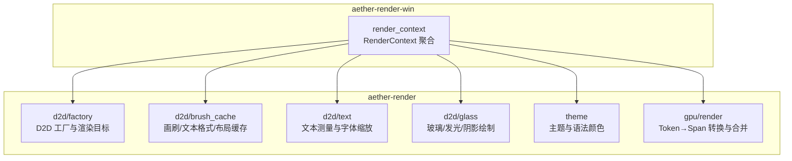
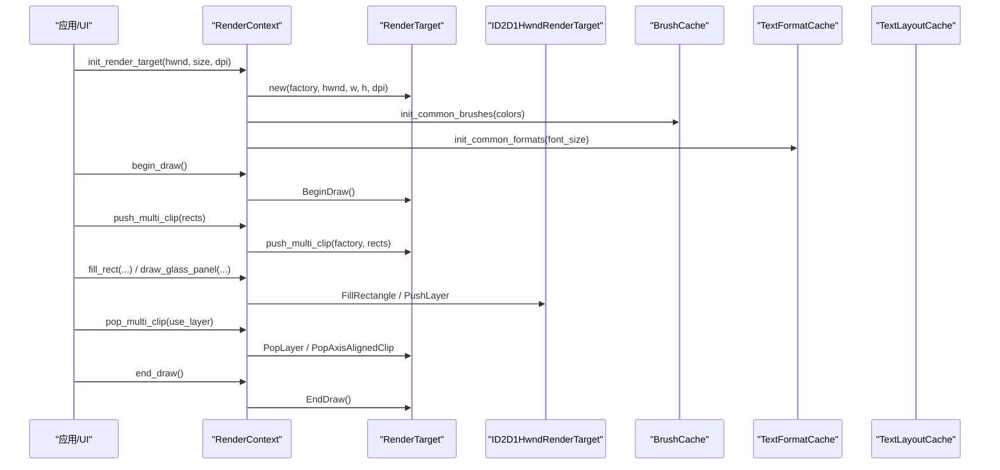
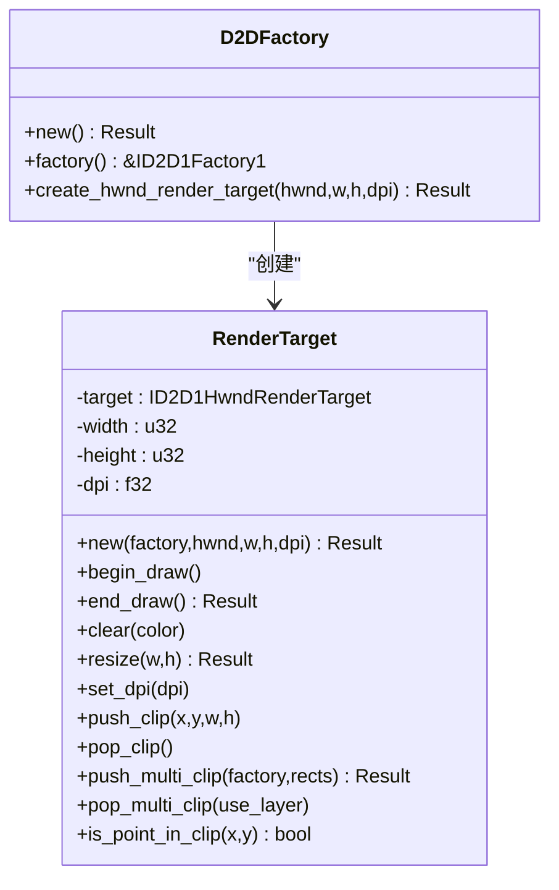
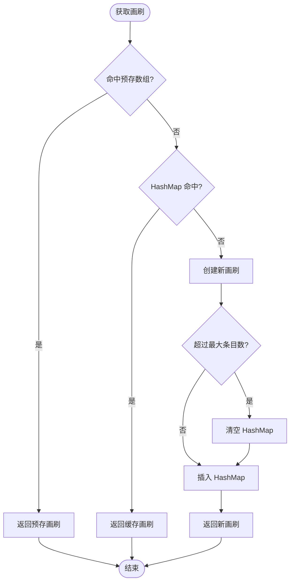
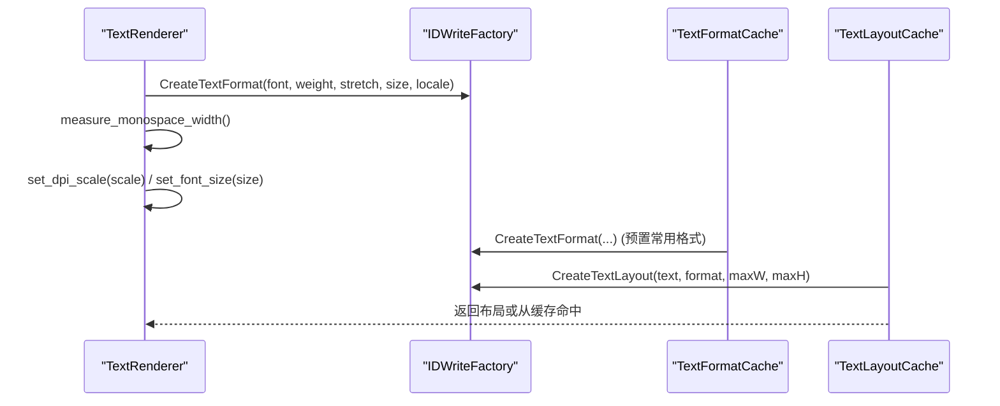
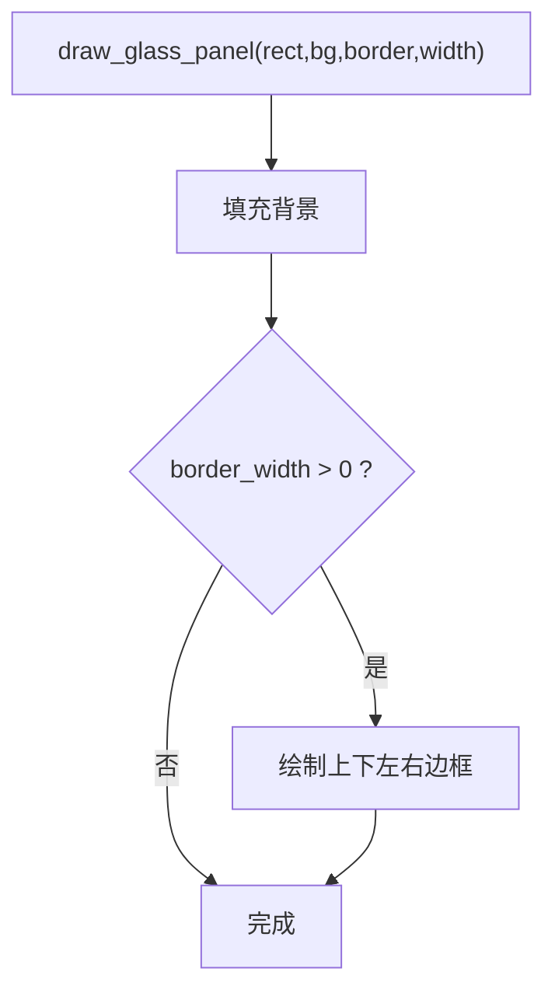
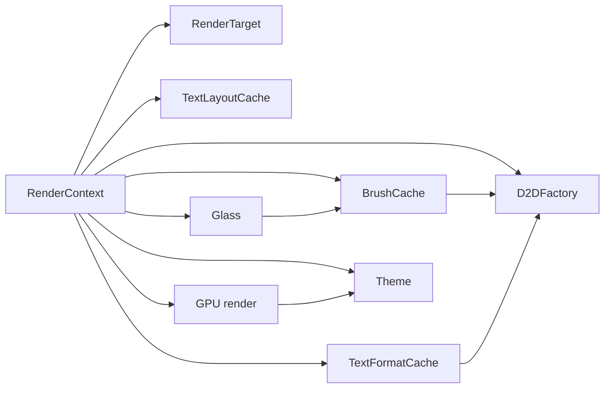

# Direct2D 渲染抽象层

<cite>
**本文引用的文件**
- [aether-render/src/d2d/mod.rs](file://crates/aether-render/src/d2d/mod.rs)
- [aether-render/src/d2d/factory.rs](file://crates/aether-render/src/d2d/factory.rs)
- [aether-render/src/d2d/brush_cache.rs](file://crates/aether-render/src/d2d/brush_cache.rs)
- [aether-render/src/d2d/text.rs](file://crates/aether-render/src/d2d/text.rs)
- [aether-render/src/d2d/glass.rs](file://crates/aether-render/src/d2d/glass.rs)
- [aether-render/src/theme.rs](file://crates/aether-render/src/theme.rs)
- [aether-render/src/lib.rs](file://crates/aether-render/src/lib.rs)
- [aether-render/src/gpu/render.rs](file://crates/aether-render/src/gpu/render.rs)
- [aether-render-win/src/render_context.rs](file://crates/aether-render-win/src/render_context.rs)
</cite>

## 目录
1. [简介](#简介)
2. [项目结构](#项目结构)
3. [核心组件](#核心组件)
4. [架构总览](#架构总览)
5. [详细组件分析](#详细组件分析)
6. [依赖关系分析](#依赖关系分析)
7. [性能考量](#性能考量)
8. [故障排查指南](#故障排查指南)
9. [结论](#结论)
10. [附录：使用示例与最佳实践](#附录使用示例与最佳实践)

## 简介
本文档面向 Direct2D 渲染抽象层，系统性说明画布管理、画笔缓存系统、文本渲染与玻璃效果实现；解释 D2D 工厂模式的使用、资源管理与内存优化策略；并提供基于仓库代码的 API 使用路径、与底层 Windows GDI/DirectWrite 交互方式以及性能调优技巧。该抽象层位于 aether-render crate 中，并在 aether-render-win crate 中以 RenderContext 形式对外暴露统一接口，便于上层 UI 渲染调用。

## 项目结构
Direct2D 渲染抽象层主要分布在以下模块：
- d2d/factory：封装 D2D 工厂与 HWND 渲染目标，提供 DPI、裁剪、绘制生命周期控制
- d2d/brush_cache：画刷与文本格式/布局缓存，避免每帧创建 COM 对象
- d2d/text：文本测量与字体缩放（DirectWrite）
- d2d/glass：毛玻璃/发光/阴影等面板绘制辅助
- theme：主题与语法高亮颜色定义
- gpu/render：GPU 词法结果到渲染 Span 的转换与合并，供上层渲染管线使用
- render_context（Win 绑定）：将上述能力聚合为统一的渲染上下文

图表来源
- [aether-render/src/d2d/factory.rs:14-129](file://crates/aether-render/src/d2d/factory.rs#L14-L129)
- [aether-render/src/d2d/brush_cache.rs:24-105](file://crates/aether-render/src/d2d/brush_cache.rs#L24-L105)
- [aether-render/src/d2d/text.rs:9-52](file://crates/aether-render/src/d2d/text.rs#L9-L52)
- [aether-render/src/d2d/glass.rs:12-62](file://crates/aether-render/src/d2d/glass.rs#L12-L62)
- [aether-render/src/theme.rs:8-31](file://crates/aether-render/src/theme.rs#L8-L31)
- [aether-render/src/gpu/render.rs:7-32](file://crates/aether-render/src/gpu/render.rs#L7-L32)
- [aether-render-win/src/render_context.rs:6-31](file://crates/aether-render-win/src/render_context.rs#L6-L31)

章节来源
- [aether-render/src/lib.rs:1-5](file://crates/aether-render/src/lib.rs#L1-L5)

## 核心组件
- D2D 工厂与渲染目标：单线程工厂 + HWND 渲染目标，支持 DPI、尺寸调整、轴对齐裁剪与多矩形并集裁剪（通过几何组+Layer）
- 画笔缓存：预存常用颜色画刷 + HashMap 回退，限制最大条目数防止无界增长
- 文本格式与布局缓存：DirectWrite 文本格式缓存与 TextLayout 两代淘汰缓存，减少 COM 分配
- 文本渲染器：基于 DirectWrite 的等宽字符宽度测量、DPI/字号缩放
- 玻璃效果：半透明面板、发光选择、阴影、圆角高光等绘制工具
- 主题系统：深色与玻璃主题，语义 token 颜色映射
- GPU 渲染桥接：GPU 生成的 Token 转换为 LexemeSpan，合并相邻同色段以减少绘制调用

章节来源
- [aether-render/src/d2d/factory.rs:14-281](file://crates/aether-render/src/d2d/factory.rs#L14-L281)
- [aether-render/src/d2d/brush_cache.rs:24-105](file://crates/aether-render/src/d2d/brush_cache.rs#L24-L105)
- [aether-render/src/d2d/brush_cache.rs:107-379](file://crates/aether-render/src/d2d/brush_cache.rs#L107-L379)
- [aether-render/src/d2d/text.rs:9-152](file://crates/aether-render/src/d2d/text.rs#L9-L152)
- [aether-render/src/d2d/glass.rs:12-154](file://crates/aether-render/src/d2d/glass.rs#L12-L154)
- [aether-render/src/theme.rs:8-279](file://crates/aether-render/src/theme.rs#L8-L279)
- [aether-render/src/gpu/render.rs:7-126](file://crates/aether-render/src/gpu/render.rs#L7-L126)

## 架构总览
整体渲染流程由 RenderContext 统一管理：初始化 D2D 工厂与渲染目标，预构建常用画刷与文本格式，开始/结束绘制，处理设备丢失与冻结释放，提供裁剪与填充等便捷方法。上层 UI 通过 RenderContext 访问底层 Direct2D/DirectWrite 能力，屏蔽 COM 细节与资源管理。

图表来源
- [aether-render-win/src/render_context.rs:33-79](file://crates/aether-render-win/src/render_context.rs#L33-L79)
- [aether-render/src/d2d/factory.rs:33-129](file://crates/aether-render/src/d2d/factory.rs#L33-L129)
- [aether-render/src/d2d/brush_cache.rs:50-98](file://crates/aether-render/src/d2d/brush_cache.rs#L50-L98)
- [aether-render/src/d2d/brush_cache.rs:140-267](file://crates/aether-render/src/d2d/brush_cache.rs#L140-L267)

## 详细组件分析

### D2D 工厂与渲染目标
- 工厂模式：使用单线程工厂 ID2D1Factory1，创建 HWND 渲染目标，配置硬件加速与 DPI
- 渲染目标：封装 BeginDraw/EndDraw/Clear/Resize/SetDpi，支持轴对齐裁剪与多矩形并集裁剪
- 多矩形裁剪：对多个独立矩形区域进行并集裁剪，避免合并包围盒导致的重绘面积膨胀；内部使用 GeometryGroup + Layer 实现，失败时回退到合并包围盒

图表来源
- [aether-render/src/d2d/factory.rs:14-129](file://crates/aether-render/src/d2d/factory.rs#L14-L129)
- [aether-render/src/d2d/factory.rs:143-281](file://crates/aether-render/src/d2d/factory.rs#L143-L281)

章节来源
- [aether-render/src/d2d/factory.rs:14-281](file://crates/aether-render/src/d2d/factory.rs#L14-L281)

### 画笔缓存系统
- 预存常用画刷：针对高频主题色预先创建 SolidColorBrush，命中时直接复用
- HashMap 回退：不常用颜色走 HashMap，超过最大条目数清空以避免无界增长
- 文本格式缓存：预置 code/line_number/center 三种常用格式，其余走 HashMap
- 文本布局缓存：两代淘汰（young/old），热点自然存活，消除周期性全清雪崩

图表来源
- [aether-render/src/d2d/brush_cache.rs:50-98](file://crates/aether-render/src/d2d/brush_cache.rs#L50-L98)
- [aether-render/src/d2d/brush_cache.rs:140-267](file://crates/aether-render/src/d2d/brush_cache.rs#L140-L267)

章节来源
- [aether-render/src/d2d/brush_cache.rs:24-105](file://crates/aether-render/src/d2d/brush_cache.rs#L24-L105)
- [aether-render/src/d2d/brush_cache.rs:107-379](file://crates/aether-render/src/d2d/brush_cache.rs#L107-L379)

### 文本渲染与测量
- 文本渲染器：基于 DirectWrite 创建文本格式，测量等宽字符宽度，支持 DPI 缩放与字号调整
- 文本测量：使用 TextLayout 精确测量宽度与光标位置，用于子菜单自适应与光标定位
- 布局缓存：按文本内容缓存 TextLayout，避免重复创建 COM 对象

图表来源
- [aether-render/src/d2d/text.rs:19-97](file://crates/aether-render/src/d2d/text.rs#L19-L97)
- [aether-render/src/d2d/brush_cache.rs:140-267](file://crates/aether-render/src/d2d/brush_cache.rs#L140-L267)
- [aether-render/src/d2d/brush_cache.rs:413-456](file://crates/aether-render/src/d2d/brush_cache.rs#L413-L456)

章节来源
- [aether-render/src/d2d/text.rs:9-152](file://crates/aether-render/src/d2d/text.rs#L9-L152)
- [aether-render/src/d2d/brush_cache.rs:107-379](file://crates/aether-render/src/d2d/brush_cache.rs#L107-L379)

### 玻璃效果实现
- 玻璃面板：背景填充 + 可选边框四边绘制
- 发光选择：外层低透明度扩大矩形 + 内层主色矩形叠加
- 面板阴影：底部渐变式阴影条
- 圆角面板：顶部细边框 + 顶部高光条模拟圆角感

图表来源
- [aether-render/src/d2d/glass.rs:12-62](file://crates/aether-render/src/d2d/glass.rs#L12-L62)

章节来源
- [aether-render/src/d2d/glass.rs:12-154](file://crates/aether-render/src/d2d/glass.rs#L12-L154)

### 主题与颜色映射
- 主题结构：包含编辑器背景、行号、选择高亮、侧边栏、状态栏、标题栏、活动栏、面板边框、阴影、发光选择、命令面板、子菜单等颜色
- 语法颜色：关键字、字符串、数字、注释、函数、类型名、操作符、变量、预处理、属性、宏、生命周期、正则、格式化字符串、Markdown、JSON/TOML、查找高亮、语义 token 等
- 默认主题：玻璃主题，深色主题可关闭玻璃效果

章节来源
- [aether-render/src/theme.rs:8-279](file://crates/aether-render/src/theme.rs#L8-L279)

### GPU 渲染桥接
- Token 转换：将 GPU 生成的 Token 转为 LexemeSpan，优先使用语义分类结果
- 合并同色段：相邻相同类型的 Token 合并，减少 DrawText 调用次数
- 颜色映射：根据 TokenKind 映射到主题颜色，供上层渲染使用

章节来源
- [aether-render/src/gpu/render.rs:7-126](file://crates/aether-render/src/gpu/render.rs#L7-L126)

## 依赖关系分析
- RenderContext 依赖 D2DFactory、RenderTarget、BrushCache、TextFormatCache、TextLayoutCache，形成单一入口
- BrushCache 依赖 ID2D1HwndRenderTarget 与 IDWriteFactory，负责 COM 对象缓存
- TextRenderer 依赖 IDWriteFactory，负责文本测量与字体缩放
- Glass 模块依赖 BrushCache 与 D2D 目标，提供高级绘制工具
- Theme 提供颜色常量与映射，被各模块消费
- GPU render 模块与主题协作，将 Token 转换为颜色与 Span

图表来源
- [aether-render-win/src/render_context.rs:6-31](file://crates/aether-render-win/src/render_context.rs#L6-L31)
- [aether-render/src/d2d/brush_cache.rs:24-105](file://crates/aether-render/src/d2d/brush_cache.rs#L24-L105)
- [aether-render/src/d2d/text.rs:9-52](file://crates/aether-render/src/d2d/text.rs#L9-L52)
- [aether-render/src/d2d/glass.rs:12-62](file://crates/aether-render/src/d2d/glass.rs#L12-L62)
- [aether-render/src/theme.rs:8-31](file://crates/aether-render/src/theme.rs#L8-L31)
- [aether-render/src/gpu/render.rs:7-32](file://crates/aether-render/src/gpu/render.rs#L7-L32)

章节来源
- [aether-render-win/src/render_context.rs:6-31](file://crates/aether-render-win/src/render_context.rs#L6-L31)

## 性能考量
- 画刷与文本对象缓存：避免每帧创建 COM 对象，显著降低分配与销毁开销
- 多矩形裁剪：使用几何组与 Layer 实现精确裁剪，避免合并包围盒导致重绘面积膨胀
- 双缓冲与 GPU 并行：DoubleBuffer 与 GPU 缓冲区池减少等待与分配
- 合并同色 Token：减少 DrawText 调用次数，提升渲染吞吐
- 设备丢失处理：及时清空资源并在恢复后重建，避免悬挂引用
- DPI 与字体缩放：按需重建文本格式，保持测量精度

[本节为通用性能讨论，不直接分析具体文件]

## 故障排查指南
- 设备丢失：调用 handle_device_lost 清空渲染目标与缓存，确保后续重建正常
- 冻结态释放：release_for_suspend 额外清空 TextLayout 缓存，唤醒后按需重建
- 多矩形裁剪失败：回退到合并包围盒的轴对齐裁剪，保证基本功能可用
- 文本测量偏差：确保 TextLayout 创建时不包含 null 终止符，与测量函数保持一致

章节来源
- [aether-render-win/src/render_context.rs:219-231](file://crates/aether-render-win/src/render_context.rs#L219-L231)
- [aether-render/src/d2d/factory.rs:172-273](file://crates/aether-render/src/d2d/factory.rs#L172-L273)
- [aether-render/src/d2d/brush_cache.rs:413-456](file://crates/aether-render/src/d2d/brush_cache.rs#L413-L456)

## 结论
Direct2D 渲染抽象层通过工厂模式与渲染目标管理画布，结合画笔与文本缓存显著提升性能；多矩形裁剪与玻璃效果增强视觉体验；主题系统与 GPU 渲染桥接使语法高亮与 UI 渲染解耦。RenderContext 作为统一入口简化了资源管理与调用复杂度，适合在大型 UI 项目中复用与维护。

[本节为总结性内容，不直接分析具体文件]

## 附录：使用示例与最佳实践
- 初始化渲染上下文
  - 创建 D2D 工厂与渲染目标，设置 DPI 与物理尺寸
  - 预初始化常用画刷与文本格式
  - 参考路径：[init_render_target:33-46](file://crates/aether-render-win/src/render_context.rs#L33-L46)、[init_common_resources:189-217](file://crates/aether-render-win/src/render_context.rs#L189-L217)

- 开始/结束绘制
  - 调用 begin_draw/end_draw 包裹绘制逻辑
  - 参考路径：[begin_draw:65-70](file://crates/aether-render-win/src/render_context.rs#L65-L70)、[end_draw:72-79](file://crates/aether-render-win/src/render_context.rs#L72-L79)

- 局部重绘与裁剪
  - 使用 push_multi_clip/pop_multi_clip 实现多矩形并集裁剪
  - 参考路径：[push_multi_clip:107-155](file://crates/aether-render-win/src/render_context.rs#L107-L155)、[pop_multi_clip:150-155](file://crates/aether-render-win/src/render_context.rs#L150-L155)

- 绘制玻璃面板与发光选择
  - 使用 glass 模块绘制半透明面板、发光选择与阴影
  - 参考路径：[draw_glass_panel:12-62](file://crates/aether-render/src/d2d/glass.rs#L12-L62)、[draw_glow_selection:64-95](file://crates/aether-render/src/d2d/glass.rs#L64-L95)

- 文本测量与布局
  - 使用 TextLayout 测量宽度与光标位置，避免硬编码字符宽度
  - 参考路径：[measure_text_width:315-341](file://crates/aether-render/src/d2d/brush_cache.rs#L315-L341)、[text_position_x:343-379](file://crates/aether-render/src/d2d/brush_cache.rs#L343-L379)

- 主题与颜色映射
  - 通过 Theme 获取颜色，或使用 color_for_token/color_for_semantic_token_index 映射
  - 参考路径：[color_for_token:246-279](file://crates/aether-render/src/theme.rs#L246-L279)、[color_for_semantic_token_index:213-244](file://crates/aether-render/src/theme.rs#L213-L244)

- GPU 高亮渲染
  - 将 GPU Token 转换为 LexemeSpan，合并同色段，再映射为主题颜色
  - 参考路径：[gpu_tokens_to_lexeme_spans:7-32](file://crates/aether-render/src/gpu/render.rs#L7-L32)、[merge_same_color_tokens:74-106](file://crates/aether-render/src/gpu/render.rs#L74-L106)

[本节为使用指引，不直接分析具体文件]