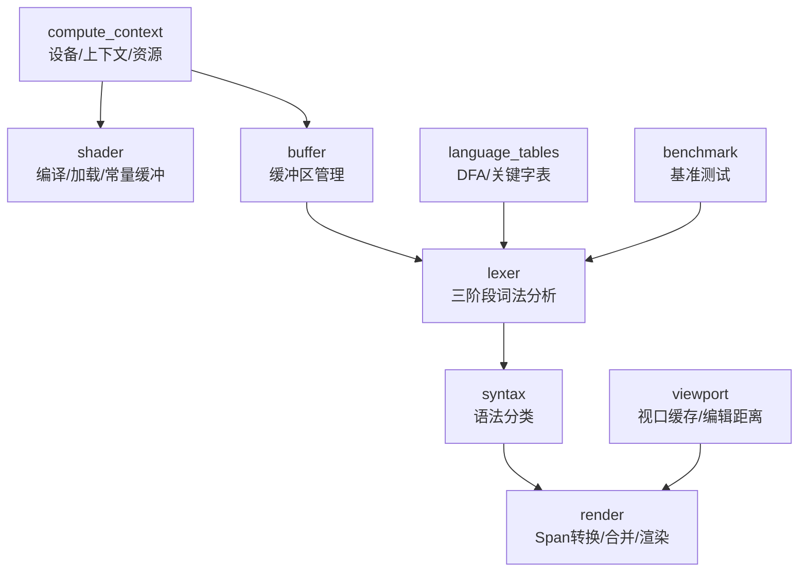
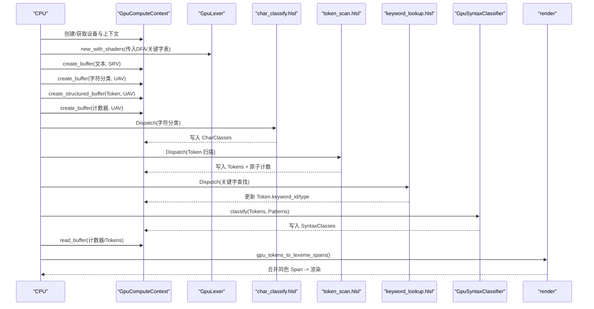
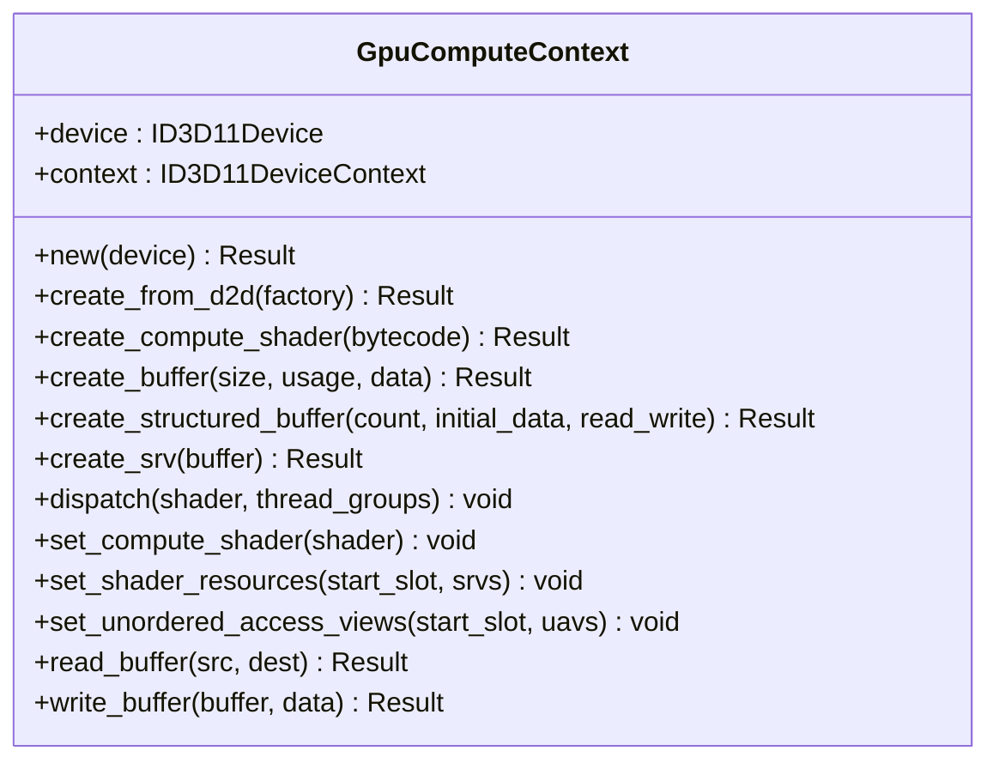
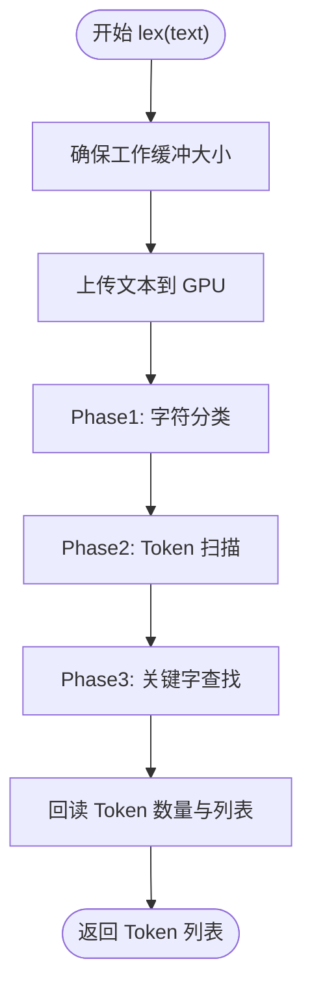
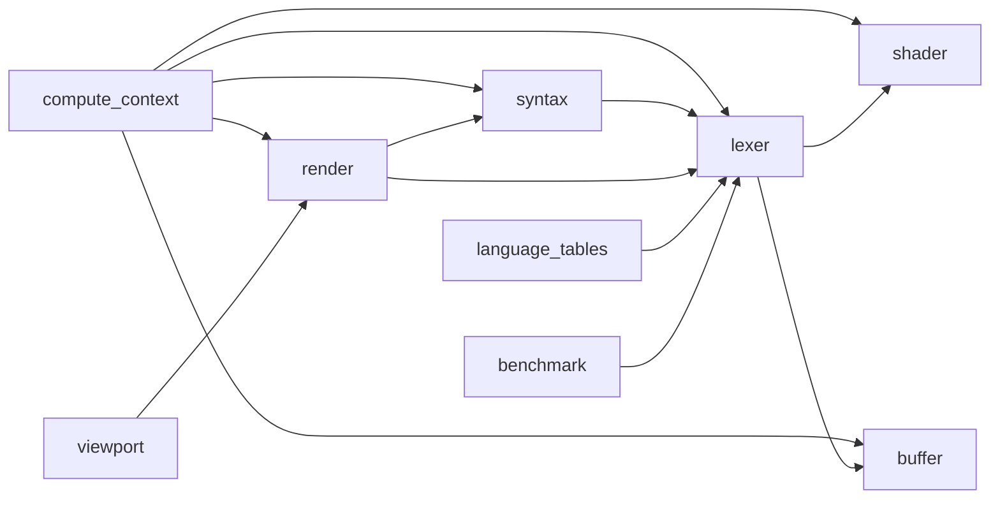

# GPU 加速渲染

<cite>
**本文引用的文件**
- [crates/aether-render/src/gpu/mod.rs](file://crates/aether-render/src/gpu/mod.rs)
- [crates/aether-render/src/gpu/compute_context.rs](file://crates/aether-render/src/gpu/compute_context.rs)
- [crates/aether-render/src/gpu/shader.rs](file://crates/aether-render/src/gpu/shader.rs)
- [crates/aether-render/src/gpu/buffer.rs](file://crates/aether-render/src/gpu/buffer.rs)
- [crates/aether-render/src/gpu/viewport.rs](file://crates/aether-render/src/gpu/viewport.rs)
- [crates/aether-render/src/gpu/lexer.rs](file://crates/aether-render/src/gpu/lexer.rs)
- [crates/aether-render/src/gpu/syntax.rs](file://crates/aether-render/src/gpu/syntax.rs)
- [crates/aether-render/src/gpu/render.rs](file://crates/aether-render/src/gpu/render.rs)
- [crates/aether-render/src/gpu/language_tables.rs](file://crates/aether-render/src/gpu/language_tables.rs)
- [crates/aether-render/src/gpu/benchmark.rs](file://crates/aether-render/src/gpu/benchmark.rs)
- [crates/aether-render/src/gpu/shaders/char_classify.hlsl](file://crates/aether-render/src/gpu/shaders/char_classify.hlsl)
- [crates/aether-render/src/gpu/shaders/token_scan.hlsl](file://crates/aether-render/src/gpu/shaders/token_scan.hlsl)
- [crates/aether-render/src/gpu/shaders/keyword_lookup.hlsl](file://crates/aether-render/src/gpu/shaders/keyword_lookup.hlsl)
- [crates/aether-render/src/gpu/shaders/syntax_classify.hlsl](file://crates/aether-render/src/gpu/shaders/syntax_classify.hlsl)
</cite>

## 目录
1. [简介](#简介)
2. [项目结构](#项目结构)
3. [核心组件](#核心组件)
4. [架构总览](#架构总览)
5. [详细组件分析](#详细组件分析)
6. [依赖关系分析](#依赖关系分析)
7. [性能考量与优化](#性能考量与优化)
8. [故障排查指南](#故障排查指南)
9. [结论](#结论)
10. [附录：基准测试与自定义着色器](#附录：基准测试与自定义着色器)

## 简介
本仓库实现了基于 Direct3D 计算着色器的 GPU 加速语法高亮管线。整体流程将文本输入上传至 GPU，通过多阶段 Compute Shader 完成字符分类、Token 扫描、关键字识别与简单语法模式匹配，再将结果回读到 CPU 并映射到渲染层进行高亮绘制。系统包含：
- 计算上下文管理（设备、上下文、资源绑定）
- 着色器编译与加载（HLSL 源码或预编译 CSO）
- 缓冲区管理（结构化缓冲、UAV/SRV、常量缓冲、暂存缓冲）
- 视口增量高亮缓存（编辑距离检测、脏行标记）
- 语言表生成（DFA 状态转换表、关键字哈希表）
- 基准测试框架（吞吐、延迟、加速比）

该方案在大型文件中能显著降低词法分析耗时，并通过视口缓存减少重复计算。

## 项目结构
GPU 相关代码集中在 aether-render crate 的 gpu 模块中，按职责划分如下：
- compute_context：封装 D3D11 设备/上下文，提供创建着色器、缓冲、资源视图、Dispatch 等能力
- shader：HLSL 编译、预编译着色器加载、常量缓冲构造
- buffer：通用 GPU 缓冲区管理器（文本、Token、字符分类、计数器）
- lexer：三阶段并行词法分析（字符分类、Token 扫描、关键字查找）
- syntax：基于 Token 流的简单语法模式匹配
- render：GPU Token 到渲染 Span 的转换、合并同色 Token、双缓冲与内存池
- language_tables：为不同语言生成 DFA 表和关键字表
- viewport：视口优先的高亮缓存与编辑距离检测
- benchmark：基准测试框架与测试数据生成
- shaders：HLSL 着色器源码（字符分类、Token 扫描、关键字查找、语法分类）

图表来源
- [crates/aether-render/src/gpu/compute_context.rs:17-94](file://crates/aether-render/src/gpu/compute_context.rs#L17-L94)
- [crates/aether-render/src/gpu/shader.rs:7-150](file://crates/aether-render/src/gpu/shader.rs#L7-L150)
- [crates/aether-render/src/gpu/buffer.rs:6-47](file://crates/aether-render/src/gpu/buffer.rs#L6-L47)
- [crates/aether-render/src/gpu/lexer.rs:48-221](file://crates/aether-render/src/gpu/lexer.rs#L48-L221)
- [crates/aether-render/src/gpu/syntax.rs:39-124](file://crates/aether-render/src/gpu/syntax.rs#L39-L124)
- [crates/aether-render/src/gpu/render.rs:7-126](file://crates/aether-render/src/gpu/render.rs#L7-L126)
- [crates/aether-render/src/gpu/language_tables.rs:1-35](file://crates/aether-render/src/gpu/language_tables.rs#L1-L35)
- [crates/aether-render/src/gpu/viewport.rs:3-324](file://crates/aether-render/src/gpu/viewport.rs#L3-L324)
- [crates/aether-render/src/gpu/benchmark.rs:3-157](file://crates/aether-render/src/gpu/benchmark.rs#L3-L157)

章节来源
- [crates/aether-render/src/gpu/mod.rs:1-10](file://crates/aether-render/src/gpu/mod.rs#L1-L10)

## 核心组件
- 计算上下文（GpuComputeContext）：封装 D3D11 设备与立即上下文，提供着色器创建、缓冲区创建、资源视图设置、Dispatch 调用、CPU/GPU 数据拷贝等。
- 着色器编译器（ShaderCompiler）：使用 d3dcompiler_47.dll 将 HLSL 源码编译为 CSO；提供便捷方法编译各阶段着色器。
- 缓冲区管理器（GpuBufferManager）：统一创建文本输入、Token 输出、字符分类、计数器等缓冲。
- 词法分析器（GpuLexer）：执行三阶段并行处理，维护工作缓冲与资源绑定，负责调度着色器与回读结果。
- 语法分类器（GpuSyntaxClassifier）：基于 Token 流与模式表进行简单语法模式匹配，输出语法分类结果。
- 渲染适配（render）：将 GPU Token 转换为 LexemeSpan，合并相邻同色 Token，提供颜色映射与双缓冲/内存池。
- 语言表生成（LanguageLexerTables）：为多种语言生成 DFA 状态转换表与关键字完美哈希表。
- 视口缓存（ViewportHighlightCache）：仅缓存可见窗口内的高亮结果，支持编辑距离检测与脏行标记。
- 基准测试（LexerBenchmark）：统计平均/最小/最大耗时、吞吐量、每行延迟，并输出报告。

章节来源
- [crates/aether-render/src/gpu/compute_context.rs:17-399](file://crates/aether-render/src/gpu/compute_context.rs#L17-L399)
- [crates/aether-render/src/gpu/shader.rs:7-150](file://crates/aether-render/src/gpu/shader.rs#L7-L150)
- [crates/aether-render/src/gpu/buffer.rs:6-47](file://crates/aether-render/src/gpu/buffer.rs#L6-L47)
- [crates/aether-render/src/gpu/lexer.rs:48-430](file://crates/aether-render/src/gpu/lexer.rs#L48-L430)
- [crates/aether-render/src/gpu/syntax.rs:39-289](file://crates/aether-render/src/gpu/syntax.rs#L39-L289)
- [crates/aether-render/src/gpu/render.rs:7-220](file://crates/aether-render/src/gpu/render.rs#L7-L220)
- [crates/aether-render/src/gpu/language_tables.rs:1-827](file://crates/aether-render/src/gpu/language_tables.rs#L1-L827)
- [crates/aether-render/src/gpu/viewport.rs:3-324](file://crates/aether-render/src/gpu/viewport.rs#L3-L324)
- [crates/aether-render/src/gpu/benchmark.rs:3-287](file://crates/aether-render/src/gpu/benchmark.rs#L3-L287)

## 架构总览
GPU 高亮管线由“数据准备 → 并行处理 → 结果回读 → 渲染”构成。数据从 CPU 文本开始，经着色器流水线处理后得到 Token 与语法分类，最终映射到渲染层。

图表来源
- [crates/aether-render/src/gpu/lexer.rs:187-221](file://crates/aether-render/src/gpu/lexer.rs#L187-L221)
- [crates/aether-render/src/gpu/lexer.rs:321-370](file://crates/aether-render/src/gpu/lexer.rs#L321-L370)
- [crates/aether-render/src/gpu/syntax.rs:93-124](file://crates/aether-render/src/gpu/syntax.rs#L93-L124)
- [crates/aether-render/src/gpu/render.rs:7-126](file://crates/aether-render/src/gpu/render.rs#L7-L126)
- [crates/aether-render/src/gpu/shaders/char_classify.hlsl:61-89](file://crates/aether-render/src/gpu/shaders/char_classify.hlsl#L61-L89)
- [crates/aether-render/src/gpu/shaders/token_scan.hlsl:56-313](file://crates/aether-render/src/gpu/shaders/token_scan.hlsl#L56-L313)
- [crates/aether-render/src/gpu/shaders/keyword_lookup.hlsl:20-102](file://crates/aether-render/src/gpu/shaders/keyword_lookup.hlsl#L20-L102)
- [crates/aether-render/src/gpu/shaders/syntax_classify.hlsl:37-142](file://crates/aether-render/src/gpu/shaders/syntax_classify.hlsl#L37-L142)

## 详细组件分析

### 计算上下文（GpuComputeContext）
- 功能：封装 ID3D11Device/ID3D11DeviceContext，提供着色器创建、缓冲区创建、SRV/UAV 设置、Dispatch、数据读写。
- 关键点：
  - 支持从 D2D Factory 创建独立 D3D11 设备，避免与渲染设备互相影响。
  - 提供 BufferUsage 枚举区分常量、结构化、可读写、暂存缓冲。
  - 通过 CreateUnorderedAccessView 配置 UAV，用于 Compute Shader 写操作。
  - 使用 Staging Buffer 实现 CPU/GPU 异步数据回读。

图表来源
- [crates/aether-render/src/gpu/compute_context.rs:17-399](file://crates/aether-render/src/gpu/compute_context.rs#L17-L399)

章节来源
- [crates/aether-render/src/gpu/compute_context.rs:17-399](file://crates/aether-render/src/gpu/compute_context.rs#L17-L399)

### 着色器编译与加载（ShaderCompiler / PrecompiledShader）
- 功能：将 HLSL 源码编译为 CSO，或直接加载预编译字节码；提供便捷方法编译各阶段着色器。
- 关键点：
  - 使用 D3DCompile API，开启严格模式与优化级别。
  - 错误信息通过 error_blob 输出便于调试。
  - 支持嵌入 HLSL 源码并在运行时编译，或加载外部 CSO。

章节来源
- [crates/aether-render/src/gpu/shader.rs:7-150](file://crates/aether-render/src/gpu/shader.rs#L7-L150)

### 缓冲区管理（GpuBufferManager）
- 功能：统一创建文本输入、Token 输出、字符分类、计数器等缓冲，简化上层调用。
- 关键点：
  - 根据用途选择 BufferUsage（Structured/ReadWrite/Staging）。
  - 为 Token 输出创建 UAV，以便 Compute Shader 写入。

章节来源
- [crates/aether-render/src/gpu/buffer.rs:6-47](file://crates/aether-render/src/gpu/buffer.rs#L6-L47)

### 词法分析（GpuLexer）
- 功能：执行三阶段并行词法分析，维护工作缓冲与资源绑定，负责调度着色器与回读结果。
- 关键点：
  - Phase 1：字符分类（char_classify.hlsl），每个线程处理一个字符，输出 CharClasses。
  - Phase 2：Token 扫描（token_scan.hlsl），基于 CharClasses 识别 Token 边界，使用原子计数器写入全局索引。
  - Phase 3：关键字查找（keyword_lookup.hlsl），使用完美哈希表识别关键字并更新 Token 类型。
  - 资源管理：DFA 表与关键字表作为 SRV 保持存活；工作缓冲按需分配与复用。

图表来源
- [crates/aether-render/src/gpu/lexer.rs:187-221](file://crates/aether-render/src/gpu/lexer.rs#L187-L221)
- [crates/aether-render/src/gpu/lexer.rs:321-370](file://crates/aether-render/src/gpu/lexer.rs#L321-L370)
- [crates/aether-render/src/gpu/shaders/token_scan.hlsl:294-307](file://crates/aether-render/src/gpu/shaders/token_scan.hlsl#L294-L307)

章节来源
- [crates/aether-render/src/gpu/lexer.rs:48-430](file://crates/aether-render/src/gpu/lexer.rs#L48-L430)

### 语法分类（GpuSyntaxClassifier）
- 功能：基于 Token 流与模式表进行简单语法模式匹配，输出语法分类结果。
- 关键点：
  - 模式定义包括 token 序列、长度、输出类与优先级。
  - 通过 UAV 写入 SyntaxClasses，供渲染层解析。
  - 置信度计算：基础置信度 + 优先级加成，上限 100。

章节来源
- [crates/aether-render/src/gpu/syntax.rs:39-289](file://crates/aether-render/src/gpu/syntax.rs#L39-L289)

### 渲染适配（render）
- 功能：将 GPU Token 转换为 LexemeSpan，合并相邻同色 Token，提供颜色映射与双缓冲/内存池。
- 关键点：
  - resolve_token_kind：优先使用语法分类（置信度阈值），否则回退到 Token 类型。
  - merge_same_color_tokens：减少 DrawText 调用次数，提升渲染效率。
  - DoubleBuffer 与 GpuBufferPool：避免频繁分配/释放，提高并发性能。

章节来源
- [crates/aether-render/src/gpu/render.rs:7-220](file://crates/aether-render/src/gpu/render.rs#L7-L220)

### 语言表生成（LanguageLexerTables）
- 功能：为不同语言生成 DFA 状态转换表与关键字完美哈希表。
- 关键点：
  - 支持 Rust、C/C++、JS/TS、Python、Go、Java、JSON、TOML、Markdown、HTML、CSS 等。
  - 通用 DFA 构建：状态 0-8 分别表示初始/标识符/数字/字符串/注释/空白/标点等。
  - 关键字表：构建完美哈希表，供 keyword_lookup.hlsl 快速查找。

章节来源
- [crates/aether-render/src/gpu/language_tables.rs:1-827](file://crates/aether-render/src/gpu/language_tables.rs#L1-L827)

### 视口缓存（ViewportHighlightCache）
- 功能：仅缓存可见窗口内的高亮结果，支持编辑距离检测与脏行标记，实现增量更新。
- 关键点：
  - resize_window：调整缓存窗口，重叠部分保留，新进入窗口的行标记为脏。
  - update_with_edit_distance：比较新旧文本，计算编辑距离，判断是否需要重新高亮。
  - crosses_token_boundary：检测变化是否跨越 token 边界（如引号、注释符号）。

章节来源
- [crates/aether-render/src/gpu/viewport.rs:3-324](file://crates/aether-render/src/gpu/viewport.rs#L3-L324)

## 依赖关系分析
- compute_context 是底层资源抽象，被 shader、buffer、lexer、syntax、render 共同依赖。
- lexer 依赖 shader（编译/加载）、buffer（工作缓冲）、compute_context（资源绑定）。
- syntax 依赖 lexer 的 Token 类型常量与 compute_context。
- render 依赖 lexer 的 GpuToken 与 syntax 的 SyntaxClass，并映射到主题颜色。
- language_tables 为 lexer 提供 DFA 与关键字表。
- viewport 与 render 协作，实现视口级增量高亮。
- benchmark 独立于主流程，用于对比不同方案的吞吐与延迟。

图表来源
- [crates/aether-render/src/gpu/compute_context.rs:17-94](file://crates/aether-render/src/gpu/compute_context.rs#L17-L94)
- [crates/aether-render/src/gpu/lexer.rs:48-221](file://crates/aether-render/src/gpu/lexer.rs#L48-L221)
- [crates/aether-render/src/gpu/syntax.rs:39-124](file://crates/aether-render/src/gpu/syntax.rs#L39-L124)
- [crates/aether-render/src/gpu/render.rs:7-126](file://crates/aether-render/src/gpu/render.rs#L7-L126)
- [crates/aether-render/src/gpu/language_tables.rs:1-35](file://crates/aether-render/src/gpu/language_tables.rs#L1-L35)
- [crates/aether-render/src/gpu/viewport.rs:3-324](file://crates/aether-render/src/gpu/viewport.rs#L3-L324)
- [crates/aether-render/src/gpu/benchmark.rs:3-157](file://crates/aether-render/src/gpu/benchmark.rs#L3-L157)

章节来源
- [crates/aether-render/src/gpu/mod.rs:1-10](file://crates/aether-render/src/gpu/mod.rs#L1-L10)

## 性能考量与优化
- 并行粒度：每个阶段以 256 线程组为单位 Dispatch，适合大规模文本处理。
- 原子计数：Token 扫描阶段使用 InterlockedAdd 保证全局索引唯一性，避免竞争。
- 内存复用：GpuBufferPool 与 DoubleBuffer 减少分配/释放开销。
- 视口缓存：仅对可见区域进行高亮，结合编辑距离检测，显著降低重算频率。
- 合并渲染：merge_same_color_tokens 减少 DrawText 调用次数，提升渲染吞吐。
- 降级策略：GpuHighlightConfig 支持 fallback_to_cpu，在 GPU 失败时回退到 CPU 高亮。

[本节为通用性能讨论，不直接分析具体文件]

## 故障排查指南
- 着色器编译错误：检查 HLSL 源码与目标模型（cs_5_0），查看 error_blob 输出。
- 空字节码错误：ensure_buffers 与 create_compute_shader 会拒绝空字节码，需确保传入有效 CSO。
- 资源未释放：DFA 表与关键字表必须保持存活，避免 GPU 资源提前释放导致崩溃。
- 缓冲区大小不足：ensure_buffers 会根据文本长度与最大 Token 数动态分配，注意 max_tokens 估算。
- 回读同步：read_buffer 使用 Staging Buffer，确保 CopyResource 完成后才能读取。

章节来源
- [crates/aether-render/src/gpu/shader.rs:22-80](file://crates/aether-render/src/gpu/shader.rs#L22-L80)
- [crates/aether-render/src/gpu/compute_context.rs:96-114](file://crates/aether-render/src/gpu/compute_context.rs#L96-L114)
- [crates/aether-render/src/gpu/lexer.rs:258-314](file://crates/aether-render/src/gpu/lexer.rs#L258-L314)
- [crates/aether-render/src/gpu/compute_context.rs:274-312](file://crates/aether-render/src/gpu/compute_context.rs#L274-L312)

## 结论
本 GPU 加速渲染系统通过三阶段并行词法分析与简单语法模式匹配，实现了高效、可扩展的语法高亮方案。其优势在于：
- 利用 GPU 并行能力处理大规模文本
- 视口缓存与编辑距离检测实现增量更新
- 模块化设计便于扩展新语言与新着色器
- 基准测试框架支持持续性能评估

建议在生产环境中：
- 使用预编译 CSO 减少启动开销
- 合理配置 min_file_size 与 viewport_padding
- 定期运行基准测试，监控性能回归

[本节为总结性内容，不直接分析具体文件]

## 附录：基准测试与自定义着色器

### 基准测试框架使用方法
- 创建 LexerBenchmark 实例，调用 run(name, text, f, iterations) 记录多次迭代耗时。
- 支持打印报告与生成 Markdown 格式结果。
- 内置测试数据生成器（Rust/JS/JSON），便于快速验证。

章节来源
- [crates/aether-render/src/gpu/benchmark.rs:3-157](file://crates/aether-render/src/gpu/benchmark.rs#L3-L157)
- [crates/aether-render/src/gpu/benchmark.rs:159-236](file://crates/aether-render/src/gpu/benchmark.rs#L159-L236)

### 如何编写自定义着色器
- 新增 HLSL 文件：在 shaders 目录下添加新的着色器源码（如 custom_phase.hlsl）。
- 修改 GpuLexer：在 new_with_shaders 中添加编译与加载逻辑，或在 new_with_embedded_shaders 中使用 include_str! 嵌入。
- 更新资源绑定：在 ensure_buffers 与 run_* 方法中创建/绑定新的缓冲与 UAV/SRV。
- 集成到管线：在 lex 流程中插入新的 Dispatch 阶段，并处理输出结果。

章节来源
- [crates/aether-render/src/gpu/lexer.rs:116-185](file://crates/aether-render/src/gpu/lexer.rs#L116-L185)
- [crates/aether-render/src/gpu/shader.rs:82-100](file://crates/aether-render/src/gpu/shader.rs#L82-L100)
- [crates/aether-render/src/gpu/compute_context.rs:232-272](file://crates/aether-render/src/gpu/compute_context.rs#L232-L272)