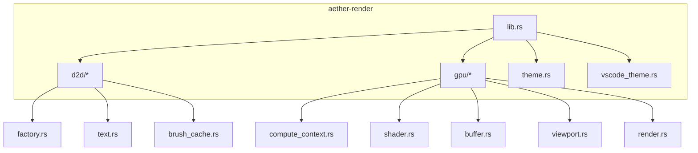
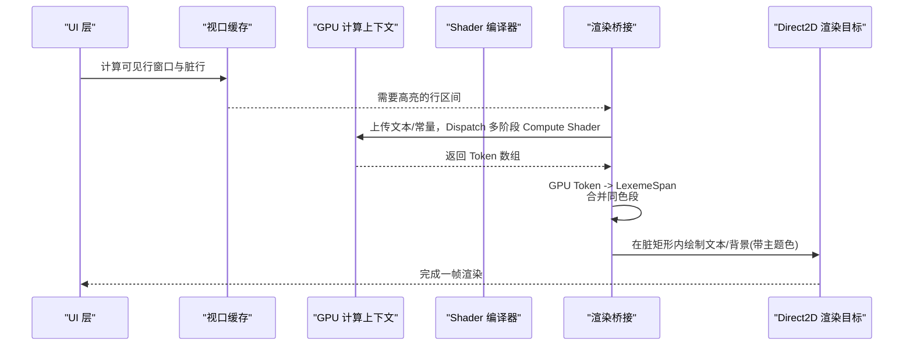
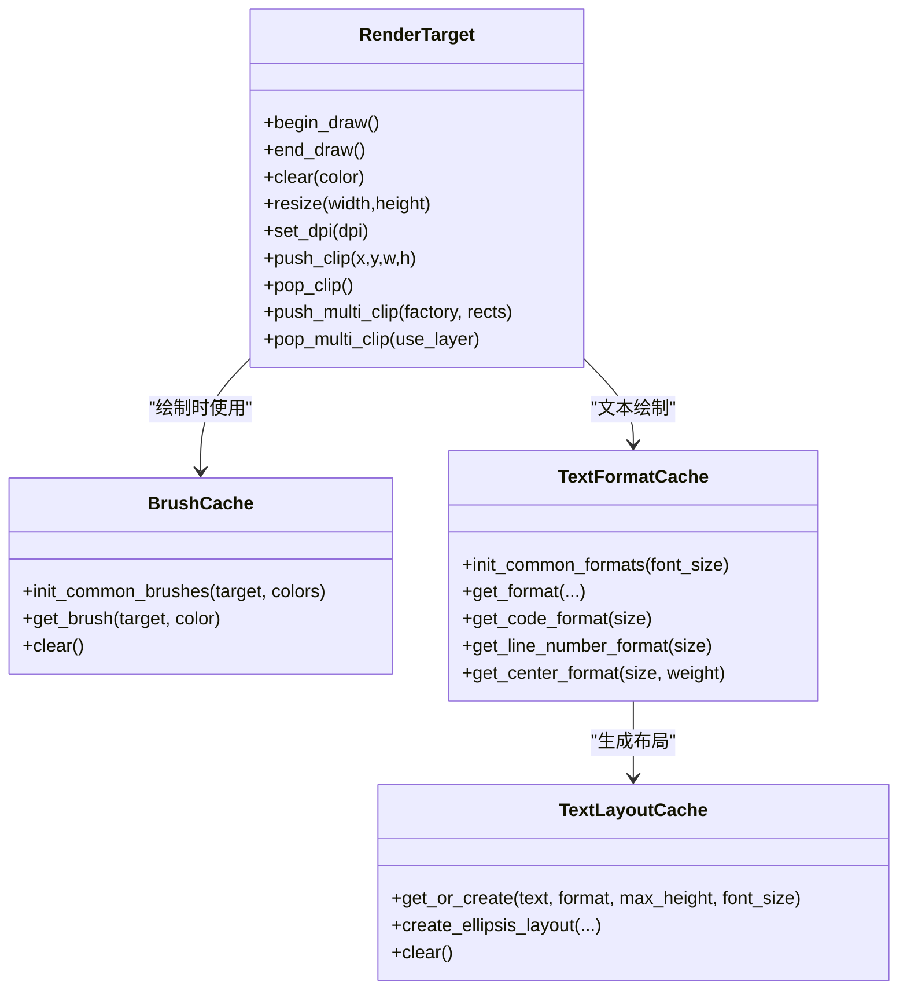
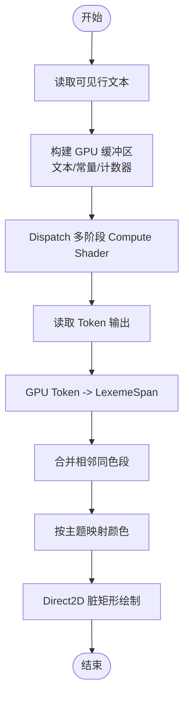
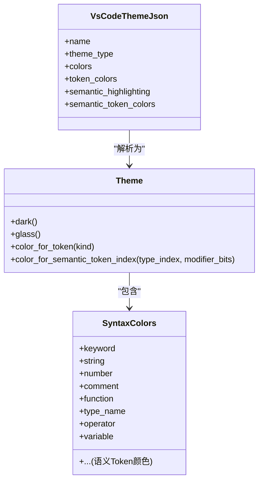
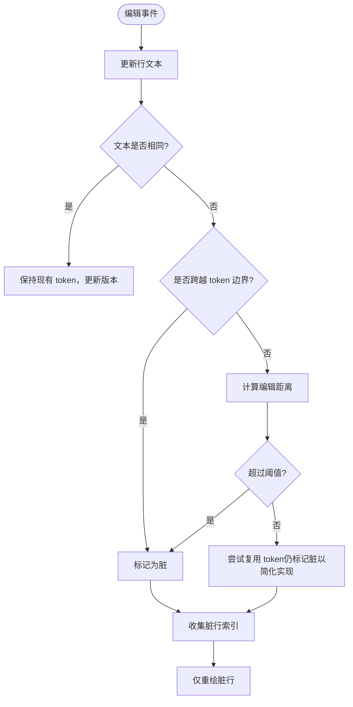
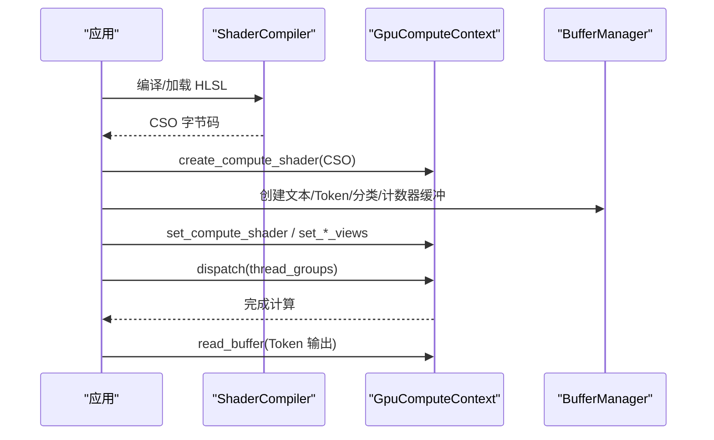
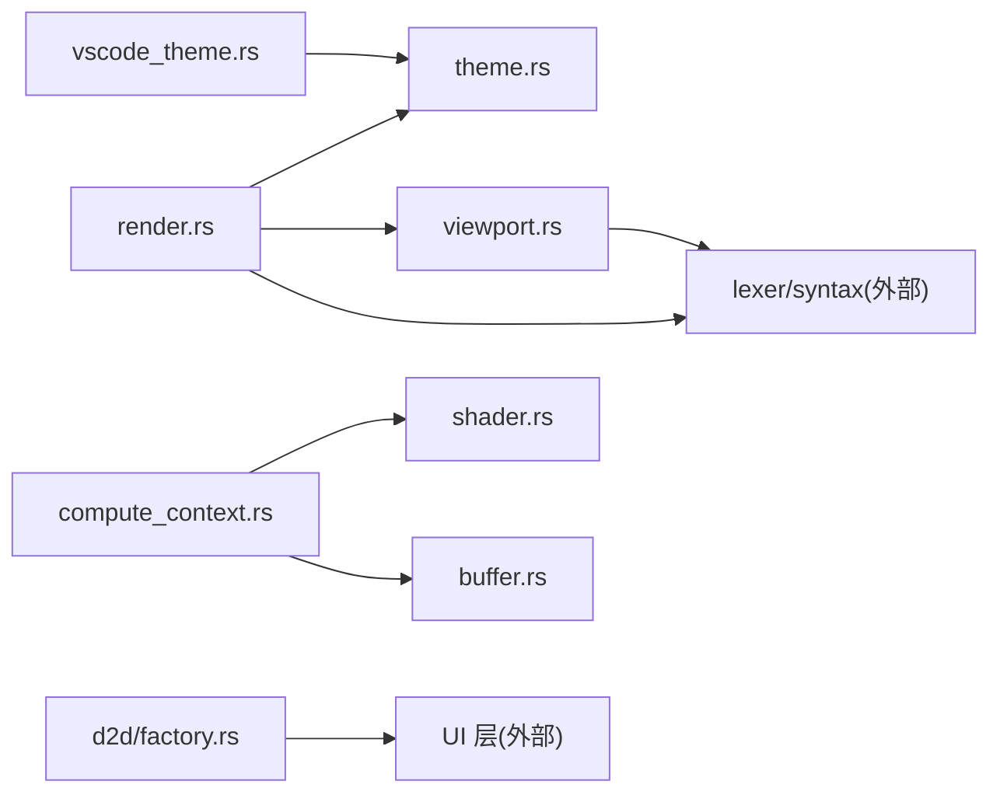

# aether-render 渲染引擎

<cite>
**本文引用的文件**
- [lib.rs](file://crates/aether-render/src/lib.rs)
- [d2d/mod.rs](file://crates/aether-render/src/d2d/mod.rs)
- [d2d/factory.rs](file://crates/aether-render/src/d2d/factory.rs)
- [d2d/text.rs](file://crates/aether-render/src/d2d/text.rs)
- [d2d/brush_cache.rs](file://crates/aether-render/src/d2d/brush_cache.rs)
- [gpu/mod.rs](file://crates/aether-render/src/gpu/mod.rs)
- [gpu/render.rs](file://crates/aether-render/src/gpu/render.rs)
- [gpu/shader.rs](file://crates/aether-render/src/gpu/shader.rs)
- [gpu/buffer.rs](file://crates/aether-render/src/gpu/buffer.rs)
- [gpu/compute_context.rs](file://crates/aether-render/src/gpu/compute_context.rs)
- [gpu/viewport.rs](file://crates/aether-render/src/gpu/viewport.rs)
- [theme.rs](file://crates/aether-render/src/theme.rs)
- [vscode_theme.rs](file://crates/aether-render/src/vscode_theme.rs)
</cite>

## 目录
1. [简介](#简介)
2. [项目结构](#项目结构)
3. [核心组件](#核心组件)
4. [架构总览](#架构总览)
5. [详细组件分析](#详细组件分析)
6. [依赖关系分析](#依赖关系分析)
7. [性能考量](#性能考量)
8. [故障排查指南](#故障排查指南)
9. [结论](#结论)
10. [附录：API 使用与扩展](#附录api-使用与扩展)

## 简介
aether-render 是面向 Windows 平台的编辑器渲染子系统，提供：
- Direct2D/DirectWrite 抽象层：封装工厂、渲染目标、裁剪、文本格式与画刷缓存。
- GPU 加速词法分析与高亮：基于 D3D11 Compute Shader 的多阶段词法管线（字符分类、Token 扫描、关键字查找、语法分类），并回退到 CPU。
- 主题系统与 VS Code 主题兼容：内置暗色/毛玻璃主题，支持从 VS Code JSON 主题加载 UI 颜色与 Token 规则。
- 脏矩形与视口增量更新：仅对可见区域进行重绘，结合编辑距离检测最小化重新高亮范围。
- 性能基准测试：对比 GPU/CPU/第三方方案，输出吞吐与延迟指标。

本文件聚焦渲染管线、脏矩形优化、着色器使用、性能基准、渲染 API 与 UI 协作方式，以及自定义主题扩展方法。

## 项目结构
aether-render 采用按功能分层组织：
- d2d：Direct2D/DirectWrite 抽象与资源缓存（工厂、渲染目标、文本、画刷、布局）。
- gpu：GPU 词法与高亮（Compute Context、Shader、Buffer、Viewport、Render）。
- theme/vscode_theme：主题数据模型与 VS Code 主题解析。
- lib：模块入口。

**图表来源**
- [lib.rs:1-5](file://crates/aether-render/src/lib.rs#L1-L5)
- [d2d/mod.rs:1-5](file://crates/aether-render/src/d2d/mod.rs#L1-L5)
- [gpu/mod.rs:1-10](file://crates/aether-render/src/gpu/mod.rs#L1-L10)

**章节来源**
- [lib.rs:1-5](file://crates/aether-render/src/lib.rs#L1-L5)
- [d2d/mod.rs:1-5](file://crates/aether-render/src/d2d/mod.rs#L1-L5)
- [gpu/mod.rs:1-10](file://crates/aether-render/src/gpu/mod.rs#L1-L10)

## 核心组件
- Direct2D 抽象层
  - 工厂与渲染目标：创建硬件加速的 HWND 渲染目标，支持 DPI 切换与多矩形脏区裁剪。
  - 文本渲染：DirectWrite 字体格式、行高/字宽测量、DPI 缩放与字号调整。
  - 资源缓存：画刷缓存、文本格式缓存、TextLayout 两代淘汰缓存，避免每帧 COM 对象分配。
- GPU 加速渲染
  - 计算上下文：封装 D3D11 设备/上下文，提供缓冲区、SRV/UAV、Dispatch 等能力。
  - Shader 编译：HLSL 源码编译为 CSO，或加载预编译字节码；常量缓冲传递参数。
  - Buffer 管理：结构化/读写/常量/暂存缓冲区统一创建与复用。
  - 视口增量高亮：维护可见窗口内的 token 缓存、版本与脏标记，编辑距离阈值控制重算。
  - 渲染桥接：将 GPU 生成的 Token 转换为 LexemeSpan，合并同色连续段，映射主题颜色。
- 主题系统
  - Theme/SyntaxColors：定义 UI 与语法高亮颜色，提供 dark/glass 预设与语义 Token 索引映射。
  - VS Code 主题兼容：解析 colors/tokenColors/semanticTokenColors，映射到内部 Theme。

**章节来源**
- [d2d/factory.rs:14-17](file://crates/aether-render/src/d2d/factory.rs#L14-L17)
- [d2d/factory.rs:33-63](file://crates/aether-render/src/d2d/factory.rs#L33-L63)
- [d2d/text.rs:9-52](file://crates/aether-render/src/d2d/text.rs#L9-L52)
- [d2d/brush_cache.rs:24-43](file://crates/aether-render/src/d2d/brush_cache.rs#L24-L43)
- [gpu/compute_context.rs:17-45](file://crates/aether-render/src/gpu/compute_context.rs#L17-L45)
- [gpu/shader.rs:7-101](file://crates/aether-render/src/gpu/shader.rs#L7-L101)
- [gpu/buffer.rs:6-47](file://crates/aether-render/src/gpu/buffer.rs#L6-L47)
- [gpu/viewport.rs:3-22](file://crates/aether-render/src/gpu/viewport.rs#L3-L22)
- [gpu/render.rs:116-126](file://crates/aether-render/src/gpu/render.rs#L116-L126)
- [theme.rs:7-86](file://crates/aether-render/src/theme.rs#L7-L86)
- [vscode_theme.rs:10-31](file://crates/aether-render/src/vscode_theme.rs#L10-L31)

## 架构总览
渲染管线分为“GPU 词法 + 主题映射 + Direct2D 绘制”三段式：
- 输入：文档文本、当前视口、主题配置。
- GPU 阶段：字符分类 → Token 扫描 → 关键字查找 → 语法分类，产出 Token 列表。
- CPU 阶段：将 GPU Token 转为 LexemeSpan，合并相邻同色段，按主题映射颜色。
- 绘制阶段：通过 Direct2D 在脏矩形区域内增量绘制文本与背景。

**图表来源**
- [gpu/viewport.rs:3-22](file://crates/aether-render/src/gpu/viewport.rs#L3-L22)
- [gpu/compute_context.rs:116-139](file://crates/aether-render/src/gpu/compute_context.rs#L116-L139)
- [gpu/shader.rs:22-101](file://crates/aether-render/src/gpu/shader.rs#L22-L101)
- [gpu/render.rs:10-32](file://crates/aether-render/src/gpu/render.rs#L10-L32)
- [d2d/factory.rs:90-125](file://crates/aether-render/src/d2d/factory.rs#L90-L125)

## 详细组件分析

### Direct2D 抽象层
- 工厂与渲染目标
  - 创建硬件加速渲染目标，支持 DPI 设置与窗口大小调整。
  - 支持单矩形与多矩形并集裁剪，用于脏矩形局部重绘，避免整屏重绘。
- 文本渲染
  - 使用 DirectWrite 创建文本格式，动态测量等宽字体字符宽度与行高。
  - 支持 DPI 缩放与用户字号调整，保证在不同缩放下布局一致。
- 资源缓存
  - 画刷缓存：预存常用颜色画笔，未命中时回退 HashMap，限制最大条目数防止内存增长。
  - 文本格式缓存：预置代码/行号/居中三种格式，其他回退 HashMap。
  - TextLayout 缓存：年轻代/老代两代淘汰策略，热点布局长期保留，避免周期性全清导致的掉帧。

**图表来源**
- [d2d/factory.rs:65-281](file://crates/aether-render/src/d2d/factory.rs#L65-L281)
- [d2d/brush_cache.rs:24-105](file://crates/aether-render/src/d2d/brush_cache.rs#L24-L105)
- [d2d/brush_cache.rs:107-313](file://crates/aether-render/src/d2d/brush_cache.rs#L107-L313)
- [d2d/brush_cache.rs:381-497](file://crates/aether-render/src/d2d/brush_cache.rs#L381-L497)

**章节来源**
- [d2d/factory.rs:33-63](file://crates/aether-render/src/d2d/factory.rs#L33-L63)
- [d2d/factory.rs:143-281](file://crates/aether-render/src/d2d/factory.rs#L143-L281)
- [d2d/text.rs:19-52](file://crates/aether-render/src/d2d/text.rs#L19-L52)
- [d2d/text.rs:69-127](file://crates/aether-render/src/d2d/text.rs#L69-L127)
- [d2d/brush_cache.rs:24-105](file://crates/aether-render/src/d2d/brush_cache.rs#L24-L105)
- [d2d/brush_cache.rs:107-313](file://crates/aether-render/src/d2d/brush_cache.rs#L107-L313)
- [d2d/brush_cache.rs:381-497](file://crates/aether-render/src/d2d/brush_cache.rs#L381-L497)

### GPU 加速渲染
- 计算上下文
  - 封装 D3D11 设备/上下文，提供 CreateBuffer、CreateStructuredBuffer、CreateComputeShader、Dispatch、Set* 等方法。
  - 支持 SRV/UAV 绑定与 Staging 缓冲区异步读写。
- Shader 编译与常量缓冲
  - 支持运行时编译 HLSL 为 CSO，或加载预编译字节码。
  - 提供 LexerConstants 结构与常量缓冲创建函数，向 Shader 传递文本长度、状态表规模等参数。
- Buffer 管理
  - 统一创建文本输入、Token 输出、字符分类、计数器等各类缓冲区，简化上层调用。
- 视口增量高亮
  - ViewportHighlightCache 维护可见窗口、token 列表、版本与脏标记。
  - 编辑距离检测判断是否需要重新高亮，跨 token 边界（引号/注释）强制重算。
- 渲染桥接
  - 将 GPU Token 转换为 LexemeSpan，优先使用语法分类结果（置信度阈值），否则回退到 Token 类型。
  - 合并相邻同色 Token 减少 DrawText 调用次数。
  - 通过主题映射 TokenKind 到 D2D1_COLOR_F。

**图表来源**
- [gpu/compute_context.rs:116-139](file://crates/aether-render/src/gpu/compute_context.rs#L116-L139)
- [gpu/compute_context.rs:232-272](file://crates/aether-render/src/gpu/compute_context.rs#L232-L272)
- [gpu/shader.rs:22-101](file://crates/aether-render/src/gpu/shader.rs#L22-L101)
- [gpu/render.rs:10-32](file://crates/aether-render/src/gpu/render.rs#L10-L32)
- [gpu/render.rs:74-114](file://crates/aether-render/src/gpu/render.rs#L74-L114)
- [gpu/render.rs:121-126](file://crates/aether-render/src/gpu/render.rs#L121-L126)
- [gpu/viewport.rs:108-154](file://crates/aether-render/src/gpu/viewport.rs#L108-L154)

**章节来源**
- [gpu/compute_context.rs:17-45](file://crates/aether-render/src/gpu/compute_context.rs#L17-L45)
- [gpu/compute_context.rs:96-139](file://crates/aether-render/src/gpu/compute_context.rs#L96-L139)
- [gpu/compute_context.rs:232-272](file://crates/aether-render/src/gpu/compute_context.rs#L232-L272)
- [gpu/shader.rs:7-101](file://crates/aether-render/src/gpu/shader.rs#L7-L101)
- [gpu/buffer.rs:6-47](file://crates/aether-render/src/gpu/buffer.rs#L6-L47)
- [gpu/viewport.rs:3-22](file://crates/aether-render/src/gpu/viewport.rs#L3-L22)
- [gpu/viewport.rs:108-154](file://crates/aether-render/src/gpu/viewport.rs#L108-L154)
- [gpu/render.rs:10-32](file://crates/aether-render/src/gpu/render.rs#L10-L32)
- [gpu/render.rs:74-114](file://crates/aether-render/src/gpu/render.rs#L74-L114)
- [gpu/render.rs:121-126](file://crates/aether-render/src/gpu/render.rs#L121-L126)

### 主题系统与 VS Code 兼容性
- 主题模型
  - Theme 包含 UI 颜色与 SyntaxColors，提供 dark/glass 两种预设，glass 启用半透明面板与光晕选择效果。
  - 提供 TokenKind 到颜色的映射，以及语义 Token 索引到颜色的映射。
- VS Code 主题解析
  - 解析 VS Code JSON 主题中的 colors、tokenColors、semanticTokenColors。
  - 将 UI 颜色映射到 Theme，将 scope 规则映射到 SyntaxColors。
  - 支持 #RGB/#RRGGBB/#RRGGBBAA 颜色格式，错误时回退默认值。

**图表来源**
- [theme.rs:7-86](file://crates/aether-render/src/theme.rs#L7-L86)
- [theme.rs:148-279](file://crates/aether-render/src/theme.rs#L148-L279)
- [vscode_theme.rs:10-31](file://crates/aether-render/src/vscode_theme.rs#L10-L31)
- [vscode_theme.rs:103-176](file://crates/aether-render/src/vscode_theme.rs#L103-L176)

**章节来源**
- [theme.rs:7-86](file://crates/aether-render/src/theme.rs#L7-L86)
- [theme.rs:148-279](file://crates/aether-render/src/theme.rs#L148-L279)
- [vscode_theme.rs:103-176](file://crates/aether-render/src/vscode_theme.rs#L103-L176)
- [vscode_theme.rs:178-281](file://crates/aether-render/src/vscode_theme.rs#L178-L281)

### 脏矩形优化与视口增量更新
- 视口缓存
  - 维护 window_start/window_len、tokens、versions、dirty_lines、line_texts。
  - resize_window 保留重叠行数据，新进入窗口的行标记为脏。
- 编辑距离检测
  - 快速路径：完全相同则跳过。
  - 跨越 token 边界（引号/注释变化）强制重算。
  - 编辑距离超过阈值视为显著变化，触发重算。
- 脏行收集
  - dirty_line_indices 返回全局行号集合，供上层只重绘这些行。

**图表来源**
- [gpu/viewport.rs:63-106](file://crates/aether-render/src/gpu/viewport.rs#L63-L106)
- [gpu/viewport.rs:108-154](file://crates/aether-render/src/gpu/viewport.rs#L108-L154)
- [gpu/viewport.rs:156-164](file://crates/aether-render/src/gpu/viewport.rs#L156-L164)
- [gpu/viewport.rs:202-294](file://crates/aether-render/src/gpu/viewport.rs#L202-L294)

**章节来源**
- [gpu/viewport.rs:3-22](file://crates/aether-render/src/gpu/viewport.rs#L3-L22)
- [gpu/viewport.rs:63-106](file://crates/aether-render/src/gpu/viewport.rs#L63-L106)
- [gpu/viewport.rs:108-154](file://crates/aether-render/src/gpu/viewport.rs#L108-L154)
- [gpu/viewport.rs:156-164](file://crates/aether-render/src/gpu/viewport.rs#L156-L164)
- [gpu/viewport.rs:202-294](file://crates/aether-render/src/gpu/viewport.rs#L202-L294)

### 着色器使用与多阶段管线
- 阶段说明
  - Phase 1 字符分类：根据字符类别预处理。
  - Phase 2 Token 扫描：识别关键字、字符串、数字、注释等。
  - Phase 3 关键字查找：利用哈希表匹配关键字。
  - Phase 4 语法分类：结合上下文推断更精确的语法角色。
- 编译与加载
  - 支持运行时编译 HLSL 为 CSO，或加载预编译字节码。
  - 常量缓冲 LexerConstants 传入文本长度、状态表规模等。
- 执行流程
  - 通过 GpuComputeContext 设置 Compute Shader、绑定 SRV/UAV、Dispatch 线程组。
  - 读取输出缓冲区得到 Token 列表。

**图表来源**
- [gpu/shader.rs:22-101](file://crates/aether-render/src/gpu/shader.rs#L22-L101)
- [gpu/compute_context.rs:96-139](file://crates/aether-render/src/gpu/compute_context.rs#L96-L139)
- [gpu/compute_context.rs:232-272](file://crates/aether-render/src/gpu/compute_context.rs#L232-L272)
- [gpu/buffer.rs:18-47](file://crates/aether-render/src/gpu/buffer.rs#L18-L47)

**章节来源**
- [gpu/shader.rs:7-101](file://crates/aether-render/src/gpu/shader.rs#L7-L101)
- [gpu/compute_context.rs:96-139](file://crates/aether-render/src/gpu/compute_context.rs#L96-L139)
- [gpu/compute_context.rs:232-272](file://crates/aether-render/src/gpu/compute_context.rs#L232-L272)
- [gpu/buffer.rs:18-47](file://crates/aether-render/src/gpu/buffer.rs#L18-L47)

### 性能基准测试
- 基准工具
  - LexerBenchmark 记录平均/最小/最大耗时、吞吐量 MB/s、ms/行，并打印报告与 Markdown 表格。
- 测试数据
  - 提供 Rust/JS/JSON 代码生成器，便于构造不同规模与语法的测试用例。
- 使用方法
  - 运行多次迭代，统计时间分布，比较不同方案（GPU/CPU/第三方）的性能差异。

**章节来源**
- [gpu/benchmark.rs:3-32](file://crates/aether-render/src/gpu/benchmark.rs#L3-L32)
- [gpu/benchmark.rs:34-92](file://crates/aether-render/src/gpu/benchmark.rs#L34-L92)
- [gpu/benchmark.rs:94-157](file://crates/aether-render/src/gpu/benchmark.rs#L94-L157)
- [gpu/benchmark.rs:159-236](file://crates/aether-render/src/gpu/benchmark.rs#L159-L236)

## 依赖关系分析
- 模块耦合
  - render.rs 依赖 lexer/syntax 类型与主题映射，负责 GPU 结果到渲染数据的转换。
  - viewport.rs 依赖 LexemeSpan 与编辑距离检测，驱动增量高亮。
  - compute_context.rs 依赖 D3D11 接口，被 shader/buffer/render 使用。
  - d2d/factory.rs 被 UI 层用于创建渲染目标与裁剪区域。
  - theme/vscode_theme 被 render 与 UI 层共同消费。
- 外部依赖
  - Windows SDK：Direct2D、DirectWrite、D3D11、DXGI。
  - serde/serde_json：VS Code 主题 JSON 解析。
  - rustc_hash：高性能哈希表替代标准库哈希。

**图表来源**
- [gpu/render.rs:1-6](file://crates/aether-render/src/gpu/render.rs#L1-L6)
- [gpu/viewport.rs:1-2](file://crates/aether-render/src/gpu/viewport.rs#L1-L2)
- [gpu/compute_context.rs:1-15](file://crates/aether-render/src/gpu/compute_context.rs#L1-L15)
- [gpu/shader.rs:1-6](file://crates/aether-render/src/gpu/shader.rs#L1-L6)
- [gpu/buffer.rs:1-5](file://crates/aether-render/src/gpu/buffer.rs#L1-L5)
- [d2d/factory.rs:1-13](file://crates/aether-render/src/d2d/factory.rs#L1-L13)
- [vscode_theme.rs:1-9](file://crates/aether-render/src/vscode_theme.rs#L1-L9)

**章节来源**
- [gpu/render.rs:1-6](file://crates/aether-render/src/gpu/render.rs#L1-L6)
- [gpu/viewport.rs:1-2](file://crates/aether-render/src/gpu/viewport.rs#L1-L2)
- [gpu/compute_context.rs:1-15](file://crates/aether-render/src/gpu/compute_context.rs#L1-L15)
- [gpu/shader.rs:1-6](file://crates/aether-render/src/gpu/shader.rs#L1-L6)
- [gpu/buffer.rs:1-5](file://crates/aether-render/src/gpu/buffer.rs#L1-L5)
- [d2d/factory.rs:1-13](file://crates/aether-render/src/d2d/factory.rs#L1-L13)
- [vscode_theme.rs:1-9](file://crates/aether-render/src/vscode_theme.rs#L1-L9)

## 性能考量
- 脏矩形与视口
  - 仅对可见区域与脏行进行重绘，减少绘制面积。
  - 编辑距离阈值控制重算频率，避免频繁全量高亮。
- 资源缓存
  - 画刷/文本格式/TextLayout 缓存显著降低 COM 对象分配与创建开销。
  - 两代淘汰策略避免周期性全清导致的掉帧。
- GPU 加速
  - 大文件（>1KB）启用 GPU 词法，小文件可回退 CPU。
  - 多阶段 Compute Shader 并行处理字符分类与 Token 扫描。
- 基准测试
  - 使用 LexerBenchmark 量化吞吐与延迟，指导参数调优（如 min_file_size、viewport_padding、edit_distance_threshold）。

[本节为通用性能讨论，不直接分析具体文件]

## 故障排查指南
- GPU 词法失败
  - 现象：无法创建 Compute Shader 或无字节码。
  - 排查：确认已编译/加载 CSO；检查 create_compute_shader 返回值；查看错误日志。
  - 参考：[gpu/compute_context.rs:96-114](file://crates/aether-render/src/gpu/compute_context.rs#L96-L114)
- 主题颜色异常
  - 现象：VS Code 主题解析后颜色不正确。
  - 排查：检查颜色格式（#RGB/#RRGGBB/#RRGGBBAA）；非法颜色会回退默认值。
  - 参考：[vscode_theme.rs:236-281](file://crates/aether-render/src/vscode_theme.rs#L236-L281)
- 脏矩形无效
  - 现象：多矩形裁剪未生效。
  - 排查：确保 push_multi_clip 使用正确的几何掩码与单位矩阵变换；pop_multi_clip 需匹配 use_layer 标志。
  - 参考：[d2d/factory.rs:164-281](file://crates/aether-render/src/d2d/factory.rs#L164-L281)
- 文本布局偏差
  - 现象：光标/点击位置与渲染不一致。
  - 排查：确保 TextLayout 不含 null 终止符，与 measure_monospace_width 保持一致。
  - 参考：[d2d/brush_cache.rs:442-455](file://crates/aether-render/src/d2d/brush_cache.rs#L442-L455)

**章节来源**
- [gpu/compute_context.rs:96-114](file://crates/aether-render/src/gpu/compute_context.rs#L96-L114)
- [vscode_theme.rs:236-281](file://crates/aether-render/src/vscode_theme.rs#L236-L281)
- [d2d/factory.rs:164-281](file://crates/aether-render/src/d2d/factory.rs#L164-L281)
- [d2d/brush_cache.rs:442-455](file://crates/aether-render/src/d2d/brush_cache.rs#L442-L455)

## 结论
aether-render 通过 Direct2D 抽象层与 GPU 加速词法管线，实现了高效、可扩展的编辑器渲染。脏矩形与视口增量更新确保交互流畅，主题系统与 VS Code 兼容提升了可定制性。结合性能基准与资源缓存策略，系统在大规模文本与高频编辑场景下具备良好表现。

[本节为总结性内容，不直接分析具体文件]

## 附录：API 使用与扩展

### 渲染 API 使用示例（概念性步骤）
- 初始化
  - 创建 D2DFactory 与 RenderTarget，设置 DPI。
  - 初始化 BrushCache/TextFormatCache/TextLayoutCache。
- 获取视口与脏行
  - 计算可见窗口，收集脏行索引。
- 执行 GPU 词法
  - 准备常量缓冲与输入缓冲区，Dispatch 多阶段 Compute Shader。
  - 读取 Token 输出，转换为 LexemeSpan 并合并同色段。
- 绘制
  - 按主题映射颜色，在脏矩形区域内绘制文本与背景。
  - 使用 push_multi_clip/pop_multi_clip 精确裁剪。

[本节为概念性流程说明，不直接分析具体文件]

### 与 UI 层的协作方式
- UI 层负责窗口消息、布局与事件分发，调用渲染层进行脏矩形绘制。
- 渲染层暴露视口缓存与主题 API，UI 层据此决定重绘区域与颜色。
- 文本格式与布局由渲染层缓存，UI 层无需重复创建。

[本节为概念性说明，不直接分析具体文件]

### 自定义主题扩展方法
- 内置主题
  - 使用 Theme::dark()/Theme::glass() 作为基础，按需覆盖字段。
- VS Code 主题
  - 通过 Theme::from_vscode_json(path) 或 from_vscode_json_str(json) 加载。
  - 支持 colors、tokenColors、semanticTokenColors 映射。
- 语义 Token 映射
  - 使用 Theme::color_for_semantic_token_index(type_index, modifier_bits) 获取颜色。
- 扩展建议
  - 新增 UI 颜色字段时，同步更新 glass/dark 预设与 VS Code 映射。
  - 新增 Token 类型时，完善 color_for_token 与 parse_syntax_colors 的 scope 映射。

**章节来源**
- [theme.rs:148-279](file://crates/aether-render/src/theme.rs#L148-L279)
- [vscode_theme.rs:103-176](file://crates/aether-render/src/vscode_theme.rs#L103-L176)
- [vscode_theme.rs:178-281](file://crates/aether-render/src/vscode_theme.rs#L178-L281)