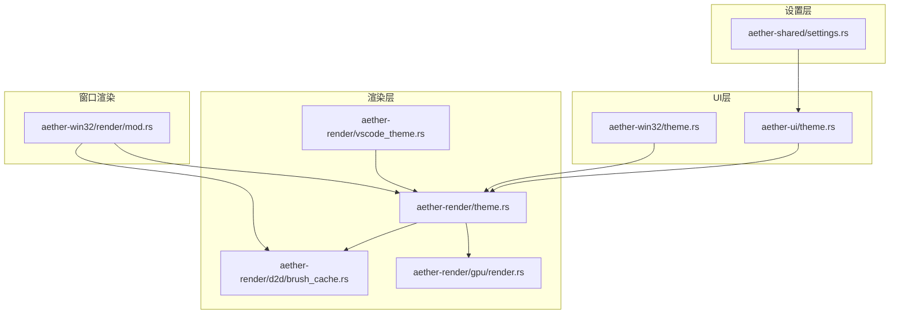
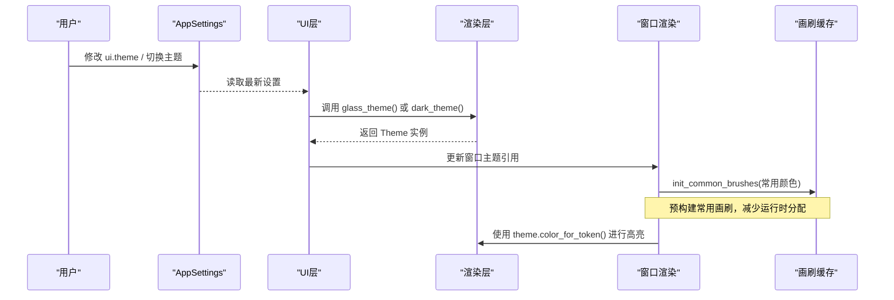
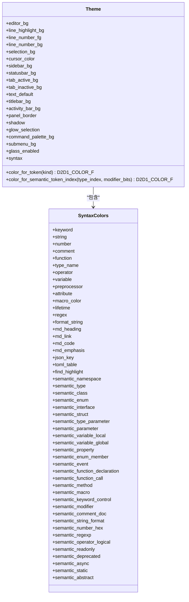
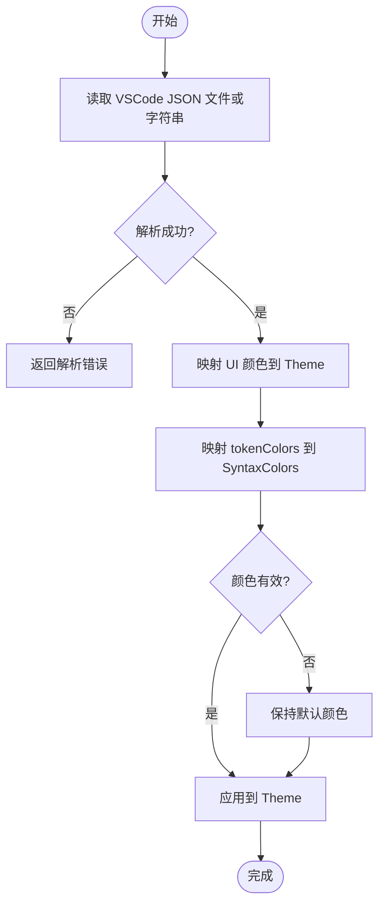
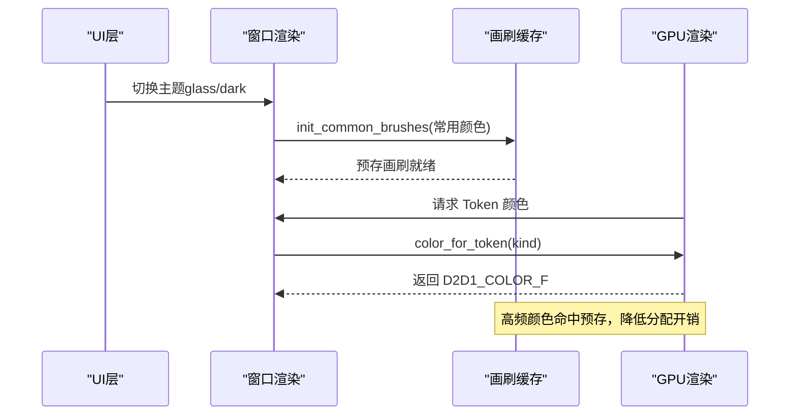
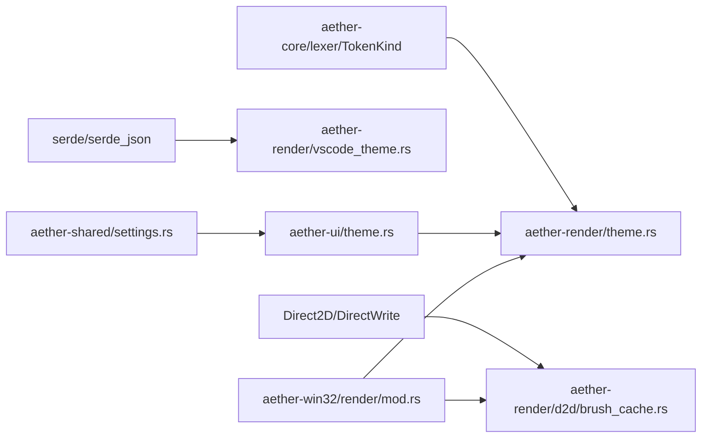

# 主题系统

<cite>
**本文引用的文件**
- [crates/aether-render/src/theme.rs](file://crates/aether-render/src/theme.rs)
- [crates/aether-render/src/vscode_theme.rs](file://crates/aether-render/src/vscode_theme.rs)
- [crates/aether-ui/src/theme.rs](file://crates/aether-ui/src/theme.rs)
- [crates/aether-win32/src/theme.rs](file://crates/aether-win32/src/theme.rs)
- [crates/aether-shared/src/settings.rs](file://crates/aether-shared/src/settings.rs)
- [crates/aether-render/src/d2d/brush_cache.rs](file://crates/aether-render/src/d2d/brush_cache.rs)
- [crates/aether-render/src/gpu/render.rs](file://crates/aether-render/src/gpu/render.rs)
- [crates/aether-win32/src/render/mod.rs](file://crates/aether-win32/src/render/mod.rs)
</cite>

## 目录
1. [简介](#简介)
2. [项目结构](#项目结构)
3. [核心组件](#核心组件)
4. [架构总览](#架构总览)
5. [详细组件分析](#详细组件分析)
6. [依赖关系分析](#依赖关系分析)
7. [性能考虑](#性能考虑)
8. [故障排查指南](#故障排查指南)
9. [结论](#结论)
10. [附录](#附录)

## 简介
本主题系统为编辑器提供可配置、可扩展且高性能的视觉样式能力，涵盖颜色方案管理、字体与样式继承机制、VSCode 主题兼容（JSON 解析、颜色映射、语法高亮规则转换）、自定义主题创建与调试、以及主题切换的动态机制与性能优化。系统以渲染层为核心，向上暴露统一的主题接口，向下对接 Direct2D/DirectWrite 渲染资源缓存，确保在频繁切换和大量文本渲染场景下的稳定与高效。

## 项目结构
主题相关代码主要分布在以下模块：
- 渲染层主题定义与 VSCode 兼容：aether-render
- UI 层主题获取与设置：aether-ui、aether-win32
- 应用设置持久化：aether-shared
- 渲染资源缓存与 GPU 集成：aether-render/d2d、aether-render/gpu

图表来源
- [crates/aether-render/src/theme.rs:1-31](file://crates/aether-render/src/theme.rs#L1-L31)
- [crates/aether-render/src/vscode_theme.rs:10-31](file://crates/aether-render/src/vscode_theme.rs#L10-L31)
- [crates/aether-ui/src/theme.rs:1-26](file://crates/aether-ui/src/theme.rs#L1-L26)
- [crates/aether-win32/src/theme.rs:1-26](file://crates/aether-win32/src/theme.rs#L1-L26)
- [crates/aether-shared/src/settings.rs:179-219](file://crates/aether-shared/src/settings.rs#L179-L219)
- [crates/aether-render/src/d2d/brush_cache.rs:15-34](file://crates/aether-render/src/d2d/brush_cache.rs#L15-L34)
- [crates/aether-render/src/gpu/render.rs:120-126](file://crates/aether-render/src/gpu/render.rs#L120-L126)
- [crates/aether-win32/src/render/mod.rs:174-205](file://crates/aether-win32/src/render/mod.rs#L174-L205)

章节来源
- [crates/aether-render/src/theme.rs:1-31](file://crates/aether-render/src/theme.rs#L1-L31)
- [crates/aether-render/src/vscode_theme.rs:10-31](file://crates/aether-render/src/vscode_theme.rs#L10-L31)
- [crates/aether-ui/src/theme.rs:1-26](file://crates/aether-ui/src/theme.rs#L1-L26)
- [crates/aether-win32/src/theme.rs:1-26](file://crates/aether-win32/src/theme.rs#L1-L26)
- [crates/aether-shared/src/settings.rs:179-219](file://crates/aether-shared/src/settings.rs#L179-L219)
- [crates/aether-render/src/d2d/brush_cache.rs:15-34](file://crates/aether-render/src/d2d/brush_cache.rs#L15-L34)
- [crates/aether-render/src/gpu/render.rs:120-126](file://crates/aether-render/src/gpu/render.rs#L120-L126)
- [crates/aether-win32/src/render/mod.rs:174-205](file://crates/aether-win32/src/render/mod.rs#L174-L205)

## 核心组件
- Theme：主题数据模型，包含编辑器背景、行号、选择、光标、侧边栏、状态栏、标签页、文本默认色、毛玻璃效果开关及语法高亮颜色集合。
- SyntaxColors：语法高亮颜色集合，覆盖关键字、字符串、数字、注释、函数、类型名、操作符、变量、预处理、属性、宏、生命周期、正则、格式化字符串、Markdown 标题/链接/代码/强调、JSON Key、TOML 表项、查找高亮以及语义令牌颜色等。
- VsCodeThemeJson：VSCode 主题 JSON 结构，支持 name、type、colors、tokenColors、semanticHighlighting、semanticTokenColors。
- TokenColorRule/TokenScope/TokenSettings：Token 颜色规则、作用域（单个或多个）与设置（前景/背景/字体样式）。
- BrushCache：Direct2D 画刷缓存，预存常用颜色并回退到哈希表，避免每帧创建 COM 对象。
- GpuHighlightRenderer：将 TokenKind 映射为主题颜色，供 GPU 高亮渲染使用。
- UiSettings：UI 设置（如 glass_enabled），用于控制是否启用毛玻璃主题。
- AppSettings.ui.theme：持久化的主题标识（字符串），用于加载或切换主题。

章节来源
- [crates/aether-render/src/theme.rs:8-86](file://crates/aether-render/src/theme.rs#L8-L86)
- [crates/aether-render/src/theme.rs:148-279](file://crates/aether-render/src/theme.rs#L148-L279)
- [crates/aether-render/src/vscode_theme.rs:10-81](file://crates/aether-render/src/vscode_theme.rs#L10-L81)
- [crates/aether-render/src/d2d/brush_cache.rs:15-34](file://crates/aether-render/src/d2d/brush_cache.rs#L15-L34)
- [crates/aether-render/src/gpu/render.rs:120-126](file://crates/aether-render/src/gpu/render.rs#L120-L126)
- [crates/aether-ui/src/theme.rs:3-26](file://crates/aether-ui/src/theme.rs#L3-L26)
- [crates/aether-win32/src/theme.rs:3-26](file://crates/aether-win32/src/theme.rs#L3-L26)
- [crates/aether-shared/src/settings.rs:179-219](file://crates/aether-shared/src/settings.rs#L179-L219)

## 架构总览
主题系统采用分层设计：
- 渲染层负责主题数据结构、内置主题（深色与毛玻璃）、VSCode 主题兼容解析、Token 到颜色的映射、语义令牌索引到颜色映射。
- UI 层提供便捷的主题获取方法（glass_theme、dark_theme）与 UI 设置（glass_enabled）。
- 设置层持久化用户选择的主题标识（ui.theme），并在应用启动时加载。
- 窗口渲染层在初始化渲染目标后，根据当前主题预初始化画刷缓存，提升渲染性能。
- GPU 渲染层通过 token_kind_to_color 将词法 Token 映射为主题颜色，实现高性能语法高亮。

图表来源
- [crates/aether-ui/src/theme.rs:17-26](file://crates/aether-ui/src/theme.rs#L17-L26)
- [crates/aether-win32/src/render/mod.rs:174-205](file://crates/aether-win32/src/render/mod.rs#L174-L205)
- [crates/aether-render/src/gpu/render.rs:120-126](file://crates/aether-render/src/gpu/render.rs#L120-L126)

## 详细组件分析

### 主题数据模型与内置主题
- Theme 包含编辑器背景、行号、选择、光标、侧边栏、状态栏、标签页、文本默认色、毛玻璃开关、面板边框、阴影、光晕选择、命令面板与子菜单背景等颜色字段，以及 SyntaxColors。
- 内置主题：
  - 深色主题：不透明背景，适合传统 IDE 风格。
  - 毛玻璃主题：半透明面板、柔和边框、光晕选择效果，层级由外向内、由深到浅划分区域。
- SyntaxColors::shared() 提供共享的语法颜色构造，消除重复代码，深色与毛玻璃主题共用同一套语法颜色值。

图表来源
- [crates/aether-render/src/theme.rs:8-86](file://crates/aether-render/src/theme.rs#L8-L86)
- [crates/aether-render/src/theme.rs:148-279](file://crates/aether-render/src/theme.rs#L148-L279)

章节来源
- [crates/aether-render/src/theme.rs:8-86](file://crates/aether-render/src/theme.rs#L8-L86)
- [crates/aether-render/src/theme.rs:148-279](file://crates/aether-render/src/theme.rs#L148-L279)

### VSCode 主题兼容性实现
- 支持从 VSCode 主题 JSON 文件或字符串加载主题，解析 colors、tokenColors、semanticHighlighting、semanticTokenColors。
- 颜色映射：
  - editor.background → editor_bg
  - editor.foreground → text_default
  - editor.selectionBackground → selection_bg
  - editorCursor.foreground → cursor_color
  - editorLineNumber.foreground → line_number_fg
  - editor.lineHighlightBackground → line_highlight_bg
  - sideBar.background → sidebar_bg
  - statusBar.background → statusbar_bg
  - tab.activeBackground → tab_active_bg
  - tab.inactiveBackground → tab_inactive_bg
  - titleBar.activeBackground → titlebar_bg
  - activityBar.background → activity_bar_bg
  - sideBar.border → panel_border
  - dropdown.background → command_palette_bg
  - menu.background → submenu_bg
- Token 颜色规则映射：
  - keyword/control/type/modifier → keyword
  - string/quoted → string
  - comment/line/block → comment
  - constant.numeric/constant → number
  - entity.name.function/support.function → function
  - entity.name.type/support.type/entity.name.class → type_name
  - variable/variable.other/identifier → variable
  - entity.name.tag/markup.heading → md_heading
  - markup.link → md_link
  - markup.inline.raw/markup.fenced_code.block → md_code
  - markup.italic/markup.bold → md_emphasis
- 颜色解析：
  - 支持 #RGB、#RRGGBB、#RRGGBBAA，自动去除前缀与空白，非法颜色保持默认值。
- 错误处理：
  - IO 错误、解析错误、无效颜色错误，均返回明确错误类型。

图表来源
- [crates/aether-render/src/vscode_theme.rs:103-175](file://crates/aether-render/src/vscode_theme.rs#L103-L175)
- [crates/aether-render/src/vscode_theme.rs:178-234](file://crates/aether-render/src/vscode_theme.rs#L178-L234)
- [crates/aether-render/src/vscode_theme.rs:236-281](file://crates/aether-render/src/vscode_theme.rs#L236-L281)

章节来源
- [crates/aether-render/src/vscode_theme.rs:103-175](file://crates/aether-render/src/vscode_theme.rs#L103-L175)
- [crates/aether-render/src/vscode_theme.rs:178-234](file://crates/aether-render/src/vscode_theme.rs#L178-L234)
- [crates/aether-render/src/vscode_theme.rs:236-281](file://crates/aether-render/src/vscode_theme.rs#L236-L281)

### 自定义主题创建指南
- 主题文件结构：
  - name：主题名称
  - type：主题类型（dark/light/hc）
  - colors：UI 颜色键值对（如 editor.background）
  - tokenColors：Token 颜色规则数组，每条规则包含 name、scope（单个或多个）、settings（foreground/background/font_style）
  - semanticHighlighting：是否启用语义高亮
  - semanticTokenColors：语义令牌颜色映射（可选）
- 可用配置选项：
  - UI 颜色键：editor.background、editor.foreground、editor.selectionBackground、editorCursor.foreground、editorLineNumber.foreground、editor.lineHighlightBackground、sideBar.background、statusBar.background、tab.activeBackground、tab.inactiveBackground、titleBar.activeBackground、activityBar.background、sideBar.border、dropdown.background、menu.background
  - Token 作用域：keyword、string、comment、constant.numeric、entity.name.function、entity.name.type、variable、entity.name.tag、markup.link、markup.inline.raw、markup.italic 等
- 调试方法：
  - 从 JSON 字符串加载：from_vscode_json_str(json)
  - 从 JSON 文件加载：from_vscode_json(path)
  - 错误类型：ThemeError::Io、ThemeError::Parse、ThemeError::InvalidColor
  - 测试用例验证：颜色解析、主题回退、非法颜色处理、未知作用域跳过

章节来源
- [crates/aether-render/src/vscode_theme.rs:10-81](file://crates/aether-render/src/vscode_theme.rs#L10-L81)
- [crates/aether-render/src/vscode_theme.rs:103-175](file://crates/aether-render/src/vscode_theme.rs#L103-L175)
- [crates/aether-render/src/vscode_theme.rs:436-619](file://crates/aether-render/src/vscode_theme.rs#L436-L619)

### 主题切换动态机制与性能考虑
- 动态切换：
  - UI 层提供 glass_theme() 与 dark_theme() 便捷方法，返回对应 Theme 实例。
  - 窗口渲染层在初始化渲染目标后，根据当前主题预初始化画刷缓存（init_common_brushes），确保高频颜色命中预存数组。
- 性能优化：
  - 画刷缓存：预存常用颜色画笔（最多 16 个），未命中时回退到哈希表，超过最大条目数清空重建，避免无界增长。
  - GPU 高亮：通过 token_kind_to_color 将 TokenKind 映射为主题颜色，减少 CPU-GPU 同步开销。
  - 双缓冲与缓冲区池：避免频繁分配释放，提升渲染效率。

图表来源
- [crates/aether-ui/src/theme.rs:17-26](file://crates/aether-ui/src/theme.rs#L17-L26)
- [crates/aether-win32/src/render/mod.rs:174-205](file://crates/aether-win32/src/render/mod.rs#L174-L205)
- [crates/aether-render/src/d2d/brush_cache.rs:50-98](file://crates/aether-render/src/d2d/brush_cache.rs#L50-L98)
- [crates/aether-render/src/gpu/render.rs:120-126](file://crates/aether-render/src/gpu/render.rs#L120-L126)

章节来源
- [crates/aether-ui/src/theme.rs:17-26](file://crates/aether-ui/src/theme.rs#L17-L26)
- [crates/aether-win32/src/render/mod.rs:174-205](file://crates/aether-win32/src/render/mod.rs#L174-L205)
- [crates/aether-render/src/d2d/brush_cache.rs:50-98](file://crates/aether-render/src/d2d/brush_cache.rs#L50-L98)
- [crates/aether-render/src/gpu/render.rs:120-126](file://crates/aether-render/src/gpu/render.rs#L120-L126)

## 依赖关系分析
- Theme 依赖 aether_core::lexer::TokenKind 进行 Token 到颜色的映射。
- VSCode 主题解析依赖 serde/serde_json 进行 JSON 反序列化。
- 渲染层依赖 Direct2D/DirectWrite 进行画刷与文本格式创建。
- UI 层与窗口渲染层依赖渲染层提供的 Theme 与工具方法。
- 设置层持久化 ui.theme，影响主题加载与切换。

图表来源
- [crates/aether-render/src/theme.rs:1-4](file://crates/aether-render/src/theme.rs#L1-L4)
- [crates/aether-render/src/vscode_theme.rs:1-8](file://crates/aether-render/src/vscode_theme.rs#L1-L8)
- [crates/aether-render/src/d2d/brush_cache.rs:1-13](file://crates/aether-render/src/d2d/brush_cache.rs#L1-L13)
- [crates/aether-ui/src/theme.rs:1-26](file://crates/aether-ui/src/theme.rs#L1-L26)
- [crates/aether-win32/src/render/mod.rs:174-205](file://crates/aether-win32/src/render/mod.rs#L174-L205)
- [crates/aether-shared/src/settings.rs:179-219](file://crates/aether-shared/src/settings.rs#L179-L219)

章节来源
- [crates/aether-render/src/theme.rs:1-4](file://crates/aether-render/src/theme.rs#L1-L4)
- [crates/aether-render/src/vscode_theme.rs:1-8](file://crates/aether-render/src/vscode_theme.rs#L1-L8)
- [crates/aether-render/src/d2d/brush_cache.rs:1-13](file://crates/aether-render/src/d2d/brush_cache.rs#L1-L13)
- [crates/aether-ui/src/theme.rs:1-26](file://crates/aether-ui/src/theme.rs#L1-L26)
- [crates/aether-win32/src/render/mod.rs:174-205](file://crates/aether-win32/src/render/mod.rs#L174-L205)
- [crates/aether-shared/src/settings.rs:179-219](file://crates/aether-shared/src/settings.rs#L179-L219)

## 性能考虑
- 画刷缓存：预存常用颜色画笔，线性扫描命中率高；哈希表回退，超出最大条目数清空重建，避免内存膨胀。
- GPU 高亮：通过 token_kind_to_color 直接映射颜色，减少 CPU-GPU 同步开销。
- 双缓冲与缓冲区池：复用 GPU 缓冲区，避免频繁分配释放。
- 主题切换：预初始化画刷缓存，确保首帧渲染性能。

章节来源
- [crates/aether-render/src/d2d/brush_cache.rs:15-34](file://crates/aether-render/src/d2d/brush_cache.rs#L15-L34)
- [crates/aether-render/src/d2d/brush_cache.rs:50-98](file://crates/aether-render/src/d2d/brush_cache.rs#L50-L98)
- [crates/aether-render/src/gpu/render.rs:120-126](file://crates/aether-render/src/gpu/render.rs#L120-L126)
- [crates/aether-win32/src/render/mod.rs:174-205](file://crates/aether-win32/src/render/mod.rs#L174-L205)

## 故障排查指南
- JSON 解析失败：检查 tokenColors 与 colors 格式，确认 scope 与 settings 字段正确。
- 颜色无效：确保十六进制颜色格式为 #RGB、#RRGGBB 或 #RRGGBBAA，非法颜色将回退到默认值。
- 文件 IO 错误：确认主题文件路径存在且可读。
- 主题未生效：检查 UI 层是否正确调用 glass_theme() 或 dark_theme()，窗口渲染层是否重新初始化画刷缓存。

章节来源
- [crates/aether-render/src/vscode_theme.rs:83-101](file://crates/aether-render/src/vscode_theme.rs#L83-L101)
- [crates/aether-render/src/vscode_theme.rs:236-281](file://crates/aether-render/src/vscode_theme.rs#L236-L281)
- [crates/aether-win32/src/render/mod.rs:174-205](file://crates/aether-win32/src/render/mod.rs#L174-L205)

## 结论
主题系统通过清晰的层次结构与高效的缓存机制，实现了灵活的 VSCode 主题兼容、丰富的语法高亮支持以及高性能的渲染体验。开发者可通过标准 JSON 格式快速定制主题，并利用内置工具方法进行调试与验证。系统在主题切换与渲染过程中充分考虑了性能优化，确保在大规模文本编辑场景下的流畅性。

## 附录
- 主题文件示例结构：name、type、colors、tokenColors、semanticHighlighting、semanticTokenColors
- 常用 Token 作用域：keyword、string、comment、constant.numeric、entity.name.function、entity.name.type、variable、entity.name.tag、markup.link、markup.inline.raw、markup.italic
- 颜色格式：#RGB、#RRGGBB、#RRGGBBAA
- 错误类型：ThemeError::Io、ThemeError::Parse、ThemeError::InvalidColor