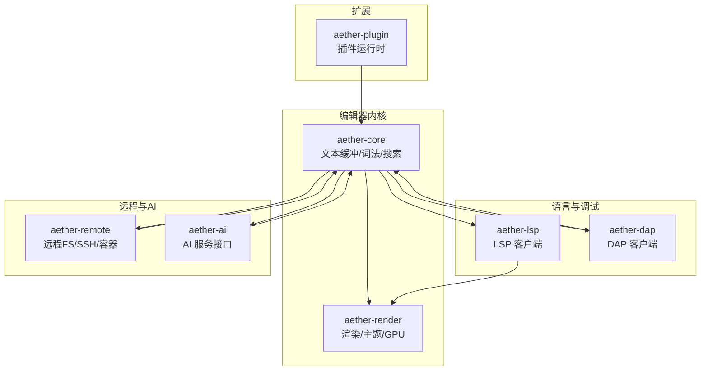
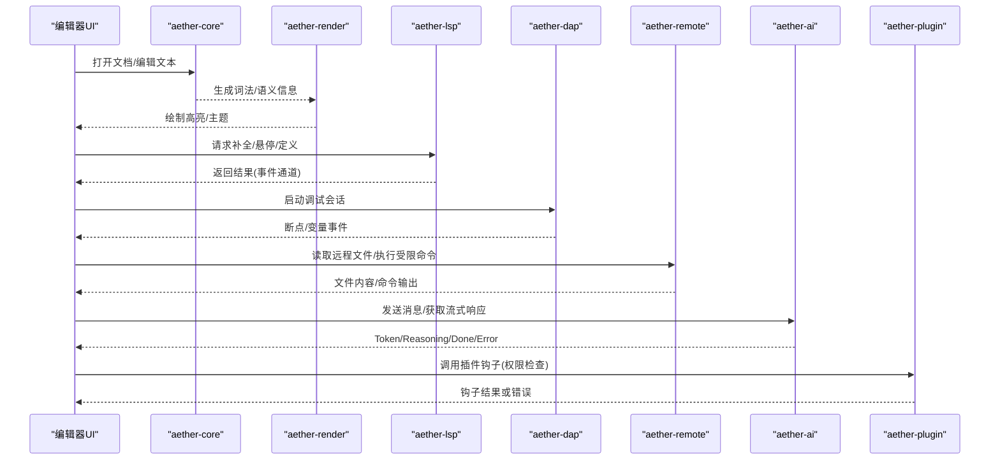
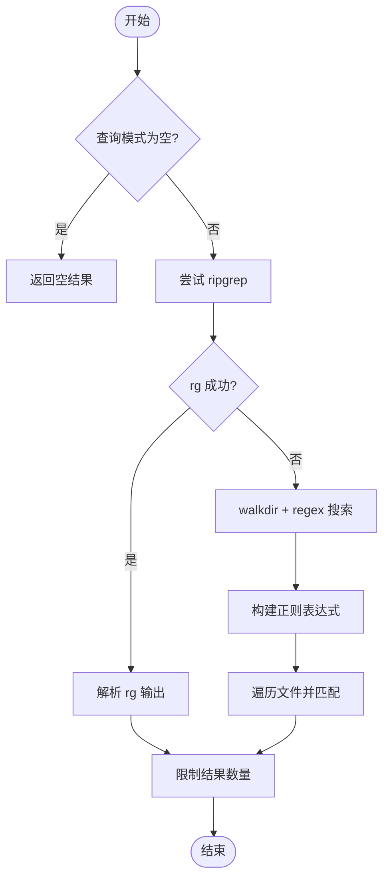
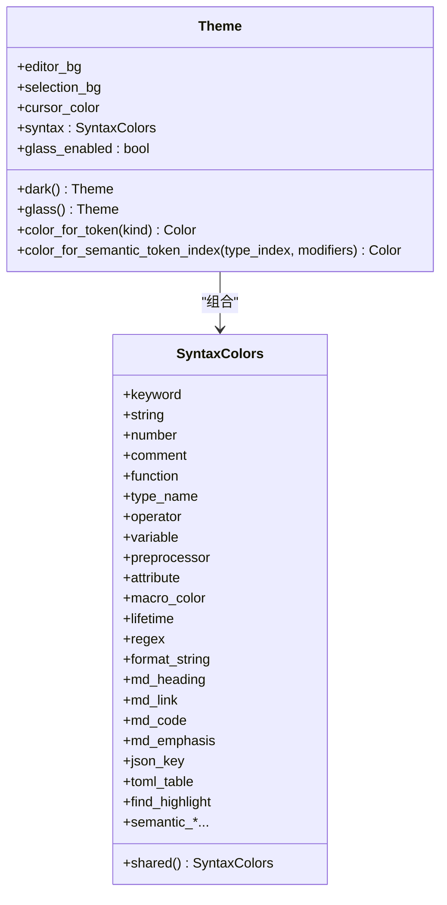
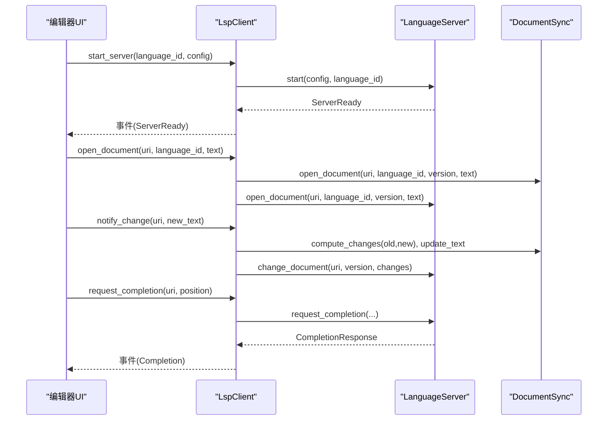
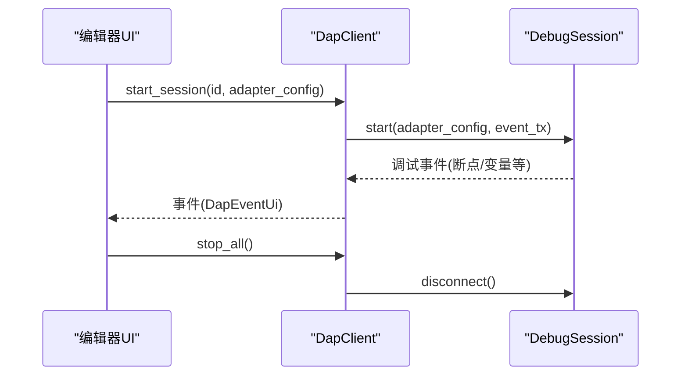
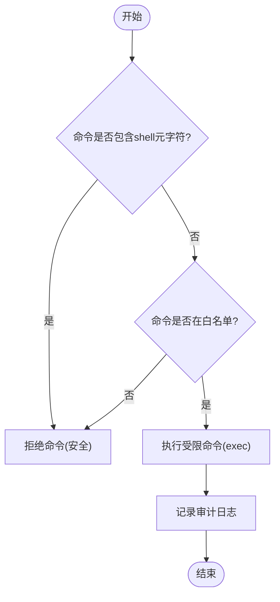
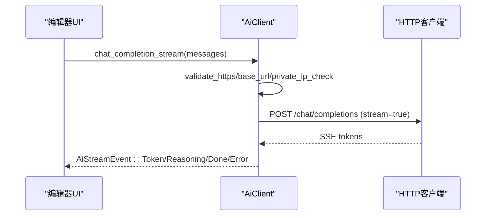
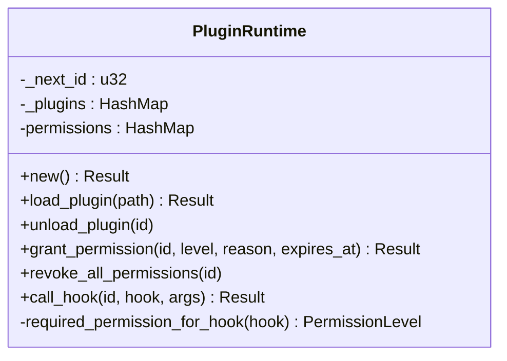
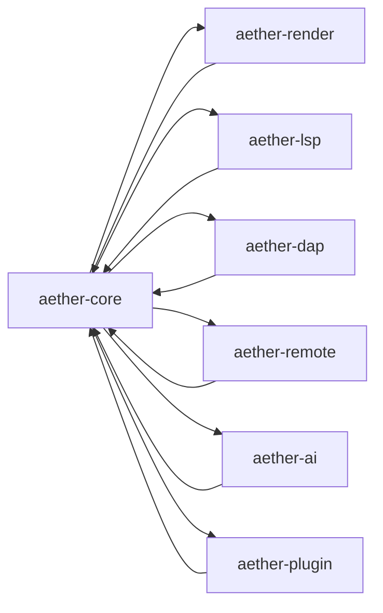

# 核心模块职责

<cite>
**本文引用的文件**
- [aether-core/src/lib.rs](file://crates/aether-core/src/lib.rs)
- [aether-core/src/buffer/mod.rs](file://crates/aether-core/src/buffer/mod.rs)
- [aether-core/src/buffer/text_buffer.rs](file://crates/aether-core/src/buffer/text_buffer.rs)
- [aether-core/src/lexer/mod.rs](file://crates/aether-core/src/lexer/mod.rs)
- [aether-core/src/search.rs](file://crates/aether-core/src/search.rs)
- [aether-render/src/lib.rs](file://crates/aether-render/src/lib.rs)
- [aether-render/src/theme.rs](file://crates/aether-render/src/theme.rs)
- [aether-render/src/gpu/mod.rs](file://crates/aether-render/src/gpu/mod.rs)
- [aether-lsp/src/lib.rs](file://crates/aether-lsp/src/lib.rs)
- [aether-lsp/src/client.rs](file://crates/aether-lsp/src/client.rs)
- [aether-dap/src/lib.rs](file://crates/aether-dap/src/lib.rs)
- [aether-dap/src/client.rs](file://crates/aether-dap/src/client.rs)
- [aether-remote/src/lib.rs](file://crates/aether-remote/src/lib.rs)
- [aether-remote/src/remote_fs.rs](file://crates/aether-remote/src/remote_fs.rs)
- [aether-remote/src/ssh.rs](file://crates/aether-remote/src/ssh.rs)
- [aether-ai/src/lib.rs](file://crates/aether-ai/src/lib.rs)
- [aether-plugin/src/lib.rs](file://crates/aether-plugin/src/lib.rs)
- [aether-plugin/src/runtime.rs](file://crates/aether-plugin/src/runtime.rs)
</cite>

## 目录
1. [简介](#简介)
2. [项目结构](#项目结构)
3. [核心组件](#核心组件)
4. [架构总览](#架构总览)
5. [详细组件分析](#详细组件分析)
6. [依赖关系分析](#依赖关系分析)
7. [性能考量](#性能考量)
8. [故障排查指南](#故障排查指南)
9. [结论](#结论)
10. [附录](#附录)

## 简介
本文件面向牧羊人编辑器的核心模块，系统性说明各 crate 的职责、设计目标与关键 API，并给出模块间协作的示例流程。重点覆盖：
- aether-core：文本缓冲、词法分析、搜索
- aether-render：渲染抽象与主题管理
- aether-lsp：语言服务器协议客户端
- aether-dap：调试适配器协议客户端
- aether-remote：远程开发（SSH/容器/工作区）
- aether-ai：AI 服务接口
- aether-plugin：插件系统

目标是帮助开发者快速理解各模块在系统中的定位、交互方式与扩展点。

## 项目结构
仓库采用多 crate 模块化组织，核心能力按职责拆分到独立 crate，UI 与平台相关逻辑位于上层 crate。本次文档聚焦以下核心 crate：
- aether-core：提供编辑器内核能力（缓冲区、词法、搜索）
- aether-render：渲染抽象、主题、GPU 管线
- aether-lsp：LSP 客户端，管理与语言服务器的通信
- aether-dap：DAP 客户端，管理与调试适配器的会话
- aether-remote：远程文件系统抽象与 SSH/容器实现
- aether-ai：AI 服务客户端（OpenAI 兼容流式/非流式）
- aether-plugin：插件运行时与权限控制

图表来源
- [aether-core/src/lib.rs:1-12](file://crates/aether-core/src/lib.rs#L1-L12)
- [aether-render/src/lib.rs:1-5](file://crates/aether-render/src/lib.rs#L1-L5)
- [aether-lsp/src/lib.rs:1-16](file://crates/aether-lsp/src/lib.rs#L1-L16)
- [aether-dap/src/lib.rs:1-8](file://crates/aether-dap/src/lib.rs#L1-L8)
- [aether-remote/src/lib.rs:1-18](file://crates/aether-remote/src/lib.rs#L1-L18)
- [aether-ai/src/lib.rs:1-800](file://crates/aether-ai/src/lib.rs#L1-L800)
- [aether-plugin/src/lib.rs:1-8](file://crates/aether-plugin/src/lib.rs#L1-L8)

章节来源
- [aether-core/src/lib.rs:1-12](file://crates/aether-core/src/lib.rs#L1-L12)
- [aether-render/src/lib.rs:1-5](file://crates/aether-render/src/lib.rs#L1-L5)
- [aether-lsp/src/lib.rs:1-16](file://crates/aether-lsp/src/lib.rs#L1-L16)
- [aether-dap/src/lib.rs:1-8](file://crates/aether-dap/src/lib.rs#L1-L8)
- [aether-remote/src/lib.rs:1-18](file://crates/aether-remote/src/lib.rs#L1-L18)
- [aether-ai/src/lib.rs:1-800](file://crates/aether-ai/src/lib.rs#L1-L800)
- [aether-plugin/src/lib.rs:1-8](file://crates/aether-plugin/src/lib.rs#L1-L8)

## 核心组件
- aether-core
  - 文本缓冲：统一 TextBuffer 接口，支持插入、删除、切片、行号转换、快照、撤销状态保存/恢复；提供多光标与选择区域模型。
  - 词法分析：通用 Lexer trait 与 TokenKind 枚举，按语言分发具体 lexer，支持多种语言与 Markdown/JSON/TOML/HTML/CSS。
  - 搜索：全局搜索，优先使用 ripgrep，回退 walkdir+regex，支持大小写敏感、正则、包含/排除过滤。
- aether-render
  - 主题系统：Theme/SyntaxColors 定义 UI 与语法高亮颜色映射，提供 dark/glass 主题与语义 token 颜色查询。
  - GPU 渲染：gpu 子模块提供 buffer、compute_context、language_tables、lexer、render、shader、viewport 等高性能渲染基础设施。
- aether-lsp
  - LspClient：管理多个语言服务器实例，按 language_id 路由请求；维护文档同步、诊断缓存、事件通道；提供补全、悬停、定义、引用、重命名、格式化、语义令牌、内联提示等 API。
- aether-dap
  - DapClient：管理多个调试会话，启动/停止会话，默认适配器配置发现（rust/c/cpp/python/js/ts）。
- aether-remote
  - RemoteFs trait：统一远程文件系统访问（读/写/列目录/监听/受限执行），内置命令白名单与 shell 元字符过滤，Git 安全校验。
  - SSH 实现：基于系统 ssh 二进制，支持密钥/Agent 认证，连接探测与安全参数构造。
- aether-ai
  - AiClient/AiConfig/AiProvider：OpenAI 兼容接口，支持 DeepSeek/Kimi/自定义；流式与非流式聊天补全；严格的安全校验（HTTPS、私有 IP 阻断、DNS TOCTOU 二次校验、响应体限制、错误脱敏）。
- aether-plugin
  - PluginRuntime：WASM 插件加载、权限授予/撤销、钩子调用（当前为占位实现，权限检查已接入）。
  - 权限体系：按 hook 类型映射所需权限级别（只读/文件IO/网络/系统）。

章节来源
- [aether-core/src/buffer/text_buffer.rs:1-200](file://crates/aether-core/src/buffer/text_buffer.rs#L1-L200)
- [aether-core/src/lexer/mod.rs:1-306](file://crates/aether-core/src/lexer/mod.rs#L1-L306)
- [aether-core/src/search.rs:1-342](file://crates/aether-core/src/search.rs#L1-L342)
- [aether-render/src/theme.rs:1-487](file://crates/aether-render/src/theme.rs#L1-L487)
- [aether-render/src/gpu/mod.rs:1-10](file://crates/aether-render/src/gpu/mod.rs#L1-L10)
- [aether-lsp/src/client.rs:1-800](file://crates/aether-lsp/src/client.rs#L1-L800)
- [aether-dap/src/client.rs:1-178](file://crates/aether-dap/src/client.rs#L1-L178)
- [aether-remote/src/remote_fs.rs:1-268](file://crates/aether-remote/src/remote_fs.rs#L1-L268)
- [aether-remote/src/ssh.rs:1-200](file://crates/aether-remote/src/ssh.rs#L1-L200)
- [aether-ai/src/lib.rs:1-800](file://crates/aether-ai/src/lib.rs#L1-L800)
- [aether-plugin/src/runtime.rs:1-200](file://crates/aether-plugin/src/runtime.rs#L1-L200)

## 架构总览
下图展示核心模块之间的主要依赖与数据流向：编辑器内核驱动渲染与语言服务，远程与 AI 作为外部能力注入，插件系统提供扩展点。

图表来源
- [aether-core/src/buffer/text_buffer.rs:1-200](file://crates/aether-core/src/buffer/text_buffer.rs#L1-L200)
- [aether-core/src/lexer/mod.rs:1-306](file://crates/aether-core/src/lexer/mod.rs#L1-L306)
- [aether-render/src/theme.rs:1-487](file://crates/aether-render/src/theme.rs#L1-L487)
- [aether-lsp/src/client.rs:1-800](file://crates/aether-lsp/src/client.rs#L1-L800)
- [aether-dap/src/client.rs:1-178](file://crates/aether-dap/src/client.rs#L1-L178)
- [aether-remote/src/remote_fs.rs:1-268](file://crates/aether-remote/src/remote_fs.rs#L1-L268)
- [aether-ai/src/lib.rs:1-800](file://crates/aether-ai/src/lib.rs#L1-L800)
- [aether-plugin/src/runtime.rs:1-200](file://crates/aether-plugin/src/runtime.rs#L1-L200)

## 详细组件分析

### aether-core：文本缓冲、词法分析、搜索
- 文本缓冲
  - 设计目标：以字节偏移为核心，支持不可变快照与撤销/重做状态；提供多光标与选择区域模型。
  - 关键 API：insert/delete/slice/full_text/line_count/byte_len/line_text/line_byte_range/line_col_to_byte/byte_to_line_col/create_snapshot/save_state/restore_state。
  - 数据结构：TextBuffer 与 TextBufferSnapshot trait；BufferState、Cursor、Selection、EditOp、EditResult、MultiCursorState。
- 词法分析
  - 设计目标：跨语言统一的 Lexer trait 与 TokenKind；按扩展名/路径推断语言并创建对应 lexer；支持静态分发避免 Box 分配。
  - 关键 API：Language::from_extension/from_path/create_lexer/lex_full；Lexer::lex_full。
  - 支持语言：C/Rust/Python/JS/TS/Go/Java/Json/Markdown/Toml/Html/Css/PlainText/Image。
- 搜索
  - 设计目标：优先使用 ripgrep，回退 walkdir+regex；支持大小写敏感、正则、包含/排除过滤；限制最大结果数与文件大小。
  - 关键 API：search_workspace(SearchQuery)->Vec<SearchResult>；内部构建 regex、解析 rg 输出、walkdir 遍历。

图表来源
- [aether-core/src/search.rs:45-171](file://crates/aether-core/src/search.rs#L45-L171)

章节来源
- [aether-core/src/buffer/mod.rs:1-9](file://crates/aether-core/src/buffer/mod.rs#L1-L9)
- [aether-core/src/buffer/text_buffer.rs:1-200](file://crates/aether-core/src/buffer/text_buffer.rs#L1-L200)
- [aether-core/src/lexer/mod.rs:1-306](file://crates/aether-core/src/lexer/mod.rs#L1-L306)
- [aether-core/src/search.rs:1-342](file://crates/aether-core/src/search.rs#L1-L342)

### aether-render：渲染抽象、主题管理
- 主题系统
  - 设计目标：集中管理 UI 与语法高亮颜色；提供 dark/glass 主题；支持语义 token 索引到颜色的映射。
  - 关键 API：Theme::dark/glass/default；Theme::color_for_token/color_for_semantic_token_index；SyntaxColors::shared。
- GPU 渲染
  - 设计目标：高性能渲染管线，包括 buffer、compute_context、language_tables、lexer、render、shader、viewport。
  - 关键模块：gpu 子模块暴露 benchmark、buffer、compute_context、language_tables、lexer、render、shader、viewport。

图表来源
- [aether-render/src/theme.rs:1-487](file://crates/aether-render/src/theme.rs#L1-L487)

章节来源
- [aether-render/src/lib.rs:1-5](file://crates/aether-render/src/lib.rs#L1-L5)
- [aether-render/src/theme.rs:1-487](file://crates/aether-render/src/theme.rs#L1-L487)
- [aether-render/src/gpu/mod.rs:1-10](file://crates/aether-render/src/gpu/mod.rs#L1-L10)

### aether-lsp：语言服务器协议客户端
- 设计目标：统一管理多个语言服务器实例，按 language_id 路由；维护文档同步与诊断缓存；通过事件通道向 UI 推送结果。
- 关键 API：start_server/open_document/close_document/notify_change/request_completion/request_hover/request_definition/request_references/request_rename/request_code_actions/request_formatting/request_semantic_tokens_full/range/delta/request_inlay_hints/shutdown_all/get_capabilities/is_server_ready/remove_server。
- 默认配置：rust-analyzer/pylsp/typescript-language-server/clangd。

图表来源
- [aether-lsp/src/client.rs:73-311](file://crates/aether-lsp/src/client.rs#L73-L311)

章节来源
- [aether-lsp/src/lib.rs:1-16](file://crates/aether-lsp/src/lib.rs#L1-L16)
- [aether-lsp/src/client.rs:1-800](file://crates/aether-lsp/src/client.rs#L1-L800)

### aether-dap：调试适配器协议
- 设计目标：管理多个调试会话，启动/停止会话；默认适配器配置发现（rust/c/cpp/python/js/ts）。
- 关键 API：start_session/get_session/stop_all；default_adapter_config。

图表来源
- [aether-dap/src/client.rs:14-43](file://crates/aether-dap/src/client.rs#L14-L43)

章节来源
- [aether-dap/src/lib.rs:1-8](file://crates/aether-dap/src/lib.rs#L1-L8)
- [aether-dap/src/client.rs:1-178](file://crates/aether-dap/src/client.rs#L1-L178)

### aether-remote：远程开发功能
- 设计目标：统一远程文件系统抽象，支持 SSH/容器后端；内置命令白名单与 shell 元字符过滤；Git 安全校验。
- 关键 API：RemoteFs trait（read_file/write_file/list_dir/watch/exec/exec_restricted/exists/is_git_repo/get_git_info/git_exec）。
- SSH 实现：SshRemoteFs，基于系统 ssh 二进制，支持密钥/Agent 认证，连接探测与安全参数构造。

图表来源
- [aether-remote/src/remote_fs.rs:46-94](file://crates/aether-remote/src/remote_fs.rs#L46-L94)

章节来源
- [aether-remote/src/lib.rs:1-18](file://crates/aether-remote/src/lib.rs#L1-L18)
- [aether-remote/src/remote_fs.rs:1-268](file://crates/aether-remote/src/remote_fs.rs#L1-L268)
- [aether-remote/src/ssh.rs:1-200](file://crates/aether-remote/src/ssh.rs#L1-L200)

### aether-ai：AI 服务接口
- 设计目标：OpenAI 兼容接口，支持 DeepSeek/Kimi/自定义；流式与非流式聊天补全；严格的安全校验（HTTPS、私有 IP 阻断、DNS TOCTOU 二次校验、响应体限制、错误脱敏）。
- 关键 API：AiClient::new/test_connection/chat_completion/chat_completion_stream/list_models/complete_openai_compatible/stream_openai_compatible；AiConfig/AiProvider/AiError。

图表来源
- [aether-ai/src/lib.rs:716-800](file://crates/aether-ai/src/lib.rs#L716-L800)

章节来源
- [aether-ai/src/lib.rs:1-800](file://crates/aether-ai/src/lib.rs#L1-L800)

### aether-plugin：插件系统
- 设计目标：WASM 插件加载、权限授予/撤销、钩子调用（当前为占位实现，权限检查已接入）。
- 关键 API：PluginRuntime::load_plugin/unload_plugin/grant_permission/revoke_all_permissions/call_hook；required_permission_for_hook。
- 权限级别：L1_ReadOnly/L2_FileIO/L3_Network/L4_System。

图表来源
- [aether-plugin/src/runtime.rs:1-200](file://crates/aether-plugin/src/runtime.rs#L1-L200)

章节来源
- [aether-plugin/src/lib.rs:1-8](file://crates/aether-plugin/src/lib.rs#L1-L8)
- [aether-plugin/src/runtime.rs:1-200](file://crates/aether-plugin/src/runtime.rs#L1-L200)

## 依赖关系分析
- aether-core 被 aether-render、aether-lsp、aether-dap、aether-remote、aether-ai、aether-plugin 广泛依赖，提供基础能力。
- aether-render 依赖 aether-core 的词法类型进行主题映射。
- aether-lsp 与 aether-dap 通过事件通道与 UI 解耦，便于异步处理。
- aether-remote 提供安全的 exec_restricted 与 Git 校验，供上层模块复用。
- aether-ai 提供安全严格的 HTTP 客户端封装，供 AI 面板与编辑器集成。
- aether-plugin 通过权限系统约束插件行为，保障编辑器安全。

图表来源
- [aether-core/src/lib.rs:1-12](file://crates/aether-core/src/lib.rs#L1-L12)
- [aether-render/src/lib.rs:1-5](file://crates/aether-render/src/lib.rs#L1-L5)
- [aether-lsp/src/lib.rs:1-16](file://crates/aether-lsp/src/lib.rs#L1-L16)
- [aether-dap/src/lib.rs:1-8](file://crates/aether-dap/src/lib.rs#L1-L8)
- [aether-remote/src/lib.rs:1-18](file://crates/aether-remote/src/lib.rs#L1-L18)
- [aether-ai/src/lib.rs:1-800](file://crates/aether-ai/src/lib.rs#L1-L800)
- [aether-plugin/src/lib.rs:1-8](file://crates/aether-plugin/src/lib.rs#L1-L8)

章节来源
- [aether-core/src/lib.rs:1-12](file://crates/aether-core/src/lib.rs#L1-L12)
- [aether-render/src/lib.rs:1-5](file://crates/aether-render/src/lib.rs#L1-L5)
- [aether-lsp/src/lib.rs:1-16](file://crates/aether-lsp/src/lib.rs#L1-L16)
- [aether-dap/src/lib.rs:1-8](file://crates/aether-dap/src/lib.rs#L1-L8)
- [aether-remote/src/lib.rs:1-18](file://crates/aether-remote/src/lib.rs#L1-L18)
- [aether-ai/src/lib.rs:1-800](file://crates/aether-ai/src/lib.rs#L1-L800)
- [aether-plugin/src/lib.rs:1-8](file://crates/aether-plugin/src/lib.rs#L1-L8)

## 性能考量
- 文本缓冲
  - 使用字节偏移与不可变快照减少锁竞争与拷贝开销；EditResult 精确计算受影响行范围，优化行级缓存失效。
- 词法分析
  - 静态分发 Language::lex_full 避免 Box 分配与动态分发；TokenKind 紧凑表示，LexemeSpan 压缩内存占用。
- 搜索
  - 优先使用 ripgrep 提升大规模搜索性能；walkdir 回退时限制文件大小与结果数量。
- 渲染
  - GPU 子模块提供高性能 buffer、compute_context、shader 与 viewport；主题颜色共享构造减少重复初始化。
- LSP/DAP
  - 使用 per-server 锁避免全局写锁跨 await；事件通道异步推送结果，降低 UI 阻塞。
- 远程
  - exec_restricted 白名单与元字符过滤减少安全风险与无效命令执行；Git 参数校验防止路径遍历。
- AI
  - 流式响应与响应体限制避免内存膨胀；DNS 二次校验与 HTTPS 强制提升安全性与稳定性。

[本节为通用指导，不直接分析具体文件]

## 故障排查指南
- LSP
  - 诊断缓存清理：关闭文档或服务器退出时清空诊断缓存，避免显示过期诊断。
  - 版本一致性：notify_change_raw 成功后才递增版本号，避免失败导致版本失步。
- DAP
  - 会话管理：stop_all 断开所有会话并清空 map；默认适配器配置缺失时返回 None。
- 远程
  - 命令白名单：exec_restricted 拒绝不在白名单的命令；Git 参数校验阻止非法路径与标志。
  - SSH 认证：shell out 模式不支持密码认证，需配置密钥或 Agent。
- AI
  - 错误脱敏：safe_display 仅返回用户友好描述；响应体限制至 10MB；错误消息截断至 200 字符。
  - DNS 防护：TOCTOU 二次校验与私有 IP 阻断；禁止云元数据端点。
- 插件
  - 权限检查：call_hook 根据 hook 类型要求相应权限；未满足权限返回明确错误。

章节来源
- [aether-lsp/src/client.rs:147-190](file://crates/aether-lsp/src/client.rs#L147-L190)
- [aether-lsp/src/client.rs:253-286](file://crates/aether-lsp/src/client.rs#L253-L286)
- [aether-dap/src/client.rs:36-43](file://crates/aether-dap/src/client.rs#L36-L43)
- [aether-remote/src/remote_fs.rs:46-94](file://crates/aether-remote/src/remote_fs.rs#L46-L94)
- [aether-remote/src/remote_fs.rs:162-185](file://crates/aether-remote/src/remote_fs.rs#L162-L185)
- [aether-remote/src/ssh.rs:130-154](file://crates/aether-remote/src/ssh.rs#L130-L154)
- [aether-ai/src/lib.rs:124-163](file://crates/aether-ai/src/lib.rs#L124-L163)
- [aether-ai/src/lib.rs:536-570](file://crates/aether-ai/src/lib.rs#L536-L570)
- [aether-ai/src/lib.rs:394-456](file://crates/aether-ai/src/lib.rs#L394-L456)
- [aether-plugin/src/runtime.rs:127-175](file://crates/aether-plugin/src/runtime.rs#L127-L175)

## 结论
牧羊人编辑器的核心模块以 aether-core 为基础，向上提供渲染、语言服务、调试、远程与 AI 能力，并通过插件系统实现可扩展性。各模块职责清晰、API 稳定，注重性能与安全（如远程命令白名单、AI 安全校验、LSP 版本一致性）。开发者可基于这些模块快速构建编辑器功能，并通过事件通道与异步机制保持 UI 流畅。

[本节为总结，不直接分析具体文件]

## 附录
- 模块间协作示例（文字描述）
  - 打开文档：UI 调用 LspClient::open_document，更新 DocumentSync 并向对应 LanguageServer 发送 open 通知；同时 aether-core 提供文本缓冲与词法分析，aether-render 根据主题渲染高亮。
  - 编辑变更：UI 调用 LspClient::notify_change，计算增量变更并发送到 LanguageServer；aether-core 更新缓冲区并返回 EditResult 用于行级缓存失效。
  - 调试会话：UI 调用 DapClient::start_session，建立 DebugSession 并通过事件通道接收断点/变量事件。
  - 远程操作：UI 调用 RemoteFs::exec_restricted 执行受限命令，确保白名单与元字符过滤；Git 操作通过 git_exec 进行参数校验。
  - AI 对话：UI 调用 AiClient::chat_completion_stream，进行 HTTPS 与 DNS 校验后发起流式请求，接收 Token/Reasoning/Done/Error 事件。
  - 插件钩子：UI 调用 PluginRuntime::call_hook，先进行权限检查，再执行钩子（当前为占位实现）。

[本节为概念性说明，不直接分析具体文件]