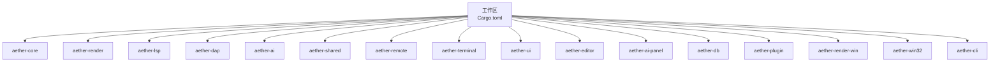
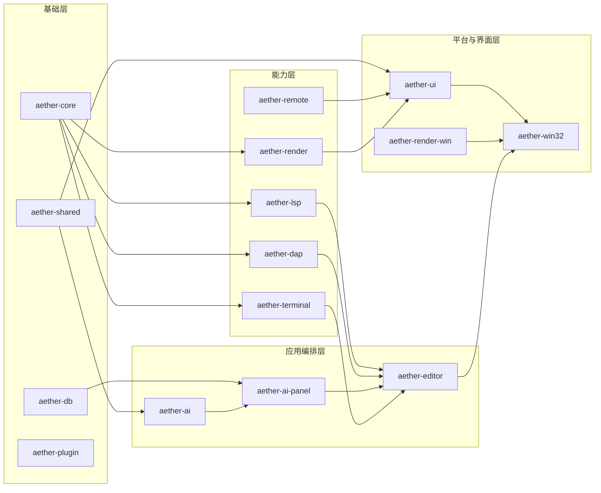
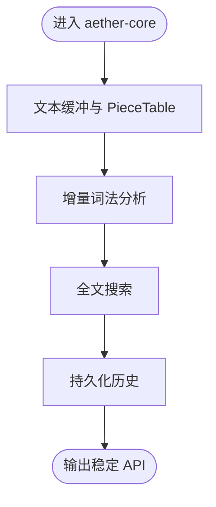
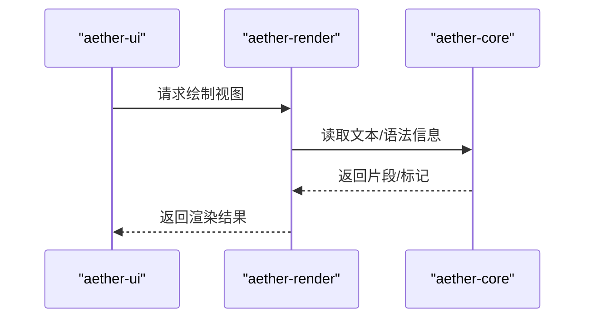
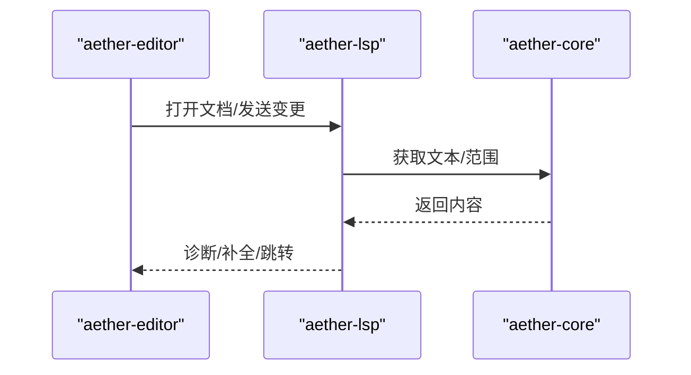
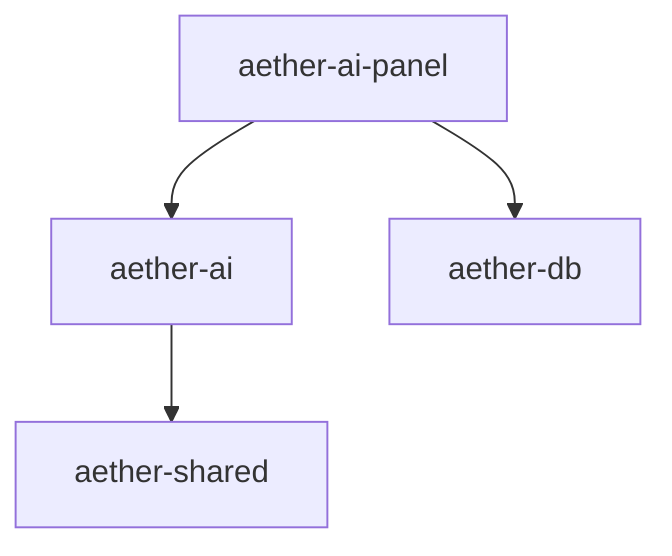
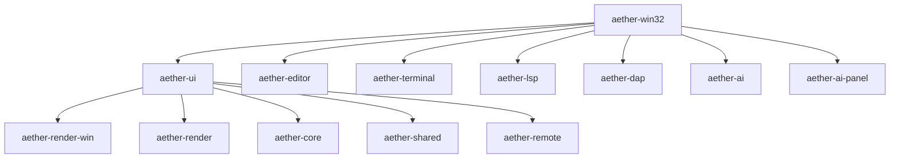
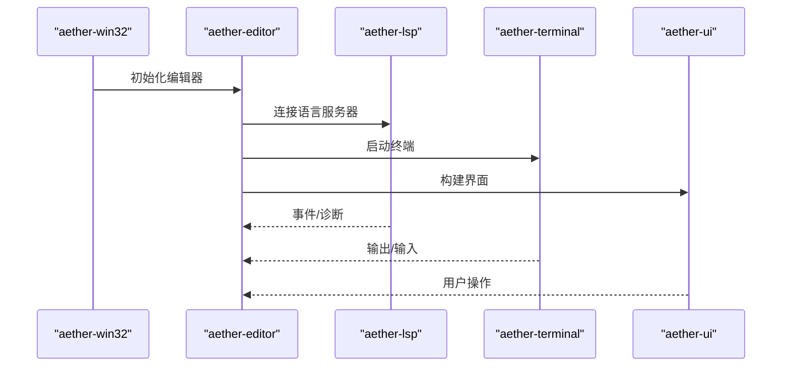
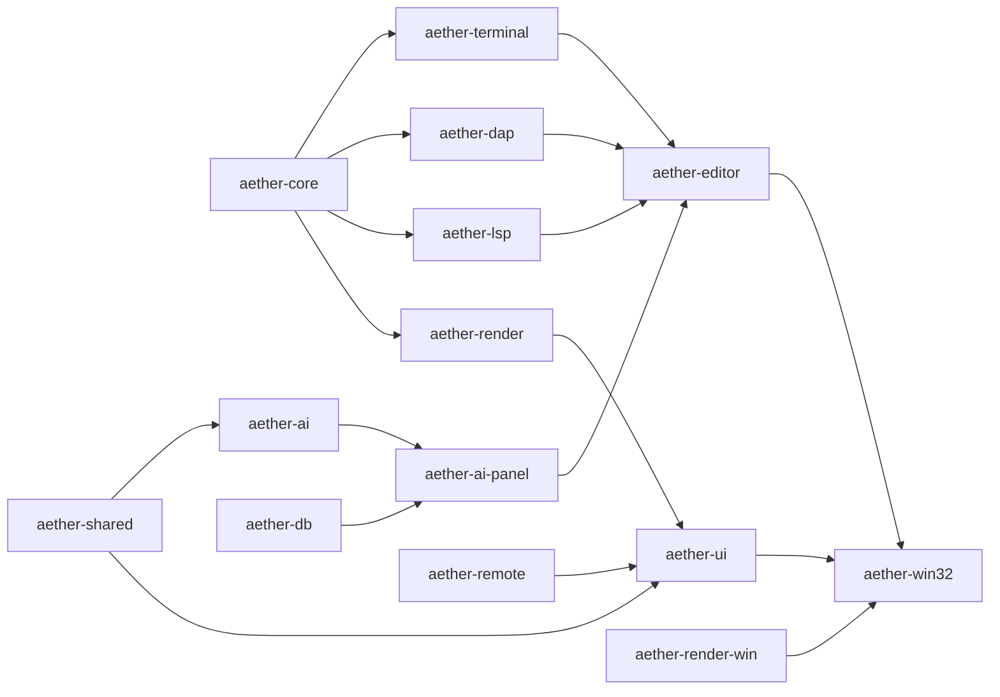

# 模块依赖关系

<cite>
**本文引用的文件**
- [Cargo.toml](file://Cargo.toml)
- [aether-core/Cargo.toml](file://crates/aether-core/Cargo.toml)
- [aether-render/Cargo.toml](file://crates/aether-render/Cargo.toml)
- [aether-lsp/Cargo.toml](file://crates/aether-lsp/Cargo.toml)
- [aether-dap/Cargo.toml](file://crates/aether-dap/Cargo.toml)
- [aether-plugin/Cargo.toml](file://crates/aether-plugin/Cargo.toml)
- [aether-remote/Cargo.toml](file://crates/aether-remote/Cargo.toml)
- [aether-ai/Cargo.toml](file://crates/aether-ai/Cargo.toml)
- [aether-shared/Cargo.toml](file://crates/aether-shared/Cargo.toml)
- [aether-cli/Cargo.toml](file://crates/aether-cli/Cargo.toml)
- [aether-editor/Cargo.toml](file://crates/aether-editor/Cargo.toml)
- [aether-ai-panel/Cargo.toml](file://crates/aether-ai-panel/Cargo.toml)
- [aether-db/Cargo.toml](file://crates/aether-db/Cargo.toml)
- [aether-terminal/Cargo.toml](file://crates/aether-terminal/Cargo.toml)
- [aether-ui/Cargo.toml](file://crates/aether-ui/Cargo.toml)
- [aether-render-win/Cargo.toml](file://crates/aether-render-win/Cargo.toml)
- [aether-win32/Cargo.toml](file://crates/aether-win32/Cargo.toml)
</cite>

## 目录
1. [简介](#简介)
2. [项目结构](#项目结构)
3. [核心组件](#核心组件)
4. [架构总览](#架构总览)
5. [详细组件分析](#详细组件分析)
6. [依赖分析](#依赖分析)
7. [性能考虑](#性能考虑)
8. [故障排查指南](#故障排查指南)
9. [结论](#结论)
10. [附录](#附录)

## 简介
本文件聚焦于牧羊人编辑器（Aether）的 Cargo Workspace 中各 crate 之间的依赖关系，梳理基础依赖与上层应用的分层设计，解释依赖方向、循环依赖规避策略以及模块化最佳实践。文档提供依赖关系图与构建顺序说明，帮助开发者理解构建流程与模块耦合程度。

## 项目结构
Workspace 定义了多个 crate，涵盖核心能力（文本缓冲、词法分析）、渲染子系统、语言协议（LSP/DAP）、AI/数据库、远程能力、UI 与平台适配等。顶层工作区通过成员列表组织所有 crate，并统一版本、工具链与发布配置。

**图示来源**
- [Cargo.toml:1-19](file://Cargo.toml#L1-L19)

**章节来源**
- [Cargo.toml:1-37](file://Cargo.toml#L1-L37)

## 核心组件
- aether-core：文本缓冲、增量词法、搜索、持久化历史等底层能力，是多数上层模块的基础依赖。
- aether-render：基于 Direct2D/DirectWrite/DXGI/Direct3D 的渲染管线，依赖 core 的数据结构与算法。
- aether-lsp / aether-dap：语言服务与调试协议的异步通信实现，依赖 core 的文本与缓冲区抽象。
- aether-ai / aether-ai-panel：AI 能力与面板集成，依赖 shared 的配置与存储，ai-panel 还依赖 db。
- aether-shared：跨模块共享的启动参数、设置等数据模型与工具。
- aether-remote：远程文件系统、SSH、Git 等能力，为 UI 与编辑器提供远端资源访问。
- aether-terminal：终端仿真与进程管理，依赖 core 的文本处理。
- aether-ui：Windows 平台上的 UI 框架与控件，依赖 render、core、shared、remote 等。
- aether-editor：编辑器业务编排层，组合 core、lsp、ai-panel、terminal、ui、render、remote 等。
- aether-win32：Windows 应用入口与窗口消息循环，聚合几乎所有功能模块。
- aether-cli：命令行工具（如清理历史），独立或轻量依赖。
- aether-db：向量/索引存储（如 HNSW），被 ai-panel 使用。
- aether-plugin：插件接口与运行时契约，当前仅声明序列化依赖，便于扩展。
- aether-render-win：渲染相关的 Windows 特定封装（布局、上下文）。

**章节来源**
- [aether-core/Cargo.toml:1-22](file://crates/aether-core/Cargo.toml#L1-L22)
- [aether-render/Cargo.toml:1-12](file://crates/aether-render/Cargo.toml#L1-L12)
- [aether-lsp/Cargo.toml:1-20](file://crates/aether-lsp/Cargo.toml#L1-L20)
- [aether-dap/Cargo.toml:1-19](file://crates/aether-dap/Cargo.toml#L1-L19)
- [aether-ai/Cargo.toml:1-12](file://crates/aether-ai/Cargo.toml#L1-L12)
- [aether-shared/Cargo.toml:1-13](file://crates/aether-shared/Cargo.toml#L1-L13)
- [aether-remote/Cargo.toml:1-13](file://crates/aether-remote/Cargo.toml#L1-L13)
- [aether-terminal/Cargo.toml:1-10](file://crates/aether-terminal/Cargo.toml#L1-L10)
- [aether-ui/Cargo.toml:1-23](file://crates/aether-ui/Cargo.toml#L1-L23)
- [aether-editor/Cargo.toml:1-24](file://crates/aether-editor/Cargo.toml#L1-L24)
- [aether-win32/Cargo.toml:1-44](file://crates/aether-win32/Cargo.toml#L1-L44)
- [aether-cli/Cargo.toml](file://crates/aether-cli/Cargo.toml)
- [aether-db/Cargo.toml:1-8](file://crates/aether-db/Cargo.toml#L1-L8)
- [aether-plugin/Cargo.toml:1-9](file://crates/aether-plugin/Cargo.toml#L1-L9)
- [aether-render-win/Cargo.toml](file://crates/aether-render-win/Cargo.toml)

## 架构总览
整体采用“自底向上”的分层架构：
- 基础层：aether-core、aether-shared、aether-db、aether-plugin
- 能力层：aether-render、aether-lsp、aether-dap、aether-remote、aether-terminal
- 应用编排层：aether-editor、aether-ai-panel
- 平台与界面层：aether-ui、aether-render-win、aether-win32
- 工具与入口：aether-cli、aether-win32（二进制入口）

**图示来源**
- [aether-core/Cargo.toml:6-13](file://crates/aether-core/Cargo.toml#L6-L13)
- [aether-render/Cargo.toml:6-11](file://crates/aether-render/Cargo.toml#L6-L11)
- [aether-lsp/Cargo.toml:6-16](file://crates/aether-lsp/Cargo.toml#L6-L16)
- [aether-dap/Cargo.toml:6-15](file://crates/aether-dap/Cargo.toml#L6-L15)
- [aether-terminal/Cargo.toml:6-9](file://crates/aether-terminal/Cargo.toml#L6-L9)
- [aether-shared/Cargo.toml:6-12](file://crates/aether-shared/Cargo.toml#L6-L12)
- [aether-remote/Cargo.toml:6-10](file://crates/aether-remote/Cargo.toml#L6-L10)
- [aether-ai/Cargo.toml:6-11](file://crates/aether-ai/Cargo.toml#L6-L11)
- [aether-ai-panel/Cargo.toml:6-20](file://crates/aether-ai-panel/Cargo.toml#L6-L20)
- [aether-editor/Cargo.toml:6-23](file://crates/aether-editor/Cargo.toml#L6-L23)
- [aether-ui/Cargo.toml:6-22](file://crates/aether-ui/Cargo.toml#L6-L22)
- [aether-win32/Cargo.toml:14-43](file://crates/aether-win32/Cargo.toml#L14-L43)

## 详细组件分析

### 基础依赖：aether-core
- 职责：文本缓冲（piece table）、增量词法、搜索、持久化历史、SIMD 工具等。
- 外部依赖：内存映射、正则、并行遍历等，强调高性能与低耦合。
- 被依赖面：广泛被渲染、LSP、DAP、终端、UI、编辑器等引用。

**图示来源**
- [aether-core/Cargo.toml:6-13](file://crates/aether-core/Cargo.toml#L6-L13)

**章节来源**
- [aether-core/Cargo.toml:1-22](file://crates/aether-core/Cargo.toml#L1-L22)

### 渲染子系统：aether-render
- 职责：Direct2D/DirectWrite/DXGI/Direct3D 渲染管线，主题与着色器加载。
- 依赖：aether-core 的数据结构；Windows 图形栈。
- 特点：将渲染细节与编辑逻辑解耦，供 UI 与 win32 调用。

**图示来源**
- [aether-render/Cargo.toml:6-11](file://crates/aether-render/Cargo.toml#L6-L11)
- [aether-ui/Cargo.toml:6-22](file://crates/aether-ui/Cargo.toml#L6-L22)

**章节来源**
- [aether-render/Cargo.toml:1-12](file://crates/aether-render/Cargo.toml#L1-L12)

### 语言协议：aether-lsp / aether-dap
- LSP：基于 tokio 的异步传输、增量同步、语义 token、类型定义等。
- DAP：调试适配器协议客户端/会话/传输，支持进程与 IO。
- 共同点：依赖 core 的文本与缓冲区抽象，使用 tracing 进行可观测性。

**图示来源**
- [aether-lsp/Cargo.toml:6-16](file://crates/aether-lsp/Cargo.toml#L6-L16)
- [aether-editor/Cargo.toml:6-23](file://crates/aether-editor/Cargo.toml#L6-L23)

**章节来源**
- [aether-lsp/Cargo.toml:1-20](file://crates/aether-lsp/Cargo.toml#L1-L20)
- [aether-dap/Cargo.toml:1-19](file://crates/aether-dap/Cargo.toml#L1-L19)

### AI 与面板：aether-ai / aether-ai-panel
- AI：网络请求、模型配置、URL 解析，依赖 shared 的设置。
- AI Panel：记忆存储、嵌入、热/温数据、Agent 交互，依赖 db 与 ort/tokenizers。
- 依赖方向：panel → ai → shared；panel → db。

**图示来源**
- [aether-ai-panel/Cargo.toml:6-20](file://crates/aether-ai-panel/Cargo.toml#L6-L20)
- [aether-ai/Cargo.toml:6-11](file://crates/aether-ai/Cargo.toml#L6-L11)
- [aether-shared/Cargo.toml:6-12](file://crates/aether-shared/Cargo.toml#L6-L12)
- [aether-db/Cargo.toml:6-7](file://crates/aether-db/Cargo.toml#L6-L7)

**章节来源**
- [aether-ai/Cargo.toml:1-12](file://crates/aether-ai/Cargo.toml#L1-L12)
- [aether-ai-panel/Cargo.toml:1-21](file://crates/aether-ai-panel/Cargo.toml#L1-L21)

### 平台与界面：aether-ui / aether-render-win / aether-win32
- UI：Windows 控件、菜单、状态栏、主题、图标、输入法等，依赖 render、core、shared、remote。
- Render-Win：渲染上下文与布局，面向 Windows 的渲染桥接。
- Win32：应用主程序、窗口消息、键盘/鼠标、活动栏、对话框、更新器等，聚合全部能力。

**图示来源**
- [aether-ui/Cargo.toml:6-22](file://crates/aether-ui/Cargo.toml#L6-L22)
- [aether-win32/Cargo.toml:14-43](file://crates/aether-win32/Cargo.toml#L14-L43)

**章节来源**
- [aether-ui/Cargo.toml:1-23](file://crates/aether-ui/Cargo.toml#L1-L23)
- [aether-win32/Cargo.toml:1-44](file://crates/aether-win32/Cargo.toml#L1-L44)

### 编辑器编排：aether-editor
- 职责：协调 LSP、AI Panel、Terminal、UI、Render、Remote 等，形成完整编辑体验。
- 依赖面广但保持单向依赖：不反向依赖 win32，避免平台耦合下沉。

**图示来源**
- [aether-editor/Cargo.toml:6-23](file://crates/aether-editor/Cargo.toml#L6-L23)
- [aether-win32/Cargo.toml:14-43](file://crates/aether-win32/Cargo.toml#L14-L43)

**章节来源**
- [aether-editor/Cargo.toml:1-24](file://crates/aether-editor/Cargo.toml#L1-L24)

## 依赖分析
- 依赖方向原则
  - 自底向上：基础层（core/shared/db/plugin）→ 能力层（render/lsp/dap/remote/terminal）→ 编排层（editor/ai-panel）→ 平台与界面（ui/render-win/win32）。
  - 避免循环依赖：上层不依赖下层之外的同级或更高层；例如 editor 不依赖 win32，win32 作为聚合入口不反向被能力层依赖。
  - 平台隔离：Windows 相关依赖集中在 ui/render-win/win32，能力层尽量保持平台无关。
- 直接依赖与间接依赖
  - core 是最大公共依赖，被 render、lsp、dap、terminal、ui、editor、win32 引用。
  - shared 被 ai、ui、win32 等引用，用于配置与启动参数。
  - remote 被 ui、editor、win32 等引用，提供远端能力。
- 潜在风险
  - 若新增能力需引入平台特性，应优先放入能力层并通过接口暴露给上层，避免在 core 中引入平台依赖。
  - 对第三方库（如 windows、tokio）的使用应限制在合适的层级，减少编译时开销。

**图示来源**
- [aether-core/Cargo.toml:6-13](file://crates/aether-core/Cargo.toml#L6-L13)
- [aether-shared/Cargo.toml:6-12](file://crates/aether-shared/Cargo.toml#L6-L12)
- [aether-db/Cargo.toml:6-7](file://crates/aether-db/Cargo.toml#L6-L7)
- [aether-remote/Cargo.toml:6-10](file://crates/aether-remote/Cargo.toml#L6-L10)
- [aether-render/Cargo.toml:6-11](file://crates/aether-render/Cargo.toml#L6-L11)
- [aether-lsp/Cargo.toml:6-16](file://crates/aether-lsp/Cargo.toml#L6-L16)
- [aether-dap/Cargo.toml:6-15](file://crates/aether-dap/Cargo.toml#L6-L15)
- [a-terminal/Cargo.toml:6-9](file://crates/aether-terminal/Cargo.toml#L6-L9)
- [aether-ai/Cargo.toml:6-11](file://crates/aether-ai/Cargo.toml#L6-L11)
- [aether-ai-panel/Cargo.toml:6-20](file://crates/aether-ai-panel/Cargo.toml#L6-L20)
- [aether-editor/Cargo.toml:6-23](file://crates/aether-editor/Cargo.toml#L6-L23)
- [aether-ui/Cargo.toml:6-22](file://crates/aether-ui/Cargo.toml#L6-L22)
- [aether-win32/Cargo.toml:14-43](file://crates/aether-win32/Cargo.toml#L14-L43)

**章节来源**
- [Cargo.toml:1-19](file://Cargo.toml#L1-L19)
- [aether-win32/Cargo.toml:14-43](file://crates/aether-win32/Cargo.toml#L14-L43)

## 性能考虑
- 构建优化：工作区启用 fat LTO、单 codegen unit、opt-level 3，有利于最终二进制体积与运行性能。
- 渲染路径：GPU 计算与着色器在 render 层集中，减少 UI 层复杂度。
- 并发模型：LSP/DAP 使用 tokio 异步 I/O，提升高并发场景下的吞吐。
- 内存与缓存：core 使用 memmap2、smallvec、rayon 等优化大文件与并行处理；ai-panel 使用 ort/tokenizers 加速推理。
- 建议
  - 控制第三方依赖的 feature 集，避免不必要的编译开销。
  - 将重计算放在能力层并缓存结果，UI 层只做展示。
  - 对高频路径（如增量词法、渲染）进行基准测试与热点分析。

[本节为通用指导，不直接分析具体文件]

## 故障排查指南
- 构建失败
  - 检查目标平台条件依赖（如 windows crate 的 features）是否匹配当前目标。
  - 确认 workspace resolver 与 edition 一致，避免解析冲突。
- 运行时问题
  - 使用 tracing/tracing-subscriber 收集日志，定位 LSP/DAP 通信与渲染异常。
  - 终端与进程相关错误可通过 tracing-appender 输出到文件，便于离线分析。
- 常见问题
  - 循环依赖：若出现循环导入，应抽取公共接口至基础层或调整依赖方向。
  - 平台耦合：确保能力层不直接依赖平台特性，必要时通过 trait 抽象。

**章节来源**
- [aether-lsp/Cargo.toml:6-16](file://crates/aether-lsp/Cargo.toml#L6-L16)
- [aether-dap/Cargo.toml:6-15](file://crates/aether-dap/Cargo.toml#L6-L15)
- [aether-win32/Cargo.toml:24-43](file://crates/aether-win32/Cargo.toml#L24-L43)

## 结论
本项目采用清晰的分层架构与明确的依赖方向，以 aether-core 为核心基础，逐步向上构建能力层与应用编排层，最终由 aether-win32 聚合为可执行应用。通过平台隔离、接口抽象与合理的依赖边界，有效避免了循环依赖与过度耦合。遵循本文的依赖关系与构建顺序，开发者可以高效地定位问题、扩展功能并保持代码的可维护性与性能。

[本节为总结性内容，不直接分析具体文件]

## 附录
- 构建顺序建议
  - 先构建基础层：aether-core、aether-shared、aether-db、aether-plugin
  - 再构建能力层：aether-render、aether-lsp、aether-dap、aether-remote、aether-terminal
  - 然后构建编排层：aether-editor、aether-ai-panel、aether-ai
  - 最后构建平台与界面：aether-ui、aether-render-win、aether-win32、aether-cli
- 依赖关系速查
  - 基础依赖：aether-core、aether-shared、aether-db、aether-plugin
  - 上层应用：aether-editor、aether-win32
  - 关键桥梁：aether-render、aether-lsp、aether-dap、aether-remote、aether-terminal

**章节来源**
- [Cargo.toml:1-19](file://Cargo.toml#L1-L19)
- [aether-win32/Cargo.toml:14-43](file://crates/aether-win32/Cargo.toml#L14-L43)
- [aether-editor/Cargo.toml:6-23](file://crates/aether-editor/Cargo.toml#L6-L23)