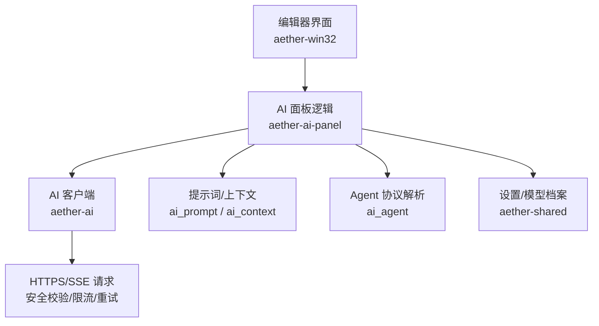
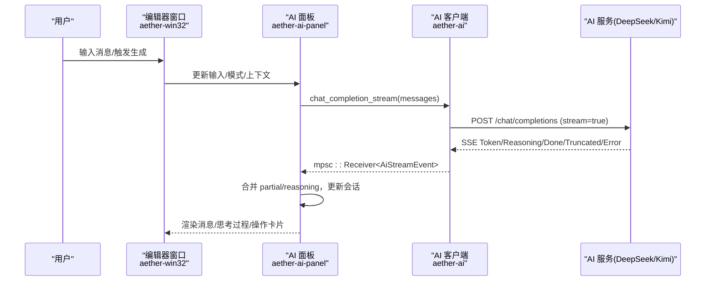
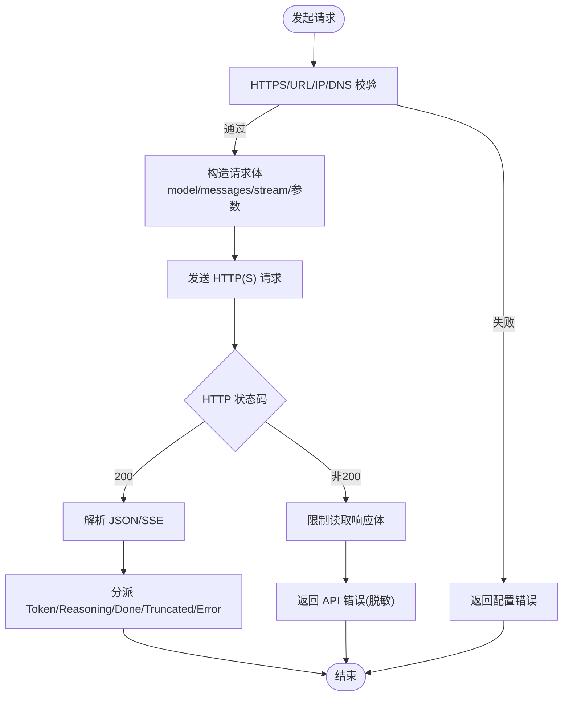
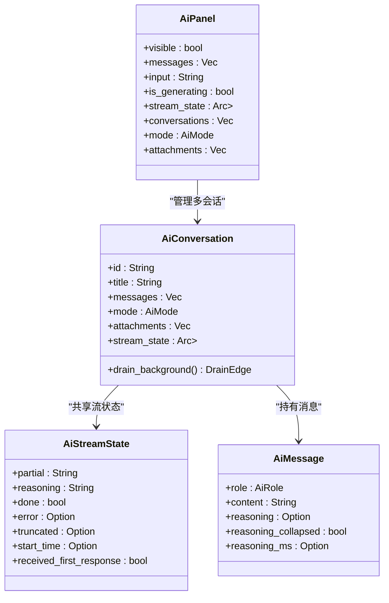
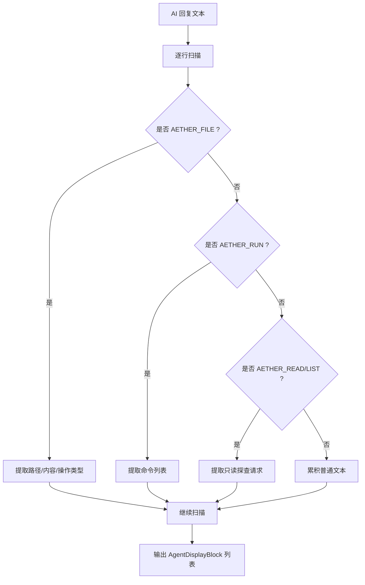
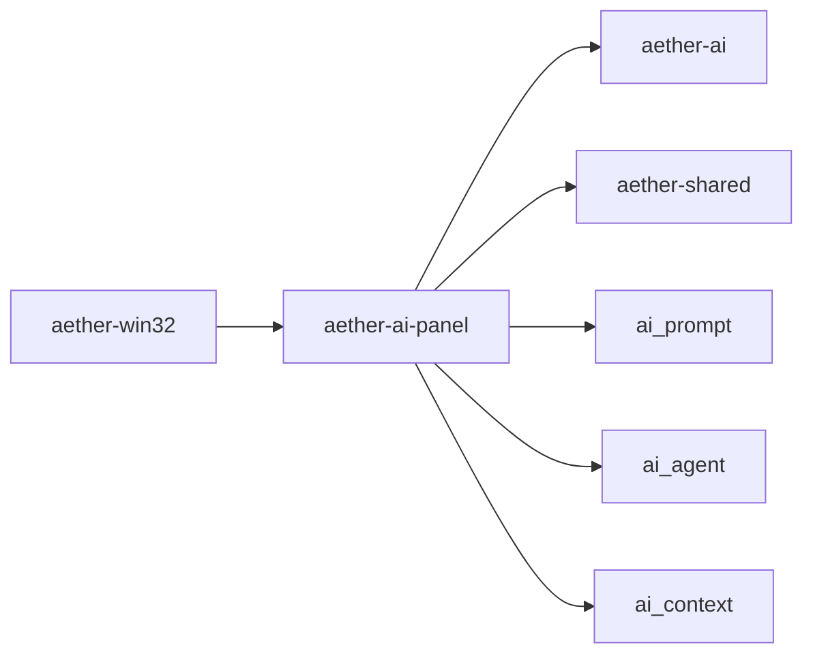

# AI 助手集成

<cite>
**本文引用的文件**
- [crates/aether-ai/src/lib.rs](file://crates/aether-ai/src/lib.rs)
- [crates/aether-ai-panel/src/lib.rs](file://crates/aether-ai-panel/src/lib.rs)
- [crates/aether-ai-panel/src/ai_panel.rs](file://crates/aether-ai-panel/src/ai_panel.rs)
- [crates/aether-ai-panel/src/ai_agent.rs](file://crates/aether-ai-panel/src/ai_agent.rs)
- [crates/aether-ai-panel/src/ai_context.rs](file://crates/aether-ai-panel/src/ai_context.rs)
- [crates/aether-ai-panel/src/ai_prompt.rs](file://crates/aether-ai-panel/src/ai_prompt.rs)
- [crates/aether-win32/src/render/ai.rs](file://crates/aether-win32/src/render/ai.rs)
- [crates/aether-win32/src/render/settings_ai.rs](file://crates/aether-win32/src/render/settings_ai.rs)
- [crates/aether-shared/src/settings.rs](file://crates/aether-shared/src/settings.rs)
</cite>

## 目录
1. [简介](#简介)
2. [项目结构](#项目结构)
3. [核心组件](#核心组件)
4. [架构总览](#架构总览)
5. [详细组件分析](#详细组件分析)
6. [依赖关系分析](#依赖关系分析)
7. [性能与可靠性](#性能与可靠性)
8. [故障排查指南](#故障排查指南)
9. [结论](#结论)
10. [附录：调用示例与最佳实践](#附录调用示例与最佳实践)

## 简介
本文件为牧羊人编辑器的 AI 助手集成功能提供系统化文档，覆盖 AI 面板架构、DeepSeek/Kimi 等提供商集成、Agent 模式机制、对话上下文管理、代码解释/改写/内联建议、流式响应处理、错误重试与 API 配置管理等关键特性。文档以“从高层到代码级”的方式组织，配合多类图示帮助读者快速理解并落地使用。

## 项目结构
AI 能力由多个 crate 协作完成：
- aether-ai：统一的 AI 客户端与安全网络层（OpenAI 兼容接口），支持 DeepSeek、Kimi、自定义提供商。
- aether-ai-panel：AI 面板业务逻辑（会话、消息、流式状态、Agent 协议解析、提示词构建、上下文附件）。
- aether-win32：Windows 端渲染与交互（AI 侧边栏渲染、设置页、事件路由）。
- aether-shared：应用设置与模型档案（含 DPAPI 加密的 API Key 存储）。

图表来源
- [crates/aether-ai/src/lib.rs:308-320](file://crates/aether-ai/src/lib.rs#L308-L320)
- [crates/aether-ai-panel/src/ai_panel.rs:731-800](file://crates/aether-ai-panel/src/ai_panel.rs#L731-L800)
- [crates/aether-ai-panel/src/ai_prompt.rs:34-69](file://crates/aether-ai-panel/src/ai_prompt.rs#L34-L69)
- [crates/aether-ai-panel/src/ai_agent.rs:15-32](file://crates/aether-ai-panel/src/ai_agent.rs#L15-L32)
- [crates/aether-shared/src/settings.rs:74-115](file://crates/aether-shared/src/settings.rs#L74-L115)

章节来源
- [crates/aether-ai/src/lib.rs:17-82](file://crates/aether-ai/src/lib.rs#L17-L82)
- [crates/aether-ai-panel/src/lib.rs:1-14](file://crates/aether-ai-panel/src/lib.rs#L1-L14)
- [crates/aether-shared/src/settings.rs:74-115](file://crates/aether-shared/src/settings.rs#L74-L115)

## 核心组件
- AI 客户端（aether-ai）
  - 统一 OpenAI 兼容接口：聊天补全、流式聊天补全、模型列表拉取、连接测试。
  - 安全网络层：HTTPS 强制、私有 IP/云元数据黑名单、DNS TOCTOU 二次校验、SSRF 防护、响应体大小限制。
  - 错误分类与可重试判定（429/500/503）、安全脱敏显示。
- AI 面板（aether-ai-panel）
  - 会话与消息：多标签会话、历史持久化、思考过程（reasoning）独立展示与计时。
  - 流式状态：后台线程接收 SSE Token/Reasoning/Done/Truncated/Error，UI 轮询合并。
  - Agent 协议：文件块/命令块/只读探查/规划清单解析，操作卡片渲染。
  - 提示词与上下文：系统提示拼装、工作区上下文注入、Ask/Agent 模式切换。
- 设置与模型（aether-shared）
  - 多模型档案、当前激活模型选择、DPAPI 加密 API Key 存储、默认值与迁移。

章节来源
- [crates/aether-ai/src/lib.rs:165-257](file://crates/aether-ai/src/lib.rs#L165-L257)
- [crates/aether-ai/src/lib.rs:572-710](file://crates/aether-ai/src/lib.rs#L572-L710)
- [crates/aether-ai/src/lib.rs:712-800](file://crates/aether-ai/src/lib.rs#L712-L800)
- [crates/aether-ai-panel/src/ai_panel.rs:102-168](file://crates/aether-ai-panel/src/ai_panel.rs#L102-L168)
- [crates/aether-ai-panel/src/ai_panel.rs:554-729](file://crates/aether-ai-panel/src/ai_panel.rs#L554-L729)
- [crates/aether-ai-panel/src/ai_prompt.rs:34-69](file://crates/aether-ai-panel/src/ai_prompt.rs#L34-L69)
- [crates/aether-shared/src/settings.rs:74-115](file://crates/aether-shared/src/settings.rs#L74-L115)

## 架构总览
AI 助手整体采用“面板驱动 + 客户端抽象 + 安全网络层”的分层设计：
- 面板负责用户交互、会话与消息、Agent 协议解析、提示词组装。
- 客户端封装 HTTP/SSE 细节，屏蔽不同提供商差异。
- 设置模块提供多模型配置与密钥安全管理。

图表来源
- [crates/aether-ai/src/lib.rs:712-800](file://crates/aether-ai/src/lib.rs#L712-L800)
- [crates/aether-ai-panel/src/ai_panel.rs:731-800](file://crates/aether-ai-panel/src/ai_panel.rs#L731-L800)
- [crates/aether-win32/src/render/ai.rs:490-705](file://crates/aether-win32/src/render/ai.rs#L490-L705)

## 详细组件分析

### AI 客户端（aether-ai）
- 提供商枚举与默认值：DeepSeek/Kimi/Custom，提供默认 base_url、model、预设模型清单。
- 配置对象 AiConfig：从设置加载 provider/key/base_url/model/采样参数/思考模式/惩罚项/停止序列/响应格式/user_id。
- 安全校验链：
  - HTTPS 强制、私有/保留 IP 检测、云元数据黑名单。
  - DNS 解析后对所有返回 IP 做私有地址校验（TOCTOU 防护）。
  - 禁止自动重定向，防止 SSRF 跳转。
  - 响应体读取限制（最大 10MB）。
- 错误处理：
  - 区分可重试（429/500/503）与永久错误（400/401/402/403/404/422）。
  - 安全显示 safe_display()，避免泄露敏感信息。
- 接口实现：
  - complete/chat_completion：非流式。
  - chat_completion_stream：流式 SSE，按厂商差异注入 thinking/reasoning_effort/采样参数。

图表来源
- [crates/aether-ai/src/lib.rs:394-558](file://crates/aether-ai/src/lib.rs#L394-L558)
- [crates/aether-ai/src/lib.rs:572-710](file://crates/aether-ai/src/lib.rs#L572-L710)
- [crates/aether-ai/src/lib.rs:712-800](file://crates/aether-ai/src/lib.rs#L712-L800)

章节来源
- [crates/aether-ai/src/lib.rs:17-82](file://crates/aether-ai/src/lib.rs#L17-L82)
- [crates/aether-ai/src/lib.rs:165-257](file://crates/aether-ai/src/lib.rs#L165-L257)
- [crates/aether-ai/src/lib.rs:308-320](file://crates/aether-ai/src/lib.rs#L308-L320)
- [crates/aether-ai/src/lib.rs:394-558](file://crates/aether-ai/src/lib.rs#L394-L558)
- [crates/aether-ai/src/lib.rs:572-710](file://crates/aether-ai/src/lib.rs#L572-L710)
- [crates/aether-ai/src/lib.rs:712-800](file://crates/aether-ai/src/lib.rs#L712-L800)

### AI 面板与对话上下文（aether-ai-panel）
- 会话与会话状态：
  - AiConversation：包含消息、输入、滚动、模式、附件、流状态、休眠/唤醒。
  - AiPanel：活动会话实时状态、多会话标签、历史面板、Playbook、文件卡片展开等。
- 流式状态共享：
  - AiStreamState：partial/reasoning/done/error/truncated/start_time/received_first_response。
  - 后台线程 spawn_ai_stream 接收 SSE 事件，写入共享状态；UI 帧循环 drain_background 合并到消息。
- 上下文附件：
  - AiContextAttachment：当前文件、选区、打开文件、诊断、文件树、自定义文本。
  - 提示词构建 build_chat_prompt：基础约束 + 工作区上下文 + Agent 能力说明 + 规划分派。
- 历史与持久化：
  - 会话元数据懒加载，热/温数据分层存储（见 hot/warm store 模块）。

图表来源
- [crates/aether-ai-panel/src/ai_panel.rs:102-168](file://crates/aether-ai-panel/src/ai_panel.rs#L102-L168)
- [crates/aether-ai-panel/src/ai_panel.rs:258-460](file://crates/aether-ai-panel/src/ai_panel.rs#L258-L460)
- [crates/aether-ai-panel/src/ai_panel.rs:554-729](file://crates/aether-ai-panel/src/ai_panel.rs#L554-L729)
- [crates/aether-ai-panel/src/ai_context.rs:1-117](file://crates/aether-ai-panel/src/ai_context.rs#L1-L117)

章节来源
- [crates/aether-ai-panel/src/ai_panel.rs:102-168](file://crates/aether-ai-panel/src/ai_panel.rs#L102-L168)
- [crates/aether-ai-panel/src/ai_panel.rs:258-460](file://crates/aether-ai-panel/src/ai_panel.rs#L258-L460)
- [crates/aether-ai-panel/src/ai_panel.rs:554-729](file://crates/aether-ai-panel/src/ai_panel.rs#L554-L729)
- [crates/aether-ai-panel/src/ai_context.rs:1-117](file://crates/aether-ai-panel/src/ai_context.rs#L1-L117)

### Agent 模式与协议解析（aether-ai-panel/ai_agent）
- 协议标记：
  - 文件块：AETHER_FILE/AETHER_SEP/AETHER_END_FILE
  - 命令块：AETHER_RUN/AETHER_END_RUN
  - 只读探查：AETHER_READ/AETHER_LIST（单行指令）
  - 规划清单：AETHER_PLAN/AETHER_END_PLAN
  - 精准定位/编辑：AETHER_LOCATE/AETHER_EDIT/AETHER_END_EDIT
- 解析器：
  - parse_edits：提取 search/replace 段，支持新建/修改/删除。
  - parse_run_commands：提取终端命令。
  - parse_tool_requests：跳过 FILE/RUN 块体，仅识别 READ/LIST。
  - parse_plan：解析任务清单（GOAL/FILE/RUN），最多 20 个任务。
  - parse_trailing_create_block：抢救未闭合的新建文件块。
- 展示块：
  - AgentDisplayBlock：Text/File/Run/Read/List/Incomplete，用于面板渲染清晰的操作卡片。

图表来源
- [crates/aether-ai-panel/src/ai_agent.rs:15-32](file://crates/aether-ai-panel/src/ai_agent.rs#L15-L32)
- [crates/aether-ai-panel/src/ai_agent.rs:174-236](file://crates/aether-ai-panel/src/ai_agent.rs#L174-L236)
- [crates/aether-ai-panel/src/ai_agent.rs:466-541](file://crates/aether-ai-panel/src/ai_agent.rs#L466-L541)
- [crates/aether-ai-panel/src/ai_agent.rs:560-617](file://crates/aether-ai-panel/src/ai_agent.rs#L560-L617)
- [crates/aether-ai-panel/src/ai_agent.rs:619-800](file://crates/aether-ai-panel/src/ai_agent.rs#L619-L800)

章节来源
- [crates/aether-ai-panel/src/ai_agent.rs:15-32](file://crates/aether-ai-panel/src/ai_agent.rs#L15-L32)
- [crates/aether-ai-panel/src/ai_agent.rs:174-236](file://crates/aether-ai-panel/src/ai_agent.rs#L174-L236)
- [crates/aether-ai-panel/src/ai_agent.rs:466-541](file://crates/aether-ai-panel/src/ai_agent.rs#L466-L541)
- [crates/aether-ai-panel/src/ai_agent.rs:560-617](file://crates/aether-ai-panel/src/ai_agent.rs#L560-L617)
- [crates/aether-ai-panel/src/ai_agent.rs:619-800](file://crates/aether-ai-panel/src/ai_agent.rs#L619-L800)

### 提示词与上下文（aether-ai-panel/ai_prompt）
- build_chat_prompt：
  - 基础约束（中文回答、简洁正确可维护）+ 可选用户自定义 system_prompt。
  - 工作区上下文（用边界标记包裹，防注入）。
  - Agent 模式追加能力说明与规划分派提示。
- agent_capabilities_prompt：
  - 明确文件/终端权限、协议标记、规则（独占行、路径相对、禁止高危命令、先探查再修改等）。
- planner_dispatch_prompt：
  - 多文件/多步骤需求时先输出任务清单，再由系统为每个 FILE 任务聚焦生成。
- build_worker_prompt：
  - 为单个文件生成任务构造 system/user 消息，携带目标、描述、已生成文件内容与目标文件现有内容。

章节来源
- [crates/aether-ai-panel/src/ai_prompt.rs:34-69](file://crates/aether-ai-panel/src/ai_prompt.rs#L34-L69)
- [crates/aether-ai-panel/src/ai_prompt.rs:80-144](file://crates/aether-ai-panel/src/ai_prompt.rs#L80-L144)
- [crates/aether-ai-panel/src/ai_prompt.rs:146-204](file://crates/aether-ai-panel/src/ai_prompt.rs#L146-L204)

### 渲染与交互（aether-win32）
- AI 侧边栏渲染：
  - 会话标签条、欢迎页提示、消息区域（文本/代码段/文件/命令/只读探查/未完成块）。
  - 深度思考区域（标题带耗时、可折叠）。
  - 文件卡片展开预览、命中区域注册。
- 设置页：
  - 厂商下拉、API 密钥输入（显示/隐藏）、Base URL（自定义模式）、模型下拉（实时获取/回退预置）、深度思考开关与强度、保存与测试连接。

章节来源
- [crates/aether-win32/src/render/ai.rs:1-800](file://crates/aether-win32/src/render/ai.rs#L1-L800)
- [crates/aether-win32/src/render/settings_ai.rs:254-800](file://crates/aether-win32/src/render/settings_ai.rs#L254-L800)

## 依赖关系分析
- aether-ai-panel 依赖 aether-ai（客户端）、aether-shared（设置）、自身模块（ai_prompt/ai_agent/ai_context）。
- aether-win32 依赖 aether-ai-panel（重新导出类型）、aether-shared（设置）。
- 外部依赖：ureq（HTTP）、serde_json（JSON）、windows 图形库（Direct2D/DirectWrite）。

图表来源
- [crates/aether-ai-panel/src/lib.rs:1-14](file://crates/aether-ai-panel/src/lib.rs#L1-L14)
- [crates/aether-win32/src/ai_panel.rs:1-14](file://crates/aether-win32/src/ai_panel.rs#L1-L14)

章节来源
- [crates/aether-ai-panel/src/lib.rs:1-14](file://crates/aether-ai-panel/src/lib.rs#L1-L14)
- [crates/aether-win32/src/ai_panel.rs:1-14](file://crates/aether-win32/src/ai_panel.rs#L1-L14)

## 性能与可靠性
- 流式体验：
  - SSE 分片 Token/Reasoning 增量推送，UI 每帧合并，减少阻塞。
  - 首次响应标记与超时看门狗（在途请求区分无响应与生成中）。
- 资源限制：
  - 响应体最大 10MB，避免内存膨胀。
  - 连接超时 15s，读空闲 300s，适配长生成场景。
- 安全与健壮性：
  - HTTPS 强制、私有 IP/云元数据黑名单、DNS 二次校验、禁止重定向。
  - 错误分类与可重试策略（指数退避可由上层实现）。
  - 脱敏错误显示，避免泄露密钥。
- 多模型与配置：
  - 多模型档案、当前激活模型、DPAPI 加密 API Key。
  - 模型列表实时获取，失败回退预置清单。

[本节为通用指导，不直接分析具体文件]

## 故障排查指南
- 连接测试失败：
  - 检查 API Key 是否设置、Base URL 是否为 HTTPS、提供商是否可用。
  - 参考 test_connection_safe 的安全错误信息。
- 模型列表为空或报错：
  - 检查 /models 接口可达性与鉴权，查看 list_models_safe 的错误信息。
- 流式无响应或中断：
  - 观察 received_first_response 与 start_time，确认是否超时。
  - 若 Error 包含 network/connection/dns/ssl，优先排查本地网络。
- 输出被截断：
  - Truncated 原因通常为 max_tokens，可在设置中调整或点击“继续生成”。
- 代理/网关兼容：
  - 确保 Base URL 与模型名符合 OpenAI 兼容规范。

章节来源
- [crates/aether-ai/src/lib.rs:322-333](file://crates/aether-ai/src/lib.rs#L322-L333)
- [crates/aether-ai/src/lib.rs:335-392](file://crates/aether-ai/src/lib.rs#L335-L392)
- [crates/aether-ai-panel/src/ai_panel.rs:731-800](file://crates/aether-ai-panel/src/ai_panel.rs#L731-L800)

## 结论
本项目通过清晰的层次划分与严格的安全策略，实现了跨提供商的 AI 助手集成。面板层负责交互与业务逻辑，客户端层屏蔽网络与厂商差异，设置层保障多模型与密钥安全。Agent 模式通过协议标记实现文件与命令的自动化执行，结合流式响应与上下文管理，提供高效的代码解释、改写与内联建议能力。

[本节为总结，不直接分析具体文件]

## 附录：调用示例与最佳实践
- 调用 AI 服务（流式）
  - 构造 ChatMessage 列表（system + user 历史切片）。
  - 调用 chat_completion_stream 获取 Receiver，后台线程消费事件。
  - 将 Token/Reasoning 合并到会话消息，Done/Truncated/Error 处理结束态。
- 处理响应数据
  - 区分 reasoning_content（思考过程）与 content（最终回答）。
  - 对截断输出提示“继续生成”，对错误进行安全脱敏展示。
- 集成到编辑器界面
  - 渲染消息区域：文本/代码段/文件/命令/只读探查/未完成块。
  - 深度思考区域：标题带耗时、可折叠。
  - 设置页：配置提供商、API Key、Base URL、模型、思考模式与强度。
- 最佳实践
  - 始终使用 HTTPS 与有效 API Key。
  - 合理设置 max_tokens 与温度/核采样参数（注意思考模式下部分参数不生效）。
  - 使用 Agent 模式时遵循协议标记规则，先探查再修改。
  - 利用多模型档案与当前激活模型，灵活切换提供商与模型。

章节来源
- [crates/aether-ai/src/lib.rs:572-710](file://crates/aether-ai/src/lib.rs#L572-L710)
- [crates/aether-ai/src/lib.rs:712-800](file://crates/aether-ai/src/lib.rs#L712-L800)
- [crates/aether-ai-panel/src/ai_panel.rs:731-800](file://crates/aether-ai-panel/src/ai_panel.rs#L731-L800)
- [crates/aether-win32/src/render/ai.rs:490-705](file://crates/aether-win32/src/render/ai.rs#L490-L705)
- [crates/aether-win32/src/render/settings_ai.rs:254-800](file://crates/aether-win32/src/render/settings_ai.rs#L254-L800)
- [crates/aether-shared/src/settings.rs:74-115](file://crates/aether-shared/src/settings.rs#L74-L115)