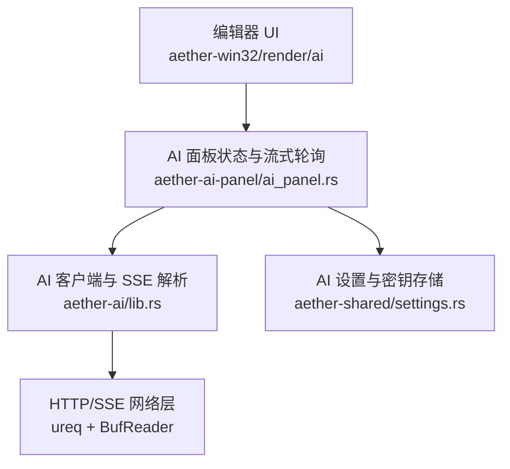
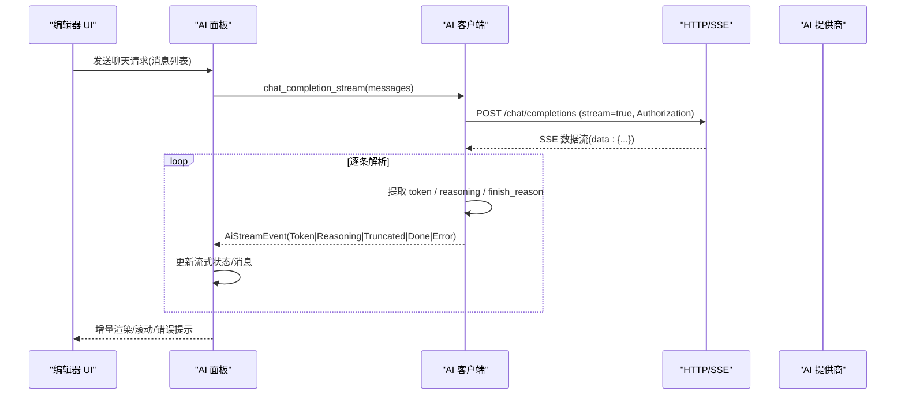
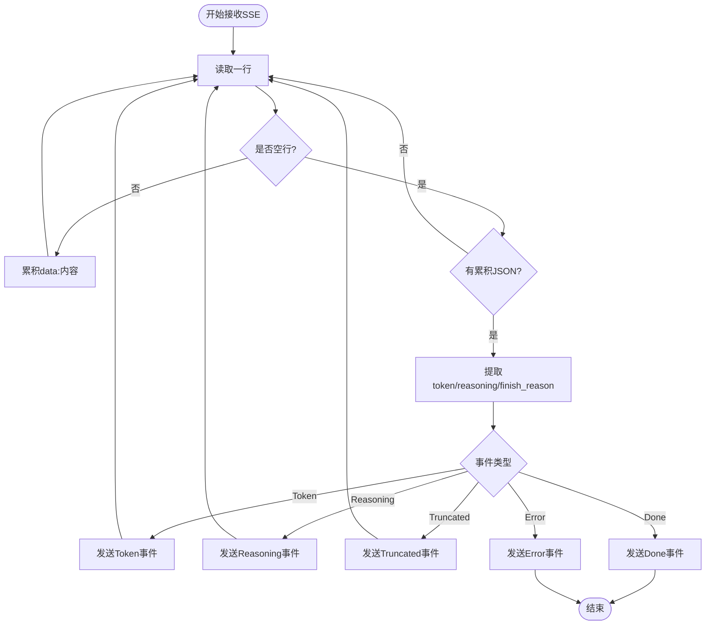
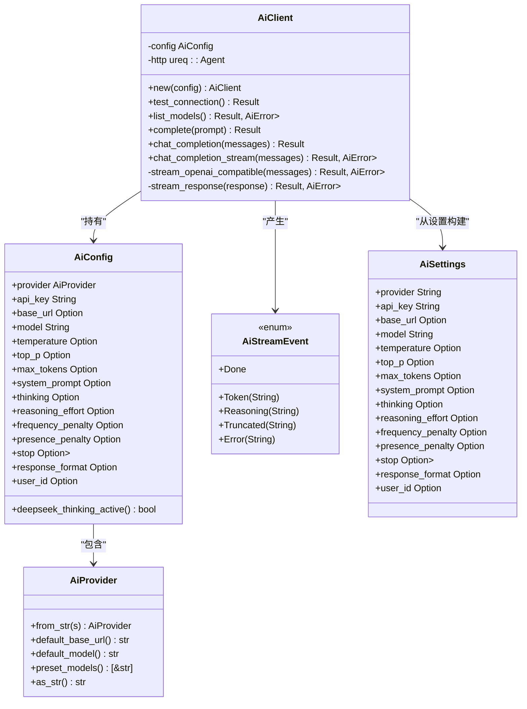
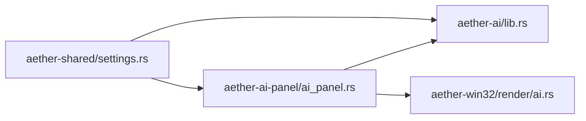

# AI 服务集成

<cite>
**本文引用的文件**
- [aether-ai/src/lib.rs](file://crates/aether-ai/src/lib.rs)
- [aether-ai-panel/src/ai_panel.rs](file://crates/aether-ai-panel/src/ai_panel.rs)
- [aether-shared/src/settings.rs](file://crates/aether-shared/src/settings.rs)
- [aether-win32/src/render/ai.rs](file://crates/aether-win32/src/render/ai.rs)
</cite>

## 目录
1. [简介](#简介)
2. [项目结构](#项目结构)
3. [核心组件](#核心组件)
4. [架构总览](#架构总览)
5. [详细组件分析](#详细组件分析)
6. [依赖关系分析](#依赖关系分析)
7. [性能与超时控制](#性能与超时控制)
8. [故障排查指南](#故障排查指南)
9. [结论](#结论)
10. [附录：使用示例路径](#附录使用示例路径)

## 简介
本文件面向牧羊人编辑器的 AI 服务集成功能，系统性说明多提供商统一接口、流式响应处理（SSE）、配置与安全机制，以及错误恢复策略。重点覆盖 DeepSeek、Kimi、OpenAI 兼容端点等主流服务商的接入方式，并提供从初始化客户端、发送聊天请求、消费流式 Token、到错误恢复的完整链路说明。

## 项目结构
AI 能力由多个 crate 协作完成：
- aether-ai：提供统一的 AI 客户端、配置、安全校验、SSE 流式解析与事件模型。
- aether-ai-panel：负责对话状态管理、后台流式轮询、UI 渲染联动、超时检测与错误提示。
- aether-shared：集中存储与加载 AI 设置（含加密密钥），提供多模型档案与激活模型选择。
- aether-win32/render/ai：Windows 渲染层对 AI 面板进行绘制与交互（包含“深度思考”展示、操作卡片等）。

图表来源
- [aether-ai/src/lib.rs:308-320](file://crates/aether-ai/src/lib.rs#L308-L320)
- [aether-ai-panel/src/ai_panel.rs:731-812](file://crates/aether-ai-panel/src/ai_panel.rs#L731-L812)
- [aether-shared/src/settings.rs:73-115](file://crates/aether-shared/src/settings.rs#L73-L115)

章节来源
- [aether-ai/src/lib.rs:17-82](file://crates/aether-ai/src/lib.rs#L17-L82)
- [aether-ai-panel/src/ai_panel.rs:170-225](file://crates/aether-ai-panel/src/ai_panel.rs#L170-L225)
- [aether-shared/src/settings.rs:73-115](file://crates/aether-shared/src/settings.rs#L73-L115)

## 核心组件
- 提供商枚举与默认值：DeepSeek、Kimi、Custom；提供默认 base_url、默认模型、预置模型清单。
- 配置对象 AiConfig：封装 provider、api_key、base_url、model、temperature/top_p/max_tokens、thinking/reasoning_effort、惩罚项、stop、response_format、user_id 等。
- 消息模型 ChatMessage：role/content 标准结构。
- 流式事件 AiStreamEvent：Token、Reasoning、Done、Truncated、Error。
- 客户端 AiClient：统一发起非流/流式请求，内置安全校验、SSE 解析、错误分类与可重试判断。
- 面板状态 AiPanel/AiConversation：维护会话、消息、流式状态、超时检测、错误提示与 UI 联动。
- 设置与密钥：AiSettings/AiModelProfile/AppSettings，支持 DPAPI 加密存储 api_key，多模型档案与激活模型切换。

章节来源
- [aether-ai/src/lib.rs:17-82](file://crates/aether-ai/src/lib.rs#L17-L82)
- [aether-ai/src/lib.rs:165-257](file://crates/aether-ai/src/lib.rs#L165-L257)
- [aether-ai/src/lib.rs:259-320](file://crates/aether-ai/src/lib.rs#L259-L320)
- [aether-ai/src/lib.rs:286-299](file://crates/aether-ai/src/lib.rs#L286-L299)
- [aether-ai-panel/src/ai_panel.rs:170-225](file://crates/aether-ai-panel/src/ai_panel.rs#L170-L225)
- [aether-shared/src/settings.rs:73-115](file://crates/aether-shared/src/settings.rs#L73-L115)

## 架构总览
整体采用“统一接口 + 流式事件 + 安全前置校验”的设计：
- 所有提供商通过 OpenAI 兼容的 /chat/completions 接口访问，DeepSeek/Kimi/自定义均走同一通道。
- 流式响应以 SSE 形式返回，客户端按行读取并解析 JSON 片段，抽取 token 或 reasoning_content。
- 安全层面：强制 HTTPS、私有 IP 拦截、DNS 二次校验、SSRF 防护、响应体大小限制、敏感信息脱敏。
- 错误分类：区分暂时性错误（可重试）与永久错误（需用户修正配置），并在 UI 中给出友好提示。

图表来源
- [aether-ai/src/lib.rs:716-722](file://crates/aether-ai/src/lib.rs#L716-L722)
- [aether-ai/src/lib.rs:738-830](file://crates/aether-ai/src/lib.rs#L738-L830)
- [aether-ai/src/lib.rs:832-921](file://crates/aether-ai/src/lib.rs#L832-L921)
- [aether-ai-panel/src/ai_panel.rs:731-812](file://crates/aether-ai-panel/src/ai_panel.rs#L731-L812)

## 详细组件分析

### 多提供商统一接口设计
- 提供商识别：from_str 支持 deepseek/kimi/moonshot/custom，未知串回退为 Custom。
- 默认基址与模型：DeepSeek 默认 https://api.deepseek.com/v1，模型 deepseek-v4-pro；Kimi 默认 https://api.moonshot.cn/v1，模型 moonshot-v1-8k。
- 预置模型清单：作为 UI 下拉唯一数据源，避免核心与 UI 漂移。
- 厂商差异参数注入：
  - DeepSeek 专属 thinking 开关（{"type":"enabled"|"disabled"}），仅在 DeepSeek 时下发。
  - 思考模式下不生效的采样参数（temperature/top_p/frequency_penalty/presence_penalty）在思考模式关闭时才下发。
  - reasoning_effort 仅 DeepSeek 思考模式可选 high/max。
  - response_format=json_object 时下发 JSON 输出模式。
  - user_id 业务标识按需下发。

章节来源
- [aether-ai/src/lib.rs:17-82](file://crates/aether-ai/src/lib.rs#L17-L82)
- [aether-ai/src/lib.rs:724-736](file://crates/aether-ai/src/lib.rs#L724-L736)
- [aether-ai/src/lib.rs:773-819](file://crates/aether-ai/src/lib.rs#L773-L819)

### 流式响应处理机制（SSE）
- 连接建立：POST /chat/completions，Authorization 头携带 Bearer API Key，Content-Type application/json。
- 流式解析：按行读取，累积 data: 前缀后的 JSON 片段，遇到空行触发一次解析。
- 事件分发：
  - Token：choices[0].delta.content 或 Anthropic delta.text。
  - Reasoning：choices[0].delta.reasoning_content 或 Anthropic thinking_delta 的 delta.thinking。
  - Truncated：finish_reason 为 length/max_tokens 时发出截断事件。
  - Done：收到 [DONE] 或流结束。
  - Error：网络/解析/API 错误。
- 线程模型：后台线程持续读取并发送事件，主循环通过 mpsc::Receiver 消费。

图表来源
- [aether-ai/src/lib.rs:832-921](file://crates/aether-ai/src/lib.rs#L832-L921)
- [aether-ai/src/lib.rs:923-960](file://crates/aether-ai/src/lib.rs#L923-L960)

章节来源
- [aether-ai/src/lib.rs:738-830](file://crates/aether-ai/src/lib.rs#L738-L830)
- [aether-ai/src/lib.rs:832-921](file://crates/aether-ai/src/lib.rs#L832-L921)
- [aether-ai/src/lib.rs:923-960](file://crates/aether-ai/src/lib.rs#L923-L960)

### 错误重试策略与恢复
- 错误分类：
  - 可重试：429、500、503（暂时性错误）。
  - 永久错误：400、401、402、403、404、422（需用户检查配置）。
- UI 提示：根据 is_retryable/is_permanent 附加建议文本，区分本地调用失败与 API 返回错误。
- 超时检测：
  - 首次响应阈值：非思考模式 30s，思考模式放宽至 180s。
  - 超时后停止生成并提示用户检查网络/稍后重试。
- 流内错误：SSE 解析失败、网络读取异常、API 错误均转为 Error 事件，面板记录并终止流。

章节来源
- [aether-ai/src/lib.rs:147-162](file://crates/aether-ai/src/lib.rs#L147-L162)
- [aether-ai-panel/src/ai_panel.rs:787-833](file://crates/aether-ai-panel/src/ai_panel.rs#L787-L833)
- [aether-ai-panel/src/ai_panel.rs:1387-1426](file://crates/aether-ai-panel/src/ai_panel.rs#L1387-L1426)

### API 配置管理与安全机制
- 密钥存储：
  - settings.json 不写入明文 api_key，单独使用 DPAPI 加密存储于 api_key.enc。
  - 多模型场景下，每个模型的 key 以 JSON map 形式加密保存。
- 请求头设置：
  - Authorization: Bearer {api_key}
  - Content-Type: application/json
- 超时控制：
  - 连接超时 15s，读空闲超时 300s（避免长生成被整体 timeout 中断）。
  - 应用层超时检测：首次响应阈值与思考模式放宽。
- SSRF 防护：
  - 强制 HTTPS。
  - 禁止私有/保留 IP（IPv4/IPv6）。
  - DNS 二次校验（TOCTOU 防护）。
  - 云元数据黑名单（AWS/GCP/Azure/阿里云/腾讯云）。
- 响应体限制：最大 10MB，防止恶意大响应。
- 敏感信息脱敏：safe_display 对用户可见错误进行脱敏，日志可使用原始错误但已截断。

章节来源
- [aether-shared/src/settings.rs:73-115](file://crates/aether-shared/src/settings.rs#L73-L115)
- [aether-shared/src/settings.rs:377-456](file://crates/aether-shared/src/settings.rs#L377-L456)
- [aether-shared/src/settings.rs:487-559](file://crates/aether-shared/src/settings.rs#L487-L559)
- [aether-ai/src/lib.rs:308-320](file://crates/aether-ai/src/lib.rs#L308-L320)
- [aether-ai/src/lib.rs:394-456](file://crates/aether-ai/src/lib.rs#L394-L456)
- [aether-ai/src/lib.rs:536-570](file://crates/aether-ai/src/lib.rs#L536-L570)

### 代码级类图（关键类型与关系）

图表来源
- [aether-ai/src/lib.rs:17-82](file://crates/aether-ai/src/lib.rs#L17-L82)
- [aether-ai/src/lib.rs:165-257](file://crates/aether-ai/src/lib.rs#L165-L257)
- [aether-ai/src/lib.rs:259-320](file://crates/aether-ai/src/lib.rs#L259-L320)
- [aether-ai/src/lib.rs:286-299](file://crates/aether-ai/src/lib.rs#L286-L299)
- [aether-shared/src/settings.rs:73-115](file://crates/aether-shared/src/settings.rs#L73-L115)

## 依赖关系分析
- aether-ai-panel 依赖 aether-ai 提供的客户端与事件模型，用于后台流式轮询与 UI 状态更新。
- aether-shared 提供设置与密钥管理，被 aether-ai 与 aether-ai-panel 共同使用。
- aether-win32/render/ai 负责渲染 AI 面板，包括“深度思考”区域、操作卡片、滚动与命中区计算。

图表来源
- [aether-ai-panel/src/ai_panel.rs:1-9](file://crates/aether-ai-panel/src/ai_panel.rs#L1-L9)
- [aether-ai/src/lib.rs:1-6](file://crates/aether-ai/src/lib.rs#L1-L6)
- [aether-shared/src/settings.rs:73-115](file://crates/aether-shared/src/settings.rs#L73-L115)

章节来源
- [aether-ai-panel/src/ai_panel.rs:1-9](file://crates/aether-ai-panel/src/ai_panel.rs#L1-L9)
- [aether-ai/src/lib.rs:1-6](file://crates/aether-ai/src/lib.rs#L1-L6)
- [aether-shared/src/settings.rs:73-115](file://crates/aether-shared/src/settings.rs#L73-L115)

## 性能与超时控制
- 网络层：
  - 连接超时 15s，读空闲超时 300s，避免长生成被整体 timeout 中断。
  - 禁用自动重定向，防止 SSRF 跳转。
- 应用层：
  - 首次响应阈值：非思考模式 30s，思考模式放宽至 180s。
  - 流式解析按行缓冲，减少内存占用。
  - 响应体限制 10MB，防止恶意大响应。
- 渲染层：
  - 每帧重建命中区域，确保交互准确。
  - “深度思考”区域折叠显示，降低视觉干扰。

章节来源
- [aether-ai/src/lib.rs:308-320](file://crates/aether-ai/src/lib.rs#L308-L320)
- [aether-ai/src/lib.rs:536-570](file://crates/aether-ai/src/lib.rs#L536-L570)
- [aether-ai-panel/src/ai_panel.rs:1387-1426](file://crates/aether-ai-panel/src/ai_panel.rs#L1387-L1426)
- [aether-win32/src/render/ai.rs:1-180](file://crates/aether-win32/src/render/ai.rs#L1-L180)

## 故障排查指南
- 认证失败（401）：检查 API Key 是否正确且未过期，确认 Base URL 与提供商匹配。
- 余额不足（402）：前往提供商官网充值。
- 速率限制（429）：稍后重试，系统会标记为可重试错误。
- 服务器繁忙（503）：稍后重试，系统会标记为可重试错误。
- 参数错误（422）：检查 temperature/top_p/max_tokens 等参数范围。
- 资源不存在（404）：检查 Base URL 与模型名。
- 网络/连接/DNS/SSL 错误：检查网络连接与代理设置，必要时更换网络环境。
- 超时：若长时间无首包响应，系统将提示超时并停止生成，建议检查网络或简化请求。

章节来源
- [aether-ai/src/lib.rs:110-162](file://crates/aether-ai/src/lib.rs#L110-L162)
- [aether-ai-panel/src/ai_panel.rs:787-833](file://crates/aether-ai-panel/src/ai_panel.rs#L787-L833)
- [aether-ai-panel/src/ai_panel.rs:1387-1426](file://crates/aether-ai-panel/src/ai_panel.rs#L1387-L1426)

## 结论
牧羊人编辑器的 AI 服务集成采用统一接口与流式事件模型，屏蔽了不同提供商的差异，同时通过严格的安全校验、错误分类与超时控制，提供了稳定可靠的 AI 能力。结合多模型档案与 DPAPI 加密密钥存储，既保证了易用性，也确保了安全性。

## 附录：使用示例路径
- 初始化 AI 客户端：
  - [aether-ai/src/lib.rs:308-320](file://crates/aether-ai/src/lib.rs#L308-L320)
- 发送聊天请求（非流式）：
  - [aether-ai/src/lib.rs:572-579](file://crates/aether-ai/src/lib.rs#L572-L579)
- 发送聊天请求（流式）：
  - [aether-ai/src/lib.rs:716-722](file://crates/aether-ai/src/lib.rs#L716-L722)
- 构建请求体与参数注入（thinking/reasoning_effort/response_format/user_id）：
  - [aether-ai/src/lib.rs:773-819](file://crates/aether-ai/src/lib.rs#L773-L819)
- SSE 流式解析与事件分发：
  - [aether-ai/src/lib.rs:832-921](file://crates/aether-ai/src/lib.rs#L832-L921)
- 后台流式轮询与 UI 状态更新：
  - [aether-ai-panel/src/ai_panel.rs:731-812](file://crates/aether-ai-panel/src/ai_panel.rs#L731-L812)
- 超时检测与处理：
  - [aether-ai-panel/src/ai_panel.rs:1387-1426](file://crates/aether-ai-panel/src/ai_panel.rs#L1387-L1426)
- 设置与密钥存储（DPAPI 加密）：
  - [aether-shared/src/settings.rs:377-456](file://crates/aether-shared/src/settings.rs#L377-L456)
  - [aether-shared/src/settings.rs:487-559](file://crates/aether-shared/src/settings.rs#L487-L559)
- 渲染“深度思考”与操作卡片：
  - [aether-win32/src/render/ai.rs:504-632](file://crates/aether-win32/src/render/ai.rs#L504-L632)
  - [aether-win32/src/render/ai.rs:634-705](file://crates/aether-win32/src/render/ai.rs#L634-L705)