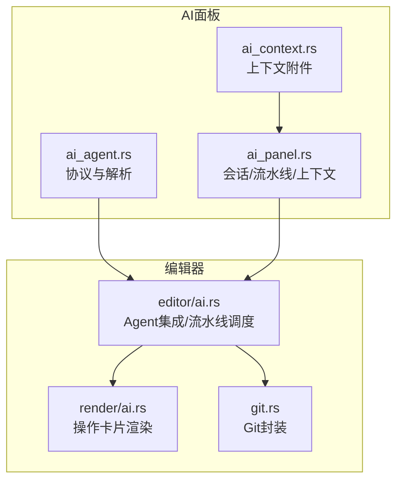
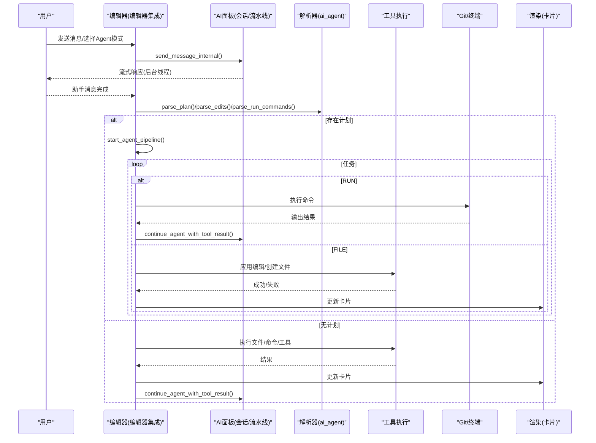
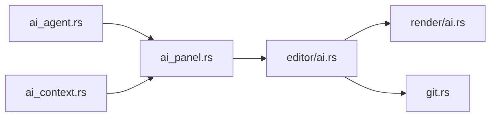

# Agent 模式

<cite>
**本文引用的文件**
- [ai_agent.rs](file://crates/aether-ai-panel/src/ai_agent.rs)
- [ai_panel.rs](file://crates/aether-ai-panel/src/ai_panel.rs)
- [ai_context.rs](file://crates/aether-ai-panel/src/ai_context.rs)
- [ai.rs（编辑器集成）](file://crates/aether-win32/src/editor/ai.rs)
- [ai.rs（渲染展示）](file://crates/aether-win32/src/render/ai.rs)
- [git.rs（UI Git 封装）](file://crates/aether-ui/src/git.rs)
- [AGENT_SPEC.md](file://AGENT_SPEC.md)
</cite>

## 目录
1. [简介](#简介)
2. [项目结构](#项目结构)
3. [核心组件](#核心组件)
4. [架构总览](#架构总览)
5. [详细组件分析](#详细组件分析)
6. [依赖关系分析](#依赖关系分析)
7. [性能考量](#性能考量)
8. [故障排查指南](#故障排查指南)
9. [结论](#结论)
10. [附录：使用示例与最佳实践](#附录使用示例与最佳实践)

## 简介
本文件面向牧羊人编辑器的 Agent 模式，系统性说明其架构设计、任务编排流水线、工具调用机制、上下文管理以及与编辑器的深度集成。Agent 模式支持多任务编排（CoT 任务分解）、文件操作（创建/修改/删除）、命令执行（终端）、只读探查（读取文件/列出目录），并具备流式响应、中断抢救、状态管理与安全沙箱等能力。

## 项目结构
Agent 模式由以下关键 crate 协作完成：
- aether-ai-panel：定义 Agent 协议标记、解析器、对话与会话状态、多任务编排流水线、上下文附件等
- aether-win32/editor/ai：编辑器侧的 Agent 集成入口，负责解析 AI 回复、执行文件/命令/工具、驱动流水线、结果回喂
- aether-win32/render/ai：将 Agent 的操作以卡片形式可视化呈现
- aether-ui/git：Git 操作的 UI 层封装（可作为 Agent 通过命令或后续扩展直接调用）
- AGENT_SPEC.md：整体架构决策与任务切片说明

**图表来源**
- [ai_agent.rs:1-50](file://crates/aether-ai-panel/src/ai_agent.rs#L1-L50)
- [ai_panel.rs:540-552](file://crates/aether-ai-panel/src/ai_panel.rs#L540-L552)
- [ai_context.rs:1-19](file://crates/aether-ai-panel/src/ai_context.rs#L1-L19)
- [ai.rs（编辑器集成）:75-103](file://crates/aether-win32/src/editor/ai.rs#L75-L103)
- [ai.rs（渲染展示）:1949-1987](file://crates/aether-win32/src/render/ai.rs#L1949-L1987)
- [git.rs（UI Git 封装）:203-287](file://crates/aether-ui/src/git.rs#L203-L287)

**章节来源**
- [AGENT_SPEC.md:19-43](file://AGENT_SPEC.md#L19-L43)
- [ai_agent.rs:1-50](file://crates/aether-ai-panel/src/ai_agent.rs#L1-L50)
- [ai_panel.rs:540-552](file://crates/aether-ai-panel/src/ai_panel.rs#L540-L552)
- [ai_context.rs:1-19](file://crates/aether-ai-panel/src/ai_context.rs#L1-L19)
- [ai.rs（编辑器集成）:75-103](file://crates/aether-win32/src/editor/ai.rs#L75-L103)
- [ai.rs（渲染展示）:1949-1987](file://crates/aether-win32/src/render/ai.rs#L1949-L1987)
- [git.rs（UI Git 封装）:203-287](file://crates/aether-ui/src/git.rs#L203-L287)

## 核心组件
- 协议与解析器（ai_agent.rs）
  - 定义行锚定协议标记（FILE/RUN/READ/LIST/PLAN/LOCATE/EDIT 等）
  - 提供解析函数：parse_edits、parse_run_commands、parse_tool_requests、parse_plan、parse_display_blocks 等
  - 支持精准定位与精准编辑（AETHER_LOCATE + AETHER_EDIT）
- 会话与流水线（ai_panel.rs）
  - AiConversation：会话消息、流式状态、休眠/唤醒、历史归档
  - AgentPipeline：目标、任务列表、游标、已创建/失败文件集合
  - continue_agent_with_tool_result：工具结果回喂，限制最大轮次防止无限循环
  - send_message_internal：构建系统提示、注入 Playbook、切片历史、发起流式请求
- 上下文附件（ai_context.rs）
  - 当前文件、选区、打开文件、诊断、文件树、自定义文本
  - 代码块包装与长度截断工具
- 编辑器集成（editor/ai.rs）
  - process_ai_agent_actions_for：统一入口，处理文件/命令/工具/精准编辑
  - apply_ai_workspace_edits：工作区级编辑应用（含撤销记录、标签页切换、原子写入）
  - apply_precise_edits：精准编辑（定位+操作）
  - execute_tool_requests：同步执行只读探查并生成反馈
  - run_pipeline_until_file_task_or_finish：CoT 流水线推进（RUN 直接执行，FILE 触发 worker）
  - handle_agent_command_results：终端输出结果回喂，驱动续跑
- 渲染展示（render/ai.rs）
  - agent_op_display：将操作转换为图标、标签、详情与主题色，用于面板卡片展示

**章节来源**
- [ai_agent.rs:15-40](file://crates/aether-ai-panel/src/ai_agent.rs#L15-L40)
- [ai_agent.rs:184-236](file://crates/aether-ai-panel/src/ai_agent.rs#L184-L236)
- [ai_agent.rs:466-498](file://crates/aether-ai-panel/src/ai_agent.rs#L466-L498)
- [ai_agent.rs:504-541](file://crates/aether-ai-panel/src/ai_agent.rs#L504-L541)
- [ai_agent.rs:564-617](file://crates/aether-ai-panel/src/ai_agent.rs#L564-L617)
- [ai_agent.rs:619-653](file://crates/aether-ai-panel/src/ai_agent.rs#L619-L653)
- [ai_panel.rs:258-290](file://crates/aether-ai-panel/src/ai_panel.rs#L258-L290)
- [ai_panel.rs:540-552](file://crates/aether-ai-panel/src/ai_panel.rs#L540-L552)
- [ai_panel.rs:1710-1757](file://crates/aether-ai-panel/src/ai_panel.rs#L1710-L1757)
- [ai_panel.rs:1942-1965](file://crates/aether-ai-panel/src/ai_panel.rs#L1942-L1965)
- [ai_context.rs:1-19](file://crates/aether-ai-panel/src/ai_context.rs#L1-L19)
- [ai.rs（编辑器集成）:75-103](file://crates/aether-win32/src/editor/ai.rs#L75-L103)
- [ai.rs（编辑器集成）:714-800](file://crates/aether-win32/src/editor/ai.rs#L714-L800)
- [ai.rs（编辑器集成）:1138-1224](file://crates/aether-win32/src/editor/ai.rs#L1138-L1224)
- [ai.rs（编辑器集成）:337-389](file://crates/aether-win32/src/editor/ai.rs#L337-L389)
- [ai.rs（渲染展示）:1949-1987](file://crates/aether-win32/src/render/ai.rs#L1949-L1987)

## 架构总览
Agent 模式采用“协议解析 + 流水线编排 + 工具执行 + 上下文管理”的分层架构：
- 协议层：通过行锚定标记（AETHER_*）在 AI 回复中嵌入结构化指令，避免误匹配
- 解析层：将标记解析为编辑、命令、工具请求、规划任务等数据结构
- 编排层：CoT 任务清单（AETHER_PLAN）驱动顺序/条件执行；RUN 直接执行，FILE 触发聚焦 worker
- 执行层：文件操作（创建/修改/删除）、命令执行（终端）、只读探查（读取/列目录）
- 上下文层：会话消息、历史切片、Playbook 注入、附件收集（当前文件、选区、诊断、文件树）
- 展示层：将操作转为卡片（新建/修改/删除/运行/读取/列出/不完整）

**图表来源**
- [ai.rs（编辑器集成）:75-103](file://crates/aether-win32/src/editor/ai.rs#L75-L103)
- [ai.rs（编辑器集成）:1138-1224](file://crates/aether-win32/src/editor/ai.rs#L1138-L1224)
- [ai_panel.rs:1710-1757](file://crates/aether-ai-panel/src/ai_panel.rs#L1710-L1757)
- [ai_agent.rs:564-617](file://crates/aether-ai-panel/src/ai_agent.rs#L564-L617)
- [ai.rs（渲染展示）:1949-1987](file://crates/aether-win32/src/render/ai.rs#L1949-L1987)

## 详细组件分析

### 协议与解析器（ai_agent.rs）
- 行锚定协议：每个标记独占一行，带 AETHER_ 前缀，避免与代码冲突
- 文件块：<<<<<<< AETHER_FILE <path> ... ======= AETHER_SEP ... >>>>>>> AETHER_END_FILE
- 命令块：<<<<<<< AETHER_RUN ... >>>>>>> AETHER_END_RUN
- 只读工具：<<<<<<< AETHER_READ <path> / <<<<<<< AETHER_LIST <path>
- 规划块：<<<<<<< AETHER_PLAN ... >>>>>>> AETHER_END_PLAN
- 精准编辑：<<<<<<< AETHER_LOCATE ... + <<<<<<< AETHER_EDIT ... >>>>>>> AETHER_END_EDIT

解析函数职责：
- parse_edits：提取 AiEdit（路径、search、replace），支持新建/修改/删除
- parse_run_commands：提取命令列表
- parse_tool_requests：提取 READ/LIST 请求，跳过 FILE/RUN 块体
- parse_plan：提取 GOAL 与任务列表（FILE/RUN），最多 20 个任务
- parse_display_blocks：将回复转为 AgentDisplayBlock（Text/File/Run/Read/List/Incomplete）

复杂度与健壮性：
- 线性扫描 O(n)，对大响应友好
- 严格行锚定与哨兵，降低误匹配风险
- 流式中断抢救：parse_trailing_create_block 仅对新建文件块进行部分落盘

**章节来源**
- [ai_agent.rs:15-40](file://crates/aether-ai-panel/src/ai_agent.rs#L15-L40)
- [ai_agent.rs:184-236](file://crates/aether-ai-panel/src/ai_agent.rs#L184-L236)
- [ai_agent.rs:466-498](file://crates/aether-ai-panel/src/ai_agent.rs#L466-L498)
- [ai_agent.rs:504-541](file://crates/aether-ai-panel/src/ai_agent.rs#L504-L541)
- [ai_agent.rs:564-617](file://crates/aether-ai-panel/src/ai_agent.rs#L564-L617)
- [ai_agent.rs:619-653](file://crates/aether-ai-panel/src/ai_agent.rs#L619-L653)
- [ai_agent.rs:735-800](file://crates/aether-ai-panel/src/ai_agent.rs#L735-L800)

### 会话与流水线（ai_panel.rs）
- AiConversation：消息、流式状态、思考耗时、休眠/唤醒、历史归档
- AgentPipeline：goal、tasks、cursor、created_files、failed_files
- continue_agent_with_tool_result：工具结果回喂，限制最大迭代次数（默认 5）
- send_message_internal：构建 system/user 消息，注入 Playbook，切片历史，发起流式请求
- spawn_ai_stream：后台线程流式接收 Token/Reasoning/Done/Truncated/Error

流水线推进策略：
- RUN 任务：直接执行命令，完成后继续下一任务
- FILE 任务：发起聚焦 worker 调用（不含完整历史），生成后落盘并推进
- 收尾：汇总成败，清理状态

**章节来源**
- [ai_panel.rs:258-290](file://crates/aether-ai-panel/src/ai_panel.rs#L258-L290)
- [ai_panel.rs:540-552](file://crates/aether-ai-panel/src/ai_panel.rs#L540-L552)
- [ai_panel.rs:1710-1757](file://crates/aether-ai-panel/src/ai_panel.rs#L1710-L1757)
- [ai_panel.rs:1942-1965](file://crates/aether-ai-panel/src/ai_panel.rs#L1942-L1965)

### 编辑器集成（editor/ai.rs）
- process_ai_agent_actions_for：统一入口，处理 CoT 分流、文件/命令/工具/精准编辑
- apply_ai_workspace_edits：工作区级编辑（创建/修改/删除），原子写入，撤销记录，标签页切换
- apply_precise_edits：精准编辑（定位+操作）
- execute_tool_requests：同步执行只读探查，返回展示行与模型反馈
- run_pipeline_until_file_task_or_finish：顺序推进流水线，RUN 直接执行，FILE 触发 worker
- handle_agent_command_results：终端输出结果展示与续跑

错误处理与安全性：
- 文件过大限制（1MB），内容回喂限制（8000字符）
- 目录列出条目限制（300项）
- 未打开工作区时提示无法直接操作
- 生成中断抢救：仅新建文件块可部分落盘

**章节来源**
- [ai.rs（编辑器集成）:75-103](file://crates/aether-win32/src/editor/ai.rs#L75-L103)
- [ai.rs（编辑器集成）:113-162](file://crates/aether-win32/src/editor/ai.rs#L113-L162)
- [ai.rs（编辑器集成）:164-263](file://crates/aether-win32/src/editor/ai.rs#L164-L263)
- [ai.rs（编辑器集成）:265-336](file://crates/aether-win32/src/editor/ai.rs#L265-L336)
- [ai.rs（编辑器集成）:337-389](file://crates/aether-win32/src/editor/ai.rs#L337-L389)
- [ai.rs（编辑器集成）:714-800](file://crates/aether-win32/src/editor/ai.rs#L714-L800)
- [ai.rs（编辑器集成）:1048-1097](file://crates/aether-win32/src/editor/ai.rs#L1048-L1097)
- [ai.rs（编辑器集成）:1138-1224](file://crates/aether-win32/src/editor/ai.rs#L1138-L1224)

### 渲染展示（render/ai.rs）
- agent_op_display：将 AiRenderItem 转为（图标、标签、详情、颜色）
- 支持类型：File（Create/Modify/Delete）、Run、Read、List、Incomplete

**章节来源**
- [ai.rs（渲染展示）:1949-1987](file://crates/aether-win32/src/render/ai.rs#L1949-L1987)

### Git 集成
- aether-ui/git 提供 Git 命令封装（add/commit/push/pull/fetch/create_branch/switch_branch 等）
- Agent 可通过命令执行 Git 操作，或通过后续扩展直接调用这些 API

**章节来源**
- [git.rs（UI Git 封装）:203-287](file://crates/aether-ui/src/git.rs#L203-L287)

## 依赖关系分析
- ai_agent.rs 被 ai_panel.rs 与 editor/ai.rs 引用，提供协议解析
- ai_panel.rs 依赖 ai_context.rs 提供上下文附件
- editor/ai.rs 依赖 ai_panel.rs 的流水线与会话状态，以及 ai_agent.rs 的解析器
- render/ai.rs 依赖 ai_panel.rs 的数据结构进行展示
- git.rs 作为工具层被编辑器或 Agent 通过命令/扩展调用

**图表来源**
- [ai_agent.rs:1-50](file://crates/aether-ai-panel/src/ai_agent.rs#L1-L50)
- [ai_panel.rs:540-552](file://crates/aether-ai-panel/src/ai_panel.rs#L540-L552)
- [ai_context.rs:1-19](file://crates/aether-ai-panel/src/ai_context.rs#L1-L19)
- [ai.rs（编辑器集成）:75-103](file://crates/aether-win32/src/editor/ai.rs#L75-L103)
- [ai.rs（渲染展示）:1949-1987](file://crates/aether-win32/src/render/ai.rs#L1949-L1987)
- [git.rs（UI Git 封装）:203-287](file://crates/aether-ui/src/git.rs#L203-L287)

**章节来源**
- [ai_agent.rs:1-50](file://crates/aether-ai-panel/src/ai_agent.rs#L1-L50)
- [ai_panel.rs:540-552](file://crates/aether-ai-panel/src/ai_panel.rs#L540-L552)
- [ai_context.rs:1-19](file://crates/aether-ai-panel/src/ai_context.rs#L1-L19)
- [ai.rs（编辑器集成）:75-103](file://crates/aether-win32/src/editor/ai.rs#L75-L103)
- [ai.rs（渲染展示）:1949-1987](file://crates/aether-win32/src/render/ai.rs#L1949-L1987)
- [git.rs（UI Git 封装）:203-287](file://crates/aether-ui/src/git.rs#L203-L287)

## 性能考量
- 流式响应：后台线程接收 Token/Reasoning，主线程轮询，避免阻塞 UI
- 上下文预算：按模型配置切片历史，控制输入 Token 上限
- 文件/目录限制：文件大小 1MB，目录条目 300 项，回喂内容 8000 字符
- 流水线任务上限：最多 20 个任务，防止过度拆解
- 迭代限制：Agent 自动续跑最大 5 轮，防止无限循环
- 轻量刷新：文件树刷新保留展开状态，不重启 LSP

[本节为通用指导，无需具体文件引用]

## 故障排查指南
- 未打开工作区：提示无法直接创建/修改文件，需先打开文件夹
- 生成中断：抢救未闭合的新建文件块，提示可能不完整
- 工具结果为空：continue_agent_with_tool_result 返回错误，需检查上游解析
- 网络/连接错误：sanitize_error 脱敏敏感信息，显示本地调用失败提示
- 命令执行失败：终端输出展示截断，避免刷屏；结果回喂续跑受最大轮次限制

**章节来源**
- [ai.rs（编辑器集成）:104-111](file://crates/aether-win32/src/editor/ai.rs#L104-L111)
- [ai.rs（编辑器集成）:265-336](file://crates/aether-win32/src/editor/ai.rs#L265-L336)
- [ai_panel.rs:1710-1757](file://crates/aether-ai-panel/src/ai_panel.rs#L1710-L1757)
- [ai_panel.rs:787-800](file://crates/aether-ai-panel/src/ai_panel.rs#L787-L800)

## 结论
Agent 模式通过行锚定协议、解析器、流水线编排、工具执行与上下文管理，实现了从“推理 → 执行 → 结果回喂 → 继续推理”的闭环。其设计兼顾了安全性（沙箱限制、脱敏）、性能（流式、预算控制）与用户体验（卡片展示、中断抢救）。未来可扩展更多工具（如 Git 直接调用、远程操作）以增强自动化能力。

[本节为总结，无需具体文件引用]

## 附录：使用示例与最佳实践

### 定义 Agent 工具（协议标记）
- 文件操作：使用 AETHER_FILE 块指定路径与 search/replace
- 命令执行：使用 AETHER_RUN 块包裹命令
- 只读探查：使用 AETHER_READ/AETHER_LIST 单行指令
- 精准编辑：使用 AETHER_LOCATE + AETHER_EDIT 组合

参考路径：
- [ai_agent.rs:15-40](file://crates/aether-ai-panel/src/ai_agent.rs#L15-L40)
- [ai_agent.rs:184-236](file://crates/aether-ai-panel/src/ai_agent.rs#L184-L236)
- [ai_agent.rs:466-498](file://crates/aether-ai-panel/src/ai_agent.rs#L466-L498)
- [ai_agent.rs:504-541](file://crates/aether-ai-panel/src/ai_agent.rs#L504-L541)

### 处理工具调用结果
- 编辑器集成：execute_tool_requests 同步执行只读探查，返回展示行与模型反馈
- 结果回喂：continue_agent_with_tool_result 将结果注入会话，驱动续跑

参考路径：
- [ai.rs（编辑器集成）:198-263](file://crates/aether-win32/src/editor/ai.rs#L198-L263)
- [ai_panel.rs:1710-1757](file://crates/aether-ai-panel/src/ai_panel.rs#L1710-L1757)

### 管理对话状态
- 会话消息：AiConversation 维护 messages、stream_state、is_generating
- 流水线状态：AgentPipeline 维护 goal、tasks、cursor、created_files、failed_files
- 历史归档：会话退出时异步归档至温数据层

参考路径：
- [ai_panel.rs:258-290](file://crates/aether-ai-panel/src/ai_panel.rs#L258-L290)
- [ai_panel.rs:540-552](file://crates/aether-ai-panel/src/ai_panel.rs#L540-L552)
- [ai_panel.rs:1282-1287](file://crates/aether-ai-panel/src/ai_panel.rs#L1282-L1287)

### 多任务编排流水线（CoT）
- 规划器产出 AETHER_PLAN，包含 GOAL 与任务列表（FILE/RUN）
- 编辑器启动流水线，顺序推进：RUN 直接执行，FILE 触发 worker
- 收尾时汇总成败，清理状态

参考路径：
- [ai_agent.rs:564-617](file://crates/aether-ai-panel/src/ai_agent.rs#L564-L617)
- [ai.rs（编辑器集成）:1138-1224](file://crates/aether-win32/src/editor/ai.rs#L1138-L1224)

### 与编辑器集成（代码修改、文件创建、Git 操作）
- 代码修改：apply_ai_workspace_edits 应用编辑，支持撤销、标签页切换
- 文件创建：原子写入，父目录自动创建，轻量刷新文件树
- Git 操作：通过命令执行或扩展调用 git.rs 封装

参考路径：
- [ai.rs（编辑器集成）:714-800](file://crates/aether-win32/src/editor/ai.rs#L714-L800)
- [git.rs（UI Git 封装）:203-287](file://crates/aether-ui/src/git.rs#L203-L287)