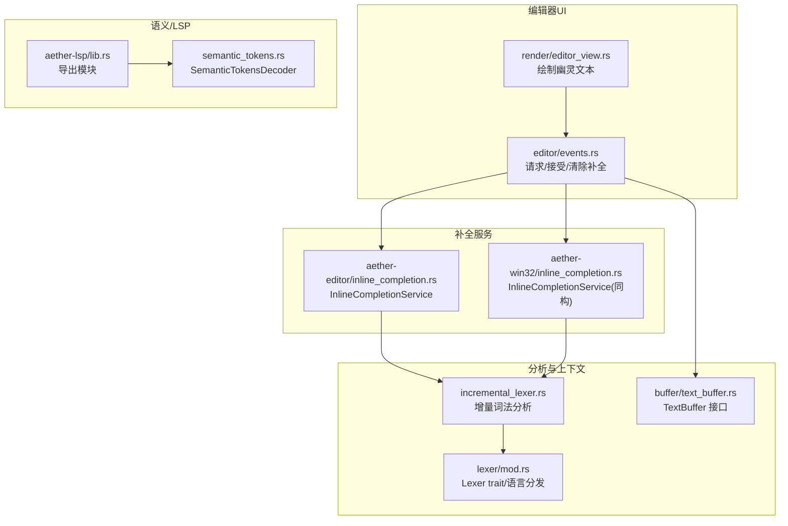
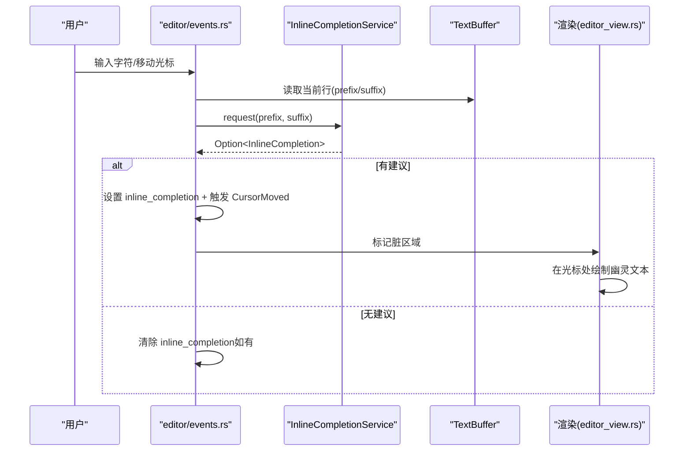
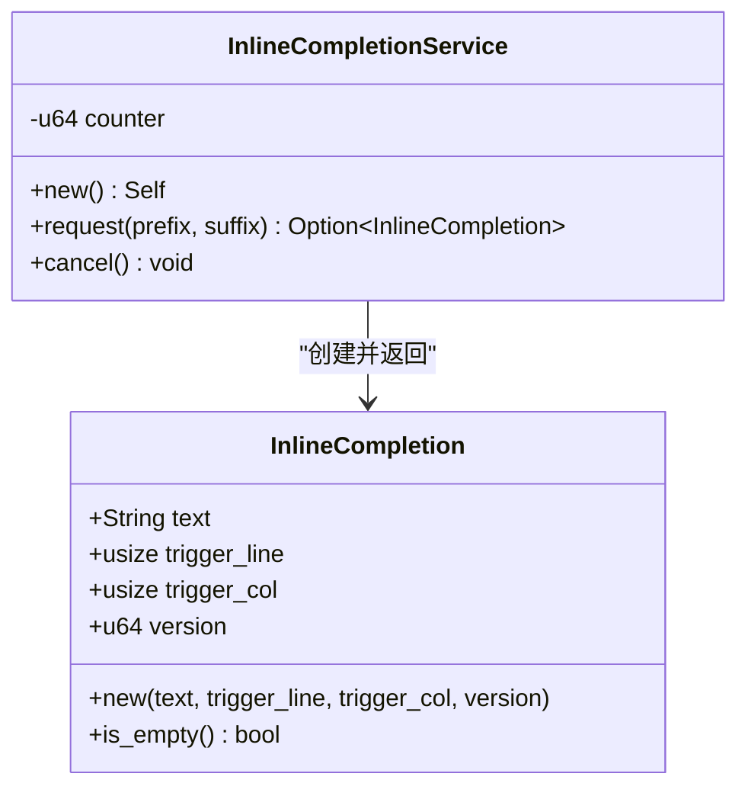
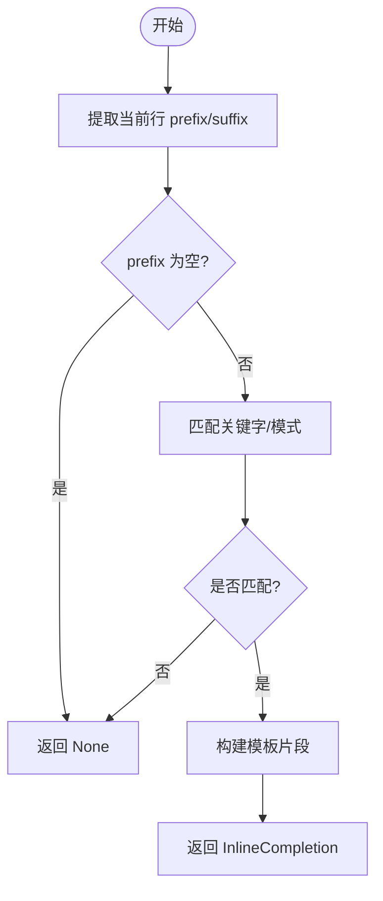
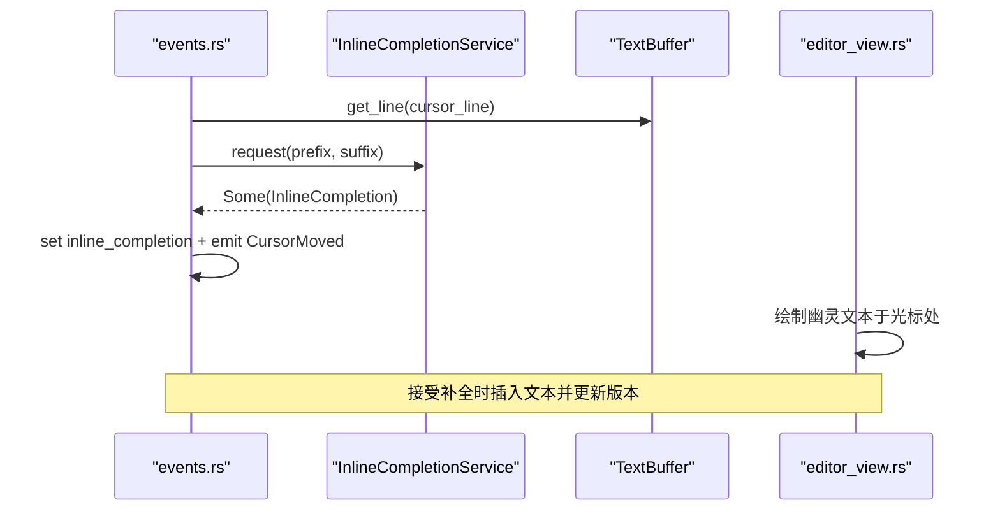
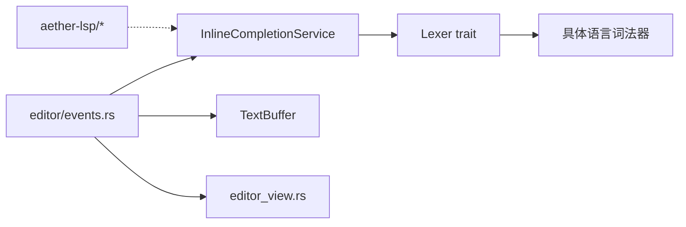

# 代码补全

<cite>
**本文引用的文件**
- [aether-editor/src/inline_completion.rs](file://crates/aether-editor/src/inline_completion.rs)
- [aether-win32/src/inline_completion.rs](file://crates/aether-win32/src/inline_completion.rs)
- [aether-win32/src/editor/events.rs](file://crates/aether-win32/src/editor/events.rs)
- [aether-core/src/incremental_lexer.rs](file://crates/aether-core/src/incremental_lexer.rs)
- [aether-core/src/lexer/mod.rs](file://crates/aether-core/src/lexer/mod.rs)
- [aether-lsp/src/lib.rs](file://crates/aether-lsp/src/lib.rs)
- [aether-lsp/src/semantic_tokens.rs](file://crates/aether-lsp/src/semantic_tokens.rs)
- [aether-core/src/buffer/text_buffer.rs](file://crates/aether-core/src/buffer/text_buffer.rs)
- [aether-win32/src/render/editor_view.rs](file://crates/aether-win32/src/render/editor_view.rs)
</cite>

## 目录
1. [简介](#简介)
2. [项目结构](#项目结构)
3. [核心组件](#核心组件)
4. [架构总览](#架构总览)
5. [详细组件分析](#详细组件分析)
6. [依赖关系分析](#依赖关系分析)
7. [性能考量](#性能考量)
8. [故障排查指南](#故障排查指南)
9. [结论](#结论)
10. [附录](#附录)

## 简介
本文件聚焦牧羊人编辑器的“内联代码补全（幽灵文本）”能力，系统梳理其实现机制与数据流：从用户输入触发、上下文提取、增量词法分析、语义信息利用，到候选项生成、排序与渲染。文档同时给出性能优化策略（缓存、异步、增量更新）以及在实际编辑器中如何触发、处理并展示补全结果的操作流程。

## 项目结构
与内联补全直接相关的模块分布在以下 crate 中：
- aether-editor / aether-win32：内联补全服务与 UI 事件处理、接受/清除逻辑
- aether-core：增量词法分析器、语言词法抽象、缓冲区接口
- aether-lsp：语义令牌解码与 LSP 集成入口（为后续语义增强预留）
- 渲染层：在光标位置绘制幽灵文本

图表来源
- [aether-win32/src/editor/events.rs:38-111](file://crates/aether-win32/src/editor/events.rs#L38-L111)
- [aether-editor/src/inline_completion.rs:1-119](file://crates/aether-editor/src/inline_completion.rs#L1-L119)
- [aether-win32/src/inline_completion.rs:1-119](file://crates/aether-win32/src/inline_completion.rs#L1-L119)
- [aether-core/src/incremental_lexer.rs:1-129](file://crates/aether-core/src/incremental_lexer.rs#L1-L129)
- [aether-core/src/lexer/mod.rs:1-196](file://crates/aether-core/src/lexer/mod.rs#L1-L196)
- [aether-core/src/buffer/text_buffer.rs:1-49](file://crates/aether-core/src/buffer/text_buffer.rs#L1-L49)
- [aether-win32/src/render/editor_view.rs:603-635](file://crates/aether-win32/src/render/editor_view.rs#L603-L635)
- [aether-lsp/src/lib.rs:1-16](file://crates/aether-lsp/src/lib.rs#L1-L16)
- [aether-lsp/src/semantic_tokens.rs:1-127](file://crates/aether-lsp/src/semantic_tokens.rs#L1-L127)

章节来源
- [aether-win32/src/editor/events.rs:38-111](file://crates/aether-win32/src/editor/events.rs#L38-L111)
- [aether-editor/src/inline_completion.rs:1-119](file://crates/aether-editor/src/inline_completion.rs#L1-L119)
- [aether-win32/src/inline_completion.rs:1-119](file://crates/aether-win32/src/inline_completion.rs#L1-L119)
- [aether-core/src/incremental_lexer.rs:1-129](file://crates/aether-core/src/incremental_lexer.rs#L1-L129)
- [aether-core/src/lexer/mod.rs:1-196](file://crates/aether-core/src/lexer/mod.rs#L1-L196)
- [aether-core/src/buffer/text_buffer.rs:1-49](file://crates/aether-core/src/buffer/text_buffer.rs#L1-L49)
- [aether-win32/src/render/editor_view.rs:603-635](file://crates/aether-win32/src/render/editor_view.rs#L603-L635)
- [aether-lsp/src/lib.rs:1-16](file://crates/aether-lsp/src/lib.rs#L1-L16)
- [aether-lsp/src/semantic_tokens.rs:1-127](file://crates/aether-lsp/src/semantic_tokens.rs#L1-L127)

## 核心组件
- InlineCompletion：表示一次补全建议的数据结构，包含建议文本、触发位置（行/列）、版本号，用于去抖和防重入。
- InlineCompletionService：当前基于前缀匹配的模式化补全服务，支持 request/cancel；未来可扩展为异步 AI 或 LSP 调用。
- IncrementalLexer：按行缓存 token，编辑时仅重新分析受影响行，显著降低重复分析开销。
- Lexer 抽象与语言分发：统一 Lexer trait，按扩展名选择具体语言词法器，提供静态分发路径。
- TextBuffer：编辑器文本的抽象接口，提供插入、删除、切片、行范围等能力，供事件处理与补全上下文提取使用。
- 渲染：在光标处绘制幽灵文本，确保视觉对齐与脏矩形刷新。

章节来源
- [aether-editor/src/inline_completion.rs:1-119](file://crates/aether-editor/src/inline_completion.rs#L1-L119)
- [aether-win32/src/inline_completion.rs:1-119](file://crates/aether-win32/src/inline_completion.rs#L1-L119)
- [aether-core/src/incremental_lexer.rs:1-129](file://crates/aether-core/src/incremental_lexer.rs#L1-L129)
- [aether-core/src/lexer/mod.rs:1-196](file://crates/aether-core/src/lexer/mod.rs#L1-L196)
- [aether-core/src/buffer/text_buffer.rs:1-49](file://crates/aether-core/src/buffer/text_buffer.rs#L1-L49)
- [aether-win32/src/render/editor_view.rs:603-635](file://crates/aether-win32/src/render/editor_view.rs#L603-L635)

## 架构总览
内联补全的整体流程如下：
- 用户在编辑器输入或移动光标时，事件处理器收集当前行的 prefix/suffix 作为上下文。
- 调用 InlineCompletionService.request(prefix, suffix) 获取建议。
- 若返回建议，则写入 editor.content.inline_completion，并触发 CursorMoved 事件以刷新显示。
- 渲染阶段根据光标位置绘制幽灵文本。
- 接受补全时，将建议文本插入到光标位置，并更新缓冲区版本与脏区域。

图表来源
- [aether-win32/src/editor/events.rs:38-111](file://crates/aether-win32/src/editor/events.rs#L38-L111)
- [aether-editor/src/inline_completion.rs:42-67](file://crates/aether-editor/src/inline_completion.rs#L42-L67)
- [aether-win32/src/inline_completion.rs:42-67](file://crates/aether-win32/src/inline_completion.rs#L42-L67)
- [aether-core/src/buffer/text_buffer.rs:1-49](file://crates/aether-core/src/buffer/text_buffer.rs#L1-L49)
- [aether-win32/src/render/editor_view.rs:603-635](file://crates/aether-win32/src/render/editor_view.rs#L603-L635)

## 详细组件分析

### 内联补全数据结构与服务
- InlineCompletion：保存 text、trigger_line、trigger_col、version。is_empty() 用于快速判断是否有效。
- InlineCompletionService：维护递增 counter 作为 version，request 调用 suggest_completion 生成片段，cancel 占位用于未来取消异步请求。
- suggest_completion：基于前缀末尾单词匹配关键字，返回模板片段（含缩进与换行）。对注释标记做特殊处理。

图表来源
- [aether-editor/src/inline_completion.rs:1-67](file://crates/aether-editor/src/inline_completion.rs#L1-L67)
- [aether-win32/src/inline_completion.rs:1-67](file://crates/aether-win32/src/inline_completion.rs#L1-L67)

章节来源
- [aether-editor/src/inline_completion.rs:1-119](file://crates/aether-editor/src/inline_completion.rs#L1-L119)
- [aether-win32/src/inline_completion.rs:1-119](file://crates/aether-win32/src/inline_completion.rs#L1-L119)

### 上下文感知与增量词法分析
- 上下文提取：事件处理器从当前行截取 prefix/suffix，结合光标行列构建上下文。
- 增量词法分析：IncrementalLexer 按行缓存 token，编辑后仅重新分析受影响行，避免全量重建。
- 语言分发：通过 Language::create_lexer 或 lex_full 选择具体语言词法器，保证多语言场景下的正确性。

图表来源
- [aether-win32/src/editor/events.rs:38-76](file://crates/aether-win32/src/editor/events.rs#L38-L76)
- [aether-editor/src/inline_completion.rs:69-119](file://crates/aether-editor/src/inline_completion.rs#L69-L119)
- [aether-core/src/incremental_lexer.rs:18-129](file://crates/aether-core/src/incremental_lexer.rs#L18-L129)
- [aether-core/src/lexer/mod.rs:159-196](file://crates/aether-core/src/lexer/mod.rs#L159-L196)

章节来源
- [aether-win32/src/editor/events.rs:38-76](file://crates/aether-win32/src/editor/events.rs#L38-L76)
- [aether-editor/src/inline_completion.rs:69-119](file://crates/aether-editor/src/inline_completion.rs#L69-L119)
- [aether-core/src/incremental_lexer.rs:18-129](file://crates/aether-core/src/incremental_lexer.rs#L18-L129)
- [aether-core/src/lexer/mod.rs:159-196](file://crates/aether-core/src/lexer/mod.rs#L159-L196)

### 补全结果的生成与排序
- 生成：suggest_completion 根据前缀末尾单词匹配关键字，返回对应模板片段（如 fn/if/for/struct 等），并对注释标记进行特殊处理。
- 排序：当前实现为单条建议，不涉及候选排序；未来可接入 LSP/AI 返回多条候选并按相关性排序。

章节来源
- [aether-editor/src/inline_completion.rs:69-119](file://crates/aether-editor/src/inline_completion.rs#L69-L119)
- [aether-win32/src/inline_completion.rs:69-119](file://crates/aether-win32/src/inline_completion.rs#L69-L119)

### 触发、处理与界面集成
- 触发：在编辑器事件处理中，当检测到输入或光标移动时，调用 request_inline_completion 收集上下文并请求建议。
- 处理：若返回建议，设置 inline_completion 并触发 CursorMoved；若无建议，清除现有建议。
- 接受：accept_inline_completion 校验触发位置一致性，将建议文本插入到光标位置，更新缓冲区版本与脏区域。
- 渲染：渲染器在光标位置绘制幽灵文本，确保与主文本对齐。

图表来源
- [aether-win32/src/editor/events.rs:38-111](file://crates/aether-win32/src/editor/events.rs#L38-L111)
- [aether-win32/src/render/editor_view.rs:603-635](file://crates/aether-win32/src/render/editor_view.rs#L603-L635)

章节来源
- [aether-win32/src/editor/events.rs:38-111](file://crates/aether-win32/src/editor/events.rs#L38-L111)
- [aether-win32/src/render/editor_view.rs:603-635](file://crates/aether-win32/src/render/editor_view.rs#L603-L635)

### 语义信息与 LSP 集成点
- LSP 模块已提供 semantic tokens 解码与类型映射，可用于后续增强补全的语义准确性（如变量类型、函数签名提示）。
- 当前内联补全未直接使用 LSP，但 lib.rs 暴露了相关模块，便于未来接入。

章节来源
- [aether-lsp/src/lib.rs:1-16](file://crates/aether-lsp/src/lib.rs#L1-L16)
- [aether-lsp/src/semantic_tokens.rs:1-127](file://crates/aether-lsp/src/semantic_tokens.rs#L1-L127)

## 依赖关系分析
- 事件处理依赖 TextBuffer 获取上下文，依赖 InlineCompletionService 生成建议，依赖渲染模块绘制幽灵文本。
- 增量词法分析依赖 Lexer trait 与具体语言实现，按行缓存 token，减少重复计算。
- LSP 模块为可选增强路径，当前未耦合到内联补全主流程。

图表来源
- [aether-win32/src/editor/events.rs:38-111](file://crates/aether-win32/src/editor/events.rs#L38-L111)
- [aether-core/src/lexer/mod.rs:1-196](file://crates/aether-core/src/lexer/mod.rs#L1-L196)
- [aether-lsp/src/lib.rs:1-16](file://crates/aether-lsp/src/lib.rs#L1-L16)

章节来源
- [aether-win32/src/editor/events.rs:38-111](file://crates/aether-win32/src/editor/events.rs#L38-L111)
- [aether-core/src/lexer/mod.rs:1-196](file://crates/aether-core/src/lexer/mod.rs#L1-L196)
- [aether-lsp/src/lib.rs:1-16](file://crates/aether-lsp/src/lib.rs#L1-L16)

## 性能考量
- 增量词法分析：IncrementalLexer 按行缓存 token，编辑后仅重新分析受影响行，避免全量重建，显著降低 CPU 占用。
- 视图优先高亮：渲染阶段优先处理可见区域与扩展区域，提升首帧响应速度。
- 缓存窗口滑动：通过 slide_cache_window 保留重叠部分，减少重复分配与解析。
- 大文件优化：在大文件模式下跳过语法高亮，保证流畅编辑体验。
- 异步与取消：InlineCompletionService.cancel 占位，为未来异步请求（AI/LSP）取消 in-flight 任务预留接口。

章节来源
- [aether-core/src/incremental_lexer.rs:18-129](file://crates/aether-core/src/incremental_lexer.rs#L18-L129)
- [aether-win32/src/editor/events.rs:401-621](file://crates/aether-win32/src/editor/events.rs#L401-L621)
- [aether-editor/src/inline_completion.rs:57-61](file://crates/aether-editor/src/inline_completion.rs#L57-L61)
- [aether-win32/src/inline_completion.rs:57-61](file://crates/aether-win32/src/inline_completion.rs#L57-L61)

## 故障排查指南
- 幽灵文本残留：若清除补全后仍有残留，需确保触发 CursorMoved 事件以标记脏区域擦除。
- 位置不一致：接受补全时需校验 trigger_line/trigger_col 与当前光标一致，否则应清理并标记脏区域。
- 上下文错误：确认 prefix/suffix 截取边界正确，避免跨行或字节偏移错误导致匹配失败。
- 性能回退：检查是否误入大文件模式或 GPU 高亮未命中，必要时调整阈值或禁用 GPU 路径。

章节来源
- [aether-win32/src/editor/events.rs:77-111](file://crates/aether-win32/src/editor/events.rs#L77-L111)
- [aether-win32/src/editor/events.rs:401-621](file://crates/aether-win32/src/editor/events.rs#L401-L621)

## 结论
当前内联补全采用轻量级模式匹配方案，具备清晰的上下文提取、增量词法分析与渲染集成链路，满足基础开发效率需求。未来可通过接入 LSP/AI 实现更智能的语义补全与候选排序，并结合异步请求与取消机制进一步提升用户体验。

## 附录
- 触发示例：在编辑器事件中调用 request_inline_completion，传入当前行 prefix/suffix。
- 处理示例：根据返回值设置 inline_completion 并触发 CursorMoved；接受时插入文本并更新版本。
- 集成示例：渲染器在光标位置绘制幽灵文本，确保与主文本对齐。

章节来源
- [aether-win32/src/editor/events.rs:38-111](file://crates/aether-win32/src/editor/events.rs#L38-L111)
- [aether-win32/src/render/editor_view.rs:603-635](file://crates/aether-win32/src/render/editor_view.rs#L603-L635)