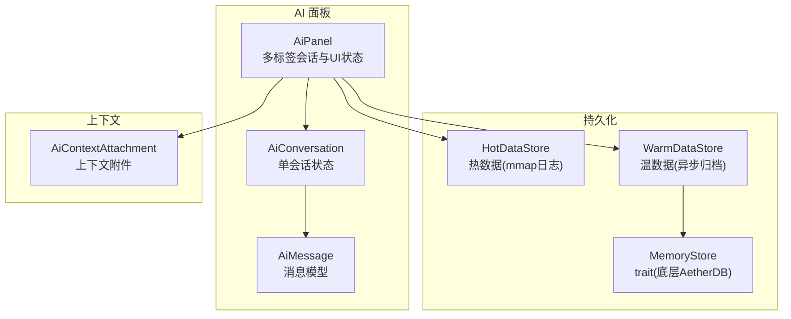
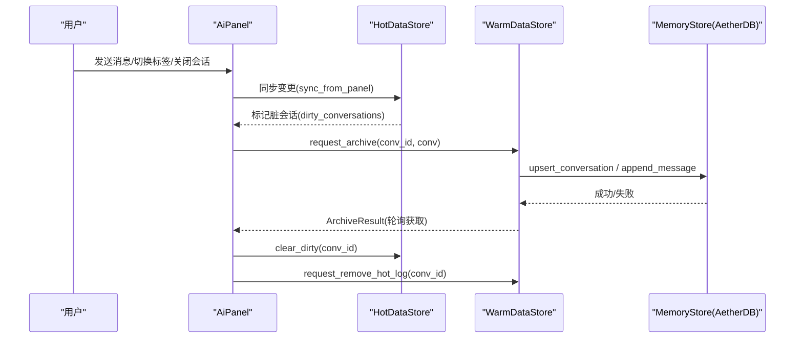
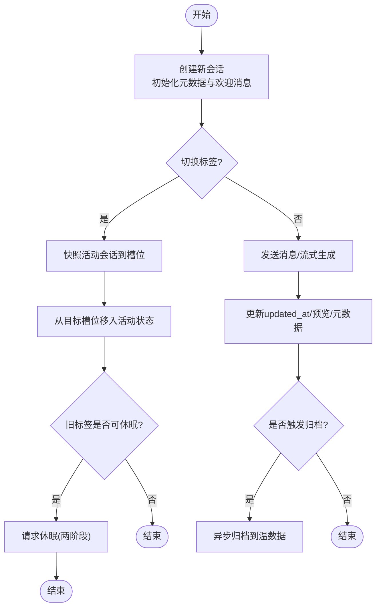
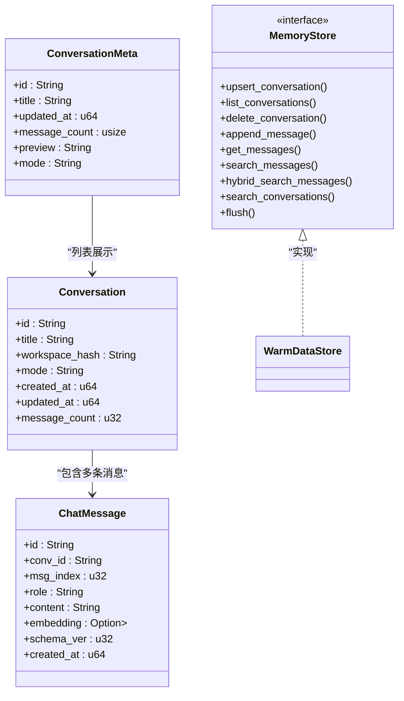
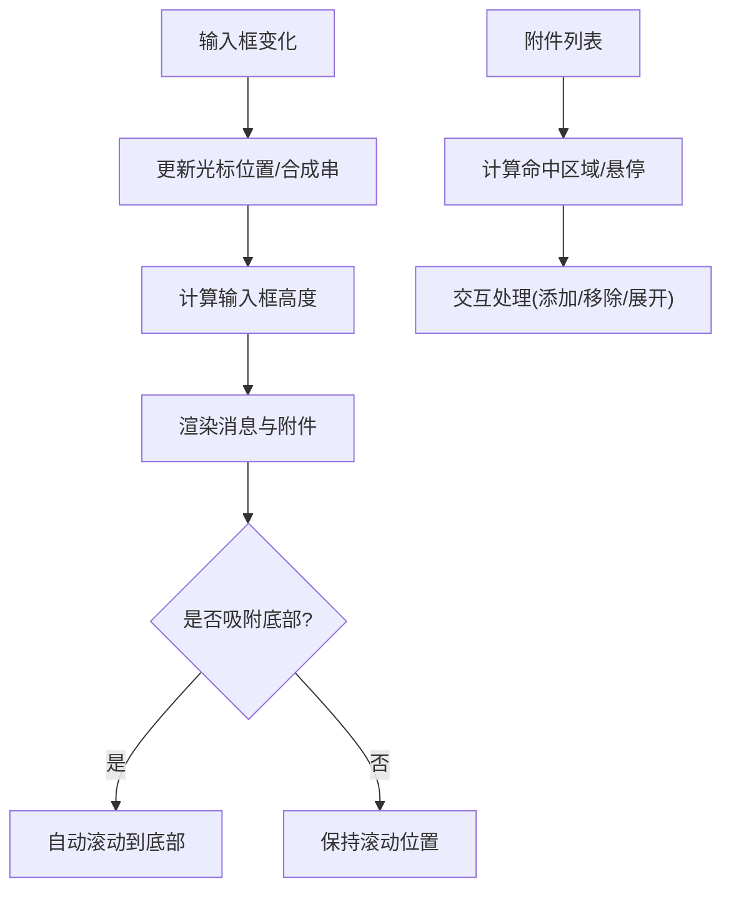
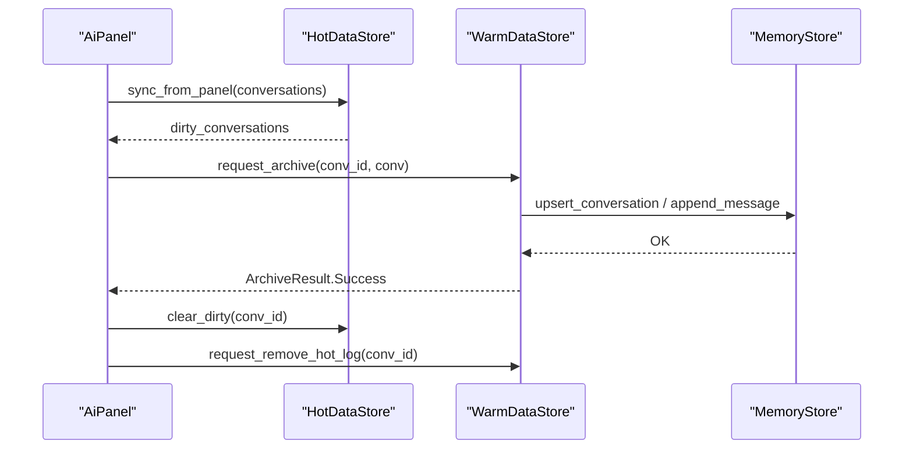
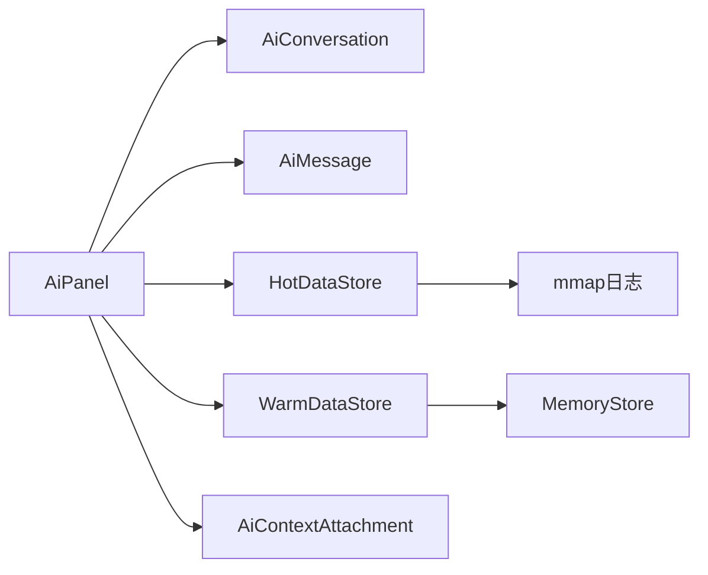

# 对话管理

<cite>
**本文引用的文件**
- [ai_panel.rs](file://crates/aether-ai-panel/src/ai_panel.rs)
- [memory_store.rs](file://crates/aether-ai-panel/src/memory_store.rs)
- [ai_hot_data.rs](file://crates/aether-ai-panel/src/ai_hot_data.rs)
- [ai_warm_data.rs](file://crates/aether-ai-panel/src/ai_warm_data.rs)
- [ai_context.rs](file://crates/aether-ai-panel/src/ai_context.rs)
- [lib.rs](file://crates/aether-ai-panel/src/lib.rs)
</cite>

## 目录
1. [简介](#简介)
2. [项目结构](#项目结构)
3. [核心组件](#核心组件)
4. [架构总览](#架构总览)
5. [详细组件分析](#详细组件分析)
6. [依赖关系分析](#依赖关系分析)
7. [性能考量](#性能考量)
8. [故障排查指南](#故障排查指南)
9. [结论](#结论)
10. [附录：使用示例与最佳实践](#附录使用示例与最佳实践)

## 简介
本文件为牧羊人编辑器“AI 面板”的对话管理功能提供系统化文档，覆盖多标签页对话系统、会话生命周期管理、消息持久化（热数据/温数据）、历史查询、对话状态管理（输入框、滚动位置、附件等）以及记忆存储机制（分层存储与迁移）。文档以代码为依据，给出关键流程的可视化图示和可操作的实现路径。

## 项目结构
AI 面板模块位于 crates/aether-ai-panel，围绕“对话”这一核心概念组织：
- ai_panel.rs：定义对话与会话状态、流式响应、标签切换、历史列表与详情、UI 状态字段等。
- memory_store.rs：定义 MemoryStore trait 及 JSONL 会话日志、Playbook 条目等数据结构。
- ai_hot_data.rs：热数据层，维护活跃会话内存快照与 mmap 增量日志，支持脏标记与归档触发。
- ai_warm_data.rs：温数据层，异步归档到 AetherDB（MemoryStore 实现），提供历史加载、语义检索、Playbook 管理等能力。
- ai_context.rs：上下文附件类型与工具函数，用于收集编辑器上下文注入提示。
- lib.rs：模块导出入口。

图表来源
- [ai_panel.rs:258-729](file://crates/aether-ai-panel/src/ai_panel.rs#L258-L729)
- [ai_hot_data.rs:17-29](file://crates/aether-ai-panel/src/ai_hot_data.rs#L17-L29)
- [ai_warm_data.rs:52-70](file://crates/aether-ai-panel/src/ai_warm_data.rs#L52-L70)
- [memory_store.rs:77-141](file://crates/aether-ai-panel/src/memory_store.rs#L77-L141)
- [ai_context.rs:6-19](file://crates/aether-ai-panel/src/ai_context.rs#L6-L19)

章节来源
- [lib.rs:1-14](file://crates/aether-ai-panel/src/lib.rs#L1-L14)

## 核心组件
- AiPanel：多标签会话容器与 UI 状态中心，包含活动会话扁平字段、会话槽位数组、历史列表、搜索、分页、浮窗等。
- AiConversation：单个会话的数据与行为，包括消息、输入、光标、滚动、模式、附件、流状态、休眠标志等。
- AiMessage：消息体，含角色、内容、思考过程（reasoning）、折叠与耗时等。
- HotDataStore：热数据层，维护活跃会话内存与增量日志，跟踪脏会话并判断归档时机。
- WarmDataStore：温数据层，后台线程异步归档会话到 MemoryStore，并提供历史加载、语义检索、Playbook 管理。
- MemoryStore：统一存储接口，抽象会话、消息、Playbook 的增删改查与向量检索。
- AiContextAttachment：上下文附件类型，决定 AI 回答时可见的编辑器上下文范围。

章节来源
- [ai_panel.rs:102-729](file://crates/aether-ai-panel/src/ai_panel.rs#L102-L729)
- [memory_store.rs:28-141](file://crates/aether-ai-panel/src/memory_store.rs#L28-L141)
- [ai_hot_data.rs:17-29](file://crates/aether-ai-panel/src/ai_hot_data.rs#L17-L29)
- [ai_warm_data.rs:52-70](file://crates/aether-ai-panel/src/ai_warm_data.rs#L52-L70)
- [ai_context.rs:6-19](file://crates/aether-ai-panel/src/ai_context.rs#L6-L19)

## 架构总览
对话管理采用“热→温→冷”三阶段持久化策略：
- 热数据：内存 + mmap 追加式日志，零磁盘 IO 的活跃会话读写；变更通过差异对比生成增量日志条目。
- 温数据：后台线程批量归档完整会话至 AetherDB（MemoryStore 实现），建立向量索引，支持语义检索与 Playbook 沉淀。
- 冷数据：超长期不访问的会话压缩归档（当前由上层策略控制）。

图表来源
- [ai_panel.rs:1088-1144](file://crates/aether-ai-panel/src/ai_panel.rs#L1088-L1144)
- [ai_hot_data.rs:89-187](file://crates/aether-ai-panel/src/ai_hot_data.rs#L89-L187)
- [ai_warm_data.rs:218-391](file://crates/aether-ai-panel/src/ai_warm_data.rs#L218-L391)
- [memory_store.rs:77-141](file://crates/aether-ai-panel/src/memory_store.rs#L77-L141)

## 详细组件分析

### 多标签页对话系统与会话生命周期
- 会话创建：新建会话时初始化标题、时间戳、欢迎消息、默认模式与空附件，并设置流状态与停止标志。
- 活动会话切换：将当前活动会话快照回槽位，再从目标槽位移入活动状态；若旧标签空闲且可归档则发起休眠。
- 会话休眠与唤醒：休眠时卸载消息体（仅保留轻量现场），唤醒时从温数据层读回消息体，确保大对象按需加载。
- 会话关闭：归档元数据与消息，必要时删除热数据日志，清理槽位或重置活动索引。

图表来源
- [ai_panel.rs:292-338](file://crates/aether-ai-panel/src/ai_panel.rs#L292-L338)
- [ai_panel.rs:1088-1144](file://crates/aether-ai-panel/src/ai_panel.rs#L1088-L1144)
- [ai_panel.rs:1255-1287](file://crates/aether-ai-panel/src/ai_panel.rs#L1255-L1287)
- [ai_hot_data.rs:167-193](file://crates/aether-ai-panel/src/ai_hot_data.rs#L167-L193)

章节来源
- [ai_panel.rs:258-729](file://crates/aether-ai-panel/src/ai_panel.rs#L258-L729)
- [ai_panel.rs:1088-1144](file://crates/aether-ai-panel/src/ai_panel.rs#L1088-L1144)
- [ai_panel.rs:1255-1287](file://crates/aether-ai-panel/src/ai_panel.rs#L1255-L1287)

### 消息持久化与历史查询
- 热数据持久化：增量日志记录新增消息与元数据变更，避免重复写入历史消息与固定系统提示。
- 温数据归档：后台线程将完整会话写入 MemoryStore，建立向量索引，支持语义检索与按工作区过滤的历史列表。
- 历史列表与详情：懒加载元数据，点击详情再读取完整会话；支持分页、时间筛选、类型筛选与搜索。
- 删除与清空：级联删除会话及其消息与向量索引；清空全部历史后重置筛选与分页状态。

图表来源
- [ai_panel.rs:462-520](file://crates/aether-ai-panel/src/ai_panel.rs#L462-L520)
- [memory_store.rs:28-54](file://crates/aether-ai-panel/src/memory_store.rs#L28-L54)
- [memory_store.rs:77-141](file://crates/aether-ai-panel/src/memory_store.rs#L77-L141)
- [ai_warm_data.rs:393-488](file://crates/aether-ai-panel/src/ai_warm_data.rs#L393-L488)

章节来源
- [ai_warm_data.rs:393-488](file://crates/aether-ai-panel/src/ai_warm_data.rs#L393-L488)
- [memory_store.rs:77-141](file://crates/aether-ai-panel/src/memory_store.rs#L77-L141)

### 对话状态管理（输入框、滚动位置、附件）
- 输入框状态：input、caret_pos、composition（IME 预编辑文本）、input_computed_height（动态高度）。
- 滚动与吸附：scroll_y、content_height、stick_to_bottom（新消息到达自动滚底）。
- 附件管理：attachments 列表，每个附件为上下文标记（当前文件、选区、打开文件、诊断、文件树、自定义文本），渲染时计算命中区域与悬停状态。
- 流式状态：stream_state（partial/reasoning/done/error/truncated/start_time/received_first_response），should_stop 控制中断。

图表来源
- [ai_panel.rs:554-729](file://crates/aether-ai-panel/src/ai_panel.rs#L554-L729)
- [ai_context.rs:6-19](file://crates/aether-ai-panel/src/ai_context.rs#L6-L19)

章节来源
- [ai_panel.rs:554-729](file://crates/aether-ai-panel/src/ai_panel.rs#L554-L729)
- [ai_context.rs:6-19](file://crates/aether-ai-panel/src/ai_context.rs#L6-L19)

### 记忆存储机制（热数据/温数据/迁移）
- 热数据：HotDataStore 维护活跃会话内存与 mmap 增量日志；sync_from_panel 检测变更并追加日志；dirty_conversations 标记脏会话；should_warm_archive 基于空闲时间与脏集合判断归档时机。
- 温数据：WarmDataStore 后台线程接收归档请求，调用 MemoryStore 写入会话元数据与消息，建立向量索引；成功后删除热数据日志；支持语义检索与 Playbook 管理。
- 迁移方案：热→温归档完成后删除热日志；退出时 flush 并关闭归档线程；支持 grow-and-refine 剪枝与审计日志。

图表来源
- [ai_hot_data.rs:89-193](file://crates/aether-ai-panel/src/ai_hot_data.rs#L89-L193)
- [ai_warm_data.rs:218-391](file://crates/aether-ai-panel/src/ai_warm_data.rs#L218-L391)
- [memory_store.rs:77-141](file://crates/aether-ai-panel/src/memory_store.rs#L77-L141)

章节来源
- [ai_hot_data.rs:89-193](file://crates/aether-ai-panel/src/ai_hot_data.rs#L89-L193)
- [ai_warm_data.rs:218-391](file://crates/aether-ai-panel/src/ai_warm_data.rs#L218-L391)

## 依赖关系分析
- AiPanel 依赖 AiConversation/AiMessage 进行会话与消息建模，依赖 HotDataStore/WarmDataStore 进行持久化，依赖 AiContextAttachment 收集上下文。
- HotDataStore 依赖 AiConversation 与日志序列化，依赖 mmap 追加式写入。
- WarmDataStore 依赖 MemoryStore 抽象，当前实现为 AetherDbMemoryStore，提供向量检索与 Playbook 管理。
- MemoryStore 提供统一接口，屏蔽底层存储细节，便于替换实现。

图表来源
- [ai_panel.rs:258-729](file://crates/aether-ai-panel/src/ai_panel.rs#L258-L729)
- [ai_hot_data.rs:17-29](file://crates/aether-ai-panel/src/ai_hot_data.rs#L17-L29)
- [ai_warm_data.rs:52-70](file://crates/aether-ai-panel/src/ai_warm_data.rs#L52-L70)
- [memory_store.rs:77-141](file://crates/aether-ai-panel/src/memory_store.rs#L77-L141)

章节来源
- [ai_panel.rs:258-729](file://crates/aether-ai-panel/src/ai_panel.rs#L258-L729)
- [ai_warm_data.rs:52-70](file://crates/aether-ai-panel/src/ai_warm_data.rs#L52-L70)
- [memory_store.rs:77-141](file://crates/aether-ai-panel/src/memory_store.rs#L77-L141)

## 性能考量
- 热数据零磁盘 IO：活跃会话读写优先内存，增量日志仅追加变更，避免全量重写。
- 懒加载与休眠：非活动会话消息体卸载，激活时从温数据层水合，降低内存占用。
- 后台归档：温数据归档在独立线程执行，不阻塞 UI；批量写入减少锁竞争。
- 向量检索：HNSW 索引加速语义搜索；会话去重提升历史列表质量。
- 滚动优化：stick_to_bottom 与 content_height 配合，避免频繁重排。

[本节为通用性能指导，无需特定文件引用]

## 故障排查指南
- 归档失败：检查 WarmDataStore 的 ArchiveResult，确认 MemoryStore 写入是否成功；查看错误信息定位网络或存储问题。
- 热数据未删除：确认归档成功后是否调用 request_remove_hot_log；检查热日志路径是否存在。
- 历史列表为空：确认 load_history_meta 是否返回结果；检查 search_conversations 的工作区过滤条件。
- 流式生成卡住：检查 stream_state.done 与 received_first_response；确认 should_stop 是否被设置；查看超时与截断逻辑。
- 输入框状态异常：核对 caret_pos、composition、input_computed_height 的更新路径；确保 snapshot_active_into_slot 正确回填。

章节来源
- [ai_warm_data.rs:382-391](file://crates/aether-ai-panel/src/ai_warm_data.rs#L382-L391)
- [ai_panel.rs:731-800](file://crates/aether-ai-panel/src/ai_panel.rs#L731-L800)
- [ai_panel.rs:1088-1144](file://crates/aether-ai-panel/src/ai_panel.rs#L1088-L1144)

## 结论
牧羊人编辑器的对话管理通过多标签会话、分层持久化与后台归档实现了高效、可扩展的对话系统。热数据保证低延迟交互，温数据提供持久化与语义检索能力，结合会话休眠与懒加载优化内存使用。该设计兼顾用户体验与系统稳定性，适合大规模对话场景。

[本节为总结性内容，无需特定文件引用]

## 附录：使用示例与最佳实践
以下示例展示如何创建新对话、切换活动会话、管理对话历史等实际应用场景。请根据具体 API 调用路径参考对应源码行号。

- 创建新对话
  - 步骤：初始化会话 ID、标题、时间戳、欢迎消息、默认模式与空附件；设置流状态与停止标志。
  - 参考路径：[ai_panel.rs:292-317](file://crates/aether-ai-panel/src/ai_panel.rs#L292-L317)

- 切换活动会话
  - 步骤：快照当前活动会话到槽位；从目标槽位移入活动状态；若旧标签空闲且可归档则发起休眠。
  - 参考路径：[ai_panel.rs:1088-1144](file://crates/aether-ai-panel/src/ai_panel.rs#L1088-L1144)

- 管理对话历史
  - 步骤：加载历史元数据列表；点击详情加载完整会话；支持分页、时间筛选、类型筛选与搜索；删除或清空历史。
  - 参考路径：[ai_warm_data.rs:393-488](file://crates/aether-ai-panel/src/ai_warm_data.rs#L393-L488)
  - 参考路径：[ai_panel.rs:1255-1287](file://crates/aether-ai-panel/src/ai_panel.rs#L1255-L1287)

- 上下文附件管理
  - 步骤：选择附件类型（当前文件、选区、打开文件、诊断、文件树、自定义文本）；渲染时计算命中区域与悬停状态。
  - 参考路径：[ai_context.rs:6-19](file://crates/aether-ai-panel/src/ai_context.rs#L6-L19)
  - 参考路径：[ai_panel.rs:554-729](file://crates/aether-ai-panel/src/ai_panel.rs#L554-L729)

- 热数据与温数据协作
  - 步骤：同步变更到热数据；后台归档到温数据；成功后删除热日志；轮询归档结果。
  - 参考路径：[ai_hot_data.rs:89-193](file://crates/aether-ai-panel/src/ai_hot_data.rs#L89-L193)
  - 参考路径：[ai_warm_data.rs:218-391](file://crates/aether-ai-panel/src/ai_warm_data.rs#L218-L391)

[本节为操作指引，无需额外文件引用]