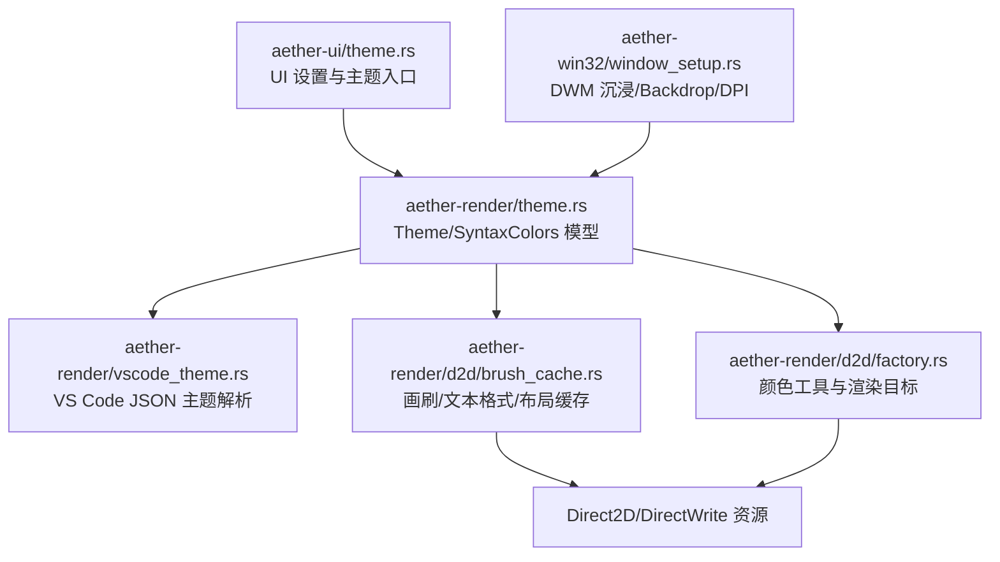
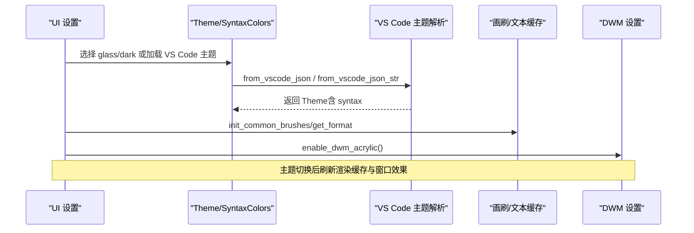
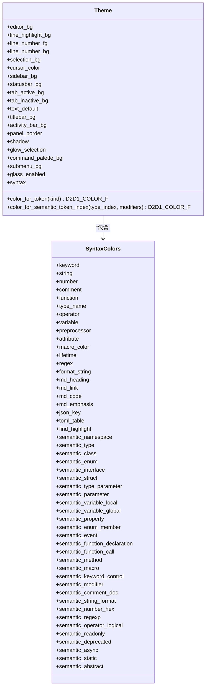
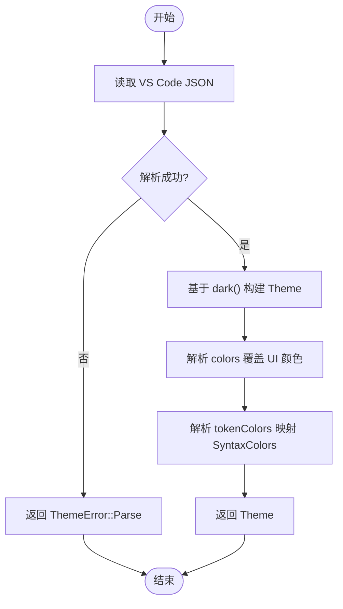
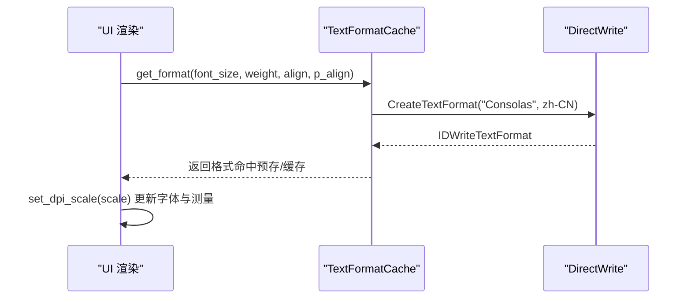
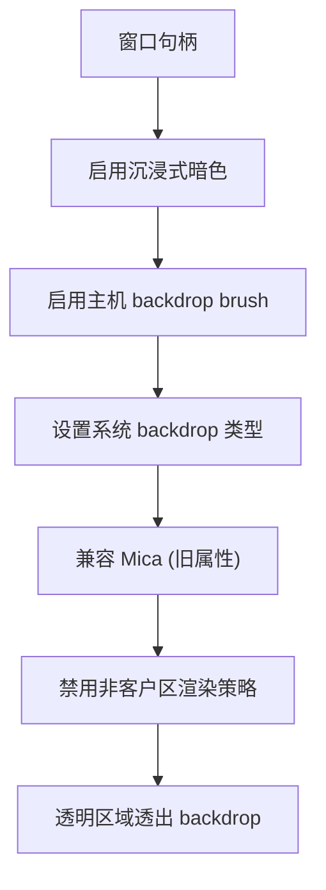
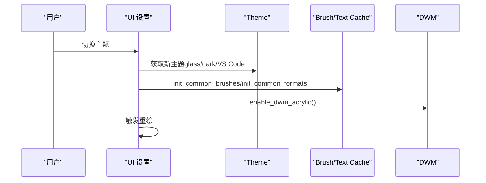
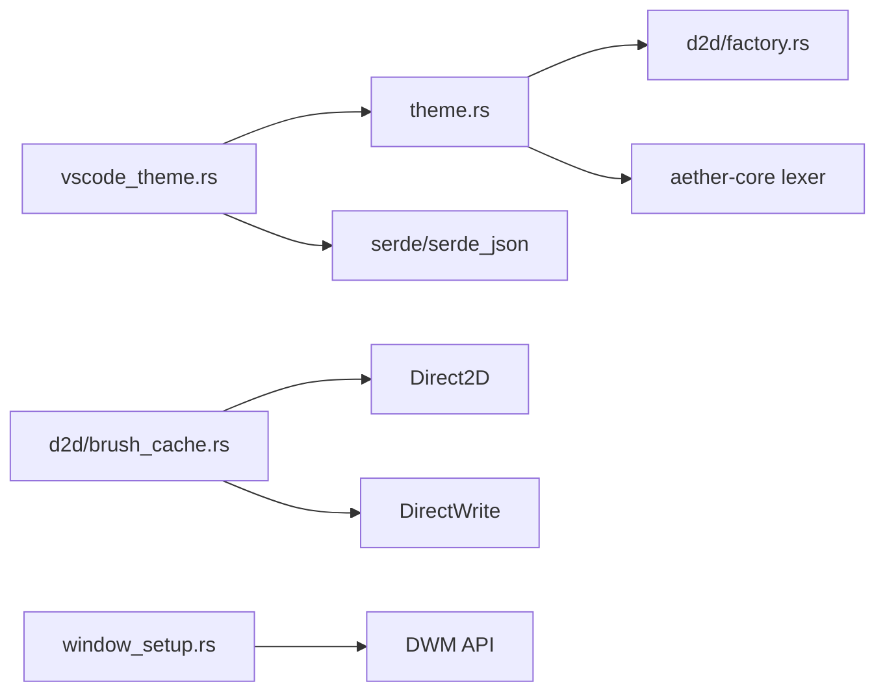

# 主题与样式

<cite>
**本文引用的文件**
- [crates/aether-render/src/theme.rs](file://crates/aether-render/src/theme.rs)
- [crates/aether-render/src/vscode_theme.rs](file://crates/aether-render/src/vscode_theme.rs)
- [crates/aether-ui/src/theme.rs](file://crates/aether-ui/src/theme.rs)
- [crates/aether-win32/src/theme.rs](file://crates/aether-win32/src/theme.rs)
- [crates/aether-render/src/d2d/brush_cache.rs](file://crates/aether-render/src/d2d/brush_cache.rs)
- [crates/aether-render/src/d2d/factory.rs](file://crates/aether-render/src/d2d/factory.rs)
- [crates/aether-render/src/d2d/text.rs](file://crates/aether-render/src/d2d/text.rs)
- [crates/aether-win32/src/window/window_setup.rs](file://crates/aether-win32/src/window/window_setup.rs)
</cite>

## 目录
1. [简介](#简介)
2. [项目结构](#项目结构)
3. [核心组件](#核心组件)
4. [架构总览](#架构总览)
5. [详细组件分析](#详细组件分析)
6. [依赖关系分析](#依赖关系分析)
7. [性能考量](#性能考量)
8. [故障排查指南](#故障排查指南)
9. [结论](#结论)
10. [附录](#附录)

## 简介
本文件系统性梳理牧羊人编辑器的主题与样式体系，覆盖颜色主题管理、字体配置系统、DWM 沉浸式效果集成、高对比度模式支持、主题切换机制、样式继承规则、动态主题更新、系统主题适配、颜色空间转换、透明度处理、字体回退策略等关键技术。文档同时提供主题加载流程、样式应用机制与自定义主题开发的关键路径指引。

## 项目结构
主题与样式相关代码主要分布在渲染层（aether-render）、UI 设置层（aether-ui）以及 Windows 平台窗口设置（aether-win32）。其中：
- aether-render 负责主题数据模型、VS Code 主题解析、Direct2D/DirectWrite 资源缓存与绘制辅助。
- aether-ui 暴露 UI 侧的主题选择入口与默认值。
- aether-win32 负责 DWM 沉浸式暗色与 Mica/Acrylic 背景效果，以及 DPI 缩放与窗口属性设置。

**图表来源**
- [crates/aether-render/src/theme.rs:8-86](file://crates/aether-render/src/theme.rs#L8-L86)
- [crates/aether-render/src/vscode_theme.rs:10-31](file://crates/aether-render/src/vscode_theme.rs#L10-L31)
- [crates/aether-render/src/d2d/brush_cache.rs:24-34](file://crates/aether-render/src/d2d/brush_cache.rs#L24-L34)
- [crates/aether-render/src/d2d/factory.rs:283-355](file://crates/aether-render/src/d2d/factory.rs#L283-L355)
- [crates/aether-win32/src/window/window_setup.rs:32-86](file://crates/aether-win32/src/window/window_setup.rs#L32-L86)

**章节来源**
- [crates/aether-render/src/theme.rs:8-86](file://crates/aether-render/src/theme.rs#L8-L86)
- [crates/aether-render/src/vscode_theme.rs:10-31](file://crates/aether-render/src/vscode_theme.rs#L10-L31)
- [crates/aether-render/src/d2d/brush_cache.rs:24-34](file://crates/aether-render/src/d2d/brush_cache.rs#L24-L34)
- [crates/aether-render/src/d2d/factory.rs:283-355](file://crates/aether-render/src/d2d/factory.rs#L283-L355)
- [crates/aether-win32/src/window/window_setup.rs:32-86](file://crates/aether-win32/src/window/window_setup.rs#L32-L86)

## 核心组件
- Theme 与 SyntaxColors：定义编辑器全局颜色与语法高亮颜色集合，并提供 Token 到颜色的映射方法。
- VS Code 主题解析：从 VS Code 主题 JSON 构建 Theme，并映射 token scope 到 SyntaxColors。
- 画刷与文本缓存：BrushCache、TextFormatCache、TextLayoutCache 减少 COM 对象创建开销，提升渲染性能。
- 颜色工具：color_f 统一构造 D2D1_COLOR_F，colors 模块提供深色主题默认色。
- DWM 集成：启用沉浸式暗色、主机 backdrop brush、Mica/Acrylic 背景、NCR 策略等。
- UI 设置：提供 glass 与 dark 主题获取函数，作为 UI 层默认主题入口。

**章节来源**
- [crates/aether-render/src/theme.rs:8-86](file://crates/aether-render/src/theme.rs#L8-L86)
- [crates/aether-render/src/theme.rs:148-284](file://crates/aether-render/src/theme.rs#L148-L284)
- [crates/aether-render/src/vscode_theme.rs:103-175](file://crates/aether-render/src/vscode_theme.rs#L103-L175)
- [crates/aether-render/src/d2d/brush_cache.rs:24-105](file://crates/aether-render/src/d2d/brush_cache.rs#L24-L105)
- [crates/aether-render/src/d2d/factory.rs:283-355](file://crates/aether-render/src/d2d/factory.rs#L283-L355)
- [crates/aether-win32/src/window/window_setup.rs:32-86](file://crates/aether-win32/src/window/window_setup.rs#L32-L86)
- [crates/aether-ui/src/theme.rs:1-26](file://crates/aether-ui/src/theme.rs#L1-L26)

## 架构总览
主题系统采用“数据模型 + 解析器 + 渲染缓存 + 平台集成”的分层设计：
- 数据模型层：Theme/SyntaxColors 定义颜色语义与映射接口。
- 解析层：VS Code JSON 主题解析为 Theme，支持 UI 颜色与 tokenColors 映射。
- 渲染层：BrushCache/TextFormatCache/TextLayoutCache 缓存 Direct2D/DirectWrite 资源，避免重复创建。
- 平台层：Windows DWM 设置沉浸式暗色与 backdrop，配合透明背景实现毛玻璃效果。

**图表来源**
- [crates/aether-render/src/theme.rs:148-284](file://crates/aether-render/src/theme.rs#L148-L284)
- [crates/aether-render/src/vscode_theme.rs:103-175](file://crates/aether-render/src/vscode_theme.rs#L103-L175)
- [crates/aether-render/src/d2d/brush_cache.rs:50-98](file://crates/aether-render/src/d2d/brush_cache.rs#L50-L98)
- [crates/aether-win32/src/window/window_setup.rs:32-86](file://crates/aether-win32/src/window/window_setup.rs#L32-L86)

## 详细组件分析

### 主题数据模型与颜色映射
- Theme 包含编辑器背景、行号、选择区、光标、侧边栏、状态栏、标签栏、标题栏、活动栏、面板边框、阴影、命令面板、子菜单等颜色字段，以及 glass_enabled 标志位。
- SyntaxColors 定义关键字、字符串、数字、注释、函数、类型名、操作符、变量、预处理、属性、宏、生命周期、正则、格式化字符串、Markdown、JSON/TOML、查找高亮及大量语义令牌颜色。
- color_for_token 将 TokenKind 映射到对应语法颜色；color_for_semantic_token_index 根据语义令牌索引返回颜色。

**图表来源**
- [crates/aether-render/src/theme.rs:8-86](file://crates/aether-render/src/theme.rs#L8-L86)
- [crates/aether-render/src/theme.rs:148-284](file://crates/aether-render/src/theme.rs#L148-L284)

**章节来源**
- [crates/aether-render/src/theme.rs:8-86](file://crates/aether-render/src/theme.rs#L8-L86)
- [crates/aether-render/src/theme.rs:148-284](file://crates/aether-render/src/theme.rs#L148-L284)

### VS Code 主题解析与继承规则
- 支持从文件或字符串加载 VS Code 主题 JSON，解析 colors 与 tokenColors，并映射到 Theme 与 SyntaxColors。
- 继承规则：以 Theme::dark() 为基础，逐字段覆盖；tokenColors 通过 parse_syntax_colors 将 scope 映射到 SyntaxColors 字段；未知或非法颜色保持默认值。
- 错误处理：IO 错误、解析错误、无效颜色均返回 ThemeError。

**图表来源**
- [crates/aether-render/src/vscode_theme.rs:103-175](file://crates/aether-render/src/vscode_theme.rs#L103-L175)
- [crates/aether-render/src/vscode_theme.rs:178-234](file://crates/aether-render/src/vscode_theme.rs#L178-L234)
- [crates/aether-render/src/vscode_theme.rs:236-281](file://crates/aether-render/src/vscode_theme.rs#L236-L281)

**章节来源**
- [crates/aether-render/src/vscode_theme.rs:103-175](file://crates/aether-render/src/vscode_theme.rs#L103-L175)
- [crates/aether-render/src/vscode_theme.rs:178-234](file://crates/aether-render/src/vscode_theme.rs#L178-L234)
- [crates/aether-render/src/vscode_theme.rs:236-281](file://crates/aether-render/src/vscode_theme.rs#L236-L281)

### 颜色空间转换与透明度处理
- 颜色构造：color_f 统一生成 D2D1_COLOR_F，r/g/b/a 均为 0..1 浮点。
- 十六进制解析：parse_hex_color 支持 #RGB/#RRGGBB/#RRGGBBAA，转换为 D2D1_COLOR_F。
- 缓存键：color_key 将 RGBA 四通道打包为 u32，使用 round 避免浮点精度导致的键不一致。
- 透明度：glass 主题中部分背景使用半透明（如 editor_bg、sidebar_bg），配合 DWM backdrop 实现毛玻璃；dark 主题则多为不透明。

**章节来源**
- [crates/aether-render/src/d2d/factory.rs:283-286](file://crates/aether-render/src/d2d/factory.rs#L283-L286)
- [crates/aether-render/src/vscode_theme.rs:236-281](file://crates/aether-render/src/vscode_theme.rs#L236-L281)
- [crates/aether-render/src/d2d/brush_cache.rs:499-507](file://crates/aether-render/src/d2d/brush_cache.rs#L499-L507)
- [crates/aether-render/src/theme.rs:148-211](file://crates/aether-render/src/theme.rs#L148-L211)

### 字体配置系统与回退策略
- 文本格式缓存：TextFormatCache 预置常用格式（代码左对齐、行号右对齐、居中），并通过 get_format 复用。
- 字体名称：内部创建格式时使用固定字体名称（Consolas），并设置语言区域 zh-CN。
- 等宽字符宽度测量：text.rs 使用 IDWriteTextLayout 实测单字符推进宽度，替代硬编码比例，确保行高与列宽准确。
- DPI 缩放：set_dpi_scale 在 DPI 变化时更新字体大小与测量值，保证跨显示器一致性。

**图表来源**
- [crates/aether-render/src/d2d/brush_cache.rs:195-223](file://crates/aether-render/src/d2d/brush_cache.rs#L195-L223)
- [crates/aether-render/src/d2d/brush_cache.rs:225-268](file://crates/aether-render/src/d2d/brush_cache.rs#L225-L268)
- [crates/aether-render/src/d2d/text.rs:36-73](file://crates/aether-render/src/d2d/text.rs#L36-L73)

**章节来源**
- [crates/aether-render/src/d2d/brush_cache.rs:195-268](file://crates/aether-render/src/d2d/brush_cache.rs#L195-L268)
- [crates/aether-render/src/d2d/text.rs:36-73](file://crates/aether-render/src/d2d/text.rs#L36-L73)

### DWM 沉浸式效果集成
- 启用沉浸式暗色模式：DWMWA_USE_IMMERSIVE_DARK_MODE。
- 主机 backdrop brush：DWMWA_USE_HOSTBACKDROPBRUSH，允许 Acrylic/Mica 背景。
- 系统 backdrop 类型：DWMWA_SYSTEMBACKDROP_TYPE（Mica Alt 等）。
- 兼容旧版本：DWMWINDOWATTRIBUTE(1029) 启用 Mica。
- 非客户区渲染策略：DWMWA_NCRENDERING_POLICY = DWMNCRP_DISABLED，使透明清除区域透出 backdrop。

**图表来源**
- [crates/aether-win32/src/window/window_setup.rs:32-86](file://crates/aether-win32/src/window/window_setup.rs#L32-L86)

**章节来源**
- [crates/aether-win32/src/window/window_setup.rs:32-86](file://crates/aether-win32/src/window/window_setup.rs#L32-L86)

### 高对比度模式支持
- 当前主题模型未显式提供高对比度主题开关；可通过 VS Code 主题解析注入高对比度颜色（colors 与 tokenColors）。
- 建议扩展：在 Theme 增加 high_contrast 标志位，并在 UI 层检测系统高对比度设置，自动切换或提示用户。

[本节为概念性说明，不直接分析具体文件]

### 主题切换机制与动态更新
- UI 层提供 glass_theme() 与 dark_theme() 获取默认主题。
- 切换流程：
  - 选择新主题（内置或 VS Code 主题）。
  - 重建或更新 BrushCache 的常用画笔（init_common_brushes）。
  - 更新 TextFormatCache 的预置格式（init_common_formats）。
  - 若涉及窗口外观（如 backdrop），调用 enable_dwm_acrylic() 重新应用。
  - 触发重绘以应用新主题。

**图表来源**
- [crates/aether-ui/src/theme.rs:17-25](file://crates/aether-ui/src/theme.rs#L17-L25)
- [crates/aether-render/src/d2d/brush_cache.rs:50-98](file://crates/aether-render/src/d2d/brush_cache.rs#L50-L98)
- [crates/aether-render/src/d2d/brush_cache.rs:140-193](file://crates/aether-render/src/d2d/brush_cache.rs#L140-L193)
- [crates/aether-win32/src/window/window_setup.rs:32-86](file://crates/aether-win32/src/window/window_setup.rs#L32-L86)

**章节来源**
- [crates/aether-ui/src/theme.rs:17-25](file://crates/aether-ui/src/theme.rs#L17-L25)
- [crates/aether-render/src/d2d/brush_cache.rs:50-98](file://crates/aether-render/src/d2d/brush_cache.rs#L50-L98)
- [crates/aether-render/src/d2d/brush_cache.rs:140-193](file://crates/aether-render/src/d2d/brush_cache.rs#L140-L193)
- [crates/aether-win32/src/window/window_setup.rs:32-86](file://crates/aether-win32/src/window/window_setup.rs#L32-L86)

### 系统主题适配
- 窗口初始化时启用沉浸式暗色，跟随系统暗色模式。
- 可结合系统主题变更消息（WM_THEMECHANGED）监听主题切换，重新应用主题与 DWM 设置。
- 当前代码已启用暗色与 backdrop，未显式监听主题变更事件；可在窗口消息循环中添加相应处理。

[本节为概念性说明，不直接分析具体文件]

## 依赖关系分析
- Theme 依赖 d2d::factory::color_f 与 aether_core::lexer::TokenKind。
- VS Code 主题解析依赖 serde/serde_json 进行 JSON 序列化/反序列化。
- 渲染缓存依赖 Direct2D/DirectWrite COM 对象，使用 FxHashMap 提升哈希性能。
- 窗口设置依赖 Windows DWM API 与 HiDPI API。

**图表来源**
- [crates/aether-render/src/theme.rs:1-5](file://crates/aether-render/src/theme.rs#L1-L5)
- [crates/aether-render/src/vscode_theme.rs:1-8](file://crates/aether-render/src/vscode_theme.rs#L1-L8)
- [crates/aether-render/src/d2d/brush_cache.rs:1-13](file://crates/aether-render/src/d2d/brush_cache.rs#L1-L13)
- [crates/aether-win32/src/window/window_setup.rs:12-15](file://crates/aether-win32/src/window/window_setup.rs#L12-L15)

**章节来源**
- [crates/aether-render/src/theme.rs:1-5](file://crates/aether-render/src/theme.rs#L1-L5)
- [crates/aether-render/src/vscode_theme.rs:1-8](file://crates/aether-render/src/vscode_theme.rs#L1-L8)
- [crates/aether-render/src/d2d/brush_cache.rs:1-13](file://crates/aether-render/src/d2d/brush_cache.rs#L1-L13)
- [crates/aether-win32/src/window/window_setup.rs:12-15](file://crates/aether-win32/src/window/window_setup.rs#L12-L15)

## 性能考量
- 画刷缓存：预存常用颜色画笔，线性扫描优先于 HashMap，降低 COM 对象创建频率。
- 文本格式缓存：预置三种常用格式，命中率高时避免重复创建。
- 文本布局缓存：两代淘汰（young/old）避免周期性全清导致的掉帧。
- 颜色键：round 处理避免浮点精度导致缓存失效。
- DPI 缩放：仅在 scale 变化超过阈值时更新，减少不必要的重建。

**章节来源**
- [crates/aether-render/src/d2d/brush_cache.rs:24-34](file://crates/aether-render/src/d2d/brush_cache.rs#L24-L34)
- [crates/aether-render/src/d2d/brush_cache.rs:50-98](file://crates/aether-render/src/d2d/brush_cache.rs#L50-L98)
- [crates/aether-render/src/d2d/brush_cache.rs:140-193](file://crates/aether-render/src/d2d/brush_cache.rs#L140-L193)
- [crates/aether-render/src/d2d/brush_cache.rs:381-470](file://crates/aether-render/src/d2d/brush_cache.rs#L381-L470)
- [crates/aether-render/src/d2d/brush_cache.rs:499-507](file://crates/aether-render/src/d2d/brush_cache.rs#L499-L507)
- [crates/aether-render/src/d2d/text.rs:69-73](file://crates/aether-render/src/d2d/text.rs#L69-L73)

## 故障排查指南
- 主题加载失败：检查 VS Code JSON 是否有效，颜色格式是否正确；关注 ThemeError::Io/Parse/InvalidColor。
- 颜色异常：确认 parse_hex_color 支持的格式；检查 color_key 的 round 行为对缓存命中率的影响。
- 字体显示异常：验证 TextFormatCache 预置格式是否正确初始化；检查 DPI 缩放是否及时更新。
- DWM 效果不生效：确认 enable_dwm_acrylic 调用顺序与参数；检查 NCR 策略与 backdrop 类型设置。

**章节来源**
- [crates/aether-render/src/vscode_theme.rs:83-101](file://crates/aether-render/src/vscode_theme.rs#L83-L101)
- [crates/aether-render/src/vscode_theme.rs:236-281](file://crates/aether-render/src/vscode_theme.rs#L236-L281)
- [crates/aether-render/src/d2d/brush_cache.rs:499-507](file://crates/aether-render/src/d2d/brush_cache.rs#L499-L507)
- [crates/aether-render/src/d2d/text.rs:69-73](file://crates/aether-render/src/d2d/text.rs#L69-L73)
- [crates/aether-win32/src/window/window_setup.rs:32-86](file://crates/aether-win32/src/window/window_setup.rs#L32-L86)

## 结论
牧羊人编辑器的主题与样式系统以 Theme/SyntaxColors 为核心，结合 VS Code 主题解析、Direct2D/DirectWrite 缓存优化与 DWM 沉浸式效果，实现了高性能、可扩展且跨平台一致的主题体验。通过合理的颜色空间转换、透明度处理与字体回退策略，系统在暗色与毛玻璃模式下提供了良好的视觉层次与可读性。未来可进一步增强高对比度模式支持与系统主题变更监听，以提升无障碍访问与动态适配能力。

## 附录
- 自定义主题开发步骤：
  - 准备 VS Code 主题 JSON，定义 colors 与 tokenColors。
  - 使用 Theme::from_vscode_json 或 from_vscode_json_str 加载主题。
  - 在 UI 层通过 glass_theme()/dark_theme() 或自定义主题替换默认主题。
  - 调用 BrushCache::init_common_brushes 与 TextFormatCache::init_common_formats 预热缓存。
  - 如需毛玻璃效果，确保 enable_dwm_acrylic 已调用。

**章节来源**
- [crates/aether-render/src/vscode_theme.rs:103-175](file://crates/aether-render/src/vscode_theme.rs#L103-L175)
- [crates/aether-ui/src/theme.rs:17-25](file://crates/aether-ui/src/theme.rs#L17-L25)
- [crates/aether-render/src/d2d/brush_cache.rs:50-98](file://crates/aether-render/src/d2d/brush_cache.rs#L50-L98)
- [crates/aether-render/src/d2d/brush_cache.rs:140-193](file://crates/aether-render/src/d2d/brush_cache.rs#L140-L193)
- [crates/aether-win32/src/window/window_setup.rs:32-86](file://crates/aether-win32/src/window/window_setup.rs#L32-L86)