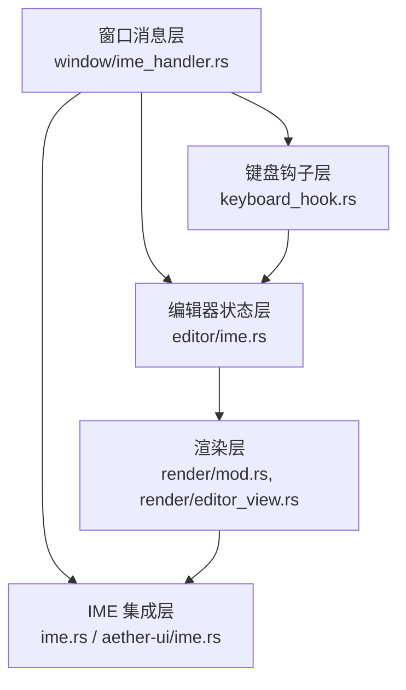
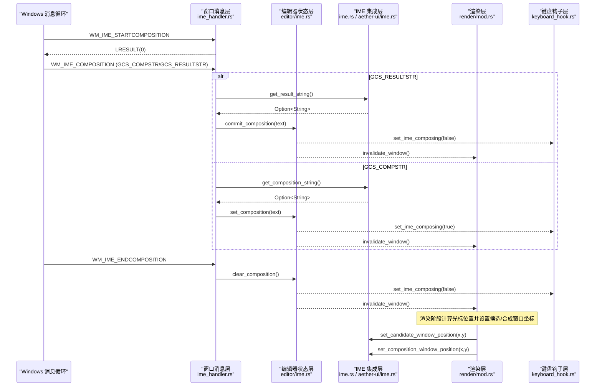
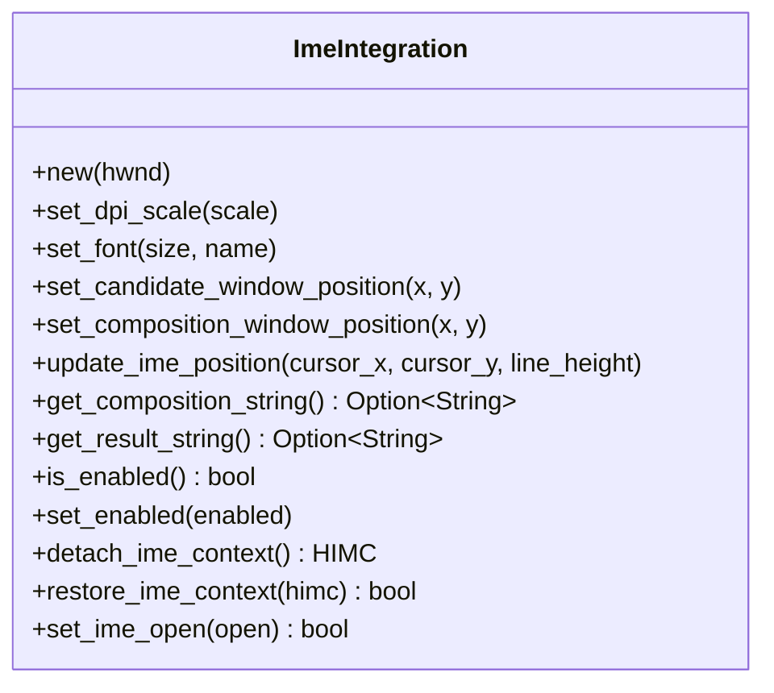
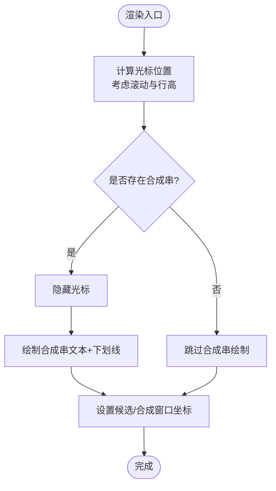
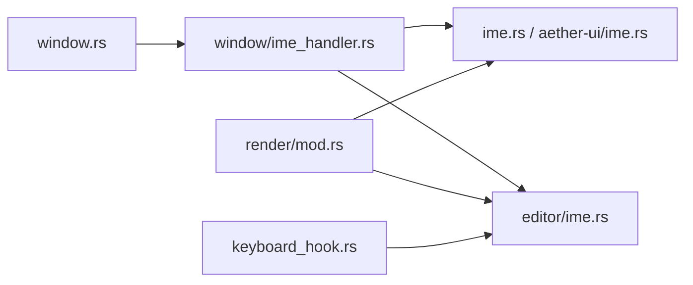

# IME 输入法支持

<cite>
**本文引用的文件**
- [crates/aether-win32/src/window/ime_handler.rs](file://crates/aether-win32/src/window/ime_handler.rs)
- [crates/aether-win32/src/ime.rs](file://crates/aether-win32/src/ime.rs)
- [crates/aether-ui/src/ime.rs](file://crates/aether-ui/src/ime.rs)
- [crates/aether-win32/src/editor/ime.rs](file://crates/aether-win32/src/editor/ime.rs)
- [crates/aether-win32/src/render/mod.rs](file://crates/aether-win32/src/render/mod.rs)
- [crates/aether-win32/src/render/editor_view.rs](file://crates/aether-win32/src/render/editor_view.rs)
- [crates/aether-win32/src/keyboard_hook.rs](file://crates/aether-win32/src/keyboard_hook.rs)
- [crates/aether-win32/src/window.rs](file://crates/aether-win32/src/window.rs)
</cite>

## 目录
1. [简介](#简介)
2. [项目结构](#项目结构)
3. [核心组件](#核心组件)
4. [架构总览](#架构总览)
5. [详细组件分析](#详细组件分析)
6. [依赖关系分析](#依赖关系分析)
7. [性能考虑](#性能考虑)
8. [故障排查指南](#故障排查指南)
9. [结论](#结论)
10. [附录：关键流程与示例路径](#附录：关键流程与示例路径)

## 简介
本文件为牧羊人编辑器的 Windows IME（输入法）支持系统提供完整技术文档。内容覆盖：
- Windows IMM32 API 集成、IME 状态管理、候选窗口渲染与合成文本处理
- 中文、日文、韩文等复杂输入法的激活检测、预编辑显示、确认提交插入
- IME 与编辑器文本缓冲区的同步机制、光标位置跟踪、多行文本中的 IME 支持
- 调试与常见问题定位方法

## 项目结构
IME 相关能力分布在以下模块：
- 窗口消息层：接收并分发 WM_IME_* 消息，驱动编辑器状态更新
- IME 集成层：封装 IMM32 调用，负责候选/合成窗口定位、字符串读取、开关控制
- 编辑器状态层：维护合成串、提交逻辑、多焦点区域（编辑器、终端、AI 面板、侧边栏等）
- 渲染层：根据光标与合成串计算候选/合成窗口坐标，按 DPI 缩放
- 键盘钩子层：在系统级拦截 Backspace/Delete/方向键，保证终端聚焦时的正确行为

图表来源
- [crates/aether-win32/src/window/ime_handler.rs:1-132](file://crates/aether-win32/src/window/ime_handler.rs#L1-L132)
- [crates/aether-win32/src/editor/ime.rs:1-271](file://crates/aether-win32/src/editor/ime.rs#L1-L271)
- [crates/aether-win32/src/ime.rs:1-255](file://crates/aether-win32/src/ime.rs#L1-L255)
- [crates/aether-ui/src/ime.rs:1-255](file://crates/aether-ui/src/ime.rs#L1-L255)
- [crates/aether-win32/src/render/mod.rs:1272-1391](file://crates/aether-win32/src/render/mod.rs#L1272-L1391)
- [crates/aether-win32/src/render/editor_view.rs:486-510](file://crates/aether-win32/src/render/editor_view.rs#L486-L510)
- [crates/aether-win32/src/keyboard_hook.rs:140-315](file://crates/aether-win32/src/keyboard_hook.rs#L140-L315)

章节来源
- [crates/aether-win32/src/window.rs:73-128](file://crates/aether-win32/src/window.rs#L73-L128)

## 核心组件
- 窗口消息处理器：处理 WM_IME_STARTCOMPOSITION、WM_IME_COMPOSITION、WM_IME_ENDCOMPOSITION、WM_IME_CHAR
- IME 集成器：封装 ImmGetContext/ImmSetCandidateWindow/ImmSetCompositionWindow/ImmGetCompositionStringW/ImmSetOpenStatus 等调用，支持 DPI 缩放与字体信息
- 编辑器 IME 状态：维护 composition（预编辑串）、commit（提交）、clear（清除），并路由到不同焦点区域（编辑器、终端、AI 面板、搜索框、侧边栏）
- 渲染同步：在绘制阶段计算光标位置并设置候选/合成窗口坐标，确保跟随光标移动
- 键盘钩子：在系统级拦截特定按键，保证终端聚焦时 Backspace/Delete/方向键直达终端

章节来源
- [crates/aether-win32/src/window/ime_handler.rs:1-132](file://crates/aether-win32/src/window/ime_handler.rs#L1-L132)
- [crates/aether-win32/src/ime.rs:1-255](file://crates/aether-win32/src/ime.rs#L1-L255)
- [crates/aether-ui/src/ime.rs:1-255](file://crates/aether-ui/src/ime.rs#L1-L255)
- [crates/aether-win32/src/editor/ime.rs:1-271](file://crates/aether-win32/src/editor/ime.rs#L1-L271)
- [crates/aether-win32/src/render/mod.rs:1272-1391](file://crates/aether-win32/src/render/mod.rs#L1272-L1391)
- [crates/aether-win32/src/render/editor_view.rs:486-510](file://crates/aether-win32/src/render/editor_view.rs#L486-L510)
- [crates/aether-win32/src/keyboard_hook.rs:140-315](file://crates/aether-win32/src/keyboard_hook.rs#L140-L315)

## 架构总览
IME 工作流从 Windows 消息开始，经窗口消息层进入编辑器状态层，再由渲染层同步候选/合成窗口位置；键盘钩子在系统级保障终端交互一致性。

图表来源
- [crates/aether-win32/src/window/ime_handler.rs:21-118](file://crates/aether-win32/src/window/ime_handler.rs#L21-L118)
- [crates/aether-win32/src/editor/ime.rs:109-190](file://crates/aether-win32/src/editor/ime.rs#L109-L190)
- [crates/aether-win32/src/ime.rs:63-134](file://crates/aether-win32/src/ime.rs#L63-L134)
- [crates/aether-ui/src/ime.rs:63-134](file://crates/aether-ui/src/ime.rs#L63-L134)
- [crates/aether-win32/src/render/mod.rs:1272-1391](file://crates/aether-win32/src/render/mod.rs#L1272-L1391)
- [crates/aether-win32/src/keyboard_hook.rs:146-207](file://crates/aether-win32/src/keyboard_hook.rs#L146-L207)

## 详细组件分析

### 窗口消息层：IME 消息处理
- 处理 WM_IME_STARTCOMPOSITION：仅初始化位置，实际位置由渲染阶段同步
- 处理 WM_IME_COMPOSITION：
  - 优先处理结果串（GCS_RESULTSTR）：读取已提交文本，调用 commit_composition 插入缓冲区，并提前重置合成标志，避免“提交后无法立即删除”的问题
  - 处理合成串（GCS_COMPSTR）：读取预编辑文本，调用 set_composition 更新显示，不修改缓冲区；同时通知键盘钩子进入合成期
  - 无标志或取消：调用 clear_composition 清理显示
- 处理 WM_IME_ENDCOMPOSITION：清理合成串，必要时关闭 IME（终端聚焦场景），通知键盘钩子退出合成期
- 处理 WM_IME_CHAR：阻止 TranslateMessage 产生重复的 WM_CHAR，避免中文字符重复插入

章节来源
- [crates/aether-win32/src/window/ime_handler.rs:9-132](file://crates/aether-win32/src/window/ime_handler.rs#L9-L132)

### IME 集成层：IMM32 封装与 DPI 适配
- 使用 ImmGetContext/ImmReleaseContext 获取和释放 HIMC
- 使用 ImmSetCandidateWindow/ImmSetCompositionWindow 设置候选/合成窗口位置，支持 DPI 缩放
- 使用 ImmGetCompositionStringW 读取合成串/结果串（UTF-16），通过两次调用获取长度并填充缓冲区
- 提供 set_ime_open 切换 IME 开启/关闭状态，用于终端聚焦时避免系统级拦截 Backspace
- 提供 detach/restore 上下文以彻底旁路 IME（可选高级用法）

图表来源
- [crates/aether-win32/src/ime.rs:25-243](file://crates/aether-win32/src/ime.rs#L25-L243)
- [crates/aether-ui/src/ime.rs:25-243](file://crates/aether-ui/src/ime.rs#L25-L243)

章节来源
- [crates/aether-win32/src/ime.rs:1-255](file://crates/aether-win32/src/ime.rs#L1-L255)
- [crates/aether-ui/src/ime.rs:1-255](file://crates/aether-ui/src/ime.rs#L1-L255)

### 编辑器状态层：合成串与提交逻辑
- set_composition：将预编辑串写入当前焦点区域（编辑器、AI 面板、侧边栏、新标签页搜索框等），并标记脏区域触发重绘
- commit_composition：先清除合成串，再根据焦点区域将提交文本插入对应位置；终端聚焦且运行时，将字符送入 ConPTY；必要时关闭 IME 以便立即删除
- clear_composition：清理当前焦点区域的合成串，并标记脏区域
- 多语言兼容说明：该方案对中文/日文/韩文/印地/泰文/阿拉伯等标准 IME 通用，因为字符输入走 WM_IME_COMPOSITION + GCS_RESULTSTR，而方向键/删除键在终端聚焦时被低层钩子拦截

章节来源
- [crates/aether-win32/src/editor/ime.rs:45-271](file://crates/aether-win32/src/editor/ime.rs#L45-L271)

### 渲染层：候选/合成窗口定位与多行支持
- 在渲染末尾统一同步 IME 位置：根据光标所在行、滚动偏移、行高计算物理像素坐标，调用 set_composition_window_position/set_candidate_window_position
- 针对 AI 面板、浏览器地址栏、编辑器默认区域分别计算候选/合成窗口坐标
- 编辑器视图渲染时，若存在合成串则隐藏光标并绘制合成串文本及下划线，确保视觉一致

图表来源
- [crates/aether-win32/src/render/mod.rs:1272-1391](file://crates/aether-win32/src/render/mod.rs#L1272-L1391)
- [crates/aether-win32/src/render/editor_view.rs:486-510](file://crates/aether-win32/src/render/editor_view.rs#L486-L510)

章节来源
- [crates/aether-win32/src/render/mod.rs:1272-1391](file://crates/aether-win32/src/render/mod.rs#L1272-L1391)
- [crates/aether-win32/src/render/editor_view.rs:486-510](file://crates/aether-win32/src/render/editor_view.rs#L486-L510)

### 键盘钩子层：终端聚焦时的按键路由
- 在主线程设置 TERMINAL_FOCUSED_FLAG 与 IME_COMPOSING_FLAG
- 低层键盘钩子仅在“前台窗口为本窗口”且“终端聚焦且未合成”时拦截 Backspace/Delete/方向键，并转发到主窗口的专用消息（WM_TERMINAL_BACKSPACE/DELETE/ARROW）
- 这些消息处理器将相应字节序列发送到 ConPTY，保证终端交互一致性

章节来源
- [crates/aether-win32/src/keyboard_hook.rs:140-315](file://crates/aether-win32/src/keyboard_hook.rs#L140-L315)

## 依赖关系分析
- 窗口消息层依赖编辑器状态层进行数据变更，依赖 IME 集成层进行系统调用
- 渲染层依赖 IME 集成层进行窗口定位，依赖编辑器状态层获取光标与合成串
- 键盘钩子层与编辑器状态层通过原子标志通信，保证跨线程安全
- 全局状态通过 thread_local EDITOR_STATE 在当前窗口消息处理上下文中同步

图表来源
- [crates/aether-win32/src/window.rs:73-128](file://crates/aether-win32/src/window.rs#L73-L128)
- [crates/aether-win32/src/window/ime_handler.rs:1-132](file://crates/aether-win32/src/window/ime_handler.rs#L1-L132)
- [crates/aether-win32/src/editor/ime.rs:1-271](file://crates/aether-win32/src/editor/ime.rs#L1-L271)
- [crates/aether-win32/src/ime.rs:1-255](file://crates/aether-win32/src/ime.rs#L1-L255)
- [crates/aether-ui/src/ime.rs:1-255](file://crates/aether-ui/src/ime.rs#L1-L255)
- [crates/aether-win32/src/render/mod.rs:1272-1391](file://crates/aether-win32/src/render/mod.rs#L1272-L1391)
- [crates/aether-win32/src/keyboard_hook.rs:140-315](file://crates/aether-win32/src/keyboard_hook.rs#L140-L315)

章节来源
- [crates/aether-win32/src/window.rs:73-128](file://crates/aether-win32/src/window.rs#L73-L128)

## 性能考虑
- 渲染合并：通过 invalidate_window 标记脏区域，由 WM_PAINT 统一合并重绘，避免重复渲染
- 坐标计算：在渲染阶段集中计算 IME 窗口坐标，减少频繁系统调用
- 字符串读取：ImmGetCompositionStringW 采用两次调用策略（先长度后填充），避免过大分配
- 键盘钩子：仅在必要条件下拦截按键，降低系统开销

[本节为通用指导，无需具体文件引用]

## 故障排查指南
- 现象：提交汉字后无法立即删除
  - 原因：结果串提交后仍保持合成期标志
  - 解决：在 GCS_RESULTSTR 分支提前调用 set_ime_composing(false)，使 Backspace 立即可达终端
  - 参考路径：[crates/aether-win32/src/window/ime_handler.rs:34-53](file://crates/aether-win32/src/window/ime_handler.rs#L34-L53)

- 现象：终端聚焦时 Backspace 无效
  - 原因：IME 处于“已开启未合成”状态系统级拦截按键
  - 解决：终端聚焦时调用 set_ime_open(false)，并通过键盘钩子拦截方向键/删除键
  - 参考路径：[crates/aether-win32/src/editor/ime.rs:85-107](file://crates/aether-win32/src/editor/ime.rs#L85-L107), [crates/aether-win32/src/keyboard_hook.rs:196-244](file://crates/aether-win32/src/keyboard_hook.rs#L196-L244)

- 现象：候选窗口位置不正确或遮挡光标
  - 原因：坐标未按 DPI 缩放或未在渲染阶段同步
  - 解决：确保 set_dpi_scale 正确设置，并在渲染末尾调用 update_ime_position 或分别设置候选/合成窗口坐标
  - 参考路径：[crates/aether-win32/src/ime.rs:51-134](file://crates/aether-win32/src/ime.rs#L51-L134), [crates/aether-win32/src/render/mod.rs:1272-1391](file://crates/aether-win32/src/render/mod.rs#L1272-L1391)

- 现象：中文字符重复插入
  - 原因：TranslateMessage 从 WM_IME_CHAR 产生 WM_CHAR
  - 解决：在 WM_IME_CHAR 返回 LRESULT(0) 阻止重复处理
  - 参考路径：[crates/aether-win32/src/window/ime_handler.rs:120-131](file://crates/aether-win32/src/window/ime_handler.rs#L120-L131)

- 现象：AI 面板/侧边栏/搜索框的 IME 显示异常
  - 原因：合成串未写入对应焦点区域或未标记脏区域
  - 解决：在 set_composition/clear_composition/commit_composition 中区分焦点区域并标记对应脏区
  - 参考路径：[crates/aether-win32/src/editor/ime.rs:45-225](file://crates/aether-win32/src/editor/ime.rs#L45-L225)

章节来源
- [crates/aether-win32/src/window/ime_handler.rs:34-131](file://crates/aether-win32/src/window/ime_handler.rs#L34-L131)
- [crates/aether-win32/src/editor/ime.rs:85-225](file://crates/aether-win32/src/editor/ime.rs#L85-L225)
- [crates/aether-win32/src/ime.rs:51-134](file://crates/aether-win32/src/ime.rs#L51-L134)
- [crates/aether-win32/src/render/mod.rs:1272-1391](file://crates/aether-win32/src/render/mod.rs#L1272-L1391)
- [crates/aether-win32/src/keyboard_hook.rs:196-244](file://crates/aether-win32/src/keyboard_hook.rs#L196-L244)

## 结论
本项目通过分层设计实现了稳健的 IME 支持：
- 窗口消息层准确解析 IME 生命周期事件
- IME 集成层封装系统调用并提供 DPI 适配
- 编辑器状态层实现多焦点区域的合成串管理与提交路由
- 渲染层确保候选/合成窗口始终跟随光标
- 键盘钩子层保障终端聚焦时的交互一致性
该方案对中文、日文、韩文等复杂输入法具备良好兼容性，并提供了清晰的调试与排错路径。

[本节为总结性内容，无需具体文件引用]

## 附录：关键流程与示例路径
- 输入法激活检测与预编辑显示
  - 入口：WM_IME_STARTCOMPOSITION → 渲染阶段设置候选/合成窗口坐标
  - 参考路径：[crates/aether-win32/src/window/ime_handler.rs:9-19](file://crates/aether-win32/src/window/ime_handler.rs#L9-L19), [crates/aether-win32/src/render/mod.rs:1272-1391](file://crates/aether-win32/src/render/mod.rs#L1272-L1391)

- 确认输入后的文本插入
  - 入口：WM_IME_COMPOSITION + GCS_RESULTSTR → get_result_string → commit_composition
  - 参考路径：[crates/aether-win32/src/window/ime_handler.rs:34-53](file://crates/aether-win32/src/window/ime_handler.rs#L34-L53), [crates/aether-win32/src/editor/ime.rs:109-190](file://crates/aether-win32/src/editor/ime.rs#L109-L190)

- 合成文本处理与多行支持
  - 入口：WM_IME_COMPOSITION + GCS_COMPSTR → get_composition_string → set_composition
  - 渲染：根据光标行与滚动计算坐标，绘制合成串与下划线
  - 参考路径：[crates/aether-win32/src/window/ime_handler.rs:56-83](file://crates/aether-win32/src/window/ime_handler.rs#L56-L83), [crates/aether-win32/src/render/editor_view.rs:486-510](file://crates/aether-win32/src/render/editor_view.rs#L486-L510)

- 候选窗口定位
  - 入口：渲染阶段计算光标位置 → set_candidate_window_position/set_composition_window_position
  - 参考路径：[crates/aether-win32/src/ime.rs:63-134](file://crates/aether-win32/src/ime.rs#L63-L134), [crates/aether-win32/src/render/mod.rs:1272-1391](file://crates/aether-win32/src/render/mod.rs#L1272-L1391)

- 输入法切换处理（终端聚焦）
  - 入口：set_terminal_ime_bypass → set_ime_open(false) + 键盘钩子拦截
  - 参考路径：[crates/aether-win32/src/editor/ime.rs:85-107](file://crates/aether-win32/src/editor/ime.rs#L85-L107), [crates/aether-win32/src/keyboard_hook.rs:196-244](file://crates/aether-win32/src/keyboard_hook.rs#L196-L244)