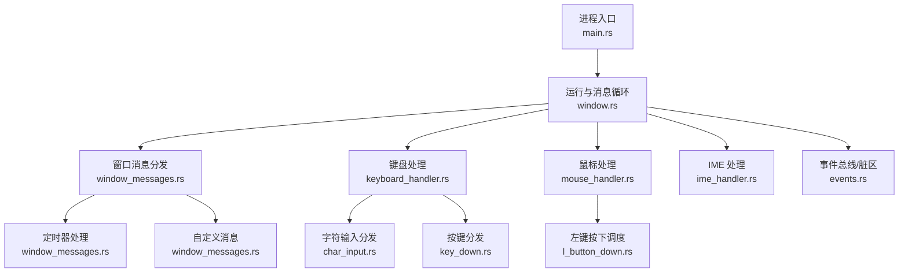
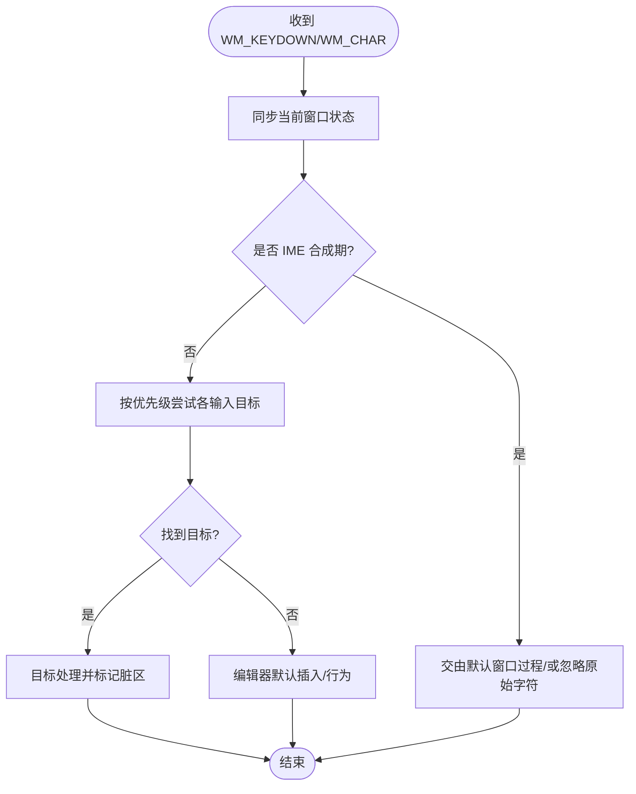
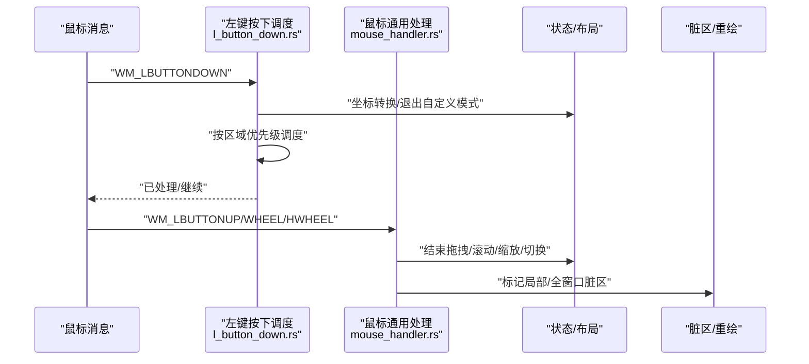
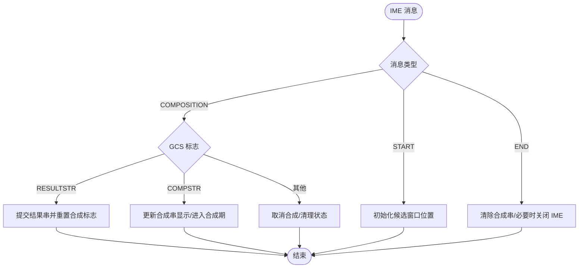
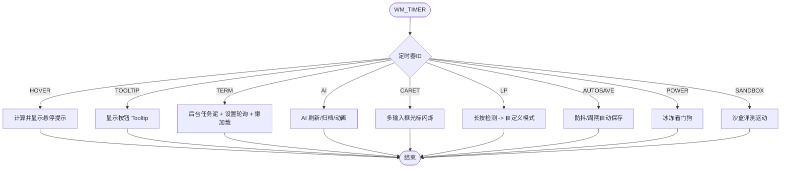
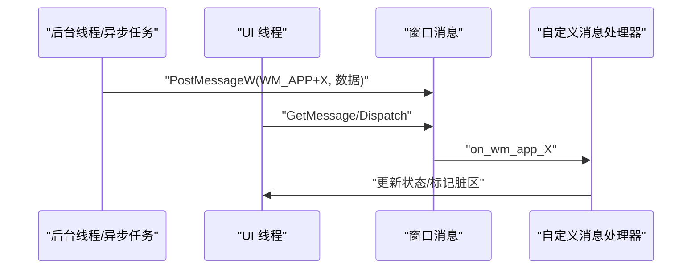
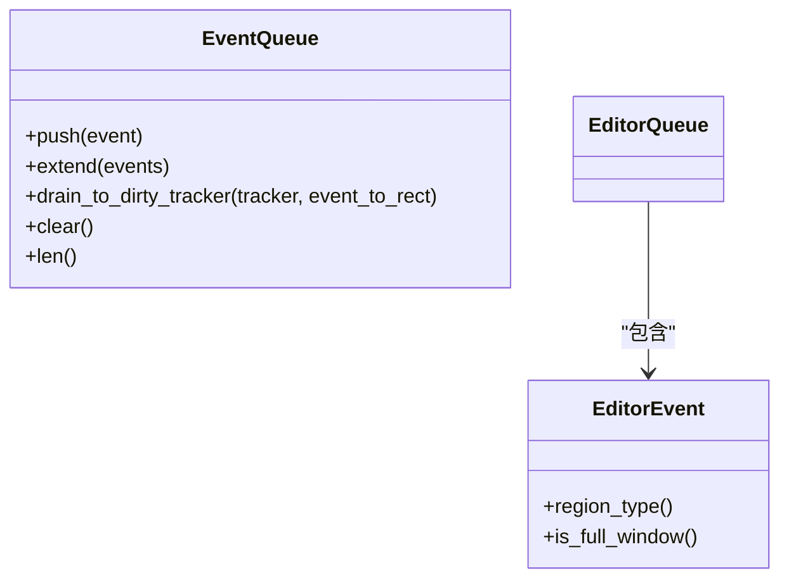
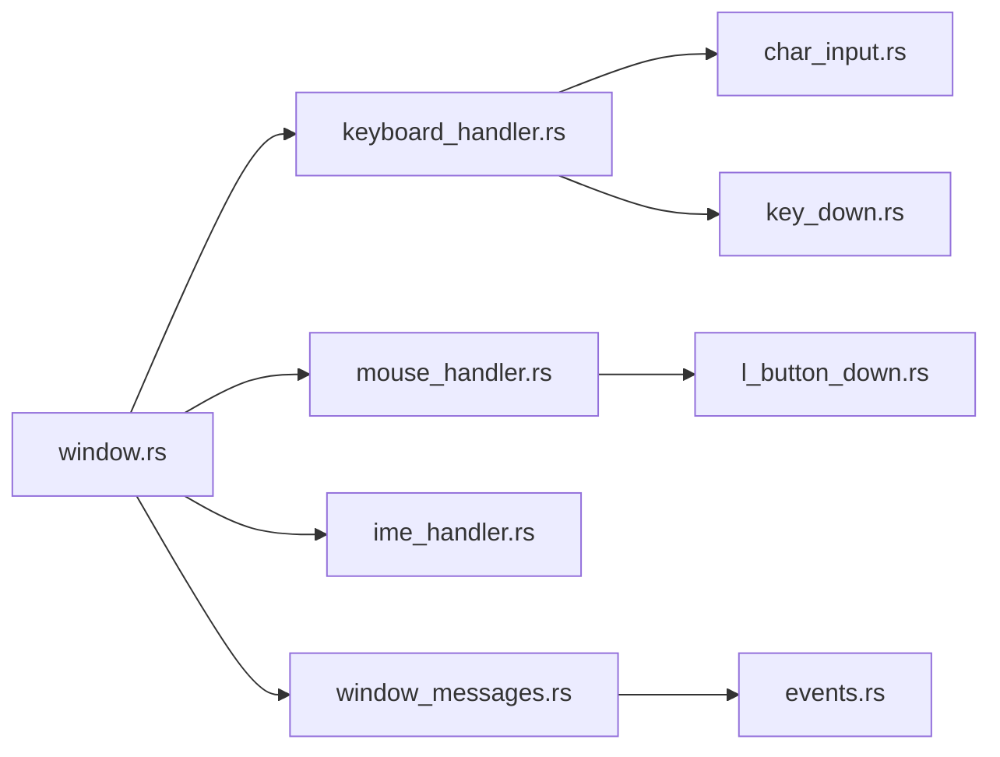

# 事件处理机制

<cite>
**本文引用的文件**
- [main.rs](file://crates/aether-win32/src/main.rs)
- [window.rs](file://crates/aether-win32/src/window.rs)
- [keyboard_handler.rs](file://crates/aether-win32/src/window/keyboard_handler.rs)
- [char_input.rs](file://crates/aether-win32/src/window/keyboard_handler/char_input.rs)
- [key_down.rs](file://crates/aether-win32/src/window/keyboard_handler/key_down.rs)
- [mouse_handler.rs](file://crates/aether-win32/src/window/mouse_handler.rs)
- [l_button_down.rs](file://crates/aether-win32/src/window/mouse_handler/l_button_down.rs)
- [ime_handler.rs](file://crates/aether-win32/src/window/ime_handler.rs)
- [window_messages.rs](file://crates/aether-win32/src/window/window_messages.rs)
- [events.rs](file://crates/aether-win32/src/events.rs)
</cite>

## 目录
1. [简介](#简介)
2. [项目结构](#项目结构)
3. [核心组件](#核心组件)
4. [架构总览](#架构总览)
5. [详细组件分析](#详细组件分析)
6. [依赖关系分析](#依赖关系分析)
7. [性能考量](#性能考量)
8. [故障排查指南](#故障排查指南)
9. [结论](#结论)
10. [附录](#附录)

## 简介
本文件面向牧羊人编辑器的 Windows 事件处理机制，系统性阐述 Win32 消息循环、窗口过程与消息分发、键盘与鼠标事件处理、IME 输入法支持、定时器管理、自定义消息路由、输入捕获/转换/分发流程（含快捷键、组合键、合成事件），并给出关键实现路径与图示。目标是帮助读者在不深入源码的情况下理解整体设计，同时为二次开发提供可定位的“代码片段路径”。

## 项目结构
- 入口与主循环：应用入口负责单实例控制与启动参数转发；主线程创建窗口后进入标准 Win32 消息循环。
- 窗口层：注册窗口类、设置 DPI、创建窗口、维护全局状态与定时器、统一失效重绘。
- 输入层：键盘（WM_KEYDOWN/WM_CHAR）、鼠标（WM_LBUTTONDOWN/WM_MOUSEWHEEL 等）按区域与优先级分发到具体处理器。
- IME 层：处理合成期与提交串，避免重复插入与按键冲突。
- 定时器层：集中处理悬停提示、终端刷新、AI 后台刷新、光标闪烁、自动保存、冰冻看门狗等。
- 事件总线：编辑器内部事件队列合并同类事件，驱动脏矩形追踪，减少重复渲染。



**图表来源**
- [main.rs:8-26](file://crates/aether-win32/src/main.rs#L8-L26)
- [window.rs:132-200](file://crates/aether-win32/src/window.rs#L132-L200)
- [window_messages.rs:21-59](file://crates/aether-win32/src/window/window_messages.rs#L21-L59)
- [keyboard_handler.rs:1-13](file://crates/aether-win32/src/window/keyboard_handler.rs#L1-L13)
- [mouse_handler.rs:1-15](file://crates/aether-win32/src/window/mouse_handler.rs#L1-L15)
- [events.rs:1-74](file://crates/aether-win32/src/events.rs#L1-L74)

**章节来源**
- [main.rs:8-26](file://crates/aether-win32/src/main.rs#L8-L26)
- [window.rs:132-200](file://crates/aether-win32/src/window.rs#L132-L200)

## 核心组件
- 消息循环与窗口过程：在 window.rs 中完成窗口类注册、DPI 感知、消息循环与统一失效重绘。
- 键盘事件：WM_KEYDOWN 由 key_down.rs 进行高优先级拦截（对话框/面板/菜单），Ctrl 快捷键走 key_down_ctrl，非 Ctrl 编辑器按键走 key_down_edit；WM_CHAR 由 char_input.rs 按优先级路由到各输入目标。
- 鼠标事件：mouse_handler.rs 汇总 WM_LBUTTONUP/DBLCLK/MOUSEWHEEL/HWHEEL 等；左键按下 l_button_down.rs 按区域优先级调度。
- IME：ime_handler.rs 处理合成开始/结束/合成串/提交串，避免重复插入与 Backspace 阻塞。
- 定时器：window_messages.rs 中的 on_timer 根据 ID 分派到具体任务（悬停、Tooltip、终端刷新、AI 刷新、光标闪烁、自动保存、冰冻看门狗、沙盒评测）。
- 自定义消息：window_messages.rs 中的 WM_APP+X 用于跨线程/异步回调（LSP 事件、文件夹扫描、SSH/Git 完成、更新检查、打开文件/文件夹等）。
- 事件总线：events.rs 定义 EditorEvent 与 EventQueue，合并同类事件并映射到脏区域类型，配合 DirtyRectTracker 减少重绘。

**章节来源**
- [window.rs:132-200](file://crates/aether-win32/src/window.rs#L132-L200)
- [keyboard_handler.rs:1-13](file://crates/aether-win32/src/window/keyboard_handler.rs#L1-L13)
- [char_input.rs:10-104](file://crates/aether-win32/src/window/keyboard_handler/char_input.rs#L10-L104)
- [key_down.rs:17-182](file://crates/aether-win32/src/window/keyboard_handler/key_down.rs#L17-L182)
- [mouse_handler.rs:23-406](file://crates/aether-win32/src/window/mouse_handler.rs#L23-L406)
- [l_button_down.rs:17-112](file://crates/aether-win32/src/window/mouse_handler/l_button_down.rs#L17-L112)
- [ime_handler.rs:9-132](file://crates/aether-win32/src/window/ime_handler.rs#L9-L132)
- [window_messages.rs:21-59](file://crates/aether-win32/src/window/window_messages.rs#L21-L59)
- [events.rs:1-186](file://crates/aether-win32/src/events.rs#L1-L186)

## 架构总览
下图展示从 Win32 消息到 UI 更新的端到端流程：消息循环 → 窗口过程 → 输入/定时器/自定义消息 → 状态变更 → 标记脏区 → WM_PAINT 统一渲染。

```mermaid
sequenceDiagram
participant OS as "Windows"
participant App as "应用进程"
participant Loop as "消息循环<br/>window.rs"
participant WndProc as "窗口过程"
participant Inp as "输入处理<br/>keyboard/mouse"
participant IME as "IME 处理"
participant Tmr as "定时器<br/>window_messages.rs"
participant Bus as "事件总线<br/>events.rs"
participant Render as "渲染(WM_PAINT)"
OS->>Loop : "GetMessage/Translate/Dispatch"
Loop->>WndProc : "分发消息"
alt 键盘
WndProc->>Inp : "WM_KEYDOWN/WM_CHAR"
Inp->>Bus : "产生 EditorEvent"
else 鼠标
WndProc->>Inp : "WM_LBUTTONDOWN/WHEEL"
Inp->>Bus : "产生 EditorEvent"
else IME
WndProc->>IME : "IME_* 消息"
IME->>Bus : "提交/合成串变更"
else 定时器
WndProc->>Tmr : "WM_TIMER"
Tmr->>Bus : "触发刷新/归档/动画等"
else 自定义消息
WndProc->>WndProc : "WM_APP+X 处理"
WndProc->>Bus : "状态变更"
end
Bus-->>Render : "标记脏区/全窗口"
Render-->>OS : "绘制客户区"
```

**图表来源**
- [window.rs:132-200](file://crates/aether-win32/src/window.rs#L132-L200)
- [window_messages.rs:21-59](file://crates/aether-win32/src/window/window_messages.rs#L21-L59)
- [events.rs:66-186](file://crates/aether-win32/src/events.rs#L66-L186)

## 详细组件分析

### 键盘事件处理（WM_KEYDOWN / WM_CHAR）
- 优先级与分流：
  - WM_KEYDOWN：先同步当前窗口状态，再依次尝试浏览器地址栏、空搜索框、文件树输入、上下文菜单、搜索面板、欢迎页导航、补全弹窗、设置字段、沙盒字段、SSH/克隆对话框、新建项目对话框、命令面板等；若 Ctrl 按下则进入快捷键分支；否则进入编辑器编辑分支。
  - WM_CHAR：组装 UTF-16 代理对，跳过 IME 合成期的原始字符，按优先级路由至各输入目标（浏览器地址栏、空搜索框、文件树输入、设置字段、沙盒字段、搜索面板、SSH/克隆对话框、新建项目、SSH 管理、命令面板、查找替换、终端、历史浮窗、AI 面板），最后回退到编辑器默认插入。
- 组合键与快捷键：
  - Alt+Left/Right 作为返回/前进占位实现。
  - Ctrl 快捷键集中在 Ctrl 分支处理（如文件操作、切换面板等）。
- 输入目标聚焦态：
  - 文件树输入、设置字段、沙盒字段、命令面板、查找替换、终端、AI 面板等均有独立处理函数，确保字符仅进入当前焦点目标。



**图表来源**
- [key_down.rs:17-182](file://crates/aether-win32/src/window/keyboard_handler/key_down.rs#L17-L182)
- [char_input.rs:10-104](file://crates/aether-win32/src/window/keyboard_handler/char_input.rs#L10-L104)

**章节来源**
- [key_down.rs:17-182](file://crates/aether-win32/src/window/keyboard_handler/key_down.rs#L17-L182)
- [char_input.rs:10-104](file://crates/aether-win32/src/window/keyboard_handler/char_input.rs#L10-L104)

### 鼠标事件处理（WM_LBUTTONDOWN / WM_LBUTTONUP / WM_MOUSEWHEEL / WM_MOUSEHWHEEL）
- 左键按下：按区域优先级调度（对话框、标题栏、用户菜单、资源管理器/文件节点/活动栏/标签上下文菜单、子菜单、历史浮窗、活动栏、面板调整、侧边栏、右侧面板、标签栏、查找面板、底部面板、设置页、沙盒页、欢迎页/编辑器）。
- 左键抬起：结束选择、面板拖拽、拐角手柄、侧边栏收起动画、文件拖拽完成、活动栏/菜单栏自定义模式持久化、标签拖拽重排或点击切换。
- 滚轮：
  - 垂直滚轮：图片缩放（Ctrl+滚轮）、标签栏横向滚动、Shift+滚轮横向滚动、底部终端滚动、历史浮窗滚动、右侧 AI 面板滚动、设置页滚动、沙盒页滚动、侧边栏/编辑器滚动。
  - 水平滚轮：仅在编辑器区域内响应。
- 双击：在编辑器内容区双击选词。



**图表来源**
- [l_button_down.rs:17-112](file://crates/aether-win32/src/window/mouse_handler/l_button_down.rs#L17-L112)
- [mouse_handler.rs:44-406](file://crates/aether-win32/src/window/mouse_handler.rs#L44-L406)

**章节来源**
- [l_button_down.rs:17-112](file://crates/aether-win32/src/window/mouse_handler/l_button_down.rs#L17-L112)
- [mouse_handler.rs:44-406](file://crates/aether-win32/src/window/mouse_handler.rs#L44-L406)

### IME 输入法支持
- 合成开始：仅初始化位置，返回已处理。
- 合成中：
  - 优先处理结果串（GCS_RESULTSTR）：提交文本并清空合成串，提前重置合成标志以允许 Backspace 立即生效。
  - 处理合成串（GCS_COMPSTR）：更新显示，不修改缓冲区；通知低层钩子进入合成期。
  - 无标志：视为取消合成，清除本地合成状态。
- 合成结束：清除合成串显示；若终端聚焦则关闭 IME，以便立即删除终端内容；通知低层钩子退出合成期。
- 阻止重复插入：WM_IME_CHAR 直接返回已处理，避免 TranslateMessage 生成 WM_CHAR 导致重复插入。



**图表来源**
- [ime_handler.rs:9-132](file://crates/aether-win32/src/window/ime_handler.rs#L9-L132)

**章节来源**
- [ime_handler.rs:9-132](file://crates/aether-win32/src/window/ime_handler.rs#L9-L132)

### 定时器管理机制
- 统一入口：on_timer 根据 wparam 定时器 ID 分派到具体任务。
- 主要任务：
  - 悬停提示防抖：延迟计算 tooltip 并定位。
  - Tooltip 延迟显示：活动栏/标题栏按钮悬停提示。
  - 终端刷新：周期执行后台任务泥与设置面板轮询，按需重绘。
  - AI 后台刷新：流式生成/测试连接期间周期性重绘，结束后自停。
  - 光标闪烁：多输入框/编辑器内容区光标闪烁，无活跃时停止。
  - 长按检测：达到阈值后进入活动栏/菜单栏自定义拖拽排序。
  - 自动保存：空闲防抖与周期兜底。
  - AI 归档：周期检查空闲会话并归档。
  - UI 动画：历史记录下拉面板展开/收起动画。
  - 冰冻看门狗：低频检查空闲时长，满足条件进入冻结态释放内存。
  - 沙盒评测：评测运行期间驱动流式消费/倒计时/任务推进，结束后停止。



**图表来源**
- [window_messages.rs:21-59](file://crates/aether-win32/src/window/window_messages.rs#L21-L59)
- [window_messages.rs:64-425](file://crates/aether-win32/src/window/window_messages.rs#L64-L425)

**章节来源**
- [window_messages.rs:21-59](file://crates/aether-win32/src/window/window_messages.rs#L21-L59)
- [window_messages.rs:64-425](file://crates/aether-win32/src/window/window_messages.rs#L64-L425)

### 自定义消息与异步回调
- 使用 WM_APP+X 将后台线程/异步任务结果投递到 UI 线程，避免阻塞与重入问题。
- 典型用途：
  - LSP 事件：诊断、补全、悬停结果等。
  - 文件夹扫描批次/子目录扫描完成。
  - SSH 连接完成、Git 克隆完成、远程列目录完成。
  - 更新检查完成：下载完成后弹窗询问是否更新。
  - 异步打开文件夹/文件/另存为：避免在 RefCell 借用期间弹模态对话框导致重入 panic。
  - 内置浏览器事件：WebView2 回调动作排队并在 UI 线程统一排空。



**图表来源**
- [window_messages.rs:426-708](file://crates/aether-win32/src/window/window_messages.rs#L426-L708)

**章节来源**
- [window_messages.rs:426-708](file://crates/aether-win32/src/window/window_messages.rs#L426-L708)

### 事件总线与脏区优化
- EditorEvent 枚举描述文本变化、光标移动、选择变化、滚动、标签页变化、侧边栏/右侧面板/底部面板/状态栏变化、窗口尺寸变化、查找替换面板变化、对话框可见性变化。
- EventQueue 收集一帧内的事件，合并同类事件（如连续滚动/光标移动/选择变化/文本变化行范围扩展），遇到全窗口事件则清空局部事件并标记全窗口。
- drain_to_dirty_tracker 将事件转换为脏矩形区域，结合 DirtyRectTracker 减少重复渲染。



**图表来源**
- [events.rs:1-186](file://crates/aether-win32/src/events.rs#L1-L186)

**章节来源**
- [events.rs:1-186](file://crates/aether-win32/src/events.rs#L1-L186)

## 依赖关系分析
- 模块耦合：
  - window.rs 作为中心，聚合 keyboard_handler、mouse_handler、ime_handler、window_messages、window_setup 等子模块。
  - keyboard_handler 与 mouse_handler 通过 EDITOR_STATE 访问共享状态，并通过 invalidate_window 触发重绘。
  - ime_handler 与 keyboard_hook 协作，控制合成期与按键拦截。
  - window_messages 依赖多个子系统（auto_save、power、dirty_rect、settings、terminal、browser、updater、dialogs）。
  - events.rs 与 dirty_rect 子系统协作，驱动最小化重绘。
- 外部依赖：
  - windows crate 提供 Win32 API 绑定。
  - aether_core、aether_lsp、aether_render 等提供编辑器核心能力与渲染。



**图表来源**
- [window.rs:13-29](file://crates/aether-win32/src/window.rs#L13-L29)
- [keyboard_handler.rs:1-13](file://crates/aether-win32/src/window/keyboard_handler.rs#L1-L13)
- [mouse_handler.rs:1-15](file://crates/aether-win32/src/window/mouse_handler.rs#L1-L15)
- [window_messages.rs:21-59](file://crates/aether-win32/src/window/window_messages.rs#L21-L59)
- [events.rs:1-74](file://crates/aether-win32/src/events.rs#L1-L74)

**章节来源**
- [window.rs:13-29](file://crates/aether-win32/src/window.rs#L13-L29)
- [keyboard_handler.rs:1-13](file://crates/aether-win32/src/window/keyboard_handler.rs#L1-L13)
- [mouse_handler.rs:1-15](file://crates/aether-win32/src/window/mouse_handler.rs#L1-L15)
- [window_messages.rs:21-59](file://crates/aether-win32/src/window/window_messages.rs#L21-L59)
- [events.rs:1-74](file://crates/aether-win32/src/events.rs#L1-L74)

## 性能考量
- 统一渲染：事件处理只标记脏区，实际渲染由 WM_PAINT 统一驱动，避免双重渲染与阻塞。
- 事件合并：EventQueue 合并连续滚动、光标移动、选择变化与文本变化行范围，减少无效重绘。
- 定时器解耦：终端刷新、AI 刷新、光标闪烁等通过独立定时器驱动，降低渲染路径 IO 阻塞。
- 局部脏区：多处使用 DirtyRectTracker 标记局部区域（标签栏、底部面板、侧边栏、编辑器内容等），提升滚动与输入流畅度。
- 冰冻态：最小化/长期空闲进入冻结态释放内存，后台任务转为无头泵保活，保证功能不中断且资源占用最小。

[本节为通用性能讨论，无需特定文件引用]

## 故障排查指南
- IME 相关：
  - 现象：提交汉字后无法立即删除终端内容。
  - 原因：合成期未正确重置导致 Backspace 被拦截。
  - 解决：在结果串提交后立即重置合成标志，并在合成结束时关闭 IME（终端聚焦场景）。
  - 参考路径：[ime_handler.rs:21-117](file://crates/aether-win32/src/window/ime_handler.rs#L21-L117)
- 重复插入：
  - 现象：中文输入字符被 WM_CHAR 重复插入。
  - 原因：未阻止 WM_IME_CHAR 生成 WM_CHAR。
  - 解决：在 WM_IME_CHAR 中直接返回已处理。
  - 参考路径：[ime_handler.rs:120-132](file://crates/aether-win32/src/window/ime_handler.rs#L120-L132)
- 重入 panic：
  - 现象：RefCell 借用期间弹出模态对话框导致重入 panic。
  - 原因：在 borrow_mut 期间调用可能泵消息的对话框。
  - 解决：将模态对话框调用移至自定义消息处理器中，避免重入。
  - 参考路径：[window_messages.rs:644-708](file://crates/aether-win32/src/window/window_messages.rs#L644-L708)
- 滚动卡顿：
  - 现象：滚轮滚动时全窗口重绘导致卡顿。
  - 原因：未使用局部脏区标记。
  - 解决：使用 DirtyRectTracker 标记局部区域（如底部面板、标签栏）。
  - 参考路径：[mouse_handler.rs:233-365](file://crates/aether-win32/src/window/mouse_handler.rs#L233-L365)

**章节来源**
- [ime_handler.rs:21-132](file://crates/aether-win32/src/window/ime_handler.rs#L21-L132)
- [window_messages.rs:644-708](file://crates/aether-win32/src/window/window_messages.rs#L644-L708)
- [mouse_handler.rs:233-365](file://crates/aether-win32/src/window/mouse_handler.rs#L233-L365)

## 结论
本项目采用清晰的 Win32 消息分层与模块化设计：窗口层负责消息循环与统一渲染，输入层按区域与优先级分发，IME 层正确处理合成期与提交串，定时器层解耦后台任务与渲染路径，事件总线合并同类事件并驱动最小化重绘。该架构在保证交互流畅性的同时，具备良好的可扩展性与可维护性。

[本节为总结性内容，无需特定文件引用]

## 附录
- 关键实现路径（示例）：
  - 键盘字符输入分发：[char_input.rs:10-104](file://crates/aether-win32/src/window/keyboard_handler/char_input.rs#L10-L104)
  - 按键优先级拦截与快捷键：[key_down.rs:17-182](file://crates/aether-win32/src/window/keyboard_handler/key_down.rs#L17-L182)
  - 鼠标左键区域调度：[l_button_down.rs:17-112](file://crates/aether-win32/src/window/mouse_handler/l_button_down.rs#L17-L112)
  - 滚轮与横向滚轮：[mouse_handler.rs:190-406](file://crates/aether-win32/src/window/mouse_handler.rs#L190-L406)
  - IME 合成与提交：[ime_handler.rs:21-132](file://crates/aether-win32/src/window/ime_handler.rs#L21-L132)
  - 定时器任务分派：[window_messages.rs:21-59](file://crates/aether-win32/src/window/window_messages.rs#L21-L59)
  - 自定义消息回调：[window_messages.rs:426-708](file://crates/aether-win32/src/window/window_messages.rs#L426-L708)
  - 事件总线与脏区：[events.rs:1-186](file://crates/aether-win32/src/events.rs#L1-L186)

[本节为索引性内容，无需特定文件引用]