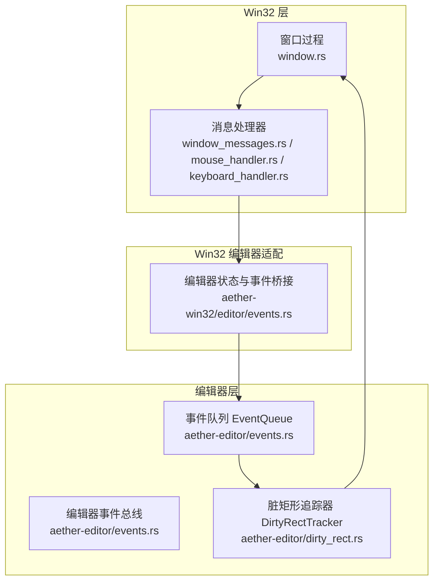
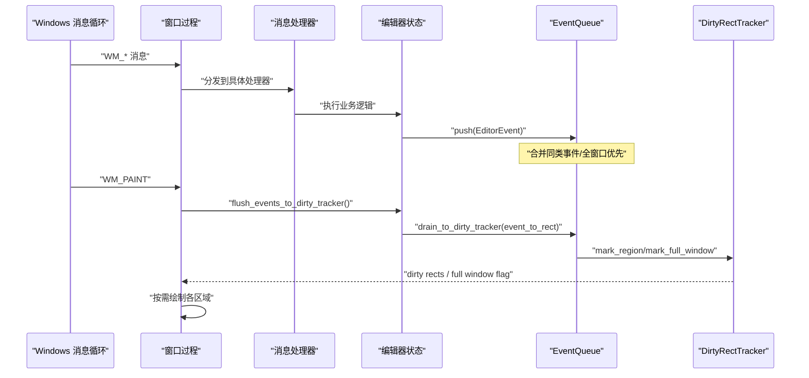
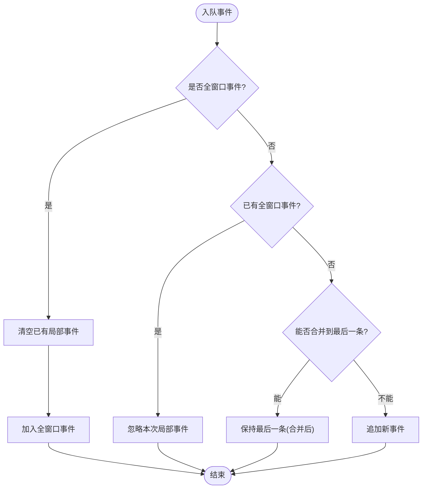
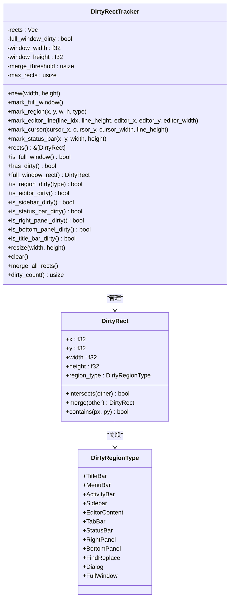
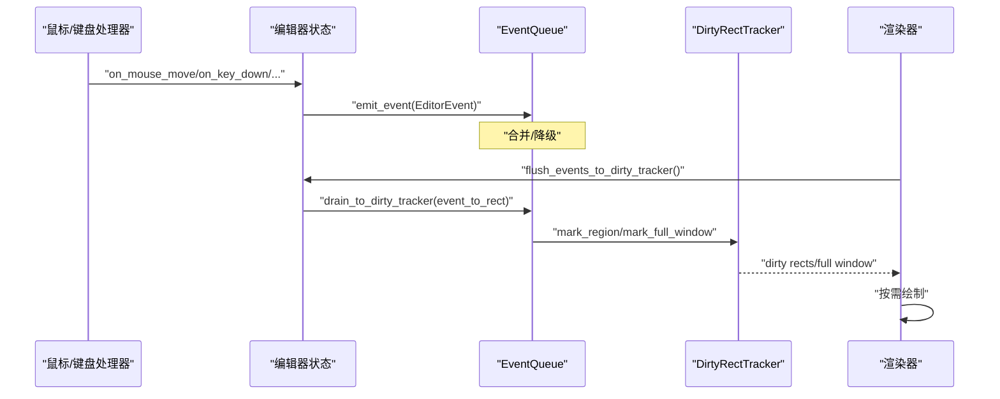
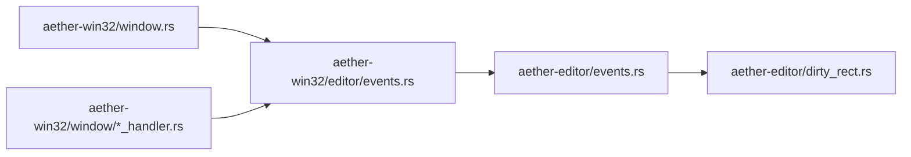

# 消息路由系统

<cite>
**本文引用的文件**
- [crates/aether-editor/src/events.rs](file://crates/aether-editor/src/events.rs)
- [crates/aether-editor/src/dirty_rect.rs](file://crates/aether-editor/src/dirty_rect.rs)
- [crates/aether-win32/src/editor/events.rs](file://crates/aether-win32/src/editor/events.rs)
- [crates/aether-win32/src/window/window_messages.rs](file://crates/aether-win32/src/window/window_messages.rs)
- [crates/aether-win32/src/window/mouse_handler.rs](file://crates/aether-win32/src/window/mouse_handler.rs)
- [crates/aether-win32/src/window/keyboard_handler.rs](file://crates/aether-win32/src/window/keyboard_handler.rs)
- [crates/aether-win32/src/window.rs](file://crates/aether-win32/src/window.rs)
</cite>

## 目录
1. [简介](#简介)
2. [项目结构](#项目结构)
3. [核心组件](#核心组件)
4. [架构总览](#架构总览)
5. [详细组件分析](#详细组件分析)
6. [依赖关系分析](#依赖关系分析)
7. [性能考量](#性能考量)
8. [故障排查指南](#故障排查指南)
9. [结论](#结论)
10. [附录：扩展事件与自定义处理](#附录：扩展事件与自定义处理)

## 简介
本文件面向牧羊人编辑器的“消息路由系统”，聚焦以下目标：
- 解释 EditorEvent 事件模型设计、EventQueue 事件队列机制，以及与脏矩形追踪器的集成方式。
- 梳理从原始 Win32 消息到编辑器高层事件的转换流程，包括事件合并优化策略与批量处理机制。
- 说明不同类型事件的优先级、全窗口重绘与局部更新的协调、事件到渲染区域的映射关系。
- 提供关键功能的代码片段路径（不直接粘贴源码），并指导如何添加新的事件类型和自定义事件处理逻辑。

## 项目结构
消息路由系统横跨两个 crate：
- aether-editor：定义通用事件模型与队列、脏矩形追踪器抽象。
- aether-win32：实现 Win32 消息到编辑器事件的桥接、区域映射、以及驱动 WM_PAINT 统一渲染。

图表来源
- [crates/aether-win32/src/window.rs:84-93](file://crates/aether-win32/src/window.rs#L84-L93)
- [crates/aether-win32/src/window/window_messages.rs:22-60](file://crates/aether-win32/src/window/window_messages.rs#L22-L60)
- [crates/aether-win32/src/editor/events.rs:122-221](file://crates/aether-win32/src/editor/events.rs#L122-L221)
- [crates/aether-editor/src/events.rs:66-186](file://crates/aether-editor/src/events.rs#L66-L186)
- [crates/aether-editor/src/dirty_rect.rs:87-366](file://crates/aether-editor/src/dirty_rect.rs#L87-L366)

章节来源
- [crates/aether-win32/src/window.rs:84-93](file://crates/aether-win32/src/window.rs#L84-L93)
- [crates/aether-win32/src/window/window_messages.rs:22-60](file://crates/aether-win32/src/window/window_messages.rs#L22-L60)
- [crates/aether-win32/src/editor/events.rs:122-221](file://crates/aether-win32/src/editor/events.rs#L122-L221)
- [crates/aether-editor/src/events.rs:66-186](file://crates/aether-editor/src/events.rs#L66-L186)
- [crates/aether-editor/src/dirty_rect.rs:87-366](file://crates/aether-editor/src/dirty_rect.rs#L87-L366)

## 核心组件
- EditorEvent：编辑器高层事件枚举，描述文本变化、光标移动、选择变化、滚动、标签页切换、侧边栏/右侧面板/底部面板/状态栏变化、窗口尺寸/DPI变化、查找替换面板状态变化、对话框可见性变化等。每个事件可映射到对应的脏区域类型，并标识是否需要全窗口重绘。
- EventQueue：一帧内的事件收集与合并队列。支持同类事件合并（如连续滚动、光标移动、选择变化、文本变更行范围合并）、全窗口事件优先降级（一旦标记全窗口，后续局部事件忽略）、批量入队与 drain 到脏矩形追踪器。
- DirtyRectTracker：脏矩形追踪器，记录需要重绘的矩形区域，按区域类型区分（编辑器内容、侧边栏、状态栏等）。支持重叠矩形合并、数量阈值触发合并或降级为全窗口重绘、区域级 dirty 判断、清理与 resize 更新。

章节来源
- [crates/aether-editor/src/events.rs:9-64](file://crates/aether-editor/src/events.rs#L9-L64)
- [crates/aether-editor/src/events.rs:66-186](file://crates/aether-editor/src/events.rs#L66-L186)
- [crates/aether-editor/src/dirty_rect.rs:8-366](file://crates/aether-editor/src/dirty_rect.rs#L8-L366)

## 架构总览
消息路由系统的整体流程如下：
- Win32 消息进入窗口过程，分派到具体消息处理器（鼠标、键盘、定时器、WM_APP 等）。
- 消息处理器调用编辑器状态方法，将底层输入转换为高层 EditorEvent 并推入 EventQueue。
- 在渲染前（WM_PAINT），编辑器状态将 EventQueue 中的事件 drain 到 DirtyRectTracker，通过回调将事件映射为具体矩形区域。
- DirtyRectTracker 根据区域类型与重叠合并策略生成最终的重绘指令；渲染阶段按需绘制对应区域。

图表来源
- [crates/aether-win32/src/window.rs:84-93](file://crates/aether-win32/src/window.rs#L84-L93)
- [crates/aether-win32/src/editor/events.rs:122-221](file://crates/aether-win32/src/editor/events.rs#L122-L221)
- [crates/aether-editor/src/events.rs:145-165](file://crates/aether-editor/src/events.rs#L145-L165)
- [crates/aether-editor/src/dirty_rect.rs:114-162](file://crates/aether-editor/src/dirty_rect.rs#L114-L162)

## 详细组件分析

### EditorEvent 事件模型
- 事件类型覆盖编辑器核心交互面：文本、光标、选择、滚动、标签页、侧边栏、右侧面板、底部面板、状态栏、窗口尺寸/DPI、查找替换面板、对话框可见性。
- 每个事件映射到 DirtyRegionType，便于脏矩形追踪器按区域分类管理。
- 全窗口事件（WindowResized、DialogVisibilityChanged）具有最高优先级，会清空当前帧的局部事件，确保一次完整重绘。

章节来源
- [crates/aether-editor/src/events.rs:9-64](file://crates/aether-editor/src/events.rs#L9-L64)

### EventQueue 事件队列机制
- 入队策略：
  - 若事件为全窗口类型，则标记 has_full_window，清空已有局部事件并仅保留该全窗口事件。
  - 若已存在全窗口事件，则忽略后续局部事件。
  - 否则尝试与最后一个事件合并（Scrolled、CursorMoved、SelectionChanged 直接合并；TextChanged 合并行范围）。
- 批量入队 extend：逐条 push，复用合并与降级逻辑。
- drain_to_dirty_tracker：遍历事件，全窗口事件直接标记 tracker 全窗口；其他事件通过 event_to_rect 回调转换为矩形并标记区域类型。

图表来源
- [crates/aether-editor/src/events.rs:84-143](file://crates/aether-editor/src/events.rs#L84-L143)

章节来源
- [crates/aether-editor/src/events.rs:66-186](file://crates/aether-editor/src/events.rs#L66-L186)

### 脏矩形追踪器集成
- 区域类型：标题栏、菜单栏、活动栏、侧边栏、编辑器内容区、标签栏、状态栏、右侧面板、底部面板、查找替换面板、对话框、全窗口。
- 合并策略：同类型且相交的矩形会被合并；当矩形数量超过阈值时触发 merge_all_rects；超过最大数量则降级为全窗口重绘。
- 便捷方法：mark_editor_line、mark_cursor、mark_status_bar 等用于快速标记常见区域。
- 查询接口：is_full_window、has_dirty、is_editor_dirty、is_sidebar_dirty、is_status_bar_dirty、is_right_panel_dirty、is_bottom_panel_dirty、is_title_bar_dirty。

图表来源
- [crates/aether-editor/src/dirty_rect.rs:8-366](file://crates/aether-editor/src/dirty_rect.rs#L8-L366)

章节来源
- [crates/aether-editor/src/dirty_rect.rs:8-366](file://crates/aether-editor/src/dirty_rect.rs#L8-L366)

### 事件生命周期：从 Win32 消息到高层事件
- 输入事件（鼠标/键盘/定时器/WM_APP）进入消息处理器，调用编辑器状态方法完成业务逻辑。
- 编辑器状态通过 emit_event 将高层 EditorEvent 推入 EventQueue。
- 渲染阶段（WM_PAINT）调用 flush_events_to_dirty_tracker，将事件转换为具体矩形并应用到 DirtyRectTracker。
- 渲染器依据 DirtyRectTracker 的状态决定绘制范围（局部或全窗口）。

图表来源
- [crates/aether-win32/src/editor/events.rs:122-221](file://crates/aether-win32/src/editor/events.rs#L122-L221)
- [crates/aether-editor/src/events.rs:145-165](file://crates/aether-editor/src/events.rs#L145-L165)
- [crates/aether-editor/src/dirty_rect.rs:114-162](file://crates/aether-editor/src/dirty_rect.rs#L114-L162)

章节来源
- [crates/aether-win32/src/editor/events.rs:122-221](file://crates/aether-win32/src/editor/events.rs#L122-L221)
- [crates/aether-editor/src/events.rs:145-165](file://crates/aether-editor/src/events.rs#L145-L165)
- [crates/aether-editor/src/dirty_rect.rs:114-162](file://crates/aether-editor/src/dirty_rect.rs#L114-L162)

### 事件合并优化策略与批量处理
- 合并规则：
  - Scrolled、CursorMoved、SelectionChanged：连续同类事件合并为一次。
  - TextChanged：合并 start_line/end_line 范围，减少重复重绘。
- 批量入队 extend：适合一次性推送多个事件，内部仍遵循合并与降级策略。
- 全窗口优先：一旦出现 WindowResized 或 DialogVisibilityChanged，清空并忽略后续局部事件，保证一致性。

章节来源
- [crates/aether-editor/src/events.rs:84-143](file://crates/aether-editor/src/events.rs#L84-L143)

### 事件到渲染区域的映射关系
- 在 flush_events_to_dirty_tracker 中，通过 event_to_rect 回调将事件映射为具体矩形：
  - TextChanged/SelectionChanged/Scrolled：映射到编辑器内容区域。
  - CursorMoved：计算光标 x/y 坐标（基于字符列与行高），标记光标所在窄条区域。
  - SidebarChanged/RightPanelChanged/BottomPanelChanged：映射到对应面板区域（需检查宽度/高度有效性）。
  - StatusBarChanged：映射到状态栏区域。
  - WindowResized/DialogVisibilityChanged：由内部处理为全窗口重绘。
  - TabChanged/FindReplaceChanged：由调用方显式标记（此处返回 None）。

章节来源
- [crates/aether-win32/src/editor/events.rs:122-221](file://crates/aether-win32/src/editor/events.rs#L122-L221)

### 全窗口重绘与局部更新的协调
- 全窗口事件优先级高于局部事件，会在 EventQueue 中清空并忽略后续局部事件。
- DirtyRectTracker 在全窗口标记下忽略局部 mark_region 调用，避免冗余绘制。
- 当局部矩形数量过多时，tracker 自动合并或降级为全窗口重绘，保障性能。

章节来源
- [crates/aether-editor/src/events.rs:84-107](file://crates/aether-editor/src/events.rs#L84-L107)
- [crates/aether-editor/src/dirty_rect.rs:114-162](file://crates/aether-editor/src/dirty_rect.rs#L114-L162)

## 依赖关系分析
- aether-editor/events.rs 依赖 aether-editor/dirty_rect.rs 的区域类型与追踪器接口。
- aether-win32/editor/events.rs 依赖 aether-editor 的事件与队列，并在 Win32 层进行区域映射。
- aether-win32/window.rs 提供 invalidate_window 统一触发 WM_PAINT，避免双重渲染。
- 消息处理器（mouse_handler、keyboard_handler、window_messages）通过编辑器状态间接影响 EventQueue 与 DirtyRectTracker。

图表来源
- [crates/aether-editor/src/events.rs:1-8](file://crates/aether-editor/src/events.rs#L1-L8)
- [crates/aether-win32/src/editor/events.rs:1-5](file://crates/aether-win32/src/editor/events.rs#L1-L5)
- [crates/aether-win32/src/window.rs:84-93](file://crates/aether-win32/src/window.rs#L84-L93)

章节来源
- [crates/aether-editor/src/events.rs:1-8](file://crates/aether-editor/src/events.rs#L1-L8)
- [crates/aether-win32/src/editor/events.rs:1-5](file://crates/aether-win32/src/editor/events.rs#L1-L5)
- [crates/aether-win32/src/window.rs:84-93](file://crates/aether-win32/src/window.rs#L84-L93)

## 性能考量
- 事件合并：减少重复绘制，尤其在高频输入（滚动、光标移动、选择变化）场景。
- 全窗口降级：防止大量局部矩形导致渲染开销过大。
- 区域类型隔离：不同 UI 区域独立 dirty 判断，避免无关重绘。
- 统一渲染入口：通过 invalidate_window 触发 WM_PAINT，Windows 自动合并多次失效，避免双重渲染。
- 大文件与 GPU 高亮：编辑器缓存与视口优先策略降低词法分析开销（见编辑器状态重建缓存逻辑）。

[本节为通用性能讨论，不直接分析具体文件]

## 故障排查指南
- 无重绘问题：
  - 检查是否在事件处理后调用了 invalidate_window。
  - 确认 EventQueue 未因全窗口事件被清空而丢失必要局部事件。
  - 验证 event_to_rect 回调是否正确返回矩形。
- 闪烁或残影：
  - 检查光标移动事件是否准确标记了光标区域。
  - 确认 DirtyRectTracker 的合并逻辑是否合理（相邻但不相交不应合并）。
- 性能下降：
  - 观察 tracker.rects().len() 是否过大，必要时调整 merge_threshold/max_rects。
  - 检查是否有不必要的频繁事件推送（如重复 SelectionChanged）。

章节来源
- [crates/aether-win32/src/window.rs:84-93](file://crates/aether-win32/src/window.rs#L84-L93)
- [crates/aether-editor/src/dirty_rect.rs:114-162](file://crates/aether-editor/src/dirty_rect.rs#L114-L162)
- [crates/aether-win32/src/editor/events.rs:122-221](file://crates/aether-win32/src/editor/events.rs#L122-L221)

## 结论
牧羊人编辑器的消息路由系统通过分层设计与批处理优化，实现了从 Win32 消息到高层事件的高效转换与渲染控制。EventQueue 负责事件合并与优先级管理，DirtyRectTracker 负责区域级重绘决策，二者协同确保局部更新与全窗口重绘的平衡。该架构具备良好的可扩展性，便于新增事件类型与自定义处理逻辑。

[本节为总结，不直接分析具体文件]

## 附录：扩展事件与自定义处理
- 添加新事件类型：
  - 在 EditorEvent 枚举中添加新变体，并实现 region_type 映射到合适的 DirtyRegionType。
  - 如需全窗口重绘，实现 is_full_window 返回 true。
- 自定义事件处理逻辑：
  - 在 flush_events_to_dirty_tracker 的 event_to_rect 回调中为新事件返回具体矩形。
  - 在消息处理器中调用 emit_event 推送新事件。
- 示例参考路径：
  - 事件定义与合并逻辑：[crates/aether-editor/src/events.rs:9-143](file://crates/aether-editor/src/events.rs#L9-L143)
  - 区域映射与批量处理：[crates/aether-win32/src/editor/events.rs:122-221](file://crates/aether-win32/src/editor/events.rs#L122-L221)
  - 脏矩形追踪器接口：[crates/aether-editor/src/dirty_rect.rs:114-162](file://crates/aether-editor/src/dirty_rect.rs#L114-L162)

章节来源
- [crates/aether-editor/src/events.rs:9-143](file://crates/aether-editor/src/events.rs#L9-L143)
- [crates/aether-win32/src/editor/events.rs:122-221](file://crates/aether-win32/src/editor/events.rs#L122-L221)
- [crates/aether-editor/src/dirty_rect.rs:114-162](file://crates/aether-editor/src/dirty_rect.rs#L114-L162)