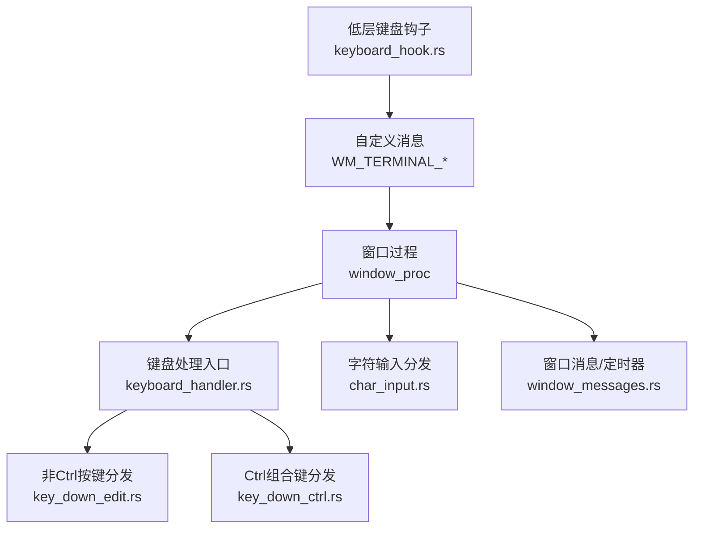
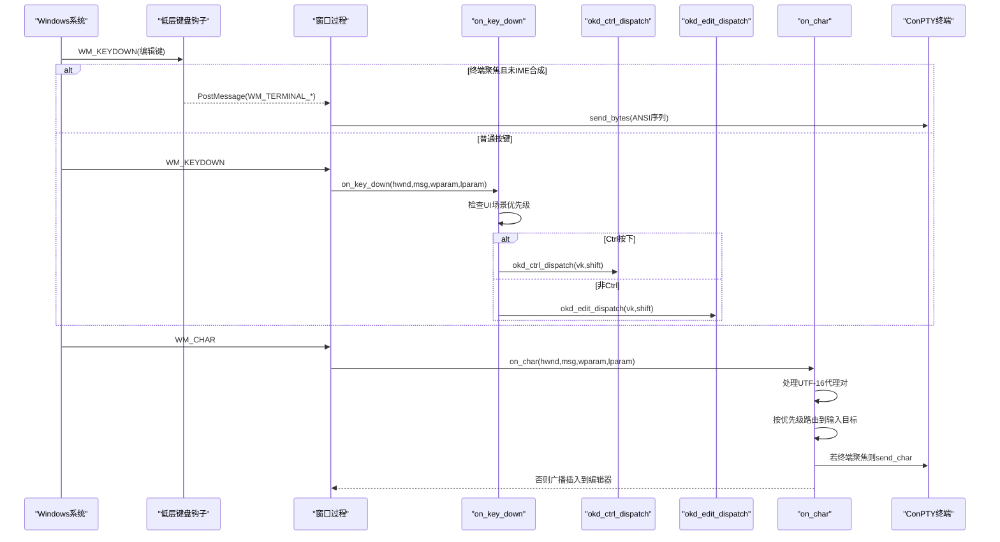
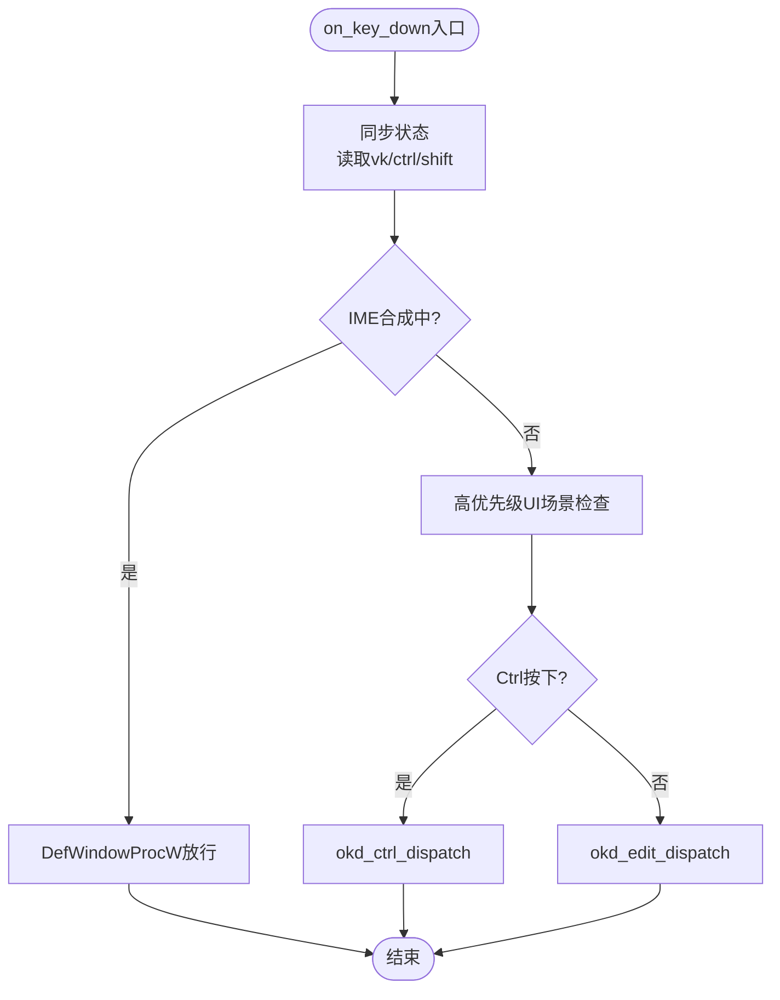
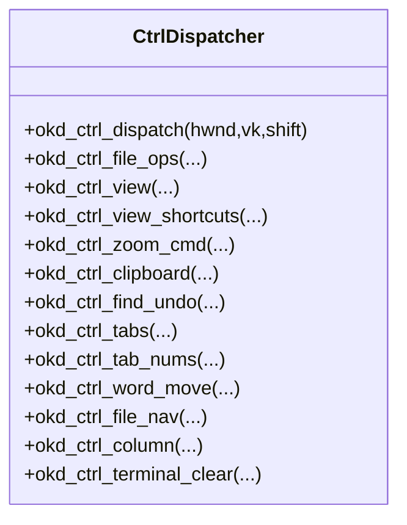
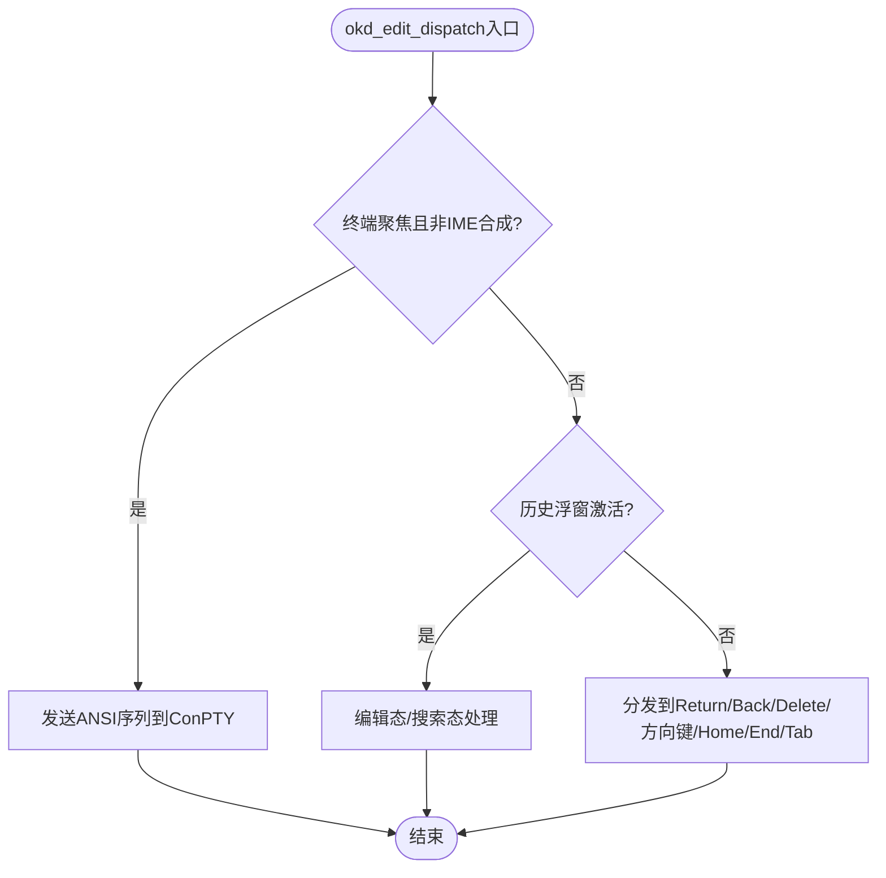
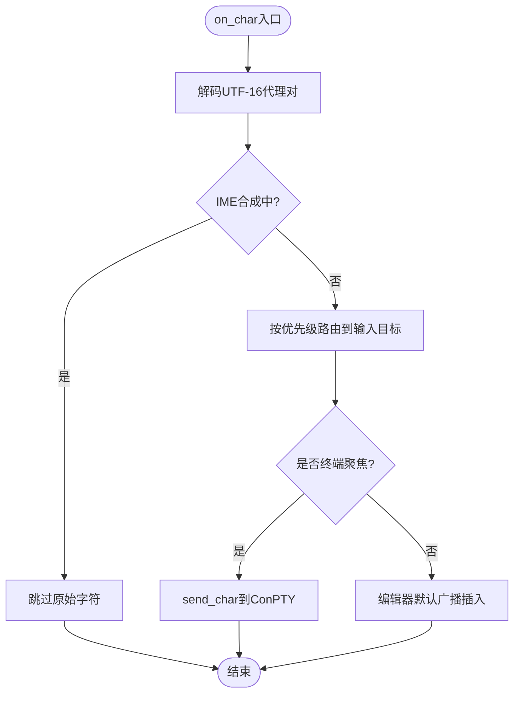
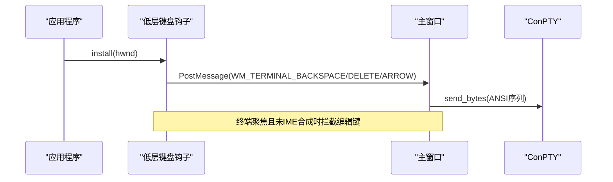
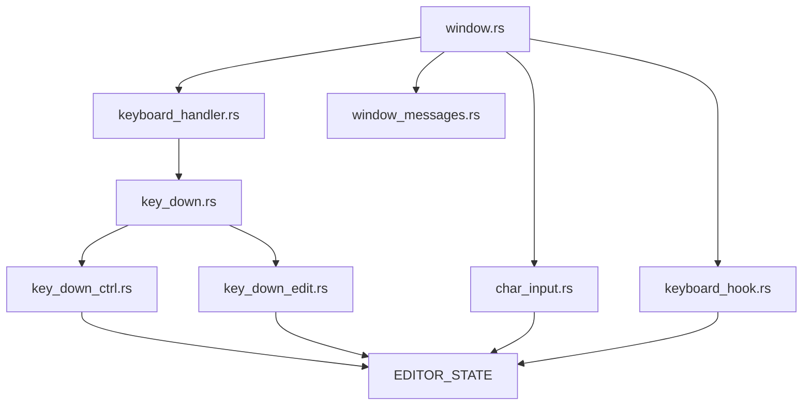

# 键盘事件处理

<cite>
**本文引用的文件**
- [window.rs](file://crates/aether-win32/src/window.rs)
- [keyboard_handler.rs](file://crates/aether-win32/src/window/keyboard_handler.rs)
- [key_down.rs](file://crates/aether-win32/src/window/keyboard_handler/key_down.rs)
- [key_down_ctrl.rs](file://crates/aether-win32/src/window/keyboard_handler/key_down_ctrl.rs)
- [key_down_edit.rs](file://crates/aether-win32/src/window/keyboard_handler/key_down_edit.rs)
- [char_input.rs](file://crates/aether-win32/src/window/keyboard_handler/char_input.rs)
- [keyboard_hook.rs](file://crates/aether-win32/src/keyboard_hook.rs)
- [window_messages.rs](file://crates/aether-win32/src/window/window_messages.rs)
</cite>

## 目录
1. [简介](#简介)
2. [项目结构](#项目结构)
3. [核心组件](#核心组件)
4. [架构总览](#架构总览)
5. [详细组件分析](#详细组件分析)
6. [依赖关系分析](#依赖关系分析)
7. [性能考量](#性能考量)
8. [故障排查指南](#故障排查指南)
9. [结论](#结论)
10. [附录：扩展快捷键与自定义行为](#附录：扩展快捷键与自定义行为)

## 简介
本文件系统性梳理牧羊人编辑器在 Win32 平台上的键盘事件处理机制，覆盖从系统级键盘钩子到窗口消息分发、按键状态管理、组合键检测、快捷键绑定、编辑模式下的特殊键处理，以及字符输入的统一分发流程。重点解释 Ctrl+字母组合键的处理路径、IME 合成期的特殊处理、终端聚焦时的按键直通策略，并给出可扩展的快捷键绑定方式与自定义键盘行为的方法。

## 项目结构
键盘相关代码集中在 aether-win32 窗体模块中，采用“入口统一、职责拆分”的组织方式：
- 窗口过程 window_proc 负责接收 WM_KEYDOWN/WM_CHAR 等消息，并路由到对应处理器。
- keyboard_handler 模块将 WM_KEYDOWN 和 WM_CHAR 处理拆分为多个子模块，按优先级与场景进行分发。
- keyboard_hook 模块通过 WH_KEYBOARD_LL 低层键盘钩子拦截特定编辑键（Backspace/Delete/方向键），在终端聚焦时直接发送到 ConPTY。
- window_messages 模块集中处理定时器、异步消息等辅助逻辑，配合键盘事件完成刷新与状态更新。

图表来源
- [window.rs:355-427](file://crates/aether-win32/src/window.rs#L355-L427)
- [keyboard_handler.rs:1-13](file://crates/aether-win32/src/window/keyboard_handler.rs#L1-L13)
- [key_down.rs:17-182](file://crates/aether-win32/src/window/keyboard_handler/key_down.rs#L17-L182)
- [key_down_ctrl.rs:14-28](file://crates/aether-win32/src/window/keyboard_handler/key_down_ctrl.rs#L14-L28)
- [key_down_edit.rs:14-50](file://crates/aether-win32/src/window/keyboard_handler/key_down_edit.rs#L14-L50)
- [char_input.rs:10-104](file://crates/aether-win32/src/window/keyboard_handler/char_input.rs#L10-L104)
- [keyboard_hook.rs:151-245](file://crates/aether-win32/src/keyboard_hook.rs#L151-L245)
- [window_messages.rs:21-59](file://crates/aether-win32/src/window/window_messages.rs#L21-L59)

章节来源
- [window.rs:355-427](file://crates/aether-win32/src/window.rs#L355-L427)
- [keyboard_handler.rs:1-13](file://crates/aether-win32/src/window/keyboard_handler.rs#L1-L13)

## 核心组件
- 窗口过程 window_proc：统一入口，维护用户输入活跃标记，并将 WM_KEYDOWN/WM_CHAR 分派到键盘处理模块；同时处理低层钩子投递的自定义消息。
- 键盘分发器 key_down.rs：提取 vk、ctrl、shift 状态，按优先级处理浏览器地址栏、搜索面板、上下文菜单、欢迎页、补全弹窗、设置字段、SSH/克隆对话框、命令面板等，再进入 Ctrl 或编辑按键分支。
- Ctrl 组合键 key_down_ctrl.rs：实现 Ctrl+ 系列快捷键（文件操作、视图切换、缩放、剪贴板、查找/撤销、标签页导航、词级移动、行注释等）。
- 编辑按键 key_down_edit.rs：处理 Return/Back/Delete/F3/Esc/方向键/Home/End/PageUp/Down/Tab，并在终端聚焦时将编辑键转换为 ANSI 序列发送至 ConPTY。
- 字符输入 char_input.rs：处理 WM_CHAR，支持 UTF-16 代理对，按优先级将可打印字符路由到各输入目标（浏览器地址栏、搜索框、设置字段、SSH/克隆对话框、命令面板、查找替换、终端、历史浮窗、AI 面板、编辑器默认）。
- 低层键盘钩子 keyboard_hook.rs：安装 WH_KEYBOARD_LL，在 IME 系统级拦截之前捕获 Backspace/Delete/方向键，仅在终端聚焦且未处于 IME 合成期时抑制原事件并通过 PostMessageW 发送自定义消息至主窗口。
- 窗口消息 window_messages.rs：定时器驱动后台任务、AI 流刷新、终端输出刷新、光标闪烁等，配合键盘事件触发局部重绘与状态更新。

章节来源
- [window.rs:355-427](file://crates/aether-win32/src/window.rs#L355-L427)
- [key_down.rs:17-182](file://crates/aether-win32/src/window/keyboard_handler/key_down.rs#L17-L182)
- [key_down_ctrl.rs:14-28](file://crates/aether-win32/src/window/keyboard_handler/key_down_ctrl.rs#L14-L28)
- [key_down_edit.rs:14-50](file://crates/aether-win32/src/window/keyboard_handler/key_down_edit.rs#L14-L50)
- [char_input.rs:10-104](file://crates/aether-win32/src/window/keyboard_handler/char_input.rs#L10-L104)
- [keyboard_hook.rs:151-245](file://crates/aether-win32/src/keyboard_hook.rs#L151-L245)
- [window_messages.rs:21-59](file://crates/aether-win32/src/window/window_messages.rs#L21-L59)

## 架构总览
键盘事件生命周期从系统消息到最终命令执行的关键路径如下：
- 系统级：WH_KEYBOARD_LL 钩子在 IME 拦截前捕获编辑键（终端聚焦时），PostMessageW 发送自定义消息到主窗口。
- 窗口过程：window_proc 接收 WM_KEYDOWN/WM_CHAR，调用 get_and_set_state 同步当前窗口状态，然后分发到键盘处理模块。
- 分发器：key_down.rs 先处理高优先级 UI 场景（搜索面板、上下文菜单、设置字段等），再根据 ctrl 标志分流到 key_down_ctrl.rs 或 key_down_edit.rs。
- 编辑器命令：key_down_edit.rs 将编辑键映射为编辑器动作（插入换行、删除、移动光标、接受内联补全等）；key_down_ctrl.rs 将 Ctrl+ 组合键映射为全局命令（打开文件、切换视图、缩放、查找/撤销、标签页导航等）。
- 字符输入：char_input.rs 解析 UTF-16 代理对，按优先级将字符路由到各输入目标，最终落到编辑器默认广播插入。
- 渲染刷新：invalidate_window 标记脏区域，由 WM_PAINT 统一渲染；定时器驱动后台任务与局部刷新。

图表来源
- [keyboard_hook.rs:151-245](file://crates/aether-win32/src/keyboard_hook.rs#L151-L245)
- [window.rs:355-427](file://crates/aether-win32/src/window.rs#L355-L427)
- [key_down.rs:17-182](file://crates/aether-win32/src/window/keyboard_handler/key_down.rs#L17-L182)
- [key_down_ctrl.rs:14-28](file://crates/aether-win32/src/window/keyboard_handler/key_down_ctrl.rs#L14-L28)
- [key_down_edit.rs:14-50](file://crates/aether-win32/src/window/keyboard_handler/key_down_edit.rs#L14-L50)
- [char_input.rs:10-104](file://crates/aether-win32/src/window/keyboard_handler/char_input.rs#L10-L104)

## 详细组件分析

### WM_KEYDOWN 处理流程与优先级
- 入口函数 on_key_down 首先同步线程本地状态，读取 vk、ctrl、shift 状态。
- IME 合成期间直接交给默认窗口过程，避免阻断 IME 的 Backspace/字母/方向键更新合成串。
- 高优先级 UI 场景依次尝试：浏览器地址栏、空白搜索、文件树输入、各类上下文菜单、Escape 退出自定义模式、搜索面板、欢迎页导航、补全弹窗导航、设置字段、沙盒字段、SSH/克隆对话框、命令面板。
- 若 Ctrl 按下且文件树输入激活，吞掉所有 Ctrl 快捷键防止误响应；否则进入 Ctrl 组合键分发。
- Alt+Left/Right 触发返回/前进导航（占位实现）。
- F2 在文件树选中节点时触发重命名；Delete 在选中节点时删除（移至回收站）。
- 文件树输入激活时吞掉非 Ctrl 编辑器按键，字符输入由 WM_CHAR 处理。
- AI 面板输入框聚焦时处理方向键、Home/End、Delete。
- 最后进入编辑按键分发 okd_edit_dispatch。

图表来源
- [key_down.rs:17-182](file://crates/aether-win32/src/window/keyboard_handler/key_down.rs#L17-L182)

章节来源
- [key_down.rs:17-182](file://crates/aether-win32/src/window/keyboard_handler/key_down.rs#L17-L182)

### Ctrl+ 组合键处理
- okd_ctrl_dispatch 按逻辑分组调用：文件操作、视图切换、视图快捷、缩放、剪贴板、查找/撤销、标签页、数字跳转、词级移动、文件首末/添加光标/行注释、终端清屏等。
- 典型快捷键：
  - Ctrl+O/K/S/N：打开文件/文件夹、保存、新建项目。
  - Ctrl+Space：触发 LSP 补全请求。
  - Ctrl+B/P/`：切换侧栏、命令面板、底部终端面板。
  - Ctrl+,/J/Shift+E：设置、底部面板、资源管理器视图。
  - Ctrl+=/-/0/G：字体缩放、图片缩放、命令面板前缀。
  - Ctrl+C/X/V/A：复制/剪切/粘贴/全选（终端聚焦时 Ctrl+C 中断进程）。
  - Ctrl+F/H/Z/Y：查找/替换/撤销/重做（撤销优先回退最近删除）。
  - Ctrl+Tab/W/F4/T：标签页切换/关闭/恢复。
  - Ctrl+1-9：跳转到指定标签页。
  - Ctrl+Left/Right：词级移动（含 Shift 选择）。
  - Ctrl+Home/End/D/OEM_2：文件首末/添加下一个相同单词光标/行注释。
  - Ctrl+L：终端聚焦时清屏（发送 Form Feed）。

图表来源
- [key_down_ctrl.rs:14-28](file://crates/aether-win32/src/window/keyboard_handler/key_down_ctrl.rs#L14-L28)
- [key_down_ctrl.rs:56-137](file://crates/aether-win32/src/window/keyboard_handler/key_down_ctrl.rs#L56-L137)
- [key_down_ctrl.rs:139-214](file://crates/aether-win32/src/window/keyboard_handler/key_down_ctrl.rs#L139-L214)
- [key_down_ctrl.rs:216-288](file://crates/aether-win32/src/window/keyboard_handler/key_down_ctrl.rs#L216-L288)
- [key_down_ctrl.rs:290-381](file://crates/aether-win32/src/window/keyboard_handler/key_down_ctrl.rs#L290-L381)
- [key_down_ctrl.rs:383-495](file://crates/aether-win32/src/window/keyboard_handler/key_down_ctrl.rs#L383-L495)
- [key_down_ctrl.rs:497-596](file://crates/aether-win32/src/window/keyboard_handler/key_down_ctrl.rs#L497-L596)
- [key_down_ctrl.rs:598-713](file://crates/aether-win32/src/window/keyboard_handler/key_down_ctrl.rs#L598-L713)
- [key_down_ctrl.rs:715-800](file://crates/aether-win32/src/window/keyboard_handler/key_down_ctrl.rs#L715-L800)

章节来源
- [key_down_ctrl.rs:14-28](file://crates/aether-win32/src/window/keyboard_handler/key_down_ctrl.rs#L14-L28)
- [key_down_ctrl.rs:56-800](file://crates/aether-win32/src/window/keyboard_handler/key_down_ctrl.rs#L56-L800)

### 非 Ctrl 编辑按键处理
- okd_edit_dispatch 首先判断终端聚焦与 IME 合成状态：终端聚焦且非 IME 合成时，将编辑键转换为 ANSI 序列发送至 ConPTY。
- 历史浮窗优先处理编辑态/搜索态的编辑键（Return/Back/Delete/Esc/方向键/Home/End）。
- 分发到具体处理：Return、Back、Delete/F3/Esc、左右/上下移动、Home/End/PageUp/Down、Tab。
- 终端按键处理：Enter/Backspace/Delete/Tab/方向键/Home/End 均转换为相应方法调用，并标脏底部面板区域以局部重绘。
- 历史浮窗：编辑态提交重命名、搜索态回车恢复首个匹配会话；Esc 失焦或关闭浮窗；Backspace 删除；方向键移动光标。
- 编辑器默认：Return 在有选中文本时删除，否则广播插入换行；Backspace 在有选中文本时删除，否则广播删除字符；Delete 删除选区或向前删除；方向键移动光标并支持 Shift 选择；Home/End 智能 Home（已在首个非空白位置时跳到行首）；PageUp/PageDown 翻页；Tab 在查找面板切换焦点或在编辑器接受内联补全/插入制表符。

图表来源
- [key_down_edit.rs:14-50](file://crates/aether-win32/src/window/keyboard_handler/key_down_edit.rs#L14-L50)
- [key_down_edit.rs:52-173](file://crates/aether-win32/src/window/keyboard_handler/key_down_edit.rs#L52-L173)
- [key_down_edit.rs:175-352](file://crates/aether-win32/src/window/keyboard_handler/key_down_edit.rs#L175-L352)
- [key_down_edit.rs:359-440](file://crates/aether-win32/src/window/keyboard_handler/key_down_edit.rs#L359-L440)
- [key_down_edit.rs:442-511](file://crates/aether-win32/src/window/keyboard_handler/key_down_edit.rs#L442-L511)
- [key_down_edit.rs:513-553](file://crates/aether-win32/src/window/keyboard_handler/key_down_edit.rs#L513-L553)
- [key_down_edit.rs:555-791](file://crates/aether-win32/src/window/keyboard_handler/key_down_edit.rs#L555-L791)

章节来源
- [key_down_edit.rs:14-50](file://crates/aether-win32/src/window/keyboard_handler/key_down_edit.rs#L14-L50)
- [key_down_edit.rs:52-791](file://crates/aether-win32/src/window/keyboard_handler/key_down_edit.rs#L52-L791)

### WM_CHAR 字符输入统一处理
- on_char 首先同步状态，解析 wparam 为字符码点，处理 UTF-16 代理对（高代理暂存，低代理组合完整码点）。
- IME 合成期间跳过原始字符分发，避免重复插入；但 AI/设置/命令面板等自定义输入框依赖 WM_CHAR 接收字符。
- 按优先级依次尝试各输入目标：浏览器地址栏、空白搜索、文件树输入、设置字段、沙盒字段、搜索面板、SSH/克隆对话框、新建项目、SSH 管理、命令面板、查找替换、终端、历史浮窗、AI 面板、编辑器默认。
- 终端聚焦时直接将字符发送到 ConPTY，并标脏底部面板区域局部重绘。
- 编辑器默认：Markdown 预览模式下忽略字符输入；否则广播插入字符到所有光标。

图表来源
- [char_input.rs:10-104](file://crates/aether-win32/src/window/keyboard_handler/char_input.rs#L10-L104)
- [char_input.rs:106-137](file://crates/aether-win32/src/window/keyboard_handler/char_input.rs#L106-L137)
- [char_input.rs:139-179](file://crates/aether-win32/src/window/keyboard_handler/char_input.rs#L139-L179)
- [char_input.rs:181-200](file://crates/aether-win32/src/window/keyboard_handler/char_input.rs#L181-L200)
- [char_input.rs:202-242](file://crates/aether-win32/src/window/keyboard_handler/char_input.rs#L202-L242)
- [char_input.rs:244-269](file://crates/aether-win32/src/window/keyboard_handler/char_input.rs#L244-L269)
- [char_input.rs:271-304](file://crates/aether-win32/src/window/keyboard_handler/char_input.rs#L271-L304)
- [char_input.rs:306-325](file://crates/aether-win32/src/window/keyboard_handler/char_input.rs#L306-L325)
- [char_input.rs:327-371](file://crates/aether-win32/src/window/keyboard_handler/char_input.rs#L327-L371)
- [char_input.rs:373-403](file://crates/aether-win32/src/window/keyboard_handler/char_input.rs#L373-L403)
- [char_input.rs:405-443](file://crates/aether-win32/src/window/keyboard_handler/char_input.rs#L405-L443)
- [char_input.rs:445-488](file://crates/aether-win32/src/window/keyboard_handler/char_input.rs#L445-L488)
- [char_input.rs:490-528](file://crates/aether-win32/src/window/keyboard_handler/char_input.rs#L490-L528)

章节来源
- [char_input.rs:10-104](file://crates/aether-win32/src/window/keyboard_handler/char_input.rs#L10-L104)
- [char_input.rs:106-528](file://crates/aether-win32/src/window/keyboard_handler/char_input.rs#L106-L528)

### 低层键盘钩子与终端直通
- 安装 WH_KEYBOARD_LL 全局钩子，仅在前台窗口为本应用、终端聚焦且未处于 IME 合成期时拦截 Backspace/Delete/方向键。
- 拦截后抑制原事件（返回 1），并通过 PostMessageW 发送自定义消息到主窗口。
- 主窗口收到 WM_TERMINAL_BACKSPACE/DELETE/ARROW 后，向 ConPTY 发送对应字节序列（\x7f、\x1b[3~、\x1b[A/B/C/D）。
- 此方案对所有 IME 一视同仁，解决任意语言 IME 拦截导致终端无法删除的问题。

图表来源
- [keyboard_hook.rs:56-122](file://crates/aether-win32/src/keyboard_hook.rs#L56-L122)
- [keyboard_hook.rs:151-245](file://crates/aether-win32/src/keyboard_hook.rs#L151-L245)
- [keyboard_hook.rs:256-315](file://crates/aether-win32/src/keyboard_hook.rs#L256-L315)
- [window.rs:318-321](file://crates/aether-win32/src/window.rs#L318-L321)
- [window.rs:397-406](file://crates/aether-win32/src/window.rs#L397-L406)

章节来源
- [keyboard_hook.rs:56-122](file://crates/aether-win32/src/keyboard_hook.rs#L56-L122)
- [keyboard_hook.rs:151-245](file://crates/aether-win32/src/keyboard_hook.rs#L151-L245)
- [keyboard_hook.rs:256-315](file://crates/aether-win32/src/keyboard_hook.rs#L256-L315)
- [window.rs:318-321](file://crates/aether-win32/src/window.rs#L318-L321)
- [window.rs:397-406](file://crates/aether-win32/src/window.rs#L397-L406)

## 依赖关系分析
- window.rs 作为窗口过程入口，依赖 keyboard_handler 模块处理 WM_KEYDOWN/WM_CHAR，依赖 window_messages 处理定时器与异步消息。
- keyboard_handler 模块内部 key_down.rs 依赖 key_down_ctrl.rs 与 key_down_edit.rs 进行细分发。
- key_down_ctrl.rs 与 key_down_edit.rs 依赖 EDITOR_STATE 访问编辑器状态，调用 EditorState 方法执行命令。
- char_input.rs 依赖 EDITOR_STATE 与各 UI 面板状态，按优先级路由字符输入。
- keyboard_hook.rs 通过 AtomicBool/AtomicPtr 与主窗口通信，依赖 EDITOR_STATE 访问终端状态。
- window_messages.rs 提供定时器回调，驱动后台任务与局部重绘，与键盘事件协同提升流畅度。

图表来源
- [window.rs:13-29](file://crates/aether-win32/src/window.rs#L13-L29)
- [keyboard_handler.rs:6-12](file://crates/aether-win32/src/window/keyboard_handler.rs#L6-L12)
- [key_down.rs:15-18](file://crates/aether-win32/src/window/keyboard_handler/key_down.rs#L15-L18)
- [key_down_ctrl.rs:10-13](file://crates/aether-win32/src/window/keyboard_handler/key_down_ctrl.rs#L10-L13)
- [key_down_edit.rs:10-13](file://crates/aether-win32/src/window/keyboard_handler/key_down_edit.rs#L10-L13)
- [char_input.rs:8-9](file://crates/aether-win32/src/window/keyboard_handler/char_input.rs#L8-L9)
- [keyboard_hook.rs:26-55](file://crates/aether-win32/src/keyboard_hook.rs#L26-L55)

章节来源
- [window.rs:13-29](file://crates/aether-win32/src/window.rs#L13-L29)
- [keyboard_handler.rs:6-12](file://crates/aether-win32/src/window/keyboard_handler.rs#L6-L12)

## 性能考量
- 局部重绘：终端按键与字符输入后标脏底部面板区域，避免全窗口重绘导致卡顿。
- 定时器驱动：TERM_TIMER_ID 每 16ms 刷新终端输出，AI_TIMER_ID 每 80ms 刷新 AI 流，CARET_TIMER_ID 驱动光标闪烁，减少渲染路径阻塞。
- 冻结态优化：冰冻态下停止部分定时器，转为无头泵继续消费后台任务，保证最小化/长期空闲期间不中断。
- 合并重绘：invalidate_window 利用 Windows 自动合并多次 InvalidateRect 为一次 WM_PAINT，避免双重渲染。

章节来源
- [key_down_edit.rs:155-173](file://crates/aether-win32/src/window/keyboard_handler/key_down_edit.rs#L155-L173)
- [char_input.rs:383-399](file://crates/aether-win32/src/window/keyboard_handler/char_input.rs#L383-L399)
- [window_messages.rs:167-236](file://crates/aether-win32/src/window/window_messages.rs#L167-L236)
- [window_messages.rs:238-275](file://crates/aether-win32/src/window/window_messages.rs#L238-L275)
- [window_messages.rs:277-373](file://crates/aether-win32/src/window/window_messages.rs#L277-L373)
- [window.rs:84-93](file://crates/aether-win32/src/window.rs#L84-L93)

## 故障排查指南
- IME 合成期问题：若 Backspace/方向键无法更新合成串，检查 on_key_down 与 on_char 中的 IME 合成判断，确保放行给默认窗口过程。
- 终端无法删除：确认低层键盘钩子已安装成功，TERMINAL_FOCUSED_FLAG 正确设置，IME_COMPOSING_FLAG 在非合成期允许拦截。
- 快捷键冲突：检查 key_down.rs 的高优先级 UI 场景是否吞掉按键，必要时调整顺序或增加条件判断。
- 多窗口状态错乱：确保每个消息处理前调用 get_and_set_state 同步当前窗口状态，避免 thread_local 指向错误窗口。
- 渲染卡顿：检查 invalidate_window 调用频率，优先使用局部标脏而非全窗口重绘。

章节来源
- [key_down.rs:25-36](file://crates/aether-win32/src/window/keyboard_handler/key_down.rs#L25-L36)
- [char_input.rs:41-53](file://crates/aether-win32/src/window/keyboard_handler/char_input.rs#L41-L53)
- [keyboard_hook.rs:196-207](file://crates/aether-win32/src/keyboard_hook.rs#L196-L207)
- [window.rs:118-128](file://crates/aether-win32/src/window.rs#L118-L128)

## 结论
牧羊人编辑器的键盘事件处理系统通过低层钩子、窗口过程分发、优先级调度与统一字符输入机制，实现了高效、稳定、可扩展的键盘交互。Ctrl+ 组合键与编辑按键分离处理，终端聚焦时直通策略保障命令行体验，IME 合成期特殊处理确保多语言输入顺畅。定时器与局部重绘优化了性能，模块化设计便于扩展新快捷键与自定义行为。

## 附录：扩展快捷键与自定义行为
- 新增 Ctrl+ 快捷键：在 key_down_ctrl.rs 中添加新的 okd_ctrl_* 函数，并在 okd_ctrl_dispatch 中调用。例如新增 Ctrl+X 执行某命令：
  - 在 okd_ctrl_dispatch 中添加调用。
  - 实现 okd_ctrl_custom(hwnd, vk, shift) 处理逻辑。
  - 在 match 中添加 VK_X 分支。
- 新增非 Ctrl 编辑键：在 key_down_edit.rs 的 okd_edit_dispatch 中添加新的 vk 分支，或扩展现有函数。
- 新增字符输入目标：在 char_input.rs 中添加 oc_* 函数，并在 on_char 的优先级链中插入。
- 修改优先级：调整 key_down.rs 中高优先级 UI 场景的顺序，或增加条件判断以避免冲突。
- 终端直通扩展：在 keyboard_hook.rs 中扩展拦截键类型，并在主窗口消息处理中添加对应自定义消息处理器。

章节来源
- [key_down_ctrl.rs:14-28](file://crates/aether-win32/src/window/keyboard_handler/key_down_ctrl.rs#L14-L28)
- [key_down_edit.rs:14-50](file://crates/aether-win32/src/window/keyboard_handler/key_down_edit.rs#L14-L50)
- [char_input.rs:54-101](file://crates/aether-win32/src/window/keyboard_handler/char_input.rs#L54-L101)
- [key_down.rs:38-91](file://crates/aether-win32/src/window/keyboard_handler/key_down.rs#L38-L91)
- [keyboard_hook.rs:209-245](file://crates/aether-win32/src/keyboard_hook.rs#L209-L245)