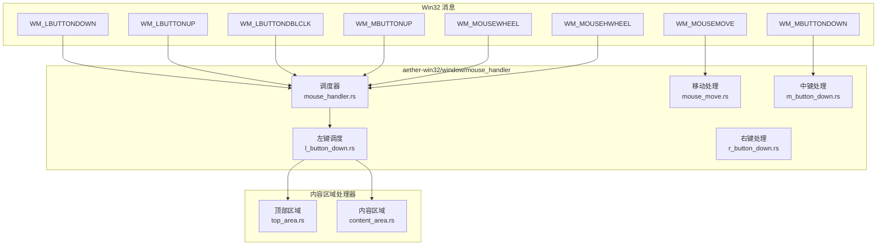
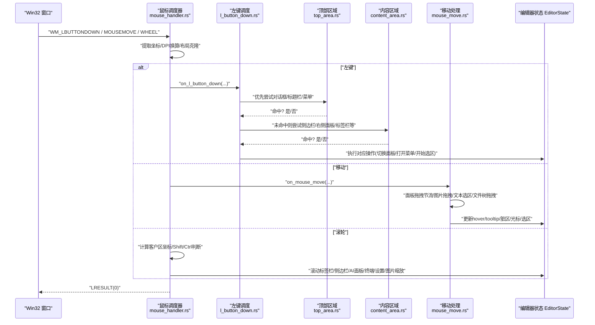
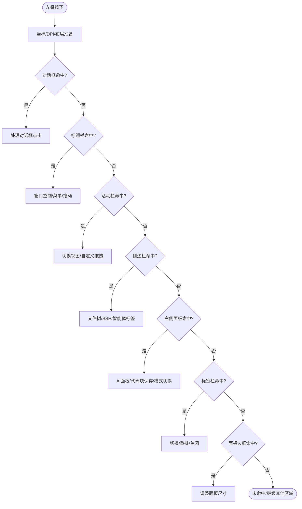
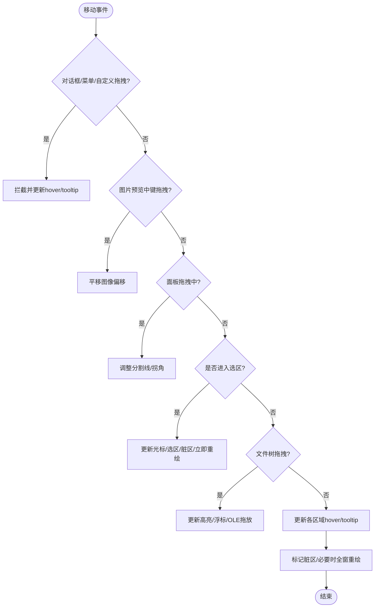
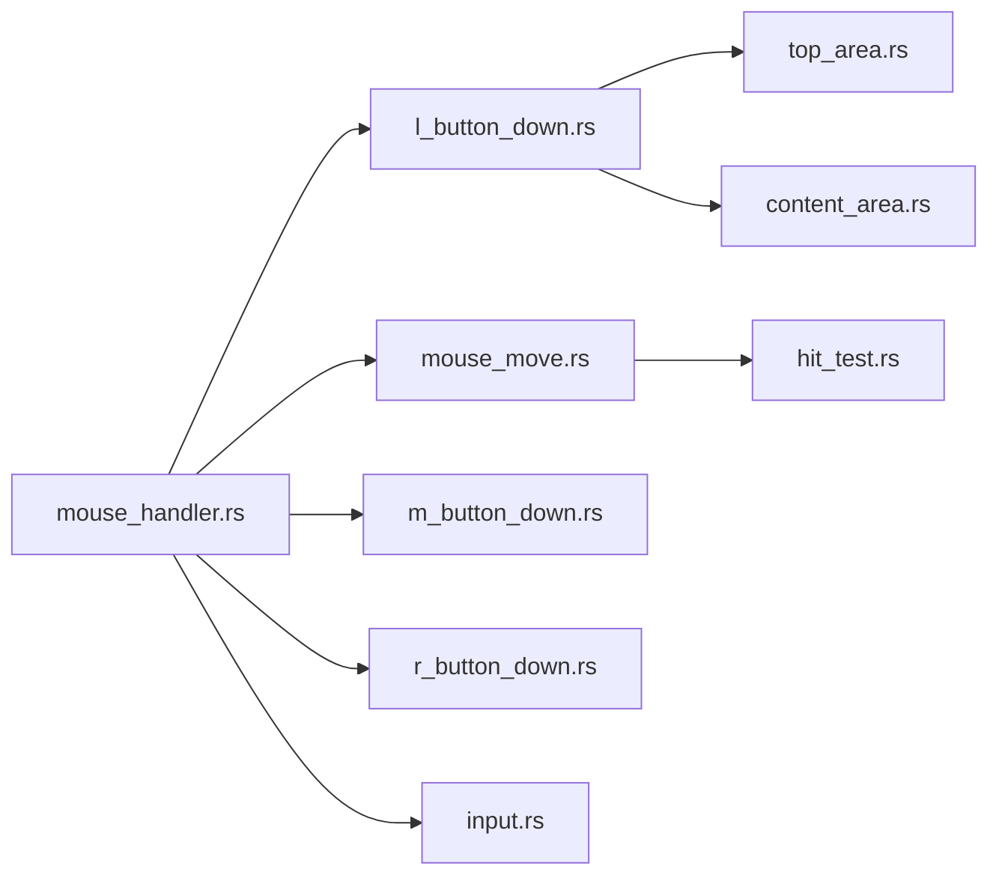

# 鼠标事件处理

<cite>
**本文引用的文件**
- [mouse_handler.rs](file://crates/aether-win32/src/window/mouse_handler.rs)
- [l_button_down.rs](file://crates/aether-win32/src/window/mouse_handler/l_button_down.rs)
- [content_area.rs](file://crates/aether-win32/src/window/mouse_handler/l_button_down/content_area.rs)
- [top_area.rs](file://crates/aether-win32/src/window/mouse_handler/l_button_down/top_area.rs)
- [m_button_down.rs](file://crates/aether-win32/src/window/mouse_handler/m_button_down.rs)
- [r_button_down.rs](file://crates/aether-win32/src/window/mouse_handler/r_button_down.rs)
- [mouse_move.rs](file://crates/aether-win32/src/window/mouse_handler/mouse_move.rs)
- [hit_test.rs](file://crates/aether-win32/src/hit_test.rs)
- [input.rs](file://crates/aether-win32/src/input.rs)
</cite>

## 目录
1. [简介](#简介)
2. [项目结构](#项目结构)
3. [核心组件](#核心组件)
4. [架构总览](#架构总览)
5. [详细组件分析](#详细组件分析)
6. [依赖关系分析](#依赖关系分析)
7. [性能考量](#性能考量)
8. [故障排查指南](#故障排查指南)
9. [结论](#结论)
10. [附录](#附录)

## 简介
本文件系统性梳理牧羊人编辑器在 Win32 平台上的鼠标事件处理机制，覆盖消息分发、坐标转换与 DPI 适配、点击区域命中测试、拖拽状态管理、左/中/右键差异化逻辑（文本选择、滚动控制、上下文菜单）、移动事件节流优化、双击检测、滚轮与横向滚轮处理，以及如何扩展自定义交互与手势识别。文档以代码级为依据，提供流程图与时序图帮助理解关键路径。

## 项目结构
鼠标事件处理位于 aether-win32 窗体模块下，采用“主调度器 + 按按钮/行为拆分子模块”的组织方式：
- 顶层调度：mouse_handler.rs 负责 WM_LBUTTONUP、WM_LBUTTONDBLCLK、WM_MBUTTONUP、WM_MOUSEWHEEL、WM_MOUSEHWHEEL 等通用消息；并导出各子模块的处理器。
- 左键处理：l_button_down.rs 作为左键按下调度器，将点击分派到对话框、标题栏、活动栏、侧边栏、右侧面板、标签栏、查找面板、底部面板、设置页、欢迎页/编辑器等内容区域处理器。
- 移动处理：mouse_move.rs 实现悬停更新、文本选区拖拽、面板拖拽调整、文件树拖拽、历史浮窗拖动、图片预览平移等。
- 中键处理：m_button_down.rs 支持关闭标签、图片预览中键拖拽平移。
- 右键处理：r_button_down.rs 实现标签/活动栏/资源管理器空白区域的上下文菜单弹出与互斥关闭。
- 命中测试：hit_test.rs 提供调试期可点击区域记录能力，便于自动化测试与可视化验证。
- 输入抽象：input.rs 定义长按目标、按键类型与动作映射，为长按检测与后续扩展提供基础。

图表来源
- [mouse_handler.rs:1-16](file://crates/aether-win32/src/window/mouse_handler.rs#L1-L16)
- [l_button_down.rs:17-111](file://crates/aether-win32/src/window/mouse_handler/l_button_down.rs#L17-L111)
- [mouse_move.rs:39-323](file://crates/aether-win32/src/window/mouse_handler/mouse_move.rs#L39-L323)
- [m_button_down.rs:11-73](file://crates/aether-win32/src/window/mouse_handler/m_button_down.rs#L11-L73)
- [r_button_down.rs:15-220](file://crates/aether-win32/src/window/mouse_handler/r_button_down.rs#L15-L220)

章节来源
- [mouse_handler.rs:1-16](file://crates/aether-win32/src/window/mouse_handler.rs#L1-L16)
- [l_button_down.rs:17-111](file://crates/aether-win32/src/window/mouse_handler/l_button_down.rs#L17-L111)

## 核心组件
- 消息调度器：统一入口，完成坐标提取、DPI 换算、布局克隆、早期返回与区域优先级分派。
- 左键区域处理器：按优先级依次尝试对话框、标题栏、用户菜单、资源管理器/文件节点/活动栏/标签上下文菜单、子菜单、历史浮窗、活动栏、面板调整边框、侧边栏、右侧面板、标签栏、查找面板、底部面板、设置页、沙盒评测页、欢迎页/编辑器。
- 移动处理器：包含面板拖拽同步重绘节流、图片预览中键拖拽、文本选区启动与更新、文件树拖拽、历史浮窗拖动、悬停更新、Tooltip 防抖、脏区标记与增量重绘。
- 中键处理器：图片预览模式下的拖拽平移、标签栏中键关闭标签。
- 右键处理器：标签/活动栏/资源管理器空白区域上下文菜单弹出与互斥关闭。
- 命中测试：调试构建下记录每帧可点击区域，release 构建空实现零开销。
- 输入抽象：长按目标枚举与按键绑定框架，支撑长按检测与后续扩展。

章节来源
- [mouse_handler.rs:23-405](file://crates/aether-win32/src/window/mouse_handler.rs#L23-L405)
- [l_button_down.rs:17-111](file://crates/aether-win32/src/window/mouse_handler/l_button_down.rs#L17-L111)
- [mouse_move.rs:20-323](file://crates/aether-win32/src/window/mouse_handler/mouse_move.rs#L20-L323)
- [m_button_down.rs:11-73](file://crates/aether-win32/src/window/mouse_handler/m_button_down.rs#L11-L73)
- [r_button_down.rs:15-220](file://crates/aether-win32/src/window/mouse_handler/r_button_down.rs#L15-L220)
- [hit_test.rs:1-178](file://crates/aether-win32/src/hit_test.rs#L1-L178)
- [input.rs:9-14](file://crates/aether-win32/src/input.rs#L9-L14)

## 架构总览
下图展示从 Win32 消息到具体业务处理的调用链与数据流，强调坐标转换、区域命中、状态更新与重绘策略。

图表来源
- [mouse_handler.rs:17-405](file://crates/aether-win32/src/window/mouse_handler.rs#L17-L405)
- [l_button_down.rs:17-111](file://crates/aether-win32/src/window/mouse_handler/l_button_down.rs#L17-L111)
- [top_area.rs:137-339](file://crates/aether-win32/src/window/mouse_handler/l_button_down/top_area.rs#L137-L339)
- [content_area.rs:19-244](file://crates/aether-win32/src/window/mouse_handler/l_button_down/content_area.rs#L19-L244)
- [mouse_move.rs:39-323](file://crates/aether-win32/src/window/mouse_handler/mouse_move.rs#L39-L323)

## 详细组件分析

### 左键按下：区域优先级与分发
- 坐标与布局准备：提取 raw_x/raw_y，除以 DPI 得到逻辑坐标；克隆布局用于命中测试；退出自定义模式时若点击不在活动栏/菜单栏区域则退出。
- 优先级顺序：对话框 > 标题栏 > 用户菜单 > 资源管理器/文件节点/活动栏/标签上下文菜单 > 子菜单 > 历史浮窗 > 活动栏 > 面板调整边框 > 侧边栏 > 右侧面板 > 标签栏 > 查找面板 > 底部面板 > 设置页 > 沙盒评测页 > 欢迎页/编辑器。
- 典型行为：
  - 标题栏：关闭窗口/最大化/最小化、切换面板、模式切换、菜单展开/收起、标题栏拖动。
  - 活动栏：切换视图、长按进入自定义排序拖拽。
  - 侧边栏：文件树点击、SSH 管理面板按钮、智能体模式对话标签切换。
  - 右侧面板：AI 面板标签/折叠/输入框/保存代码块/模式切换等。
  - 标签栏：选中/重排/关闭。
  - 面板调整边框：右侧/底部/侧边栏/拐角手柄拖拽调整尺寸。

图表来源
- [l_button_down.rs:17-111](file://crates/aether-win32/src/window/mouse_handler/l_button_down.rs#L17-L111)
- [top_area.rs:137-339](file://crates/aether-win32/src/window/mouse_handler/l_button_down/top_area.rs#L137-L339)
- [content_area.rs:19-244](file://crates/aether-win32/src/window/mouse_handler/l_button_down/content_area.rs#L19-L244)

章节来源
- [l_button_down.rs:17-111](file://crates/aether-win32/src/window/mouse_handler/l_button_down.rs#L17-L111)
- [top_area.rs:137-339](file://crates/aether-win32/src/window/mouse_handler/l_button_down/top_area.rs#L137-L339)
- [content_area.rs:19-244](file://crates/aether-win32/src/window/mouse_handler/l_button_down/content_area.rs#L19-L244)

### 移动事件：节流、选区与拖拽
- 面板拖拽同步重绘节流：通过最小帧间隔（约 8ms）限制 UpdateWindow 频率，避免高回报率鼠标导致管线拥塞。
- 图片预览中键拖拽：最高优先级，直接平移图像偏移量。
- 文本选区：
  - 启动阈值：按下位置在编辑区内且位移平方和超过 9（约 3px），进入选区模式。
  - 更新：根据鼠标位置设置光标行/列，更新选区，仅当光标或选区变化时标记编辑区与状态栏脏区并立即重绘。
- 文件树拖拽：
  - 按下候选节点后，移出侧边栏即转系统 OLE 拖放（CF_HDROP + CF_UNICODETEXT）。
  - 内部拖拽更新高亮/浮标，节流重绘。
- 历史浮窗拖动：全局最顶层，拖动中跳过其他拖拽/选区，握紧手形光标。
- 悬停与 Tooltip：
  - 标题栏/活动栏/标签栏/侧边栏/AI面板/欢迎页/状态栏 hover 更新。
  - Tooltip 显示延迟与移动容差，脏区全窗标记。

图表来源
- [mouse_move.rs:20-323](file://crates/aether-win32/src/window/mouse_handler/mouse_move.rs#L20-L323)

章节来源
- [mouse_move.rs:20-323](file://crates/aether-win32/src/window/mouse_handler/mouse_move.rs#L20-L323)

### 中键：关闭标签与图片平移
- 图片预览模式：中键按下开始拖拽平移，记录起始点与初始偏移；移动事件中更新 image_offset_x/y。
- 标签栏：中键点击命中标签则关闭该标签，复用 close_tab 的 dirty 检查逻辑。

章节来源
- [m_button_down.rs:11-73](file://crates/aether-win32/src/window/mouse_handler/m_button_down.rs#L11-L73)
- [mouse_handler.rs:23-42](file://crates/aether-win32/src/window/mouse_handler.rs#L23-L42)
- [mouse_move.rs:64-81](file://crates/aether-win32/src/window/mouse_handler/mouse_move.rs#L64-L81)

### 右键：上下文菜单与互斥
- 标签右键：命中标签弹出标签上下文菜单，关闭资源管理器/活动栏菜单。
- 活动栏右键：命中标题栏活动栏区域弹出活动栏上下文菜单，关闭其他菜单。
- 资源管理器空白区域：侧边栏可见且为文件树视图时，空白区域右键弹出资源管理器菜单；命中文件节点弹出文件节点菜单；同时清除选中节点。
- 菜单互斥：任一菜单打开时，点击外部或新菜单会关闭已有菜单，确保不重叠。

章节来源
- [r_button_down.rs:15-220](file://crates/aether-win32/src/window/mouse_handler/r_button_down.rs#L15-L220)

### 滚轮与横向滚轮：多区域滚动与缩放
- 垂直滚轮：
  - Ctrl+滚轮在图片预览区域进行缩放（每 120 单位 = 10%）。
  - 光标在标签栏区域时横向滚动标签栏（平滑滚动）。
  - Shift+滚轮或光标在编辑器区域时横向滚动。
  - 底部终端面板、AI 面板聊天区域、设置页、沙盒评测页、侧边栏均有各自滚动逻辑。
- 横向滚轮：仅在编辑器区域内响应，按字符宽度滚动。

章节来源
- [mouse_handler.rs:190-405](file://crates/aether-win32/src/window/mouse_handler.rs#L190-L405)

### 双击：选词
- 左键双击：在非对话框/命令面板/欢迎页时，若光标在编辑器内容区，调用 select_word_at_mouse 选词并刷新。

章节来源
- [mouse_handler.rs:150-188](file://crates/aether-win32/src/window/mouse_handler.rs#L150-L188)

### 命中测试与调试输出
- HitTestFrame：记录 action 与矩形，debug 构建写入 JSONL 文件供自动化测试读取；release 构建为空实现零开销。
- 用途：辅助定位 UI 可点击区域，验证命中逻辑与渲染一致性。

章节来源
- [hit_test.rs:1-178](file://crates/aether-win32/src/hit_test.rs#L1-L178)

### 长按检测与自定义模式
- 长按目标：活动栏/菜单栏，按下时记录时间戳与坐标，启动定时器；移动超过容差则取消。
- 自定义模式：活动栏/菜单栏进入自定义排序拖拽，拖拽结束后持久化顺序。

章节来源
- [input.rs:9-14](file://crates/aether-win32/src/input.rs#L9-L14)
- [mouse_move.rs:541-596](file://crates/aether-win32/src/window/mouse_handler/mouse_move.rs#L541-L596)
- [top_area.rs:287-323](file://crates/aether-win32/src/window/mouse_handler/l_button_down/top_area.rs#L287-L323)
- [content_area.rs:19-77](file://crates/aether-win32/src/window/mouse_handler/l_button_down/content_area.rs#L19-L77)

## 依赖关系分析
- 模块耦合：
  - mouse_handler.rs 依赖 layout、dirty_rect、cursor、window 状态常量（如 HOVER_*、LP_*）。
  - l_button_down.rs 依赖 top_area.rs 与 content_area.rs 的区域处理器。
  - mouse_move.rs 依赖 dirty_tracker、layout、cursor、window 常量。
  - r_button_down.rs 依赖 context menu 状态与布局。
  - hit_test.rs 仅在 debug 构建引入 I/O 与 Mutex。
- 外部集成：
  - Win32 API：SetTimer/KillTimer、ScreenToClient、LoadCursorW、SetCursor、SendMessageW、ReleaseCapture、ShowWindow、DestroyWindow。
  - 系统拖放：OLE DoDragDrop（通过 file_drag_drop 模块）。
- 潜在循环依赖：无直接循环；通过 EditorState 共享状态解耦。

图表来源
- [mouse_handler.rs:1-16](file://crates/aether-win32/src/window/mouse_handler.rs#L1-L16)
- [l_button_down.rs:1-16](file://crates/aether-win32/src/window/mouse_handler/l_button_down.rs#L1-L16)
- [mouse_move.rs:1-18](file://crates/aether-win32/src/window/mouse_handler/mouse_move.rs#L1-L18)
- [hit_test.rs:1-10](file://crates/aether-win32/src/hit_test.rs#L1-L10)
- [input.rs:1-14](file://crates/aether-win32/src/input.rs#L1-L14)

章节来源
- [mouse_handler.rs:1-16](file://crates/aether-win32/src/window/mouse_handler.rs#L1-L16)
- [l_button_down.rs:1-16](file://crates/aether-win32/src/window/mouse_handler/l_button_down.rs#L1-L16)
- [mouse_move.rs:1-18](file://crates/aether-win32/src/window/mouse_handler/mouse_move.rs#L1-L18)
- [hit_test.rs:1-10](file://crates/aether-win32/src/hit_test.rs#L1-L10)
- [input.rs:1-14](file://crates/aether-win32/src/input.rs#L1-L14)

## 性能考量
- 移动事件节流：面板拖拽使用最小帧间隔（约 8ms）限制 UpdateWindow，避免高回报率鼠标导致的卡顿。
- 增量脏区：多处使用 dirty_tracker.mark_region 仅标记受影响区域，减少全窗重绘。
- 立即重绘策略：在文本选区、文件树拖拽、菜单 hover 等热路径上调用 UpdateWindow 绕过消息队列优先级，避免 WM_PAINT 被饿死。
- 释放借用与模态安全：在弹框或模态循环前释放 RefCell 借用，防止重入 panic。
- 调试构建开销：命中测试在 release 构建中为空实现，零运行时成本。

章节来源
- [mouse_move.rs:20-37](file://crates/aether-win32/src/window/mouse_handler/mouse_move.rs#L20-L37)
- [mouse_move.rs:156-181](file://crates/aether-win32/src/window/mouse_handler/mouse_move.rs#L156-L181)
- [mouse_move.rs:218-227](file://crates/aether-win32/src/window/mouse_handler/mouse_move.rs#L218-L227)
- [hit_test.rs:149-178](file://crates/aether-win32/src/hit_test.rs#L149-L178)

## 故障排查指南
- 菜单残影/闪烁：
  - 现象：菜单打开/关闭后残留旧菜单区域。
  - 原因：未标记全窗脏区或脏区不足。
  - 解决：在菜单开合处调用 mark_full_window() 并 invalidate_window。
- 快速拖拽滞后：
  - 现象：文本选区或文件树拖拽视觉滞后。
  - 原因：WM_PAINT 优先级低于 WM_MOUSEMOVE。
  - 解决：在关键路径调用 UpdateWindow 立即重绘。
- 高回报率鼠标卡顿：
  - 现象：频繁 WM_MOUSEMOVE 导致界面卡顿。
  - 原因：每条消息都同步重绘。
  - 解决：使用 panel_drag_should_sync_paint 节流至 ~120fps。
- 右键菜单重叠：
  - 现象：多个上下文菜单同时显示。
  - 原因：未互斥关闭。
  - 解决：在新菜单打开前关闭其他菜单。

章节来源
- [r_button_down.rs:64-76](file://crates/aether-win32/src/window/mouse_handler/r_button_down.rs#L64-L76)
- [r_button_down.rs:199-219](file://crates/aether-win32/src/window/mouse_handler/r_button_down.rs#L199-L219)
- [mouse_move.rs:175-181](file://crates/aether-win32/src/window/mouse_handler/mouse_move.rs#L175-L181)
- [mouse_move.rs:218-227](file://crates/aether-win32/src/window/mouse_handler/mouse_move.rs#L218-L227)
- [mouse_move.rs:20-37](file://crates/aether-win32/src/window/mouse_handler/mouse_move.rs#L20-L37)

## 结论
牧羊人编辑器的鼠标事件处理采用清晰的调度分层与区域优先级策略，结合 DPI 适配、增量脏区与节流重绘，实现了高性能且稳定的交互体验。左键按下的区域分发、移动事件的选区与拖拽、中键的图片平移与标签关闭、右键的上下文菜单互斥、滚轮的多区域滚动与缩放，均具备明确的实现路径与可扩展性。通过命中测试与调试输出，可进一步保障 UI 一致性与自动化测试可靠性。

## 附录

### 如何扩展自定义鼠标交互与手势识别
- 新增区域处理器：
  - 在 l_button_down.rs 中添加新的区域检测函数，并在调度器中按优先级插入。
  - 在 mouse_move.rs 中实现对应的悬停/拖拽逻辑，必要时加入节流与脏区标记。
- 手势识别建议：
  - 基于位移阈值与时间窗口的组合（例如滑动、长按、双击）进行状态机管理。
  - 利用 PressTarget 与长按定时器区分长按与单击。
  - 对高回报率鼠标事件统一节流，避免过度重绘。
- 参考现有模式：
  - 活动栏/菜单栏长按进入自定义排序拖拽。
  - 文件树拖拽阈值判定与 OLE 拖放。
  - 历史浮窗拖动与握紧光标。

章节来源
- [l_button_down.rs:17-111](file://crates/aether-win32/src/window/mouse_handler/l_button_down.rs#L17-L111)
- [mouse_move.rs:541-596](file://crates/aether-win32/src/window/mouse_handler/mouse_move.rs#L541-L596)
- [input.rs:9-14](file://crates/aether-win32/src/input.rs#L9-L14)