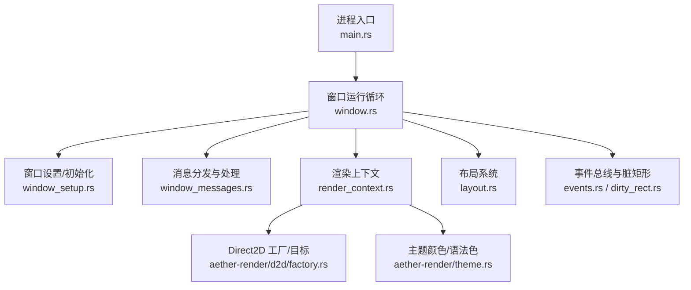
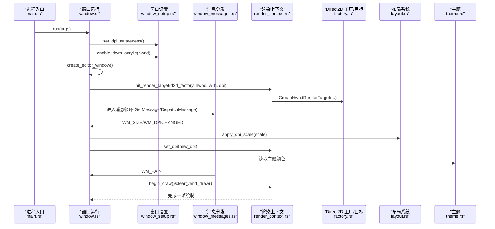
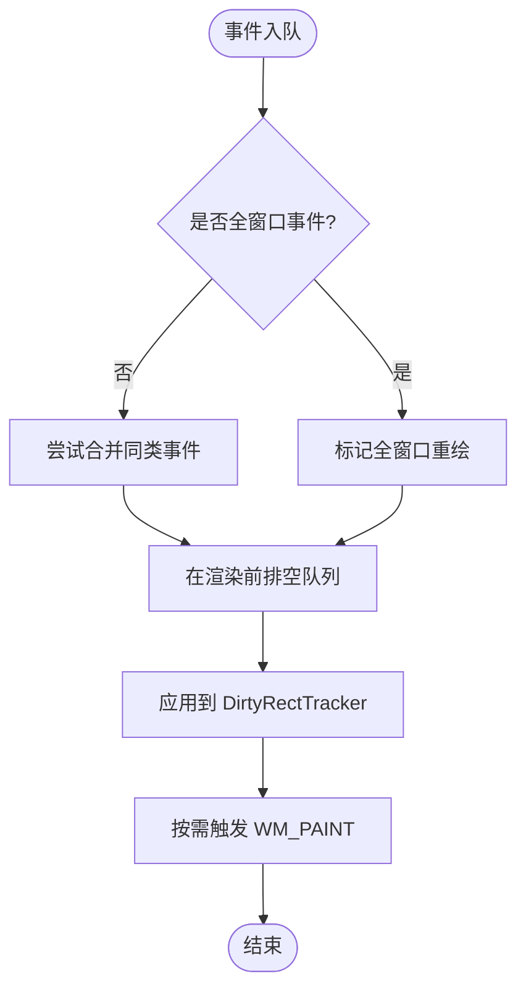
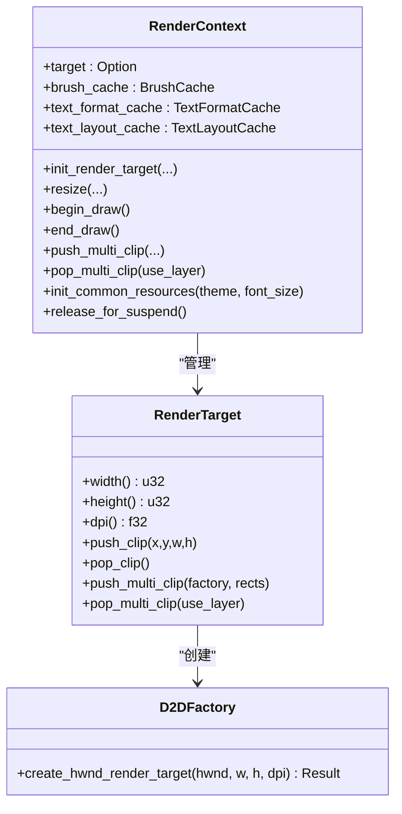
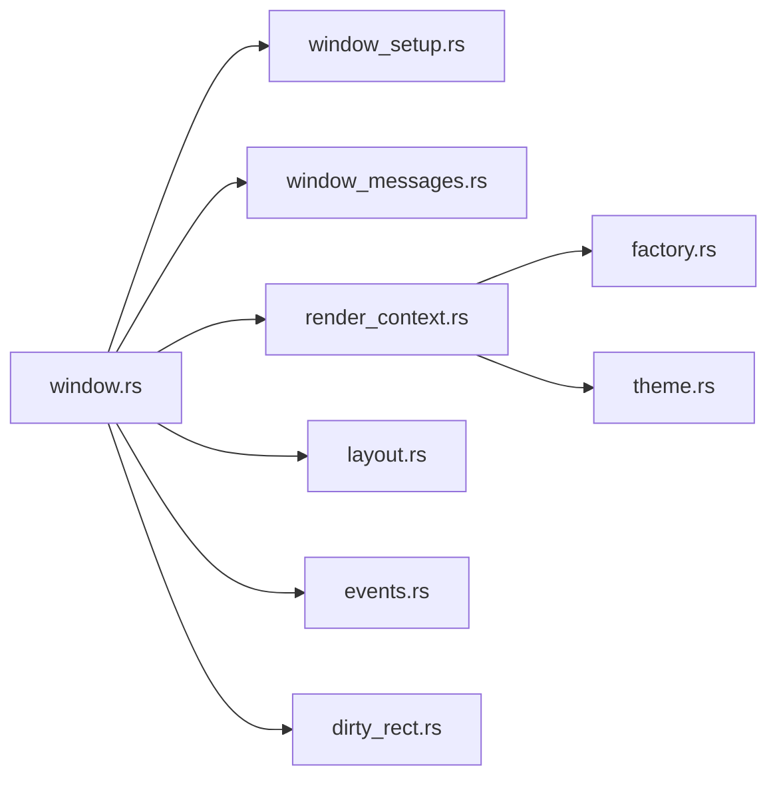

# 原生 Windows 体验

<cite>
**本文引用的文件**
- [main.rs](file://crates/aether-win32/src/main.rs)
- [window.rs](file://crates/aether-win32/src/window.rs)
- [window_setup.rs](file://crates/aether-win32/src/window/window_setup.rs)
- [window_messages.rs](file://crates/aether-win32/src/window/window_messages.rs)
- [render_context.rs](file://crates/aether-win32/src/render_context.rs)
- [factory.rs](file://crates/aether-render/src/d2d/factory.rs)
- [theme.rs](file://crates/aether-render/src/theme.rs)
- [layout.rs](file://crates/aether-win32/src/layout.rs)
- [events.rs](file://crates/aether-win32/src/events.rs)
- [dirty_rect.rs](file://crates/aether-win32/src/dirty_rect.rs)
</cite>

## 目录
1. [简介](#简介)
2. [项目结构](#项目结构)
3. [核心组件](#核心组件)
4. [架构总览](#架构总览)
5. [详细组件分析](#详细组件分析)
6. [依赖关系分析](#依赖关系分析)
7. [性能考量](#性能考量)
8. [故障排查指南](#故障排查指南)
9. [结论](#结论)
10. [附录](#附录)

## 简介
本文件面向“牧羊人编辑器”的原生 Windows 体验实现，聚焦基于 Win32 API 的窗口管理系统与自绘渲染管线。内容涵盖：
- DWM 沉浸式深色模式（Acrylic/Mica）集成
- 高 DPI 支持与 DPI 缩放处理
- 系统高对比度模式的适配思路
- 窗口消息循环、事件处理与布局系统
- Direct2D/DirectWrite 自绘界面与脏矩形优化策略
- 关键流程的代码级示例路径（窗口创建、消息处理、主题切换等）

## 项目结构
Windows 原生层位于 aether-win32 crate，负责窗口生命周期、消息分发、DWM 效果、DPI 处理；渲染层位于 aether-render crate，封装 Direct2D/DirectWrite 工厂与渲染目标；UI 布局与事件在 aether-win32 内以模块形式组织。

图表来源
- [main.rs:1-52](file://crates/aether-win32/src/main.rs#L1-L52)
- [window.rs:130-204](file://crates/aether-win32/src/window.rs#L130-L204)
- [window_setup.rs:17-86](file://crates/aether-win32/src/window/window_setup.rs#L17-L86)
- [window_messages.rs:1-60](file://crates/aether-win32/src/window/window_messages.rs#L1-L60)
- [render_context.rs:1-46](file://crates/aether-win32/src/render_context.rs#L1-L46)
- [factory.rs:14-63](file://crates/aether-render/src/d2d/factory.rs#L14-L63)
- [layout.rs:237-358](file://crates/aether-win32/src/layout.rs#L237-L358)
- [events.rs:1-74](file://crates/aether-win32/src/events.rs#L1-L74)
- [dirty_rect.rs:87-118](file://crates/aether-win32/src/dirty_rect.rs#L87-L118)
- [theme.rs:148-211](file://crates/aether-render/src/theme.rs#L148-L211)

章节来源
- [main.rs:1-52](file://crates/aether-win32/src/main.rs#L1-L52)
- [window.rs:130-204](file://crates/aether-win32/src/window.rs#L130-L204)

## 核心组件
- 窗口与消息循环：注册窗口类、创建主窗口、进入 GetMessage/DispatchMessage 循环，统一分发到各消息处理器。
- DWM 沉浸模式：启用沉浸式暗色、主机背景画刷（Mica/Acrylic）、禁用非客户区绘制以获得无边框外观。
- 高 DPI：进程级 Per-Monitor V2 感知；窗口 DPI 变化时重建渲染目标并更新布局与文本格式缓存。
- 渲染上下文：封装 Direct2D 渲染目标、画刷/文本格式缓存、多矩形裁剪支持。
- 布局系统：计算标题栏、活动栏、侧边栏、编辑器、右侧面板、底部面板、状态栏区域，支持 DPI 缩放与动画。
- 事件与脏矩形：将 UI 变更转化为局部重绘请求，合并重叠区域，必要时降级为全窗口重绘。

章节来源
- [window.rs:130-204](file://crates/aether-win32/src/window.rs#L130-L204)
- [window_setup.rs:17-86](file://crates/aether-win32/src/window/window_setup.rs#L17-L86)
- [render_context.rs:1-46](file://crates/aether-win32/src/render_context.rs#L1-L46)
- [layout.rs:237-358](file://crates/aether-win32/src/layout.rs#L237-L358)
- [events.rs:1-74](file://crates/aether-win32/src/events.rs#L1-L74)
- [dirty_rect.rs:87-118](file://crates/aether-win32/src/dirty_rect.rs#L87-L118)

## 架构总览
下图展示从进程启动到渲染的关键调用链，以及 DWM/DPI/布局/渲染之间的协作关系。

图表来源
- [main.rs:8-26](file://crates/aether-win32/src/main.rs#L8-L26)
- [window.rs:130-204](file://crates/aether-win32/src/window.rs#L130-L204)
- [window_setup.rs:17-86](file://crates/aether-win32/src/window/window_setup.rs#L17-L86)
- [window_messages.rs:1013-1049](file://crates/aether-win32/src/window/window_messages.rs#L1013-L1049)
- [render_context.rs:33-46](file://crates/aether-win32/src/render_context.rs#L33-L46)
- [factory.rs:33-63](file://crates/aether-render/src/d2d/factory.rs#L33-L63)
- [layout.rs:339-358](file://crates/aether-win32/src/layout.rs#L339-L358)
- [theme.rs:148-211](file://crates/aether-render/src/theme.rs#L148-L211)

## 详细组件分析

### 窗口创建与消息循环
- 单实例控制：通过命令行参数与跨进程消息复用已有窗口，避免重复启动。
- 窗口类注册与创建：设置样式、光标、图标，启用拖放文件。
- 消息循环：GetMessage/TranslateMessage/DispatchMessage 驱动 UI 线程。
- 窗口过程：集中路由鼠标、键盘、定时器、IME、DPI、尺寸、绘制等消息。

章节来源
- [main.rs:8-26](file://crates/aether-win32/src/main.rs#L8-L26)
- [window.rs:157-204](file://crates/aether-win32/src/window.rs#L157-L204)
- [window.rs:210-279](file://crates/aether-win32/src/window.rs#L210-L279)
- [window.rs:355-447](file://crates/aether-win32/src/window.rs#L355-L447)

### DWM 沉浸式深色模式
- 启用沉浸式暗色模式属性。
- 启用主机背景画刷（Mica/Acrylic），并在较新系统上设置 backdrop 类型。
- 禁用非客户区绘制，获得无边框外观，配合自定义命中测试实现可调整大小与拖动。

章节来源
- [window_setup.rs:32-86](file://crates/aether-win32/src/window/window_setup.rs#L32-L86)
- [window_messages.rs:887-953](file://crates/aether-win32/src/window/window_messages.rs#L887-L953)

### 高 DPI 支持与缩放处理
- 进程级 DPI 感知：优先使用 Per-Monitor V2，失败回退至 Per-Monitor。
- 窗口 DPI 变化：应用新 DPI 到渲染目标、布局常量、IME 候选框尺寸，重建渲染目标与缓存，刷新状态栏提示。
- 边框命中测试按 DPI 缩放，确保高 DPI 下边缘拖拽区域足够大。

章节来源
- [window_setup.rs:17-30](file://crates/aether-win32/src/window/window_setup.rs#L17-L30)
- [window_messages.rs:837-885](file://crates/aether-win32/src/window/window_messages.rs#L837-L885)
- [window_messages.rs:955-1000](file://crates/aether-win32/src/window/window_messages.rs#L955-L1000)

### 系统高对比度模式适配
- 当前代码未显式检测系统高对比度模式。建议在高对比度场景下：
  - 关闭半透明/毛玻璃效果，强制不透明背景以保证可读性。
  - 提高对比度与描边宽度，确保边界清晰。
  - 在主题切换或 DPI 变化时，根据系统设置动态调整 Theme.glass_enabled 与相关颜色。
- 可在主题初始化或 WM_SETTINGCHANGE 中注入适配逻辑。

[本节为概念性说明，不直接分析具体文件]

### 布局系统
- 区域计算：标题栏、活动栏、侧边栏、编辑器、右侧面板、底部面板、状态栏。
- DPI 缩放：所有布局常量与应用尺寸按 DPI 比例换算，保留用户可调尺寸。
- 交互：侧边栏/右侧面板/底部面板可见性切换与尺寸调整，欢迎页抑制侧边栏面板。

章节来源
- [layout.rs:237-358](file://crates/aether-win32/src/layout.rs#L237-L358)
- [layout.rs:374-549](file://crates/aether-win32/src/layout.rs#L374-L549)
- [layout.rs:580-699](file://crates/aether-win32/src/layout.rs#L580-L699)

### 事件系统与脏矩形优化
- 事件总线：收集一帧内的编辑、侧边栏、面板、状态栏等事件，合并同类事件，避免重复重绘。
- 脏矩形追踪：记录需要重绘的区域，合并重叠区域，超过阈值降级为全窗口重绘。
- 渲染命令推断：根据状态变化选择最小必要重绘范围（编辑器、侧边栏、右侧面板、底部面板、全量）。

图表来源
- [events.rs:66-186](file://crates/aether-win32/src/events.rs#L66-L186)
- [dirty_rect.rs:87-118](file://crates/aether-win32/src/dirty_rect.rs#L87-L118)
- [dirty_rect.rs:368-426](file://crates/aether-win32/src/dirty_rect.rs#L368-L426)

章节来源
- [events.rs:1-186](file://crates/aether-win32/src/events.rs#L1-L186)
- [dirty_rect.rs:87-118](file://crates/aether-win32/src/dirty_rect.rs#L87-L118)
- [dirty_rect.rs:368-426](file://crates/aether-win32/src/dirty_rect.rs#L368-L426)

### Direct2D/DirectWrite 自绘界面
- 渲染上下文：封装渲染目标、画刷/文本格式缓存、多矩形裁剪。
- 设备丢失处理：清空资源并在恢复后重建。
- 多矩形裁剪：使用几何组 + PushLayer 实现精确的多矩形脏区域裁剪，避免包围盒膨胀。

图表来源
- [render_context.rs:1-46](file://crates/aether-win32/src/render_context.rs#L1-L46)
- [render_context.rs:102-155](file://crates/aether-win32/src/render_context.rs#L102-L155)
- [factory.rs:14-63](file://crates/aether-render/src/d2d/factory.rs#L14-L63)
- [factory.rs:164-273](file://crates/aether-render/src/d2d/factory.rs#L164-L273)

章节来源
- [render_context.rs:1-46](file://crates/aether-win32/src/render_context.rs#L1-L46)
- [render_context.rs:102-155](file://crates/aether-win32/src/render_context.rs#L102-L155)
- [factory.rs:164-273](file://crates/aether-render/src/d2d/factory.rs#L164-L273)

### 主题与深色模式
- 主题模型：包含编辑器背景、行号、选择高亮、侧边栏、状态栏、标签栏、标题栏、面板边框、阴影、光晕选择、命令面板与子菜单颜色，以及语法着色集合。
- 默认主题：提供玻璃主题（半透明面板+柔和边框+光晕选择）与经典深色主题（不透明回退）。
- 主题切换：在 DPI 变化或主题切换时重建常用画刷与文本格式缓存，确保渲染一致性。

章节来源
- [theme.rs:148-211](file://crates/aether-render/src/theme.rs#L148-L211)
- [render_context.rs:189-217](file://crates/aether-win32/src/render_context.rs#L189-L217)
- [window_messages.rs:861-881](file://crates/aether-win32/src/window/window_messages.rs#L861-L881)

### 关键流程示例（代码片段路径）
- 窗口创建与 DWM 效果启用
  - [窗口创建:210-279](file://crates/aether-win32/src/window.rs#L210-L279)
  - [DWM 沉浸模式:32-86](file://crates/aether-win32/src/window/window_setup.rs#L32-L86)
- 消息处理与绘制
  - [消息分发:355-447](file://crates/aether-win32/src/window.rs#L355-L447)
  - [WM_PAINT 处理:1013-1049](file://crates/aether-win32/src/window/window_messages.rs#L1013-L1049)
- DPI 变化处理
  - [WM_DPICHANGED:837-885](file://crates/aether-win32/src/window/window_messages.rs#L837-L885)
- 主题切换与资源重建
  - [主题模型:148-211](file://crates/aether-render/src/theme.rs#L148-L211)
  - [渲染上下文资源初始化:189-217](file://crates/aether-win32/src/render_context.rs#L189-L217)

## 依赖关系分析
- window.rs 依赖 window_setup.rs（DPI 感知、DWM 效果）、window_messages.rs（消息处理）、render_context.rs（渲染）、layout.rs（布局）、events.rs/dirty_rect.rs（事件与脏矩形）。
- render_context.rs 依赖 aether-render 的 d2d factory（Direct2D 工厂与渲染目标）与 theme（主题颜色）。
- layout.rs 提供区域计算，被渲染与输入命中测试共用。
- events.rs 与 dirty_rect.rs 共同构成轻量级渲染调度，减少不必要的重绘。

图表来源
- [window.rs:1-30](file://crates/aether-win32/src/window.rs#L1-L30)
- [render_context.rs:1-19](file://crates/aether-win32/src/render_context.rs#L1-L19)
- [factory.rs:14-63](file://crates/aether-render/src/d2d/factory.rs#L14-L63)
- [theme.rs:148-211](file://crates/aether-render/src/theme.rs#L148-L211)

章节来源
- [window.rs:1-30](file://crates/aether-win32/src/window.rs#L1-L30)
- [render_context.rs:1-19](file://crates/aether-win32/src/render_context.rs#L1-L19)

## 性能考量
- 脏矩形与事件合并：避免每帧全量重绘，合并连续滚动/光标移动/选择变化，降低渲染压力。
- 多矩形裁剪：使用几何组 + PushLayer 精确裁剪，避免包围盒导致的过度绘制。
- 定时器驱动后台任务：终端输出、AI 流、设置面板轮询等通过独立定时器泥动，避免阻塞渲染路径。
- 设备丢失与冰冻态：GPU 设备丢失时清理并重建资源；最小化/长期空闲进入冰冻态释放内存，唤醒后懒重建。

章节来源
- [events.rs:66-186](file://crates/aether-win32/src/events.rs#L66-L186)
- [dirty_rect.rs:87-118](file://crates/aether-win32/src/dirty_rect.rs#L87-L118)
- [factory.rs:164-273](file://crates/aether-render/src/d2d/factory.rs#L164-L273)
- [window_messages.rs:167-236](file://crates/aether-win32/src/window/window_messages.rs#L167-L236)
- [render_context.rs:219-231](file://crates/aether-win32/src/render_context.rs#L219-L231)

## 故障排查指南
- 崩溃保护：窗口过程与渲染路径均捕获 panic，记录诊断信息并回退到默认处理，避免进程崩溃。
- 设备丢失：渲染异常时清理资源，等待恢复后重建渲染目标与缓存。
- DPI 问题：检查 WM_DPICHANGED 处理是否正确重建渲染目标与布局；确认非客户区计算与边框命中测试按 DPI 缩放。
- 主题不一致：DPI 变化后需重建 text_format_cache 与 brush_cache，确保字体大小与画刷一致。

章节来源
- [window.rs:355-447](file://crates/aether-win32/src/window.rs#L355-L447)
- [window_messages.rs:1013-1049](file://crates/aether-win32/src/window/window_messages.rs#L1013-L1049)
- [window_messages.rs:837-885](file://crates/aether-win32/src/window/window_messages.rs#L837-L885)
- [render_context.rs:219-231](file://crates/aether-win32/src/render_context.rs#L219-L231)

## 结论
本项目通过 Win32 窗口管理与 Direct2D/DirectWrite 自绘实现了高性能、高保真的原生 Windows 体验。DWM 沉浸式深色模式、高 DPI 支持、事件驱动的脏矩形优化与布局系统共同保障了流畅的交互与清晰的视觉呈现。未来可在系统高对比度模式下进一步增强主题与控件的可访问性。

## 附录
- 参考路径汇总（便于快速定位实现）
  - 窗口创建与 DWM 效果：[窗口创建:210-279](file://crates/aether-win32/src/window.rs#L210-L279)、[DWM 沉浸模式:32-86](file://crates/aether-win32/src/window/window_setup.rs#L32-L86)
  - 消息循环与绘制：[消息分发:355-447](file://crates/aether-win32/src/window.rs#L355-L447)、[WM_PAINT:1013-1049](file://crates/aether-win32/src/window/window_messages.rs#L1013-L1049)
  - DPI 处理：[WM_DPICHANGED:837-885](file://crates/aether-win32/src/window/window_messages.rs#L837-L885)
  - 布局与事件：[布局系统:237-358](file://crates/aether-win32/src/layout.rs#L237-L358)、[事件与脏矩形:66-186](file://crates/aether-win32/src/events.rs#L66-L186)、[脏矩形追踪:87-118](file://crates/aether-win32/src/dirty_rect.rs#L87-L118)
  - 渲染上下文与 Direct2D：[渲染上下文:1-46](file://crates/aether-win32/src/render_context.rs#L1-L46)、[工厂与目标:14-63](file://crates/aether-render/src/d2d/factory.rs#L14-L63)
  - 主题与颜色：[主题模型:148-211](file://crates/aether-render/src/theme.rs#L148-L211)