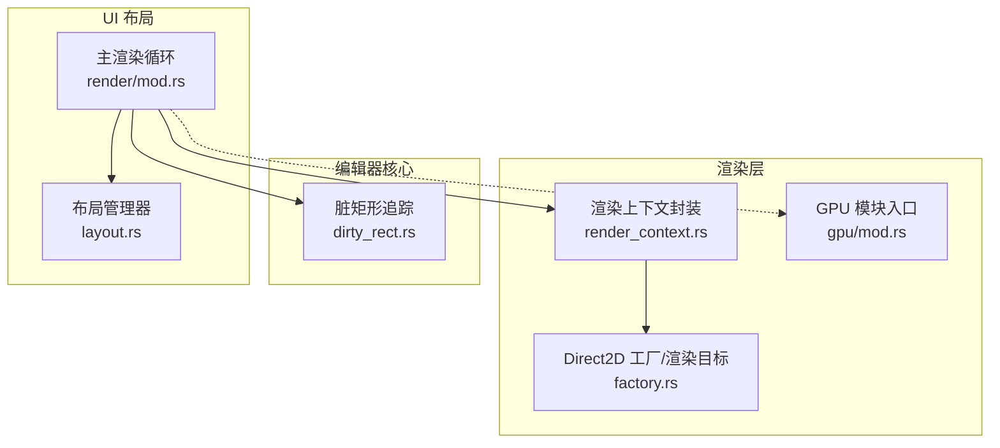
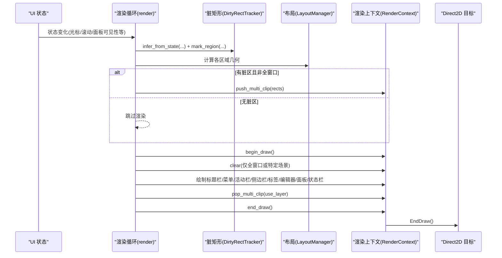
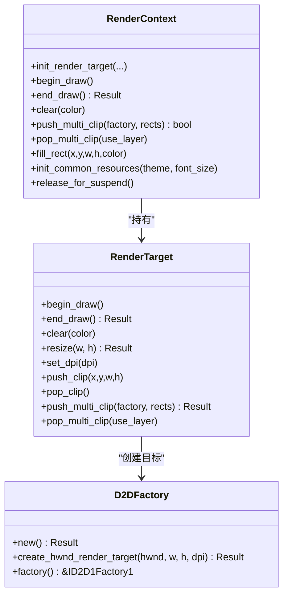
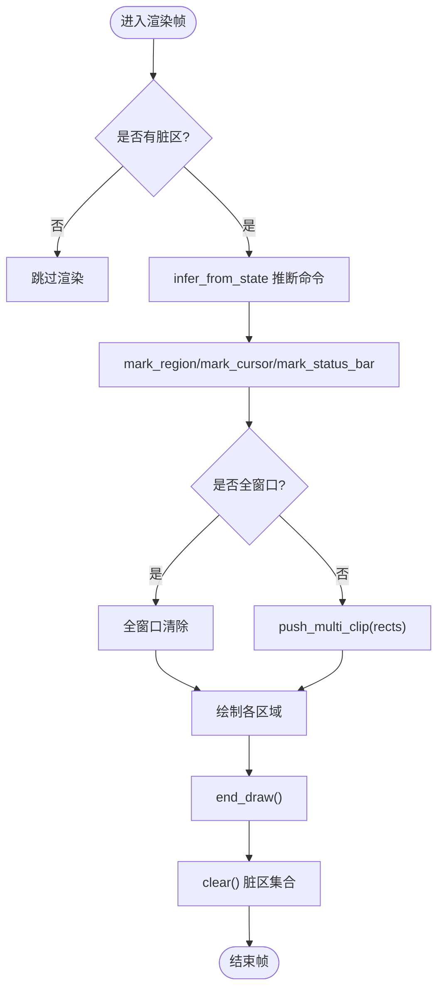
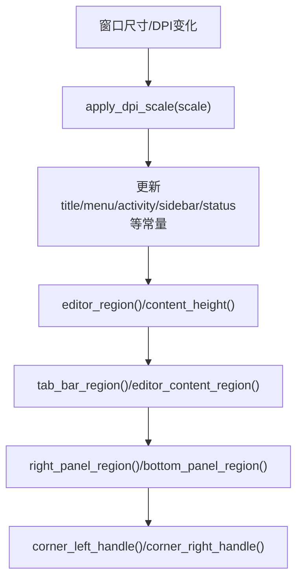
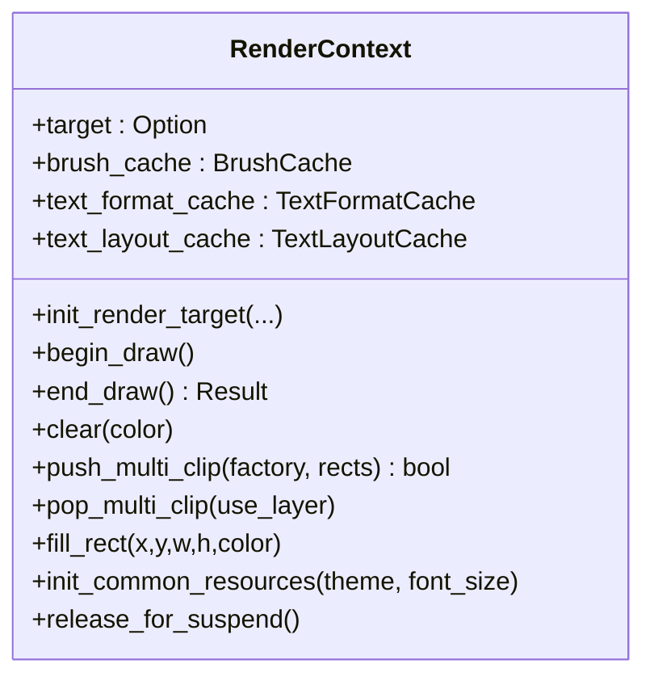
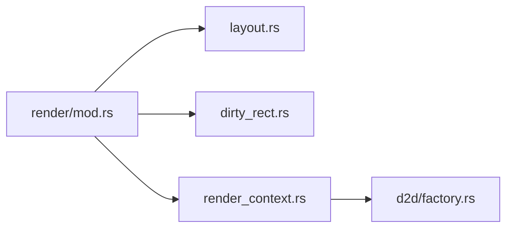

# 布局与渲染

<cite>
**本文引用的文件**
- [crates/aether-render/src/d2d/factory.rs](file://crates/aether-render/src/d2d/factory.rs)
- [crates/aether-render/src/d2d/mod.rs](file://crates/aether-render/src/d2d/mod.rs)
- [crates/aether-render/src/gpu/mod.rs](file://crates/aether-render/src/gpu/mod.rs)
- [crates/aether-render-win/src/render_context.rs](file://crates/aether-render-win/src/render_context.rs)
- [crates/aether-editor/src/dirty_rect.rs](file://crates/aether-editor/src/dirty_rect.rs)
- [crates/aether-win32/src/layout.rs](file://crates/aether-win32/src/layout.rs)
- [crates/aether-win32/src/render/mod.rs](file://crates/aether-win32/src/render/mod.rs)
</cite>

## 目录
1. [简介](#简介)
2. [项目结构](#项目结构)
3. [核心组件](#核心组件)
4. [架构总览](#架构总览)
5. [详细组件分析](#详细组件分析)
6. [依赖关系分析](#依赖关系分析)
7. [性能考量](#性能考量)
8. [故障排查指南](#故障排查指南)
9. [结论](#结论)
10. [附录](#附录)

## 简介
本文件系统性梳理牧羊人编辑器的“布局与渲染”子系统，覆盖 Direct2D/DirectWrite 渲染管线、脏矩形优化算法、窗口重绘机制、布局计算引擎，以及渲染上下文管理、绘制目标创建、图形资源缓存与性能优化策略。同时解释布局系统的坐标变换、元素定位与响应式适配（含 DPI 缩放），并给出关键流程的图示与代码路径指引，帮助读者快速理解从状态变化到屏幕像素更新的完整链路。

## 项目结构
该子系统横跨多个 crate：
- aether-render：Direct2D/DirectWrite 抽象与 GPU 相关模块（工厂、渲染目标、画刷/文本缓存等）
- aether-render-win：Windows 平台渲染上下文封装（BeginDraw/EndDraw、裁剪、多矩形裁剪）
- aether-editor：脏矩形追踪系统（区域类型、合并、降级策略、渲染命令推断）
- aether-win32：布局管理器（Region、LayoutManager）、主渲染循环（render）、事件到脏区域的转换



图表来源
- [crates/aether-render/src/d2d/factory.rs:14-281](file://crates/aether-render/src/d2d/factory.rs#L14-L281)
- [crates/aether-render-win/src/render_context.rs:6-155](file://crates/aether-render-win/src/render_context.rs#L6-L155)
- [crates/aether-editor/src/dirty_rect.rs:8-366](file://crates/aether-editor/src/dirty_rect.rs#L8-L366)
- [crates/aether-win32/src/layout.rs:237-700](file://crates/aether-win32/src/layout.rs#L237-L700)
- [crates/aether-win32/src/render/mod.rs:146-800](file://crates/aether-win32/src/render/mod.rs#L146-L800)

章节来源
- [crates/aether-render/src/d2d/mod.rs:1-5](file://crates/aether-render/src/d2d/mod.rs#L1-L5)
- [crates/aether-render/src/gpu/mod.rs:1-10](file://crates/aether-render/src/gpu/mod.rs#L1-L10)

## 核心组件
- 渲染目标与工厂：负责创建 HWND 渲染目标、设置 DPI、开始/结束绘制、单/多矩形裁剪、设备丢失恢复。
- 渲染上下文：聚合渲染目标、画刷缓存、文本格式与 TextLayout 缓存，提供统一的 BeginDraw/EndDraw、清理、填充、多矩形裁剪接口。
- 脏矩形追踪：记录需要重绘的区域，支持按区域类型标记、重叠合并、阈值降级为全窗口重绘；根据状态变化推断最小渲染命令。
- 布局管理器：计算标题栏、菜单栏、活动栏、侧边栏、编辑器、标签栏、右侧面板、底部面板、状态栏等区域几何；处理可见性、动画、DPI 缩放与响应式调整。
- 主渲染循环：协调布局、脏区、渲染目标、各 UI 子区域绘制，实现菜单快速路径、欢迎页背景补色、动画帧强制刷新等。

章节来源
- [crates/aether-render/src/d2d/factory.rs:14-281](file://crates/aether-render/src/d2d/factory.rs#L14-L281)
- [crates/aether-render-win/src/render_context.rs:6-233](file://crates/aether-render-win/src/render_context.rs#L6-L233)
- [crates/aether-editor/src/dirty_rect.rs:8-426](file://crates/aether-editor/src/dirty_rect.rs#L8-L426)
- [crates/aether-win32/src/layout.rs:237-700](file://crates/aether-win32/src/layout.rs#L237-L700)
- [crates/aether-win32/src/render/mod.rs:146-800](file://crates/aether-win32/src/render/mod.rs#L146-L800)

## 架构总览
下图展示从状态变化到屏幕更新的端到端流程：事件驱动状态变更 → 脏矩形推断与标记 → 布局计算 → 渲染目标裁剪 → 批量绘制各区域 → EndDraw 提交。



图表来源
- [crates/aether-win32/src/render/mod.rs:146-800](file://crates/aether-win32/src/render/mod.rs#L146-L800)
- [crates/aether-editor/src/dirty_rect.rs:368-426](file://crates/aether-editor/src/dirty_rect.rs#L368-L426)
- [crates/aether-render-win/src/render_context.rs:65-155](file://crates/aether-render-win/src/render_context.rs#L65-L155)
- [crates/aether-render/src/d2d/factory.rs:90-281](file://crates/aether-render/src/d2d/factory.rs#L90-L281)

## 详细组件分析

### Direct2D/DirectWrite 渲染管线
- 渲染目标创建与生命周期
  - 通过工厂创建 HWND 渲染目标，设置物理尺寸与 DPI；支持 resize、set_dpi、BeginDraw/EndDraw 生命周期管理。
  - 设备丢失时清空 target 与缓存，唤醒后重建。
- 裁剪与批绘制
  - 单矩形快路径使用 PushAxisAlignedClip/PopAxisAlignedClip。
  - 多矩形并集裁剪使用 GeometryGroup + PushLayer，避免合并包围盒导致的过度重绘；失败时回退到合并包围盒。
- 资源缓存
  - 画刷缓存、文本格式缓存、TextLayout 缓存减少 COM 对象创建与测量开销。
  - 预初始化常用颜色与字体格式，降低首帧卡顿。



图表来源
- [crates/aether-render/src/d2d/factory.rs:14-281](file://crates/aether-render/src/d2d/factory.rs#L14-L281)
- [crates/aether-render-win/src/render_context.rs:6-233](file://crates/aether-render-win/src/render_context.rs#L6-L233)

章节来源
- [crates/aether-render/src/d2d/factory.rs:14-281](file://crates/aether-render/src/d2d/factory.rs#L14-L281)
- [crates/aether-render-win/src/render_context.rs:6-233](file://crates/aether-render-win/src/render_context.rs#L6-L233)

### 脏矩形优化算法
- 区域类型与合并
  - 支持标题栏、菜单栏、活动栏、侧边栏、编辑器内容、标签栏、状态栏、右侧面板、底部面板、对话框、全窗口等类型。
  - 同类型相交矩形自动合并，减少绘制调用次数。
- 阈值与降级
  - 当脏矩形数量超过阈值时触发合并；超过最大数量则降级为全窗口重绘，保证稳定性。
- 渲染命令推断
  - 基于光标移动、选择变化、文本编辑、滚动、面板可见性、状态消息、对话框显示等状态，推断最小必要渲染范围（如仅编辑器、仅侧边栏、仅底部面板、全量）。
- 快速路径
  - 菜单 hover 场景下，若脏区均为 Dialog 类型且菜单展开，直接裁剪并重绘菜单本体，跳过整条渲染管线。



图表来源
- [crates/aether-editor/src/dirty_rect.rs:8-426](file://crates/aether-editor/src/dirty_rect.rs#L8-L426)
- [crates/aether-win32/src/render/mod.rs:454-665](file://crates/aether-win32/src/render/mod.rs#L454-L665)

章节来源
- [crates/aether-editor/src/dirty_rect.rs:8-426](file://crates/aether-editor/src/dirty_rect.rs#L8-L426)
- [crates/aether-win32/src/render/mod.rs:454-665](file://crates/aether-win32/src/render/mod.rs#L454-L665)

### 窗口重绘机制
- 后台任务泵：每帧轮询 AI 流式结果、Agent 动作、终端输出与 LSP 诊断事件，按需标记对应区域脏，确保及时局部更新。
- 动画与交互：标签栏平滑滚动、侧边栏宽度动画在 tick 中推进，必要时强制全窗口重绘以避免残影。
- 菜单快速路径：针对菜单 hover 的 Dialog 类型脏区，采用裁剪+直接绘制，显著降低卡顿。
- 设备丢失恢复：渲染目标不存在时重建，并重新初始化常用画笔与文本格式。

```mermaid
sequenceDiagram
participant Loop as "渲染循环"
participant Pump as "后台任务泵"
participant Dirty as "脏矩形"
participant Win as "窗口"
Loop->>Pump : pump_background_tasks()
Pump-->>Dirty : 标记AI/终端/LSP区域脏
Loop->>Loop : 检查动画tick/交互
Loop->>Win : invalidate_window() (必要时)
Loop->>Loop : render() 主流程
```

图表来源
- [crates/aether-win32/src/render/mod.rs:61-144](file://crates/aether-win32/src/render/mod.rs#L61-L144)
- [crates/aether-win32/src/render/mod.rs:282-320](file://crates/aether-win32/src/render/mod.rs#L282-L320)
- [crates/aether-win32/src/render/mod.rs:544-637](file://crates/aether-win32/src/render/mod.rs#L544-L637)

章节来源
- [crates/aether-win32/src/render/mod.rs:61-144](file://crates/aether-win32/src/render/mod.rs#L61-L144)
- [crates/aether-win32/src/render/mod.rs:282-320](file://crates/aether-win32/src/render/mod.rs#L282-L320)
- [crates/aether-win32/src/render/mod.rs:544-637](file://crates/aether-win32/src/render/mod.rs#L544-L637)

### 布局计算引擎
- 区域定义：Region 表示 x/y/width/height，提供 contains/right/bottom 等工具方法。
- 布局管理器：维护窗口尺寸、各区域尺寸与可见性、拖拽/动画状态、欢迎页抑制逻辑、DPI 缩放应用。
- 响应式适配：
  - apply_dpi_scale：按比例换算用户可调尺寸（侧边栏、右/底部面板高度），避免 DPI 切换导致尺寸跳变。
  - editor_content_region：考虑标签栏与底部面板占用，动态计算编辑器内容可用区域。
  - corner handles：左下/右下拐角手柄可同时调整侧边栏宽度与底部面板高度。
- 交互控制：toggle_sidebar/toggle_right_panel/toggle_bottom_panel、resize_* 系列方法、动画启动与取消。



图表来源
- [crates/aether-win32/src/layout.rs:339-358](file://crates/aether-win32/src/layout.rs#L339-L358)
- [crates/aether-win32/src/layout.rs:427-497](file://crates/aether-win32/src/layout.rs#L427-L497)
- [crates/aether-win32/src/layout.rs:499-536](file://crates/aether-win32/src/layout.rs#L499-L536)

章节来源
- [crates/aether-win32/src/layout.rs:237-700](file://crates/aether-win32/src/layout.rs#L237-L700)

### 渲染上下文管理与资源缓存
- 渲染上下文职责：统一封装渲染目标、画刷缓存、文本格式与 TextLayout 缓存；提供 begin/end draw、clear、fill_rect、多矩形裁剪、DPI 设置、设备丢失处理、冻结态资源释放。
- 资源预热：渲染目标就绪后预初始化常用颜色与字体格式，避免首次绘制时的集中分配。
- 多矩形裁剪：返回 use_layer 标志以正确配对 PopLayer/PopAxisAlignedClip，失败时回退到合并包围盒。



图表来源
- [crates/aether-render-win/src/render_context.rs:6-233](file://crates/aether-render-win/src/render_context.rs#L6-L233)

章节来源
- [crates/aether-render-win/src/render_context.rs:6-233](file://crates/aether-render-win/src/render_context.rs#L6-L233)

### 具体实现示例（代码路径指引）
- 渲染流程（主循环）：[crates/aether-win32/src/render/mod.rs:146-800](file://crates/aether-win32/src/render/mod.rs#L146-L800)
- 脏区域计算与推断：[crates/aether-editor/src/dirty_rect.rs:368-426](file://crates/aether-editor/src/dirty_rect.rs#L368-L426)
- 多矩形裁剪与回退：[crates/aether-render/src/d2d/factory.rs:164-281](file://crates/aether-render/src/d2d/factory.rs#L164-L281)
- 菜单快速路径（Dialog 类型脏区）：[crates/aether-win32/src/render/mod.rs:544-637](file://crates/aether-win32/src/render/mod.rs#L544-L637)
- 欢迎页背景补色与区域填充：[crates/aether-win32/src/render/mod.rs:667-731](file://crates/aether-win32/src/render/mod.rs#L667-L731)
- 布局区域计算（编辑器/标签/底部面板）：[crates/aether-win32/src/layout.rs:427-497](file://crates/aether-win32/src/layout.rs#L427-L497)

## 依赖关系分析
- 渲染循环依赖布局管理器获取各区域几何，依赖脏矩形追踪器决定裁剪与绘制范围，依赖渲染上下文执行实际绘制。
- 渲染上下文依赖 Direct2D 工厂与渲染目标进行底层绘制；支持多矩形裁剪与资源缓存。
- 脏矩形追踪器独立于渲染细节，仅关注区域类型与合并策略，便于扩展新的区域类型。



图表来源
- [crates/aether-win32/src/render/mod.rs:146-800](file://crates/aether-win32/src/render/mod.rs#L146-L800)
- [crates/aether-win32/src/layout.rs:237-700](file://crates/aether-win32/src/layout.rs#L237-L700)
- [crates/aether-editor/src/dirty_rect.rs:8-426](file://crates/aether-editor/src/dirty_rect.rs#L8-L426)
- [crates/aether-render-win/src/render_context.rs:6-233](file://crates/aether-render-win/src/render_context.rs#L6-L233)
- [crates/aether-render/src/d2d/factory.rs:14-281](file://crates/aether-render/src/d2d/factory.rs#L14-L281)

章节来源
- [crates/aether-win32/src/render/mod.rs:146-800](file://crates/aether-win32/src/render/mod.rs#L146-L800)
- [crates/aether-win32/src/layout.rs:237-700](file://crates/aether-win32/src/layout.rs#L237-L700)
- [crates/aether-editor/src/dirty_rect.rs:8-426](file://crates/aether-editor/src/dirty_rect.rs#L8-L426)
- [crates/aether-render-win/src/render_context.rs:6-233](file://crates/aether-render-win/src/render_context.rs#L6-L233)
- [crates/aether-render/src/d2d/factory.rs:14-281](file://crates/aether-render/src/d2d/factory.rs#L14-L281)

## 性能考量
- 脏矩形合并与降级：避免过多小矩形导致绘制开销；超过阈值合并或降级为全窗口重绘，保障稳定性。
- 多矩形裁剪：使用 GeometryGroup + PushLayer 精确裁剪，避免合并包围盒造成的过度重绘；失败时回退保证鲁棒性。
- 资源缓存：画刷与文本格式/布局缓存减少 COM 对象创建与测量成本；预初始化常用资源降低首帧卡顿。
- 快速路径：菜单 hover 场景下仅绘制不透明菜单本体，跳过整条渲染管线，显著降低卡顿。
- 设备丢失与冻结态：正确处理设备丢失与冻结态资源释放，避免崩溃与资源泄漏。

[本节为通用性能讨论，无需具体文件引用]

## 故障排查指南
- 菜单 hover 高亮隔次丢失
  - 现象：菜单快速移动时高亮偶尔丢失。
  - 原因：EndDraw 失败（批次外绘制残留导致错误码）未恢复。
  - 处理：捕获错误后标记全窗口并重绘，重置失败计数。
  - 参考路径：[crates/aether-win32/src/render/mod.rs:622-637](file://crates/aether-win32/src/render/mod.rs#L622-L637)
- 欢迎页黑色空洞
  - 现象：欢迎页状态下侧边栏/右侧面板/底部面板区域出现黑色。
  - 原因：脏矩形裁剪时未覆盖这些区域背景。
  - 处理：手动填充对应区域背景色。
  - 参考路径：[crates/aether-win32/src/render/mod.rs:685-731](file://crates/aether-win32/src/render/mod.rs#L685-L731)
- 设备丢失后渲染异常
  - 现象：窗口大小变化或驱动更新后渲染失败。
  - 处理：重建渲染目标并重新初始化常用资源。
  - 参考路径：[crates/aether-render-win/src/render_context.rs:219-233](file://crates/aether-render-win/src/render_context.rs#L219-L233)

章节来源
- [crates/aether-win32/src/render/mod.rs:622-637](file://crates/aether-win32/src/render/mod.rs#L622-L637)
- [crates/aether-win32/src/render/mod.rs:685-731](file://crates/aether-win32/src/render/mod.rs#L685-L731)
- [crates/aether-render-win/src/render_context.rs:219-233](file://crates/aether-render-win/src/render_context.rs#L219-L233)

## 结论
本系统通过“布局计算 + 脏矩形优化 + Direct2D/DirectWrite 渲染上下文”的分层设计，实现了高效、稳定、可扩展的编辑器渲染管线。脏矩形追踪与多矩形裁剪有效减少了不必要的绘制面积；布局管理器提供响应式适配与动画支持；渲染上下文统一管理资源与生命周期，确保在不同设备与 DPI 环境下的一致性表现。结合菜单快速路径与设备丢失恢复，整体性能与鲁棒性得到显著提升。

[本节为总结性内容，无需具体文件引用]

## 附录
- 关键流程图与类图已在上述章节中给出，便于对照源码理解数据与控制流。
- 如需进一步深入 GPU 加速部分，可参考 aether-render/gpu 模块入口：[crates/aether-render/src/gpu/mod.rs:1-10](file://crates/aether-render/src/gpu/mod.rs#L1-L10)。

[本节为补充说明，无需具体文件引用]