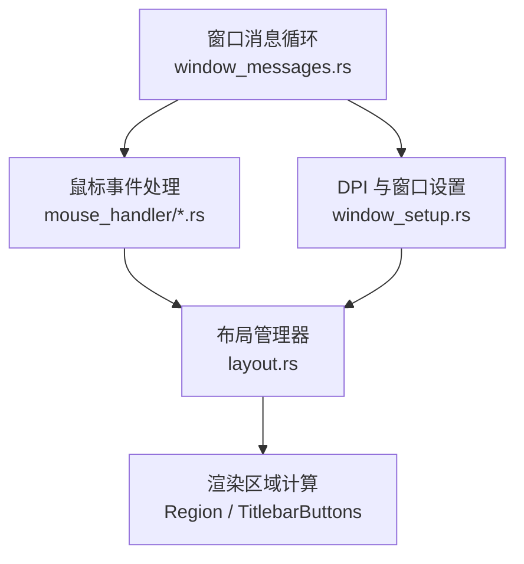
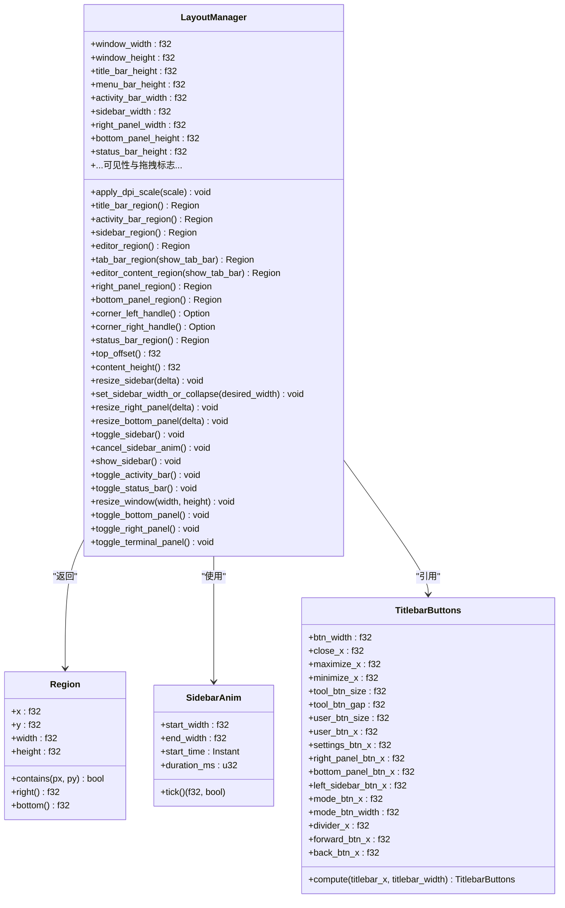
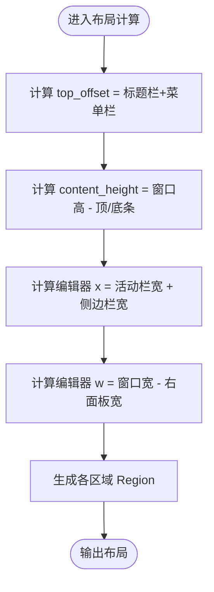
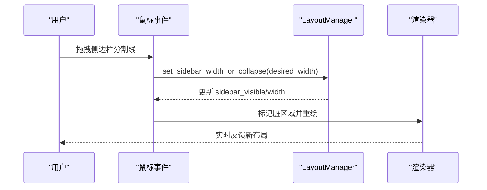
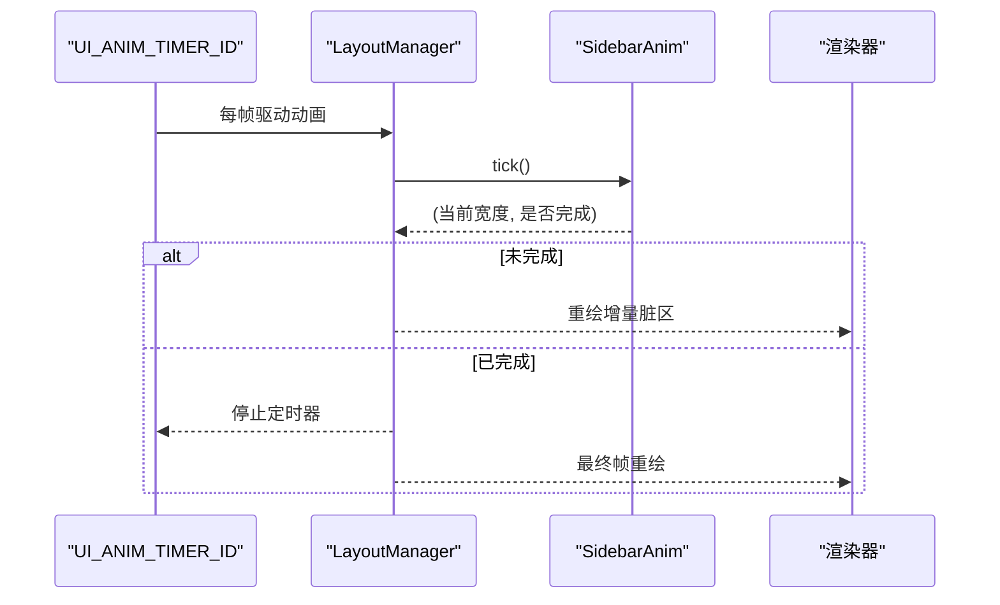
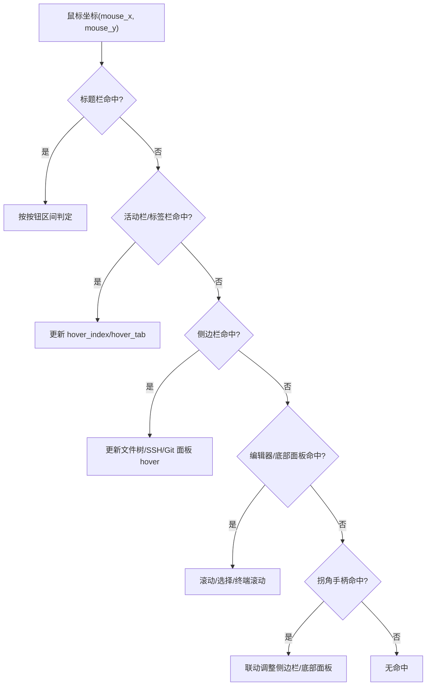
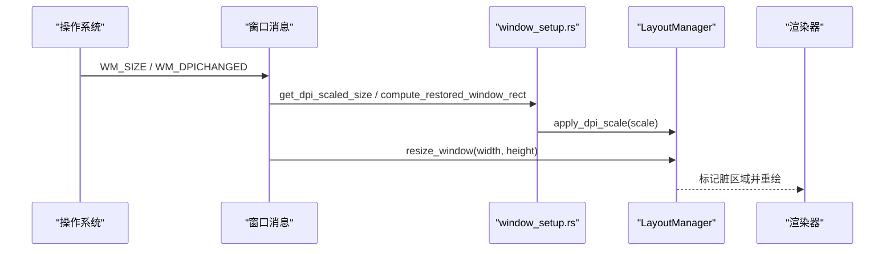
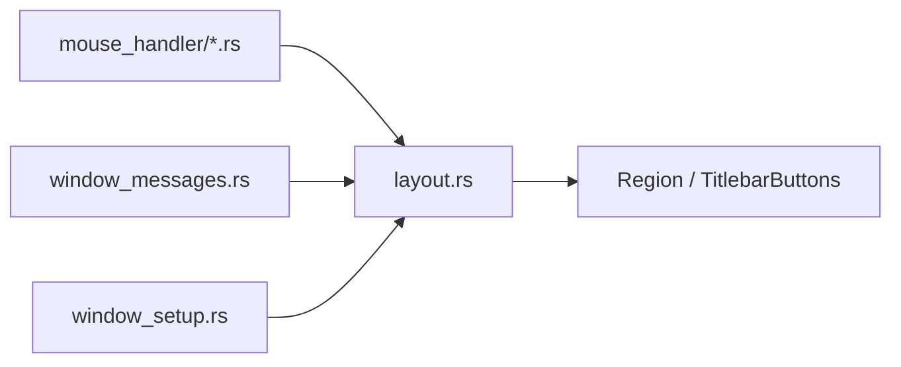

# 布局计算引擎

<cite>
**本文引用的文件**
- [crates/aether-win32/src/layout.rs](file://crates/aether-win32/src/layout.rs)
- [crates/aether-ui/src/layout.rs](file://crates/aether-ui/src/layout.rs)
- [crates/aether-win32/src/window/mouse_handler.rs](file://crates/aether-win32/src/window/mouse_handler.rs)
- [crates/aether-win32/src/window/mouse_handler/l_button_down.rs](file://crates/aether-win32/src/window/mouse_handler/l_button_down.rs)
- [crates/aether-win32/src/window/mouse_handler/mouse_move.rs](file://crates/aether-win32/src/window/mouse_handler/mouse_move.rs)
- [crates/aether-win32/src/window/window_setup.rs](file://crates/aether-win32/src/window/window_setup.rs)
- [crates/aether-win32/src/window/window_messages.rs](file://crates/aether-win32/src/window/window_messages.rs)
</cite>

## 目录
1. [简介](#简介)
2. [项目结构](#项目结构)
3. [核心组件](#核心组件)
4. [架构总览](#架构总览)
5. [详细组件分析](#详细组件分析)
6. [依赖关系分析](#依赖关系分析)
7. [性能考量](#性能考量)
8. [故障排查指南](#故障排查指南)
9. [结论](#结论)
10. [附录](#附录)

## 简介
本文件为牧羊人编辑器的“布局计算引擎”提供系统化文档，聚焦 LayoutManager 的设计原理与实现机制。内容涵盖窗口区域几何计算、响应式布局算法、动态面板调整逻辑；详细说明标题栏、活动栏、侧边栏、编辑器区域、状态栏等区域的坐标与尺寸计算方法；解释布局动画系统（侧边栏展开/收起动画、面板拖拽调整）；并说明 DPI 缩放处理、高 DPI 显示器适配与多显示器支持。文末提供关键流程的图示与代码片段路径，便于快速定位实现。

## 项目结构
布局相关能力主要分布在以下模块：
- 布局定义与计算：aether-win32/layout.rs 与 aether-ui/layout.rs（两者均包含 Region、LayoutManager、SidebarAnim、TitlebarButtons 等）
- 鼠标交互与拖拽：window/mouse_handler 系列（左键按下、移动、释放等）
- DPI 与窗口设置：window/window_setup.rs（DPI 感知、窗口矩形持久化）
- 定时器与 UI 动画驱动：window/window_messages.rs（UI_ANIM_TIMER_ID 等）

图表来源
- [crates/aether-win32/src/window/window_messages.rs:21-59](file://crates/aether-win32/src/window/window_messages.rs#L21-L59)
- [crates/aether-win32/src/window/mouse_handler.rs:44-148](file://crates/aether-win32/src/window/mouse_handler.rs#L44-L148)
- [crates/aether-win32/src/layout.rs:237-700](file://crates/aether-win32/src/layout.rs#L237-L700)
- [crates/aether-win32/src/window/window_setup.rs:17-99](file://crates/aether-win32/src/window/window_setup.rs#L17-L99)

章节来源
- [crates/aether-win32/src/layout.rs:1-236](file://crates/aether-win32/src/layout.rs#L1-L236)
- [crates/aether-ui/src/layout.rs:1-221](file://crates/aether-ui/src/layout.rs#L1-L221)
- [crates/aether-win32/src/window/mouse_handler.rs:1-406](file://crates/aether-win32/src/window/mouse_handler.rs#L1-L406)
- [crates/aether-win32/src/window/window_setup.rs:1-386](file://crates/aether-win32/src/window/window_setup.rs#L1-L386)
- [crates/aether-win32/src/window/window_messages.rs:1-800](file://crates/aether-win32/src/window/window_messages.rs#L1-L800)

## 核心组件
- Region：表示二维矩形区域，提供 contains、right、bottom 等方法，用于命中测试与区域拼接。
- ActivityBarView/SidebarContent：活动栏视图类型与侧边栏内容类型的映射，支撑不同面板的显示与切换。
- TitlebarButtons：标题栏右侧按钮布局的单一事实源，统一计算窗控按钮、工具按钮、模式切换按钮等位置。
- SidebarAnim：侧边栏宽度动画，线性插值在固定时长内完成展开/收起。
- LayoutManager：布局核心，维护窗口尺寸、各区域尺寸与可见性，提供区域计算、面板调整、动画驱动等接口。

章节来源
- [crates/aether-win32/src/layout.rs:1-236](file://crates/aether-win32/src/layout.rs#L1-L236)
- [crates/aether-ui/src/layout.rs:1-221](file://crates/aether-ui/src/layout.rs#L1-L221)

## 架构总览
布局计算引擎由“数据模型 + 计算层 + 交互层 + 动画层”构成：
- 数据模型：Region、常量（如 TITLE_BAR_HEIGHT、SIDEBAR_WIDTH）、TitlebarButtons
- 计算层：LayoutManager 提供各区域几何计算与面板尺寸调整
- 交互层：鼠标事件处理器根据当前布局进行命中测试与拖拽调整
- 动画层：SidebarAnim 驱动侧边栏平滑过渡，定时器触发重绘

图表来源
- [crates/aether-win32/src/layout.rs:1-236](file://crates/aether-win32/src/layout.rs#L1-L236)
- [crates/aether-win32/src/layout.rs:237-700](file://crates/aether-win32/src/layout.rs#L237-L700)

## 详细组件分析

### 区域几何计算
- 标题栏区域：根据可见性返回全宽或零高度区域。
- 菜单栏区域：位于标题栏下方，合并到标题栏时高度为 0。
- 活动栏区域：左侧窄条，欢迎页上固定常驻。
- 侧边栏区域：跟随活动栏是否显示决定 x 偏移；欢迎页可抑制面板占位。
- 编辑器区域：扣除活动栏、侧边栏与右面板后的剩余空间。
- 标签栏区域：位于编辑器顶部，高度受 show_tab_bar 控制。
- 编辑器内容区域：排除标签栏与底部面板后的高度。
- 右侧面板区域：靠右对齐，宽度可调。
- 底部面板区域：位于编辑器区域下半部分，不横跨侧边栏/活动栏。
- 状态栏区域：位于窗口底部，高度可调。
- 拐角手柄：左下角（侧边栏×底部面板交点）与右下角（右面板×底部面板交点），用于联动调整。

图表来源
- [crates/aether-win32/src/layout.rs:374-578](file://crates/aether-win32/src/layout.rs#L374-L578)

章节来源
- [crates/aether-win32/src/layout.rs:374-578](file://crates/aether-win32/src/layout.rs#L374-L578)

### 响应式布局与动态面板调整
- 侧边栏调整：支持 resize_sidebar、set_sidebar_width_or_collapse（阈值判断拖拽中行为）。
- 右侧面板调整：resize_right_panel 限制最小/最大宽度。
- 底部面板调整：resize_bottom_panel 限制最小/最大高度。
- 可见性切换：toggle_* 方法统一开关面板，并在打开时赋予默认尺寸。
- 欢迎页抑制：welcome_sidebar_suppressed 控制侧边栏面板是否占位，避免影响工作区场景。

图表来源
- [crates/aether-win32/src/window/mouse_handler.rs:44-148](file://crates/aether-win32/src/window/mouse_handler.rs#L44-L148)
- [crates/aether-win32/src/layout.rs:580-648](file://crates/aether-win32/src/layout.rs#L580-L648)

章节来源
- [crates/aether-win32/src/layout.rs:580-648](file://crates/aether-win32/src/layout.rs#L580-L648)
- [crates/aether-win32/src/window/mouse_handler.rs:44-148](file://crates/aether-win32/src/window/mouse_handler.rs#L44-L148)

### 布局动画系统
- 侧边栏展开/收起：通过 SidebarAnim 在固定时长内线性插值宽度；收起时 end_width=0，展开时从 0 到目标宽度。
- 动画驱动：UI_ANIM_TIMER_ID 定时器周期性调用 tick，完成后停止定时器并触发重绘。
- 取消动画：拖拽开始时 cancel_sidebar_anim 中断动画，保证跟手体验。

图表来源
- [crates/aether-win32/src/layout.rs:277-306](file://crates/aether-win32/src/layout.rs#L277-L306)
- [crates/aether-win32/src/window/window_messages.rs:101-115](file://crates/aether-win32/src/window/window_messages.rs#L101-L115)

章节来源
- [crates/aether-win32/src/layout.rs:277-306](file://crates/aether-win32/src/layout.rs#L277-L306)
- [crates/aether-win32/src/window/window_messages.rs:101-115](file://crates/aether-win32/src/window/window_messages.rs#L101-L115)

### 区域检测方法
- 标题栏按钮命中：基于 TitlebarButtons.compute 计算的按钮 X 坐标区间进行悬停检测。
- 活动栏/标签栏命中：结合 activity_bar_region 与 effective_tab_bar_region 进行 hover 判定。
- 侧边栏/编辑器/底部面板命中：使用对应 region.contains 判断鼠标是否在区域内。
- 拐角手柄命中：corner_left_handle/corner_right_handle 返回可选区域，供拖拽联动调整。

图表来源
- [crates/aether-win32/src/window/mouse_handler/mouse_move.rs:599-735](file://crates/aether-win32/src/window/mouse_handler/mouse_move.rs#L599-L735)
- [crates/aether-win32/src/layout.rs:499-536](file://crates/aether-win32/src/layout.rs#L499-L536)

章节来源
- [crates/aether-win32/src/window/mouse_handler/mouse_move.rs:599-735](file://crates/aether-win32/src/window/mouse_handler/mouse_move.rs#L599-L735)
- [crates/aether-win32/src/layout.rs:499-536](file://crates/aether-win32/src/layout.rs#L499-L536)

### 布局更新流程
- 窗口大小变化：on_size 调用 resize_window，更新 window_width/height，并根据最大化/最小化状态冻结/解冻。
- DPI 变化：apply_dpi_scale 按比例换算所有布局常量与用户可调尺寸，保持视觉一致性。
- 面板切换：toggle_* 方法改变可见性与默认尺寸，随后触发重绘。
- 拖拽结束：on_l_button_up 清理拖拽状态，必要时启动收起动画。

图表来源
- [crates/aether-win32/src/window/window_setup.rs:88-99](file://crates/aether-win32/src/window/window_setup.rs#L88-L99)
- [crates/aether-win32/src/layout.rs:339-358](file://crates/aether-win32/src/layout.rs#L339-L358)
- [crates/aether-win32/src/layout.rs:664-668](file://crates/aether-win32/src/layout.rs#L664-L668)

章节来源
- [crates/aether-win32/src/window/window_setup.rs:88-99](file://crates/aether-win32/src/window/window_setup.rs#L88-L99)
- [crates/aether-win32/src/layout.rs:339-358](file://crates/aether-win32/src/layout.rs#L339-L358)
- [crates/aether-win32/src/layout.rs:664-668](file://crates/aether-win32/src/layout.rs#L664-L668)

### 具体代码示例（以路径形式）
- 区域包含测试：[crates/aether-win32/src/layout.rs:706-714](file://crates/aether-win32/src/layout.rs#L706-L714)
- 默认区域断言：[crates/aether-win32/src/layout.rs:800-821](file://crates/aether-win32/src/layout.rs#L800-L821)
- 隐藏活动栏/侧边栏断言：[crates/aether-win32/src/layout.rs:823-858](file://crates/aether-win32/src/layout.rs#L823-L858)
- 右侧/底部面板断言：[crates/aether-win32/src/layout.rs:860-883](file://crates/aether-win32/src/layout.rs#L860-L883)
- 拐角手柄几何断言：[crates/aether-win32/src/layout.rs:885-925](file://crates/aether-win32/src/layout.rs#L885-L925)
- 标签栏与内容区断言：[crates/aether-win32/src/layout.rs:927-957](file://crates/aether-win32/src/layout.rs#L927-L957)
- 侧边栏/右面板/底部面板调整断言：[crates/aether-win32/src/layout.rs:959-1022](file://crates/aether-win32/src/layout.rs#L959-L1022)
- 窗口大小更新断言：[crates/aether-win32/src/layout.rs:1024-1031](file://crates/aether-win32/src/layout.rs#L1024-L1031)
- 状态栏切换断言：[crates/aether-win32/src/layout.rs:1033-1041](file://crates/aether-win32/src/layout.rs#L1033-L1041)
- 顶部偏移与内容高度断言：[crates/aether-win32/src/layout.rs:1043-1058](file://crates/aether-win32/src/layout.rs#L1043-L1058)

## 依赖关系分析
- 布局管理器依赖 Region、常量与 TitlebarButtons，作为单一事实源提供区域计算。
- 鼠标事件处理器依赖 LayoutManager 的区域方法进行命中测试与拖拽调整。
- 定时器模块驱动 UI 动画与后台任务刷新，间接影响布局重绘。
- DPI 设置模块提供缩放因子，确保布局常量与用户可调尺寸在高 DPI 下正确显示。

图表来源
- [crates/aether-win32/src/layout.rs:237-700](file://crates/aether-win32/src/layout.rs#L237-L700)
- [crates/aether-win32/src/window/mouse_handler.rs:44-148](file://crates/aether-win32/src/window/mouse_handler.rs#L44-L148)
- [crates/aether-win32/src/window/window_messages.rs:21-59](file://crates/aether-win32/src/window/window_messages.rs#L21-L59)
- [crates/aether-win32/src/window/window_setup.rs:17-99](file://crates/aether-win32/src/window/window_setup.rs#L17-L99)

章节来源
- [crates/aether-win32/src/layout.rs:237-700](file://crates/aether-win32/src/layout.rs#L237-L700)
- [crates/aether-win32/src/window/mouse_handler.rs:44-148](file://crates/aether-win32/src/window/mouse_handler.rs#L44-L148)
- [crates/aether-win32/src/window/window_messages.rs:21-59](file://crates/aether-win32/src/window/window_messages.rs#L21-L59)
- [crates/aether-win32/src/window/window_setup.rs:17-99](file://crates/aether-win32/src/window/window_setup.rs#L17-L99)

## 性能考量
- 高频鼠标移动节流：面板拖拽同步重绘节流至约 120fps，避免消息洪流压垮渲染管线。
- 增量脏区：仅标记发生变化的区域（标题栏、活动栏、侧边栏、编辑器内容、状态栏等），减少全窗口重绘。
- 动画与定时器：UI_ANIM_TIMER_ID 仅在动画期间运行，结束后自动停止；后台任务在独立定时器中执行，避免阻塞渲染路径。
- DPI 缩放：应用 DPI 变化时按比例换算用户可调尺寸，避免重置导致的重新布局开销。

章节来源
- [crates/aether-win32/src/window/mouse_handler/mouse_move.rs:20-37](file://crates/aether-win32/src/window/mouse_handler/mouse_move.rs#L20-L37)
- [crates/aether-win32/src/window/window_messages.rs:167-236](file://crates/aether-win32/src/window/window_messages.rs#L167-L236)
- [crates/aether-win32/src/layout.rs:339-358](file://crates/aether-win32/src/layout.rs#L339-L358)

## 故障排查指南
- 侧边栏拖拽后未收起：检查 on_l_button_up 中的阈值判断与 SidebarAnim 启动逻辑。
- 标题栏按钮命中错位：确认 TitlebarButtons.compute 与悬停检测使用同一套公式。
- DPI 变化导致尺寸异常：验证 apply_dpi_scale 对 sidebar/right/bottom 面板尺寸的换算。
- 底部面板与编辑器内容重叠：检查 editor_content_region 与 bottom_panel_region 的 y/height 计算。
- 动画不结束：确认 UI_ANIM_TIMER_ID 在动画完成后被停止，且最后一帧已重绘。

章节来源
- [crates/aether-win32/src/window/mouse_handler.rs:44-148](file://crates/aether-win32/src/window/mouse_handler.rs#L44-L148)
- [crates/aether-win32/src/layout.rs:175-215](file://crates/aether-win32/src/layout.rs#L175-L215)
- [crates/aether-win32/src/layout.rs:339-358](file://crates/aether-win32/src/layout.rs#L339-L358)
- [crates/aether-win32/src/layout.rs:456-497](file://crates/aether-win32/src/layout.rs#L456-L497)
- [crates/aether-win32/src/window/window_messages.rs:101-115](file://crates/aether-win32/src/window/window_messages.rs#L101-L115)

## 结论
布局计算引擎通过清晰的区域模型、统一的布局管理器与健壮的交互/动画机制，实现了响应式、可定制、高性能的编辑器界面。DPI 缩放与多显示器支持确保了在不同环境下的一致体验。建议后续继续优化：
- 进一步抽象区域组合规则，降低耦合度
- 扩展更多面板的联动调整策略
- 完善单元测试覆盖复杂交互场景

## 附录
- 常用常量参考：TITLE_BAR_HEIGHT、MENU_BAR_HEIGHT、ACTIVITY_BAR_WIDTH、SIDEBAR_WIDTH、STATUS_BAR_HEIGHT、TAB_BAR_HEIGHT、MIN_SIDEBAR_WIDTH、MAX_SIDEBAR_WIDTH、CORNER_HANDLE_SIZE、MIN_BOTTOM_PANEL_HEIGHT、MIN_RIGHT_PANEL_WIDTH、SIDEBAR_RESIZE_GRAB、ACTIVITY_BAR_BUTTON_SIZE、FILE_TREE_ROW_HEIGHT、FILE_TREE_INDENT、FILE_TREE_HEADER_HEIGHT、FILE_TREE_ARROW_COL
- 关键方法参考：apply_dpi_scale、title_bar_region、activity_bar_region、sidebar_region、editor_region、tab_bar_region、editor_content_region、right_panel_region、bottom_panel_region、corner_left_handle、corner_right_handle、status_bar_region、top_offset、content_height、resize_sidebar、set_sidebar_width_or_collapse、resize_right_panel、resize_bottom_panel、toggle_sidebar、cancel_sidebar_anim、show_sidebar、toggle_activity_bar、toggle_status_bar、resize_window、toggle_bottom_panel、toggle_right_panel、toggle_terminal_panel

章节来源
- [crates/aether-win32/src/layout.rs:125-236](file://crates/aether-win32/src/layout.rs#L125-L236)
- [crates/aether-ui/src/layout.rs:125-221](file://crates/aether-ui/src/layout.rs#L125-L221)
- [crates/aether-win32/src/layout.rs:339-700](file://crates/aether-win32/src/layout.rs#L339-L700)