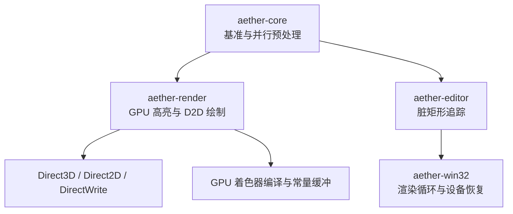
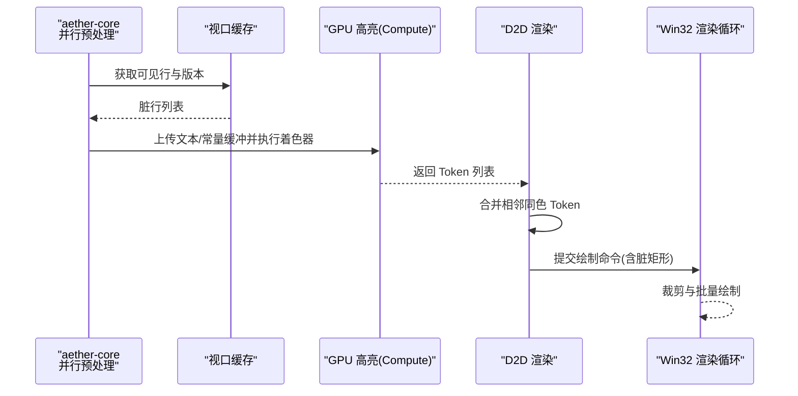
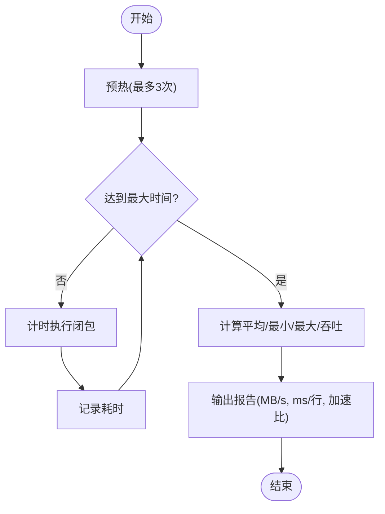
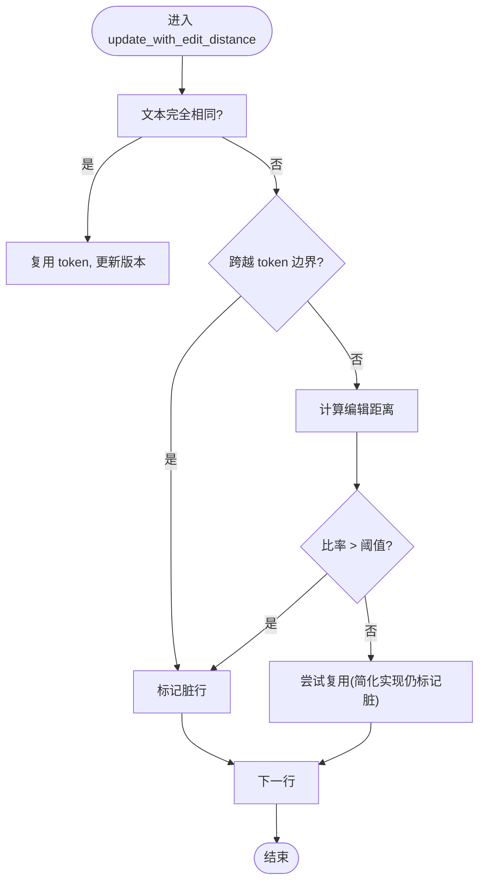
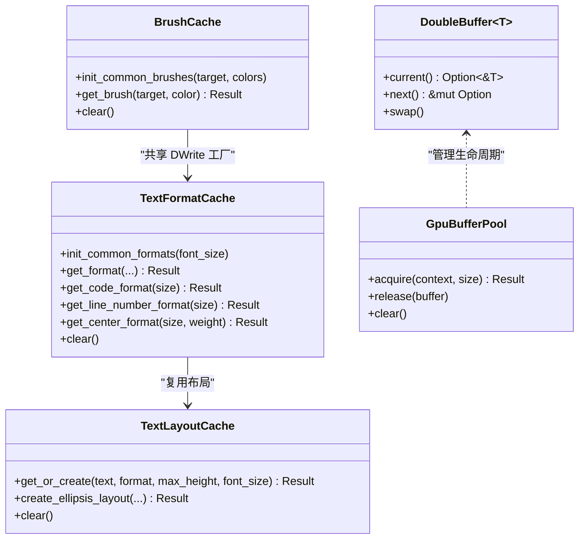
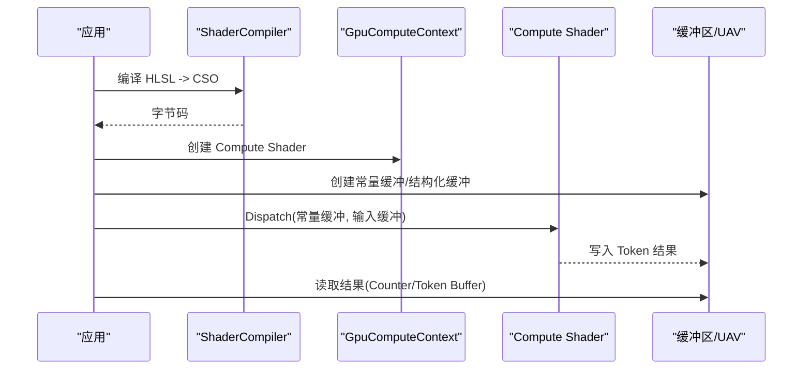
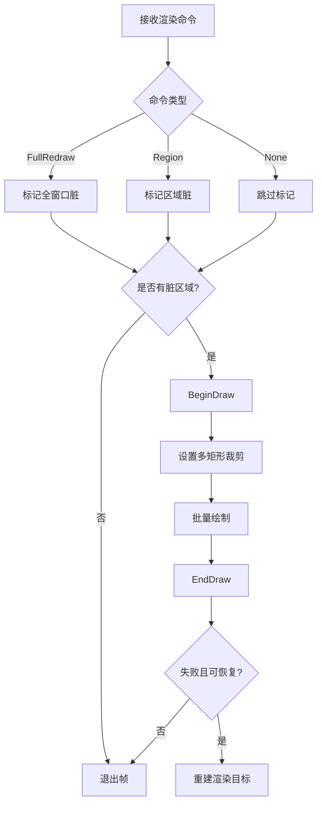
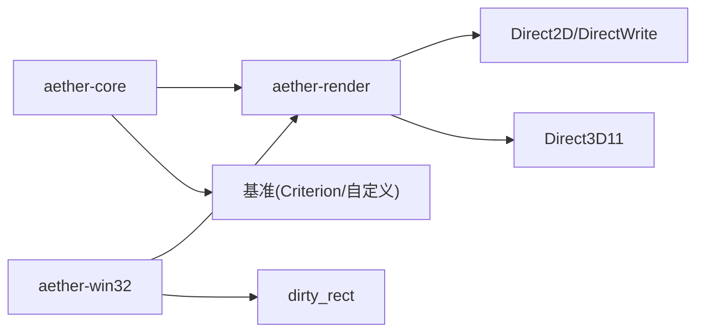

# 性能调优

<cite>
**本文引用的文件**
- [crates/aether-render/src/gpu/benchmark.rs](file://crates/aether-render/src/gpu/benchmark.rs)
- [crates/aether-core/benches/lexer_bench.rs](file://crates/aether-core/benches/lexer_bench.rs)
- [crates/aether-core/examples/perf_test.rs](file://crates/aether-core/examples/perf_test.rs)
- [crates/aether-core/examples/benchmark.rs](file://crates/aether-core/examples/benchmark.rs)
- [crates/aether-core/src/benchmarks.rs](file://crates/aether-core/src/benchmarks.rs)
- [crates/aether-render/src/gpu/render.rs](file://crates/aether-render/src/gpu/render.rs)
- [crates/aether-render/src/gpu/viewport.rs](file://crates/aether-render/src/gpu/viewport.rs)
- [crates/aether-render/src/d2d/brush_cache.rs](file://crates/aether-render/src/d2d/brush_cache.rs)
- [crates/aether-render/src/gpu/shader.rs](file://crates/aether-render/src/gpu/shader.rs)
- [crates/aether-core/src/render_prep.rs](file://crates/aether-core/src/render_prep.rs)
- [crates/aether-editor/src/dirty_rect.rs](file://crates/aether-editor/src/dirty_rect.rs)
- [crates/aether-win32/src/render/mod.rs](file://crates/aether-win32/src/render/mod.rs)
- [tests/tools/coverage.ps1](file://tests/tools/coverage.ps1)
</cite>

## 目录
1. [简介](#简介)
2. [项目结构](#项目结构)
3. [核心组件](#核心组件)
4. [架构总览](#架构总览)
5. [详细组件分析](#详细组件分析)
6. [依赖关系分析](#依赖关系分析)
7. [性能考量](#性能考量)
8. [故障排查指南](#故障排查指南)
9. [结论](#结论)
10. [附录](#附录)

## 简介
本文件面向牧羊人编辑器的渲染性能调优，聚焦以下目标：
- 建立可复用的基准测试与性能指标收集体系，覆盖词法分析、GPU 高亮、绘制调用合并等关键路径。
- 提供系统化的瓶颈识别方法：从视口增量更新、纹理/布局缓存命中、绘制批量化到 GPU 管线吞吐。
- 给出优化策略与实践：GPU 加速利用、纹理/布局缓存优化、绘制调用批量化、内存使用优化。
- 说明如何使用现有工具定位渲染瓶颈并评估优化效果，覆盖大文件编辑、复杂语法高亮、AI 面板渲染等场景。
- 通过代码级示例路径展示如何编写性能测试用例、采集监控数据、对比优化前后效果。

## 项目结构
本项目在渲染性能方面由多个子系统协作完成：
- 基准与评测：core 层提供通用基准框架与示例；render 层提供针对词法分析的 GPU/CPU 方案对比基准。
- 渲染管线：GPU 高亮（Compute Shader）+ D2D/DirectWrite 绘制；视口增量缓存减少重复计算；双缓冲与缓冲区池降低分配开销。
- 绘制优化：画刷/文本格式/TextLayout 多级缓存；脏矩形裁剪减少重绘区域。
- 窗口与事件：Win32 渲染循环集成脏矩形与设备丢失恢复。

图表来源
- [crates/aether-core/src/benchmarks.rs:1-87](file://crates/aether-core/src/benchmarks.rs#L1-L87)
- [crates/aether-render/src/gpu/render.rs:1-126](file://crates/aether-render/src/gpu/render.rs#L1-L126)
- [crates/aether-render/src/d2d/brush_cache.rs:1-105](file://crates/aether-render/src/d2d/brush_cache.rs#L1-L105)
- [crates/aether-editor/src/dirty_rect.rs:92-138](file://crates/aether-editor/src/dirty_rect.rs#L92-L138)
- [crates/aether-win32/src/render/mod.rs:514-660](file://crates/aether-win32/src/render/mod.rs#L514-L660)
- [crates/aether-render/src/gpu/shader.rs:1-150](file://crates/aether-render/src/gpu/shader.rs#L1-L150)

章节来源
- [crates/aether-core/src/benchmarks.rs:1-87](file://crates/aether-core/src/benchmarks.rs#L1-L87)
- [crates/aether-render/src/gpu/render.rs:1-126](file://crates/aether-render/src/gpu/render.rs#L1-L126)
- [crates/aether-render/src/d2d/brush_cache.rs:1-105](file://crates/aether-render/src/d2d/brush_cache.rs#L1-L105)
- [crates/aether-editor/src/dirty_rect.rs:92-138](file://crates/aether-editor/src/dirty_rect.rs#L92-L138)
- [crates/aether-win32/src/render/mod.rs:514-660](file://crates/aether-win32/src/render/mod.rs#L514-L660)
- [crates/aether-render/src/gpu/shader.rs:1-150](file://crates/aether-render/src/gpu/shader.rs#L1-L150)

## 核心组件
- 基准测试框架
  - 通用基准运行器：支持预热、最大时间限制、统计平均/最小/最大耗时与吞吐量。
  - 词法分析基准：对比 GPU、CPU 手写 lexer、tree-sitter 三种方案的吞吐与延迟。
  - Criterion 基准：按语言样本进行吞吐标注与迭代测量。
- 渲染预处理与缓存
  - 并行行级 token 预处理：基于线程池的 par_iter，小行数回退单线程。
  - 视口增量高亮缓存：仅缓存可见窗口范围，结合编辑距离检测标记脏行。
  - 双缓冲与 GPU 缓冲区池：避免频繁分配释放，提升并发流水线效率。
- 绘制优化
  - 画刷/文本格式/TextLayout 缓存：预存常用项 + HashMap 回退，控制最大条目数避免雪崩。
  - 相邻同色 Token 合并：减少 DrawText 调用次数。
  - 脏矩形裁剪：多矩形并集裁剪，避免全窗口重绘。
- GPU 管线
  - Compute Shader 编译与常量缓冲：HLSL 源码编译为 CSO，传递文本长度、最大 Token 数等参数。
  - 视口配置：启用开关、最小文件大小阈值、视口扩展行数、编辑距离阈值、降级策略。

章节来源
- [crates/aether-core/src/benchmarks.rs:1-87](file://crates/aether-core/src/benchmarks.rs#L1-L87)
- [crates/aether-render/src/gpu/benchmark.rs:1-157](file://crates/aether-render/src/gpu/benchmark.rs#L1-L157)
- [crates/aether-core/benches/lexer_bench.rs:136-158](file://crates/aether-core/benches/lexer_bench.rs#L136-L158)
- [crates/aether-core/src/render_prep.rs:13-67](file://crates/aether-core/src/render_prep.rs#L13-L67)
- [crates/aether-render/src/gpu/viewport.rs:1-195](file://crates/aether-render/src/gpu/viewport.rs#L1-L195)
- [crates/aether-render/src/gpu/render.rs:74-126](file://crates/aether-render/src/gpu/render.rs#L74-L126)
- [crates/aether-render/src/d2d/brush_cache.rs:15-105](file://crates/aether-render/src/d2d/brush_cache.rs#L15-L105)
- [crates/aether-render/src/gpu/shader.rs:121-150](file://crates/aether-render/src/gpu/shader.rs#L121-L150)

## 架构总览
下图展示了从输入文本到最终渲染的关键流程，包括 GPU 高亮、视口缓存、绘制批量化与脏矩形裁剪。

图表来源
- [crates/aether-core/src/render_prep.rs:32-60](file://crates/aether-core/src/render_prep.rs#L32-L60)
- [crates/aether-render/src/gpu/viewport.rs:108-164](file://crates/aether-render/src/gpu/viewport.rs#L108-L164)
- [crates/aether-render/src/gpu/render.rs:74-126](file://crates/aether-render/src/gpu/render.rs#L74-L126)
- [crates/aether-win32/src/render/mod.rs:639-660](file://crates/aether-win32/src/render/mod.rs#L639-L660)

## 详细组件分析

### 基准测试与性能指标收集
- 通用基准运行器
  - 功能：预热、最大时间限制、统计平均/最小/最大耗时与吞吐量。
  - 适用：任意闭包函数，便于嵌入不同优化路径的测量。
- 词法分析基准
  - 功能：对比 GPU/CPU/tree-sitter 方案，输出 MB/s、ms/行、加速比。
  - 数据生成：Rust/JS/JSON 等多语言样本，便于跨语言对比。
- Criterion 基准
  - 功能：按语言样本进行吞吐标注与迭代测量，适合回归测试。
- 示例入口
  - 统一入口运行所有基准，便于 CI 或本地快速验证。

图表来源
- [crates/aether-core/src/benchmarks.rs:55-87](file://crates/aether-core/src/benchmarks.rs#L55-L87)
- [crates/aether-render/src/gpu/benchmark.rs:41-92](file://crates/aether-render/src/gpu/benchmark.rs#L41-L92)
- [crates/aether-core/benches/lexer_bench.rs:136-158](file://crates/aether-core/benches/lexer_bench.rs#L136-L158)
- [crates/aether-core/examples/perf_test.rs:1-18](file://crates/aether-core/examples/perf_test.rs#L1-L18)
- [crates/aether-core/examples/benchmark.rs:1-18](file://crates/aether-core/examples/benchmark.rs#L1-L18)

章节来源
- [crates/aether-core/src/benchmarks.rs:1-87](file://crates/aether-core/src/benchmarks.rs#L1-L87)
- [crates/aether-render/src/gpu/benchmark.rs:1-157](file://crates/aether-render/src/gpu/benchmark.rs#L1-L157)
- [crates/aether-core/benches/lexer_bench.rs:136-158](file://crates/aether-core/benches/lexer_bench.rs#L136-L158)
- [crates/aether-core/examples/perf_test.rs:1-18](file://crates/aether-core/examples/perf_test.rs#L1-L18)
- [crates/aether-core/examples/benchmark.rs:1-18](file://crates/aether-core/examples/benchmark.rs#L1-L18)

### 视口增量高亮与编辑距离检测
- 视口缓存
  - 仅缓存可见窗口范围，支持窗口移动与大小调整时保留重叠部分。
  - 每行维护版本号和脏标记，配合外部 buffer_version 实现失效检测。
- 编辑距离检测
  - 快速路径：完全相同则复用 token；跨越 token 边界（引号/注释）直接标记脏。
  - 显著变化阈值：编辑距离超过比例阈值视为显著变化，触发重新高亮。
- 脏行索引
  - 提供全局行号集合，便于只重算必要行。

图表来源
- [crates/aether-render/src/gpu/viewport.rs:108-164](file://crates/aether-render/src/gpu/viewport.rs#L108-L164)
- [crates/aether-render/src/gpu/viewport.rs:197-294](file://crates/aether-render/src/gpu/viewport.rs#L197-L294)

章节来源
- [crates/aether-render/src/gpu/viewport.rs:1-195](file://crates/aether-render/src/gpu/viewport.rs#L1-L195)
- [crates/aether-render/src/gpu/viewport.rs:197-294](file://crates/aether-render/src/gpu/viewport.rs#L197-L294)

### 绘制调用批量化与缓存优化
- 相邻同色 Token 合并
  - 将连续相同类型的 token 合并为单个 span，显著减少 DrawText 调用次数。
- 画刷/文本格式/TextLayout 缓存
  - 预存常用项（颜色画笔、文本格式、布局），未命中回退到 HashMap。
  - 控制最大条目数，避免无界增长导致周期性雪崩。
- 双缓冲与 GPU 缓冲区池
  - 双缓冲用于 CPU/GPU 并行处理；缓冲区池复用 ID3D11Buffer，降低分配/释放成本。

图表来源
- [crates/aether-render/src/d2d/brush_cache.rs:15-105](file://crates/aether-render/src/d2d/brush_cache.rs#L15-L105)
- [crates/aether-render/src/d2d/brush_cache.rs:107-379](file://crates/aether-render/src/d2d/brush_cache.rs#L107-L379)
- [crates/aether-render/src/d2d/brush_cache.rs:381-497](file://crates/aether-render/src/d2d/brush_cache.rs#L381-L497)
- [crates/aether-render/src/gpu/render.rs:128-220](file://crates/aether-render/src/gpu/render.rs#L128-L220)

章节来源
- [crates/aether-render/src/gpu/render.rs:74-126](file://crates/aether-render/src/gpu/render.rs#L74-L126)
- [crates/aether-render/src/d2d/brush_cache.rs:15-105](file://crates/aether-render/src/d2d/brush_cache.rs#L15-L105)
- [crates/aether-render/src/d2d/brush_cache.rs:107-379](file://crates/aether-render/src/d2d/brush_cache.rs#L107-L379)
- [crates/aether-render/src/d2d/brush_cache.rs:381-497](file://crates/aether-render/src/d2d/brush_cache.rs#L381-L497)
- [crates/aether-render/src/gpu/render.rs:128-220](file://crates/aether-render/src/gpu/render.rs#L128-L220)

### GPU 加速与着色器管线
- 着色器编译
  - 使用 d3dcompiler_47.dll 将 HLSL 源码编译为 CSO，支持字符分类、Token 扫描、关键字查找、语法分类等阶段。
- 常量缓冲
  - 向 Shader 传递文本长度、最大 Token 数、DFA 状态数、关键字表大小等参数。
- 缓冲区与 UAV
  - 创建结构化缓冲区与无序访问视图，读取 Token 计数与结果。

图表来源
- [crates/aether-render/src/gpu/shader.rs:1-150](file://crates/aether-render/src/gpu/shader.rs#L1-L150)
- [crates/aether-render/src/gpu/lexer.rs:282-429](file://crates/aether-render/src/gpu/lexer.rs#L282-L429)

章节来源
- [crates/aether-render/src/gpu/shader.rs:1-150](file://crates/aether-render/src/gpu/shader.rs#L1-L150)
- [crates/aether-render/src/gpu/lexer.rs:282-429](file://crates/aether-render/src/gpu/lexer.rs#L282-L429)

### 脏矩形与渲染循环
- 脏矩形追踪
  - 支持全窗口标记与局部区域标记；当数量超过阈值时降级为全窗口重绘。
- 渲染循环
  - 根据命令类型标记脏区域；若无脏区域跳过渲染；使用多矩形并集裁剪减少重绘面积。
- 设备丢失恢复
  - EndDraw 失败时检测可恢复错误并重建渲染目标，防止窗口冻结。

图表来源
- [crates/aether-editor/src/dirty_rect.rs:92-138](file://crates/aether-editor/src/dirty_rect.rs#L92-L138)
- [crates/aether-win32/src/render/mod.rs:514-660](file://crates/aether-win32/src/render/mod.rs#L514-L660)
- [crates/aether-win32/src/render/mod.rs:1087-1108](file://crates/aether-win32/src/render/mod.rs#L1087-L1108)

章节来源
- [crates/aether-editor/src/dirty_rect.rs:92-138](file://crates/aether-editor/src/dirty_rect.rs#L92-L138)
- [crates/aether-win32/src/render/mod.rs:514-660](file://crates/aether-win32/src/render/mod.rs#L514-L660)
- [crates/aether-win32/src/render/mod.rs:1087-1108](file://crates/aether-win32/src/render/mod.rs#L1087-L1108)

## 依赖关系分析
- 模块耦合
  - core 提供并行预处理与基准框架，render 依赖 core 的 Language/LexemeSpan。
  - render 的 GPU 模块依赖 shader 编译与 compute context；D2D 模块依赖 brush/format/layout 缓存。
  - win32 渲染循环依赖 dirty_rect 追踪与 render_ctx 设备管理。
- 外部依赖
  - Direct3D11、Direct2D、DirectWrite 用于 GPU 计算与绘制。
  - rayon 用于并行处理；criterion 用于基准测试。
- 潜在循环依赖
  - 当前结构分层清晰，未见明显循环依赖；注意 render 与 win32 通过命令与上下文解耦。

图表来源
- [crates/aether-core/src/render_prep.rs:1-67](file://crates/aether-core/src/render_prep.rs#L1-L67)
- [crates/aether-render/src/gpu/render.rs:1-126](file://crates/aether-render/src/gpu/render.rs#L1-L126)
- [crates/aether-render/src/d2d/brush_cache.rs:1-105](file://crates/aether-render/src/d2d/brush_cache.rs#L1-L105)
- [crates/aether-editor/src/dirty_rect.rs:92-138](file://crates/aether-editor/src/dirty_rect.rs#L92-L138)
- [crates/aether-win32/src/render/mod.rs:514-660](file://crates/aether-win32/src/render/mod.rs#L514-L660)

章节来源
- [crates/aether-core/src/render_prep.rs:1-67](file://crates/aether-core/src/render_prep.rs#L1-L67)
- [crates/aether-render/src/gpu/render.rs:1-126](file://crates/aether-render/src/gpu/render.rs#L1-L126)
- [crates/aether-render/src/d2d/brush_cache.rs:1-105](file://crates/aether-render/src/d2d/brush_cache.rs#L1-L105)
- [crates/aether-editor/src/dirty_rect.rs:92-138](file://crates/aether-editor/src/dirty_rect.rs#L92-L138)
- [crates/aether-win32/src/render/mod.rs:514-660](file://crates/aether-win32/src/render/mod.rs#L514-L660)

## 性能考量
- GPU 加速利用
  - 对大文件启用 GPU 高亮，小文件回退 CPU 以降低启动开销。
  - 合理设置最小文件大小阈值与视口扩展行数，平衡命中率与带宽。
- 纹理/布局缓存优化
  - 预存常用画刷与文本格式，控制 HashMap 最大条目数避免雪崩。
  - TextLayout 采用两代淘汰策略，热点自然存活，消除周期性掉帧。
- 绘制调用批量化
  - 合并相邻同色 Token，减少 DrawText 调用；使用多矩形裁剪避免包围盒膨胀。
- 内存使用优化
  - 双缓冲与 GPU 缓冲区池复用资源；视口缓存仅维护可见行，降低内存占用。
- 场景化技巧
  - 大文件编辑：增大视口扩展行数，提高缓存命中率；启用 GPU 高亮。
  - 复杂语法高亮：优先使用 GPU 语法分类，置信度不足时回退到 Token 类型。
  - AI 面板渲染：流式增量更新，避免全量重绘；结合脏矩形与缓存命中。

[本节为通用指导，不直接分析具体文件]

## 故障排查指南
- 设备丢失与渲染目标重建
  - EndDraw 失败时检测可恢复错误（如驱动重置、显示器切换），连续失败强制重建，防止窗口冻结。
- 覆盖率与插桩
  - 使用 llvm-profdata 合并 profraw 并生成覆盖率报告，排除第三方依赖，聚焦项目 crate。
- 常见问题定位
  - 若出现规律性掉帧，检查缓存是否“满则全清”；改用两代淘汰策略。
  - 若绘制区域过大，检查脏矩形是否被合并为单一包围盒；启用多矩形并集裁剪。

章节来源
- [crates/aether-win32/src/render/mod.rs:1087-1108](file://crates/aether-win32/src/render/mod.rs#L1087-L1108)
- [tests/tools/coverage.ps1:30-55](file://tests/tools/coverage.ps1#L30-L55)

## 结论
本项目在渲染性能方面已形成较为完整的体系：以基准测试驱动优化，以视口增量与缓存命中为核心，辅以 GPU 加速与绘制批量化，并通过脏矩形裁剪与设备恢复保障稳定性。建议持续完善：
- 扩大基准覆盖范围（更多语言与复杂度）。
- 细化缓存策略（自适应阈值、动态淘汰）。
- 强化监控与可视化（帧内指标上报、CI 回归告警）。

[本节为总结，不直接分析具体文件]

## 附录
- 实用技巧与示例路径
  - 编写性能测试用例：参考基准运行器与 Criterion 基准文件。
  - 采集监控数据：使用内置基准报告与覆盖率脚本。
  - 优化前后对比：使用加速比与吞吐指标评估改进效果。

章节来源
- [crates/aether-core/src/benchmarks.rs:1-87](file://crates/aether-core/src/benchmarks.rs#L1-L87)
- [crates/aether-core/benches/lexer_bench.rs:136-158](file://crates/aether-core/benches/lexer_bench.rs#L136-L158)
- [tests/tools/coverage.ps1:30-55](file://tests/tools/coverage.ps1#L30-L55)