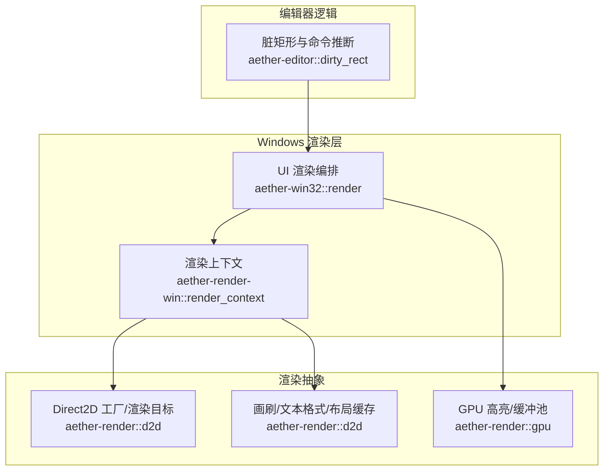
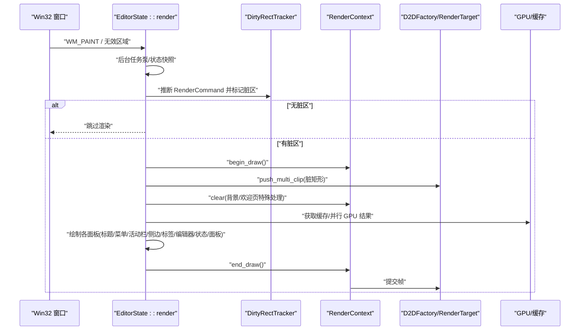
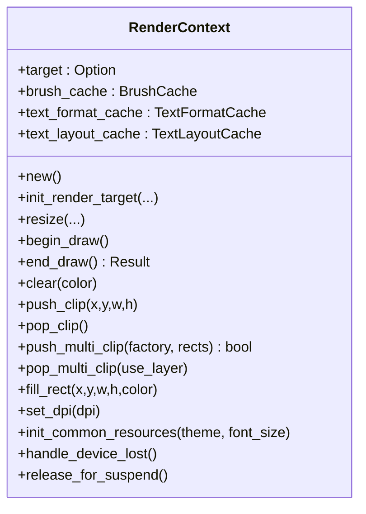
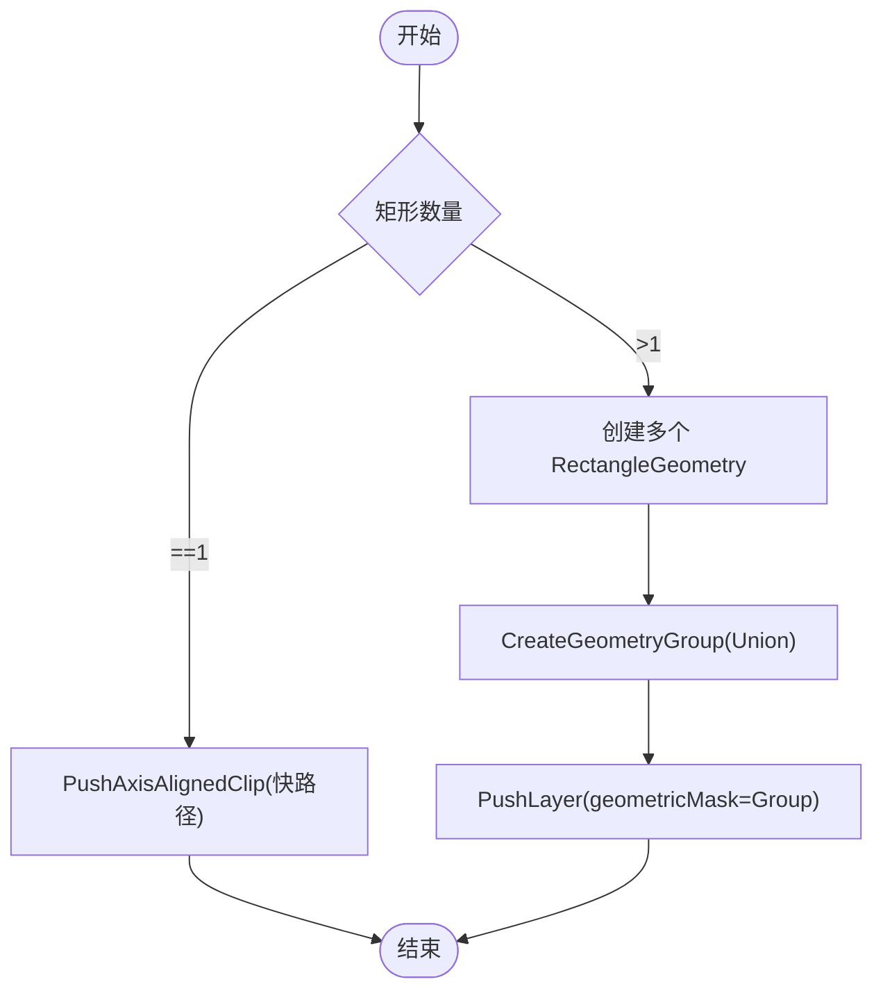
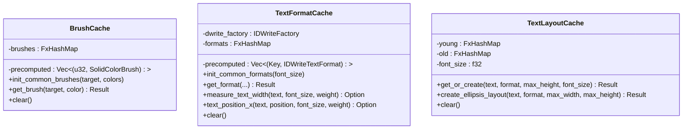
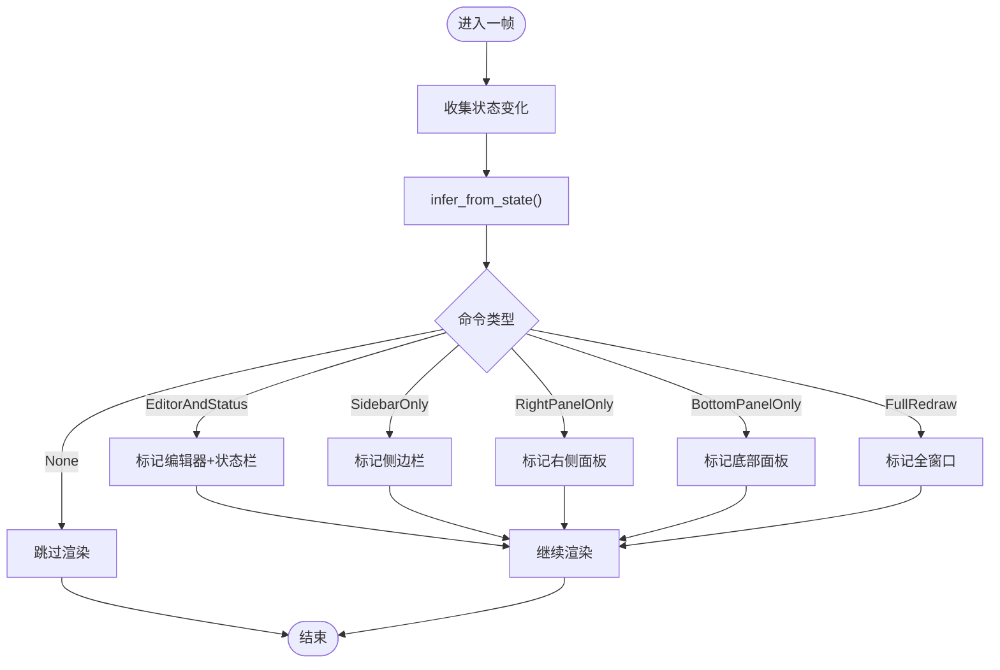
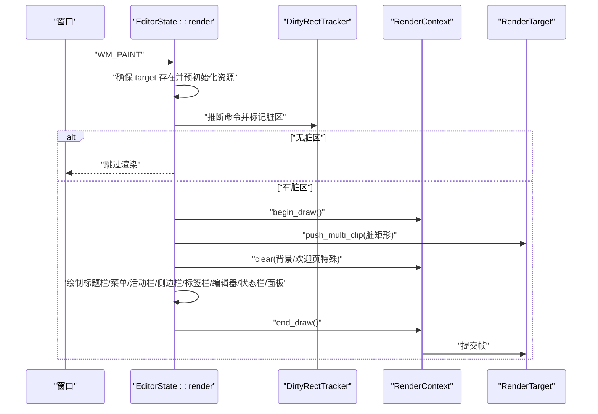
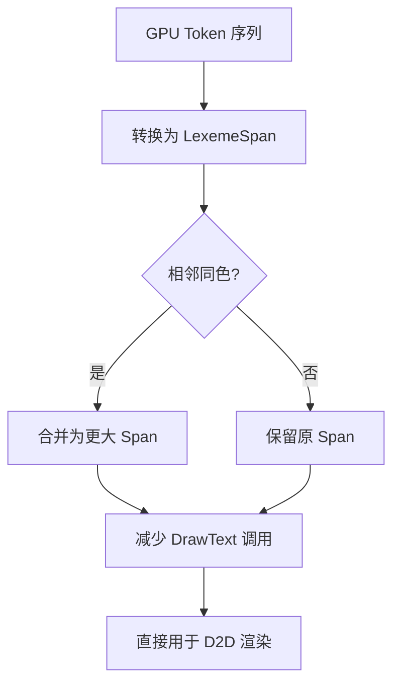
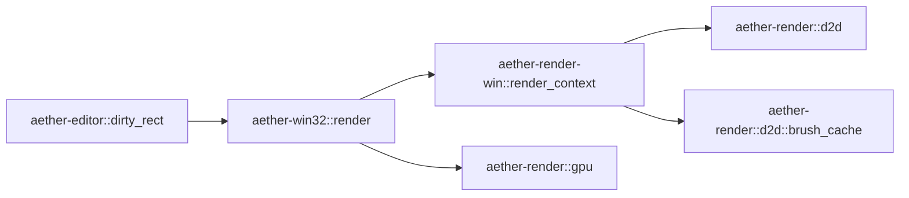

# 渲染管线架构

<cite>
**本文引用的文件**
- [crates/aether-render/src/d2d/factory.rs](file://crates/aether-render/src/d2d/factory.rs)
- [crates/aether-render/src/d2d/brush_cache.rs](file://crates/aether-render/src/d2d/brush_cache.rs)
- [crates/aether-render-win/src/render_context.rs](file://crates/aether-render-win/src/render_context.rs)
- [crates/aether-editor/src/dirty_rect.rs](file://crates/aether-editor/src/dirty_rect.rs)
- [crates/aether-win32/src/render/mod.rs](file://crates/aether-win32/src/render/mod.rs)
- [crates/aether-render/src/gpu/render.rs](file://crates/aether-render/src/gpu/render.rs)
</cite>

## 目录
1. [简介](#简介)
2. [项目结构](#项目结构)
3. [核心组件](#核心组件)
4. [架构总览](#架构总览)
5. [详细组件分析](#详细组件分析)
6. [依赖关系分析](#依赖关系分析)
7. [性能考量](#性能考量)
8. [故障排查指南](#故障排查指南)
9. [结论](#结论)
10. [附录](#附录)

## 简介
本文件系统性梳理牧羊人编辑器的 Direct2D/DirectWrite 渲染管线，覆盖渲染上下文管理、绘制目标创建与销毁、图形资源生命周期管理；并详解场景图构建、脏区域计算、批量绘制优化与硬件加速渲染。文档同时给出初始化、帧循环渲染调用、资源清理等关键实现路径的“代码片段定位”，帮助读者快速定位源码。

## 项目结构
本项目将渲染相关能力分层组织：
- aether-render：跨平台渲染抽象与 GPU/D2D 资源（工厂、渲染目标、画刷/文本缓存、GPU 高亮与缓冲区池）。
- aether-render-win：Windows 侧渲染上下文封装，统一管理与 HWND 渲染目标的交互。
- aether-editor：脏矩形追踪与渲染命令推断，驱动局部重绘策略。
- aether-win32：UI 层渲染编排，负责在 WM_PAINT 中执行完整渲染流程（裁剪、清除、绘制各面板）。

图表来源
- [crates/aether-render/src/d2d/factory.rs:14-63](file://crates/aether-render/src/d2d/factory.rs#L14-L63)
- [crates/aether-render/src/d2d/brush_cache.rs:24-105](file://crates/aether-render/src/d2d/brush_cache.rs#L24-L105)
- [crates/aether-render-win/src/render_context.rs:6-31](file://crates/aether-render-win/src/render_context.rs#L6-L31)
- [crates/aether-editor/src/dirty_rect.rs:87-162](file://crates/aether-editor/src/dirty_rect.rs#L87-L162)
- [crates/aether-win32/src/render/mod.rs:146-210](file://crates/aether-win32/src/render/mod.rs#L146-L210)

章节来源
- [crates/aether-render/src/d2d/factory.rs:14-63](file://crates/aether-render/src/d2d/factory.rs#L14-L63)
- [crates/aether-render/src/d2d/brush_cache.rs:24-105](file://crates/aether-render/src/d2d/brush_cache.rs#L24-L105)
- [crates/aether-render-win/src/render_context.rs:6-31](file://crates/aether-render-win/src/render_context.rs#L6-L31)
- [crates/aether-editor/src/dirty_rect.rs:87-162](file://crates/aether-editor/src/dirty_rect.rs#L87-L162)
- [crates/aether-win32/src/render/mod.rs:146-210](file://crates/aether-win32/src/render/mod.rs#L146-L210)

## 核心组件
- 渲染上下文（RenderContext）：封装 ID2D1HwndRenderTarget、画刷缓存、文本格式/布局缓存，提供 begin/end_draw、clear、push/pop_clip、多矩形裁剪、设备丢失处理等。
- Direct2D 工厂与渲染目标（D2DFactory/RenderTarget）：创建硬件加速的 HWND 渲染目标，支持 DPI 更新、Resize、轴对齐/多矩形裁剪。
- 资源缓存（BrushCache/TextFormatCache/TextLayoutCache）：避免每帧重复创建 COM 对象，采用预存+回退哈希表与两代淘汰策略，显著降低分配与同步开销。
- 脏矩形系统（DirtyRectTracker/RenderCommand）：记录需要重绘的区域，合并重叠矩形，按区域类型精细标记，并在无变化时跳过渲染。
- UI 渲染编排（EditorState::render）：根据脏区域设置裁剪、背景清除、分区域绘制（标题栏、菜单、活动栏、侧边栏、标签栏、编辑器内容、状态栏、右侧/底部面板），并处理欢迎页/智能体模式等特殊分支。
- GPU 高亮与缓冲池：将 GPU 生成的 token 转换为 LexemeSpan，合并相邻同色 token 减少 DrawText 调用；双缓冲与 GPU 缓冲池复用内存，降低 CPU/GPU 同步成本。

章节来源
- [crates/aether-render-win/src/render_context.rs:6-31](file://crates/aether-render-win/src/render_context.rs#L6-L31)
- [crates/aether-render/src/d2d/factory.rs:14-63](file://crates/aether-render/src/d2d/factory.rs#L14-L63)
- [crates/aether-render/src/d2d/brush_cache.rs:24-105](file://crates/aether-render/src/d2d/brush_cache.rs#L24-L105)
- [crates/aether-editor/src/dirty_rect.rs:87-162](file://crates/aether-editor/src/dirty_rect.rs#L87-L162)
- [crates/aether-win32/src/render/mod.rs:146-210](file://crates/aether-win32/src/render/mod.rs#L146-L210)
- [crates/aether-render/src/gpu/render.rs:74-126](file://crates/aether-render/src/gpu/render.rs#L74-L126)

## 架构总览
下图展示从窗口消息到最终像素输出的端到端流程，包括脏区域推断、裁剪、清除、绘制与提交。

图表来源
- [crates/aether-win32/src/render/mod.rs:146-210](file://crates/aether-win32/src/render/mod.rs#L146-L210)
- [crates/aether-editor/src/dirty_rect.rs:368-426](file://crates/aether-editor/src/dirty_rect.rs#L368-L426)
- [crates/aether-render-win/src/render_context.rs:65-79](file://crates/aether-render-win/src/render_context.rs#L65-L79)
- [crates/aether-render/src/d2d/factory.rs:90-125](file://crates/aether-render/src/d2d/factory.rs#L90-L125)

## 详细组件分析

### 渲染上下文（RenderContext）
职责
- 管理 ID2D1HwndRenderTarget 的生命周期（创建、Resize、DPI 更新、设备丢失恢复）。
- 统一管理画刷、文本格式、TextLayout 缓存，提供 begin/end_draw、clear、push/pop_clip、多矩形裁剪、填充矩形等便捷方法。
- 在设备丢失或冻结态释放资源，确保唤醒后按需重建。

关键点
- init_render_target：基于 D2DFactory 创建硬件加速渲染目标，绑定 HWND、物理尺寸与 DPI。
- push_multi_clip/pop_multi_clip：单矩形走快路径（PushAxisAlignedClip），多矩形使用 GeometryGroup + PushLayer 精确裁剪，避免包围盒膨胀。
- handle_device_lost/release_for_suspend：清空 target 与各类缓存，保证一致性。

图表来源
- [crates/aether-render-win/src/render_context.rs:6-31](file://crates/aether-render-win/src/render_context.rs#L6-L31)
- [crates/aether-render-win/src/render_context.rs:33-79](file://crates/aether-render-win/src/render_context.rs#L33-L79)
- [crates/aether-render-win/src/render_context.rs:88-155](file://crates/aether-render-win/src/render_context.rs#L88-L155)
- [crates/aether-render-win/src/render_context.rs:157-231](file://crates/aether-render-win/src/render_context.rs#L157-L231)

章节来源
- [crates/aether-render-win/src/render_context.rs:6-31](file://crates/aether-render-win/src/render_context.rs#L6-L31)
- [crates/aether-render-win/src/render_context.rs:33-79](file://crates/aether-render-win/src/render_context.rs#L33-L79)
- [crates/aether-render-win/src/render_context.rs:88-155](file://crates/aether-render-win/src/render_context.rs#L88-L155)
- [crates/aether-render-win/src/render_context.rs:157-231](file://crates/aether-render-win/src/render_context.rs#L157-L231)

### Direct2D 工厂与渲染目标（D2DFactory/RenderTarget）
职责
- 创建硬件加速的 HWND 渲染目标，配置 DPI、像素尺寸与呈现选项。
- 提供 begin/end_draw、clear、resize、set_dpi、轴对齐裁剪、多矩形裁剪等底层 API。

关键点
- create_hwnd_render_target：以 D2D1_RENDER_TARGET_TYPE_HARDWARE 创建硬件目标，适配 DPI。
- push_multi_clip：当矩形数量 >1 时，构造 ID2D1RectangleGeometry 列表，通过 CreateGeometryGroup(D2D1_FILL_MODE_ALTERNATE) 生成 Union 几何，并使用 PushLayer 的 geometricMask 进行精确裁剪；失败时回退为合并包围盒的轴对齐裁剪。
- set_dpi：显示器切换时更新 DPI，保持坐标一致。

图表来源
- [crates/aether-render/src/d2d/factory.rs:33-63](file://crates/aether-render/src/d2d/factory.rs#L33-L63)
- [crates/aether-render/src/d2d/factory.rs:143-171](file://crates/aether-render/src/d2d/factory.rs#L143-L171)
- [crates/aether-render/src/d2d/factory.rs:172-273](file://crates/aether-render/src/d2d/factory.rs#L172-L273)

章节来源
- [crates/aether-render/src/d2d/factory.rs:33-63](file://crates/aether-render/src/d2d/factory.rs#L33-L63)
- [crates/aether-render/src/d2d/factory.rs:143-171](file://crates/aether-render/src/d2d/factory.rs#L143-L171)
- [crates/aether-render/src/d2d/factory.rs:172-273](file://crates/aether-render/src/d2d/factory.rs#L172-L273)

### 资源缓存（BrushCache/TextFormatCache/TextLayoutCache）
职责
- 避免每帧重复创建 COM 对象（SolidColorBrush、IDWriteTextFormat、IDWriteTextLayout），降低分配与同步开销。
- 采用“预存数组 + 回退哈希表”的两级查找；TextLayoutCache 使用年轻/老代两代淘汰，热点条目自然存活。

关键点
- BrushCache：颜色键化（四通道打包），预存常用主题色画笔；超过最大条目数时清空回退表，防止无界增长。
- TextFormatCache：预存 code/line_number/center 三种常用格式；测量文本宽度与光标位置用于 UI 自适应。
- TextLayoutCache：字体大小变化时自动清空；create_ellipsis_layout 支持省略号截断。

图表来源
- [crates/aether-render/src/d2d/brush_cache.rs:24-105](file://crates/aether-render/src/d2d/brush_cache.rs#L24-L105)
- [crates/aether-render/src/d2d/brush_cache.rs:107-313](file://crates/aether-render/src/d2d/brush_cache.rs#L107-L313)
- [crates/aether-render/src/d2d/brush_cache.rs:381-497](file://crates/aether-render/src/d2d/brush_cache.rs#L381-L497)

章节来源
- [crates/aether-render/src/d2d/brush_cache.rs:24-105](file://crates/aether-render/src/d2d/brush_cache.rs#L24-L105)
- [crates/aether-render/src/d2d/brush_cache.rs:107-313](file://crates/aether-render/src/d2d/brush_cache.rs#L107-L313)
- [crates/aether-render/src/d2d/brush_cache.rs:381-497](file://crates/aether-render/src/d2d/brush_cache.rs#L381-L497)

### 脏矩形系统与渲染命令推断
职责
- 记录当前帧需要重绘的矩形区域，合并重叠区域，支持按区域类型（编辑器、侧边栏、状态栏等）标记。
- 根据状态变化推断最优渲染命令（None/EditorOnly/SidebarOnly/FullRedraw 等），在无变化时跳过渲染。

关键点
- mark_region/mark_full_window：忽略零/负尺寸，全窗口标记会屏蔽后续局部标记。
- merge_all_rects：当脏矩形过多时触发合并，超过阈值降级为全窗口重绘。
- infer_from_state：综合光标移动、选择变化、滚动、侧边栏/面板可见性、对话框显示等，返回最小必要重绘范围。

图表来源
- [crates/aether-editor/src/dirty_rect.rs:87-162](file://crates/aether-editor/src/dirty_rect.rs#L87-L162)
- [crates/aether-editor/src/dirty_rect.rs:368-426](file://crates/aether-editor/src/dirty_rect.rs#L368-L426)

章节来源
- [crates/aether-editor/src/dirty_rect.rs:87-162](file://crates/aether-editor/src/dirty_rect.rs#L87-L162)
- [crates/aether-editor/src/dirty_rect.rs:368-426](file://crates/aether-editor/src/dirty_rect.rs#L368-L426)

### UI 渲染编排（EditorState::render）
职责
- 在 WM_PAINT 中完成完整渲染流程：确保渲染目标存在、预初始化资源、计算可见行范围、增量缓存重建、布局计算、脏区域推断与裁剪、背景清除、分区域绘制、EndDraw 提交。
- 特殊优化：菜单 hover 快速路径（仅重绘不透明菜单本体）、欢迎页背景填充、智能体模式布局差异。

关键点
- 初始化：若 target 为空则重建，并预初始化常用画刷与文本格式。
- 裁剪：非全窗口且存在脏区时，使用多矩形并集裁剪，减少无关绘制。
- 背景：全窗口重绘时 clear；欢迎页+裁剪时需手动填充侧边栏/活动栏/右侧面板/底部面板背景，避免黑色空洞。
- 错误恢复：EndDraw 失败时检测可恢复错误码，必要时重建渲染目标并清理图标缓存。

图表来源
- [crates/aether-win32/src/render/mod.rs:146-210](file://crates/aether-win32/src/render/mod.rs#L146-L210)
- [crates/aether-win32/src/render/mod.rs:639-731](file://crates/aether-win32/src/render/mod.rs#L639-L731)
- [crates/aether-win32/src/render/mod.rs:1087-1108](file://crates/aether-win32/src/render/mod.rs#L1087-L1108)

章节来源
- [crates/aether-win32/src/render/mod.rs:146-210](file://crates/aether-win32/src/render/mod.rs#L146-L210)
- [crates/aether-win32/src/render/mod.rs:639-731](file://crates/aether-win32/src/render/mod.rs#L639-L731)
- [crates/aether-win32/src/render/mod.rs:1087-1108](file://crates/aether-win32/src/render/mod.rs#L1087-L1108)

### GPU 高亮与批量绘制优化
职责
- 将 GPU 生成的 token 转换为 LexemeSpan，并根据语法分类决定 TokenKind。
- 合并相邻同色 token，减少 DrawText 调用次数。
- 双缓冲与 GPU 缓冲池复用内存，降低 CPU/GPU 同步与分配开销。

关键点
- gpu_tokens_to_lexeme_spans：优先使用高置信度语法分类，否则回退到 token_type。
- merge_same_color_tokens：连续相同 kind 的 token 合并为一个 span，显著减少绘制批次。
- DoubleBuffer/GpuBufferPool：读写分离与池化复用，提升吞吐。

图表来源
- [crates/aether-render/src/gpu/render.rs:7-32](file://crates/aether-render/src/gpu/render.rs#L7-L32)
- [crates/aether-render/src/gpu/render.rs:74-126](file://crates/aether-render/src/gpu/render.rs#L74-L126)
- [crates/aether-render/src/gpu/render.rs:128-220](file://crates/aether-render/src/gpu/render.rs#L128-L220)

章节来源
- [crates/aether-render/src/gpu/render.rs:7-32](file://crates/aether-render/src/gpu/render.rs#L7-L32)
- [crates/aether-render/src/gpu/render.rs:74-126](file://crates/aether-render/src/gpu/render.rs#L74-L126)
- [crates/aether-render/src/gpu/render.rs:128-220](file://crates/aether-render/src/gpu/render.rs#L128-L220)

## 依赖关系分析
- EditorState::render 依赖 DirtyRectTracker 进行脏区推断，依赖 RenderContext 管理绘制目标与资源，依赖 D2DFactory/RenderTarget 执行底层绘制。
- RenderContext 依赖 BrushCache/TextFormatCache/TextLayoutCache 避免频繁 COM 对象创建。
- GPU 模块输出 token/span，供上层渲染器直接使用，减少 CPU 转换与绘制批次。

图表来源
- [crates/aether-editor/src/dirty_rect.rs:368-426](file://crates/aether-editor/src/dirty_rect.rs#L368-L426)
- [crates/aether-win32/src/render/mod.rs:146-210](file://crates/aether-win32/src/render/mod.rs#L146-L210)
- [crates/aether-render-win/src/render_context.rs:6-31](file://crates/aether-render-win/src/render_context.rs#L6-L31)
- [crates/aether-render/src/d2d/factory.rs:14-63](file://crates/aether-render/src/d2d/factory.rs#L14-L63)
- [crates/aether-render/src/d2d/brush_cache.rs:24-105](file://crates/aether-render/src/d2d/brush_cache.rs#L24-L105)
- [crates/aether-render/src/gpu/render.rs:74-126](file://crates/aether-render/src/gpu/render.rs#L74-L126)

章节来源
- [crates/aether-editor/src/dirty_rect.rs:368-426](file://crates/aether-editor/src/dirty_rect.rs#L368-L426)
- [crates/aether-win32/src/render/mod.rs:146-210](file://crates/aether-win32/src/render/mod.rs#L146-L210)
- [crates/aether-render-win/src/render_context.rs:6-31](file://crates/aether-render-win/src/render_context.rs#L6-L31)
- [crates/aether-render/src/d2d/factory.rs:14-63](file://crates/aether-render/src/d2d/factory.rs#L14-L63)
- [crates/aether-render/src/d2d/brush_cache.rs:24-105](file://crates/aether-render/src/d2d/brush_cache.rs#L24-L105)
- [crates/aether-render/src/gpu/render.rs:74-126](file://crates/aether-render/src/gpu/render.rs#L74-L126)

## 性能考量
- 脏矩形与多矩形裁剪：仅在需要时重绘，使用 GeometryGroup + PushLayer 精确裁剪，避免包围盒膨胀导致的多余绘制。
- 资源缓存：预存常用画刷/文本格式，TextLayoutCache 两代淘汰，显著降低 COM 对象分配与同步开销。
- 批量绘制：合并相邻同色 token，减少 DrawText 调用；GPU 高亮与缓冲池复用内存，降低 CPU/GPU 同步。
- 快速路径：菜单 hover 时仅重绘不透明菜单本体，跳过整条渲染管线，消除滑动卡顿。
- 设备丢失恢复：EndDraw 失败时检测可恢复错误码，必要时重建渲染目标并清理图标缓存，避免窗口永久冻结。

[本节为通用性能讨论，无需特定文件引用]

## 故障排查指南
常见问题与对策
- EndDraw 失败导致丢帧：检查错误码是否为 D2DERR_RECREATE_TARGET 或 D2DERR_DISPLAY_STATE_INVALID；若是，调用 handle_device_lost 重建渲染目标并清理图标缓存。
- 菜单 hover 闪烁或隔次丢失：快速路径 EndDraw 失败时，记录警告并强制全窗口重绘恢复。
- 欢迎页背景空洞：在欢迎页+裁剪模式下，需手动填充侧边栏/活动栏/右侧面板/底部面板背景，避免未覆盖区域显示为黑色。
- 设备丢失/冻结：若连续 EndDraw 失败达到阈值，无论错误码均强制重建，防止未知错误导致窗口冻结。

章节来源
- [crates/aether-win32/src/render/mod.rs:1087-1108](file://crates/aether-win32/src/render/mod.rs#L1087-L1108)
- [crates/aether-render-win/src/render_context.rs:219-231](file://crates/aether-render-win/src/render_context.rs#L219-L231)

## 结论
该渲染管线通过脏矩形与多矩形裁剪、资源缓存、GPU 高亮与批量优化、快速路径与设备丢失恢复等机制，实现了高效、稳定、可扩展的 Direct2D/DirectWrite 渲染。其分层设计清晰，便于维护与扩展；在实际使用中，应重点关注 EndDraw 错误恢复与欢迎页背景填充等边界情况。

[本节为总结性内容，无需特定文件引用]

## 附录
- 初始化示例（代码片段定位）
  - 创建渲染上下文与预初始化资源：[crates/aether-render-win/src/render_context.rs:21-31](file://crates/aether-render-win/src/render_context.rs#L21-L31)、[crates/aether-render-win/src/render_context.rs:189-217](file://crates/aether-render-win/src/render_context.rs#L189-L217)
  - 创建 HWND 渲染目标：[crates/aether-render/src/d2d/factory.rs:33-63](file://crates/aether-render/src/d2d/factory.rs#L33-L63)
- 帧循环中的渲染调用（代码片段定位）
  - 渲染入口与资源就绪检查：[crates/aether-win32/src/render/mod.rs:146-210](file://crates/aether-win32/src/render/mod.rs#L146-L210)
  - 脏区推断与裁剪：[crates/aether-editor/src/dirty_rect.rs:368-426](file://crates/aether-editor/src/dirty_rect.rs#L368-L426)、[crates/aether-win32/src/render/mod.rs:639-731](file://crates/aether-win32/src/render/mod.rs#L639-L731)
  - 提交帧：[crates/aether-render/src/d2d/factory.rs:90-125](file://crates/aether-render/src/d2d/factory.rs#L90-L125)
- 资源清理（代码片段定位）
  - 设备丢失处理：[crates/aether-render-win/src/render_context.rs:219-231](file://crates/aether-render-win/src/render_context.rs#L219-L231)
  - 图标缓存清理：[crates/aether-win32/src/render/mod.rs:1087-1108](file://crates/aether-win32/src/render/mod.rs#L1087-L1108)

[本节为参考索引，无需额外来源标注]