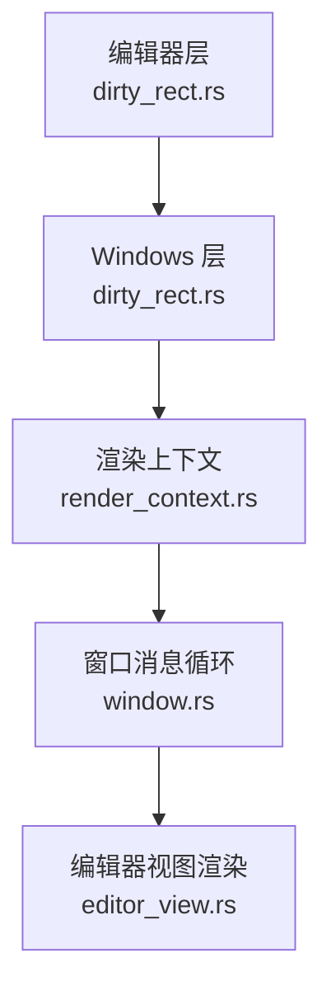
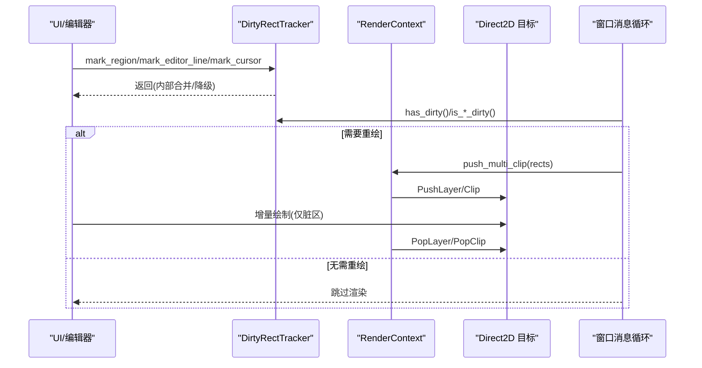
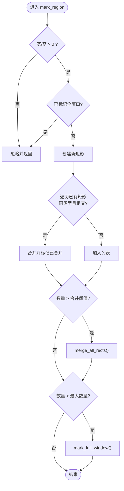
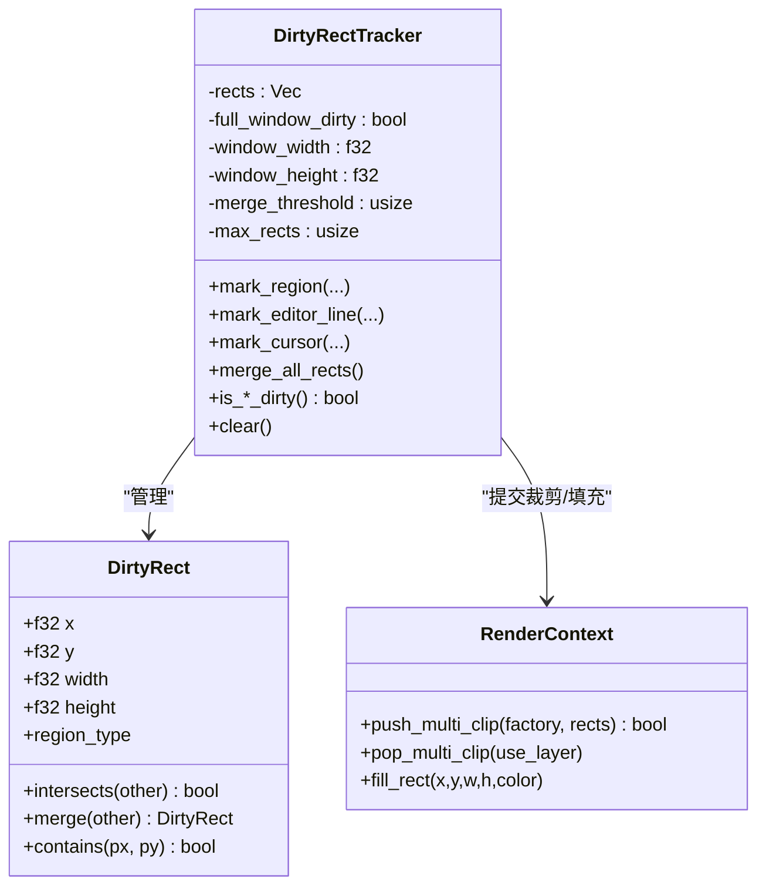
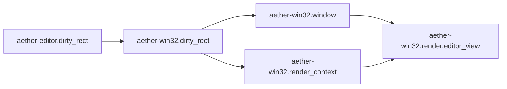

# 脏矩形优化

<cite>
**本文引用的文件**
- [crates/aether-editor/src/dirty_rect.rs](file://crates/aether-editor/src/dirty_rect.rs)
- [crates/aether-win32/src/dirty_rect.rs](file://crates/aether-win32/src/dirty_rect.rs)
- [crates/aether-win32/src/render_context.rs](file://crates/aether-win32/src/render_context.rs)
- [crates/aether-win32/src/window.rs](file://crates/aether-win32/src/window.rs)
- [crates/aether-win32/src/render/editor_view.rs](file://crates/aether-win32/src/render/editor_view.rs)
</cite>

## 目录
1. [简介](#简介)
2. [项目结构](#项目结构)
3. [核心组件](#核心组件)
4. [架构总览](#架构总览)
5. [详细组件分析](#详细组件分析)
6. [依赖关系分析](#依赖关系分析)
7. [性能考量](#性能考量)
8. [故障排查指南](#故障排查指南)
9. [结论](#结论)
10. [附录](#附录)

## 简介
本文件系统性梳理牧羊人编辑器的“脏矩形优化系统”，围绕无效区域检测、增量重绘、绘制区域合并与渲染管线集成展开。重点说明：
- 脏矩形的生成与管理：文本变更、UI 状态变化、滚动操作等如何触发脏区域标记。
- 脏矩形合并算法：如何通过同类型重叠合并减少重绘次数，并在数量过多时降级为全窗口重绘。
- 与渲染管线的集成：从脏矩形到实际绘制调用的转换过程，包括多矩形裁剪与局部背景清除。
- 最佳实践：在高频更新场景下保持低开销与高帧率的策略。

## 项目结构
脏矩形系统由两部分组成：
- 编辑器层（aether-editor）：定义脏矩形数据结构、追踪器与渲染命令推断逻辑，供上层业务调用。
- Windows 平台层（aether-win32）：提供与 Direct2D 渲染上下文集成的能力，支持多矩形裁剪与局部填充。

图表来源
- [crates/aether-editor/src/dirty_rect.rs:1-426](file://crates/aether-editor/src/dirty_rect.rs#L1-L426)
- [crates/aether-win32/src/dirty_rect.rs:1-426](file://crates/aether-win32/src/dirty_rect.rs#L1-L426)
- [crates/aether-win32/src/render_context.rs:100-155](file://crates/aether-win32/src/render_context.rs#L100-L155)
- [crates/aether-win32/src/window.rs:84-93](file://crates/aether-win32/src/window.rs#L84-L93)
- [crates/aether-win32/src/render/editor_view.rs:126-158](file://crates/aether-win32/src/render/editor_view.rs#L126-L158)

章节来源
- [crates/aether-editor/src/dirty_rect.rs:1-426](file://crates/aether-editor/src/dirty_rect.rs#L1-L426)
- [crates/aether-win32/src/dirty_rect.rs:1-426](file://crates/aether-win32/src/dirty_rect.rs#L1-L426)
- [crates/aether-win32/src/render_context.rs:100-155](file://crates/aether-win32/src/render_context.rs#L100-L155)
- [crates/aether-win32/src/window.rs:84-93](file://crates/aether-win32/src/window.rs#L84-L93)
- [crates/aether-win32/src/render/editor_view.rs:126-158](file://crates/aether-win32/src/render/editor_view.rs#L126-L158)

## 核心组件
- 脏矩形 DirtyRect：包含坐标、宽高与区域类型，支持相交判断、合并与点包含测试。
- 脏矩形追踪器 DirtyRectTracker：维护当前帧的脏矩形列表、全窗口标记、阈值控制与合并策略。
- 渲染命令 RenderCommand：根据 UI 状态变化推断最小必要重绘范围，避免无变化的全量重绘。
- 渲染上下文扩展：提供多矩形裁剪与局部背景填充，配合脏矩形实现增量绘制。

章节来源
- [crates/aether-editor/src/dirty_rect.rs:8-366](file://crates/aether-editor/src/dirty_rect.rs#L8-L366)
- [crates/aether-win32/src/dirty_rect.rs:8-366](file://crates/aether-win32/src/dirty_rect.rs#L8-L366)
- [crates/aether-win32/src/render_context.rs:100-155](file://crates/aether-win32/src/render_context.rs#L100-L155)

## 架构总览
脏矩形系统贯穿“事件/状态变更 → 标记脏区域 → 合并与降级 → 渲染裁剪 → 增量绘制”的完整链路。

图表来源
- [crates/aether-editor/src/dirty_rect.rs:120-162](file://crates/aether-editor/src/dirty_rect.rs#L120-L162)
- [crates/aether-win32/src/dirty_rect.rs:120-162](file://crates/aether-win32/src/dirty_rect.rs#L120-L162)
- [crates/aether-win32/src/render_context.rs:100-155](file://crates/aether-win32/src/render_context.rs#L100-L155)
- [crates/aether-win32/src/window.rs:84-93](file://crates/aether-win32/src/window.rs#L84-L93)

## 详细组件分析

### 脏矩形与区域类型
- 区域类型覆盖标题栏、菜单栏、活动栏、侧边栏、编辑器内容、标签栏、状态栏、右侧面板、底部面板、查找替换、对话框、全窗口等。
- 通过类型隔离不同 UI 子系统的重绘需求，避免相互干扰。

章节来源
- [crates/aether-editor/src/dirty_rect.rs:8-35](file://crates/aether-editor/src/dirty_rect.rs#L8-L35)
- [crates/aether-win32/src/dirty_rect.rs:8-35](file://crates/aether-win32/src/dirty_rect.rs#L8-L35)

### 脏矩形基础操作
- 相交判断：用于快速检测是否需要合并。
- 合并算法：对同类型且相交的矩形进行包围盒合并，减少绘制调用。
- 点包含：用于命中测试或调试。

章节来源
- [crates/aether-editor/src/dirty_rect.rs:58-85](file://crates/aether-editor/src/dirty_rect.rs#L58-L85)
- [crates/aether-win32/src/dirty_rect.rs:58-85](file://crates/aether-win32/src/dirty_rect.rs#L58-L85)

### 脏矩形追踪器
- 标记区域：忽略零/负尺寸；在全窗口标记后忽略局部标记；自动合并同类型相交矩形；超过阈值触发合并；超过最大数量降级为全窗口。
- 便捷标记：按行标记、光标标记、状态栏标记。
- 查询接口：是否全窗口、是否有脏区、各区域是否需要重绘、获取全窗口矩形。
- 生命周期：resize 更新尺寸并标记全窗口；clear 清理脏标记。

图表来源
- [crates/aether-editor/src/dirty_rect.rs:120-162](file://crates/aether-editor/src/dirty_rect.rs#L120-L162)
- [crates/aether-editor/src/dirty_rect.rs:336-356](file://crates/aether-editor/src/dirty_rect.rs#L336-L356)
- [crates/aether-win32/src/dirty_rect.rs:120-162](file://crates/aether-win32/src/dirty_rect.rs#L120-L162)
- [crates/aether-win32/src/dirty_rect.rs:336-356](file://crates/aether-win32/src/dirty_rect.rs#L336-L356)

章节来源
- [crates/aether-editor/src/dirty_rect.rs:102-366](file://crates/aether-editor/src/dirty_rect.rs#L102-L366)
- [crates/aether-win32/src/dirty_rect.rs:102-366](file://crates/aether-win32/src/dirty_rect.rs#L102-L366)

### 渲染命令推断
- 基于 UI 状态（光标移动、选择变化、文本编辑、滚动、侧边栏/右侧面板/底部面板变化、状态变化、对话框可见性）推断最小重绘范围。
- 无状态变化时返回“无需重绘”，避免空转渲染。

章节来源
- [crates/aether-editor/src/dirty_rect.rs:368-426](file://crates/aether-editor/src/dirty_rect.rs#L368-L426)
- [crates/aether-win32/src/dirty_rect.rs:368-426](file://crates/aether-win32/src/dirty_rect.rs#L368-L426)

### 与渲染管线的集成
- 多矩形裁剪：当脏矩形较多时，使用 push_multi_clip 将多个矩形作为裁剪区域，失败时回退到合并包围盒的单矩形快路径。
- 局部背景清除：fill_rect 用于在增量绘制前清除脏区背景，避免残影。
- 窗口失效机制：invalidate_window 将 WM_PAINT 请求交给系统合并，避免重复渲染。

图表来源
- [crates/aether-editor/src/dirty_rect.rs:37-366](file://crates/aether-editor/src/dirty_rect.rs#L37-L366)
- [crates/aether-win32/src/dirty_rect.rs:37-366](file://crates/aether-win32/src/dirty_rect.rs#L37-L366)
- [crates/aether-win32/src/render_context.rs:100-155](file://crates/aether-win32/src/render_context.rs#L100-L155)

章节来源
- [crates/aether-win32/src/render_context.rs:100-155](file://crates/aether-win32/src/render_context.rs#L100-L155)
- [crates/aether-win32/src/window.rs:84-93](file://crates/aether-win32/src/window.rs#L84-L93)

### 编辑器视图中的脏区应用
- 编辑器渲染时使用裁剪限制行内容、光标、补全提示等仅在可视区域内绘制，避免溢出到标签栏等上层元素。
- 结合脏矩形，可仅对受影响行或光标区域进行增量绘制。

章节来源
- [crates/aether-win32/src/render/editor_view.rs:126-158](file://crates/aether-win32/src/render/editor_view.rs#L126-L158)

## 依赖关系分析
- aether-editor.dirty_rect 提供通用脏矩形与命令推断，被 aether-win32.dirty_rect 复用或对齐实现。
- aether-win32.render_context 提供底层 Direct2D 裁剪与填充能力，支撑脏矩形到实际绘制的转换。
- aether-win32.window 负责窗口消息循环与失效通知，驱动按需重绘。
- aether-win32.render.editor_view 在编辑器渲染阶段利用裁剪与脏区信息进行增量绘制。

图表来源
- [crates/aether-editor/src/dirty_rect.rs:1-426](file://crates/aether-editor/src/dirty_rect.rs#L1-L426)
- [crates/aether-win32/src/dirty_rect.rs:1-426](file://crates/aether-win32/src/dirty_rect.rs#L1-L426)
- [crates/aether-win32/src/render_context.rs:100-155](file://crates/aether-win32/src/render_context.rs#L100-L155)
- [crates/aether-win32/src/window.rs:84-93](file://crates/aether-win32/src/window.rs#L84-L93)
- [crates/aether-win32/src/render/editor_view.rs:126-158](file://crates/aether-win32/src/render/editor_view.rs#L126-L158)

章节来源
- [crates/aether-editor/src/dirty_rect.rs:1-426](file://crates/aether-editor/src/dirty_rect.rs#L1-L426)
- [crates/aether-win32/src/dirty_rect.rs:1-426](file://crates/aether-win32/src/dirty_rect.rs#L1-L426)
- [crates/aether-win32/src/render_context.rs:100-155](file://crates/aether-win32/src/render_context.rs#L100-L155)
- [crates/aether-win32/src/window.rs:84-93](file://crates/aether-win32/src/window.rs#L84-L93)
- [crates/aether-win32/src/render/editor_view.rs:126-158](file://crates/aether-win32/src/render/editor_view.rs#L126-L158)

## 性能考量
- 合并阈值与最大数量：当脏矩形数量超过阈值时主动合并，超过最大数量时降级为全窗口重绘，避免 O(n^2) 合并与过多绘制调用。
- 类型隔离：仅合并同类型矩形，防止无关区域被错误扩大。
- 无变化不渲染：通过 RenderCommand 推断，在无状态变化时直接跳过渲染。
- 多矩形裁剪：优先使用多矩形裁剪，失败时回退到单矩形包围盒，保证鲁棒性与性能平衡。
- 局部背景清除：在增量绘制前仅清除脏区背景，减少多余绘制。

[本节为通用性能建议，不直接分析具体文件]

## 故障排查指南
- 现象：频繁全窗口重绘
  - 检查是否频繁调用 mark_full_window 或 resize。
  - 确认 mark_region 的尺寸是否为正数，避免无效标记。
  - 观察 merge_threshold 与 max_rects 配置是否合理。
- 现象：部分区域未更新
  - 确认 is_*_dirty 查询的区域类型与实际标记一致。
  - 检查 push_multi_clip 是否成功，必要时查看回退到单矩形包围盒的情况。
- 现象：闪烁或残影
  - 确保在增量绘制前调用 fill_rect 清除脏区背景。
  - 校验裁剪区域与绘制区域边界是否一致。

章节来源
- [crates/aether-editor/src/dirty_rect.rs:120-162](file://crates/aether-editor/src/dirty_rect.rs#L120-L162)
- [crates/aether-win32/src/dirty_rect.rs:120-162](file://crates/aether-win32/src/dirty_rect.rs#L120-L162)
- [crates/aether-win32/src/render_context.rs:100-155](file://crates/aether-win32/src/render_context.rs#L100-L155)

## 结论
脏矩形优化系统通过精确的区域标记、智能合并与降级策略，以及与 Direct2D 的多矩形裁剪集成，显著减少了不必要的重绘，提升了编辑器在高负载下的渲染性能。配合无状态不渲染的策略与局部背景清除，可在复杂交互场景中保持稳定帧率与流畅体验。

[本节为总结性内容，不直接分析具体文件]

## 附录
- 关键 API 参考路径
  - 脏矩形与追踪器：[crates/aether-editor/src/dirty_rect.rs:8-366](file://crates/aether-editor/src/dirty_rect.rs#L8-L366)、[crates/aether-win32/src/dirty_rect.rs:8-366](file://crates/aether-win32/src/dirty_rect.rs#L8-L366)
  - 渲染命令推断：[crates/aether-editor/src/dirty_rect.rs:368-426](file://crates/aether-editor/src/dirty_rect.rs#L368-L426)、[crates/aether-win32/src/dirty_rect.rs:368-426](file://crates/aether-win32/src/dirty_rect.rs#L368-L426)
  - 多矩形裁剪与局部填充：[crates/aether-win32/src/render_context.rs:100-155](file://crates/aether-win32/src/render_context.rs#L100-L155)
  - 窗口失效与消息循环：[crates/aether-win32/src/window.rs:84-93](file://crates/aether-win32/src/window.rs#L84-L93)
  - 编辑器视图裁剪示例：[crates/aether-win32/src/render/editor_view.rs:126-158](file://crates/aether-win32/src/render/editor_view.rs#L126-L158)

[本节为索引信息，不直接分析具体文件]