# 窗口管理系统

<cite>
**本文引用的文件**
- [window.rs](file://crates/aether-win32/src/window.rs)
- [window_setup.rs](file://crates/aether-win32/src/window/window_setup.rs)
- [window_messages.rs](file://crates/aether-win32/src/window/window_messages.rs)
- [mouse_handler.rs](file://crates/aether-win32/src/window/mouse_handler.rs)
- [keyboard_handler.rs](file://crates/aether-win32/src/window/keyboard_handler.rs)
- [editor/mod.rs](file://crates/aether-win32/src/editor/mod.rs)
</cite>

## 目录
1. [简介](#简介)
2. [项目结构](#项目结构)
3. [核心组件](#核心组件)
4. [架构总览](#架构总览)
5. [详细组件分析](#详细组件分析)
6. [依赖关系分析](#依赖关系分析)
7. [性能考量](#性能考量)
8. [故障排查指南](#故障排查指南)
9. [结论](#结论)
10. [附录](#附录)

## 简介
本文件面向牧羊人编辑器的窗口管理系统，聚焦基于 Win32 API 的窗口创建、注册与生命周期管理。内容涵盖：
- 窗口类注册、窗口样式配置
- DWM Acrylic/Mica 效果启用
- 多窗口支持机制
- 窗口状态管理、DPI 感知模式设置、窗口尺寸恢复、图标加载
- 窗口过程函数（WndProc）的设计模式与消息分发机制
- 关键实现示例路径：窗口创建流程、DPI 缩放处理、窗口状态持久化等

## 项目结构
窗口管理相关代码集中在 aether-win32 模块中，采用“主入口 + 子模块”的组织方式：
- window.rs：窗口生命周期、消息循环、WndProc、全局状态与定时器常量
- window/window_setup.rs：DPI 感知、DWM 效果、窗口矩形恢复、启动参数应用、退出持久化
- window/window_messages.rs：各类 WM_* 消息处理（定时器、拖放、大小变化、DPI 变化等）
- window/mouse_handler.rs：鼠标事件处理（点击、滚轮、双击等）
- window/keyboard_handler.rs：键盘事件处理（字符输入、按键组合等）
- editor/mod.rs：编辑器状态聚合（布局、LSP、标签页、远程等），被窗口层通过 Rc<RefCell<EditorState>> 访问

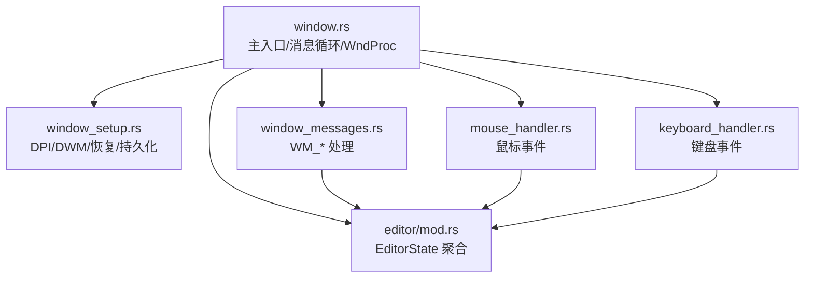

图表来源
- [window.rs:132-204](file://crates/aether-win32/src/window.rs#L132-L204)
- [window_setup.rs:17-86](file://crates/aether-win32/src/window/window_setup.rs#L17-L86)
- [window_messages.rs:21-60](file://crates/aether-win32/src/window/window_messages.rs#L21-L60)

章节来源
- [window.rs:132-204](file://crates/aether-win32/src/window.rs#L132-L204)
- [window_setup.rs:17-86](file://crates/aether-win32/src/window/window_setup.rs#L17-L86)

## 核心组件
- 窗口类与实例
  - 窗口类名与标题常量定义于窗口模块，用于 WNDCLASSW 注册与 CreateWindowExW 创建
  - 应用图标加载失败时回退到系统默认图标
- 窗口创建与初始化
  - 根据是否为主窗口从设置中恢复上次位置/尺寸/最大化状态
  - 计算 DPI 缩放后的默认尺寸作为回退值
  - 启用 DWM 背景（Acrylic/Mica）、深色沉浸式模式、非客户区渲染策略
  - 初始化 EditorState、DPI 缩放因子、IME、渲染目标并首次渲染
  - 安装低层键盘钩子与多个定时器（终端刷新、AI 后台刷新、冰冻看门狗等）
- 多窗口支持
  - 使用线程局部 EDITOR_STATE 保存当前活跃窗口状态
  - 使用原子计数器 WINDOW_COUNT 控制应用退出时机（所有窗口关闭才退出）
  - 通过自定义消息 WM_APP+2 创建新窗口，避免重入问题
- 消息分发与 WndProc
  - 统一在 WndProc 内按消息类型分派到具体处理函数
  - 对 panic 进行 catch_unwind 保护，确保 FFI 边界稳定
  - 用户输入会刷新空闲计时，必要时解冻冰冻态
- 状态持久化
  - 退出前持久化窗口矩形、最大化标志、AI 打开标签快照
  - 仅当窗口非最大化且尺寸合理时才更新坐标/宽高

章节来源
- [window.rs:32-55](file://crates/aether-win32/src/window.rs#L32-L55)
- [window.rs:73-128](file://crates/aether-win32/src/window.rs#L73-L128)
- [window.rs:132-204](file://crates/aether-win32/src/window.rs#L132-L204)
- [window.rs:206-338](file://crates/aether-win32/src/window.rs#L206-L338)
- [window.rs:355-446](file://crates/aether-win32/src/window.rs#L355-L446)
- [window_setup.rs:101-178](file://crates/aether-win32/src/window/window_setup.rs#L101-L178)
- [window_setup.rs:180-266](file://crates/aether-win32/src/window/window_setup.rs#L180-L266)
- [window_setup.rs:309-385](file://crates/aether-win32/src/window/window_setup.rs#L309-L385)

## 架构总览
下图展示了窗口创建、DPI 设置、DWM 效果启用、状态初始化与消息循环的整体流程。

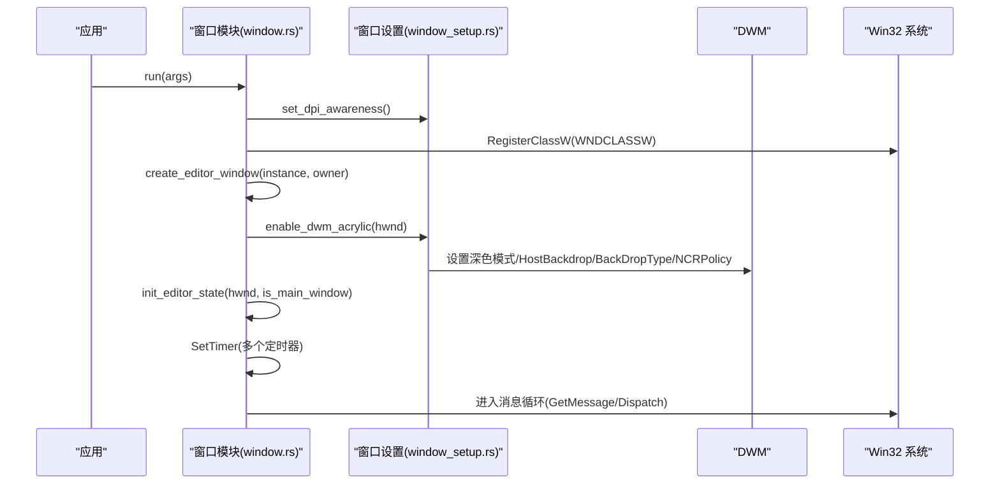

图表来源
- [window.rs:132-204](file://crates/aether-win32/src/window.rs#L132-L204)
- [window.rs:206-338](file://crates/aether-win32/src/window.rs#L206-L338)
- [window_setup.rs:17-86](file://crates/aether-win32/src/window/window_setup.rs#L17-L86)

## 详细组件分析

### 窗口类注册与样式配置
- 窗口类名与标题常量集中定义，便于统一管理
- 窗口类样式启用双击消息（CS_DBLCLKS），以便双击选词等交互
- 光标使用系统箭头，背景画刷为空，图标优先使用应用 ICO
- 主窗口与子窗口使用不同的扩展样式（WS_EX_APPWINDOW | WS_EX_WINDOWEDGE vs WS_EX_APPWINDOW）

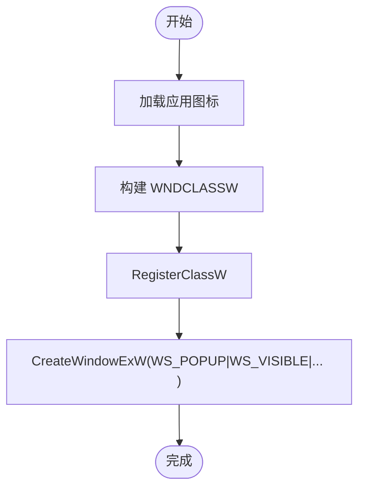

图表来源
- [window.rs:163-178](file://crates/aether-win32/src/window.rs#L163-L178)
- [window.rs:230-257](file://crates/aether-win32/src/window.rs#L230-L257)

章节来源
- [window.rs:163-178](file://crates/aether-win32/src/window.rs#L163-L178)
- [window.rs:230-257](file://crates/aether-win32/src/window.rs#L230-L257)

### DWM Acrylic/Mica 效果启用
- 启用沉浸式暗色模式
- 启用主机 backdrop brush（Windows 11）
- 设置 Backdrop Type 为 Mica Alt，使标题栏与客户区均透出背景
- 兼容旧属性以启用 Mica
- 禁用非客户区渲染策略，使透明区域可透出模糊背景

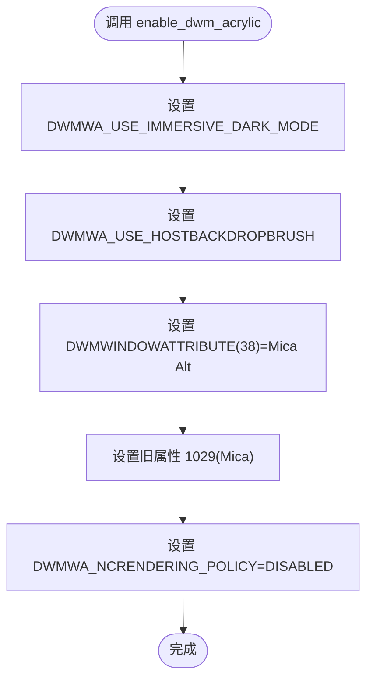

图表来源
- [window_setup.rs:32-86](file://crates/aether-win32/src/window/window_setup.rs#L32-L86)

章节来源
- [window_setup.rs:32-86](file://crates/aether-win32/src/window/window_setup.rs#L32-L86)

### DPI 感知与缩放
- 进程级 DPI 感知设置为 Per-Monitor V2，失败时回退至 Per-Monitor
- 获取系统 DPI 并计算逻辑像素到物理像素的缩放比例
- 窗口初始化时读取实际 DPI，应用到布局常量与 IME 尺寸
- 窗口大小变化或 DPI 变化时重新计算并触发重绘

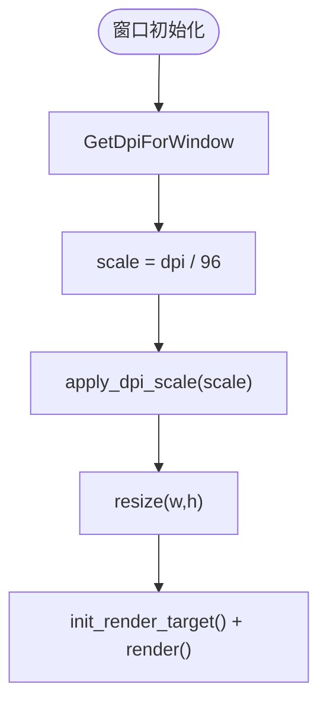

图表来源
- [window_setup.rs:17-30](file://crates/aether-win32/src/window/window_setup.rs#L17-L30)
- [window_setup.rs:88-99](file://crates/aether-win32/src/window/window_setup.rs#L88-L99)
- [window.rs:281-313](file://crates/aether-win32/src/window.rs#L281-L313)

章节来源
- [window_setup.rs:17-30](file://crates/aether-win32/src/window/window_setup.rs#L17-L30)
- [window_setup.rs:88-99](file://crates/aether-win32/src/window/window_setup.rs#L88-L99)
- [window.rs:281-313](file://crates/aether-win32/src/window.rs#L281-L313)

### 窗口尺寸恢复与持久化
- 主窗口启动时从设置中恢复上次位置/尺寸/最大化状态
- 校验恢复矩形是否位于已连接显示器上，否则回退默认
- 拒绝异常尺寸（过小或负值）
- 退出前持久化窗口矩形与最大化标志；若最大化则不覆盖正常矩形
- AI 打开标签页快照按工作区哈希持久化，过滤无意义对话

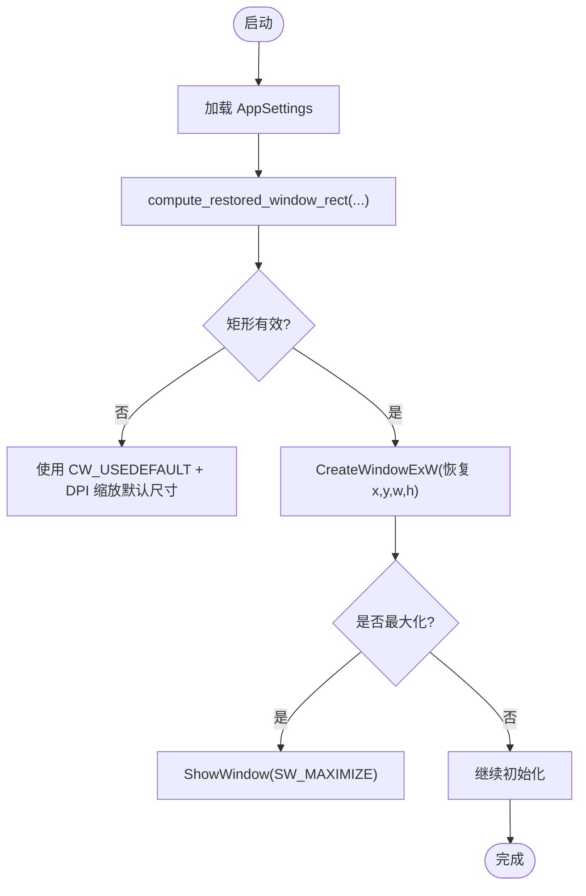

图表来源
- [window_setup.rs:101-178](file://crates/aether-win32/src/window/window_setup.rs#L101-L178)
- [window.rs:214-279](file://crates/aether-win32/src/window.rs#L214-L279)

章节来源
- [window_setup.rs:101-178](file://crates/aether-win32/src/window/window_setup.rs#L101-L178)
- [window.rs:214-279](file://crates/aether-win32/src/window.rs#L214-L279)

### 多窗口支持与消息路由
- 每个窗口拥有独立的 EditorState，并通过 GWLP_USERDATA 存储指针
- 线程局部 EDITOR_STATE 保存当前活跃窗口状态，防止多窗口消息交错
- 通过 WM_APP+2 创建新窗口，避免在 RefCell 借用期间弹模态导致重入 panic
- 使用原子计数器 WINDOW_COUNT 控制应用退出：最后一个窗口销毁时 PostQuitMessage

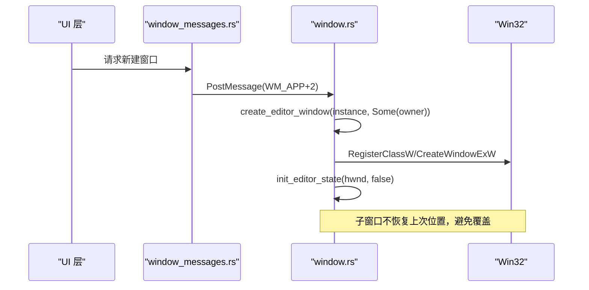

图表来源
- [window_messages.rs:426-436](file://crates/aether-win32/src/window/window_messages.rs#L426-L436)
- [window.rs:206-279](file://crates/aether-win32/src/window.rs#L206-L279)

章节来源
- [window_messages.rs:426-436](file://crates/aether-win32/src/window/window_messages.rs#L426-L436)
- [window.rs:206-279](file://crates/aether-win32/src/window.rs#L206-L279)

### 窗口过程函数（WndProc）设计与消息分发
- WndProc 使用 catch_unwind 包裹，确保任何 panic 不会穿越 FFI 边界
- 用户输入消息（鼠标/键盘/IME）会刷新空闲计时，必要时解冻冰冻态
- 消息分发到具体处理函数：鼠标、键盘、定时器、拖放、大小变化、DPI 变化、绘制等
- 未处理的消息交由默认处理 DefWindowProcW

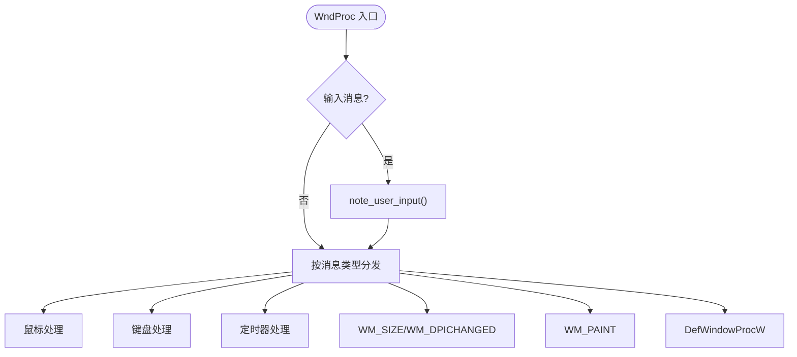

图表来源
- [window.rs:355-446](file://crates/aether-win32/src/window.rs#L355-L446)

章节来源
- [window.rs:355-446](file://crates/aether-win32/src/window.rs#L355-L446)

### 定时器与后台任务泥
- 多个定时器驱动不同功能：悬停提示防抖、Tooltip 延迟显示、终端刷新、光标闪烁、长按检测、自动保存、AI 归档、UI 动画、冰冻看门狗、沙盒评测
- 终端刷新定时器将后台任务泥与设置面板轮询移出渲染路径，避免空转帧与阻塞
- 冰冻态下停止部分定时器，转为无头泵继续消费后台任务

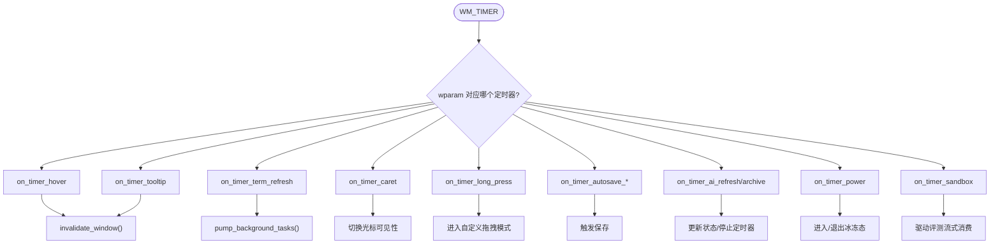

图表来源
- [window_messages.rs:21-60](file://crates/aether-win32/src/window/window_messages.rs#L21-L60)
- [window_messages.rs:62-84](file://crates/aether-win32/src/window/window_messages.rs#L62-L84)
- [window_messages.rs:86-99](file://crates/aether-win32/src/window/window_messages.rs#L86-L99)
- [window_messages.rs:101-115](file://crates/aether-win32/src/window/window_messages.rs#L101-L115)
- [window_messages.rs:117-123](file://crates/aether-win32/src/window/window_messages.rs#L117-L123)
- [window_messages.rs:125-165](file://crates/aether-win32/src/window/window_messages.rs#L125-L165)
- [window_messages.rs:167-236](file://crates/aether-win32/src/window/window_messages.rs#L167-L236)
- [window_messages.rs:238-275](file://crates/aether-win32/src/window/window_messages.rs#L238-L275)
- [window_messages.rs:277-373](file://crates/aether-win32/src/window/window_messages.rs#L277-L373)
- [window_messages.rs:375-425](file://crates/aether-win32/src/window/window_messages.rs#L375-L425)

章节来源
- [window_messages.rs:21-60](file://crates/aether-win32/src/window/window_messages.rs#L21-L60)
- [window_messages.rs:62-84](file://crates/aether-win32/src/window/window_messages.rs#L62-L84)
- [window_messages.rs:86-99](file://crates/aether-win32/src/window/window_messages.rs#L86-L99)
- [window_messages.rs:101-115](file://crates/aether-win32/src/window/window_messages.rs#L101-L115)
- [window_messages.rs:117-123](file://crates/aether-win32/src/window/window_messages.rs#L117-L123)
- [window_messages.rs:125-165](file://crates/aether-win32/src/window/window_messages.rs#L125-L165)
- [window_messages.rs:167-236](file://crates/aether-win32/src/window/window_messages.rs#L167-L236)
- [window_messages.rs:238-275](file://crates/aether-win32/src/window/window_messages.rs#L238-L275)
- [window_messages.rs:277-373](file://crates/aether-win32/src/window/window_messages.rs#L277-L373)
- [window_messages.rs:375-425](file://crates/aether-win32/src/window/window_messages.rs#L375-L425)

### 鼠标与键盘事件处理
- 鼠标事件包括左键按下/释放/双击、中键释放、移动、滚轮（垂直/水平）
- 滚轮在不同区域有不同行为：图片预览缩放、标签栏横向滚动、底部终端滚动、右侧面板滚动、侧边栏滚动、设置页滚动、沙盒评测页滚动
- 键盘事件分为字符输入与按键组合，大型处理逻辑拆分到子模块

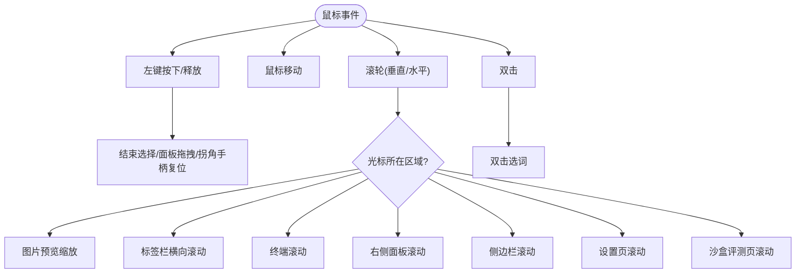

图表来源
- [mouse_handler.rs:23-42](file://crates/aether-win32/src/window/mouse_handler.rs#L23-L42)
- [mouse_handler.rs:44-148](file://crates/aether-win32/src/window/mouse_handler.rs#L44-L148)
- [mouse_handler.rs:150-188](file://crates/aether-win32/src/window/mouse_handler.rs#L150-L188)
- [mouse_handler.rs:190-366](file://crates/aether-win32/src/window/mouse_handler.rs#L190-L366)
- [mouse_handler.rs:368-406](file://crates/aether-win32/src/window/mouse_handler.rs#L368-L406)

章节来源
- [mouse_handler.rs:23-42](file://crates/aether-win32/src/window/mouse_handler.rs#L23-L42)
- [mouse_handler.rs:44-148](file://crates/aether-win32/src/window/mouse_handler.rs#L44-L148)
- [mouse_handler.rs:150-188](file://crates/aether-win32/src/window/mouse_handler.rs#L150-L188)
- [mouse_handler.rs:190-366](file://crates/aether-win32/src/window/mouse_handler.rs#L190-L366)
- [mouse_handler.rs:368-406](file://crates/aether-win32/src/window/mouse_handler.rs#L368-L406)

章节来源
- [keyboard_handler.rs:1-13](file://crates/aether-win32/src/window/keyboard_handler.rs#L1-L13)

### 窗口状态管理与冻结/解冻
- 用户输入刷新空闲计时；处于冰冻态且非最小化时立即解冻
- 最小化时进入冰冻态释放内存；恢复时解冻并重建资源
- 冰冻看门狗定时检查失焦与空闲时长，满足条件进入冰冻态
- 后台任务在冰冻态下由无头泵驱动，保证 AI 生成与文件落盘不中断

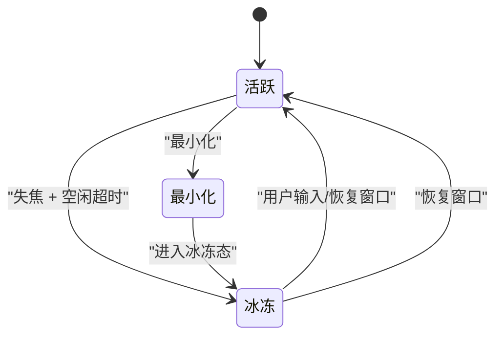

图表来源
- [window.rs:342-353](file://crates/aether-win32/src/window.rs#L342-L353)
- [window_messages.rs:86-99](file://crates/aether-win32/src/window/window_messages.rs#L86-L99)
- [window_messages.rs:167-236](file://crates/aether-win32/src/window/window_messages.rs#L167-L236)

章节来源
- [window.rs:342-353](file://crates/aether-win32/src/window.rs#L342-L353)
- [window_messages.rs:86-99](file://crates/aether-win32/src/window/window_messages.rs#L86-L99)
- [window_messages.rs:167-236](file://crates/aether-win32/src/window/window_messages.rs#L167-L236)

### 图标加载与窗口外观
- 应用图标加载失败时使用系统默认图标
- 窗口类注册时设置 hIcon，影响任务栏与标题栏显示
- 结合 DWM 效果，窗口具有现代外观（深色模式、背景模糊）

章节来源
- [window.rs:163-178](file://crates/aether-win32/src/window.rs#L163-L178)
- [window_setup.rs:32-86](file://crates/aether-win32/src/window/window_setup.rs#L32-L86)

## 依赖关系分析
- 窗口模块依赖：
  - Windows Win32 API（窗口、消息、DWM、GDI、HiDpi）
  - 编辑器状态（EditorState）用于渲染、布局、LSP、终端等
  - 设置模块（AppSettings）用于持久化窗口状态
  - 其他子系统（浏览器、更新器、键盘钩子、电源管理等）通过自定义消息或定时器协作

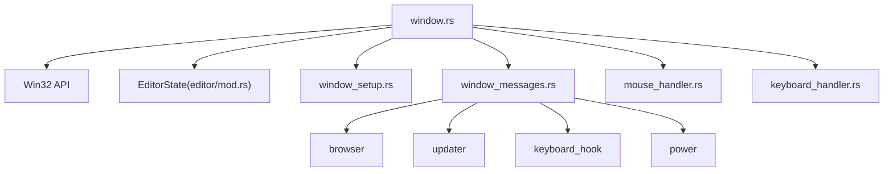

图表来源
- [window.rs:132-204](file://crates/aether-win32/src/window.rs#L132-L204)
- [window_messages.rs:426-436](file://crates/aether-win32/src/window/window_messages.rs#L426-L436)
- [window_messages.rs:585-642](file://crates/aether-win32/src/window/window_messages.rs#L585-L642)

章节来源
- [window.rs:132-204](file://crates/aether-win32/src/window.rs#L132-L204)
- [window_messages.rs:426-436](file://crates/aether-win32/src/window/window_messages.rs#L426-L436)
- [window_messages.rs:585-642](file://crates/aether-win32/src/window/window_messages.rs#L585-L642)

## 性能考量
- 渲染优化：使用 InvalidateRect 合并多次重绘请求，统一由 WM_PAINT 驱动，避免双重渲染
- 后台任务泥：将 IO 密集型操作移至独立定时器，减少渲染路径阻塞
- 脏区域追踪：仅标记变更区域，降低重绘开销
- 冰冻态：在最小化或长期空闲时释放内存，降低资源占用
- DPI 缩放：按 DPI 调整布局与 IME 尺寸，确保跨显示器一致性

[本节提供一般性指导，无需特定文件引用]

## 故障排查指南
- 窗口崩溃或异常退出
  - WndProc 使用 catch_unwind 捕获 panic，记录诊断信息后回退到默认处理
  - 崩溃守卫安装 minidump 写入，便于定位原生崩溃
- 窗口状态未恢复
  - 检查 compute_restored_window_rect 返回值与显示器边界校验
  - 确认持久化设置是否成功写入
- DPI 缩放异常
  - 检查进程 DPI 感知设置是否成功
  - 验证窗口初始化时 DPI 缩放因子是否正确应用到布局与 IME
- 多窗口行为异常
  - 确认 WM_APP+2 创建新窗口流程
  - 检查 WINDOW_COUNT 计数与 PostQuitMessage 触发时机

章节来源
- [window.rs:355-446](file://crates/aether-win32/src/window.rs#L355-L446)
- [window_setup.rs:101-178](file://crates/aether-win32/src/window/window_setup.rs#L101-L178)
- [window_setup.rs:180-266](file://crates/aether-win32/src/window/window_setup.rs#L180-L266)
- [window_setup.rs:309-385](file://crates/aether-win32/src/window/window_setup.rs#L309-L385)

## 结论
本窗口管理系统基于 Win32 API 实现了完整的窗口生命周期管理，包括窗口类注册、样式配置、DWM 效果启用、DPI 感知、窗口尺寸恢复、多窗口支持与状态持久化。WndProc 设计清晰，消息分发明确，配合定时器与后台任务泥机制，保证了流畅的用户体验与稳定的资源管理。通过脏区域追踪与冰冻态策略，系统在性能与资源占用之间取得良好平衡。

[本节总结性内容，无需特定文件引用]

## 附录
- 关键实现路径参考
  - 窗口创建流程：[window.rs:132-204](file://crates/aether-win32/src/window.rs#L132-L204)、[window.rs:206-279](file://crates/aether-win32/src/window.rs#L206-L279)
  - DPI 缩放处理：[window_setup.rs:17-30](file://crates/aether-win32/src/window/window_setup.rs#L17-L30)、[window_setup.rs:88-99](file://crates/aether-win32/src/window/window_setup.rs#L88-L99)、[window.rs:281-313](file://crates/aether-win32/src/window.rs#L281-L313)
  - 窗口状态持久化：[window_setup.rs:180-266](file://crates/aether-win32/src/window/window_setup.rs#L180-L266)、[window_setup.rs:309-385](file://crates/aether-win32/src/window/window_setup.rs#L309-L385)
  - 多窗口支持：[window_messages.rs:426-436](file://crates/aether-win32/src/window/window_messages.rs#L426-L436)、[window.rs:73-128](file://crates/aether-win32/src/window.rs#L73-L128)
  - 定时器与后台任务：[window_messages.rs:21-60](file://crates/aether-win32/src/window/window_messages.rs#L21-L60)、[window_messages.rs:167-236](file://crates/aether-win32/src/window/window_messages.rs#L167-L236)

[本节为参考索引，无需特定文件引用]