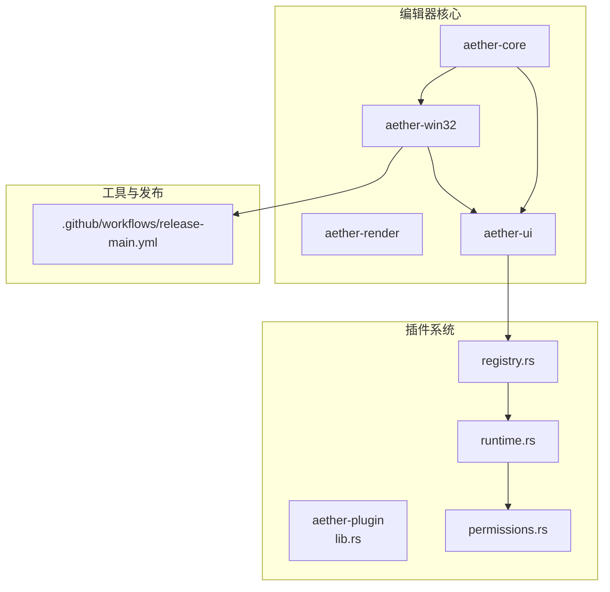
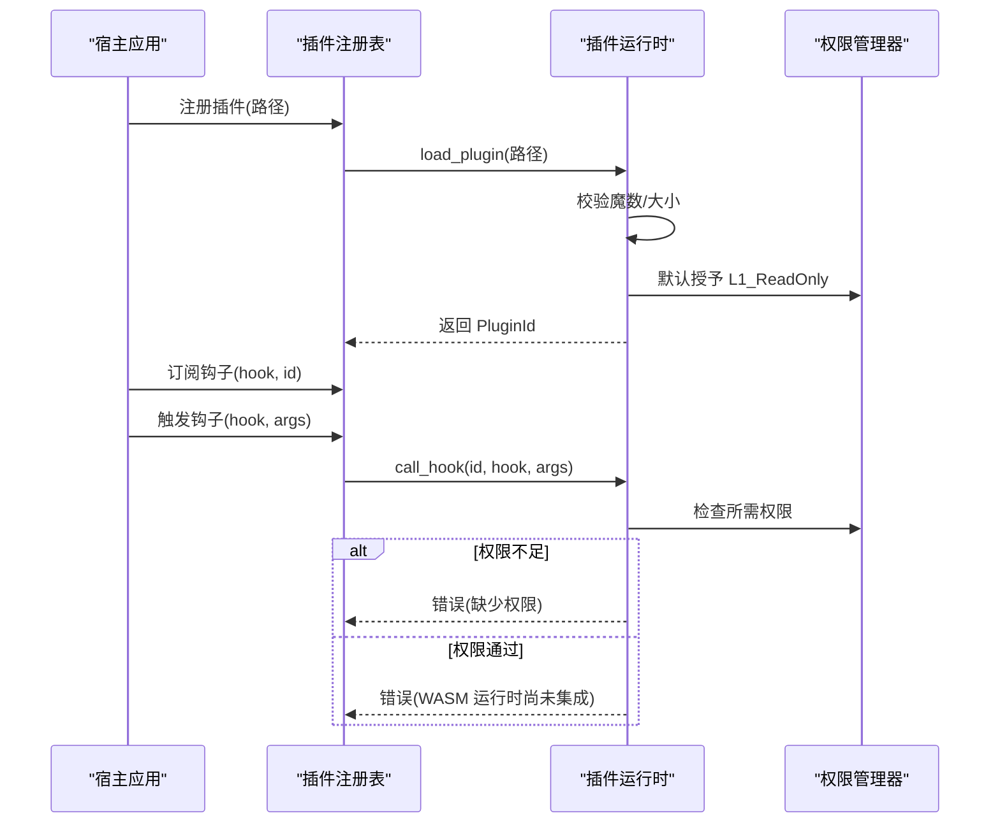
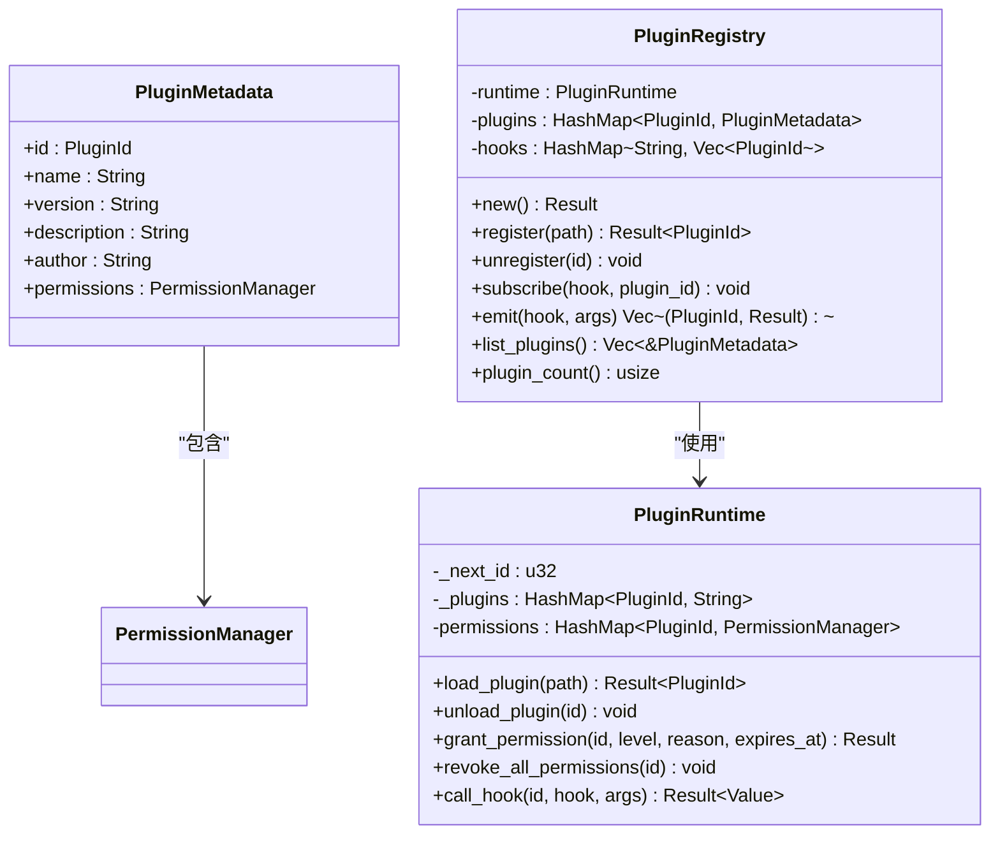
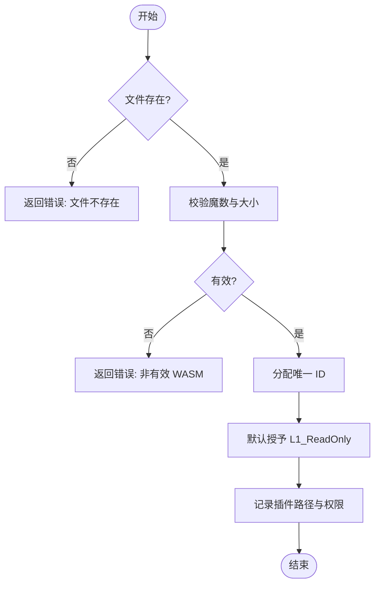
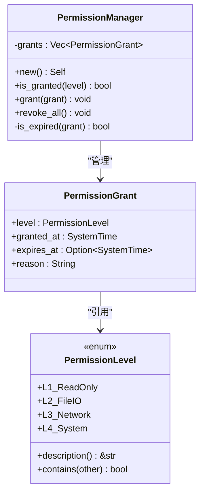
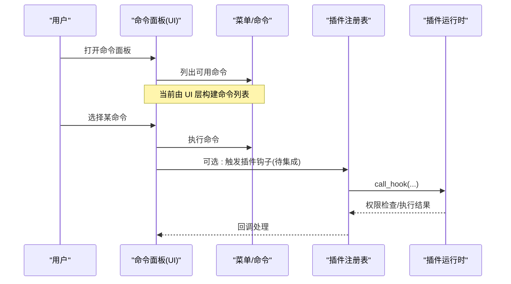
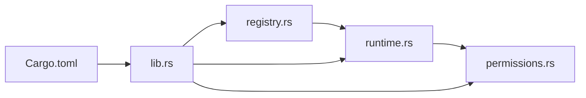

# 插件开发指南

<cite>
**本文引用的文件**
- [README.md](file://README.md)
- [Cargo.toml](file://crates/aether-plugin/Cargo.toml)
- [lib.rs](file://crates/aether-plugin/src/lib.rs)
- [registry.rs](file://crates/aether-plugin/src/registry.rs)
- [runtime.rs](file://crates/aether-plugin/src/runtime.rs)
- [permissions.rs](file://crates/aether-plugin/src/permissions.rs)
- [command_palette.rs（UI）](file://crates/aether-ui/src/command_palette.rs)
- [menu_bar.rs（Win32）](file://crates/aether-win32/src/menu_bar.rs)
- [release-main.yml](file://.github/workflows/release-main.yml)
</cite>

## 目录
1. [简介](#简介)
2. [项目结构](#项目结构)
3. [核心组件](#核心组件)
4. [架构总览](#架构总览)
5. [详细组件分析](#详细组件分析)
6. [依赖关系分析](#依赖关系分析)
7. [性能与安全性考量](#性能与安全性考量)
8. [调试与故障排查](#调试与故障排查)
9. [测试与质量检查](#测试与质量检查)
10. [打包与分发流程](#打包与分发流程)
11. [结论](#结论)
12. [附录：API 参考与事件系统](#附录api-参考与事件系统)

## 简介
本指南面向插件开发者，围绕 Aether Studio 的插件系统提供从环境搭建、模板使用、调试配置到 API 参考、事件系统、示例实现、打包分发与质量保障的全流程说明。当前仓库已提供插件注册表、运行时与权限控制的基础能力，WASM 运行时的实际执行集成仍在规划中；本文在保持严谨的同时，给出可落地的开发与集成路径。

## 项目结构
Aether Studio 采用 Cargo Workspace 组织，插件相关能力集中在 aether-plugin crate，并通过 UI 命令面板等子系统暴露扩展点。整体结构如下：

图表来源
- [lib.rs:1-8](file://crates/aether-plugin/src/lib.rs#L1-L8)
- [registry.rs:1-108](file://crates/aether-plugin/src/registry.rs#L1-L108)
- [runtime.rs:1-187](file://crates/aether-plugin/src/runtime.rs#L1-L187)
- [permissions.rs:1-100](file://crates/aether-plugin/src/permissions.rs#L1-L100)
- [release-main.yml:68-184](file://.github/workflows/release-main.yml#L68-L184)

章节来源
- [README.md:162-179](file://README.md#L162-L179)
- [README.md:335-351](file://README.md#L335-L351)

## 核心组件
- 插件注册表（PluginRegistry）：负责插件生命周期管理、元数据维护、钩子订阅与事件分发。
- 插件运行时（PluginRuntime）：负责 WASM 插件加载校验、ID 分配、权限授予与撤销、钩子调用入口（当前为占位实现）。
- 权限系统（PermissionManager + PermissionLevel）：定义 L1-L4 四级权限模型，支持过期时间、包含关系与批量撤销。
- 插件库导出（lib.rs）：对外暴露 PluginId、PluginRuntime、PluginRegistry、PermissionGrant、PermissionLevel。

章节来源
- [lib.rs:1-8](file://crates/aether-plugin/src/lib.rs#L1-L8)
- [registry.rs:6-108](file://crates/aether-plugin/src/registry.rs#L6-L108)
- [runtime.rs:9-187](file://crates/aether-plugin/src/runtime.rs#L9-L187)
- [permissions.rs:1-100](file://crates/aether-plugin/src/permissions.rs#L1-L100)

## 架构总览
插件系统通过“注册表 + 运行时 + 权限”三层协作，将宿主应用与插件隔离。注册表持有运行时实例并管理插件集合；运行时负责加载与调用；权限系统确保最小授权原则。

图表来源
- [registry.rs:34-91](file://crates/aether-plugin/src/registry.rs#L34-L91)
- [runtime.rs:33-157](file://crates/aether-plugin/src/runtime.rs#L33-L157)
- [permissions.rs:62-94](file://crates/aether-plugin/src/permissions.rs#L62-L94)

## 详细组件分析

### 插件注册表（PluginRegistry）
- 职责：加载插件、维护元数据、管理钩子订阅、分发事件。
- 关键方法：
  - register(path): 加载插件并创建默认元数据。
  - unregister(id): 卸载插件并从所有钩子中移除。
  - subscribe(hook, id): 订阅指定钩子。
  - emit(hook, args): 触发钩子并收集各插件结果。
  - list_plugins()/plugin_count(): 查询已加载插件。

图表来源
- [registry.rs:6-108](file://crates/aether-plugin/src/registry.rs#L6-L108)
- [runtime.rs:16-187](file://crates/aether-plugin/src/runtime.rs#L16-L187)
- [permissions.rs:47-94](file://crates/aether-plugin/src/permissions.rs#L47-L94)

章节来源
- [registry.rs:1-108](file://crates/aether-plugin/src/registry.rs#L1-L108)

### 插件运行时（PluginRuntime）
- 职责：WASM 文件校验、ID 分配、权限授予/撤销、钩子调用入口。
- 安全策略：
  - 魔数校验与大小限制（最大 50MB）。
  - 未知钩子默认要求 L1（最保守）。
  - 权限过期时间不能是过去时间。
- 当前状态：权限检查已实现，WASM 函数调用尚未集成，会返回明确错误提示。

图表来源
- [runtime.rs:33-87](file://crates/aether-plugin/src/runtime.rs#L33-L87)

章节来源
- [runtime.rs:33-187](file://crates/aether-plugin/src/runtime.rs#L33-L187)

### 权限系统（PermissionLevel + PermissionManager）
- 权限级别：
  - L1_ReadOnly：只读 UI 访问
  - L2_FileIO：文件读写
  - L3_Network：网络访问
  - L4_System：系统命令执行
- 包含关系：高权限包含低权限（如 L4 包含 L3/L2/L1）。
- 特性：支持过期时间、批量撤销、按记录判断是否过期。

图表来源
- [permissions.rs:1-94](file://crates/aether-plugin/src/permissions.rs#L1-L94)

章节来源
- [permissions.rs:1-100](file://crates/aether-plugin/src/permissions.rs#L1-L100)

### 命令面板与 UI 扩展点
- 命令面板条目结构：包含标签、描述、快捷键、命令 ID、图标。
- 内置命令：文件、编辑、视图、转到、运行、终端、搜索、AI、帮助等。
- 插件可扩展方向：未来可通过注册表暴露自定义命令项或钩子，使插件参与命令面板构建与执行。

图表来源
- [command_palette.rs（UI）:1-200](file://crates/aether-ui/src/command_palette.rs#L1-L200)
- [menu_bar.rs（Win32）:58-103](file://crates/aether-win32/src/menu_bar.rs#L58-L103)
- [registry.rs:67-91](file://crates/aether-plugin/src/registry.rs#L67-L91)
- [runtime.rs:127-157](file://crates/aether-plugin/src/runtime.rs#L127-L157)

章节来源
- [command_palette.rs（UI）:1-200](file://crates/aether-ui/src/command_palette.rs#L1-L200)
- [menu_bar.rs（Win32）:58-103](file://crates/aether-win32/src/menu_bar.rs#L58-L103)

## 依赖关系分析
- aether-plugin 依赖 serde/serde_json 用于序列化参数与返回值。
- registry 依赖 runtime 与 permissions。
- runtime 依赖 permissions 进行权限判定。
- 外部集成点：未来通过 wasmtime 接入 WASM 执行环境（当前为占位）。

图表来源
- [lib.rs:1-8](file://crates/aether-plugin/src/lib.rs#L1-L8)
- [registry.rs:1-23](file://crates/aether-plugin/src/registry.rs#L1-L23)
- [runtime.rs:1-21](file://crates/aether-plugin/src/runtime.rs#L1-L21)
- [permissions.rs:1-13](file://crates/aether-plugin/src/permissions.rs#L1-L13)
- [Cargo.toml:1-9](file://crates/aether-plugin/Cargo.toml#L1-L9)

章节来源
- [Cargo.toml:1-9](file://crates/aether-plugin/Cargo.toml#L1-L9)

## 性能与安全性考量
- 性能
  - 插件大小限制：防止超大 WASM 影响启动与内存占用。
  - 钩子调用：当前为同步调用，注意避免阻塞主线程；后续应引入异步机制。
- 安全
  - 最小权限原则：未知钩子默认 L1；敏感操作需显式授权。
  - 过期权限：支持到期自动失效，避免长期驻留的高危权限。
  - 资源清理：卸载插件时同时移除权限记录，避免残留。

章节来源
- [runtime.rs:33-87](file://crates/aether-plugin/src/runtime.rs#L33-L87)
- [runtime.rs:95-125](file://crates/aether-plugin/src/runtime.rs#L95-L125)
- [permissions.rs:62-94](file://crates/aether-plugin/src/permissions.rs#L62-L94)

## 调试与故障排查
- 常见问题
  - 插件文件不存在：检查路径是否正确。
  - 非有效 WASM 格式：确认输出为合法 WASM。
  - 权限不足：为插件授予对应级别的权限。
  - WASM 运行时尚未集成：当前阶段会返回明确错误，等待集成后重试。
- 建议
  - 使用单元测试覆盖加载、权限、卸载流程。
  - 在宿主侧记录钩子调用日志，便于定位问题。
  - 对大文件或复杂逻辑进行分片与异步化设计。

章节来源
- [registry.rs:140-182](file://crates/aether-plugin/src/registry.rs#L140-L182)
- [runtime.rs:242-337](file://crates/aether-plugin/src/runtime.rs#L242-L337)
- [runtime.rs:414-505](file://crates/aether-plugin/src/runtime.rs#L414-L505)

## 测试与质量检查
- 单元测试
  - 注册表：新建、默认、注册/注销、订阅/触发、计数。
  - 运行时：新建、默认、ID 语义、加载/卸载、权限授予/撤销、钩子调用。
  - 权限：级别描述、包含关系、过期判断、批量撤销。
- 静态分析与格式化
  - 使用 cargo clippy 与 cargo fmt 保证代码质量。
- 覆盖率
  - 业务逻辑模块通常可达 80–100% 覆盖率。

章节来源
- [registry.rs:110-319](file://crates/aether-plugin/src/registry.rs#L110-L319)
- [runtime.rs:189-561](file://crates/aether-plugin/src/runtime.rs#L189-L561)
- [permissions.rs:102-293](file://crates/aether-plugin/src/permissions.rs#L102-L293)
- [README.md:127-160](file://README.md#L127-L160)

## 打包与分发流程
- 构建产物
  - GUI 二进制：target\x86_64-pc-windows-msvc\release\aether-app.exe
  - CLI 工具：target\x86_64-pc-windows-msvc\release\aether
- CI 发布流水线
  - 生成版本号与日期、构建 release、准备资产、构建 NSIS 安装包、创建 GitHub Release 并上传资产。
- 插件打包建议
  - 插件以独立 WASM 文件形式提供，遵循魔数与大小限制。
  - 清单文件（未来）：建议包含名称、版本、作者、权限声明、钩子契约等元信息。
  - 签名验证（未来）：建议在加载前校验签名，结合权限系统实施白名单机制。

章节来源
- [README.md:85-125](file://README.md#L85-L125)
- [release-main.yml:68-184](file://.github/workflows/release-main.yml#L68-L184)

## 结论
当前插件系统已具备完整的注册、权限与运行时框架，虽 WASM 执行尚未集成，但接口与安全策略已就绪。开发者可基于现有 API 进行插件设计与集成准备，并在运行时集成完成后快速落地。配合完善的测试与 CI 流程，可保障插件质量与稳定性。

## 附录：API 参考与事件系统

### 公共类型与导出
- 插件标识：PluginId
- 运行时：PluginRuntime
- 注册表：PluginRegistry
- 权限：PermissionGrant、PermissionLevel

章节来源
- [lib.rs:1-8](file://crates/aether-plugin/src/lib.rs#L1-L8)

### 注册表 API
- new(): 创建注册表实例
- register(path): 注册插件并返回 ID
- unregister(id): 卸载插件
- subscribe(hook, id): 订阅钩子
- emit(hook, args): 触发钩子并收集结果
- list_plugins(): 获取已加载插件元数据
- plugin_count(): 获取插件数量

章节来源
- [registry.rs:25-108](file://crates/aether-plugin/src/registry.rs#L25-L108)

### 运行时 API
- new(): 创建运行时实例
- load_plugin(path): 加载插件并校验
- unload_plugin(id): 卸载插件
- grant_permission(id, level, reason, expires_at): 授予权限
- revoke_all_permissions(id): 撤销全部权限
- call_hook(id, hook, args): 调用插件钩子（当前返回未集成错误）

章节来源
- [runtime.rs:23-187](file://crates/aether-plugin/src/runtime.rs#L23-L187)

### 权限 API
- PermissionLevel::description(): 获取权限描述
- PermissionLevel::contains(other): 检查包含关系
- PermissionManager::is_granted(level): 检查是否已授予
- PermissionManager::grant(grant): 授予权限
- PermissionManager::revoke_all(): 撤销全部权限

章节来源
- [permissions.rs:15-94](file://crates/aether-plugin/src/permissions.rs#L15-L94)

### 事件系统与钩子映射
- 只读钩子（L1）：on_activate、on_deactivate、get_theme、get_language
- 文件钩子（L2）：on_save、on_open、read_file、write_file
- 网络钩子（L3）：fetch、http_request、websocket
- 系统钩子（L4）：exec、spawn、shell、run_command
- 未知钩子默认 L1

章节来源
- [runtime.rs:159-175](file://crates/aether-plugin/src/runtime.rs#L159-L175)

### 示例：插件类型与实现思路
- 文件处理器
  - 目标：监听 on_open/on_save/read_file/write_file
  - 权限：L2_FileIO
  - 行为：在打开或保存时进行预处理/后处理（如格式化、校验）
- UI 扩展
  - 目标：通过命令面板或活动栏扩展界面
  - 权限：L1_ReadOnly（仅读取 UI 状态）
  - 行为：注册新命令项或响应 UI 事件
- 命令集成
  - 目标：将插件功能暴露为可执行命令
  - 权限：根据命令敏感度选择 L1-L4
  - 行为：在命令面板中显示并执行

[本节为概念性说明，不直接分析具体文件]