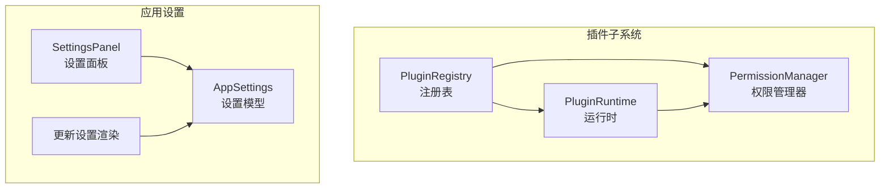
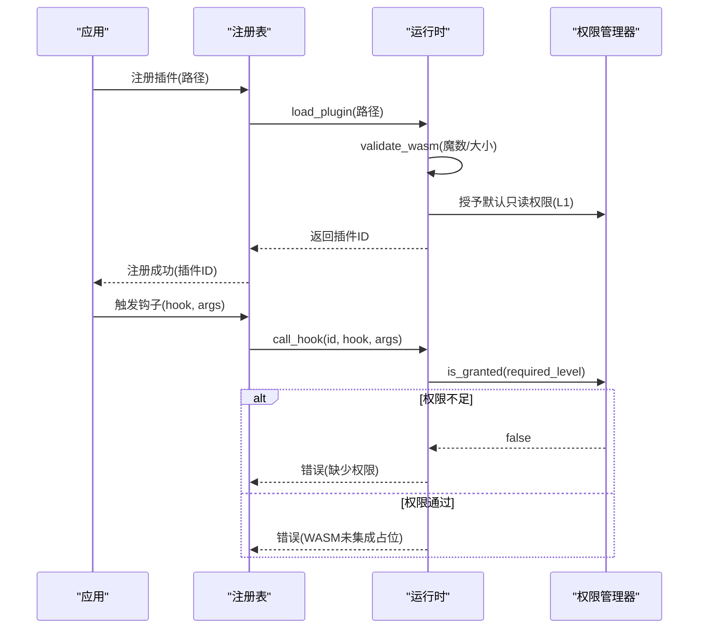
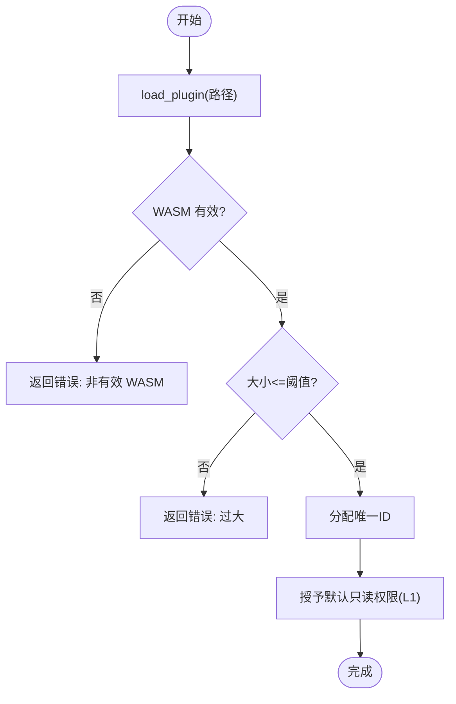
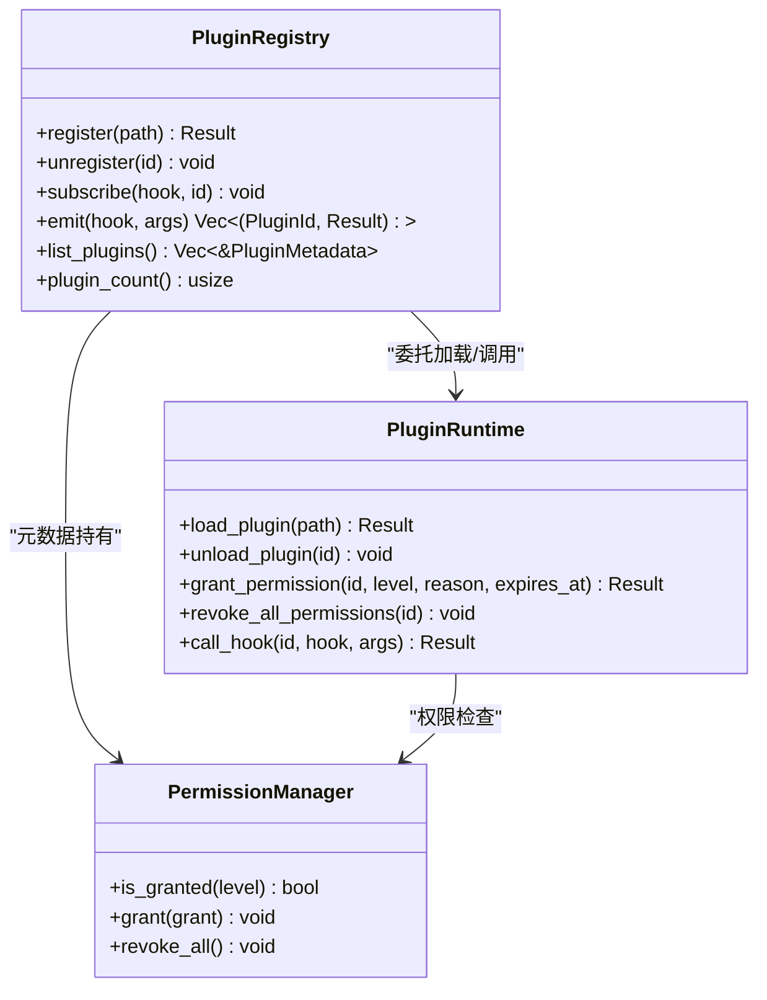
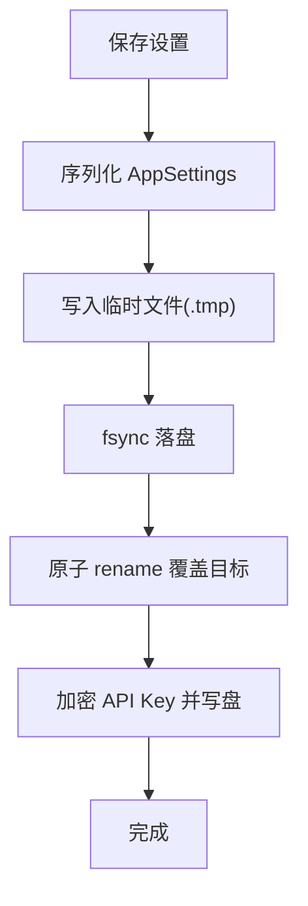
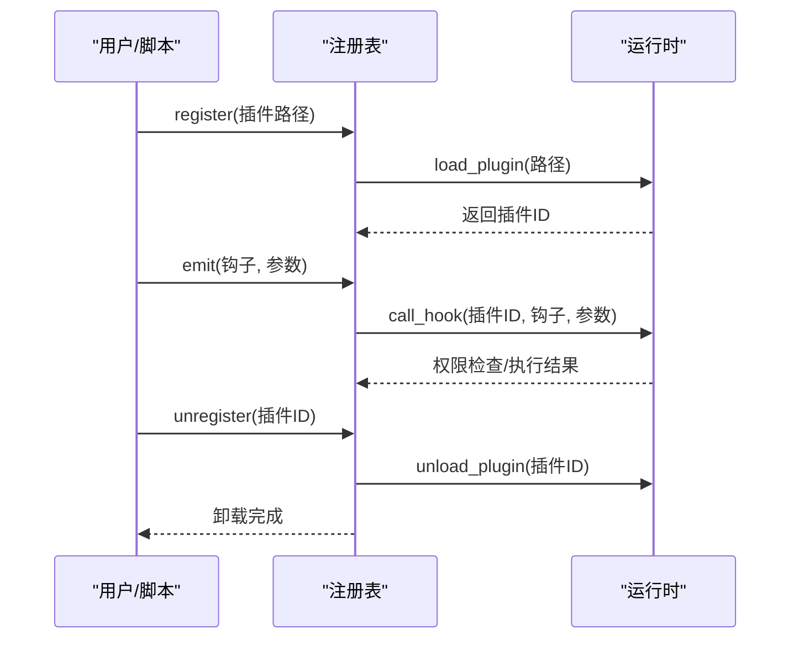
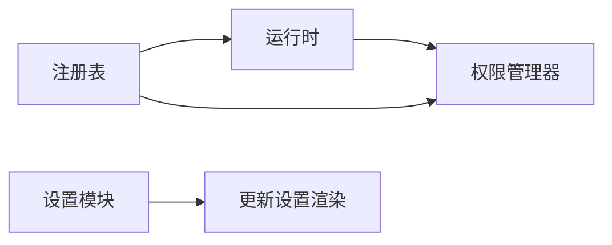

# 插件注册表管理

<cite>
**本文引用的文件**
- [crates/aether-plugin/src/lib.rs](file://crates/aether-plugin/src/lib.rs)
- [crates/aether-plugin/src/registry.rs](file://crates/aether-plugin/src/registry.rs)
- [crates/aether-plugin/src/runtime.rs](file://crates/aether-plugin/src/runtime.rs)
- [crates/aether-plugin/src/permissions.rs](file://crates/aether-plugin/src/permissions.rs)
- [crates/aether-shared/src/settings.rs](file://crates/aether-shared/src/settings.rs)
- [crates/aether-win32/src/settings.rs](file://crates/aether-win32/src/settings.rs)
- [crates/aether-win32/src/render/settings_update.rs](file://crates/aether-win32/src/render/settings_update.rs)
</cite>

## 目录
1. [简介](#简介)
2. [项目结构](#项目结构)
3. [核心组件](#核心组件)
4. [架构总览](#架构总览)
5. [详细组件分析](#详细组件分析)
6. [依赖关系分析](#依赖关系分析)
7. [性能考虑](#性能考虑)
8. [故障排查指南](#故障排查指南)
9. [结论](#结论)
10. [附录](#附录)

## 简介
本文件面向“插件注册表管理系统”，围绕插件发现、元数据提取与版本检测、依赖管理与冲突解决、状态管理（启用/禁用、更新检查、卸载清理）、配置与设置持久化，以及安装/更新/卸载的完整工作流进行系统化说明。同时提供编程式 API 使用方式，帮助开发者以代码方式完成插件生命周期管理。

## 项目结构
本项目将插件系统实现集中在 aether-plugin crate 中，包含：
- 权限模型与授权管理
- 插件运行时（加载、校验、钩子调用）
- 插件注册表（注册、卸载、事件分发、元数据维护）

此外，应用设置与持久化在 aether-shared 与 aether-win32 中实现，用于支持插件相关配置与更新策略等。

**图表来源**
- [crates/aether-plugin/src/registry.rs:17-102](file://crates/aether-plugin/src/registry.rs#L17-L102)
- [crates/aether-plugin/src/runtime.rs:16-181](file://crates/aether-plugin/src/runtime.rs#L16-L181)
- [crates/aether-plugin/src/permissions.rs:1-94](file://crates/aether-plugin/src/permissions.rs#L1-L94)
- [crates/aether-shared/src/settings.rs:4-23](file://crates/aether-shared/src/settings.rs#L4-L23)
- [crates/aether-win32/src/settings.rs:34-76](file://crates/aether-win32/src/settings.rs#L34-L76)
- [crates/aether-win32/src/render/settings_update.rs:3-131](file://crates/aether-win32/src/render/settings_update.rs#L3-L131)

**章节来源**
- [crates/aether-plugin/src/lib.rs:1-7](file://crates/aether-plugin/src/lib.rs#L1-L7)
- [crates/aether-plugin/src/registry.rs:17-102](file://crates/aether-plugin/src/registry.rs#L17-L102)
- [crates/aether-plugin/src/runtime.rs:16-181](file://crates/aether-plugin/src/runtime.rs#L16-L181)
- [crates/aether-plugin/src/permissions.rs:1-94](file://crates/aether-plugin/src/permissions.rs#L1-L94)
- [crates/aether-shared/src/settings.rs:4-23](file://crates/aether-shared/src/settings.rs#L4-L23)
- [crates/aether-win32/src/settings.rs:34-76](file://crates/aether-win32/src/settings.rs#L34-L76)
- [crates/aether-win32/src/render/settings_update.rs:3-131](file://crates/aether-win32/src/render/settings_update.rs#L3-L131)

## 核心组件
- 插件注册表（PluginRegistry）
  - 负责插件的注册、卸载、钩子订阅与事件分发，维护已加载插件的元数据集合。
- 插件运行时（PluginRuntime）
  - 负责 WASM 插件文件的加载、格式与大小校验、ID 分配、权限授予与撤销、钩子调用入口。
- 权限管理器（PermissionManager）
  - 基于 L1-L4 四级权限模型，支持过期时间、撤销全部权限、包含关系判断。
- 应用设置（AppSettings）
  - 提供设置持久化、加密密钥存储、更新策略等能力，为插件系统的配置与更新检查提供支撑。

**章节来源**
- [crates/aether-plugin/src/registry.rs:17-102](file://crates/aether-plugin/src/registry.rs#L17-L102)
- [crates/aether-plugin/src/runtime.rs:16-181](file://crates/aether-plugin/src/runtime.rs#L16-L181)
- [crates/aether-plugin/src/permissions.rs:1-94](file://crates/aether-plugin/src/permissions.rs#L1-L94)
- [crates/aether-shared/src/settings.rs:4-23](file://crates/aether-shared/src/settings.rs#L4-L23)

## 架构总览
插件系统采用“注册表 + 运行时 + 权限”的分层设计：
- 注册表对外暴露注册/卸载/订阅/触发等接口，内部委托运行时执行具体操作。
- 运行时负责安全边界（WASM 校验、大小限制、权限检查），并预留 WASM 引擎集成点。
- 权限模型通过等级包含关系与过期机制保障最小权限原则。
- 设置模块提供持久化与更新策略，配合 UI 渲染更新检查界面。

**图表来源**
- [crates/aether-plugin/src/registry.rs:34-91](file://crates/aether-plugin/src/registry.rs#L34-L91)
- [crates/aether-plugin/src/runtime.rs:33-87](file://crates/aether-plugin/src/runtime.rs#L33-L87)
- [crates/aether-plugin/src/runtime.rs:127-175](file://crates/aether-plugin/src/runtime.rs#L127-L175)
- [crates/aether-plugin/src/permissions.rs:67-94](file://crates/aether-plugin/src/permissions.rs#L67-L94)

## 详细组件分析

### 插件发现、元数据提取与版本检测
- 插件发现
  - 通过注册表的 register(path) 接收外部提供的 WASM 插件路径，交由运行时加载。
- 元数据提取
  - 当前实现从路径派生名称，版本固定为默认值；可扩展为读取插件包内清单或导出符号。
- 版本检测
  - 当前未实现远程版本比对；可在注册表层增加版本查询与比较逻辑，结合设置中的更新策略驱动。

**图表来源**
- [crates/aether-plugin/src/runtime.rs:33-87](file://crates/aether-plugin/src/runtime.rs#L33-L87)

**章节来源**
- [crates/aether-plugin/src/registry.rs:34-54](file://crates/aether-plugin/src/registry.rs#L34-L54)
- [crates/aether-plugin/src/runtime.rs:33-87](file://crates/aether-plugin/src/runtime.rs#L33-L87)

### 依赖管理与冲突检测
- 当前实现未内置依赖解析与冲突检测。
- 建议扩展方向：
  - 在 PluginMetadata 中声明依赖列表（如库名、版本范围）。
  - 在注册阶段进行依赖图构建与环检测。
  - 冲突时回滚注册或提示用户选择兼容版本。
  - 可结合设置中的策略（如“仅允许稳定版本”）进行自动解决。

[本节为概念性扩展建议，不直接引用具体代码]

### 插件状态管理（启用/禁用、更新检查、卸载清理）
- 启用/禁用
  - 可通过注册表维护“启用”标记，并在 emit 时跳过禁用插件。
- 更新检查
  - 应用设置中包含更新策略与上次检查时间戳，UI 渲染“立即检查更新”按钮。
- 卸载清理
  - 卸载时移除运行时记录与权限，并从所有钩子订阅列表中剔除该插件。

**图表来源**
- [crates/aether-plugin/src/registry.rs:17-102](file://crates/aether-plugin/src/registry.rs#L17-L102)
- [crates/aether-plugin/src/runtime.rs:16-181](file://crates/aether-plugin/src/runtime.rs#L16-L181)
- [crates/aether-plugin/src/permissions.rs:56-94](file://crates/aether-plugin/src/permissions.rs#L56-L94)

**章节来源**
- [crates/aether-plugin/src/registry.rs:56-91](file://crates/aether-plugin/src/registry.rs#L56-L91)
- [crates/aether-plugin/src/runtime.rs:89-125](file://crates/aether-plugin/src/runtime.rs#L89-L125)
- [crates/aether-win32/src/render/settings_update.rs:3-131](file://crates/aether-win32/src/render/settings_update.rs#L3-L131)

### 插件配置管理与设置持久化
- 设置模型
  - AppSettings 提供 UI、远程、自动保存、AI 模型、更新策略等字段。
- 持久化方案
  - settings.json 原子写入（临时文件+fsync+rename），避免损坏。
  - API Key 单独加密存储（Windows DPAPI），不在 JSON 明文出现。
- 更新策略
  - 支持自动安装、仅通知、关闭自动更新；支持抑制提醒天数。
  - UI 渲染更新标签页，展示版本信息与检查按钮。

**图表来源**
- [crates/aether-shared/src/settings.rs:487-559](file://crates/aether-shared/src/settings.rs#L487-L559)
- [crates/aether-shared/src/settings.rs:562-642](file://crates/aether-shared/src/settings.rs#L562-L642)

**章节来源**
- [crates/aether-shared/src/settings.rs:4-23](file://crates/aether-shared/src/settings.rs#L4-L23)
- [crates/aether-shared/src/settings.rs:368-453](file://crates/aether-shared/src/settings.rs#L368-L453)
- [crates/aether-shared/src/settings.rs:487-559](file://crates/aether-shared/src/settings.rs#L487-L559)
- [crates/aether-win32/src/render/settings_update.rs:3-131](file://crates/aether-win32/src/render/settings_update.rs#L3-L131)

### 安装、更新与卸载的完整工作流程
- 安装
  - 调用注册表 register(path)，运行时验证 WASM 并授予默认权限，成功后返回插件 ID。
- 更新
  - 当前未实现自动更新；可在上层服务拉取新版本后替换文件，再重新注册。
  - 结合设置中的更新策略与 UI 检查按钮，由应用层协调下载与替换流程。
- 卸载
  - 调用注册表 unregister(id)，运行时移除插件与权限，注册表清理钩子订阅。

**图表来源**
- [crates/aether-plugin/src/registry.rs:34-91](file://crates/aether-plugin/src/registry.rs#L34-L91)
- [crates/aether-plugin/src/runtime.rs:59-87](file://crates/aether-plugin/src/runtime.rs#L59-L87)
- [crates/aether-plugin/src/runtime.rs:127-175](file://crates/aether-plugin/src/runtime.rs#L127-L175)

**章节来源**
- [crates/aether-plugin/src/registry.rs:34-91](file://crates/aether-plugin/src/registry.rs#L34-L91)
- [crates/aether-plugin/src/runtime.rs:59-87](file://crates/aether-plugin/src/runtime.rs#L59-L87)
- [crates/aether-plugin/src/runtime.rs:89-125](file://crates/aether-plugin/src/runtime.rs#L89-L125)

### 编程式 API 使用方式
- 初始化与注册
  - 创建注册表实例，调用 register(path) 获取插件 ID。
- 订阅与触发
  - 使用 subscribe(hook, id) 订阅钩子，emit(hook, args) 触发所有订阅者。
- 权限管理
  - 通过运行时 grant_permission(id, level, reason, expires_at) 授予权限，revoke_all_permissions(id) 撤销全部权限。
- 卸载
  - 调用 unregister(id) 完成清理。

示例步骤（无代码片段，仅提供路径参考）：
- 注册与列表：[crates/aether-plugin/src/registry.rs:34-96](file://crates/aether-plugin/src/registry.rs#L34-L96)
- 权限授予与检查：[crates/aether-plugin/src/runtime.rs:95-125](file://crates/aether-plugin/src/runtime.rs#L95-L125), [crates/aether-plugin/src/runtime.rs:127-175](file://crates/aether-plugin/src/runtime.rs#L127-L175)
- 权限模型与包含关系：[crates/aether-plugin/src/permissions.rs:15-45](file://crates/aether-plugin/src/permissions.rs#L15-L45)

**章节来源**
- [crates/aether-plugin/src/registry.rs:34-96](file://crates/aether-plugin/src/registry.rs#L34-L96)
- [crates/aether-plugin/src/runtime.rs:95-125](file://crates/aether-plugin/src/runtime.rs#L95-L125)
- [crates/aether-plugin/src/runtime.rs:127-175](file://crates/aether-plugin/src/runtime.rs#L127-L175)
- [crates/aether-plugin/src/permissions.rs:15-45](file://crates/aether-plugin/src/permissions.rs#L15-L45)

## 依赖关系分析
- 组件耦合
  - 注册表强依赖运行时与权限管理器；运行时依赖权限管理器进行访问控制。
- 外部依赖
  - 设置模块依赖 serde/serde_json 进行序列化与反序列化；Windows 平台使用 DPAPI 加密密钥。
- 潜在循环依赖
  - 当前分层清晰，未见循环依赖。

**图表来源**
- [crates/aether-plugin/src/registry.rs:17-102](file://crates/aether-plugin/src/registry.rs#L17-L102)
- [crates/aether-plugin/src/runtime.rs:16-181](file://crates/aether-plugin/src/runtime.rs#L16-L181)
- [crates/aether-plugin/src/permissions.rs:1-94](file://crates/aether-plugin/src/permissions.rs#L1-L94)
- [crates/aether-shared/src/settings.rs:4-23](file://crates/aether-shared/src/settings.rs#L4-L23)
- [crates/aether-win32/src/render/settings_update.rs:3-131](file://crates/aether-win32/src/render/settings_update.rs#L3-L131)

**章节来源**
- [crates/aether-plugin/src/registry.rs:17-102](file://crates/aether-plugin/src/registry.rs#L17-L102)
- [crates/aether-plugin/src/runtime.rs:16-181](file://crates/aether-plugin/src/runtime.rs#L16-L181)
- [crates/aether-plugin/src/permissions.rs:1-94](file://crates/aether-plugin/src/permissions.rs#L1-L94)
- [crates/aether-shared/src/settings.rs:4-23](file://crates/aether-shared/src/settings.rs#L4-L23)
- [crates/aether-win32/src/render/settings_update.rs:3-131](file://crates/aether-win32/src/render/settings_update.rs#L3-L131)

## 性能考虑
- 插件文件大小限制（50MB）防止内存占用过高。
- 原子写入设置文件避免并发写入导致的损坏。
- 权限检查在每次钩子调用前执行，开销较小但需确保权限数据结构高效。
- 建议在依赖解析与冲突检测中引入增量计算与缓存，减少启动时扫描成本。

[本节为通用性能指导，不直接引用具体代码]

## 故障排查指南
- 插件加载失败
  - 检查 WASM 魔数与大小是否符合要求。
  - 确认路径存在且可读。
- 权限不足
  - 确认所需权限级别是否已授予，注意过期时间。
- 钩子无法执行
  - 当前为占位实现，即使权限通过也会返回“WASM 运行时尚未集成”的错误，需后续集成 Wasmtime。
- 设置保存异常
  - 检查磁盘空间与权限；查看临时文件是否残留；确认 fsync 与 rename 是否成功。

**章节来源**
- [crates/aether-plugin/src/runtime.rs:33-87](file://crates/aether-plugin/src/runtime.rs#L33-L87)
- [crates/aether-plugin/src/runtime.rs:127-175](file://crates/aether-plugin/src/runtime.rs#L127-L175)
- [crates/aether-shared/src/settings.rs:487-559](file://crates/aether-shared/src/settings.rs#L487-L559)

## 结论
插件注册表管理系统提供了清晰的插件生命周期管理能力，包括加载、权限控制、钩子分发与设置持久化。当前运行时处于占位阶段，后续需集成 WASM 引擎以实现真正的插件执行。依赖管理与冲突检测可作为下一步增强点，以提升插件生态的可维护性与安全性。

[本节为总结性内容，不直接引用具体代码]

## 附录
- 权限级别说明
  - L1_ReadOnly：只读 UI 访问
  - L2_FileIO：文件读写
  - L3_Network：网络访问
  - L4_System：系统命令执行
- 更新策略
  - 自动安装、仅通知、关闭自动更新
  - 抑制提醒天数控制

**章节来源**
- [crates/aether-plugin/src/permissions.rs:1-24](file://crates/aether-plugin/src/permissions.rs#L1-L24)
- [crates/aether-win32/src/render/settings_update.rs:39-58](file://crates/aether-win32/src/render/settings_update.rs#L39-L58)