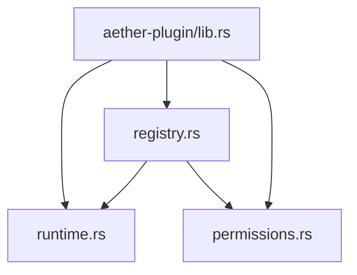
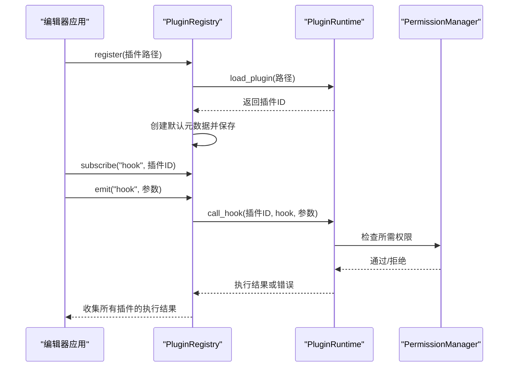
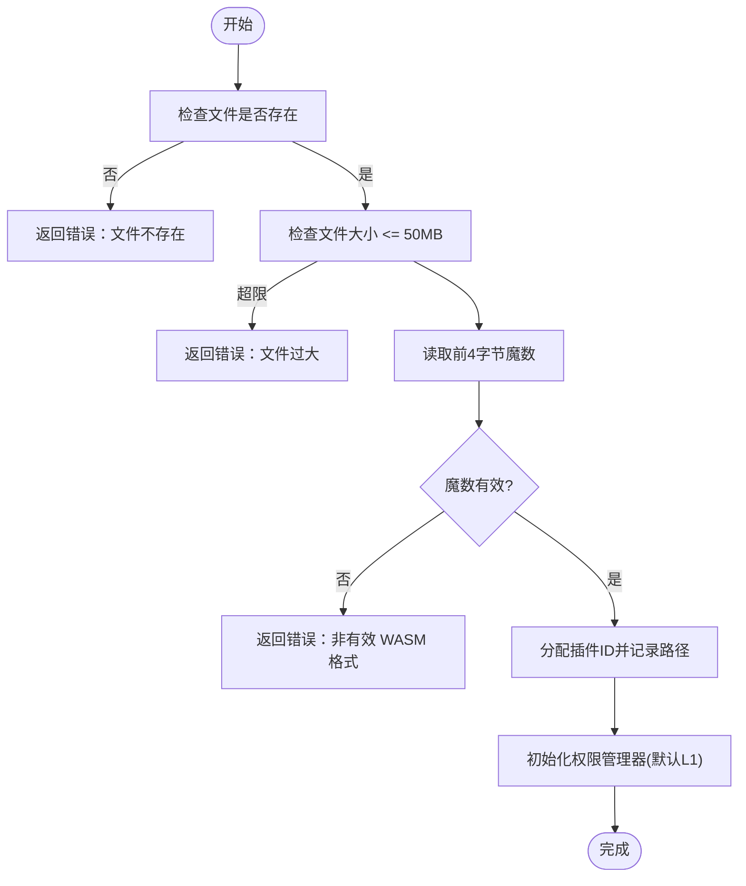
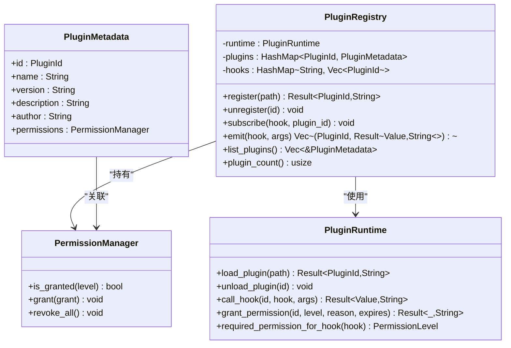
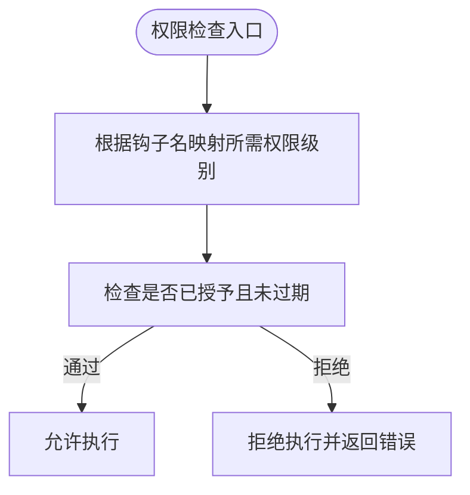
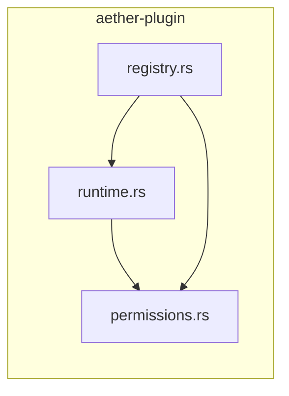

# 插件系统

<cite>
**本文引用的文件**
- [crates/aether-plugin/src/lib.rs](file://crates/aether-plugin/src/lib.rs)
- [crates/aether-plugin/src/runtime.rs](file://crates/aether-plugin/src/runtime.rs)
- [crates/aether-plugin/src/registry.rs](file://crates/aether-plugin/src/registry.rs)
- [crates/aether-plugin/src/permissions.rs](file://crates/aether-plugin/src/permissions.rs)
- [crates/aether-plugin/Cargo.toml](file://crates/aether-plugin/Cargo.toml)
- [README.md](file://README.md)
</cite>

## 目录
1. [简介](#简介)
2. [项目结构](#项目结构)
3. [核心组件](#核心组件)
4. [架构总览](#架构总览)
5. [详细组件分析](#详细组件分析)
6. [依赖关系分析](#依赖关系分析)
7. [性能与安全特性](#性能与安全特性)
8. [故障排查指南](#故障排查指南)
9. [结论](#结论)
10. [附录：插件开发指南与API参考](#附录插件开发指南与api参考)

## 简介
本文件为牧羊人编辑器的插件系统提供全面文档，重点覆盖 WASM 插件运行时的架构设计、插件加载机制、沙箱环境、内存隔离等安全特性；插件注册表的管理方式（发现、版本兼容、依赖管理）；权限控制系统的设计（细粒度权限分配、运行时权限检查）；以及完整的插件开发指南（开发环境搭建、API 参考、示例插件），帮助开发者编写自定义插件以扩展编辑器功能。

## 项目结构
插件系统位于 crates/aether-plugin 中，采用模块化组织：
- runtime：WASM 插件运行时（当前为架构占位实现，预留 wasmtime 集成点）
- registry：插件注册表（生命周期管理、钩子订阅与分发）
- permissions：权限模型与管理器（L1-L4 分级、有效期控制）
- lib：对外暴露的公共接口

图表来源
- [crates/aether-plugin/src/lib.rs:1-7](file://crates/aether-plugin/src/lib.rs#L1-L7)
- [crates/aether-plugin/src/registry.rs:1-23](file://crates/aether-plugin/src/registry.rs#L1-L23)
- [crates/aether-plugin/src/runtime.rs:1-21](file://crates/aether-plugin/src/runtime.rs#L1-L21)
- [crates/aether-plugin/src/permissions.rs:1-13](file://crates/aether-plugin/src/permissions.rs#L1-L13)

章节来源
- [crates/aether-plugin/src/lib.rs:1-7](file://crates/aether-plugin/src/lib.rs#L1-L7)
- [crates/aether-plugin/Cargo.toml:1-9](file://crates/aether-plugin/Cargo.toml#L1-L9)
- [README.md:162-178](file://README.md#L162-L178)

## 核心组件
- 插件运行时 PluginRuntime：负责插件加载、校验、ID 分配、权限绑定、钩子调用入口（当前为占位实现，未集成真实 WASM 引擎）。
- 插件注册表 PluginRegistry：维护已加载插件元数据、钩子订阅关系，提供注册/卸载、事件发射能力。
- 权限系统 PermissionManager + PermissionLevel：定义 L1_ReadOnly/L2_FileIO/L3_Network/L4_System 四级权限，支持授予、撤销、过期检查。
- 插件标识 PluginId：唯一标识每个已加载插件实例。

章节来源
- [crates/aether-plugin/src/runtime.rs:9-21](file://crates/aether-plugin/src/runtime.rs#L9-L21)
- [crates/aether-plugin/src/registry.rs:6-23](file://crates/aether-plugin/src/registry.rs#L6-L23)
- [crates/aether-plugin/src/permissions.rs:1-13](file://crates/aether-plugin/src/permissions.rs#L1-L13)

## 架构总览
插件系统由“注册表 + 运行时 + 权限”三层组成：
- 注册表负责插件的发现、注册、生命周期管理与事件分发。
- 运行时负责插件文件的验证、加载、权限绑定与钩子调用（当前为占位，预留 wasmtime 集成）。
- 权限系统在每次钩子调用前进行细粒度检查，确保最小权限原则。

图表来源
- [crates/aether-plugin/src/registry.rs:34-91](file://crates/aether-plugin/src/registry.rs#L34-L91)
- [crates/aether-plugin/src/runtime.rs:59-157](file://crates/aether-plugin/src/runtime.rs#L59-L157)
- [crates/aether-plugin/src/permissions.rs:62-94](file://crates/aether-plugin/src/permissions.rs#L62-L94)

## 详细组件分析

### 插件运行时（PluginRuntime）
- 插件加载流程：
  - 校验文件存在性、大小限制（最大 50MB）、WASM 魔数。
  - 分配唯一 ID，记录插件路径。
  - 为新插件初始化权限管理器，默认仅授予 L1_ReadOnly。
- 钩子调用流程：
  - 根据钩子名称映射到所需权限级别（如 on_save/write_file -> L2_FileIO；fetch/http_request/websocket -> L3_Network；exec/spawn/shell/run_command -> L4_System）。
  - 使用权限管理器检查是否具备所需权限。
  - 当前为占位实现，若权限通过但 WASM 引擎未集成，将返回明确错误提示。
- 资源清理：
  - 卸载插件时移除插件记录与对应权限管理器。

图表来源
- [crates/aether-plugin/src/runtime.rs:33-76](file://crates/aether-plugin/src/runtime.rs#L33-L76)

章节来源
- [crates/aether-plugin/src/runtime.rs:33-181](file://crates/aether-plugin/src/runtime.rs#L33-L181)

### 插件注册表（PluginRegistry）
- 插件元数据：包含 id、name、version、description、author、permissions。
- 生命周期管理：
  - register：调用运行时加载插件，创建默认元数据并保存。
  - unregister：卸载运行时插件、删除元数据、清理所有钩子订阅。
- 钩子系统：
  - subscribe：将插件订阅到指定钩子。
  - emit：遍历订阅者，调用运行时钩子，收集结果。

图表来源
- [crates/aether-plugin/src/registry.rs:6-23](file://crates/aether-plugin/src/registry.rs#L6-L23)
- [crates/aether-plugin/src/runtime.rs:9-21](file://crates/aether-plugin/src/runtime.rs#L9-L21)
- [crates/aether-plugin/src/permissions.rs:47-94](file://crates/aether-plugin/src/permissions.rs#L47-L94)

章节来源
- [crates/aether-plugin/src/registry.rs:25-101](file://crates/aether-plugin/src/registry.rs#L25-L101)

### 权限系统（PermissionManager + PermissionLevel）
- 权限级别：
  - L1_ReadOnly：只读 UI 访问
  - L2_FileIO：文件读写
  - L3_Network：网络访问
  - L4_System：系统命令执行
- 权限包含关系：L4 包含全部，L3 包含 L3/L2/L1，L2 包含 L2/L1，L1 仅包含自身。
- 权限授予：
  - 支持设置授予时间、可选过期时间、原因说明。
  - 过期检查：当 expires_at 存在时，判断当前时间是否超过过期时间或授予时间为未来时间。
- 运行时检查：
  - 每次钩子调用前，根据钩子名确定所需权限级别，再检查是否已授予且未过期。

图表来源
- [crates/aether-plugin/src/runtime.rs:159-175](file://crates/aether-plugin/src/runtime.rs#L159-L175)
- [crates/aether-plugin/src/permissions.rs:15-44](file://crates/aether-plugin/src/permissions.rs#L15-L44)
- [crates/aether-plugin/src/permissions.rs:67-94](file://crates/aether-plugin/src/permissions.rs#L67-L94)

章节来源
- [crates/aether-plugin/src/permissions.rs:1-94](file://crates/aether-plugin/src/permissions.rs#L1-L94)
- [crates/aether-plugin/src/runtime.rs:159-175](file://crates/aether-plugin/src/runtime.rs#L159-L175)

## 依赖关系分析
- aether-plugin 内部依赖：
  - runtime 依赖 permissions（权限检查）
  - registry 依赖 runtime 和 permissions（生命周期与事件分发）
- 外部依赖：
  - serde、serde_json（用于 JSON 序列化/反序列化）
- 与编辑器主程序的关系：
  - README 指出 aether-plugin 负责“插件注册、权限与运行时”，作为扩展系统的基石。

图表来源
- [crates/aether-plugin/src/runtime.rs:1-5](file://crates/aether-plugin/src/runtime.rs#L1-L5)
- [crates/aether-plugin/src/registry.rs:1-4](file://crates/aether-plugin/src/registry.rs#L1-L4)
- [crates/aether-plugin/Cargo.toml:6-8](file://crates/aether-plugin/Cargo.toml#L6-L8)

章节来源
- [crates/aether-plugin/Cargo.toml:1-9](file://crates/aether-plugin/Cargo.toml#L1-L9)
- [README.md:162-178](file://README.md#L162-L178)

## 性能与安全特性
- 性能
  - 插件大小限制：最大 50MB，避免加载超大模块影响启动与内存占用。
  - 钩子调用：按订阅列表顺序调用，结果聚合返回，便于上层统计与错误处理。
- 安全
  - 沙箱环境：当前为架构占位，预留 wasmtime 集成点，后续可启用真正的 WASM 沙箱隔离执行。
  - 内存隔离：通过 WASM 引擎隔离插件内存空间（待集成后生效）。
  - 权限最小化：新插件默认仅 L1_ReadOnly，敏感操作需显式授权。
  - 过期控制：权限可设置过期时间，防止长期滥用。
  - 输入校验：严格校验 WASM 魔数与文件大小，拒绝非法输入。

章节来源
- [crates/aether-plugin/src/runtime.rs:6-7](file://crates/aether-plugin/src/runtime.rs#L6-L7)
- [crates/aether-plugin/src/runtime.rs:33-57](file://crates/aether-plugin/src/runtime.rs#L33-L57)
- [crates/aether-plugin/src/permissions.rs:84-94](file://crates/aether-plugin/src/permissions.rs#L84-L94)

## 故障排查指南
- 常见错误及定位
  - 文件不存在：检查插件路径是否正确。
  - 非有效 WASM 格式：确认编译产物为合法 WASM，魔数正确。
  - 文件过大：压缩或拆分插件逻辑，控制在 50MB 以内。
  - 权限不足：为插件授予相应权限级别（如 write_file 需要 L2_FileIO）。
  - WASM 运行时尚未集成：当前为占位实现，需集成 wasmtime 后才能真正执行钩子。
- 调试建议
  - 查看 emit/call_hook 返回的错误信息，定位具体失败阶段。
  - 检查权限授予记录与过期时间，确保权限在有效期内。
  - 逐步缩小钩子范围，确认问题是否由特定钩子引发。

章节来源
- [crates/aether-plugin/src/runtime.rs:59-157](file://crates/aether-plugin/src/runtime.rs#L59-L157)
- [crates/aether-plugin/src/registry.rs:75-91](file://crates/aether-plugin/src/registry.rs#L75-L91)

## 结论
该插件系统提供了清晰的架构分层与完善的安全基线：通过注册表管理插件生命周期与事件分发，通过运行时进行插件加载与权限检查，通过权限系统实现细粒度控制。当前运行时处于架构占位阶段，预留了 wasmtime 集成点，便于后续启用真正的 WASM 沙箱与内存隔离。整体设计遵循最小权限原则，具备良好的可扩展性与安全性。

## 附录：插件开发指南与API参考

### 开发环境搭建
- 平台要求：Windows 10 1809+ / Windows 11，Rust stable 工具链，Visual Studio 2022 或 Windows SDK 构建工具。
- 构建与运行：参考仓库根 README 中的构建与运行命令，确保能编译 aether-win32 与 CLI。
- 插件目标：编译为 WASM 模块，确保魔数与大小符合运行时校验要求。

章节来源
- [README.md:85-118](file://README.md#L85-L118)

### API 参考
- 插件运行时（PluginRuntime）
  - new/load_plugin/unload_plugin/plugin_count/grant_permission/call_hook/required_permission_for_hook
- 插件注册表（PluginRegistry）
  - new/register/unregister/subscribe/emit/list_plugins/plugin_count
- 权限系统（PermissionManager + PermissionLevel）
  - is_granted/grant/revoke_all/description/contains

章节来源
- [crates/aether-plugin/src/runtime.rs:23-181](file://crates/aether-plugin/src/runtime.rs#L23-L181)
- [crates/aether-plugin/src/registry.rs:25-101](file://crates/aether-plugin/src/registry.rs#L25-L101)
- [crates/aether-plugin/src/permissions.rs:15-94](file://crates/aether-plugin/src/permissions.rs#L15-L94)

### 示例插件与扩展实践
- 钩子清单与权限映射
  - 只读：on_activate/on_deactivate/get_theme/get_language -> L1_ReadOnly
  - 文件：on_save/on_open/read_file/write_file -> L2_FileIO
  - 网络：fetch/http_request/websocket -> L3_Network
  - 系统：exec/spawn/shell/run_command -> L4_System
- 开发步骤
  - 编写插件逻辑，暴露所需钩子函数。
  - 编译为 WASM，确保魔数与大小合规。
  - 通过注册表注册插件，订阅相关钩子。
  - 按需授予权限，触发钩子并处理返回值。
- 注意事项
  - 当前为占位实现，钩子调用会返回“WASM 运行时尚未集成”的错误，需集成 wasmtime 后方可实际执行。
  - 权限必须显式授予，否则会被拒绝。

章节来源
- [crates/aether-plugin/src/runtime.rs:159-175](file://crates/aether-plugin/src/runtime.rs#L159-L175)
- [crates/aether-plugin/src/runtime.rs:151-157](file://crates/aether-plugin/src/runtime.rs#L151-L157)